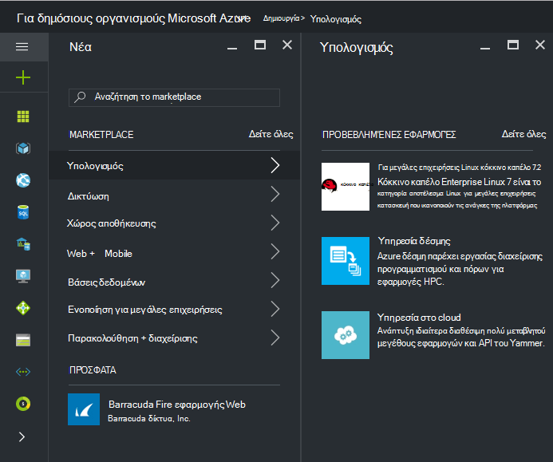
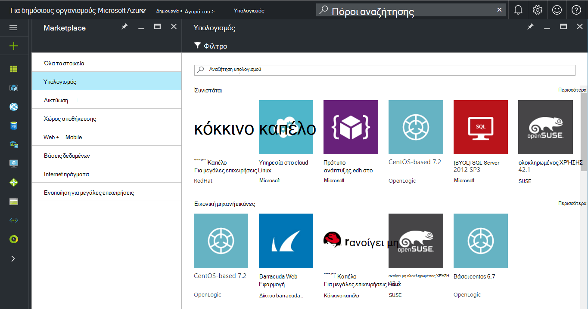
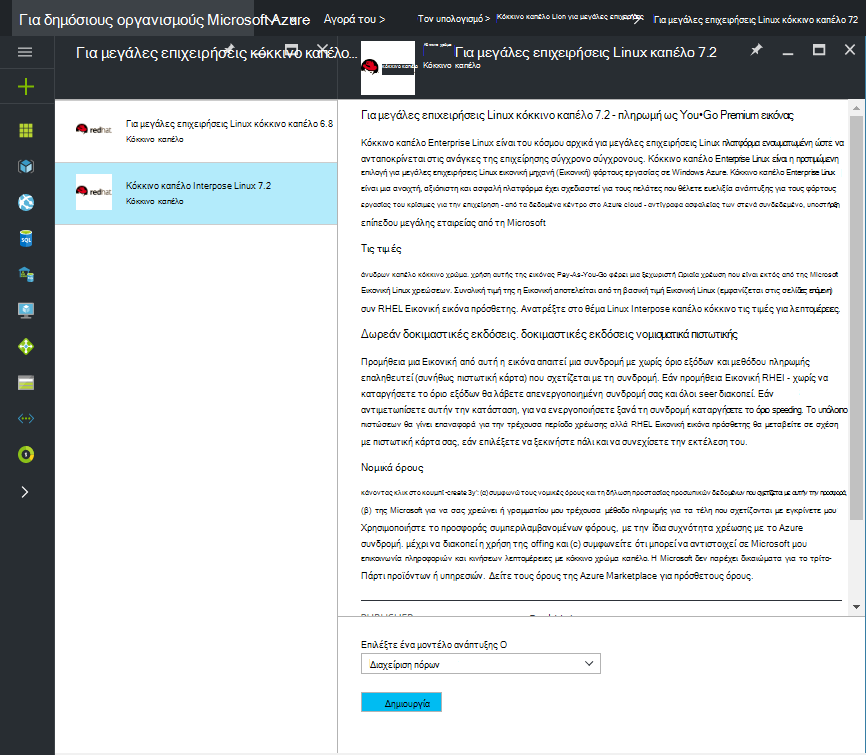
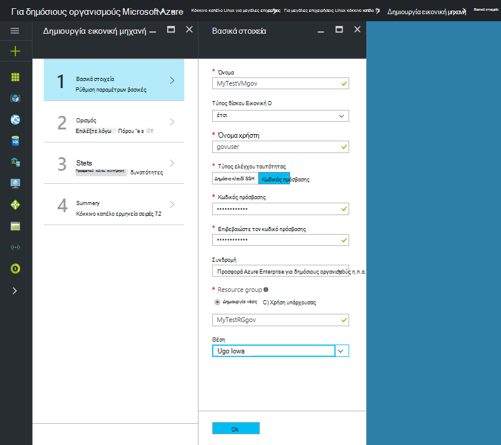
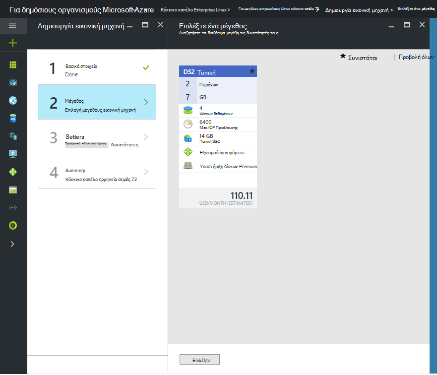

 <properties
    pageTitle="Azure τεκμηρίωση για δημόσιους οργανισμούς | Microsoft Azure"
    description="Παρέχει μια σύγκριση των δυνατοτήτων και καθοδήγηση στην ανάπτυξη εφαρμογών για δημόσιους οργανισμούς Azure."
    services="Azure-Government"
    cloud="gov"
    documentationCenter=""
    authors="VybavaRamadoss"
    manager="asimm"
    editor=""/>

<tags   ms.service="multiple"
    ms.devlang="na"
    ms.topic="article"
    ms.tgt_pltfrm="na"
    ms.workload="azure-government"
    ms.date="10/20/2016"
    ms.author="zakramer;vybavar"/>

# Azure Marketplace για δημόσιους οργανισμούς
Το Azure Marketplace είναι διαθέσιμο για δημόσιους οργανισμούς Azure με ενημερωμένη λίστα εικόνων από μας εκδότες marketplace. 

## Παραλλαγές
Ακολουθούν ορισμένα ζητήματα κατά τη χρήση του Azure Marketplace για δημόσιους οργανισμούς:

- Μόνο οι εικόνες μεταφορά των δικών άδειας χρήσης (BYOL) είναι διαθέσιμες. Δεν μπορείτε να αποκτήσετε πρόσβαση σε οποιαδήποτε εικόνα που απαιτεί συναλλαγή αγοράς μέσω του Azure Marketplace
- Μόνο ένα υποσύνολο των εικόνων είναι διαθέσιμη αυτήν τη στιγμή σε σύγκριση με το δημόσια marketplace. Μπορείτε να βρείτε τη λίστα των διαθέσιμων εικόνων [εδώ](../azure-government-image-gallery.md) 
- Πριν από την προμήθεια μιας εικόνας, διαχειριστή της εταιρείας σας πρέπει να ενεργοποιήσετε το αγορές Marketplace για τη συνδρομή σας στο Azure
  - Συνδεθείτε στην πύλη του ως διαχειριστής για μεγάλες επιχειρήσεις
  - Μεταβείτε στη *Διαχείριση*
  - Στην περιοχή *Λεπτομέρειες εγγραφής* , κάντε κλικ στο εικονίδιο μολυβιού δίπλα στο στοιχείο γραμμή *Azure Marketplace*
  - Διαδοχική *Ενεργοποίηση/απενεργοποίηση* ανάλογα με την περίπτωση
  - Κάντε κλικ στην επιλογή *Αποθήκευση*

>[AZURE.NOTE] Εάν σας ενδιαφέρει πραγματοποίηση τις εικόνες που είναι διαθέσιμες σε δημόσιους οργανισμούς Azure ανατρέξτε [οδηγίες προσθήκης λογαριασμών συνεργάτη](documentation-government-manage-marketplace-partners.md) για περισσότερες πληροφορίες.

### Βήμα 1
Εκκινήστε το Marketplace

  

### Βήμα 2
Περιηγηθείτε σε διαφορετικές προϊόντων για να βρείτε το σωστό αρχείο.

Το publisher marketplace παρέχει μια λίστα των πιστοποιήσεις ως μέρος του την περιγραφή του προϊόντος για να σας βοηθήσει να κάνετε τη σωστή επιλογή. 

### Βήμα 3
Επιλέξτε μια product\image

### Βήμα 4
Εκκίνηση της ροής δημιουργία και καταχωρήστε τις απαιτούμενες παραμέτρους για ανάπτυξη

>[AZURE.NOTE] Στην αναπτυσσόμενη λίστα θέση, είναι ορατές μόνο για δημόσιους οργανισμούς Azure θέσεις

### Βήμα 5
Παρατηρήστε τις τιμές

### Βήμα 6
Ολοκλήρωση όλων των βημάτων και κάντε κλικ στο κουμπί Ok για να ξεκινήσετε τη διαδικασία προετοιμασίας

## Επόμενα βήματα

Για συμπληρωματικές πληροφορίες και ενημερώσεις, εγγραφείτε στο [Ιστολόγιο του Microsoft Azure για δημόσιους οργανισμούς](https://blogs.msdn.microsoft.com/azuregov/).
