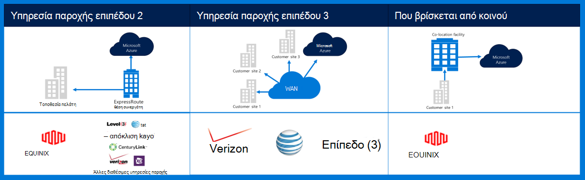
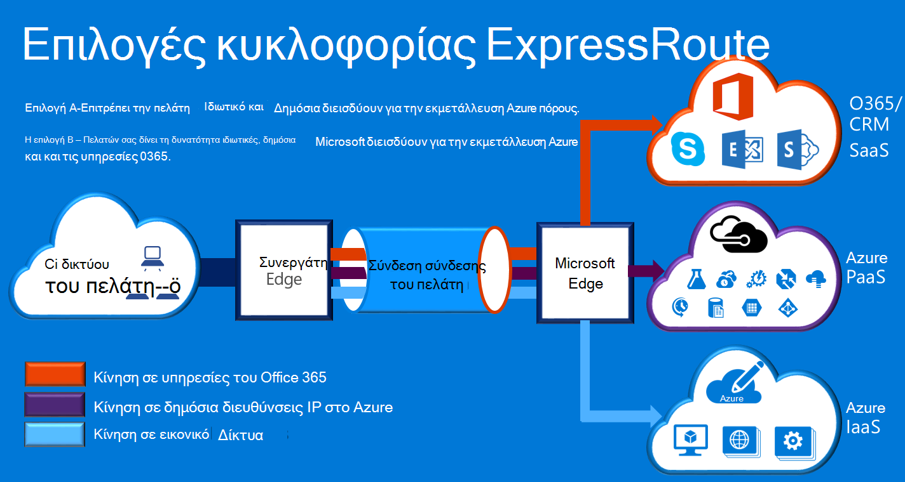

<properties
    pageTitle="Azure τεκμηρίωση Governmenmt | Microsoft Azure"
    description="Αυτή η δυνατότητα παρέχει μια σύγκριση των δυνατοτήτων και καθοδήγηση για ιδιωτικό συνδεσιμότητα με e για δημόσιους οργανισμούς"
    services="Azure-Government"
    cloud="gov" 
    documentationCenter=""
    authors="ryansoc"
    manager="zakramer"
    editor=""/>

<tags
    ms.service="multiple"
    ms.devlang="na"
    ms.topic="article"
    ms.tgt_pltfrm="na"
    ms.workload="azure-government"
    ms.date="09/28/2016"
    ms.author="ryansoc"/>

#  Δικτύωση Azure δημόσιους οργανισμούς

##  ExpressRoute (ιδιωτικό συνδεσιμότητας)

ExpressRoute είναι γενικά διαθέσιμο σε δημόσιους οργανισμούς Azure. Για περισσότερες πληροφορίες (συμπεριλαμβανομένων των συνεργατών και διεισδύουν θέσεις), ανατρέξτε στην <a href="https://azure.microsoft.com/en-us/documentation/services/expressroute/">τεκμηρίωση δημόσια ExpressRoute </a>.

###  Παραλλαγές

ExpressRoute είναι γενικά διαθέσιμο (GA) σε δημόσιους οργανισμούς Azure. 

- Για δημόσιους οργανισμούς πελάτες σύνδεσης σε φυσική απομόνωσης χωρητικότητα μέσω ένα αποκλειστικό σύνδεσης (Gov) για δημόσιους οργανισμούς Azure ExpressRoute (ER)

- Azure Gov παρέχει αυξημένη Διαθεσιμότητα & διάρκεια ζωής κεντρικά χρησιμοποιώντας πολλαπλά ζεύγη περιοχή βρίσκεται τουλάχιστον απομακρύνετε 500 μίλι 

- Από προεπιλογή όλα Azure Gov ER συνδεσιμότητα ρυθμισμένο ενεργούς πλεονάζοντα με την υποστήριξη για πλούσια και προσφέρει έως και 10 G κυκλώματος χωρητικότητα (μικρότερη είναι 50MB)

- Azure θέσεις Gov ER παρέχουν βελτιστοποιημένη περιόδων (πιο μικρή μεταπηδήσεις, χαμηλή λανθάνων χρόνος, υψηλές επιδόσεις, κ.λπ.) για τους πελάτες και περιοχές παν πλεονάζοντα Azure Gov

- Δεν χρησιμοποιεί το Azure Gov ER ιδιωτικής σύνδεσης, αλλαγή ή εξαρτώνται από το Internet

- Azure Gov φυσική και λογική υποδομή φυσικά είναι αφοσιωμένη και διαχωρισμένες και πρόσβαση περιορίζεται στα πρόσωπα η.π.α.

- Microsoft ανήκει και λειτουργεί όλα υποδομή ίνα μεταξύ περιοχών Gov Azure και ικανοποιούν ER Gov Azure-εγώ θέσεις

- Συνδεσιμότητα με υπηρεσίες cloud της Microsoft Azure, O365 και CRM παρέχει Azure Gov ER

### Ζητήματα

Υπάρχουν δύο βασικές υπηρεσίες που παρέχουν συνδεσιμότητας ιδιωτικού δικτύου σε δημόσιους οργανισμούς Azure: VPN (τοποθεσίας σε τοποθεσία για έναν τυπικό οργανισμό) και ExpressRoute.

Azure ExpressRoute χρησιμοποιείται για τη δημιουργία ιδιωτικές συνδέσεις μεταξύ Azure για δημόσιους οργανισμούς κέντρα δεδομένων και την υποδομή εσωτερική σας ή σε ένα περιβάλλον παράθεση. Συνδέσεις ExpressRoute υπερβαίνει τα μέσω του δημόσιου Internet — προσφέρουν περισσότερες αξιοπιστία μεγαλύτερες ταχύτητες και κάτω των αδρανειών από τυπικές συνδέσεις στο Internet. Σε ορισμένες περιπτώσεις, χρησιμοποιούν συνδέσεις ExpressRoute για τη μεταφορά δεδομένων μεταξύ σε συστήματα εσωτερικής εγκατάστασης και σημαντική Azure απόδοσης κόστους πλεονεκτήματα.   

Με ExpressRoute, μπορείτε να δημιουργήσετε συνδέσεις σε Azure σε μια θέση ExpressRoute (όπως μια υπηρεσία παροχής εγκατάστασης Exchange) ή απευθείας συνδέεστε στο Azure από το δίκτυό σας υπάρχοντα WAN (όπως ένα πολλαπλά πρωτόκολλα ετικέτας αλλαγής VPN (MPLS), που παρέχονται από μια υπηρεσία παροχής δικτύου).

    

Για τις υπηρεσίες του δικτύου για την υποστήριξη εφαρμογών πελάτη Azure για δημόσιους οργανισμούς και τις λύσεις, συνιστάται ιδιαίτερα να ότι έχει υλοποιηθεί ExpressRoute (ιδιωτικό συνδεσιμότητας) για να συνδεθείτε με δημόσιους οργανισμούς Azure. Εάν χρησιμοποιούνται συνδέσεις VPN, τα ακόλουθα πρέπει να θεωρούνται:

- Οι πελάτες πρέπει να επικοινωνήσετε με τους εξουσιοδότηση υπάλληλος/οργανισμού για να προσδιορίσετε αν απαιτείται ιδιωτικό συνδεσιμότητας ή άλλο μηχανισμό ασφαλούς σύνδεσης και για τον προσδιορισμό τυχόν πρόσθετους περιορισμούς πρέπει να λάβετε υπόψη.

- Οι πελάτες θα πρέπει να αποφασίσετε εάν θα αναθέτουν ότι η σύνδεση VPN-τοποθεσίας δρομολογείται μέσω μιας ζώνης ιδιωτικό συνδεσιμότητας.

- Οι πελάτες θα πρέπει να προμηθευτείτε ένα κύκλωμα MPLS ή VPN με μια υπηρεσία παροχής πρόσβασης με την άδεια χρήσης ιδιωτικό συνδεσιμότητας.

Όλοι οι πελάτες που χρησιμοποιούν μια αρχιτεκτονική ιδιωτικό συνδεσιμότητας πρέπει να επαληθεύσετε ότι ένα κατάλληλο εφαρμογή είναι σε εξέλιξη και διατηρούνται για τη σύνδεση πελάτη με την πύλη δικτύου/Internet (GN / να) ακμή δρομολογητή οριοθέτηση σημείο για δημόσιους οργανισμούς Azure. Ομοίως, την εταιρεία σας πρέπει να πραγματοποιήσει σύνδεση δικτύου μεταξύ του περιβάλλον εσωτερικής εγκατάστασης και πύλης δικτύου/πελάτη (GN C) άκρη δρομολογητή οριοθέτηση σημείου για δημόσιους οργανισμούς Azure.

## Επόμενα βήματα

Για συμπληρωματικές πληροφορίες και ενημερώσεις επικοινωνήστε εγγραφή του <a href="https://blogs.msdn.microsoft.com/azuregov/">ιστολόγιο του Microsoft Azure για δημόσιους οργανισμούς.</a>
