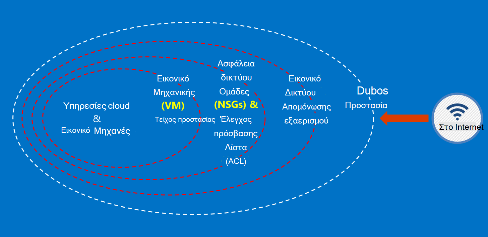

<properties
    pageTitle="Azure τεκμηρίωση για δημόσιους οργανισμούς | Microsoft Azure"
    description="Αυτό παρέχει ένα όσον αφορά τα των δυνατοτήτων και καθοδήγηση στην ανάπτυξη εφαρμογών για δημόσιους οργανισμούς Azure"
    services="Azure-Government"
    cloud="gov" 
    documentationCenter=""
    authors="ryansoc"
    manager="zakramer"
    editor=""/>

<tags
    ms.service="multiple"
    ms.devlang="na"
    ms.topic="article"
    ms.tgt_pltfrm="na"
    ms.workload="azure-government"
    ms.date="08/25/2016"
    ms.author="ryansoc"/>

#  Επισκόπηση τεκμηρίωσης Azure δημόσιους οργανισμούς

##  Εισαγωγή στην τεκμηρίωση Azure δημόσιους οργανισμούς

Αυτή η τοποθεσία περιγράφει τις δυνατότητες των υπηρεσιών [Microsoft Azure για δημόσιους οργανισμούς](https://azure.microsoft.com/features/gov/) και παρέχει γενικές οδηγίες ισχύουν για όλους τους πελάτες. Πριν από την συμπεριλαμβανομένων των συγκεκριμένα οργανωμένη δεδομένων στη συνδρομή σας για δημόσιους οργανισμούς Azure, πρέπει να εξοικειωθείτε με τις δυνατότητες για δημόσιους οργανισμούς Azure και επικοινωνήστε με την ομάδα το λογαριασμό σας Εάν έχετε ερωτήσεις.

Θα πρέπει να ανατρέξετε στη [Σελίδα συμμόρφωσης Microsoft του Κέντρου αξιοπιστίας Azure](http://www.microsoft.com/en-us/TrustCenter/Compliance/default.aspx) για τρέχουσες πληροφορίες σχετικά με τις υπηρεσίες για δημόσιους οργανισμούς Azure που καλύπτονται από το συγκεκριμένο πιστοποιήσεις και τους κανονισμούς. Πρόσθετες υπηρεσίες της Microsoft ενδέχεται να είναι επίσης διαθέσιμες, αλλά δεν είναι εντός του πεδίου εφαρμογής των υπηρεσιών Azure για δημόσιους οργανισμούς καλύπτεται και δεν επιλύονται από αυτό το έγγραφο. Azure υπηρεσιών για δημόσιους οργανισμούς ενδέχεται επίσης να επιτρέψει να χρησιμοποιήσετε μια ποικιλία επιπλέον πόρους, εφαρμογές ή υπηρεσίες που παρέχονται από τρίτους κατασκευαστές — ή από τη Microsoft στην περιοχή ξεχωριστή όρους των πολιτικών χρήση και προστασία προσωπικών δεδομένων — που δεν περιλαμβάνονται στην εμβέλεια αυτού του εγγράφου. Είστε υπεύθυνοι για την εξέταση τους όρους της όλα όπως "το πρόσθετο" προσφορές, όπως προσφορές αγοράς, για να βεβαιωθείτε ότι πληρούν τις ανάγκες σας όσον αφορά το συμμόρφωσης.

Azure δημόσιους οργανισμούς είναι διαθέσιμη σε οντοτήτων που χειρίζονται δεδομένα που είναι υπόκεινται σε απαιτήσεις (όπως NIST 800.171 (DIB), ITAR, IRS 1075, L4 Υπουργείο Άμυνας και CJIS) και ορισμένες κυβερνητικούς κανονισμούς σχετικά όπου απαιτείται χρήση του Azure για δημόσιους οργανισμούς για συμμόρφωση με τους κανονισμούς. Azure πελάτες για δημόσιους οργανισμούς υπόκεινται επικύρωση της καταλληλότητας.

Οντοτήτων με ερωτήσεις σχετικά με καταλληλότητας για δημόσιους οργανισμούς Azure πρέπει να συμβουλευτείτε τους ομάδας λογαριασμού.

##  Αρχές για την ασφάλεια των δεδομένων πελάτη σε Azure δημόσιους οργανισμούς

Azure δημόσιους οργανισμούς παρέχει μια ποικιλία δυνατοτήτων και των υπηρεσιών που μπορείτε να χρησιμοποιήσετε για τη δημιουργία λύσεων cloud για να ανταποκρίνεται στις ανάγκες σας οργανωμένη/ελέγχονται δεδομένων. Μια λύση συμβατή πελάτη είναι τίποτε από την αποτελεσματική εφαρμογή των δυνατοτήτων για δημόσιους οργανισμούς Azure εκτός του πλαισίου, διαθέτοντας πρακτική ασφαλείας συμπαγές δεδομένων.
Όταν φιλοξενείτε μια λύση στο Azure για δημόσιους οργανισμούς, Microsoft χειρίζεται πολλές από αυτές τις απαιτήσεις στο επίπεδο της υποδομής cloud.

Το παρακάτω διάγραμμα παρουσιάζει το Azure μοντέλο προστασία σε βάθος. Για παράδειγμα, η Microsoft παρέχει υποδομή βασικές cloud DDOS, μαζί με τις δυνατότητες πελάτη, όπως εξοπλισμός ασφαλείας για τον συγκεκριμένο πελάτη εφαρμογής DDOS πρέπει.

Αυτή η σελίδα περιγράφει τις βασικές αρχές για την ασφάλεια των υπηρεσιών σας και των εφαρμογών, παρέχοντας οδηγίες και βέλτιστες πρακτικές σχετικά με τον τρόπο για να εφαρμοστούν αυτές οι αρχές; με άλλα λόγια, πώς οι πελάτες θα πρέπει να αξιοποιήσετε smart Azure για δημόσιους οργανισμούς να πληροί τις υποχρεώσεις και καθήκοντα που απαιτούνται για μια λύση που χειρίζεται τις πληροφορίες ITAR.

Οι overarching αρχές για την ασφάλεια των δεδομένων πελατών είναι:
* Προστασία δεδομένων με τη χρήση κρυπτογράφησης
* Διαχείριση απορρήτου
* Απομόνωσης για να περιορίσετε την πρόσβαση σε δεδομένα

##  Προστασία δεδομένων πελατών που χρησιμοποιεί κρυπτογράφηση

Διακοπής κινδύνου και συσκέψεων ρυθμιστικές υποχρεώσεις οδηγείτε η αυξανόμενη εστίαση και σπουδαιότητα της κρυπτογράφησης δεδομένων. Χρησιμοποιήστε μια εφαρμογή αποτελεσματική κρυπτογράφησης για τη βελτίωση της τρέχουσας μέτρα ασφαλείας δικτύου και εφαρμογή — και να μειώσετε το συνολικό κίνδυνο το περιβάλλον cloud.

### Κρυπτογράφηση στο υπόλοιπο
Την κρυπτογράφηση των δεδομένων στο υπόλοιπο ισχύει για την προστασία του περιεχομένου πελατών που θα διατηρούνται στο χώρο αποθήκευσης στο δίσκο. Υπάρχουν πολλοί τρόποι αυτό μπορεί να συμβεί:

### Κρυπτογράφηση της υπηρεσίας χώρου αποθήκευσης

Azure κρυπτογράφηση υπηρεσία χώρου αποθήκευσης είναι ενεργοποιημένη σε επίπεδο λογαριασμού χώρου αποθήκευσης, αποτέλεσμα στα αντικείμενα BLOB μπλοκ και αντικείμενα BLOB σελίδας που έχει τεθεί κρυπτογραφούνται αυτόματα κατά την εγγραφή στο χώρο αποθήκευσης Azure. Κατά την ανάγνωση δεδομένων από το χώρο αποθήκευσης Azure, θα αποκρυπτογράφηση από την υπηρεσία αποθήκευσης πριν από την επιστροφή. Χρησιμοποιήστε αυτήν την επιλογή για την προστασία των δεδομένων σας χωρίς να χρειάζεται να τροποποιήσετε ή να προσθέσετε κώδικα σε όλες τις εφαρμογές.

### Κρυπτογράφηση Azure δίσκου
Χρήση της κρυπτογράφησης Azure δίσκου για να κρυπτογραφήσετε το λειτουργικό σύστημα δίσκων και δίσκων δεδομένων που χρησιμοποιούνται από ένα Azure εικονική μηχανή. Ενοποίηση με το Azure κλειδί θάλαμο παρέχει στοιχείου ελέγχου και συμβάλλει στη διαχείριση των κλειδιών κρυπτογράφησης του δίσκου.

### Κρυπτογράφηση πλευρά του προγράμματος-πελάτη
Κρυπτογράφηση πλευρά του προγράμματος-πελάτη είναι ενσωματωμένο στο Java της και το πρόγραμμα-πελάτη χώρου αποθήκευσης .NET βιβλιοθήκες, οι οποίες μπορούν να χρησιμοποιούν API θάλαμο Azure αριθμού-κλειδιού, καθιστώντας απλές για την υλοποίηση. Χρησιμοποιήστε Azure θάλαμο αριθμού-κλειδιού για να αποκτήσετε πρόσβαση το απόρρητο στο θάλαμο πλήκτρο Azure για συγκεκριμένα άτομα χρησιμοποιώντας Azure Active Directory.

### Κρυπτογράφηση κατά τη μεταφορά

Η βασική κρυπτογράφησης διαθέσιμη για σύνδεση με δημόσιους οργανισμούς Azure υποστηρίζει το πρωτόκολλο ασφάλεια επιπέδου μεταφοράς (TLS) 1.2 και πιστοποιητικά X.509. Federal πληροφορίες επεξεργασίας τυπική (FIPS) αλγορίθμους κρυπτογράφησης επιπέδου 1 140-2 μπορούν επίσης να χρησιμοποιηθούν για την υποδομή δικτύου συνδέσεις μεταξύ Azure για δημόσιους οργανισμούς κέντρα δεδομένων.  Windows Server 2012 R2 και Windows 8-plus ΣΠΣ και κοινόχρηστα στοιχεία αρχείων Azure να χρησιμοποιήσετε 3.0 Ερωτήσεων κρυπτογράφησης μεταξύ του Εικονική και κοινή χρήση των αρχείων. Χρήση της κρυπτογράφησης πλευρά του προγράμματος-πελάτη για την κρυπτογράφηση των δεδομένων πριν να μεταφερθούν στο χώρο αποθήκευσης σε μια εφαρμογή προγράμματος-πελάτη και να αποκρυπτογραφήσετε τα δεδομένα μετά από αυτό μεταφέρεται από το χώρο αποθήκευσης.

### Βέλτιστες πρακτικές για την κρυπτογράφηση

* IaaS ΣΠΣ: Χρήση της κρυπτογράφησης Azure δίσκου. Ενεργοποιήστε την κρυπτογράφηση της υπηρεσίας χώρου αποθήκευσης για την κρυπτογράφηση των αρχείων VHD που χρησιμοποιούνται για τη δημιουργία αντιγράφων ασφαλείας αυτών των δίσκων στο χώρο αποθήκευσης Azure, αλλά αυτό μόνο κρυπτογραφεί τα δεδομένα που μόλις χειρόγραφων. Αυτό σημαίνει ότι, εάν δημιουργήσετε μια Εικονική και, στη συνέχεια, ενεργοποίηση κρυπτογράφησης υπηρεσία αποθήκευσης στο λογαριασμό του χώρου αποθήκευσης που περιέχει το αρχείο VHD, μόνο οι αλλαγές θα είναι κρυπτογραφημένες, όχι το αρχικό αρχείο VHD.
* Κρυπτογράφηση πλευρά του προγράμματος-πελάτη: Αυτή είναι η πιο ασφαλής μέθοδος για την κρυπτογράφηση των δεδομένων σας, επειδή κρυπτογραφεί πριν από τη μεταφορά και κρυπτογραφεί τα δεδομένα στο υπόλοιπο. Ωστόσο, το απαιτούν που μπορείτε να προσθέσετε κώδικα σε χώρο αποθήκευσης, οι οποίες δεν μπορεί να θέλετε να κάνετε με τις εφαρμογές σας. Σε αυτές τις περιπτώσεις, μπορείτε να χρησιμοποιήσετε HTTPs για τα δεδομένα σας στο τη μεταφορά και το χώρο αποθήκευσης υπηρεσίας κρυπτογράφησης για την κρυπτογράφηση των δεδομένων στο υπόλοιπο. Κρυπτογράφηση πλευρά του προγράμματος-πελάτη περιλαμβάνει επίσης την περισσότερες φόρτωσης του υπολογιστή-πελάτη — πρέπει να υπόψη στα σχέδιά σας κλιμάκωση, ιδίως αν είστε κρυπτογράφηση και μεταφορά πολλά δεδομένα.

Για περισσότερες πληροφορίες σχετικά με τις επιλογές κρυπτογράφησης στο Azure, ανατρέξτε στον [Οδηγό ασφαλείας χώρου αποθήκευσης](/storage-security-guide).

##  Προστασία δεδομένων πελατών από τη Διαχείριση απορρήτου

Διαχείριση ασφαλούς κλειδιών είναι απαραίτητη για την προστασία των δεδομένων στο cloud. Οι πελάτες θα πρέπει να προσπαθήστε να απλοποιήσετε διαχείρισης κλειδιών και τον έλεγχο των πλήκτρων που χρησιμοποιούνται από το cloud εφαρμογών και υπηρεσιών για την κρυπτογράφηση των δεδομένων.

### Βέλτιστες πρακτικές για τη Διαχείριση απορρήτου

* Χρησιμοποιήστε θάλαμο αριθμού-κλειδιού για να ελαχιστοποιήσετε τους κινδύνους του απορρήτου εκτίθενται μέσω αρχείων σχεδιασμένου ρύθμισης παραμέτρων, δέσμες ενεργειών, ή στον πηγαίο κώδικα. Azure θάλαμο πλήκτρο κρυπτογραφεί κλειδιά (όπως των κλειδιών κρυπτογράφησης κρυπτογράφησης δίσκο Azure) και απορρήτου (όπως κωδικούς πρόσβασης), αποθηκεύοντας τους σε FIPS 140-2 επιπέδου 2 επικυρώνονται λειτουργικές μονάδες ασφαλείας υλικού (HSMs). Για πρόσθετες εξασφάλισης αναβάθμισης, μπορείτε να εισαγάγετε ή να δημιουργία των κλειδιών σε αυτές τις HSMs.
* Κώδικα της εφαρμογής και πρότυπα πρέπει να περιέχει μόνο URI αναφορές σε το απόρρητο (που σημαίνει ότι η πραγματική απόρρητο δεν βρίσκονται σε κώδικα, ρύθμιση παραμέτρων ή πηγαίος κώδικας αποθετήρια). Αυτό αποτρέπει επιθέσεις ψαρέματος κλειδιού στην εσωτερική ή εξωτερική repos, όπως τα συγκομιδή-BOT στο GitHub.
* Χρησιμοποιούν ισχυρό στοιχείων ελέγχου RBAC μέσα σε θάλαμο αριθμού-κλειδιού. Εάν έναν τελεστή αξιόπιστων αποχωρεί από την εταιρεία ή τον μεταφορές σε μια νέα ομάδα εντός της εταιρείας, αυτά θα πρέπει να μην να αποκτήσει πρόσβαση του απορρήτου.  

Για περισσότερες πληροφορίες ανατρέξτε στο θέμα [Θάλαμο αριθμού-κλειδιού για δημόσιους οργανισμούς Azure](/azure-government/azure-government-tech-keyvault)

##  Απομόνωσης για να περιορίσετε την πρόσβαση σε δεδομένα

Απομόνωσης είναι όλα σχετικά με τη χρήση όρια αγοράς και κοντέινερ για να περιορίσετε την πρόσβαση μόνο σε εξουσιοδοτημένους χρήστες, τις υπηρεσίες και τις εφαρμογές δεδομένων. Για παράδειγμα, ο διαχωρισμός μεταξύ μισθωτές είναι ένας μηχανισμός βασικές ασφαλείας για πλατφόρμες multitenant cloud όπως το Windows Azure. Λογική απομόνωσης βοηθά στην αποτροπή ένα μισθωτή του παρασκηνίου με τις λειτουργίες του τυχόν άλλες μισθωτή.

### Απομόνωση περιβάλλοντος
Το περιβάλλον για δημόσιους οργανισμούς Azure είναι μια φυσική παρουσία που είναι ξεχωριστό από το υπόλοιπο του δικτύου της Microsoft. Αυτό είναι δυνατό μέσω μιας σειράς φυσική και λογική στοιχεία ελέγχου που περιλαμβάνουν τα εξής: ασφάλεια των φυσικών εμπόδια χρησιμοποιώντας Βιομετρικές συσκευές και φωτογραφικές μηχανές.  Χρήση των συγκεκριμένων διαπιστευτήρια και έλεγχο ταυτότητας πολλαπλών παραγόντων από το προσωπικό της Microsoft που απαιτούν λογική πρόσβαση στο περιβάλλον παραγωγής.  Όλα υποδομή υπηρεσίας για δημόσιους οργανισμούς Azure βρίσκεται τις Ηνωμένες Πολιτείες.

#### Απομόνωσης ανά πελάτη
Έλεγχος πρόσβασης δικτύου Azure υλοποιεί και ο διαχωρισμός μέσω VLAN απομόνωσης, ACL, φόρτωση balancers και φίλτρα IP

Οι πελάτες να απομονώσετε περαιτέρω τους πόρους σε συνδρομές, ομάδες πόρων, εικονικό δίκτυα και δευτερεύοντα δίκτυα.

Για περισσότερες πληροφορίες σχετικά με την απομόνωση στο Microsoft Azure, ανατρέξτε στην [ενότητα απομόνωσης του Οδηγού ασφάλειας Azure](/azure-security-getting-started/#isolation).

Για συμπληρωματικές πληροφορίες και ενημερώσεις επικοινωνήστε εγγραφή του <a href="https://blogs.msdn.microsoft.com/azuregov/">ιστολόγιο του Microsoft Azure για δημόσιους οργανισμούς.</a>
