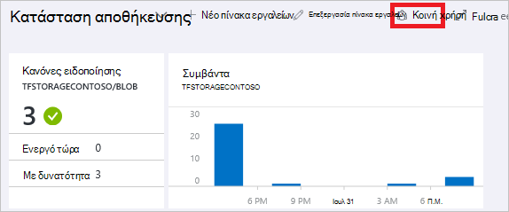
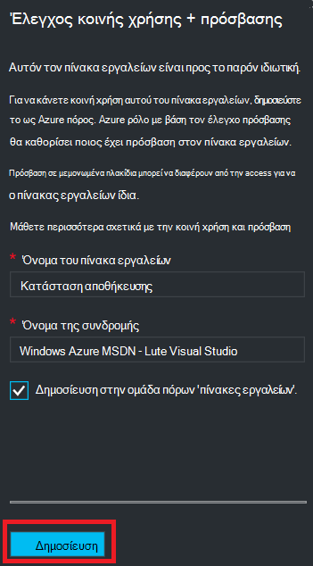
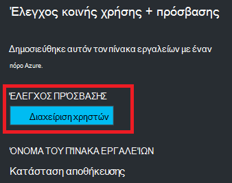
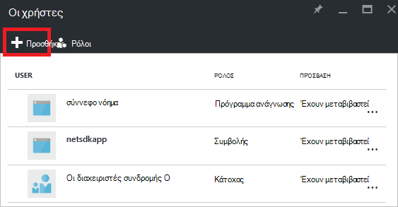
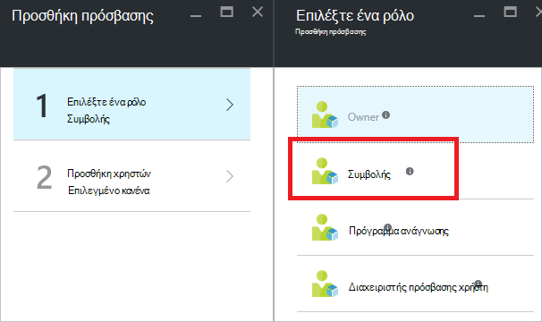
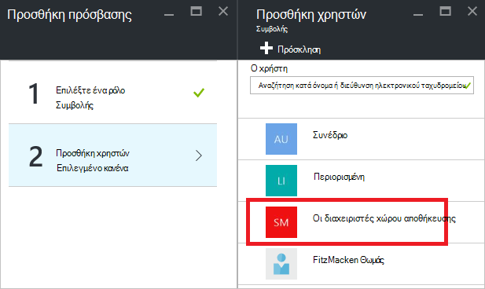
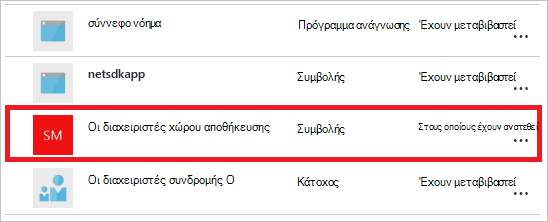

<properties
   pageTitle="Πρόσβαση Azure πύλης πίνακα εργαλείων | Microsoft Azure"
   description="Σε αυτό το άρθρο εξηγεί τον τρόπο κοινής χρήσης της πρόσβασης σε έναν πίνακα εργαλείων στην πύλη του Azure."
   services="azure-portal"
   documentationCenter=""
   authors="tfitzmac"
   manager="timlt"
   editor="tysonn"/>

<tags
   ms.service="multiple"
   ms.devlang="NA"
   ms.topic="article"
   ms.tgt_pltfrm="NA"
   ms.workload="na"
   ms.date="08/01/2016"
   ms.author="tomfitz"/>

# Κοινή χρήση πινάκων εργαλείων Azure

Μετά τη ρύθμιση των παραμέτρων ενός πίνακα εργαλείων, μπορείτε να δημοσιεύσετε και να το μοιραστείτε με άλλους χρήστες στον οργανισμό σας. Μπορείτε να επιτρέψετε άλλους για πρόσβαση στον πίνακα εργαλείων σας με χρήση του Azure [Έλεγχος πρόσβασης βάσει ρόλων](../active-directory/role-based-access-control-configure.md). Μπορείτε να αντιστοιχίσετε ένα χρήστη ή μια ομάδα χρηστών σε ένα ρόλο και συγκεκριμένο ρόλο Καθορίζει εάν αυτοί οι χρήστες μπορούν να προβάλετε ή να τροποποιήσετε δημοσιευμένα πίνακα εργαλείων. 

Όλοι οι πίνακες εργαλείων δημοσιευμένη υλοποιούνται ως Azure πόρους, που σημαίνει ότι μπορούν να υπάρχει ως διαχειρίσιμα στοιχεία εντός τη συνδρομή σας και να περιέχονται σε μια ομάδα πόρων.  Από την πλευρά ενός στοιχείου ελέγχου πρόσβασης, οι πίνακες εργαλείων είναι δεν διαφέρει από άλλους πόρους, όπως μια εικονική μηχανή ή ένα λογαριασμό του χώρου αποθήκευσης.

> [AZURE.TIP] Μεμονωμένες παραθέσεις στον πίνακα εργαλείων επιβολή τις δικές τους απαιτήσεις έλεγχος πρόσβασης βάσει των πόρων που εμφανίζονται.  Γι ' αυτό, μπορείτε να σχεδιάσετε έναν πίνακα εργαλείων που έχει θέσει σε κοινή χρήση ευρέως ενώ εξακολουθείτε να προστατεύετε τα δεδομένα σε μεμονωμένα πλακίδια.

## Κατανόηση του ελέγχου πρόσβασης για τους πίνακες εργαλείων

Με τον έλεγχο πρόσβασης βάσει ρόλων, μπορείτε να αντιστοιχίσετε χρήστες σε ρόλους σε τρία διαφορετικά επίπεδα εμβέλειας:

- συνδρομή
- ομάδα πόρων
- πόρων

Εκχωρείτε δικαιώματα μεταβιβάζονται από τη συνδρομή προς τα κάτω για τον πόρο. Το δημοσιευμένο πίνακα εργαλείων είναι ένας πόρος. Επομένως, ενδέχεται να έχετε ήδη τους χρήστες που έχουν εκχωρηθεί σε ρόλους για τη συνδρομή που λειτουργούν επίσης για το δημοσιευμένο πίνακα εργαλείων. 

Ακολουθεί ένα παράδειγμα.  Ας υποθέσουμε ότι έχετε μια συνδρομή του Azure και διάφορα μέλη της ομάδας σας έχουν εκχωρηθεί τους ρόλους του **κατόχου**, **συνεργάτη**ή το **πρόγραμμα ανάγνωσης** για τη συνδρομή. Οι χρήστες που είναι κάτοχοι ή συνεργατών μπορούν να λίστας, προβολή, δημιουργία, τροποποίηση ή διαγραφή πινάκων εργαλείων εντός της συνδρομής.  Οι χρήστες που είναι οι αναγνώστες μπορούν να πίνακες εργαλείων λίστας και προβολή, αλλά δεν είναι δυνατό να τροποποίηση ή διαγραφή τους.  Οι χρήστες με δικαιώματα πρόσβασης αναγνώστη έχουν τη δυνατότητα να κάνετε τοπική αλλαγές σε ένα δημοσιευμένο πίνακα εργαλείων (, όπως κατά την αντιμετώπιση προβλημάτων του ζητήματος), αλλά δεν έχουν τη δυνατότητα να δημοσιεύσετε αυτές τις αλλαγές στο διακομιστή.  Θα έχουν τη δυνατότητα να κάνετε ένα ιδιωτικό αντίγραφο του πίνακα εργαλείων για τον εαυτό τους

Ωστόσο, μπορεί επίσης να εκχωρήσετε δικαιώματα, στην ομάδα πόρων που περιέχει πολλούς πίνακες εργαλείων ή ένα μεμονωμένο στον πίνακα εργαλείων. Για παράδειγμα, μπορεί να αποφασίσετε ότι μια ομάδα χρηστών θα πρέπει να έχετε περιορισμένα δικαιώματα κατά μήκος τη συνδρομή, αλλά μεγαλύτερη πρόσβαση σε έναν συγκεκριμένο πίνακα εργαλείων. Μπορείτε να αντιστοιχίσετε αυτούς τους χρήστες σε ένα ρόλο για αυτόν τον πίνακα εργαλείων. 

## Δημοσίευση πίνακα εργαλείων

Ας υποθέσουμε ότι έχετε ολοκληρώσει τη ρύθμιση των παραμέτρων ενός πίνακα εργαλείων που θέλετε να κάνετε κοινή χρήση με μια ομάδα χρηστών στη συνδρομή σας. Τα παρακάτω βήματα απεικονίζουν μια προσαρμοσμένη ομάδα που ονομάζεται διαχειριστές χώρου αποθήκευσης, αλλά μπορείτε να ονομάσετε την ομάδα σας ό, τι θέλετε. Για πληροφορίες σχετικά με τη δημιουργία μιας ομάδας του Active Directory και την προσθήκη χρηστών σε αυτήν την ομάδα, ανατρέξτε στο θέμα [Διαχείριση ομάδων στο Azure Active Directory](../active-directory/active-directory-accessmanagement-manage-groups.md).

1. Στον πίνακα εργαλείων, επιλέξτε **κοινή χρήση**.

     

2. Πριν από την εκχώρηση πρόσβασης, πρέπει να δημοσιεύσετε τον πίνακα εργαλείων. Από προεπιλογή, στον πίνακα εργαλείων θα δημοσιευτεί σε μια ομάδα πόρων με το όνομα **πίνακες εργαλείων**. Επιλέξτε **Δημοσίευση**.

     

Τώρα είναι Δημοσιευμένος στον πίνακα εργαλείων σας. Εάν τα δικαιώματα που έχουν μεταβιβαστεί από τη συνδρομή είναι κατάλληλο, δεν χρειάζεται να κάνετε τίποτα περισσότερα. Άλλοι χρήστες στον οργανισμό σας θα μπορούν να πρόσβαση και την τροποποίηση του πίνακα εργαλείων που βασίζεται σε ρόλο τους επιπέδου συνδρομή. Ωστόσο, για αυτό το πρόγραμμα εκμάθησης, ας αντιστοίχιση μιας ομάδας χρηστών σε ένα ρόλο για αυτόν τον πίνακα εργαλείων.

## Εκχώρηση πρόσβασης σε έναν πίνακα εργαλείων

1. Μετά τη δημοσίευση του πίνακα εργαλείων, επιλέξτε **Διαχείριση χρηστών**.

     

2. Θα δείτε μια λίστα με τους υπάρχοντες χρήστες που έχουν ήδη ανατεθεί ένα ρόλο για αυτόν τον πίνακα εργαλείων. Λίστα των υπαρχόντων χρηστών θα είναι διαφορετική από την εικόνα που ακολουθεί. Το πιο πιθανό τις αναθέσεις μεταβιβάζονται από τη συνδρομή. Για να προσθέσετε ένα νέο χρήστη ή μια ομάδα, επιλέξτε **Προσθήκη**.

     

3. Επιλέξτε το ρόλο που αντιπροσωπεύει τα δικαιώματα που θέλετε να εκχωρήσετε. Για αυτό το παράδειγμα, επιλέξτε **συμβολής**.

     

4. Επιλέξτε το χρήστη ή την ομάδα που θέλετε να αντιστοιχίσετε στο ρόλο. Εάν δεν βλέπετε το χρήστη ή την ομάδα που αναζητάτε στη λίστα, χρησιμοποιήστε το πλαίσιο αναζήτησης. Λίστα των διαθέσιμων ομάδων θα εξαρτώνται από τις ομάδες που δημιουργήσατε στην υπηρεσία καταλόγου Active Directory.

      

5. Όταν ολοκληρώσετε την προσθήκη χρηστών ή ομάδων, επιλέξτε **OK**. 

6. Η νέα ανάθεση προστίθεται στη λίστα των χρηστών. Παρατηρήστε ότι το **Access** παρατίθεται ως **εκχωρημένες** και όχι **μεταβιβαστεί**.

     

## Επόμενα βήματα

- Για μια λίστα με τους ρόλους, ανατρέξτε στο θέμα [RBAC: ενσωματωμένη ρόλους](../active-directory/role-based-access-built-in-roles.md).
- Για να μάθετε περισσότερα σχετικά με τη διαχείριση των πόρων, ανατρέξτε στο θέμα [Διαχείριση Azure πόρους μέσω πύλης](resource-group-portal.md).