<properties
   pageTitle="Πίνακες εργαλείων Azure πύλης | Microsoft Azure"
   description="Σε αυτό το άρθρο εξηγεί πώς μπορείτε να δημιουργήσετε και να επεξεργαστείτε τους πίνακες εργαλείων στην πύλη του Azure."
   services="azure-portal"
   documentationCenter=""
   authors="sewatson"
   manager="timlt"
   editor="tysonn"/>

<tags
   ms.service="multiple"
   ms.devlang="NA"
   ms.topic="article"
   ms.tgt_pltfrm="NA"
   ms.workload="na"
   ms.date="09/06/2016"
   ms.author="sewatson"/>

# Δημιουργία και κοινή χρήση πινάκων εργαλείων στην πύλη του Azure

Μπορείτε να δημιουργήσετε πολλούς πίνακες εργαλείων και να κάνετε κοινή χρήση τους με άλλους χρήστες που έχουν πρόσβαση σε όλες τις συνδρομές σας Azure.  Αυτή η καταχώρηση, έχετε τα βασικά στοιχεία για τη δημιουργία/επεξεργασία, δημοσίευση και τη διαχείριση της πρόσβασης στους πίνακες εργαλείων.

## Προσαρμογή πινάκων εργαλείων έναντι πτερύγια

Μετά την εκκίνηση πίνακες εργαλείων πριν από μερικά μήνες, σημειώθηκε σταθερή μείωση blade προσαρμογών και μια γρήγορη αύξηση στον πίνακα εργαλείων προσαρμογών. Αυτή η τάση ισχυρό χρήση εμφανίζει που προτιμάτε προσαρμογή πινάκων εργαλείων μέσω λεπίδες. Για να υποστηρίζουν αυτή την τάση, θα σας θα καταργήσει τη δυνατότητα να προσαρμόσετε λεπίδες και να χρησιμοποιηθεί μας προσπάθειες για βελτίωση λειτουργίες πίνακα εργαλείων. Εάν έχετε προσαρμόσει μια blade, προσαρμογή σας σύντομα θα καταργηθεί. Για να διατηρήσετε που προσαρμογής, καρφιτσώσετε τα προσαρμοσμένα πλακίδια σε έναν πίνακα εργαλείων. Απλώς κάντε δεξί κλικ στο πλακίδιο και επιλέξτε **το Pin στον πίνακα εργαλείων** , όπως φαίνεται στην παρακάτω εικόνα.

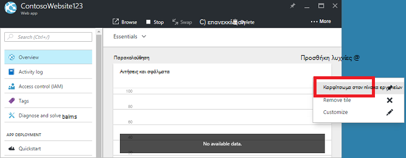

## Δημιουργία ενός πίνακα εργαλείων

Για να δημιουργήσετε έναν πίνακα εργαλείων, επιλέξτε το κουμπί **νέου πίνακα εργαλείων** δίπλα στο όνομα του τρέχοντος πίνακα εργαλείων.  

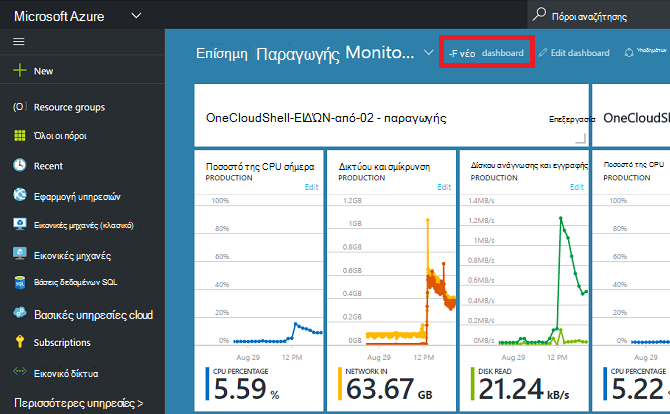

Αυτή η ενέργεια δημιουργεί μια νέα, κενή, ιδιωτικό πίνακα εργαλείων και που θέτει σε λειτουργία προσαρμογής, όπου μπορείτε να ονομάσετε στον πίνακα εργαλείων σας και να προσθέσετε ή να αναδιατάξετε τα πλακίδια.  Όταν βρίσκεστε σε αυτήν την κατάσταση λειτουργίας, τη συλλογή συμπτυσσόμενες πλακίδιο μεταφέρει πάνω από το αριστερό μενού περιήγησης.  Η συλλογή πλακίδιο σάς επιτρέπει να βρείτε τα πλακίδια για τους πόρους Azure σας με διάφορους τρόπους: μπορείτε να κάνετε αναζήτηση από [ομάδα πόρων](../azure-resource-manager/resource-group-overview.md#resource-groups), με βάση τον τύπο πόρου, με βάση την [ετικέτα](../resource-group-using-tags.md)ή κάνοντας αναζήτηση για τον πόρο με βάση το όνομα.  

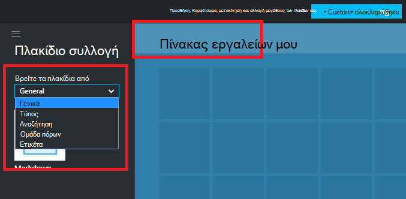

Προσθέστε τα πλακίδια με μεταφορά και απόθεση στην επιφάνεια που πίνακα εργαλείων, κάθε φορά που θέλετε.

Υπάρχει μια νέα κατηγορία που ονομάζεται **Γενικά** για τα πλακίδια που δεν σχετίζονται με ένα συγκεκριμένο πόρο.  Σε αυτό το παράδειγμα, θα σας να καρφιτσώσετε το πλακίδιο Markdown.  Μπορείτε να χρησιμοποιήσετε αυτό το πλακίδιο για να προσθέσετε προσαρμοσμένο περιεχόμενο στον πίνακα εργαλείων σας.  Το πλακίδιο υποστηρίζει απλού κειμένου, [Markdown σύνταξη](https://daringfireball.net/projects/markdown/syntax)και ένα περιορισμένο σύνολο HTML.  (Για την ασφάλεια, δεν μπορείτε να κάνετε πράγματα όπως εισαγωγής `<script>` των ετικετών ή χρησιμοποιήστε το συγκεκριμένο στοιχείο στυλ CSS που μπορεί να παρεμβάλλεται με την πύλη.) 

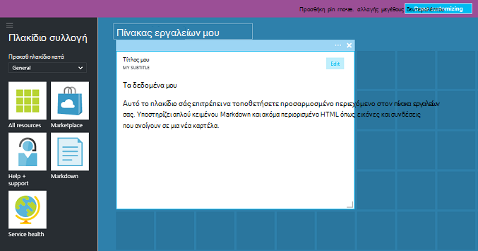

## Επεξεργασία ενός πίνακα εργαλείων

Μετά τη δημιουργία του πίνακα εργαλείων, μπορείτε να καρφιτσώσετε πλακίδια από τη συλλογή πλακίδιο ή το πλακίδιο αναπαράσταση των λεπίδων. Ας καρφιτσώσετε η αναπαράσταση της μας ομάδας πόρων. Μπορείτε να κάνετε κάποιο pin όταν κάνετε περιήγηση στο στοιχείο ή από το blade ομάδα πόρων. Και οι δύο αυτές προσεγγίσεις έχουν ως αποτέλεσμα Καρφίτσωμα του πλακιδίου αναπαράσταση της ομάδας πόρων.

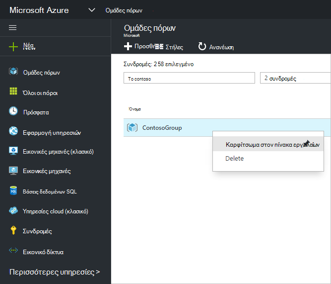

Μετά την Καρφίτσωμα του στοιχείου, εμφανίζεται στον πίνακα εργαλείων σας.

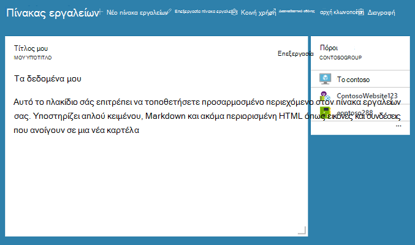

Τώρα που έχουμε ένα πλακίδιο Markdown και μια ομάδα πόρων καρφιτσωμένα στον πίνακα εργαλείων, να αλλάξετε το μέγεθος και να αναδιατάξετε τα πλακίδια σε μια κατάλληλη διάταξη.

Δείκτης του ποντικιού περνά και επιλέγοντας "..." ή κάνοντας δεξί κλικ σε ένα πλακίδιο, μπορείτε να δείτε όλες τις εντολές με βάση τα συμφραζόμενα για αυτό το πλακίδιο. Από προεπιλογή, υπάρχουν δύο στοιχεία:

1. **Ξεκαρφίτσωμα από πίνακα εργαλείων** – καταργεί το πλακίδιο από τον πίνακα εργαλείων
2.  **Προσαρμογή** – εισάγει Προσαρμογή λειτουργία

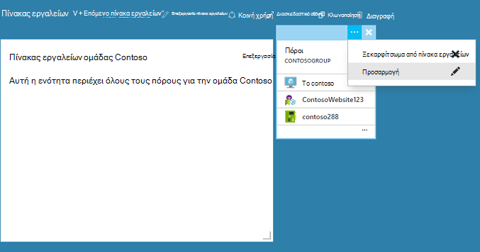

Επιλέγοντας το στοιχείο προσαρμογή, μπορείτε να αλλάξετε το μέγεθος και να αναδιατάξετε τα πλακίδια. Για να αλλάξετε το μέγεθος ένα πλακίδιο, επιλέξτε το νέο μέγεθος από το μενού με βάση τα συμφραζόμενα, όπως φαίνεται στην παρακάτω εικόνα.

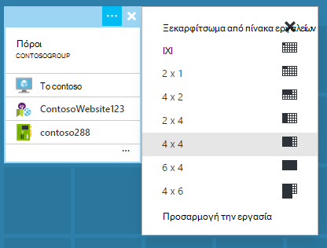

Εναλλακτικά, εάν το πλακίδιο υποστηρίζει οποιουδήποτε μεγέθους, μπορείτε να σύρετε την κάτω δεξιά γωνία στο επιθυμητό μέγεθος.

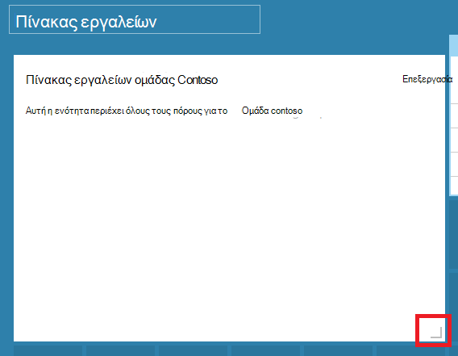

Μετά την αλλαγή μεγέθους πλακιδίων, δείτε τον πίνακα εργαλείων.

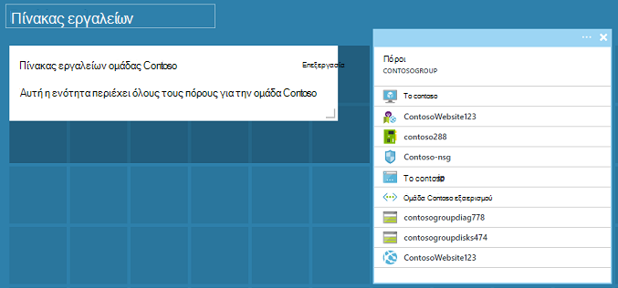

Αφού ολοκληρώσετε την προσαρμογή ενός πίνακα εργαλείων, απλώς επιλέξτε την **εργασία Προσαρμογή** για να εξέλθετε από προσαρμογή λειτουργία ή κάντε δεξί κλικ και επιλέξτε **την εργασία Προσαρμογή** από το μενού περιβάλλοντος.

## Δημοσίευση ενός πίνακα εργαλείων και να διαχειριστείτε τον έλεγχο πρόσβασης

Όταν δημιουργείτε έναν πίνακα εργαλείων, είναι ιδιωτικό από προεπιλογή, γεγονός που σημαίνει ότι είστε το μοναδικό άτομο που μπορεί να το δει.  Για να είναι ορατές σε άλλους χρήστες, χρησιμοποιήστε το κουμπί **κοινή χρήση** που εμφανίζεται μαζί με τις άλλες εντολές πίνακα εργαλείων.

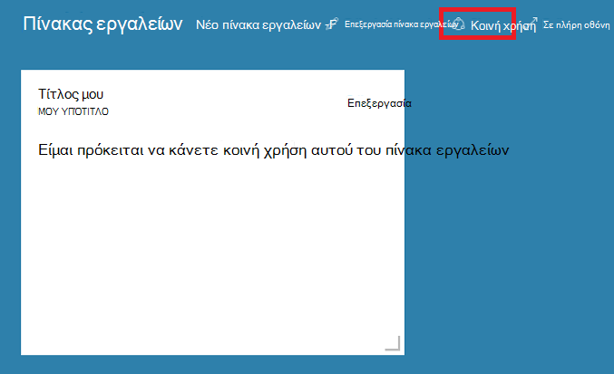

Σας ζητείται να επιλέξετε μια συνδρομή και ομάδα πόρων για τον πίνακα εργαλείων για να δημοσιευτεί. Για να ενσωματώσετε απρόσκοπτα πίνακες εργαλείων σε στο περιβάλλον εμπορικής προσαρμογής, έχουμε υλοποιήσει κοινόχρηστο πίνακες εργαλείων ως πόρους Azure (, ώστε να μπορείτε δεν είναι δυνατό να κάνετε κοινή χρήση, πληκτρολογώντας μια διεύθυνση ηλεκτρονικού ταχυδρομείου).  [Έλεγχος πρόσβασης βάσει ρόλων Azure](../active-directory/role-based-access-control-configure.md )διαχειρίζεται πρόσβαση στις πληροφορίες που εμφανίζονται από το μεγαλύτερο από τα πλακίδια στην πύλη του. Από την πλευρά ενός στοιχείου ελέγχου πρόσβασης, κοινόχρηστο πίνακες εργαλείων είναι δεν διαφέρει από μια εικονική μηχανή ή ένα λογαριασμό του χώρου αποθήκευσης.  

Ας υποθέσουμε ότι έχετε μια συνδρομή του Azure και τα μέλη της ομάδας σας έχουν εκχωρηθεί τους ρόλους του **κατόχου**, **συμβολής**ή του **προγράμματος ανάγνωσης** της συνδρομής.  Οι χρήστες που είναι κάτοχοι ή συνεργατών μπορούν να λίστας, προβολή, δημιουργία, τροποποίηση ή διαγραφή πινάκων εργαλείων μέσα σε αυτήν τη συνδρομή.  Οι χρήστες που είναι οι αναγνώστες μπορούν να πινάκων εργαλείων λίστας και προβολή, αλλά δεν είναι δυνατό να τροποποίηση ή διαγραφή τους.  Οι χρήστες με δικαιώματα πρόσβασης αναγνώστη έχουν τη δυνατότητα να κάνετε αλλαγές τοπικά σε έναν κοινόχρηστο πίνακα εργαλείων, αλλά δεν έχουν τη δυνατότητα να δημοσιεύσετε αυτές τις αλλαγές στο διακομιστή.  Ωστόσο, μπορούν να κάνουν ένα ιδιωτικό αντίγραφο του πίνακα εργαλείων για το δικό τους χρήση.  Όπως πάντα, μεμονωμένα πλακίδια στον πίνακα εργαλείων επιβολή τις δικές τους κανόνες ελέγχου πρόσβασης με βάση τους πόρους που αντιστοιχούν.  

Για τη διευκόλυνσή σας, την πύλη δημοσίευσης εμπειρία καθοδήγηση προς ένα μοτίβο όπου μπορείτε να τοποθετήσετε τους πίνακες εργαλείων σε μια ομάδα πόρων που ονομάζεται **πίνακες εργαλείων**.  

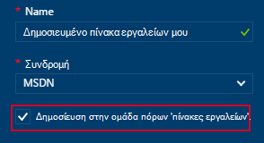

Μπορείτε επίσης να επιλέξετε δημοσίευση ενός πίνακα εργαλείων σε μια συγκεκριμένη ομάδα πόρων.  Το στοιχείο ελέγχου πρόσβασης για αυτόν τον πίνακα εργαλείων συμφωνεί με τον έλεγχο πρόσβασης για την ομάδα πόρων.  Οι χρήστες που μπορούν να διαχειρίζονται πόρων σε αυτήν την ομάδα πόρων έχει επίσης πρόσβαση πίνακες εργαλείων.

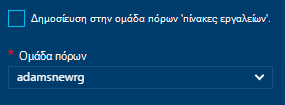

Μετά τη δημοσίευση του πίνακα εργαλείων, το παράθυρο έλεγχος **κοινής χρήσης + access** θα ανανέωση και που εμφανίζουν πληροφορίες σχετικά με τη δημοσιευμένη πίνακα εργαλείων, όπως μια σύνδεση για να διαχειριστείτε την πρόσβαση χρηστών στον πίνακα εργαλείων.  Αυτή η σύνδεση εκκινεί το τυπικό blade έλεγχος πρόσβασης βάσει ρόλων χρησιμοποιείται για να διαχειριστείτε την πρόσβαση για κάθε πόρο Azure.  Μπορείτε να πάντα επιστρέψετε σε αυτήν την προβολή, επιλέγοντας **κοινή χρήση**.

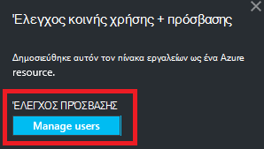

## Επόμενα βήματα

- Για να διαχειριστείτε τους πόρους, ανατρέξτε στο θέμα [Διαχείριση Azure πόρους μέσω πύλης](resource-group-portal.md).
- Για να αναπτύξετε τους πόρους, ανατρέξτε στο θέμα [Ανάπτυξη πόρους με πρότυπα διαχείρισης πόρων και Azure πύλη](../resource-group-template-deploy-portal.md).