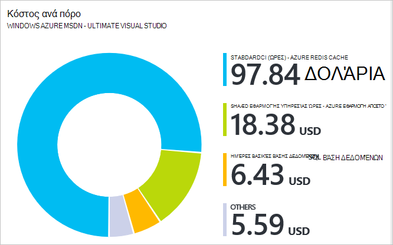

<properties 
    pageTitle="Χρήση Azure πύλη για τη Διαχείριση Azure πόρους | Microsoft Azure" 
    description="Χρησιμοποιήστε Azure πύλη και διαχείριση πόρων Azure για να διαχειριστείτε τους πόρους σας. Εμφανίζει τον τρόπο εργασίας με πίνακες εργαλείων για την παρακολούθηση πόρων." 
    services="azure-resource-manager,azure-portal" 
    documentationCenter="" 
    authors="tfitzmac" 
    manager="timlt" 
    editor="tysonn"/>

<tags 
    ms.service="azure-resource-manager" 
    ms.workload="multiple" 
    ms.tgt_pltfrm="na" 
    ms.devlang="na" 
    ms.topic="article" 
    ms.date="09/12/2016" 
    ms.author="tomfitz"/>

# Διαχείριση πόρων Azure μέσω πύλης

> [AZURE.SELECTOR]
- [Azure PowerShell](../powershell-azure-resource-manager.md)
- [Azure CLI](../xplat-cli-azure-resource-manager.md)
- [Πύλη](resource-group-portal.md) 
- [REST API](../resource-manager-rest-api.md)

Αυτό το θέμα δείχνει πώς μπορείτε να χρησιμοποιήσετε την [πύλη του Azure](https://portal.azure.com) με [Azure από διαχειριστή πόρων](../azure-resource-manager/resource-group-overview.md) για να διαχειριστείτε τους πόρους σας Azure. Για να μάθετε σχετικά με την ανάπτυξη πόρους μέσω της πύλης, ανατρέξτε στο θέμα [Ανάπτυξη πόρους με πρότυπα διαχείρισης πόρων και Azure πύλη](../resource-group-template-deploy-portal.md).

Προς το παρόν, δεν κάθε υπηρεσία υποστηρίζει η πύλη ή διαχείριση πόρων. Για αυτές τις υπηρεσίες, πρέπει να χρησιμοποιήσουν την [πύλη κλασική](https://manage.windowsazure.com). Για την κατάσταση κάθε υπηρεσίας, ανατρέξτε στο θέμα [γράφημα Azure διαθεσιμότητα πύλης](https://azure.microsoft.com/features/azure-portal/availability/).

## Διαχείριση ομάδων πόρων

1. Για να δείτε όλες τις ομάδες πόρων στη συνδρομή σας, επιλέξτε **ομάδες πόρων**.

    

1. Για να δημιουργήσετε μια ομάδα κενή πόρου, επιλέξτε **Προσθήκη**.

    

1. Δώστε ένα όνομα και μια θέση για τη νέα ομάδα πόρων. Επιλέξτε **Δημιουργία**.

    

1. Ίσως χρειαστεί να επιλέξετε **Ανανέωση** για να δείτε την ομάδα των πόρων που δημιουργήθηκαν πρόσφατα.

    

1. Για να προσαρμόσετε τις πληροφορίες που εμφανίζονται για τις ομάδες σας πόρου, επιλέξτε **στήλες**.

    

1. Επιλέξτε τις στήλες για να προσθέσετε και, στη συνέχεια, επιλέξτε **Ενημέρωση**.

    

1. Για να μάθετε σχετικά με την ανάπτυξη πόρους στη νέα ομάδα πόρων, ανατρέξτε στο θέμα [Ανάπτυξη πόρους με πρότυπα διαχείρισης πόρων και Azure πύλη](../resource-group-template-deploy-portal.md).

1. Για γρήγορη πρόσβαση σε μια ομάδα πόρων, μπορείτε να καρφιτσώσετε το blade στον πίνακα εργαλείων σας.

    

1. Πίνακας εργαλείων εμφανίζει την ομάδα των πόρων και τους πόρους. Μπορείτε να επιλέξετε είτε τις ομάδες πόρων ή οποιονδήποτε από τους πόρους για να μεταβείτε στο στοιχείο.

    

## Ετικέτα πόρων

Μπορείτε να εφαρμόσετε ετικέτες σε ομάδες πόρων και πόρους για την οργάνωση λογικά τους πόρους σας. Για πληροφορίες σχετικά με την εργασία με ετικέτες, ανατρέξτε στο θέμα [Χρήση ετικετών για να οργανώσετε το Azure πόρους](../resource-group-using-tags.md).

[AZURE.INCLUDE [resource-manager-tag-resource](../../includes/resource-manager-tag-resources.md)]

## Παρακολούθηση πόρων

Όταν επιλέγετε έναν πόρο, το blade πόρων παρουσιάζει προεπιλεγμένη γραφήματα και πίνακες για παρακολούθηση αυτόν τον τύπο πόρου.

1. Επιλέξτε έναν πόρο και παρατηρήστε ενότητα **παρακολούθησης** . Περιλαμβάνει γραφήματα που σχετίζονται με τον τύπο του πόρου. Η παρακάτω εικόνα εμφανίζει την προεπιλεγμένη παρακολούθηση δεδομένων για ένα λογαριασμό του χώρου αποθήκευσης.

    

1. Μπορείτε να καρφιτσώσετε μια ενότητα από το blade στον πίνακα εργαλείων σας, επιλέγοντας τα αποσιωπητικά (...) πάνω από την ενότητα. Μπορείτε να προσαρμόσετε το μέγεθος στην ενότητα σε το blade ή να καταργήσετε εντελώς. Η παρακάτω εικόνα δείχνει πώς μπορείτε να καρφιτσώσετε, προσαρμογή ή κατάργηση της ενότητας CPU και μνήμης.

    

1. Μετά την Καρφίτσωμα στην ενότητα στον πίνακα εργαλείων, θα δείτε τη σύνοψη στον πίνακα εργαλείων. Και, επιλέγοντάς το αμέσως σας μεταφέρει σε περισσότερες λεπτομέρειες σχετικά με τα δεδομένα.

    

1. Για να προσαρμόσετε εξ ολοκλήρου τα δεδομένα που παρακολουθεί με την πύλη, μεταβείτε στον πίνακα εργαλείων σας προεπιλεγμένο και επιλέξτε **νέο πίνακα εργαλείων**.

    

1. Δώστε ένα όνομα στο νέο πίνακα εργαλείων σας και σύρετε τα πλακίδια στη στον πίνακα εργαλείων. Τα πλακίδια έχουν φιλτραριστεί με διαφορετικές επιλογές.

    

     Για να μάθετε σχετικά με την εργασία με πίνακες εργαλείων, ανατρέξτε στο θέμα [Δημιουργία και κοινή χρήση πινάκων εργαλείων στην πύλη του Azure](azure-portal-dashboards.md).

## Διαχείριση πόρων

Στο το blade για έναν πόρο, μπορείτε να δείτε τις επιλογές για τη διαχείριση του πόρου. Η πύλη παρουσιάζει επιλογές διαχείρισης για το συγκεκριμένο τύπο συγκεκριμένο πόρο. Μπορείτε να δείτε τις εντολές της διαχείρισης στο επάνω μέρος του το blade πόρων και, στην αριστερή πλευρά.

Από αυτές τις επιλογές, μπορείτε να εκτελέσετε λειτουργίες όπως η έναρξη και διακοπή μια εικονική μηχανή ή ξανά τις παραμέτρους των ιδιοτήτων η εικονική μηχανή.

## Μετακίνηση πόρων

Εάν χρειάζεστε για να μετακινήσετε πόρων σε μια άλλη ομάδα πόρων ή σε μια άλλη συνδρομή, ανατρέξτε στο θέμα [Μετακίνηση πόρων για νέα ομάδα πόρων ή τη συνδρομή](../resource-group-move-resources.md).

## Κλείδωμα πόροι

Μπορείτε να κλειδώσετε μια συνδρομή, ομάδα πόρων, ή έναν πόρο για να αποτρέψετε άλλους χρήστες στην εταιρεία σας από τη διαγραφή ή την τροποποίηση κρίσιμες πόρους κατά λάθος. Για περισσότερες πληροφορίες, ανατρέξτε στο θέμα [πόροι κλείδωμα με τη διαχείριση πόρων Azure](../resource-group-lock-resources.md).

[AZURE.INCLUDE [resource-manager-lock-resources](../../includes/resource-manager-lock-resources.md)]

## Προβάλετε τη συνδρομή σας και κόστους

Μπορείτε να προβάλετε πληροφορίες σχετικά με τη συνδρομή σας και τις τιμές κόστους συνάθροισης για όλους τους πόρους σας. Επιλέξτε **συνδρομές** και τη συνδρομή που θέλετε να δείτε. Ενδέχεται να έχετε μόνο μία συνδρομή για να το επιλέξετε.

Εντός του blade συνδρομή, μπορείτε να δείτε μια χρέωση εγγραφής.

Και ανάλυση του κόστους ανά τύπο πόρου.

## Εξαγωγή προτύπου

Μετά τη ρύθμιση του ομάδα πόρων, ενδέχεται να θέλετε να προβάλετε το πρότυπο διαχείρισης πόρων για την ομάδα πόρων. Εξαγωγή του προτύπου προσφέρει δύο πλεονεκτήματα:

1. Μπορείτε εύκολα να αυτοματοποιήσετε μελλοντικές αναπτύξεις της λύσης επειδή το πρότυπο περιέχει όλα τα πλήρη υποδομή.

2. Μπορείτε να εξοικειωθείτε με σύνταξης προτύπου, εάν ανατρέξετε στο το JavaScript αντικείμενο σημειογραφία (JSON) που αντιπροσωπεύει τη λύση σας.

Για αναλυτικές οδηγίες, ανατρέξτε στο θέμα [Εξαγωγή από διαχειριστή πόρων Azure πρότυπο από υπάρχοντες πόρους](../resource-manager-export-template.md).

## Διαγραφή ομάδας πόρων ή πόρων

Διαγραφή μιας ομάδας πόρων διαγράφει όλους τους πόρους που περιέχονται σε αυτό. Μπορείτε επίσης να διαγράψετε μεμονωμένες πόρους μέσα σε μια ομάδα πόρων. Θέλετε να να είστε προσεκτικοί όταν διαγράφετε μια ομάδα πόρων, επειδή μπορεί να είναι πόροι σε άλλες ομάδες πόρων που είναι συνδεδεμένα με αυτό. Διαχείριση πόρων δεν διαγράφει συνδεδεμένων πόρους, αλλά δεν μπορεί να λειτουργούν σωστά χωρίς το αναμενόμενο πόρους.

## Επόμενα βήματα

- Για να προβάλετε αρχεία καταγραφής ελέγχου, ανατρέξτε στο θέμα [ελέγχου λειτουργιών με τη διαχείριση πόρων](../resource-group-audit.md).
- Για την αντιμετώπιση σφαλμάτων ανάπτυξης, ανατρέξτε στο θέμα [Αντιμετώπιση προβλημάτων αναπτύξεις ομάδα πόρων με την πύλη Azure](../resource-manager-troubleshoot-deployments-portal.md).
- Για να αναπτύξετε τους πόρους μέσω της πύλης, ανατρέξτε στο θέμα [Ανάπτυξη πόρους με πρότυπα διαχείρισης πόρων και Azure πύλη](../resource-group-template-deploy-portal.md).
- Για να διαχειριστείτε την πρόσβαση σε πόρους, ανατρέξτε στο θέμα [Χρήση εκχωρήσεις ρόλων για τη διαχείριση της πρόσβασης σε πόρους Azure τη συνδρομή σας](../active-directory/role-based-access-control-configure.md).

