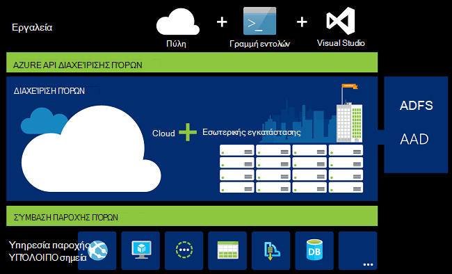
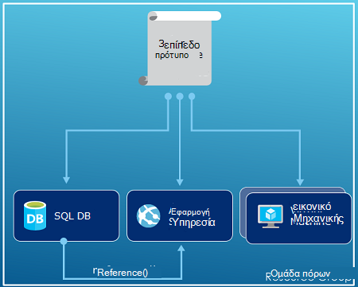
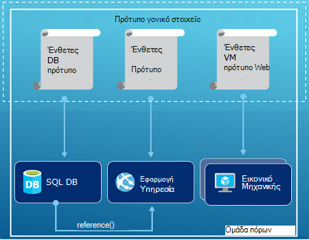
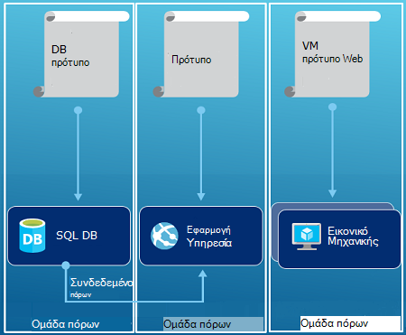

<properties
   pageTitle="Azure Επισκόπηση της διαχείρισης πόρων | Microsoft Azure"
   description="Περιγράφει πώς μπορείτε να χρησιμοποιήσετε τη διαχείριση πόρων Azure για ανάπτυξη, διαχείριση, και τον έλεγχο πρόσβασης πόρων σε Azure."
   services="azure-resource-manager"
   documentationCenter="na"
   authors="tfitzmac"
   manager="timlt"
   editor="tysonn"/>

<tags
   ms.service="azure-resource-manager"
   ms.devlang="na"
   ms.topic="get-started-article"
   ms.tgt_pltfrm="na"
   ms.workload="na"
   ms.date="10/21/2016"
   ms.author="tomfitz"/>

# Azure Επισκόπηση της διαχείρισης πόρων

Η υποδομή για την εφαρμογή σας είναι συνήθως που αποτελείται από πολλά στοιχεία – ίσως μια εικονική μηχανή, το λογαριασμό χώρου αποθήκευσης, και εικονικού δικτύου, ή μια εφαρμογή web, βάση δεδομένων, διακομιστή βάσης δεδομένων και τρίτου κατασκευαστή υπηρεσίες. Δεν βλέπετε αυτά τα στοιχεία ως ξεχωριστή πρόσωπα, αντί για αυτό μπορείτε δείτε τους ως σχετικές και μικρότερα τμήματα μία οντότητα. Θέλετε να αναπτύξετε, διαχείριση και την παρακολούθηση τους ως ομάδα. Azure διαχείριση πόρων σάς επιτρέπει να εργαστείτε με τους πόρους στη λύση σας ως ομάδα. Να αναπτύξετε, ενημέρωση, ή να διαγράψετε όλους τους πόρους για τη λύση σε μια ενιαία, συντονισμένη λειτουργία. Μπορείτε να χρησιμοποιήσετε ένα πρότυπο για ανάπτυξη και μπορεί να λειτουργήσει αυτό το πρότυπο για διαφορετικά περιβάλλοντα όπως δοκιμές, ενδιάμεσου σταδίου και παραγωγής. Διαχείριση πόρων παρέχει ασφάλεια, έλεγχος και δυνατότητες που θα σας βοηθήσουν να διαχειριστείτε τους πόρους σας μετά την ανάπτυξη προσθήκης ετικετών. 

## Ορολογία

Εάν είστε εξοικειωμένοι με τη διαχείριση πόρων Azure, υπάρχουν ορισμένες όρους που ενδέχεται να μην είναι εξοικειωμένοι με.

- **πόρος** - ένα στοιχείο διαχειρίσιμα που είναι διαθέσιμα μέσω Azure. Ορισμένες κοινές πόροι είναι μια εικονική μηχανή, το λογαριασμό χώρου αποθήκευσης, εφαρμογή web, βάση δεδομένων και εικονικού δικτύου, αλλά υπάρχουν πολλά περισσότερα.
- **ομάδα πόρων** - ένα κοντέινερ που περιέχει που σχετίζονται με τους πόρους για μια λύση Azure. Η ομάδα πόρων να συμπεριλάβετε όλους τους πόρους για τη λύση, ή μόνο τους πόρους που θέλετε να διαχειριστείτε ως ομάδα. Αποφασίστε πώς θέλετε να δεσμεύσετε πόρους για τις ομάδες πόρων που βασίζονται σε τι θεωρείτε καταλληλότερο για την εταιρεία σας. Δείτε [ομάδες πόρων](#resource-groups).
- **υπηρεσία παροχής πόρων** - μια υπηρεσία που παρέχει στους πόρους που μπορείτε να αναπτύξετε και να διαχειριστείτε μέσω της διαχείρισης πόρων. Κάθε υπηρεσίας παροχής πόρων προσφέρει λειτουργίες για την εργασία με τους πόρους που έχουν αναπτυχθεί. Ορισμένες κοινές υπηρεσίες παροχής πόρων είναι Microsoft.Compute, η οποία παρέχει τον πόρο εικονική μηχανή, Microsoft.Storage, η οποία παρέχει ο πόρος λογαριασμού χώρου αποθήκευσης, και Microsoft.Web, η οποία παρέχει πόρους που σχετίζονται με εφαρμογές web. Ανατρέξτε στο θέμα [υπηρεσίες παροχής πόρων](#resource-providers).
- **Διαχείριση πόρων πρότυπο** - αρχείο σημειογραφίας αντικειμένων JavaScript A (JSON) που καθορίζει έναν ή περισσότερους πόρους για την ανάπτυξη του σε μια ομάδα πόρων. Καθορίζει επίσης τις εξαρτήσεις μεταξύ τους ανεπτυγμένος πόρους. Το πρότυπο μπορεί να χρησιμοποιηθεί για να αναπτύξετε τους πόρους με συνέπεια και επανειλημμένα. Ανατρέξτε στο θέμα [Ανάπτυξη προτύπου](#template-deployment).
- **σύνταξη δηλωτικό** - σύνταξης που σας επιτρέπει να κατάστασης "Εδώ είναι να πρόκειται να δημιουργήσετε" χωρίς να χρειάζεται να γράψετε την ακολουθία προγραμματισμού εντολές για τη δημιουργία του. Το πρότυπο διαχείρισης πόρων είναι ένα παράδειγμα δηλωτικό σύνταξης. Στο αρχείο, μπορείτε να ορίσετε τις ιδιότητες για την υποδομή για ανάπτυξη Azure. 

## Τα οφέλη της χρήσης από διαχειριστή πόρων

Διαχείριση πόρων παρέχει πολλά πλεονεκτήματα:

- Μπορείτε να αναπτύξετε, να διαχειριστείτε και να παρακολουθείτε όλους τους πόρους για τη λύση σας ως ομάδα, αντί για μεμονωμένα χειρισμός αυτούς τους πόρους.
- Επανειλημμένα για να αναπτύξετε τη λύση σας σε όλη τη διάρκεια του κύκλου ζωής ανάπτυξης και εμπιστεύεστε τους πόρους σας έχουν αναπτυχθεί σε μια συνεπή κατάσταση.
- Μπορείτε να διαχειριστείτε την υποδομή σας μέσω δηλωτικό πρότυπα και όχι δεσμών ενεργειών.
- Μπορείτε να ορίσετε τις εξαρτήσεις μεταξύ τους πόρους, ώστε να αναπτύσσονται στη σωστή σειρά.
- Μπορείτε να εφαρμόσετε τον έλεγχο πρόσβασης σε όλες τις υπηρεσίες σας ομάδα πόρων επειδή έλεγχο πρόσβασης βάσει ρόλων (RBAC) εγγενώς είναι ενσωματωμένο στο την πλατφόρμα διαχείρισης.
- Μπορείτε να εφαρμόσετε ετικέτες με πόρους για να οργανώσετε λογικά όλους τους πόρους στη συνδρομή σας.
- Να ξεκαθαρίσετε χρέωσης της εταιρείας σας, προβάλλοντας κόστους για μια ομάδα πόρων κοινής χρήσης την ίδια ετικέτα.  

Διαχείριση πόρων παρέχει έναν νέο τρόπο για να αναπτύξετε και να διαχειριστείτε τις λύσεις. Εάν χρησιμοποιήσατε την προηγούμενη μοντέλο ανάπτυξης και θέλετε να μάθετε περισσότερα σχετικά με τις αλλαγές, ανατρέξτε στο θέμα [Κατανόηση της διαχείρισης πόρων ανάπτυξης και κλασική ανάπτυξης](../resource-manager-deployment-model.md).

## Συνεπή διαχείριση επιπέδου

Διαχείριση πόρων παρέχει ένα επίπεδο συνεπή διαχείρισης για τις εργασίες που πρέπει να εκτελέσετε μέσω του Azure PowerShell, Azure CLI, Azure πύλη, REST API και εργαλεία ανάπτυξης. Όλα τα εργαλεία Χρησιμοποιήστε ένα κοινό σύνολο λειτουργιών. Μπορείτε να χρησιμοποιήσετε τα εργαλεία που λειτουργούν καλύτερα για εσάς, καθώς και να τις χρησιμοποιήσετε χωρίς διάκριση χωρίς σύγχυση. 

Στην παρακάτω εικόνα δείχνει τον τρόπο με τον όλα τα εργαλεία αλληλεπίδραση με το ίδιο API διαχείρισης πόρων Azure. Το API μεταβιβάζει προσκλήσεις για την υπηρεσία διαχείρισης πόρων, η οποία πραγματοποιεί έλεγχο ταυτότητας και επιτρέπει τις αιτήσεις. Διαχείριση πόρων δρομολογεί, στη συνέχεια, οι αιτήσεις για τις υπηρεσίες παροχής κατάλληλο πόρων.

## Καθοδήγηση

Τις παρακάτω προτάσεις σας βοηθήσει να αξιοποιήσετε πλήρως της διαχείρισης πόρων κατά την εργασία με τις λύσεις.

1. Ορισμός και ανάπτυξη υποδομής σας μέσω τη σύνταξη δηλωτικό σε πρότυπα διαχείρισης πόρων, και όχι μέσω οπωσδήποτε εντολές.
2. Ορισμός όλων των βημάτων ανάπτυξης και ρύθμισης παραμέτρων του προτύπου. Θα πρέπει να υπάρχει μη αυτόματα βήματα για τη ρύθμιση τη λύση σας.
3. Εκτελέστε οπωσδήποτε εντολές για να διαχειριστείτε τους πόρους, όπως για να ξεκινήσετε ή να τερματίσετε μια εφαρμογή ή υπολογιστή.
4. Τακτοποίηση πόρους με την ίδια κύκλου ζωής σε μια ομάδα πόρων. Χρήση ετικετών για όλους άλλες οργάνωση των πόρων.

Για περισσότερες προτάσεις, ανατρέξτε στο θέμα [βέλτιστες πρακτικές για τη δημιουργία προτύπων για τη διαχείριση πόρων Azure](../resource-manager-template-best-practices.md).

## Ομάδες πόρων

Υπάρχουν ορισμένες σημαντικές παράγοντες που πρέπει να λάβετε υπόψη κατά τον καθορισμό σας ομάδα πόρων:

1. Όλοι οι πόροι της ομάδας σας θα πρέπει να κάνετε κοινή χρήση την ίδια κύκλου ζωής. Ανάπτυξη, ενημέρωση και διαγραφή μαζί τους. Εάν ένας πόρος, όπως ένα διακομιστή βάσης δεδομένων, πρέπει να υπάρχει σε έναν κύκλο διαφορετικό ανάπτυξης πρέπει να σε μια άλλη ομάδα πόρων.
2. Κάθε πόρος μπορεί να υπάρχει μόνο σε μία ομάδα πόρων.
3. Μπορείτε να προσθέσετε ή να καταργήσετε έναν πόρο σε μια ομάδα πόρων ανά πάσα στιγμή.
4. Μπορείτε να μετακινήσετε έναν πόρο από μια ομάδα πόρων σε μια άλλη ομάδα. Για περισσότερες πληροφορίες, ανατρέξτε στο θέμα [Μετακίνηση πόρων για νέα ομάδα πόρων ή τη συνδρομή](../resource-group-move-resources.md).
4. Μια ομάδα πόρων μπορεί να περιέχει τους πόρους που βρίσκονται σε διαφορετικές περιοχές.
5. Μια ομάδα πόρων μπορεί να χρησιμοποιηθεί για την εμβέλεια έλεγχος πρόσβασης για διαχειριστικές εργασίες.
6. Ένας πόρος να αλληλεπιδράτε με τους πόρους σε άλλες ομάδες πόρων. Αυτήν την επικοινωνία είναι κοινά όταν οι δύο πόροι σχετίζονται αλλά δεν έχουν την ίδια κύκλου ζωής (για παράδειγμα, εφαρμογές web της σύνδεσης με μια βάση δεδομένων).

Κατά τη δημιουργία μιας ομάδας πόρων, πρέπει να παρέχει μια θέση για αυτήν την ομάδα πόρων. Ίσως αναρωτιέστε, "γιατί μια ομάδα πόρων χρειάζεται μια θέση; Και, εάν οι πόροι μπορούν να έχουν διαφορετικές θέσεις από την ομάδα των πόρων, γιατί η θέση ομάδα πόρων έχει σημασία καθόλου;" Η ομάδα πόρων αποθηκεύει μετα-δεδομένα σχετικά με τους πόρους. Γι ' αυτό, όταν καθορίζετε μια θέση για την ομάδα πόρων, καθορίζετε όπου είναι αποθηκευμένο το συγκεκριμένο μετα-δεδομένων. Για λόγους συμβατότητας, ίσως χρειαστεί να βεβαιωθείτε ότι τα δεδομένα σας είναι αποθηκευμένα σε μια συγκεκριμένη περιοχή.

## Υπηρεσίες παροχής πόρων

Κάθε υπηρεσίας παροχής πόρων προσφέρει ένα σύνολο τους πόρους και τις εργασίες για την εργασία με μια υπηρεσία Azure. Για παράδειγμα, εάν θέλετε να αποθηκεύσετε κλειδιά και απόρρητο, εργάζεστε με την υπηρεσία παροχής **Microsoft.KeyVault** πόρων. Αυτή η υπηρεσία παροχής πόρων προσφέρει ένας τύπος πόρου που ονομάζεται **χώροι φύλαξης** για τη δημιουργία του κλειδιού θάλαμο και ένας τύπος πόρου που ονομάζεται **χώροι φύλαξης/απορρήτου** για τη δημιουργία ενός μυστικό σε του κλειδιού θάλαμο. 

Πριν από την γρήγορα αποτελέσματα με την ανάπτυξη τους πόρους σας, θα πρέπει να μπορείτε να αποκτήσετε την κατανόηση από τις υπηρεσίες παροχής διαθέσιμη πόρων. Γνωρίζετε τα ονόματα των υπηρεσιών παροχής πόρων και τους πόρους σας βοηθά να καθορίσετε τους πόρους που θέλετε να αναπτύξετε σε Azure.

Μπορείτε να ανακτήσετε όλες τις υπηρεσίες παροχής πόρων με το ακόλουθο cmdlet του PowerShell:

    Get-AzureRmResourceProvider -ListAvailable

Εναλλακτικά, με Azure CLI, μπορείτε να ανακτήσετε όλες τις υπηρεσίες παροχής πόρων με την ακόλουθη εντολή:

    azure provider list

Μπορείτε να αναζητήσετε τη λίστα επιστρέφεται για τις υπηρεσίες παροχής πόρων που θα πρέπει να χρησιμοποιήσετε.

Για να δείτε λεπτομέρειες σχετικά με μια υπηρεσία παροχής πόρων, προσθέστε το πεδίο ονόματος υπηρεσίας παροχής στην εντολή σας. Η εντολή επιστρέφει οι τύποι υποστηρίζονται πόρων για την υπηρεσία παροχής πόρων, και τα υποστηριζόμενα θέσεις και τις εκδόσεις API για κάθε τύπο πόρου. Το ακόλουθο cmdlet του PowerShell αποκτά λεπτομέρειες σχετικά με το Microsoft.Compute:

    (Get-AzureRmResourceProvider -ProviderNamespace Microsoft.Compute).ResourceTypes

Εναλλακτικά, με Azure CLI, ανάκτηση του τύποι υποστηρίζονται πόρων, θέσεις και εκδόσεις API για Microsoft.Compute, με την ακόλουθη εντολή:

    azure provider show Microsoft.Compute --json > c:\Azure\compute.json

Για περισσότερες πληροφορίες, ανατρέξτε στο θέμα [Διαχείριση πόρων υπηρεσίες παροχής, περιοχές, εκδόσεις API, και οι διατάξεις](../resource-manager-supported-services.md).

## Ανάπτυξη προτύπου

Με τη διαχείριση πόρων, μπορείτε να δημιουργήσετε ένα πρότυπο (σε μορφή JSON) που καθορίζει την υποδομή και τις παραμέτρους του Azure λύση. Χρησιμοποιώντας ένα πρότυπο, μπορείτε να επανειλημμένα ανάπτυξη της λύσης σας σε όλη τη διάρκεια του κύκλου ζωής και εμπιστοσύνης τους πόρους σας έχουν αναπτυχθεί σε μια συνεπή κατάσταση. Όταν δημιουργείτε μια λύση από την πύλη, η λύση περιλαμβάνει αυτόματα ένα πρότυπο ανάπτυξης. Δεν χρειάζεται να δημιουργήσετε το πρότυπό σας από την αρχή, επειδή μπορείτε να ξεκινήσετε με το πρότυπο για τη λύση σας και να την προσαρμόσετε ώστε να πληρούν τις συγκεκριμένες ανάγκες σας. Μπορείτε να ανακτήσετε ένα πρότυπο για μια υπάρχουσα ομάδα του πόρου με εξαγωγή την τρέχουσα κατάσταση της ομάδας πόρων, είτε με προβολή του προτύπου που χρησιμοποιείται για μια συγκεκριμένη ανάπτυξη. Προβολή του [εξάγονται πρότυπο](../resource-manager-export-template.md) είναι ένας χρήσιμος τρόπος για να μάθετε σχετικά με τη σύνταξη του προτύπου.

Για να μάθετε περισσότερα σχετικά με τη μορφή του προτύπου και πώς να δημιουργήσετε, ανατρέξτε στο θέμα [Σύνταξη από κοινού πρότυπα διαχείρισης πόρων Azure](../resource-group-authoring-templates.md) και [Αναλυτικές οδηγίες για το πρότυπο διαχείρισης πόρων](../resource-manager-template-walkthrough.md).

Διαχείριση πόρων επεξεργάζεται το πρότυπο όπως οποιαδήποτε άλλα αίτηση (ανατρέξτε στο θέμα της εικόνας για [συνεπή διαχείριση επιπέδου](#consistent-management-layer)). Το αναλύει το πρότυπο και μετατρέπει τη σύνταξη σε λειτουργίες REST API για τις υπηρεσίες παροχής κατάλληλο πόρων. Για παράδειγμα, όταν η διαχείριση πόρων λαμβάνει ένα πρότυπο με τον ακόλουθο ορισμό πόρων:

    "resources": [
      {
        "apiVersion": "2016-01-01",
        "type": "Microsoft.Storage/storageAccounts",
        "name": "mystorageaccount",
        "location": "westus",
        "sku": {
          "name": "Standard_LRS"
        },
        "kind": "Storage",
        "properties": {
        }
      }
      ]

Μετατρέπει τον ορισμό παρακάτω REST API εργασία που αποστέλλεται στην υπηρεσία παροχής Microsoft.Storage πόρων:

    PUT
    https://management.azure.com/subscriptions/{subscriptionId}/resourceGroups/{resourceGroupName}/providers/Microsoft.Storage/storageAccounts/mystorageaccount?api-version=2016-01-01
    REQUEST BODY
    {
      "location": "westus",
      "properties": {
      }
      "sku": {
        "name": "Standard_LRS"
      },   
      "kind": "Storage"
    }

Πώς μπορείτε να ορίσετε τα πρότυπα και τις ομάδες πόρων είναι εντελώς ώστε να κάνετε και τον τρόπο που θέλετε να διαχειριστείτε τη λύση σας. Για παράδειγμα, μπορείτε να αναπτύξετε την εφαρμογή σας τριών επιπέδων μέσω ενός μεμονωμένου προτύπου σε μια ομάδα πόρων μόνο.

Όμως, δεν χρειάζεται να ορίσετε ολόκληρη την υποδομή σας σε ένα μεμονωμένο πρότυπο. Συχνά, έχει νόημα να χωρίσετε τις απαιτήσεις ανάπτυξης σας σε ένα σύνολο προτύπων προορισμού, συγκεκριμένο σκοπό. Μπορείτε εύκολα να επαναχρησιμοποιήσετε αυτά τα πρότυπα για διαφορετικές λύσεις. Για να αναπτύξετε μια συγκεκριμένη λύση, μπορείτε να δημιουργήσετε ένα κύριο πρότυπο που συνδέεται όλα τα απαιτούμενα πρότυπα. Η παρακάτω εικόνα δείχνει πώς μπορείτε να αναπτύξετε μια λύση τριών επιπέδων μέσω ενός προτύπου γονικού που περιλαμβάνει τρία ένθετα πρότυπα.

Εάν που αναμένετε σας βαθμίδες χρειάζεται ξεχωριστή κύκλους ζωής, μπορείτε να αναπτύξετε τις τρεις σειρές για να διαχωρίσετε τις ομάδες πόρων. Παρατηρήστε ότι οι πόροι εξακολουθούν να μπορούν να συνδεθούν με πόρους σε άλλες ομάδες πόρων.

Για περισσότερες προτάσεις σχετικά με τη σχεδίαση των προτύπων, ανατρέξτε στο θέμα [μοτίβα για τη σχεδίαση πρότυπα διαχείρισης πόρων Azure](../best-practices-resource-manager-design-templates.md). Για πληροφορίες σχετικά με τα πρότυπα ένθετη, ανατρέξτε στο θέμα [χρήση συνδεδεμένων πρότυπα με τη διαχείριση πόρων Azure](../resource-group-linked-templates.md).

Azure διαχείριση πόρων αναλύει τις εξαρτήσεις για να βεβαιωθείτε ότι τους πόρους που έχουν δημιουργηθεί με τη σωστή σειρά. Εάν ένας πόρος βασίζεται σε μια τιμή από άλλον πόρο (όπως μια εικονική μηχανή να χρειάζεται ένα λογαριασμό του χώρου αποθήκευσης για δίσκων), μπορείτε να ορίσετε μια εξάρτηση. Για περισσότερες πληροφορίες, ανατρέξτε στο θέμα [Ορισμός εξαρτήσεων στα πρότυπα διαχείρισης πόρων Azure](../resource-group-define-dependencies.md).

Μπορείτε επίσης να χρησιμοποιήσετε το πρότυπο για ενημερώσεις στην υποδομή. Για παράδειγμα, μπορείτε να προσθέσετε έναν πόρο τη λύση σας και να προσθέσετε κανόνες ρύθμισης παραμέτρων για τους πόρους που έχουν ήδη αναπτυχθεί. Εάν το πρότυπο καθορίζει τη δημιουργία ενός πόρου, αλλά που υπάρχει ήδη πόρων, διαχείριση πόρων Azure εκτελεί μια ενημέρωση αντί να δημιουργήσετε ένα νέο πάγιο. Azure διαχείριση πόρων ενημερώνει το υπάρχον περιουσιακών στοιχείων στην ίδια κατάσταση όπως θα ήταν ως νέα.  

Διαχείριση πόρων παρέχει επεκτάσεις για σενάρια όταν χρειάζεστε πρόσθετες λειτουργίες όπως την εγκατάσταση του συγκεκριμένου λογισμικού που δεν περιλαμβάνεται στο τη ρύθμιση. Εάν χρησιμοποιείτε ήδη μια υπηρεσία διαχείρισης ρύθμισης παραμέτρων, όπως DSC, Chef ή Puppet, μπορείτε να συνεχίσετε να εργάζεστε με αυτήν την υπηρεσία χρησιμοποιώντας τις επεκτάσεις. Για πληροφορίες σχετικά με τις επεκτάσεις εικονική μηχανή, ανατρέξτε στο θέμα [σχετικά με τις επεκτάσεις εικονική μηχανή και δυνατότητες](../virtual-machines/virtual-machines-windows-extensions-features.md). 

Τέλος, το πρότυπο γίνεται μέρος του κώδικα προέλευσης για την εφαρμογή σας. Μπορείτε να μεταβιβάσετε τον έλεγχό του χώρου αποθήκευσης κώδικα προέλευση στο και να ενημερώσετε καθώς εξελίσσεται η εφαρμογή σας. Μπορείτε να επεξεργαστείτε το πρότυπο μέσω του Visual Studio.

Αφού ορίσετε το πρότυπό σας, είστε έτοιμοι για να αναπτύξετε τους πόρους στους Azure. Για τις εντολές για να αναπτύξετε τους πόρους, ανατρέξτε στο θέμα:

- [Ανάπτυξη των πόρων με πρότυπα διαχείρισης πόρων και Azure PowerShell](../resource-group-template-deploy.md)
- [Ανάπτυξη των πόρων με πρότυπα διαχείρισης πόρων και Azure CLI](../resource-group-template-deploy-cli.md)
- [Ανάπτυξη των πόρων με πρότυπα διαχείρισης πόρων και την πύλη του Azure](../resource-group-template-deploy-portal.md)
- [Ανάπτυξη των πόρων με πρότυπα διαχείρισης πόρων και διαχείριση πόρων REST API](../resource-group-template-deploy-rest.md)

## Ετικέτες

Διαχείριση πόρων παρέχει μια δυνατότητα ετικετών που σας επιτρέπει να κατηγοριοποιήσετε πόρους σύμφωνα με τις απαιτήσεις σας για τη διαχείριση ή χρεώσεων. Χρήση ετικετών όταν έχετε μια σύνθετη συλλογή πόρων ομάδων και πόρων και πρέπει να απεικονίσετε αυτά τα στοιχεία με τον τρόπο που θεωρείτε καταλληλότερο για εσάς. Για παράδειγμα, ενδέχεται να μπορείτε να επισημάνετε πόροι που εξυπηρετούν παρόμοιο ρόλο στην εταιρεία σας ή να ανήκουν στο ίδιο τμήμα. Χωρίς ετικέτες, οι χρήστες στην εταιρεία σας να δημιουργήσετε πολλούς πόρους που ενδέχεται να είναι δύσκολο να προσδιορίσετε και να διαχειριστείτε αργότερα. Για παράδειγμα, ίσως θελήσετε να διαγράψετε όλους τους πόρους για ένα συγκεκριμένο έργο. Εάν δεν είναι η ετικέτα αυτούς τους πόρους του έργου, πρέπει να τις βρείτε με μη αυτόματο τρόπο. Προσθήκη ετικετών μπορεί να είναι ένα σημαντικό τρόπο για να μειώσετε περιττά έξοδα στη συνδρομή σας. 

Πόροι δεν χρειάζεται να βρίσκονται στην ίδια ομάδα πόρων για την κοινή χρήση μιας ετικέτας. Μπορείτε να δημιουργήσετε το δικό σας σύστημα ταξινόμησης ετικέτας για να βεβαιωθείτε ότι όλοι οι χρήστες στην εταιρεία σας χρησιμοποιούν κοινές ετικέτες αντί για τους χρήστες κατά λάθος εφαρμογή ελαφρώς διαφορετικές ετικέτες (όπως "τμήματος" αντί για "τμήμα").

Το παρακάτω παράδειγμα εμφανίζει μια ετικέτα που εφαρμόζεται σε μια εικονική μηχανή.

    "resources": [    
      {
        "type": "Microsoft.Compute/virtualMachines",
        "apiVersion": "2015-06-15",
        "name": "SimpleWindowsVM",
        "location": "[resourceGroup().location]",
        "tags": {
            "costCenter": "Finance"
        },
        ...
      }
    ]

Για να ανακτήσετε όλους τους πόρους με μια τιμή ετικέτας, χρησιμοποιήστε το ακόλουθο cmdlet του PowerShell:

    Find-AzureRmResource -TagName costCenter -TagValue Finance

Εναλλακτικά, την ακόλουθη εντολή Azure CLI:

    azure resource list -t costCenter=Finance --json

Μπορείτε επίσης να προβάλετε με ετικέτες πόρους μέσω της πύλης Azure.

Η [αναφορά χρήσης](../billing/billing-understand-your-bill.md) για τη συνδρομή σας περιλαμβάνει ονόματα ετικετών και τιμών, που σας επιτρέπει να διαχωρίσετε κόστους με ετικέτες. Για περισσότερες πληροφορίες σχετικά με τις ετικέτες, ανατρέξτε στο θέμα [Χρήση ετικετών για να οργανώσετε το Azure πόρους](../resource-group-using-tags.md).

## Έλεγχος πρόσβασης

Διαχείριση πόρων σάς επιτρέπει να ελέγχετε ποιος έχει πρόσβαση σε συγκεκριμένες ενέργειες για την εταιρεία σας. Εγγενώς ενσωματώνει έλεγχο πρόσβασης βάσει ρόλων (RBAC) σε την πλατφόρμα διαχείρισης και ισχύει αυτό το στοιχείο ελέγχου πρόσβασης σε όλες τις υπηρεσίες σας ομάδα πόρων. 

Υπάρχουν δύο κύριες έννοιες για να κατανοήσετε όταν εργάζεστε με τον έλεγχο πρόσβασης βάσει ρόλων:

- Ορισμοί ρόλων - περιγράφουν ένα σύνολο δικαιωμάτων και μπορεί να χρησιμοποιηθεί σε πολλές αναθέσεις.
- Εκχωρήσεις ρόλων - συσχετίσετε έναν ορισμό με μια ταυτότητα (χρήστη ή ομάδας) για μια ειδική εμβέλεια (συνδρομή, ομάδα πόρων ή πόρων). Ανάθεσης μεταβιβάζεται από κάτω εύρους.

Μπορείτε να προσθέσετε χρήστες σε προκαθορισμένες πλατφόρμα και τους ρόλους συγκεκριμένο πόρο. Για παράδειγμα, μπορείτε να επωφεληθείτε από το ρόλο προκαθορισμένες που ονομάζεται πρόγραμμα ανάγνωσης που επιτρέπει στους χρήστες να προβάλλουν τους πόρους, αλλά όχι να τα αλλάξετε. Μπορείτε να προσθέσετε χρήστες στην εταιρεία σας που χρειάζεστε αυτόν τον τύπο της access στο πρόγραμμα ανάγνωσης ρόλο και να εφαρμόσετε το ρόλο για τη συνδρομή, ομάδα πόρων ή πόρου.

Azure παρέχει τους παρακάτω τέσσερις πλατφόρμα ρόλους:

1.  Κάτοχος - μπορούν να διαχειρίζονται τα πάντα, συμπεριλαμβανομένης της πρόσβασης
2.  Συνεργάτης - μπορούν να διαχειρίζονται τα πάντα εκτός από την access
3.  Πρόγραμμα ανάγνωσης - μπορούν να προβάλουν τα πάντα, αλλά δεν είναι δυνατό να κάνετε αλλαγές
4.  Διαχειριστής πρόσβασης χρήστη - μπορεί να διαχειριστεί πρόσβασης χρήστη σε πόρους Azure

Azure παρέχει επίσης αρκετά ρόλους συγκεκριμένο πόρο. Ορισμένες κοινές από αυτές είναι οι εξής:

1.  Εικονική μηχανή συμβολής - μπορούν να διαχειρίζονται εικονικές μηχανές, αλλά δεν εκχώρηση πρόσβαση σε αυτά και δεν είναι δυνατή η διαχείριση το εικονικό λογαριασμό δικτύου ή χώρο αποθήκευσης στο οποίο είστε συνδεδεμένοι
2.  Συνεργάτης δικτύου - μπορεί να διαχειριστείτε όλους τους πόρους δικτύου, αλλά δεν εκχωρήσετε πρόσβαση σε αυτά
3.  Συμβολής λογαριασμού χώρου αποθήκευσης - να διαχειριστείτε τους λογαριασμούς χώρου αποθήκευσης, αλλά δεν εκχωρήσετε πρόσβαση σε αυτά
4. SQL Server συμβολής - μπορούν να διαχειρίζονται τους διακομιστές SQL και βάσεων δεδομένων, αλλά όχι τις πολιτικές που σχετίζονται με την ασφάλεια
5. Τοποθεσία Web συνεργάτη - μπορούν να διαχειρίζονται τοποθεσίες Web, αλλά όχι τα σχέδια web στην οποία είστε συνδεδεμένοι

Για την πλήρη λίστα των ρόλων και των επιτρεπόμενων ενεργειών, ανατρέξτε στο θέμα [RBAC: ενσωματωμένη ρόλους](../active-directory/role-based-access-built-in-roles.md). Για περισσότερες πληροφορίες σχετικά με τον έλεγχο πρόσβασης βάσει ρόλων, ανατρέξτε στο θέμα [Έλεγχος πρόσβασης βάσει ρόλων Azure](../active-directory/role-based-access-control-configure.md). 

Σε ορισμένες περιπτώσεις, που θέλετε να εκτελέσετε κώδικα ή δέσμη ενεργειών που έχει πρόσβαση σε πόρους, αλλά δεν θέλετε να εκτελέσετε το στην περιοχή τα διαπιστευτήριά του χρήστη. Αντί για αυτό, που θέλετε να δημιουργήσετε μια ταυτότητα που ονομάζεται υπηρεσία κεφαλαίου για την εφαρμογή και να εκχωρήσετε τον κατάλληλο ρόλο για την υπηρεσία κεφαλαίου. Διαχείριση πόρων σάς επιτρέπει να δημιουργήσετε διαπιστευτήρια για την εφαρμογή και μέσω προγραμματισμού ελέγχουν την ταυτότητα της εφαρμογής. Για να μάθετε σχετικά με τη δημιουργία αρχές υπηρεσίας, δείτε ένα από τα ακόλουθα θέματα:

- [Χρήση του Azure PowerShell για να δημιουργήσετε ένα κεφάλαιο υπηρεσίας για πρόσβαση σε πόρους](../resource-group-authenticate-service-principal.md)
- [Χρησιμοποιήστε Azure CLI για να δημιουργήσετε ένα κεφάλαιο υπηρεσίας για πρόσβαση σε πόρους](../resource-group-authenticate-service-principal-cli.md)
- [Χρήση πύλη για τη δημιουργία εφαρμογής υπηρεσίας καταλόγου Active Directory και κεφάλαιο υπηρεσιών που έχουν πρόσβαση σε πόρους](../resource-group-create-service-principal-portal.md)

Μπορείτε να κλειδώσετε επίσης ρητά κρίσιμες πόρων για την αποτροπή χρηστών από τη διαγραφή ή την τροποποίηση τους. Για περισσότερες πληροφορίες, ανατρέξτε στο θέμα [πόροι κλείδωμα με τη διαχείριση πόρων Azure](../resource-group-lock-resources.md).

## Αρχεία καταγραφής δραστηριότητας

Διαχείριση πόρων καταγράφει όλες οι λειτουργίες που δημιουργία, τροποποίηση ή διαγραφή ενός πόρου. Μπορείτε να χρησιμοποιήσετε τα αρχεία καταγραφής της δραστηριότητας για να βρείτε ένα μήνυμα σφάλματος κατά την αντιμετώπιση προβλημάτων ή για να παρακολουθείτε πώς ένας χρήστης στην εταιρεία σας τροποποίησης ενός πόρου. Για να δείτε τα αρχεία καταγραφής, επιλέξτε **αρχεία καταγραφής δραστηριότητας** στο το blade **Ρυθμίσεις** για μια ομάδα πόρων. Μπορείτε να φιλτράρετε τα αρχεία καταγραφής από πολλές διαφορετικές τιμές, συμπεριλαμβανομένων των χρηστών που ξεκινούν από τη λειτουργία. Για πληροφορίες σχετικά με την εργασία με τα αρχεία καταγραφής δραστηριότητας, ανατρέξτε στο θέμα [Λειτουργίες ελέγχου με τη διαχείριση πόρων](../resource-group-audit.md).

## Προσαρμοσμένες πολιτικές

Διαχείριση πόρων σάς επιτρέπει να δημιουργήσετε προσαρμοσμένες πολιτικές για τη διαχείριση των πόρων σας. Οι τύποι πολιτικές που δημιουργείτε μπορεί να περιλαμβάνει διάφορων τύπων σενάρια. Μπορείτε να επιβάλετε μια συνθήκη ονοματοθεσίας σε πόρους, μπορούν να αναπτυχθούν των τύπων και παρουσίες των πόρων, όριο ή ποιες περιοχές να φιλοξενήσετε τύπος πόρου. Μπορείτε να ζητήσετε μια τιμή ετικέτας σε πόρους για να οργανώσετε τις χρεώσεις, τμήματα. Μπορείτε να δημιουργήσετε πολιτικές για να μειώσετε το κόστος και διατήρηση συνέπειας στη συνδρομή σας. 

Μπορείτε να καθορίσετε πολιτικές με JSON και, στη συνέχεια, χρησιμοποιήστε αυτές τις πολιτικές κατά μήκος τη συνδρομή σας ή μέσα σε μια ομάδα πόρων. Πολιτικές είναι διαφορετικός από τον έλεγχο πρόσβασης βάσει ρόλων, επειδή εφαρμόζονται σε τύπους πόρων.

Το παρακάτω παράδειγμα εμφανίζει μια πολιτική που εξασφαλίζει ότι συνέπειας ετικέτα, καθορίζοντας ότι όλοι οι πόροι περιλαμβάνουν μια ετικέτα costCenter.

    {
      "if": {
        "not" : {
          "field" : "tags",
          "containsKey" : "costCenter"
        }
      },
      "then" : {
        "effect" : "deny"
      }
    }

Υπάρχουν πολλοί τύποι περισσότερες πολιτικές που μπορείτε να δημιουργήσετε. Για περισσότερες πληροφορίες, ανατρέξτε στο θέμα [Χρήση της πολιτικής για να διαχειριστείτε τους πόρους και τον έλεγχο της πρόσβασης](../resource-manager-policy.md).

## SDK

Azure SDK είναι διαθέσιμες για πολλές γλώσσες και πλατφόρμες.
Κάθε μία από αυτές τις υλοποιήσεις γλώσσας είναι διαθέσιμο έως τη Διαχείριση πακέτου περιβάλλον εμπορικής προσαρμογής και GitHub.

Ο κώδικας σε κάθε μία από αυτές τις SDK δημιουργείται από Azure RESTful API προδιαγραφές.
Αυτές οι προδιαγραφές είναι ανοιχτό προέλευση και με βάση την προδιαγραφή Swagger 2.0.
Ο κώδικας SDK δημιουργείται μέσω ενός έργου ανοιχτού κώδικα που ονομάζεται AutoRest.
AutoRest μετασχηματισμών αυτές οι προδιαγραφές RESTful API σε βιβλιοθήκες προγράμματος-πελάτη σε πολλές γλώσσες.
Εάν θέλετε να βελτιώσετε όλα τα θέματα του κώδικα που έχει δημιουργηθεί στο το SDK, ολόκληρο το σύνολο εργαλείων για να δημιουργήσετε το SDK είναι ανοιχτό, ελεύθερα διαθέσιμες και με βάση μια ευρέως εγκεκριμένων μορφή προδιαγραφής API.

Εδώ θα βρείτε μας αποθετήρια Open SDK προέλευσης. Προσπαθούμε να υποδοχής σχολίων, θέματα, και ελκυστική προσκλήσεις.

[.NET](https://github.com/Azure/azure-sdk-for-net) | [Java](https://github.com/Azure/azure-sdk-for-java) | [Node.js](https://github.com/Azure/azure-sdk-for-node) | [PHP](https://github.com/Azure/azure-sdk-for-php) | [Python](https://github.com/Azure/azure-sdk-for-python) | [φωνητικής γραφής](https://github.com/Azure/azure-sdk-ruby)

> [AZURE.NOTE]Εάν το SDK δεν παρέχει την απαιτούμενη λειτουργικότητα, μπορείτε επίσης να καλέσετε για το [Azure REST API](https://msdn.microsoft.com/library/azure/dn790568.aspx) απευθείας.

## Δείγματα

### .NET

- [Διαχείριση Azure τους πόρους και τις ομάδες πόρων](https://azure.microsoft.com/documentation/samples/resource-manager-dotnet-resources-and-groups/)
- [Ανάπτυξη μιας SSH με δυνατότητα Εικονική με ένα πρότυπο](https://azure.microsoft.com/documentation/samples/resource-manager-dotnet-template-deployment/)

### Java

- [Διαχείριση πόρων Azure](https://azure.microsoft.com/documentation/samples/resources-java-manage-resource/)
- [Διαχείριση ομάδων Azure πόρων](https://azure.microsoft.com/documentation/samples/resources-java-manage-resource-group/)
- [Ανάπτυξη μιας SSH με δυνατότητα Εικονική με ένα πρότυπο](https://azure.microsoft.com/documentation/samples/resources-java-deploy-using-arm-template/)

### Node.js

- [Διαχείριση Azure τους πόρους και τις ομάδες πόρων](https://azure.microsoft.com/documentation/samples/resource-manager-node-resources-and-groups/)
- [Ανάπτυξη μιας SSH με δυνατότητα Εικονική με ένα πρότυπο](https://azure.microsoft.com/documentation/samples/resource-manager-node-template-deployment/)

### Python

- [Διαχείριση Azure τους πόρους και τις ομάδες πόρων](https://azure.microsoft.com/documentation/samples/resource-manager-python-resources-and-groups/)
- [Ανάπτυξη μιας SSH με δυνατότητα Εικονική με ένα πρότυπο](https://azure.microsoft.com/documentation/samples/resource-manager-python-template-deployment/)

### Κείμενο φωνητικής γραφής

- [Διαχείριση Azure τους πόρους και τις ομάδες πόρων](https://azure.microsoft.com/documentation/samples/resource-manager-ruby-resources-and-groups/)
- [Ανάπτυξη μιας SSH με δυνατότητα Εικονική με ένα πρότυπο](https://azure.microsoft.com/documentation/samples/resource-manager-ruby-template-deployment/)

Εκτός από αυτά τα δείγματα, μπορείτε να πραγματοποιήσετε αναζήτηση στα παραδείγματα συλλογή.

[.NET](https://azure.microsoft.com/documentation/samples/?service=azure-resource-manager&platform=dotnet) | [Java](https://azure.microsoft.com/documentation/samples/?service=azure-resource-manager&platform=java) | [Node.js](https://azure.microsoft.com/documentation/samples/?service=azure-resource-manager&platform=nodejs) | [Python](https://azure.microsoft.com/documentation/samples/?service=azure-resource-manager&platform=python) | [φωνητικής γραφής](https://azure.microsoft.com/documentation/samples/?service=azure-resource-manager&platform=ruby)

## Επόμενα βήματα

- Για μια απλή εισαγωγή στην εργασία με πρότυπα, ανατρέξτε στο θέμα [Εξαγωγή ενός προτύπου για τη διαχείριση πόρων Azure από υπάρχοντες πόρους](../resource-manager-export-template.md).
- Για μια πιο ολοκληρωμένη αναλυτικές οδηγίες για τη δημιουργία ενός προτύπου, ανατρέξτε στο θέμα [Αναλυτικές οδηγίες για το πρότυπο διαχείρισης πόρων](../resource-manager-template-walkthrough.md).
- Για να κατανοήσετε τις συναρτήσεις που μπορείτε να χρησιμοποιήσετε σε ένα πρότυπο, ανατρέξτε στο θέμα [συναρτήσεις προτύπου](../resource-group-template-functions.md)
- Για πληροφορίες σχετικά με τη χρήση του Visual Studio με τη διαχείριση πόρων, ανατρέξτε στο θέμα [Δημιουργία και ανάπτυξη ομάδων πόρων Azure μέσω του Visual Studio](../vs-azure-tools-resource-groups-deployment-projects-create-deploy.md).
- Για πληροφορίες σχετικά με τη χρήση και στο κώδικα με τη διαχείριση πόρων, ανατρέξτε στο θέμα [εργασία με πρότυπα διαχείρισης πόρων Azure στο Visual Studio κώδικα](../resource-manager-vs-code.md).

Ακολουθεί μια επίδειξη με βίντεο σχετικά με αυτή η επισκόπηση:

[AZURE.VIDEO azure-resource-manager-overview]

[powershellref]: https://msdn.microsoft.com/library/azure/dn757692(v=azure.200).aspx
