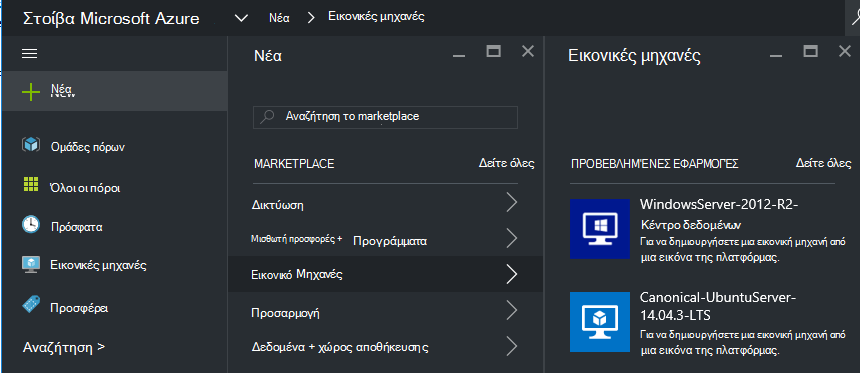
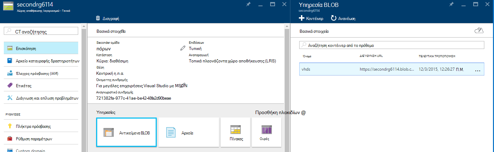
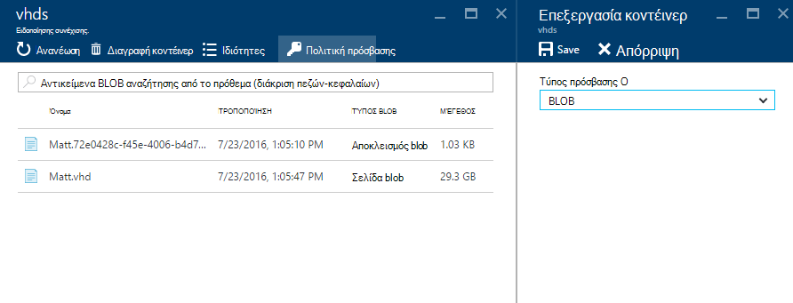
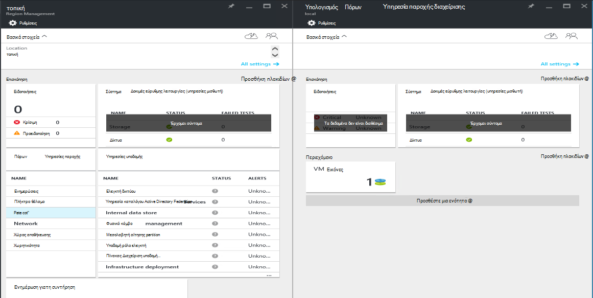
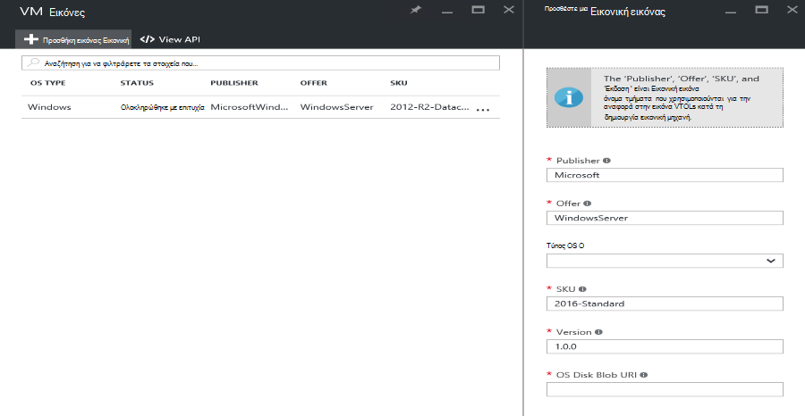

<properties
    pageTitle="Προσθήκη μιας εικόνας Εικονική στοίβα Azure | Microsoft Azure"
    description="Προσθήκη της εταιρείας σας προσαρμοσμένη Windows ή Linux Εικονική εικόνας για μισθωτές για να χρησιμοποιήσετε"
    services="azure-stack"
    documentationCenter=""
    authors="mattmcg"
    manager="darmour"
    editor=""/>

<tags
    ms.service="azure-stack"
    ms.workload="na"
    ms.tgt_pltfrm="na"
    ms.devlang="na"
    ms.topic="get-started-article"
    ms.date="09/26/2016"
    ms.author="mattmcg"/>

# <a name="make-a-custom-virtual-machine-image-available-in-azure-stack"></a>Διάθεση μια εικόνα προσαρμοσμένης εικονική μηχανή σε στοίβα Azure


Azure στοίβας επιτρέπει στους διαχειριστές να καταστήσετε διαθέσιμο για τους μισθωτές Εικονική εικόνες, όπως το προσαρμοσμένο VHD του οργανισμού τους. Εικόνες μπορούν να είναι στα οποία γίνεται αναφορά από τα πρότυπα διαχείρισης πόρων Azure ή να προστεθεί σε Azure Marketplace περιβάλλον εργασίας Χρήστη του με τη δημιουργία ενός στοιχείου Marketplace. Μια εικόνα του Windows Server 2012 R2 περιλαμβάνεται από προεπιλογή στην τεχνική προεπισκόπηση στοίβας Azure.

> [AZURE.NOTE] Εικονική εικόνες με Marketplace στοιχεία μπορούν να αναπτυχθούν, επιλέγοντας **Δημιουργία** το περιβάλλον εργασίας χρήστη και, στη συνέχεια, στην κατηγορία **εικονικές μηχανές** . Τα στοιχεία εικόνα Εικονική παρατίθενται.


## <a name="add-a-vm-image-to-marketplace-with-powershell"></a>Προσθήκη μιας εικόνας Εικονική Marketplace με το PowerShell

Εάν η εικόνα Εικονική VHD είναι διαθέσιμη τοπικά στην κονσόλα Εικονική (ή άλλη συσκευή εξωτερικά συνδεδεμένο), χρησιμοποιήστε τα ακόλουθα βήματα:

1. Προετοιμασία ενός Windows ή Linux λειτουργικό σύστημα ειδώλου εικονικού σκληρού δίσκου σε μορφή VHD (δεν VHDX).
    -   Για τις εικόνες των Windows, το άρθρο [αποστείλετε μια εικόνα Εικονική των Windows για να Azure για αναπτύξεις από διαχειριστή πόρων](virtual-machines-windows-upload-image.md) περιέχει οδηγίες προετοιμασία εικόνας στην ενότητα **Προετοιμασία VHD για αποστολή** .
    -   Για εικόνες Linux, ακολουθήστε τα βήματα για να προετοιμάσετε την εικόνα ή να χρησιμοποιήσετε μια υπάρχουσα εικόνα Linux στοίβας Azure όπως περιγράφεται στο άρθρο [Ανάπτυξη Linux εικονικές μηχανές σε στοίβα Azure](azure-stack-linux.md).

2. Κλωνοποίηση του [αποθετηρίου Azure στοίβας εργαλεία](https://aka.ms/azurestackaddvmimage)και, στη συνέχεια, εισαγάγετε τη λειτουργική μονάδα **ComputeAdmin**

    ```powershell
    Import-Module .\ComputeAdmin\AzureStack.ComputeAdmin.psm1
    ```

3. Προσθέστε την εικόνα Εικονική καλώντας το cmdlet Προσθήκη VMImage.
    -  Συμπεριλάβετε το publisher, προσφορά, SKU και την έκδοση για την εικόνα Εικονική. Αυτές οι παράμετροι χρησιμοποιούνται από τα πρότυπα διαχείρισης πόρων Azure που αναφέρονται στην εικόνα Εικονική.
    -  Καθορίστε osType ως Windows ή Linux.
    -  Συμπεριλάβετε το Αναγνωριστικό μισθωτή Azure Active Directory στη φόρμα * &lt;myaadtenant&gt;*. onmicrosoft.com.
    - Ακολουθεί ένα παράδειγμα κλήση της δέσμης ενεργειών:

    ```powershell
       Add-VMImage -publisher "Canonical" -offer "UbuntuServer" -sku "14.04.3-LTS" -version "1.0.0" -osType Linux -osDiskLocalPath 'C:\Users\AzureStackAdmin\Desktop\UbuntuServer.vhd' -tenantID <myaadtenant>.onmicrosoft.com
    ```

    > [AZURE.NOTE] Το cmdlet ζητά διαπιστευτήρια για να προσθέσετε την εικόνα Εικονική. Παρέχει ο διαχειριστής διαπιστευτήρια Azure Active Directory, όπως είναι οι serviceadmin@ * &lt;myaadtenant&gt;*. onmicrosoft.com, στην ερώτηση.  

Η εντολή κάνει τα εξής:
- Πραγματοποιεί έλεγχο ταυτότητας για το περιβάλλον στοίβας Azure
- Αποστολές του τοπικού VHD σε ένα λογαριασμό που μόλις δημιουργήθηκε προσωρινή αποθήκευση
- Προσθέτει την εικόνα Εικονική του αποθετηρίου Εικονική εικόνας
- Δημιουργεί ένα στοιχείο Marketplace

Για να επαληθεύσετε ότι η εντολή εκτελέστηκε με επιτυχία, μεταβείτε στο Marketplace στην πύλη του και, στη συνέχεια, βεβαιωθείτε ότι η εικόνα Εικονική είναι διαθέσιμες στην κατηγορία **εικονικές μηχανές** .

> 

Ακολουθεί μια περιγραφή των παραμέτρων εντολή.


| Παράμετρος | Περιγραφή |
|----------| ------------ |
|**tenantID** | Το Αναγνωριστικό μισθωτή Azure Active Directory στη φόρμα * &lt;AADTenantID*. onmicrosoft.com&gt;. |
|**ο Publisher** | Το publisher όνομα του τμήματος της εικόνας Εικονική που μισθωτές χρήση κατά την ανάπτυξη της εικόνας. Ένα παράδειγμα είναι 'Microsoft'. Μην συμπεριλαμβάνετε ένα κενό διάστημα ή άλλους ειδικούς χαρακτήρες σε αυτό το πεδίο.|
|**προσφορά** | Στο τμήμα όνομα προσφορά της εικόνας Εικονική που μισθωτές χρήση κατά την ανάπτυξη της εικόνας Εικονική. Ένα παράδειγμα είναι 'WindowsServer'. Μην συμπεριλαμβάνετε ένα κενό διάστημα ή άλλους ειδικούς χαρακτήρες σε αυτό το πεδίο. |
| **SKU** | Στο όνομα SKU τμήμα της εικόνας Εικονική που μισθωτές χρήση κατά την ανάπτυξη της εικόνας Εικονική. Ένα παράδειγμα είναι 'Datacenter2016'. Μην συμπεριλαμβάνετε ένα κενό διάστημα ή άλλους ειδικούς χαρακτήρες σε αυτό το πεδίο. |
|**έκδοση** | Η έκδοση της εικόνας Εικονική που μισθωτές χρήση κατά την ανάπτυξη της εικόνας Εικονική. Αυτή η έκδοση είναι σε μορφή * \#.\#. \#*. Ένα παράδειγμα είναι '1.0.0'. Μην συμπεριλαμβάνετε ένα κενό διάστημα ή άλλους ειδικούς χαρακτήρες σε αυτό το πεδίο.|
| **osType** | Το osType της εικόνας πρέπει να είναι 'Windows' ή 'Linux'. |
|**osDiskLocalPath** | Η διαδρομή τοπικά στο δίσκο OS VHD που αποστέλλετε ως εικόνα Εικονική σε στοίβα Azure. |
|**dataDiskLocalPaths**| Ένας πίνακας προαιρετικό με την τοπική διαδρομές για δίσκων δεδομένων που μπορούν να αποσταλούν ως μέρος της εικόνας Εικονική.|
|**CreateGalleryItem**| Μια σημαία δυαδικής τιμής που καθορίζει αν θέλετε να δημιουργήσετε ένα στοιχείο στο Marketplace. Η προεπιλογή έχει οριστεί στην τιμή true.|
|**Τίτλος**| Το εμφανιζόμενο όνομα του στοιχείου Marketplace. Για να το Publisher-προσφορά-Sku της εικόνας Εικονική έχει οριστεί ως προεπιλογή.|
|**Περιγραφή**| Η περιγραφή του στοιχείου Marketplace. |
|**osDiskBlobURI**| Προαιρετικά, αυτή η δέσμη ενεργειών δέχεται επίσης ένα χώρο αποθήκευσης αντικειμένων Blob URI για osDisk.|
|**dataDiskBlobURIs**| Προαιρετικά, αυτήν τη δέσμη ενεργειών δέχεται επίσης ένας πίνακας με χώρο αποθήκευσης αντικειμένων Blob URIs για την προσθήκη δεδομένων δίσκων στην εικόνα.|


## <a name="add-a-vm-image-through-the-portal"></a>Προσθήκη εικόνας Εικονική μέσω της πύλης

> [AZURE.NOTE] Αυτή η μέθοδος απαιτεί τη δημιουργία του στοιχείου Marketplace ξεχωριστά.

Μία απαίτηση εικόνων είναι ότι μπορούν να χρησιμοποιηθούν από ένα χώρο αποθήκευσης αντικειμένων Blob URI. Προετοιμασία ένα Windows ή Linux λειτουργικό σύστημα ειδώλου εικονικού σκληρού δίσκου σε μορφή VHD (δεν VHDX) και, στη συνέχεια, να αποστείλετε την εικόνα σε ένα λογαριασμό του χώρου αποθήκευσης στο Azure ή σε στοίβα Azure. Εάν ήδη αποστολή της εικόνας σας με το χώρο αποθήκευσης αντικειμένων Blob στο Azure ή στοίβα Azure, μπορείτε να παραλείψετε αυτό το βήμα.

Ακολουθήστε τα βήματα από το άρθρο [αποστείλετε μια εικόνα Εικονική των Windows για να Azure για αναπτύξεις από διαχειριστή πόρων](https://azure.microsoft.com/documentation/articles/virtual-machines-windows-upload-image/) σε τα βήματα για να **αποστείλετε την εικόνα Εικονική για το λογαριασμό χώρου αποθήκευσης**. Λάβετε υπόψη τα εξής:

-   Για μια εικόνα Linux, ακολουθήστε τις οδηγίες για να προετοιμάσετε την εικόνα ή χρησιμοποιήστε μια υπάρχουσα εικόνα Linux στοίβας Azure, όπως περιγράφεται στο άρθρο [Ανάπτυξη Linux εικονικές μηχανές σε στοίβα Azure](azure-stack-linux.md).

- Είναι πιο αποτελεσματική για να αποστείλετε μια εικόνα στο χώρο αποθήκευσης αντικειμένων Blob του Azure στοίβας από με το χώρο αποθήκευσης αντικειμένων Blob του Azure επειδή χρειάζονται λιγότερο χρόνο για να προωθήσετε την εικόνα Εικονική του αποθετηρίου εικόνα Azure στοίβας. Ενώ ακολουθώντας τις οδηγίες αποστολής, βεβαιωθείτε ότι για να αντικαταστήσετε το βήμα [Τον έλεγχο ταυτότητας του PowerShell με το Microsoft Azure στοίβας](azure-stack-deploy-template-powershell.md) για το βήμα 'Login to Azure'.

- Σημειώστε το χώρο αποθήκευσης αντικειμένων Blob URI όπου μπορείτε να αποστείλετε την εικόνα. Έχει την εξής μορφή: * &lt;storageAccount&gt;/&lt;blobContainer&gt;/&lt;targetVHDName&gt;*.vhd

2.  Για να κάνετε το αντικείμενο blob ανώνυμη πρόσβαση, μεταβείτε στο κοντέινερ χώρου αποθήκευσης λογαριασμό blob όπου έχει αποσταλεί η εικόνα Εικονική VHD σε **Blob,** και, στη συνέχεια, επιλέξτε **Πολιτική πρόσβασης**. Εάν θέλετε, μπορείτε να δημιουργήσετε μια υπογραφή κοινόχρηστη πρόσβαση για το κοντέινερ και να συμπεριλάβετε ως μέρος του blob URI αντί για αυτό.





1.  Πραγματοποιήστε είσοδο στο Azure στοίβας ως διαχειριστής. Μεταβείτε στην **περιοχή Διαχείριση**. Στη συνέχεια, στην περιοχή **RPs**, επιλέξτε **Τον υπολογισμό της υπηρεσίας παροχής πόρων** > **Εικόνες Εικονική** > **Προσθήκη.**

    

2.  Στην την παρακάτω blade, πληκτρολογήστε το publisher, προσφορά, SKU και έκδοση της εικόνας Εικονική. Αυτά τα τμήματα όνομα αναφέρουν την εικόνα Εικονική στα πρότυπα διαχείρισης πόρων Azure. Βεβαιωθείτε ότι έχετε επιλέξει το **osType** σωστά. **OsDiskBlobURI**, εισαγάγετε το URI όπου έχει αποσταλεί η εικόνα στο βήμα 1. Κάντε κλικ στην επιλογή **Δημιουργία** για να ξεκινήσετε τη δημιουργία της εικόνας Εικονική.

    

3.  Η κατάσταση Εικονική εικόνα αλλάζει σε 'Ολοκληρώθηκε με' όταν η εικόνα είναι προστέθηκε με επιτυχία.

4.  Μισθωτές να αναπτύξετε την εικόνα Εικονική, καθορίζοντας του publisher, προσφορά, SKU και έκδοση της εικόνας Εικονική σε ένα πρότυπο από διαχειριστή πόρων Azure. Για να κάνετε την εικόνα Εικονική είναι διαθέσιμα για το μισθωτή κατανάλωση πιο εύκολα το περιβάλλον εργασίας χρήστη, είναι καλύτερα να [δημιουργήσετε ένα στοιχείο Marketplace](azure-stack-create-and-publish-marketplace-item.md).
