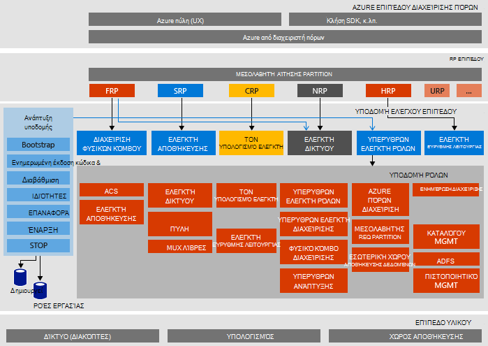

<properties
    pageTitle="Αρχιτεκτονική Microsoft Azure στοίβας απόδειξη της έννοια (POC) | Microsoft Azure"
    description="Προβάλετε την αρχιτεκτονική Microsoft Azure στοίβας POC."
    services="azure-stack"
    documentationCenter=""
    authors="heathl17"
    manager="byronr"
    editor=""/>

<tags
    ms.service="azure-stack"
    ms.workload="na"
    ms.tgt_pltfrm="na"
    ms.devlang="na"
    ms.topic="article"
    ms.date="10/25/2016"
    ms.author="helaw"/>

# Αρχιτεκτονική POC στοίβας Microsoft Azure

Το Azure POC στοίβας είναι μια ανάπτυξη μίας κόμβου του Azure στοίβας Technical Preview 2. Όλα τα στοιχεία έχουν εγκατασταθεί σε εικονικές μηχανές εκτελείται σε ένα μεμονωμένο κεντρικό υπολογιστή. 

## Διάγραμμα λογικής αρχιτεκτονικής
Το παρακάτω διάγραμμα παρουσιάζει η λογική αρχιτεκτονική του το POC στοίβας Azure και των στοιχείων.

## Ρόλοι εικονική μηχανή
Το POC στοίβας Azure προσφέρει υπηρεσίες χρησιμοποιώντας την παρακάτω ΣΠΣ στον κεντρικό υπολογιστή POC:

 - **ACS01 κατά ΜΆΖΑ** Εικονική μηχανή Azure στοίβας αποθήκευσης υπηρεσίες φιλοξενίας.

 - **ADFS01 κατά ΜΆΖΑ** Εικονική μηχανή φιλοξενίας υπηρεσιών Active Directory Federation Services.  Αυτή η εικονική μηχανή δεν χρησιμοποιείται στο Technical Preview 2.  

 - **ASQL01 κατά ΜΆΖΑ**  Εικονική μηχανή παρέχοντας ένα κατάστημα εσωτερικά δεδομένα για ρόλους υποδομή Azure στοίβας.  

 - **BGPNAT01 κατά ΜΆΖΑ** Εικονική μηχανή, ως μια άκρη δρομολογητή και παρέχει δυνατότητες NAT και VPN για Azure στοίβας.

 - **CA01 κατά ΜΆΖΑ** Εικονική μηχανή παρέχουν υπηρεσίες αρχή πιστοποιητικό για τις υπηρεσίες του ρόλου Azure στοίβας.

 - **CON01 κατά ΜΆΖΑ** Εικονική μηχανή διαθέσιμο για τους προγραμματιστές για την εγκατάσταση του PowerShell, Visual Studio και άλλα εργαλεία.

 - **DC01 κατά ΜΆΖΑ** Εικονική μηχανή υπηρεσίες καταλόγου Active Directory, DNS και DHCP για το Microsoft Azure στοίβας φιλοξενίας.

 - **GWY01 κατά ΜΆΖΑ** Εικονική μηχανή παρέχοντας άκρη πύλης υπηρεσίες όπως συνδέσεις τοποθεσίας σε τοποθεσία VPN για δίκτυα μισθωτή.

 - **NC01 κατά ΜΆΖΑ**  Εικονική μηχανή φιλοξενίας ελεγκτή δικτύου, ο οποίος διαχειρίζεται υπηρεσιών Azure στοίβα δικτύου.  

 - **SLB01 κατά ΜΆΖΑ**  Εικονική μηχανή παρέχει φόρτωση υπηρεσιών σε στοίβα Azure εξισορρόπησης για μισθωτές και υπηρεσίες υποδομής Azure στοίβας.  

 - **SUS01 κατά ΜΆΖΑ**  Εικονική παραγωγής φιλοξενίας υπηρεσιών Windows Server Update και υπεύθυνοι για την παροχή ενημερώσεις για άλλες εικονικές μηχανές Azure στοίβας.

 - **WAS01 κατά ΜΆΖΑ**  Εικονική μηχανή φιλοξενίας πύλη και των υπηρεσιών Azure διαχείριση πόρων.

 - **XRP01 κατά ΜΆΖΑ** Εικονική μηχανή που φιλοξενεί τις υπηρεσίες παροχής πόρων πυρήνα της Microsoft Azure στοίβας, συμπεριλαμβανομένου του υπολογισμού, δικτύου και αποθήκευσης υπηρεσίες παροχής πόρων.

## Υπηρεσίες αποθήκευσης
Υπηρεσίες αποθήκευσης στο λειτουργικό σύστημα του κεντρικού υπολογιστή φυσικής περιλαμβάνουν τα εξής:

 - **Υπηρεσία ACS Blob** Azure συνεπή χώρο αποθήκευσης αντικειμένων Blob υπηρεσίας, η οποία παρέχει υπηρεσίες χώρο αποθήκευσης αντικειμένων blob και πίνακα.

 - **SoFS** Κλίμακα ανάληψης διακομιστή αρχείων.

 - **Τιμές REF CSV** Σύμπλεγμα είναι ανθεκτικά αρχείο συστήματος κοινόχρηστα έντασης ήχου.

 - **Εικονικό δίσκο**, **Χώρου αποθήκευσης**και **Απευθείας κενά διαστήματα χώρου αποθήκευσης** είναι το αντίστοιχο υποκείμενη τεχνολογία χώρου αποθήκευσης στο Windows Server για να ενεργοποιήσετε την υπηρεσία παροχής πόρων αποθήκευσης Microsoft Azure στοίβα πυρήνα.

## Επόμενα βήματα

[Ανάπτυξη Azure στοίβας](azure-stack-deploy.md)

[Πρώτη σενάρια για να δοκιμάσετε](azure-stack-first-scenarios.md)

