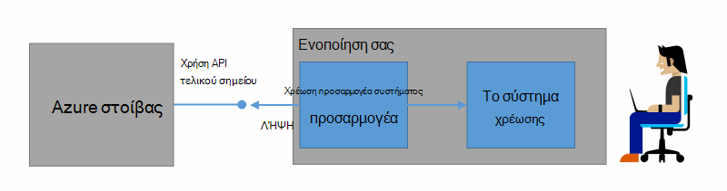
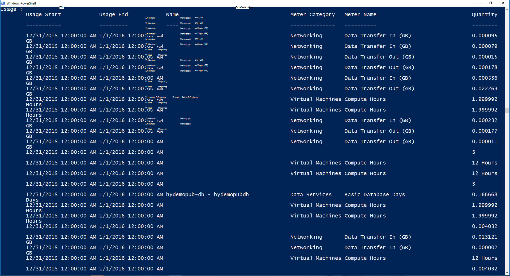

<properties
    pageTitle="Χρεώσεις πελατών και ετοιμάζετε σε στοίβα Azure | Microsoft Azure"
    description="Μάθετε πώς μπορείτε να ανακτήσετε πληροφορίες χρήσης πόρων από Azure στοίβας."
    services="azure-stack"
    documentationCenter=""
    authors="AlfredoPizzirani"
    manager="byronr"
    editor=""/>

<tags
    ms.service="azure-stack"
    ms.workload="na"
    ms.tgt_pltfrm="na"
    ms.devlang="na"
    ms.topic="article"
    ms.date="10/18/2016"
    ms.author="alfredop"/>

# Ο πελάτης χρέωσης και ετοιμάζετε σε στοίβα Azure

Τώρα που χρησιμοποιείτε Azure στοίβα, είναι καλή ιδέα να σκεφτείτε πώς μπορείτε να παρακολουθείτε τη χρήση. Υπηρεσίες παροχής που βασίζονται σε πληροφορίες χρήσης για την τιμολόγηση τους πελάτες και για να κατανοήσετε το κόστος της παροχής υπηρεσιών.
Επιχειρήσεις, επίσης, συνήθως παρακολούθηση χρήσης με τμήμα.

Azure στοίβας δεν είναι ένα σύστημα χρέωσης. Αυτό θα σας χρεώνει σας μισθωτές για τους πόρους που χρησιμοποιούν. Αλλά, στοίβα Azure την υποδομή για να συλλέξετε και συγκέντρωση δεδομένων χρήσης για κάθε υπηρεσία παροχής μεμονωμένο πόρο. Έχετε πρόσβαση σε αυτά τα δεδομένα και να το εξαγάγετε σε ένα σύστημα χρέωσης, χρησιμοποιώντας έναν προσαρμογέα χρεώσεων, ή το εξαγάγετε σε ένα εργαλείο επιχειρηματικής ευφυΐας όπως το Microsoft Power BI.

## Ποιες πληροφορίες χρήσης μπορούν να βρουν, και με ποιον τρόπο;

Azure υπηρεσίες παροχής πόρων στοίβας δημιουργούν χρήση εγγραφών σε ωριαία χρονικά διαστήματα. Οι εγγραφές εμφανίζουν το σύνολο του κάθε πόρο που καταναλώθηκε και ποια συνδρομή που καταναλώθηκε τον πόρο. Αυτά τα δεδομένα αποθηκεύονται. Μπορείτε να αποκτήσετε πρόσβαση στα δεδομένα μέσω του REST API.

Διαχειριστής υπηρεσιών να ανακτήσετε δεδομένα χρήσης για όλες τις συνδρομές του μισθωτή. Μεμονωμένες μισθωτές να ανακτήσετε μόνο τα δικά τους στοιχεία.

Χρήση εγγραφών παρέχουν πληροφορίες σχετικά με το χώρο αποθήκευσης, του δικτύου και χρήση υπολογισμού. Για μια λίστα των μέτρα, ανατρέξτε [σε αυτό το άρθρο](azure-stack-usage-related-faq.md).

## Ανακτήστε πληροφορίες χρήσης

Για να δημιουργήσετε τις εγγραφές, είναι σημαντικό να έχετε πόρων εκτελείται και ενεργά με χρήση του συστήματος. Εάν δεν είστε βέβαιοι εάν έχετε πόροι εκτελείται, σε στοίβα Azure Marketplace αναπτύξετε και, στη συνέχεια, εκτελέστε μια εικονική μηχανή (Εικονική). Ματιά εικονική Μηχανή παρακολούθηση blade για να βεβαιωθείτε ότι εκτελείται.

Συνιστάται να εκτελείτε τα cmdlet του Windows PowerShell για την προβολή δεδομένων χρήσης.
PowerShell καλεί τα API χρήση πόρων.

1.  [Εγκατάσταση και ρύθμιση παραμέτρων του PowerShell Azure](https://azure.microsoft.com/en-us/documentation/articles/powershell-install-configure/).

2.  Για να πραγματοποιήσετε είσοδο για τη διαχείριση πόρων Azure, χρησιμοποιήστε το cmdlet του PowerShell **Login AzureRmAccount**.

3.  Για να επιλέξετε τη συνδρομή που χρησιμοποιήσατε για να δημιουργήσετε πόρους, πληκτρολογήστε "σας sub" Get-AzureRmSubscription – SubscriptionName **| Επιλέξτε AzureRmSubscription**.

4.  Για να ανακτήσετε τα δεδομένα, χρησιμοποιήστε το PowerShell cmdlet [**Get-UsageAggregates**](https://msdn.microsoft.com/en-us/library/mt619285.aspx).
    Εάν δεδομένων χρήσης είναι διαθέσιμη, επιστρέφεται στο PowerShell, όπως στο παρακάτω παράδειγμα. PowerShell επιστρέφει 1.000 γραμμές χρήση ανά κλήση.
    Μπορείτε να χρησιμοποιήσετε το όρισμα *συνέχισης* για να ανακτήσετε τα σύνολα των γραμμών πέρα από την πρώτη 1.000. Για περισσότερες πληροφορίες σχετικά με τη χρήση δεδομένων, ανατρέξτε στο άρθρο [αναφορά API χρήση πόρων](azure-stack-provider-resource-api.md).

    

## Επόμενα βήματα

[Χρήση πόρων παροχής API](azure-stack-provider-resource-api.md)

[Χρήση πόρων API μισθωτή](azure-stack-tenant-resource-usage-api.md)

[Συνήθεις Ερωτήσεις για που σχετίζονται με χρήση](azure-stack-usage-related-faq.md)
