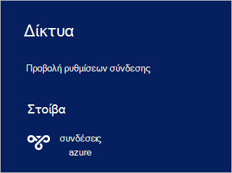

<properties
    pageTitle="Σύνδεση σε στοίβα Azure | Microsoft Azure"
    description="Μάθετε πώς να συνδεθείτε στοίβας Azure"
    services="azure-stack"
    documentationCenter=""
    authors="ErikjeMS"
    manager="byronr"
    editor=""/>

<tags
    ms.service="azure-stack"
    ms.workload="na"
    ms.tgt_pltfrm="na"
    ms.devlang="na"
    ms.topic="get-started-article"
    ms.date="10/18/2016"
    ms.author="erikje"/>

# <a name="connect-to-azure-stack"></a>Σύνδεση σε στοίβα Azure
Για να διαχειριστείτε τους πόρους, πρέπει να συνδεθείτε στον υπολογιστή POC στοίβας Azure. Μπορείτε να χρησιμοποιήσετε οποιαδήποτε από τις ακόλουθες επιλογές σύνδεσης:

 - Σύνδεση απομακρυσμένης επιφάνειας εργασίας: σας επιτρέπει να ένα μεμονωμένο χρήστη ταυτόχρονες συνδεθείτε γρήγορα από τον υπολογιστή POC.
 - Εικονικό ιδιωτικό δίκτυο (VPN): σας επιτρέπει να πολλών ταυτόχρονες χρηστών σύνδεση από προγράμματα-πελάτες εκτός της υποδομής του Azure στοίβας (απαιτεί ρύθμιση παραμέτρων).

## <a name="connect-with-remote-desktop"></a>Σύνδεση με απομακρυσμένη επιφάνεια εργασίας
Με μια σύνδεση απομακρυσμένης επιφάνειας εργασίας, ένα μεμονωμένο χρήστη ταυτόχρονες να εργαστείτε με την πύλη για τη διαχείριση πόρων. Μπορείτε επίσης να χρησιμοποιήσετε εργαλεία στον υπολογιστή εικονικές κατά ΜΆΖΑ CON01.

1.  Συνδεθείτε στο Azure στοίβας POC φυσικής υπολογιστή.

2.  Ανοίξτε μια σύνδεση απομακρυσμένης επιφάνειας εργασίας και να συνδεθείτε με CON01 κατά ΜΆΖΑ. Πληκτρολογήστε **AzureStack\AzureStackAdmin** ως το όνομα χρήστη και τον κωδικό πρόσβασης διαχείρισης που παρείχατε κατά την εγκατάσταση Azure στοίβας.  

3.  Στην επιφάνεια εργασίας κατά ΜΆΖΑ CON01, κάντε διπλό κλικ στο εικονίδιο **Microsoft Azure στοίβας πύλη** (https://portal.azurestack.local/) για να ανοίξετε την [πύλη](azure-stack-key-features.md#portal).

    

4.  Συνδεθείτε χρησιμοποιώντας τα διαπιστευτήρια Azure Active Directory που καθορίζεται στη διάρκεια της εγκατάστασης.

## <a name="connect-with-vpn"></a>Σύνδεση με VPN
Εικονικό ιδιωτικό δίκτυο συνδέσεις επιτρέψω σε πολλούς ταυτόχρονες χρήστες σύνδεση από προγράμματα-πελάτες εκτός της υποδομής του Azure στοίβας. Μπορείτε να χρησιμοποιήσετε την πύλη διαχείρισης πόρων. Μπορείτε επίσης να χρησιμοποιήσετε εργαλεία, όπως το Visual Studio και το PowerShell, στον τοπικό-πελάτη.

1.  Εγκαταστήστε τη λειτουργική μονάδα AzureRM, χρησιμοποιώντας την ακόλουθη εντολή:
   
    ```PowerShell
    Install-Module -Name AzureRm -RequiredVersion 1.2.6 -Scope CurrentUser
    ```   
   
2. Κάντε λήψη των δεσμών ενεργειών του Azure στοίβας εργαλεία.  Αυτά τα αρχεία μπορούν να ληφθούν, είτε η περιήγηση στο [αποθετήριο δεδομένων GitHub](https://github.com/Azure/AzureStack-Tools)ή εκτελείτε την ακόλουθη δέσμη ενεργειών του Windows PowerShell ως διαχειριστής υποστήριξης:
    
    >[AZURE.NOTE]  Ακολουθήστε τα παρακάτω βήματα απαιτούν PowerShell 5.0.  Για να ελέγξετε την έκδοση, εκτελέστε $PSVersionTable.PSVersion και σύγκριση της έκδοσης "Κύρια".  

    ```PowerShell
       
       #Download the tools archive
       invoke-webrequest https://github.com/Azure/AzureStack-Tools/archive/master.zip -OutFile master.zip

       #Expand the downloaded files. 
       expand-archive master.zip -DestinationPath . -Force

       #Change to the tools directory
       cd AzureStack-Tools-master
    ````

3.  Κατά την ίδια περίοδο λειτουργίας PowerShell, μεταβείτε στο φάκελο **σύνδεση** και εισαγωγή της λειτουργικής μονάδας AzureStack.Connect.psm1:

    ```PowerShell
    cd Connect
    import-module .\AzureStack.Connect.psm1
    ```

4.  Για να δημιουργήσετε τη σύνδεση VPN στοίβας Azure, εκτελέστε την παρακάτω Windows PowerShell. Πριν από την εκτέλεση, συμπληρώστε τα πεδία διεύθυνσης host στοίβας Azure και κωδικό πρόσβασης διαχειριστή. 
    
    ```PowerShell
    #Change the IP Address below to match your Azure Stack host
    $hostIP = "<HostIP>"

    # Change password below to reference the password provided for administrator during Azure Stack installation
    $Password = ConvertTo-SecureString "<Admin Password>" -AsPlainText -Force

    # Add Azure Stack One Node host & CA to the trusted hosts on your client computer
    Set-Item wsman:\localhost\Client\TrustedHosts -Value $hostIP -Concatenate
    Set-Item wsman:\localhost\Client\TrustedHosts -Value mas-ca01.azurestack.local -Concatenate  

    # Update Azure Stack host address to be the IP Address of the Azure Stack POC Host
    $natIp = Get-AzureStackNatServerAddress -HostComputer $hostIP -Password $Password

    # Create VPN connection entry for the current user
    Add-AzureStackVpnConnection -ServerAddress $natIp -Password $Password

    # Connect to the Azure Stack instance. This command (or the GUI steps in step 5) can be used to reconnect
    Connect-AzureStackVpn -Password $Password 
    ```

5. Όταν σας ζητηθεί, θεωρείται αξιόπιστο τον κεντρικό υπολογιστή του Azure στοίβας.

6. Όταν σας ζητηθεί, εγκαταστήστε ένα πιστοποιητικό (το προτρεπτικό μήνυμα εμφανίζεται πίσω από το παράθυρο της περιόδου λειτουργίας Powershell).

7. Για να ελέγξετε τη σύνδεση πύλης, σε ένα πρόγραμμα περιήγησης Internet, μεταβείτε στην *https://portal.azurestack.local*.

8. Για να δείτε και να διαχειριστείτε τη σύνδεση Azure στοίβα, χρησιμοποιήστε **δίκτυα** στον υπολογιστή-πελάτη:

    

>[AZURE.NOTE] Αυτή η σύνδεση VPN δεν παρέχει συνδεσιμότητας ΣΠΣ ή άλλους πόρους. Για πληροφορίες σχετικά με τη δυνατότητα σύνδεσης με τους πόρους, ανατρέξτε στο θέμα [Μία σύνδεση VPN κόμβου](azure-stack-create-vpn-connection-one-node-tp2.md)


## <a name="next-steps"></a>Επόμενα βήματα
[Πρώτες εργασίες](azure-stack-first-scenarios.md)

[Εγκατάσταση και να συνδεθείτε με το PowerShell](azure-stack-connect-powershell.md)

[Εγκατάσταση και συνδεθείτε με CLI](azure-stack-connect-cli.md)


