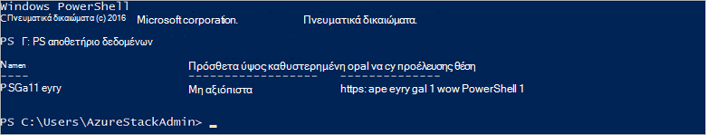

<properties
    pageTitle="Σύνδεση σε στοίβα Azure με το PowerShell | Microsoft Azure"
    description="Μάθετε πώς να διαχειρίζεστε Azure στοίβα με το PowerShell"
    services="azure-stack"
    documentationCenter=""
    authors="HeathL17"
    manager="byronr"
    editor=""/>

<tags
    ms.service="azure-stack"
    ms.workload="na"
    ms.tgt_pltfrm="na"
    ms.devlang="na"
    ms.topic="article"
    ms.date="10/19/2016"
    ms.author="helaw"/>

# Εγκατάσταση του PowerShell και να συνδεθείτε σε στοίβα Azure
Σε αυτόν τον οδηγό, θα σας καθοδηγήσουμε τα βήματα για τη σύνδεση σε στοίβα Azure με το PowerShell. Μόλις ολοκληρωθεί, αυτά τα βήματα μπορεί να σας βοηθήσει επίσης να διαχειριστείτε και να αναπτύξετε τους πόρους.

## Εγκατάσταση των cmdlet του PowerShell στοίβας Azure

1.  Cmdlet για AzureRM εγκαθίστανται από τη συλλογή PowerShell. Για να ξεκινήσετε, ανοίξτε μια κονσόλα PowerShell σε κατά ΜΆΖΑ CON01 και εκτελέστε την ακόλουθη εντολή για να λάβετε μια λίστα με τις διαθέσιμες αποθετήρια PowerShell:

        Get-PSRepository

      

2.  Εκτελέστε την παρακάτω εντολή για να εγκαταστήσετε τη λειτουργική μονάδα AzureRM:

        Install-Module -Name AzureRM -RequiredVersion 1.2.6 -Scope CurrentUser

    >[AZURE.NOTE] *-CurrentUser εμβέλεια* είναι προαιρετικό. Εάν θέλετε μεγαλύτερη από τον τρέχοντα χρήστη να έχουν πρόσβαση οι λειτουργικές μονάδες, χρησιμοποιήστε μια γραμμή εντολών με αναβαθμισμένα δικαιώματα και αφήστε απενεργοποιήσετε την παράμετρο *εύρος* .

3.  Για να επιβεβαιώσετε την εγκατάσταση της AzureRM λειτουργικές μονάδες, εκτελέστε τις παρακάτω εντολές:

        Get-Command -Module AzureRM.AzureStackAdmin

## Σύνδεση σε στοίβα Azure
Μια λειτουργική μονάδα είναι διαθέσιμο για λήψη που χειρίζεται τη ρύθμιση των παραμέτρων της σύνδεσης του PowerShell σε στοίβα Azure για εσάς.  Επισκεφθείτε [Azure στοίβας εργαλεία](http://aka.ms/ConnectToAzureStackPS) για τη λειτουργική μονάδα και επιπλέον βήματα. 

## Ανάκτηση μιας λίστας των συνδρομών
Σε αυτήν την ενότητα, μπορείτε να επαληθεύσετε χρησιμοποιούν τα cmdlet του PowerShell έναντι Azure στοίβα, την ανάκτηση και επιλέγοντας μια συνδρομή για χρήση.

Εκτελέστε την παρακάτω εντολή για να ανακτήσετε μια λίστα των συνδρομών στοίβας Azure που σχετίζεται με το λογαριασμό σας:

    Get-AzureRmSubscription

## Επόμενα βήματα
[Ανάπτυξη προτύπων με το PowerShell](azure-stack-deploy-template-powershell.md)

[Σύνδεση με το Azure CLI](azure-stack-connect-cli.md)

[Ανάπτυξη προτύπων με το Visual Studio](azure-stack-deploy-template-visual-studio.md)

