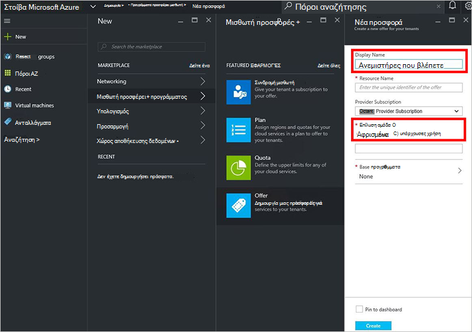

<properties
    pageTitle="Δημιουργία μιας προσφοράς σε στοίβα Azure | Microsoft Azure"
    description="Ως διαχειριστής υπηρεσιών, μάθετε πώς μπορείτε να δημιουργήσετε μια προσφορά για σας μισθωτές σε στοίβα Azure."
    services="azure-stack"
    documentationCenter=""
    authors="ErikjeMS"
    manager="byronr"
    editor=""/>

<tags
    ms.service="azure-stack"
    ms.workload="na"
    ms.tgt_pltfrm="na"
    ms.devlang="na"
    ms.topic="get-started-article"
    ms.date="09/26/2016"
    ms.author="erikje"/>

# Δημιουργία μιας προσφοράς σε στοίβα Azure

[Προσφέρει](azure-stack-key-features.md#services-plans-offers-and-subscriptions) είναι οι ομάδες από ένα ή περισσότερα προγράμματα που παρουσιάζουν υπηρεσίες παροχής στους μισθωτές για την αγορά ή εγγραφή σε. Αυτό το έγγραφο δείχνει πώς μπορείτε να δημιουργήσετε μια προσφορά που περιλαμβάνει το [πρόγραμμα που δημιουργήσατε](azure-stack-create-plan.md) στο τελευταίο βήμα. Αυτήν την προσφορά δίνει συνδρομητές τη δυνατότητα να παρέχετε εικονικές μηχανές.

1.  [Πραγματοποιήστε είσοδο](azure-stack-connect-azure-stack.md#log-in-as-a-service-administrator) στην πύλη του ως διαχειριστής υπηρεσιών και, στη συνέχεια, κάντε κλικ στην επιλογή **Δημιουργία** > **προσφέρει μισθωτή + προγράμματα** > **προσφορά**.
    

2.  Στο blade **Νέα προσφορά** , συμπληρώστε **Εμφανιζόμενο όνομα** και το **Όνομα του πόρου**και, στη συνέχεια, επιλέξτε μια νέα ή υπάρχουσα **Ομάδα πόρων**. Το εμφανιζόμενο όνομα είναι φιλικό όνομα την προσφορά. Μόνο ο διαχειριστής μπορεί να δείτε το όνομα του πόρου. Είναι το όνομα που χρησιμοποιούν οι διαχειριστές για να εργαστείτε με την προσφορά με έναν πόρο από διαχειριστή πόρων Azure.

    

3.  Κάντε κλικ στην επιλογή **προγράμματος βάσης** και, στο blade **πρόγραμμα** , επιλέξτε τα προγράμματα που θέλετε να συμπεριλάβετε στην προσφορά και, στη συνέχεια, κάντε κλικ στην **επιλογή**. Κάντε κλικ στην επιλογή **Δημιουργία** για να δημιουργήσετε την προσφορά.

    
    
4. Κάντε κλικ στην επιλογή **προσφέρει** και, στη συνέχεια, κάντε κλικ στην επιλογή την προσφορά που μόλις δημιουργήσατε.

    

5.  Κάντε κλικ στην επιλογή **Αλλαγή κατάστασης**και, στη συνέχεια, κάντε κλικ στην επιλογή **δημόσια**.
  
    

Προσφορές πρέπει να γίνει δημόσια για μισθωτές για να λάβετε την πλήρη προβολή κατά την εγγραφή. Προσφορές μπορεί να είναι:

- **Δημόσια**: ορατή στους μισθωτές.

- **Ιδιωτικό**: είναι ορατό μόνο στην ομάδα διαχειριστών της υπηρεσίας. Χρήσιμες κατά τη σύνταξη το πρόγραμμα ή τη προσφορά, ή εάν ο διαχειριστής της υπηρεσίας θέλει να εγκρίνουν κάθε συνδρομής.

- **Εκτός λειτουργίας**: κλειστό σε νέα συνδρομητές. Να χρησιμοποιήσετε το διαχειριστή της υπηρεσίας παροπλισμού να αποτρέψετε μελλοντική συνδρομές, αλλά να αφήσετε τρέχουσα συνδρομητές ανέπαφος.

Αλλαγές για την προσφορά δεν εμφανίζονται αμέσως με το μισθωτή. Για να δείτε τις αλλαγές, ίσως χρειαστεί να αποσυνδεθείτε/σύνδεσης για να δείτε τη νέα εγγραφή στην "επιλογή συνδρομής" κατά τη δημιουργία πόρους/ομάδες πόρων.

## Επόμενα βήματα

[Εγγραφή σε μια προσφορά και, στη συνέχεια, προμήθεια μια εικονική Μηχανή](azure-stack-subscribe-plan-provision-vm.md)
