<properties
    pageTitle="Δημιουργία σχεδίου σε στοίβα Azure | Microsoft Azure"
    description="Ως διαχειριστής υπηρεσιών, δημιουργήστε ένα σχέδιο που σας επιτρέπει να συνδρομητές παροχή εικονικές μηχανές."
    services="azure-stack"
    documentationCenter=""
    authors="ErikjeMS"
    manager="byronr"
    editor=""/>

<tags
    ms.service="azure-stack"
    ms.workload="na"
    ms.tgt_pltfrm="na"
    ms.devlang="na"
    ms.topic="get-started-article"
    ms.date="09/26/2016"
    ms.author="erikje"/>

# Δημιουργία σχεδίου σε στοίβα Azure

[Προγράμματα](azure-stack-key-features.md#services-plans-offers-and-subscriptions) είναι ομαδοποιήσεις μία ή περισσότερες υπηρεσίες. Με μια υπηρεσία παροχής, μπορείτε να δημιουργήσετε σχέδια για την προσφορά για μισθωτές σας. Με τη σειρά σας μισθωτές εγγραφείτε προσφέρει σας για να χρησιμοποιήσετε τα προγράμματα και τις υπηρεσίες που περιλαμβάνουν. Αυτό το παράδειγμα δείχνει πώς μπορείτε να δημιουργήσετε ένα σχέδιο που περιλαμβάνει το υπολογισμού, δικτύου και υπηρεσίες παροχής χώρου αποθήκευσης πόρων. Αυτό το πρόγραμμα σάς παρέχει συνδρομητές τη δυνατότητα να προμηθεύσουν εικονικές μηχανές.

1.  Σε ένα πρόγραμμα περιήγησης στο internet, μεταβείτε https://portal.azurestack.local.

2.  [Πραγματοποιήστε είσοδο](azure-stack-connect-azure-stack.md#log-in-as-a-service-administrator) στην πύλη του Azure στοίβας ως διαχειριστής υπηρεσιών και εισαγάγετε τα διαπιστευτήριά σας υπηρεσία διαχειριστή (το λογαριασμό που δημιουργήσατε κατά τη διάρκεια της ενότητας [εκτελέστε τη δέσμη ενεργειών PowerShell](azure-stack-run-powershell-script.md) βήμα 5) και, στη συνέχεια, κάντε κλικ στην επιλογή **Είσοδος**.

    Διαχειριστές υπηρεσιών να δημιουργήσετε προσφορές και τα σχέδια και διαχείριση χρηστών.

3.  Για να δημιουργήσετε ένα σχέδιο και προσφορά που μισθωτές να εγγραφείτε σε, κάντε κλικ στην επιλογή **Δημιουργία** > **προσφέρει μισθωτή + προγράμματα** > **πρόγραμμα**.

    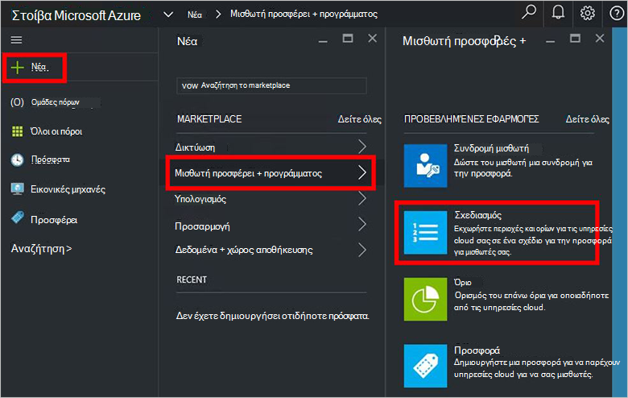

4.  Το **Νέο πρόγραμμα** blade, συμπληρώστε στο **Εμφανιζόμενο όνομα** και **Όνομα πόρου**. Το εμφανιζόμενο όνομα είναι το πρόγραμμα φιλικό όνομα που βλέπουν οι μισθωτές. Μόνο ο διαχειριστής μπορεί να δείτε το όνομα του πόρου. Είναι το όνομα που χρησιμοποιούν οι διαχειριστές για να εργαστείτε με το πρόγραμμα με έναν πόρο από διαχειριστή πόρων Azure.

    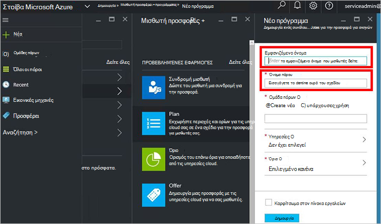

5.  Δημιουργήστε μια νέα **Ομάδα πόρων**ή επιλέξτε ένα υπάρχον, ως κοντέινερ για το πρόγραμμα (π.χ. "OffersAndPlans")

    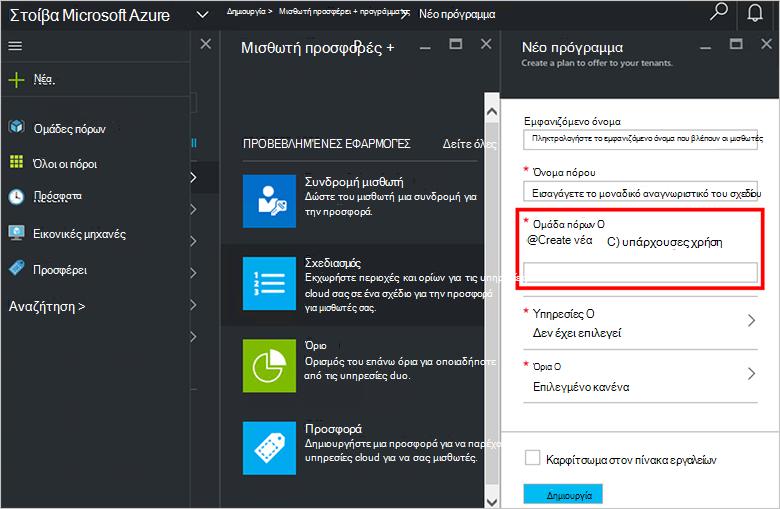

6.  Κάντε κλικ στην επιλογή **υπηρεσίες**, επιλέξτε **Microsoft.Compute**, **Microsoft.Network**και **Microsoft.Storage**και, στη συνέχεια, κάντε κλικ στην **επιλογή**.

    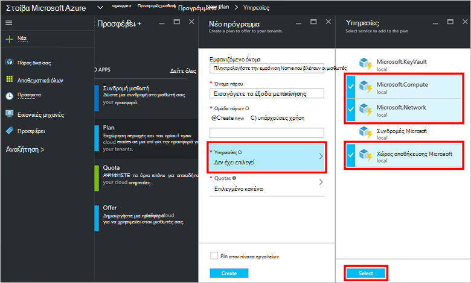

7.  Κάντε κλικ στην επιλογή **ορίων**, κάντε κλικ στην επιλογή **Microsoft.Storage (τοπικά)**, και, στη συνέχεια, επιλέξτε το προεπιλεγμένο όριο ή κάντε κλικ στην επιλογή **Δημιουργία νέου ορίου** για την προσαρμογή του ορίου.

    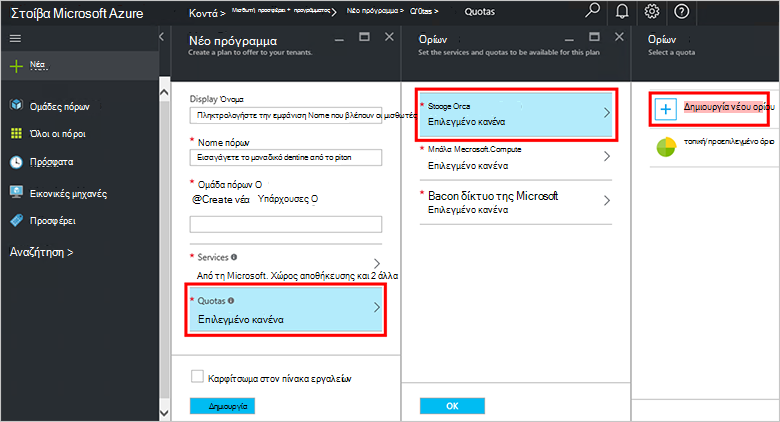

8.  Πληκτρολογήστε ένα όνομα για το όριο, κάντε κλικ στην επιλογή **Ρυθμίσεις ορίων μεγέθους**, ορίστε τις τιμές ορίου και κάντε κλικ στο κουμπί **OK**και, στη συνέχεια, κάντε κλικ στην επιλογή **Δημιουργία**.

    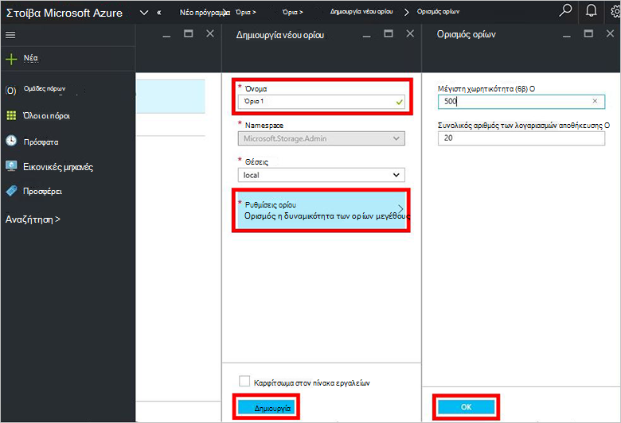

9. Κάντε κλικ στην επιλογή **Microsoft.Network (τοπικά)**, και, στη συνέχεια, επιλέξτε το προεπιλεγμένο όριο ή κάντε κλικ στην επιλογή **Δημιουργία νέου ορίου** για την προσαρμογή του ορίου.

    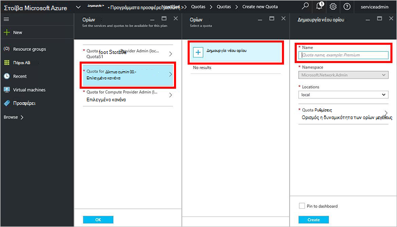

10. Πληκτρολογήστε ένα όνομα για το όριο, κάντε κλικ στην επιλογή **Ρυθμίσεις ορίων μεγέθους**, ορίστε τις τιμές ορίου και κάντε κλικ στο κουμπί **OK**και, στη συνέχεια, κάντε κλικ στην επιλογή **Δημιουργία**.

    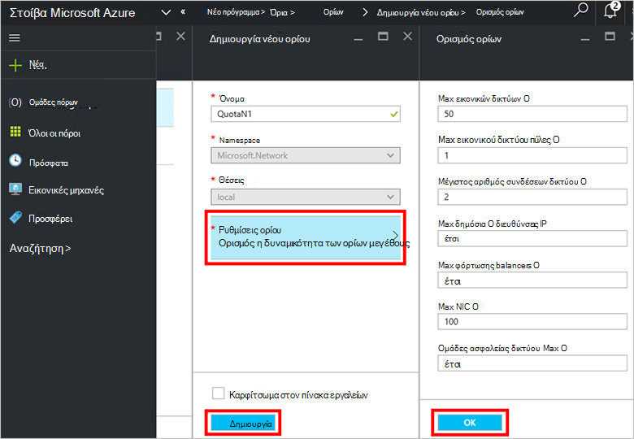

11. Κάντε κλικ στην επιλογή **Microsoft.Compute (τοπικά)**, και, στη συνέχεια, επιλέξτε το προεπιλεγμένο όριο ή κάντε κλικ στην επιλογή **Δημιουργία νέου ορίου** για την προσαρμογή του ορίου.

    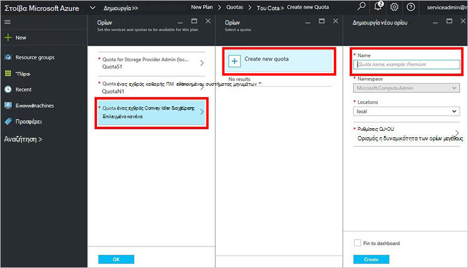

12.  Πληκτρολογήστε ένα όνομα για το όριο, κάντε κλικ στην επιλογή **Ρυθμίσεις ορίων μεγέθους**, ορίστε τις τιμές ορίου και κάντε κλικ στο κουμπί **OK**και, στη συνέχεια, κάντε κλικ στην επιλογή **Δημιουργία**.

    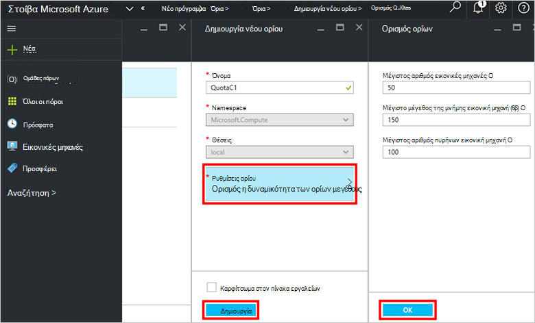

13. Στο blade τα **όρια** , κάντε κλικ στο κουμπί **OK**και, στη συνέχεια, στο το **Νέο πρόγραμμα** blade, κάντε κλικ στην επιλογή **Δημιουργία** για να δημιουργήσετε το σχέδιο.

    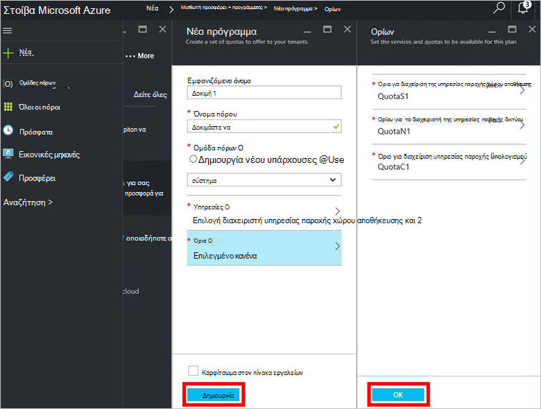

14. Για να δείτε το νέο πρόγραμμα, κάντε κλικ στην επιλογή **όλους τους πόρους**, στη συνέχεια, αναζητήστε το πρόγραμμα και κάντε κλικ στο όνομά της.

    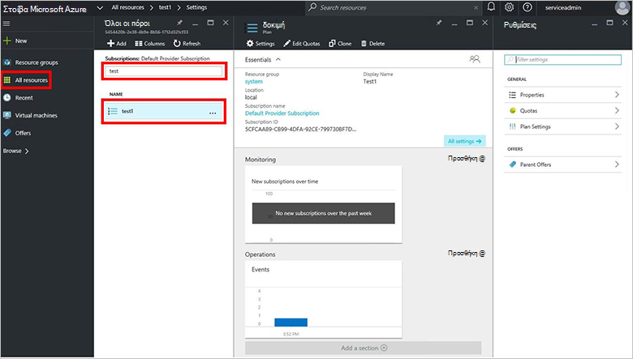

## Επόμενα βήματα

[Δημιουργία μιας προσφοράς](azure-stack-create-offer.md)
