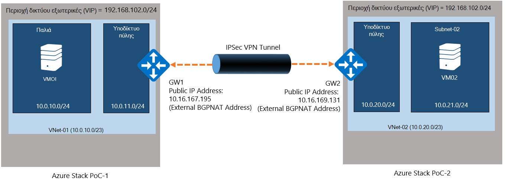
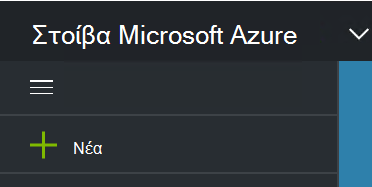
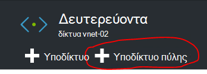
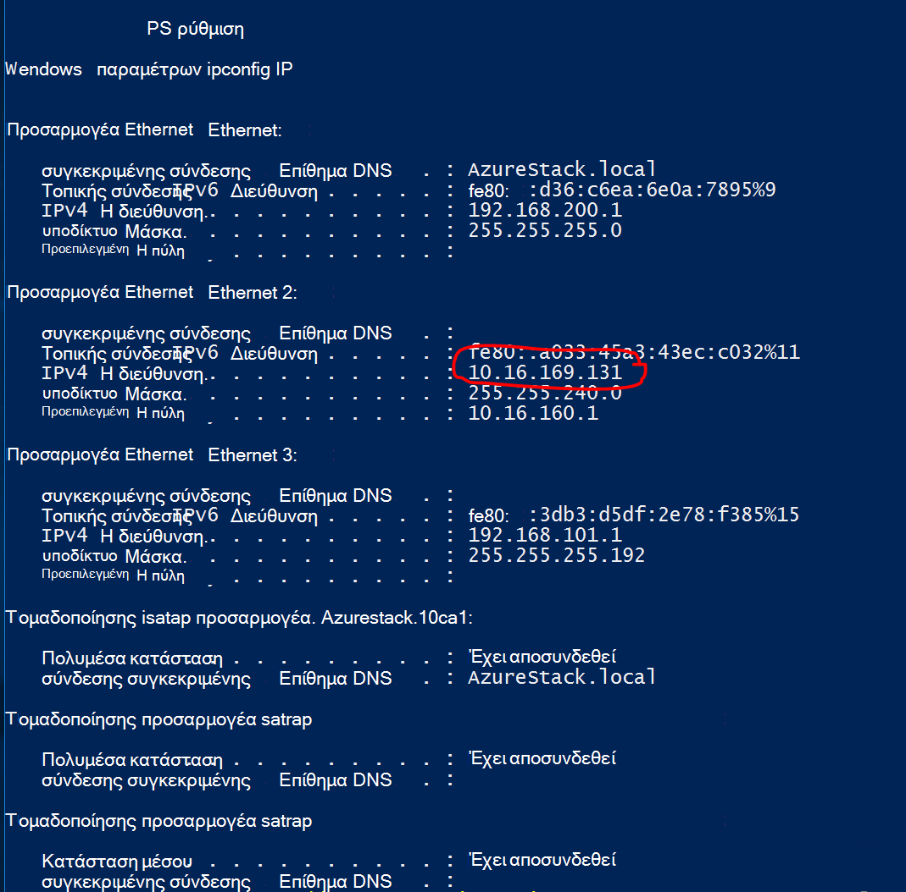
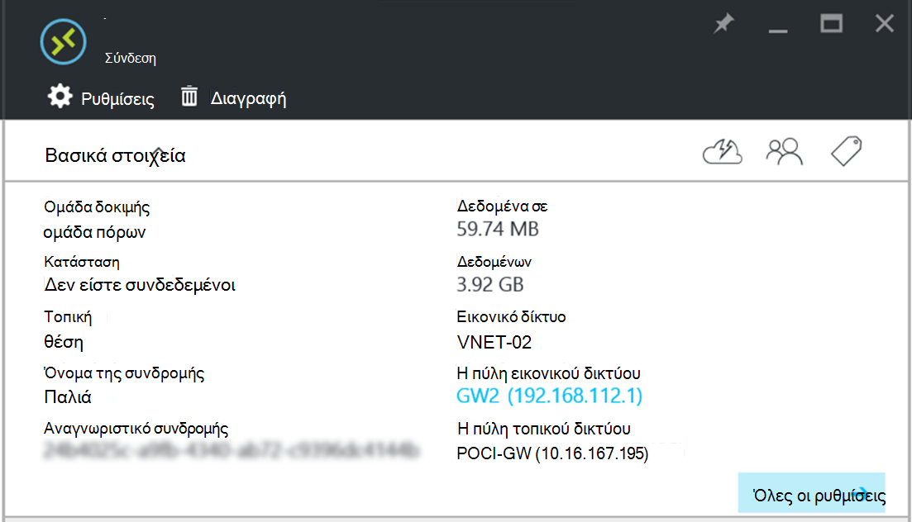

<properties
    pageTitle="Δημιουργία σύνδεσης τοποθεσίας σε τοποθεσία VPN μεταξύ δύο εικονικού δικτύων σε διαφορετικά περιβάλλοντα PoC στοίβας Azure | Microsoft Azure"
    description="Διαδικασία βήμα προς βήμα που θα σας επιτρέψει διαχειριστής cloud για να δημιουργήσετε μια σύνδεση VPN τοποθεσίας σε τοποθεσία μεταξύ δύο περιβάλλοντα POC μία κόμβου στο TP2."
    services="azure-stack"
    documentationCenter=""
    authors="ScottNapolitan"
    manager="darmour"
    editor=""/>

<tags
    ms.service="azure-stack"
    ms.workload="na"
    ms.tgt_pltfrm="na"
    ms.devlang="na"
    ms.topic="get-started-article"
    ms.date="09/26/2016"
    ms.author="scottnap"/>

# Δημιουργία σύνδεσης τοποθεσίας σε τοποθεσία VPN μεταξύ δύο εικονικού δικτύων σε διαφορετικά περιβάλλοντα PoC στοίβας Azure

## Επισκόπηση

Σε αυτό το άρθρο σάς καθοδηγεί σε τα βήματα για να δημιουργήσετε μια σύνδεση VPN τοποθεσίας σε τοποθεσία μεταξύ δύο εικονικού δίκτυα σε δύο ξεχωριστές περιβάλλοντα στοίβας Azure απόδειξη λειτουργίας (POC). Ο σκοπός της αυτό είναι για να βοηθήσετε τους χρήστες που την αξιολόγηση τοποθεσίας σε τοποθεσία πύλες κατανοήσετε τον τρόπο ρύθμισης των συνδέσεων VPN μεταξύ εικονικού δικτύων σε δύο διαφορετικές αναπτύξεις Azure στοίβας.  Σε διαδικασία αυτή την περίπτωση, μπορείτε να αποκτήσετε την κατανόηση πώς λειτουργούν οι πύλες VPN σε στοίβα Azure.

>[AZURE.NOTE] Αυτό το έγγραφο αφορά συγκεκριμένα το POC Azure στοίβα TP2.

### Διάγραμμα σύνδεσης

Ακολουθεί ένα διάγραμμα που δείχνει τι μας ρύθμισης παραμέτρων πρέπει να μοιάζει με το θα σας όταν είστε έτοιμοι.

### Πριν ξεκινήσετε

Για να ολοκληρώσετε αυτήν τη ρύθμιση παραμέτρων, χρειάζεστε τα ακόλουθα στοιχεία, ώστε να βεβαιωθείτε ότι έχετε τις παρακάτω ενέργειες πριν ξεκινήσετε.

-   Δύο διακομιστές που πληρούν τις απαιτήσεις υλικού POC στοίβας Azure που ορίζονται από το [Azure προαπαιτούμενα ανάπτυξης στοίβα](azure-stack-deploy.md)και τις άλλες προϋποθέσεις που ορίζονται από αυτό το έγγραφο.

-   Το πακέτο ανάπτυξης του Azure στοίβας Technical Preview 2.

## Για την ανάπτυξη των περιβαλλόντων POC

Θα αναπτύξετε δύο περιβάλλοντα POC στοίβας Azure για να ολοκληρώσετε αυτήν τη ρύθμιση παραμέτρων.

-   Για κάθε POC που αναπτύσσετε, μπορείτε απλώς να ακολουθήσετε τις οδηγίες ανάπτυξης λεπτομερείς στο άρθρο [Ανάπτυξη POC στοίβας Azure](azure-stack-run-powershell-script.md).
    Θα αναφέρονται κάθε περιβάλλον POC σε αυτό το έγγραφο γενικά ως POC1 και POC2.

## Ρύθμιση παραμέτρων ορίου για υπολογισμού, δικτύου και αποθήκευσης

Πρέπει να ρύθμιση παραμέτρων ορίου για υπολογισμού, δικτύου και αποθήκευσης, έτσι ώστε οι υπηρεσίες αυτές μπορούν να συσχετιστούν με ένα πρόγραμμα και, στη συνέχεια, να εγγραφείτε προσφοράς που μισθωτές του.

>[AZURE.NOTE] Πρέπει να κάνετε αυτά τα βήματα για κάθε περιβάλλον POC στοίβας Azure.

Η εμπειρία για τη δημιουργία ορίων για τις υπηρεσίες έχει αλλάξει από TP1. Μπορείτε να βρείτε τα βήματα σχετικά με τον τρόπο για να δημιουργήσετε ορίων στο TP2 στο <http://aka.ms/mas-create-quotas>. Μπορείτε να αποδεχτείτε τις προεπιλογές για όλες τις ρυθμίσεις ορίου για αυτήν την άσκηση.

## Δημιουργήστε ένα σχέδιο και προσφορά

[Προγράμματα](azure-stack-key-features.md) είναι ομαδοποιήσεις μία ή περισσότερες υπηρεσίες. Με μια υπηρεσία παροχής, μπορείτε να δημιουργήσετε σχέδια για την προσφορά για μισθωτές σας. Με τη σειρά σας μισθωτές εγγραφείτε προσφέρει σας για να χρησιμοποιήσετε τα προγράμματα και τις υπηρεσίες που περιλαμβάνουν.

>[AZURE.NOTE] Θα πρέπει να εκτελέσετε αυτά τα βήματα για κάθε περιβάλλον POC στοίβας Azure.

1.  Πρώτα, δημιουργήστε ένα σχέδιο. Για να το κάνετε αυτό, μπορείτε να ακολουθήσετε τα βήματα στο άρθρο [Δημιουργία σχεδίου](azure-stack-create-plan.md) online.

2.  Δημιουργία προσφοράς ακολουθώντας τα βήματα που περιγράφονται στο θέμα [Δημιουργία προσφοράς σε στοίβα Azure](azure-stack-create-offer.md).

3.  Συνδεθείτε στην πύλη του ως διαχειριστής μισθωτή και [εγγραφή για να την προσφορά που δημιουργήσατε] (azure-στοίβας-εγγραφή-πρόγραμμα-παροχή-vm.md.

## Δημιουργία πόρους δικτύου στο POC 1

Τώρα, πρόκειται να δημιουργήσετε στην πραγματικότητα τους πόρους που πρέπει να ορίσετε μας παραμέτρων. Ακολουθήστε τα παρακάτω βήματα περιγράφουν τι θα κάνουμε. Αυτές οι οδηγίες θα που δείχνει πώς μπορείτε να δημιουργήσετε πόρους μέσω της πύλης, αλλά το ίδιο μπορεί να πραγματοποιηθεί μέσω του PowerShell.

### Συνδεθείτε ως έναν μισθωτή

Διαχειριστής υπηρεσιών μπορεί να συνδεθεί ως ένας μισθωτής για να ελέγξετε τα προγράμματα, προσφορές και συνδρομές που μπορεί να χρησιμοποιήσει τους μισθωτές. Εάν δεν έχετε ήδη ένα, [Δημιουργία λογαριασμού μισθωτή](azure-stack-add-new-user-aad.md) πριν να συνδεθείτε.

### Δημιουργία του εικονικού δικτύου & υποδικτύου Εικονική

1.  Συνδεθείτε χρησιμοποιώντας ένα λογαριασμό του μισθωτή.

2.  Στην πύλη του Azure, κάντε κλικ στο εικονίδιο **Δημιουργία** .

     
3.  Επιλέξτε το **δίκτυο** από το μενού Marketplace.

4.  Κάντε κλικ στο στοιχείο **δικτύου εικονικές** από το μενού.

5.  Κάντε κλικ στο κουμπί **Δημιουργία** κοντά στο κάτω μέρος του blade περιγραφή του πόρου. Εισαγάγετε τις παρακάτω τιμές στα κατάλληλα πεδία σύμφωνα με αυτόν τον πίνακα.

  	| **Πεδίο**             | **Τιμή** |
  	|----------------------- | ------ |
  	| Όνομα                  |vnet-01 |
  	| Χώρος διευθύνσεων         | 10.0.10.0/23 |
  	| Όνομα δευτερεύοντος δικτύου           | υποδικτύου-01 |
  	| Περιοχή υποδικτύου διευθύνσεων  | 10.0.10.0/24 |

6.  Θα πρέπει να δείτε τη συνδρομή που δημιουργήσατε νωρίτερα συμπληρωμένο στο πεδίο **συνδρομής** .

7.  Για την ομάδα πόρων, να δημιουργήσετε μια νέα ομάδα πόρων ή να εάν έχετε ήδη ένα, επιλέξτε υπάρχουσα χρήση.

8.  Επαληθεύστε την προεπιλεγμένη θέση.

9.  Κάντε κλικ στο κουμπί **Δημιουργία** .

### Δημιουργία του υποδικτύου πύλης

1.  Ανοίξτε τον πόρο δικτύου εικονικές που μόλις δημιουργήσατε (Vnet-01) από τον πίνακα εργαλείων.

2.  Στην το blade ρυθμίσεις, επιλέξτε δευτερεύοντα δίκτυα

3.  Κάντε κλικ στο κουμπί **Υποδικτύου πύλης** για να προσθέσετε ένα υποδίκτυο πύλης στο δίκτυο εικονική.

     
4.  Το όνομα του υποδικτύου έχει οριστεί σε **GatewaySubnet** από προεπιλογή.
    Πύλη δευτερεύοντα δίκτυα έχουν ειδική και πρέπει να έχει αυτό το συγκεκριμένο όνομα προκειμένου να λειτουργεί σωστά.

5.  Στο πεδίο **περιοχή διεύθυνση** , πληκτρολογήστε **10.0.11.0/24**.

6.  Κάντε κλικ στο κουμπί **Δημιουργία** για να δημιουργήσετε το υποδίκτυο πύλης.

### Δημιουργία της πύλης εικονικού δικτύου

1.  Στην πύλη του Azure, κάντε κλικ στο εικονίδιο " **Δημιουργία** ".

    

2.  Επιλέξτε το **δίκτυο** από το μενού Marketplace.

3.  Επιλέξτε **πύλη δικτύου εικονικές** από τη λίστα των πόρων δικτύου.

4.  Ελέγξτε την περιγραφή και κάντε κλικ στην επιλογή **Δημιουργία**.

5.  Στο πεδίο **όνομα** , πληκτρολογήστε **GW1**.

6.  Κάντε κλικ στο στοιχείο **εικονικές δικτύου** για να επιλέξετε ένα εικονικό δίκτυο.
    Επιλέξτε **Vnet-01** από τη λίστα.

7.  Κάντε κλικ στο στοιχείο μενού **δημόσια διεύθυνση IP** . Όταν ανοίξει η δημόσια διεύθυνση IP επιλογή blade, κάντε κλικ στο κουμπί Δημιουργία νέου.

8.  Στο πεδίο **όνομα** , πληκτρολογήστε **GW1 PiP** και κάντε κλικ στην επιλογή **ΟΚ.**

9.  Ο **Τύπος πύλης** θα πρέπει να έχετε **VPN** επιλεγμένο από προεπιλογή. Διατήρηση αυτήν τη ρύθμιση.

10. Ο **Τύπος VPN** θα πρέπει να έχετε **βάσει δρομολόγηση** επιλεγμένο από προεπιλογή.
    Διατήρηση αυτήν τη ρύθμιση.

11. Επαληθεύστε **τη συνδρομή** και τη **θέση** είναι σωστές. Εάν θέλετε, μπορείτε να καρφιτσώσετε του πόρου στον πίνακα εργαλείων. Κάντε κλικ στην επιλογή **Δημιουργία**.

### Δημιουργία της πύλης τοπικού δικτύου

Ο πόρος πύλη τοπικού δικτύου είναι λίγο weird σε σενάριο μας.
Είναι ο ίδιος πόρος που μπορείτε να βρείτε στο Azure, ωστόσο στο Azure αυτό συνήθως έχει σχεδιαστεί για να αντιπροσωπεύει μια συσκευή φυσικής, εσωτερικής εγκατάστασης θα χρησιμοποιούσατε για να συνδεθείτε στην πύλη εικονικού δικτύου στο Azure. Στο παράδειγμά μας, και τα δύο άκρα της σύνδεσης είναι στην πραγματικότητα εικονικού δικτύου πύλες!

Ένας τρόπος για να σκεφτείτε αυτό γενικότερα ότι ο πόρος πύλη τοπικού δικτύου είναι πάντα προορίζεται για να υποδείξετε ότι η απομακρυσμένη πύλη στο άλλο άκρο της σύνδεσης. Λόγω τον τρόπο που το POC σχεδιάστηκε, στην πραγματικότητα πρέπει να παρέχουν τη διεύθυνση του εξωτερικού δικτύου προσαρμογέα σχετικά με την Εικονική NAT από τα άλλα POC ως στη δημόσια διεύθυνση IP της τοπικής πύλης δικτύου. Στη συνέχεια, θα δημιουργήσουμε αντιστοιχίσεων NAT στην η Εικονική NAT για να βεβαιωθείτε ότι και τα δύο άκρα είναι συνδεδεμένη σωστά.

### Λάβετε τη διεύθυνση IP του εξωτερικού προσαρμογέα από την Εικονική NAT

1.  Σύνδεση στοίβα Azure φυσικής υπολογιστή για POC2.

2.  [Πλήκτρο των Windows] + R για να ανοίξετε το μενού " **Εκτέλεση** " και πληκτρολογήστε **mstsc** και πατήστε enter.

3.  Στο πεδίο " **υπολογιστής** ", πληκτρολογήστε το όνομα **Κατά ΜΆΖΑ BGPNAT01** και κάντε κλικ στο κουμπί **σύνδεση** .

4.  Κάντε κλικ στο μενού Έναρξη και κάντε δεξί κλικ στη PowerShell και επιλέξτε **Εκτέλεση ως διαχειριστής**.

5.  Τύπος **IPConfig/all**.

6.  Βρείτε τον προσαρμογέα Ethernet που είναι συνδεδεμένη με το δίκτυο εσωτερικής εγκατάστασης και σημειώστε τη διεύθυνση IPv4 συνδεθεί με αυτήν την κάρτα. Σε περιβάλλον μου, είναι **10.16.167.195** αλλά δικό σας θα είναι κάτι διαφορετικό.

7.  Εγγραφή αυτήν τη διεύθυνση. Αυτό είναι τι θα χρησιμοποιήσουμε ως στη δημόσια διεύθυνση IP του τοπικού δικτύου πύλης πόρου δημιουργούμε στο POC1.

### Δημιουργία του πόρου πύλης τοπικού δικτύου

1.  Σύνδεση στοίβα Azure φυσικής υπολογιστή για POC1.

2.  Στο πεδίο " **υπολογιστής** ", πληκτρολογήστε το όνομα **CON01 ΕΝΔΈΧΕΤΑΙ** και κάντε κλικ στο κουμπί **σύνδεση** .

3.  Στην πύλη του Azure, κάντε κλικ στο εικονίδιο **Δημιουργία** .

    

4.  Επιλέξτε το **δίκτυο** από το μενού Marketplace.

5.  Επιλέξτε **τοπικό δίκτυο πύλης** από τη λίστα των πόρων.

6.  Στο πεδίο **όνομα** , πληκτρολογήστε **POC2 GW**.

7.  Δεν γνωρίζετε ακόμα τη διεύθυνση IP του μας άλλες πύλης, αλλά που είναι ok, επειδή μπορεί να επιστρέψει και αργότερα το αλλάξετε. Προς το παρόν, πληκτρολογήστε **10.16.167.195** στο **πεδίο διεύθυνση IP**.

8.  Στο πεδίο **Χώρο διευθύνσεων** , πληκτρολογήστε το διάστημα διευθύνσεων από το Vnet που θα σας θα δημιουργούν στο POC2. Αυτό θα γίνει **10.0.20.0/23** επομένως πληκτρολογήστε αυτήν την τιμή.

9.  Βεβαιωθείτε ότι τη **συνδρομή**σας, **Ομάδα πόρων** και **θέση** είναι όλα σωστά και κάντε κλικ στην επιλογή **Δημιουργία**.

### Δημιουργία της σύνδεσης

1.  Στην πύλη του Azure, κάντε κλικ στο εικονίδιο **Δημιουργία** .

     

2.  Επιλέξτε το **δίκτυο** από το μενού Marketplace.

3.  Επιλέξτε **τη σύνδεση** από τη λίστα των πόρων.

4.  Στο το **βασικό** blade ρυθμίσεις, επιλέξτε **τοποθεσία σε τοποθεσία (ασφαλείας IP)** ως τον **τύπο σύνδεσης**.

5.  Επιλέξτε τη **συνδρομή**, την **Ομάδα πόρων** και την **τοποθεσία** και κάντε κλικ στο κουμπί **Ok**.

6.  Στο το blade **Ρυθμίσεις** , επιλέξτε την **Πύλη εικονικού δικτύου** (**GW1**) που δημιουργήσατε νωρίτερα.

7.  Επιλέξτε την **τοπική** **Πύλη δικτύου** (**POC2 GW**) που δημιουργήσατε νωρίτερα.

8.  Στο πεδίο **Όνομα σύνδεσης** , πληκτρολογήστε **POC1 POC2**.

9.  Στο πεδίο **Θέσει σε κοινή χρήση αριθμού-κλειδιού (PSK)** πληκτρολογήστε **12345**. Κάντε κλικ στο κουμπί **Ok**.

### Δημιουργήστε μια εικονική Μηχανή

Για να επικυρώσετε δεδομένα ταξιδεύετε μέσω της σύνδεσης VPN, χρειάζεστε ΣΠΣ για αποστολή και λήψη δεδομένων σε κάθε POC. Ας δημιουργία τώρα μια Εικονική στο POC1 και επικόλλησή του στο μας υποδικτύου Εικονική στο μας εικονικού δικτύου.

1. Στην πύλη του Azure, κάντε κλικ στο εικονίδιο "  **Δημιουργία** ".

     

2.  Επιλέξτε **εικονικές μηχανές** από το μενού Marketplace.

3.  Στη λίστα των εικόνων εικονική μηχανή, επιλέξτε την εικόνα του **Windows Server 2012 R2 κέντρου δεδομένων** .

4.  Στην blade τα **βασικά στοιχεία** , στο πεδίο **όνομα** , πληκτρολογήστε την τιμή **VM01**.

5.  Πληκτρολογήστε ένα έγκυρο όνομα χρήστη και τον κωδικό πρόσβασης. Θα χρησιμοποιήσετε αυτόν το λογαριασμό για να συνδεθείτε με την εικονική Μηχανή αφού έχει δημιουργηθεί.

6.  Δώστε μια **συνδρομή**, την **Ομάδα πόρων** και την **τοποθεσία** και, στη συνέχεια, κάντε κλικ στο κουμπί **Ok**.

7.  Στην blade το **μέγεθος** , επιλέξτε ένα μέγεθος Εικονική για αυτήν την παρουσία και, στη συνέχεια, κάντε κλικ στην **επιλογή**.

8.  Στην το blade ρυθμίσεων, μπορείτε να αποδεχτείτε τις προεπιλογές, απλώς βεβαιωθείτε ότι το δίκτυο εικονικές επιλέξατε είναι **VNET-01** και το υποδίκτυο έχει οριστεί σε **10.0.10.0/24**. Κάντε κλικ στο κουμπί **Ok**.

9.  Ελέγξτε τις ρυθμίσεις σε blade τη **Σύνοψη** και κάντε κλικ στο κουμπί **Ok**.

## Δημιουργία πόρους δικτύου στο POC 2

### Συνδεθείτε ως έναν μισθωτή

Διαχειριστής υπηρεσιών μπορεί να συνδεθεί ως ένας μισθωτής για να ελέγξετε τα προγράμματα, προσφορές και συνδρομές που μπορεί να χρησιμοποιήσει τους μισθωτές. Εάν δεν έχετε ήδη ένα, [Δημιουργία λογαριασμού μισθωτή](azure-stack-add-new-user-aad.md) πριν να συνδεθείτε.

### Δημιουργία του εικονικού δικτύου & υποδικτύου Εικονική

1. Συνδεθείτε χρησιμοποιώντας ένα λογαριασμό του μισθωτή.

2. Στην πύλη του Azure, κάντε κλικ στο εικονίδιο "  **Δημιουργία** ".

     

3.  Επιλέξτε το **δίκτυο** από το μενού Marketplace.

4.  Κάντε κλικ στο στοιχείο **δικτύου εικονικές** από το μενού.

5.  Κάντε κλικ στο κουμπί **Δημιουργία** κοντά στο κάτω μέρος του blade περιγραφή του πόρου. Εισαγάγετε τις παρακάτω τιμές για τα κατάλληλα πεδία που παρατίθενται στον παρακάτω πίνακα.

  	|**Πεδίο**              |**Τιμή** |
  	| ----------------------|----------|
  	| Όνομα                  | vnet-02 |
  	| Χώρος διευθύνσεων         | 10.0.20.0/23 |
  	| Όνομα δευτερεύοντος δικτύου           | υποδικτύου-02 |
  	| Περιοχή υποδικτύου διευθύνσεων  | 10.0.20.0/24 |

6.  Θα πρέπει να δείτε τη συνδρομή που δημιουργήσατε νωρίτερα συμπληρωμένο στο πεδίο **συνδρομής** .

7.  Για την ομάδα πόρων, να δημιουργήσετε μια νέα ομάδα πόρων ή να εάν έχετε ήδη ένα, επιλέξτε υπάρχουσα χρήση.

8.  Επαληθεύστε την προεπιλεγμένη **θέση**. Εάν θέλετε, μπορείτε να καρφιτσώσετε το εικονικό δίκτυο στον πίνακα εργαλείων για εύκολη πρόσβαση.

9.  Κάντε κλικ στο κουμπί **Δημιουργία** .

### Δημιουργία του υποδικτύου πύλης

1.  Ανοίξτε τον πόρο δικτύου εικονικές που δημιουργήσατε (**Vnet-02**) από τον πίνακα εργαλείων.

2.  Στην το blade **Ρυθμίσεις** , επιλέξτε **δευτερεύοντα δίκτυα.**

3.  Κάντε κλικ στο κουμπί **Υποδικτύου πύλης** για να προσθέσετε ένα υποδίκτυο πύλης στο δίκτυο εικονική.

     

4.  Το όνομα του υποδικτύου έχει οριστεί σε **GatewaySubnet** από προεπιλογή.
    Πύλη δευτερεύοντα δίκτυα έχουν ειδική και πρέπει να έχει αυτό το συγκεκριμένο όνομα προκειμένου να λειτουργεί σωστά.

5.  Στο πεδίο **περιοχή διεύθυνση** , πληκτρολογήστε **10.0.20.0/24**.

6.  Κάντε κλικ στο κουμπί **Δημιουργία** για να δημιουργήσετε το υποδίκτυο πύλης.

### Δημιουργία της πύλης εικονικού δικτύου

1. Στην πύλη του Azure, κάντε κλικ στο εικονίδιο  **Δημιουργία** .

     

2.  Επιλέξτε το **δίκτυο** από το μενού Marketplace.

3.  Επιλέξτε **πύλη δικτύου εικονικές** από τη λίστα των πόρων δικτύου.

4.  Ελέγξτε την περιγραφή και κάντε κλικ στην επιλογή **Δημιουργία**.

5.  Στο πεδίο **όνομα** , πληκτρολογήστε **GW2**.

6.  Κάντε κλικ στο στοιχείο **εικονικές δικτύου** για να επιλέξετε ένα εικονικό δίκτυο.
    Επιλέξτε **Vnet-02** από τη λίστα.

7.  Κάντε κλικ στο στοιχείο μενού **δημόσια διεύθυνση IP** . Όταν ανοίξει η δημόσια διεύθυνση IP επιλογή blade, κάντε κλικ στο κουμπί Δημιουργία νέου.

8.  Στο πεδίο **όνομα** , πληκτρολογήστε **GW2 PiP** και κάντε κλικ στην επιλογή **ΟΚ.**

9.  Ο **Τύπος πύλης** θα πρέπει να έχετε **VPN** επιλεγμένο από προεπιλογή. Διατήρηση αυτήν τη ρύθμιση.

10. Ο **Τύπος VPN** θα πρέπει να έχετε **βάσει δρομολόγηση** επιλεγμένο από προεπιλογή.
    Διατήρηση αυτήν τη ρύθμιση.

11. Επαληθεύστε **τη συνδρομή** και τη **θέση** είναι σωστές. Εάν θέλετε, μπορείτε να καρφιτσώσετε του πόρου στον πίνακα εργαλείων. Κάντε κλικ στην επιλογή **Δημιουργία**.

### Δημιουργία της πύλης τοπικού δικτύου

#### Λάβετε τη διεύθυνση IP του εξωτερικού προσαρμογέα από την Εικονική NAT

1.  Σύνδεση στοίβα Azure φυσικής υπολογιστή για POC1.

2.  Πατήστε και κρατήστε [πλήκτρο των Windows] + R για να ανοίξετε το μενού " **Εκτέλεση** " και πληκτρολογήστε **mstsc** και πατήσετε εισαγάγετε.

3.  Στο πεδίο " **υπολογιστής** ", πληκτρολογήστε το όνομα **Κατά ΜΆΖΑ BGPNAT01** και κάντε κλικ στο κουμπί **σύνδεση** .

4.  Κάντε κλικ στο μενού Έναρξη και κάντε δεξί κλικ στη PowerShell και επιλέξτε **Εκτέλεση ως διαχειριστής**.

5.  Τύπος **IPConfig/all**.

6.  Βρείτε τον προσαρμογέα Ethernet που είναι συνδεδεμένη με το δίκτυο εσωτερικής εγκατάστασης και σημειώστε τη διεύθυνση IPv4 δεσμευμένο με αυτόν τον προσαρμογέα. Στο περιβάλλον μου είναι **10.16.169.131** αλλά δικό σας θα είναι κάτι διαφορετικό.

7.  Εγγραφή αυτήν τη διεύθυνση. Αυτό είναι τι θα αργότερα χρησιμοποιούμε ως στη δημόσια διεύθυνση IP του τοπικού δικτύου πύλης πόρου δημιουργούμε στο POC1.

#### Δημιουργία του πόρου πύλης τοπικού δικτύου

1.  Σύνδεση στοίβα Azure φυσικής υπολογιστή για POC2.

2.  Στο πεδίο " **υπολογιστής** ", πληκτρολογήστε το όνομα **Κατά ΜΆΖΑ CON01** και κάντε κλικ στο κουμπί **σύνδεση** .

3. Στην πύλη του Azure, κάντε κλικ στο εικονίδιο **Δημιουργία** .

     

4.  Επιλέξτε το **δίκτυο** από το μενού Marketplace.

5.  Επιλέξτε **τοπικό δίκτυο πύλης** από τη λίστα των πόρων.

6.  Στο πεδίο **όνομα** , πληκτρολογήστε **POC1 GW**.

7.  Τώρα χρειαζόμαστε στη δημόσια διεύθυνση IP σας έχει εγγραφεί για την πύλη δικτύου εικονικές στο POC1. Πληκτρολογήστε **10.16.169.131** στο **πεδίο διεύθυνση IP**.

8.  Στο πεδίο **Χώρο διευθύνσεων** , πληκτρολογήστε το διάστημα διεύθυνση **Vnet -** 01 από POC1 - **10.0.0.0/16**.

9.  Βεβαιωθείτε ότι τη **συνδρομή**σας, **Ομάδα πόρων** και **θέση** είναι όλα σωστά και κάντε κλικ στην επιλογή **Δημιουργία**.

## Δημιουργία της σύνδεσης

1. Στην πύλη του Azure, κάντε κλικ στο εικονίδιο  **Δημιουργία** .

     

2.  Επιλέξτε το **δίκτυο** από το μενού Marketplace.

3.  Επιλέξτε **τη σύνδεση** από τη λίστα των πόρων.

4.  Στο το **βασικό** blade ρυθμίσεις, επιλέξτε **τοποθεσία σε τοποθεσία (ασφαλείας IP)** ως τον **τύπο σύνδεσης**.

5.  Επιλέξτε τη **συνδρομή**, την **Ομάδα πόρων** και την **τοποθεσία** και κάντε κλικ στο κουμπί **Ok**.

6.  Στο το blade **Ρυθμίσεις** , επιλέξτε την **Πύλη εικονικού δικτύου** (**GW1**) που δημιουργήσατε νωρίτερα.

7.  Επιλέξτε την **τοπική** **Πύλη δικτύου** (**POC1 GW**) που δημιουργήσατε νωρίτερα.

8.  Στο πεδίο **Όνομα σύνδεσης** , πληκτρολογήστε **POC2 POC1**.

9.  Στο πεδίο **Θέσει σε κοινή χρήση αριθμού-κλειδιού (PSK)** πληκτρολογήστε **12345**. Εάν επιλέξετε μια διαφορετική τιμή, να θυμάστε ότι αυτό πρέπει να συμφωνεί με την τιμή για κοινή χρήση αριθμού-κλειδιού που έχει αντιστοιχιστεί στο POC1. Κάντε κλικ στο κουμπί **Ok**.

## Δημιουργήστε μια εικονική Μηχανή

Δημιουργήστε τώρα μια Εικονική στο POC1 και επικόλλησή του στο μας υποδικτύου Εικονική στο μας εικονικού δικτύου.

1.  Στην πύλη του Azure, κάντε κλικ στο εικονίδιο " **Δημιουργία** ".

     

2.  Επιλέξτε **εικονικές μηχανές** από το μενού Marketplace.

3.  Στη λίστα των εικόνων εικονική μηχανή, επιλέξτε την εικόνα του **Windows Server 2012 R2 κέντρου δεδομένων** .

4.  Στην blade τα **βασικά στοιχεία** , στο πεδίο **όνομα** , πληκτρολογήστε την τιμή **VM02**.

5.  Πληκτρολογήστε ένα έγκυρο όνομα χρήστη και τον κωδικό πρόσβασης. Θα χρησιμοποιήσετε αυτόν το λογαριασμό για να συνδεθείτε με την εικονική Μηχανή αφού έχει δημιουργηθεί.

6.  Δώστε μια **συνδρομή**, την **Ομάδα πόρων** και την **τοποθεσία** και, στη συνέχεια, κάντε κλικ στο κουμπί **Ok**.

7.  Στην blade το **μέγεθος** , επιλέξτε ένα μέγεθος Εικονική για αυτήν την παρουσία και, στη συνέχεια, κάντε κλικ στην **επιλογή**.

8.  Στην το blade ρυθμίσεων, μπορείτε να αποδεχτείτε τις προεπιλογές, απλώς βεβαιωθείτε ότι το δίκτυο εικονικές επιλεγμένο είναι **VNET-02** και το υποδίκτυο έχει οριστεί σε **20.0.0.0/24**. Κάντε κλικ στο κουμπί **Ok**.

9.  Ελέγξτε τις ρυθμίσεις σε blade τη **Σύνοψη** και κάντε κλικ στο κουμπί **Ok**.

## Ρύθμιση παραμέτρων του NAT Εικονική σε κάθε POC για διέλευση πύλης

Επειδή το POC σχεδιάστηκε για να είναι ανεξάρτητη και απομόνωσης από το δίκτυο στο οποίο έχει αναπτυχθεί το φυσικό κεντρικού υπολογιστή, το δίκτυο "Εξωτερική" VIP που συνδέονται με τις πύλες δεν είναι στην πραγματικότητα εξωτερικών, αλλά αντί για αυτό είναι κρυφή πίσω από ένα δρομολογητή κάνοντας μετάφρασης διευθύνσεων δικτύου (NAT). Το δρομολογητή είναι στην πραγματικότητα ένα Windows Server Εικονική (**Κατά ΜΆΖΑ BGPNAT01**) εκτελείται ο ρόλος δρομολόγησης και τις υπηρεσίες απομακρυσμένης πρόσβασης (RRAS) στην υποδομής POC. Πρέπει να ρυθμίσετε τις παραμέτρους NAT σε η Εικονική BGPNAT01 ΕΝΔΈΧΕΤΑΙ να επιτρέπεται η σύνδεση VPN τοποθεσίας σε τοποθεσία για να συνδεθείτε και στα δύο άκρα.

>[AZURE.NOTE] Αυτή η ρύθμιση παραμέτρων απαιτείται για περιβάλλοντα POC μόνο.

### Ρύθμιση παραμέτρων NAT

Πρέπει να ακολουθήσετε αυτά τα βήματα σε POC ΔΎΟ περιβάλλοντα.

1.  Σύνδεση στοίβα Azure φυσικής υπολογιστή για POC1.

2.  Πατήστε και κρατήστε [πλήκτρο των Windows] + R για να ανοίξετε το μενού " **Εκτέλεση** " και πληκτρολογήστε **mstsc** και πατήσετε εισαγάγετε.

3.  Στο πεδίο " **υπολογιστής** ", πληκτρολογήστε το όνομα **Κατά ΜΆΖΑ BGPNAT01** και κάντε κλικ στο κουμπί **σύνδεση** .

4.  Κάντε κλικ στο μενού Έναρξη και κάντε δεξί κλικ στη PowerShell και επιλέξτε **Εκτέλεση ως διαχειριστής**.

5.  Τύπος **IPConfig/all**.

6.  Βρείτε τον προσαρμογέα Ethernet που είναι συνδεδεμένη με το δίκτυο εσωτερικής εγκατάστασης και σημειώστε τη διεύθυνση IPv4 δεσμευμένο με αυτόν τον προσαρμογέα. Στο περιβάλλον μου, είναι **10.16.169.131** (σε κύκλο με κόκκινο χρώμα παρακάτω), αλλά τη δική σας θα είναι κάτι διαφορετικό.

     

7.  Πληκτρολογήστε την παρακάτω εντολή PowerShell για να καθορίσετε τη διεύθυνση της εξωτερικής NAT για τις θύρες που ο έλεγχος ταυτότητας IKE. Να θυμάστε ότι για να αλλάξετε τη διεύθυνση IP με αυτή που ταιριάζει με το περιβάλλον σας.

        Add-NetNatExternalAddress -NatName BGPNAT -IPAddress 10.16.169.131 PortStart 499 -PortEnd 501

8. Στη συνέχεια, θα δημιουργήσουμε μια στατική αντιστοίχιση NAT για να αντιστοιχίσετε την εξωτερική διεύθυνση στη δημόσια διεύθυνση IP της πύλης για να αντιστοιχίσετε τη θύρα ISAKMP 500 για ΦΆΣΗ 1 της διοχέτευσης ασφαλείας IP.

        Add-NetNatStaticMapping -NatName BGPNAT -Protocol UDP -ExternalIPAddress 10.16.169.131 -InternalIPAddress 192.168.102.1 -ExternalPort 500 -InternalPort 500

9.  Τέλος, θα πρέπει να κάνετε διέλευση NAT που χρησιμοποιεί τη θύρα 4500 για να δημιουργήσετε με επιτυχία την πλήρη σωλήνα IPEC επάνω από τις συσκευές NAT.

         Add-NetNatStaticMapping -NatName BGPNAT -Protocol UDP -ExternalIPAddress 10.16.169.131 -InternalIPAddress 192.168.102.1 -ExternalPort 4500 -InternalPort 4500

10.  Επαναλάβετε τα βήματα 1-9 στο POC2.

## Έλεγχος της σύνδεσης

Τώρα που το τοποθεσίας σε τοποθεσία έχει γίνει σύνδεση θα σας θα πρέπει να διαπιστώσετε ότι θα μπορώ να αποκτήσω την κυκλοφορία ρέει μέσω του. Αυτή η εργασία είναι απλή, όπως ακριβώς αφορά τη σύνδεση με ένα από τα ΣΠΣ που δημιουργήσαμε στο περιβάλλον είτε POC και τη λειτουργία ping η Εικονική που δημιουργήσαμε στο άλλο περιβάλλον. Για να εξασφαλίσετε ότι θα σας με την κυκλοφορία μέσω της σύνδεσης τοποθεσίας σε τοποθεσία, θέλουμε να βεβαιωθείτε ότι θα σας λειτουργία ping στη διεύθυνση IP απευθείας (DIP) η Εικονική στο απομακρυσμένο υποδίκτυο, όχι το VIP. Για να το κάνετε αυτό, θα πρέπει να μάθετε τι είναι η διεύθυνση, από την άλλη πλευρά μας σύνδεσης.

### Συνδεθείτε στο μισθωτή Εικονική στα POC1

1.  Σύνδεση στοίβα Azure φυσικής υπολογιστή για POC1 και συνδεθείτε πύλη χρησιμοποιώντας ένα λογαριασμό του μισθωτή.

3.  Κάντε κλικ στο εικονίδιο **εικονικές μηχανές** στην αριστερή γραμμή περιήγησης.

4.  Βρείτε **VM01** που δημιουργήσατε νωρίτερα στη λίστα των ΣΠΣ και κάντε κλικ σε αυτό.

5. Στην το blade για την εικονική μηχανή, κάντε κλικ στην επιλογή **σύνδεση**.

     

6.  Ανοίξτε μια γραμμή εντολών από μέσα στο Εικονική και πληκτρολογήστε **IPConfig/all**.

7.  Βρείτε τη **Διεύθυνση IPv4** στο αποτέλεσμα και σημειώστε την. Αυτή είναι η διεύθυνση θα μπορείτε να κάνετε ping από POC2. Σε αυτό το περιβάλλον, τη διεύθυνση είναι **10.0.10.4**, αλλά στο περιβάλλον σας ενδέχεται να είναι διαφορετικά. Το ωστόσο πρέπει να βρίσκονται μεταξύ του υποδικτύου **10.0.10.0/24** που δημιουργήθηκε σε προηγούμενη έκδοση.

### Συνδεθείτε στο μισθωτή Εικονική στα POC2

1.  Σύνδεση στο Azure στοίβας φυσικής υπολογιστή για POC2 και στο αρχείο καταγραφής στην πύλη χρησιμοποιώντας ένα λογαριασμό του μισθωτή.

3.  Κάντε κλικ στο εικονίδιο **εικονικές μηχανές** στην αριστερή γραμμή περιήγησης.

4.  Βρείτε **VM02** που δημιουργήσατε νωρίτερα στη λίστα των ΣΠΣ και κάντε κλικ σε αυτό.

5.  Στην το blade για την εικονική μηχανή, κάντε κλικ στην επιλογή **σύνδεση**.

     

6.  Ανοίξτε μια γραμμή εντολών από μέσα στο Εικονική και πληκτρολογήστε **IPConfig/all**.

7.  Θα πρέπει να δείτε μια διεύθυνση IPv4 που εμπίπτει 10.0.20.0/24. Στο μου εργαστήριο δοκιμών, η διεύθυνση που είναι 10.0.20.4, αλλά δικό σας μπορεί να είναι διαφορετικά.

8.  Τώρα από την Εικονική στα POC2 θέλουμε να κάνετε ping η Εικονική στα POC1, μέσω της διοχέτευσης. Για να το κάνετε αυτό θα σας ping το DIP που θα σας έχει καταγραφεί από VM01.
    Στο μου εργαστήριο αυτή είναι 10.0.10.4, αλλά μην ξεχάσετε να κάνετε ping στη διεύθυνση που βρέθηκαν στο εργαστήριο σας. Θα πρέπει να βλέπετε ένα αποτέλεσμα που μοιάζει κάπως έτσι.

     

9.  Μια απάντηση από το απομακρυσμένο Εικονική υποδεικνύει μια επιτυχημένη δοκιμή! Μπορείτε να κλείσετε το παράθυρο Εικονική σύνδεση ή, εάν θέλετε, δοκιμάστε να κάνοντας ορισμένες άλλες μεταφορές δεδομένων για να ελέγξετε τη σύνδεσή σας (όπως ένα αντίγραφο του αρχείου).

### Στατιστικά στοιχεία μέσω της πύλης σύνδεσης μεταφοράς προβολή δεδομένων

Εάν θέλετε να γνωρίζετε τον όγκο δεδομένων που περνά μέσα από τη σύνδεση τοποθεσίας σε τοποθεσία, αυτές οι πληροφορίες είναι διαθέσιμη στο το blade σύνδεσης. Αυτός ο έλεγχος είναι επίσης ένας άλλος καλός τρόπος για να επιβεβαιώσετε ότι η εντολή ping που στείλατε είναι στην πραγματικότητα μέσω της σύνδεσης VPN.

1.  Ενώ εξακολουθείτε να είστε συνδεδεμένοι **ClientVM** στο POC2, συνδεθείτε στο **Microsoft Azure στοίβας POC πύλης** χρησιμοποιώντας το λογαριασμό σας στο μισθωτή.

2.  Κάντε κλικ στο στοιχείο μενού **Αναζήτηση** και επιλέξτε **συνδέσεις**.

3.  Κάντε κλικ στη σύνδεση **POC2 POC1** στη λίστα.

4.  Στην blade τη σύνδεση, μπορείτε να δείτε στατιστικά στοιχεία για τα δεδομένα στο και δεδομένων. Στην παρακάτω εικόνα βλέπετε ορισμένοι αριθμοί μεγαλύτερο από απλώς ping θα λογαριασμού για. Αυτό συμβαίνει επειδή κάναμε ορισμένες μεταφορές αρχείων. Θα πρέπει να βλέπετε υπάρχουν ορισμένα μη μηδενικές τιμές.

     
