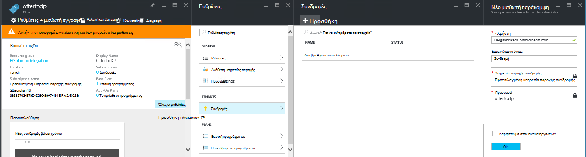

<properties
    pageTitle="Ανάθεση προσφορών σε στοίβα Azure | Microsoft Azure"
    description="Μάθετε πώς μπορείτε να τοποθετήσετε άλλα άτομα υπεύθυνο για τη δημιουργία προσφορών και εγγράφεστε τους χρήστες που."
    services="azure-stack"
    documentationCenter=""
    authors="AlfredoPizzirani"
    manager="byronr"
    editor=""/>

<tags
    ms.service="azure-stack"
    ms.workload="na"
    ms.tgt_pltfrm="na"
    ms.devlang="na"
    ms.topic="article"
    ms.date="10/07/2016"
    ms.author="alfredop"/>

#Ανάθεση προσφορών σε στοίβα Azure

Ως διαχειριστής υπηρεσιών, συχνά θέλετε να τοποθετήσετε σε άλλα άτομα υπεύθυνο για τη δημιουργία προσφορών και εγγράφεστε τους χρήστες που. Για παράδειγμα, αυτό μπορεί να συμβεί εάν είστε μια υπηρεσία παροχής και θέλετε μεταπωλητών να εγγραφούν πελάτες και να διαχειριστείτε τους για λογαριασμό σας. Αυτό μπορεί να συμβεί επίσης σε μια εταιρεία, εάν είστε μέλος μιας ομάδας κεντρικής IT και θέλετε τμήματα ή τις θυγατρικές να εγγραφούν οι χρήστες χωρίς την παρέμβαση του.

Ανάθεση σάς βοηθά να με αυτές τις εργασίες, βοηθώντας σας να φτάσετε και να διαχειρίζεστε περισσότερους χρήστες από αυτήν που θα έχει τη δυνατότητα να κάνετε απευθείας. Η παρακάτω εικόνα εμφανίζει ένα επίπεδο της ανάθεσης, αλλά στοίβα Azure υποστηρίζει πολλά επίπεδα. Ανάθεση υπηρεσίες παροχής με τη σειρά να αναθέσετε σε άλλες υπηρεσίες παροχής, έως και πέντε επίπεδα.

Οι διαχειριστές μπορούν να αναθέσετε τη δημιουργία προσφορών και μισθωτές σε άλλους χρήστες χρησιμοποιώντας τη λειτουργικότητα ανάθεση.

##Τους ρόλους και τα βήματα που περιγράφονται σε ανάθεση

Για να κατανοήσετε ανάθεση, έχετε υπόψη ότι υπάρχουν τρεις ρόλοι που εμπλέκονται:

-   Ο **διαχειριστής της υπηρεσίας** διαχειρίζεται την υποδομή Azure στοίβα, δημιουργεί ένα πρότυπο προσφορά και αναθέτει το προσφέρουν στους χρήστες τους από άλλους.

-   Οι χρήστες έχουν ανατεθεί ονομάζονται **Πληρεξούσιοι υπηρεσίες παροχής**. Μπορούν να ανήκουν σε άλλες εταιρείες (όπως άλλες μισθωτές Azure Active Directory).

-   **Οι χρήστες** εγγραφείτε για τις προσφορές και χρησιμοποιήστε τις για τη Διαχείριση τους φόρτους εργασίας, τη δημιουργία ΣΠΣ, την αποθήκευση δεδομένων, κ.λπ.

Όπως φαίνεται στο παρακάτω γραφικό, υπάρχουν δύο βήματα στη ρύθμιση ανάθεση.

1.  Προσδιορίστε τις υπηρεσίες παροχής ανάθεση. Αυτό γίνεται με τους συνδρομή σε μια προσφορά με βάση ένα σχέδιο που περιέχει μόνο την υπηρεσία συνδρομές.
    Χρήστες που εγγράφονται σε αυτήν την προσφορά απόκτηση ορισμένες από τις δυνατότητες του διαχειριστή της υπηρεσίας, καθώς και τη δυνατότητα να επεκτείνετε προσφορές και πραγματοποιήστε τους χρήστες για χρήση τους.

2.  Ανάθεση προσφοράς στην υπηρεσία παροχής, ανάθεση. Αυτήν την προσφορά λειτουργεί ως πρότυπο για το τι μπορεί να προσφέρει η υπηρεσία παροχής που έχουν ανατεθεί. Η υπηρεσία παροχής ανάθεση είναι τώρα μπορούν να λαμβάνουν την προσφορά, επιλέξτε ένα όνομα για αυτό (αλλά μην αλλάξετε των υπηρεσιών και των ορίων) και το προσφέρετε στους πελάτες.

Για να λειτουργήσει ως ανάθεση υπηρεσίες παροχής, οι χρήστες πρέπει να δημιουργήσετε μια σχέση με την υπηρεσία παροχής του κύριου; με άλλα λόγια, πρέπει να δημιουργήσετε μια συνδρομή. Σε αυτό το σενάριο, αυτή η συνδρομή προσδιορίζει τις υπηρεσίες παροχής ανάθεση ως έχουν το δικαίωμα να παρουσιάσετε προσφορών εκ μέρους της κύριας υπηρεσίας.

Όταν δημιουργηθεί αυτή τη σχέση, ο διαχειριστής του συστήματος να αναθέσετε μια προσφορά στην υπηρεσία παροχής, ανάθεση. Η υπηρεσία παροχής ανάθεση είναι τώρα μπορούν να λαμβάνουν την προσφορά, μετονομάστε την σε (αλλά μην αλλάξετε της ουσίας) και την προσφορά για τους πελάτες.

Για να δημιουργήσετε μια ανάθεση υπηρεσία παροχής, πληρεξουσίου προσφοράς και βεβαιωθείτε ότι οι χρήστες μπορούν να εγγραφείτε για αυτό, ακολουθήστε τις οδηγίες στις ενότητες που ακολουθούν.

##Ρύθμιση ρόλων

Για να δείτε μια υπηρεσία παροχής που έχουν ανατεθεί στην εργασία, χρειάζεστε επιπλέον λογαριασμούς Azure Active Directory εκτός από το λογαριασμό διαχειριστή υπηρεσίας. Εάν δεν έχετε τους, δημιουργήστε τους δύο λογαριασμούς. Οι λογαριασμοί μπορούν να ανήκουν σε οποιαδήποτε μισθωτή AAD. Θα αναφέρουμε τους ως η ανάθεση υπηρεσία παροχής (DP) και ο χρήστης.

| **Ρόλος** | **Εταιρικό δικαιωμάτων** |
| -------------------- | ----------------------- |
|  Ανάθεση υπηρεσία παροχής | Χρήστη |
| Χρήστη | Χρήστη |

##Προσδιορίστε τις υπηρεσίες παροχής ανάθεση

1.  Πραγματοποιήστε είσοδο ως διαχειριστής της υπηρεσίας.

2.  Δημιουργήστε την προσφορά που θα σας επιτρέψει μισθωτές για να γίνετε ανάθεση υπηρεσίες παροχής. Αυτό απαιτεί να δημιουργήσετε ένα σχέδιο και μια προσφορά με βάση το εξής:

    μια.  [Δημιουργία σχεδίου](azure-stack-create-plan.md).
        Αυτό το πρόγραμμα πρέπει να περιλαμβάνει μόνο την υπηρεσία συνδρομές. Σε αυτό το άρθρο, χρησιμοποιούμε ένα πρόγραμμα που ονομάζεται PlanForDelegation.

    β.  [Δημιουργία μιας προσφοράς](azure-stack-create-offer.md) 
     που βασίζονται σε αυτό το πρόγραμμα. Σε αυτό το άρθρο, χρησιμοποιούμε μια προσφορά που ονομάζεται OfferToDP.

    c.  Μόλις ολοκληρωθεί η δημιουργία της προσφοράς, προσθέστε το Αναγνωριστικό χρήστη της υπηρεσίας παροχής ανάθεση ως ένας μισθωτής για αυτήν την προσφορά κάνοντας κλικ στην επιλογή     **συνδρομές** &gt; **Προσθήκη** &gt; **Νέας συνδρομής μισθωτή**.

  

> [AZURE.NOTE]Όπως με όλες οι προσφορές Azure στοίβα, έχετε την επιλογή να πραγματοποιήσετε την προσφορά χρήστες δημόσιας και να εκφράζετε εγγραφείτε στο, ή διατήρηση του ιδιωτικού και αντιμετωπίζετε διαχειριστή της υπηρεσίας διαχείρισης την εγγραφή. Υπηρεσίες παροχής ανάθεση είναι συνήθως μια μικρή ομάδα και θέλετε να ελέγξετε ποιος είναι δεκτοί στο, ώστε να διατήρηση αυτήν την προσφορά ιδιωτικό θα έχει νόημα στις περισσότερες περιπτώσεις.

##Διαχειριστής υπηρεσιών δημιουργεί την ανάθεση προσφορά

Τώρα που έχετε καθορίσει παροχής ανάθεση. Το επόμενο βήμα είναι να δημιουργήσετε το σχέδιο και προσφορά που πρόκειται να αναθέσετε και που θα χρησιμοποιούν οι πελάτες σας. Θα πρέπει να ορίσετε αυτήν την προσφορά ακριβώς όπως θέλετε οι πελάτες για να δείτε, επειδή δεν θα μπορούν να αλλάξουν τα προγράμματα και ορίων περιλαμβάνει την υπηρεσία παροχής του έχουν ανατεθεί.

1.  Ως διαχειριστής της υπηρεσίας, να [δημιουργήσετε ένα σχέδιο](azure-stack-create-plan.md) και [μια προσφορά](azure-stack-create-offer.md) με βάση το. Για αυτό το άρθρο, χρησιμοποιούμε μια προσφορά που ονομάζεται DelegatedOffer.
> [AZURE.NOTE]Δεν χρειάζεται να γίνουν δημόσια αυτήν την προσφορά. Μπορούν να γίνουν δημόσια Εάν επιλέξετε, αλλά, στις περισσότερες περιπτώσεις, θέλετε μόνο ανάθεση υπηρεσίες παροχής για να έχετε πρόσβαση σε αυτό. Αφού αναθέσετε μια ιδιωτική προσφορά όπως περιγράφεται στα παρακάτω βήματα, η υπηρεσία παροχής ανάθεση θα έχουν πρόσβαση σε αυτό.

2.  Για να αναθέσετε την προσφορά. Μεταβείτε στην DelegatedOffer, και στο παράθυρο ρυθμίσεις, κάντε κλικ στην επιλογή **Ανάθεση υπηρεσίες παροχής** &gt; **Προσθήκη**.

3.  Επιλέξτε τη συνδρομή της υπηρεσίας παροχής ανάθεση από το πλαίσιο αναπτυσσόμενης λίστας και επιλέξτε **πληρεξούσιος**.

> 

##Ανάθεση παροχής προσαρμόζει την προσφορά

Πραγματοποιήστε είσοδο με την υπηρεσία παροχής του πληρεξούσιου και δημιουργήστε μια νέα προσφορά χρησιμοποιώντας την ανάθεση προσφορά ως πρότυπο.

1.  Κάντε κλικ στην επιλογή **νέο** &gt; **μισθωτή προσφέρει + προγράμματος** &gt; **προσφορά**.

    

2.  Αντιστοιχίστε ένα όνομα για την προσφορά. Εδώ επιλέξτε ResellerOffer. Επιλέξτε την ανάθεση προσφορά για να βασίσετε σε και, στη συνέχεια, κάντε κλικ στην επιλογή **Δημιουργία**.
    
    

    >[AZURE.NOTE] Σημείωση η διαφορά σε σύγκριση με το προσφέρουν δημιουργίας ως έμπειρους από το διαχειριστή της υπηρεσίας. Η υπηρεσία παροχής που έχουν ανατεθεί δεν δημιουργήσετε την προσφορά από προγράμματα βάσης και το πρόσθετο προγράμματος; κάνει να επιλέξουν μόνο από προσφορές που έχουν ανατεθεί σε εκείνη και δεν θα κάνουν αλλαγές σε αυτά.

3. Δημοσιοποιήστε την προσφορά κάνοντας κλικ στην επιλογή **Αναζήτηση** &gt; **προσφέρει**, επιλέγοντας την προσφορά και κάνοντας κλικ στην επιλογή **Αλλαγή κατάστασης**.

4. Η υπηρεσία παροχής ανάθεση εκθέτει αυτές τις προσφορές μέσω πύλης δικές του διεύθυνση URL. Σημειώστε ότι αυτές τις προσφορές είναι ορατό μόνο σε αυτήν την ανάθεση πύλη. Για να βρείτε και να αλλάξετε αυτήν τη διεύθυνση URL:

    μια.  Κάντε κλικ στην επιλογή **Αναζήτηση** &gt; **Ρυθμίσεις υπηρεσίας παροχής** &gt; **διεύθυνση URL πύλης**.

    β.  Εάν θέλετε να αλλάξετε το Αναγνωριστικό υπηρεσίας παροχής.

    c.  Αντιγράψτε την πύλη διεύθυνση URL για μια ξεχωριστή θέση, όπως το Σημειωματάριο.

    
<!-- -->
Τώρα έχετε ολοκληρώσει τη δημιουργία μιας προσφοράς ανάθεση ως ανάθεση παροχής. Αποσυνδεθείτε ως την υπηρεσία παροχής του έχουν ανατεθεί. Κλείστε την καρτέλα του προγράμματος περιήγησης που χρησιμοποιείτε.

##Εγγραφείτε για την προσφορά

1.  Σε ένα νέο παράθυρο του προγράμματος περιήγησης, μεταβείτε στην πύλη του πληρεξούσιου διεύθυνση URL που έχετε αποθηκεύσει στο προηγούμενο βήμα. Πραγματοποιήστε είσοδο πύλη του ως χρήστης. Σημείωση: πρέπει να χρησιμοποιήσετε την πύλη του πληρεξούσιου για αυτό το βήμα. Την ανάθεση προσφορά δεν θα είναι ορατός διαφορετικά.

2.  Στον πίνακα εργαλείων, κάντε κλικ στην επιλογή **λήψη μιας συνδρομής**. Θα δείτε ότι μόνο οι προσφορές ανάθεση που δημιουργήθηκε από την υπηρεσία παροχής του πληρεξούσιου παρουσιάζονται στο χρήστη:

> 

Έτσι ολοκληρώνεται η διαδικασία για την προσφορά ανάθεση. Ο χρήστης μπορεί να τώρα εγγραφή για αυτήν την προσφορά με γρήγορα μια συνδρομή για αυτό.

##Ανάθεση πολλαπλών επιπέδων

Ανάθεση πολλαπλών επιπέδων επιτρέπει την υπηρεσία παροχής του πληρεξούσιου για να αναθέσετε την προσφορά για να άλλων οντοτήτων. Αυτό σας επιτρέπει, για παράδειγμα, τη δημιουργία βαθύτερη μεταπωλητή κανάλια, στο οποίο η υπηρεσία παροχής τη Διαχείριση στοίβας Azure αναθέτει μια προσφορά διανομέας, ο οποίος με τη σειρά αναθέτει να μεταπωλητή.
Azure στοίβα υποστηρίζει έως και πέντε επίπεδα ανάθεση.

Για να δημιουργήσετε πολλές σειρές ανάθεση προσφορά, την υπηρεσία παροχής του πληρεξούσιου αναθέτει με τη σειρά την προσφορά στην επόμενη υπηρεσία παροχής. Η διαδικασία είναι η ίδια για την ανάθεση παροχής όπως ήταν για το διαχειριστή της υπηρεσίας (ανατρέξτε στο θέμα [Διαχείριση υπηρεσίας δημιουργεί την ανάθεση προσφορά](#service-admin-creates-the-delegated-offer)).

##Επόμενα βήματα
[Παροχή μια εικονική Μηχανή](azure-stack-provision-vm.md)
