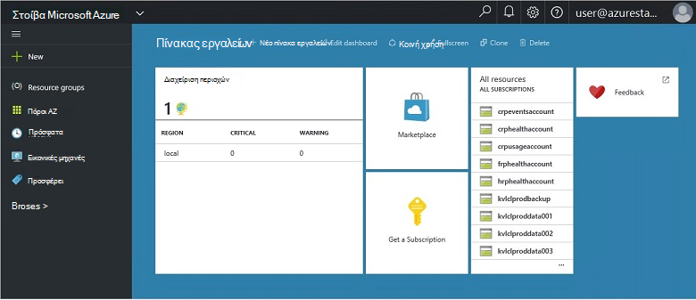
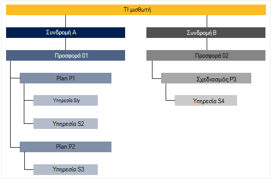

<properties
    pageTitle="Βασικές δυνατότητες και έννοιες σε στοίβα Azure | Microsoft Azure"
    description="Μάθετε περισσότερα σχετικά με τις βασικές δυνατότητες και τα θέματα σε στοίβα Azure."
    services="azure-stack"
    documentationCenter=""
    authors="Heathl17"
    manager="byronr"
    editor=""/>

<tags
    ms.service="azure-stack"
    ms.workload="na"
    ms.tgt_pltfrm="na"
    ms.devlang="na"
    ms.topic="article"
    ms.date="10/25/2016"
    ms.author="helaw"/>

# Βασικές δυνατότητες και έννοιες σε στοίβα Azure

Εάν είστε νέος χρήστης του Microsoft Azure στοίβα, ίσως είναι χρήσιμο αυτούς τους όρους και περιγραφών δυνατοτήτων.

## Φανταστικά πρόσωπα

Υπάρχουν δύο ποικιλίες των χρηστών για το Microsoft Azure στοίβα, ο διαχειριστής της υπηρεσίας και ο μισθωτής (πελάτη).

-  Ο **διαχειριστής της υπηρεσίας** να ρυθμίσετε και να διαχειριστείτε υπηρεσίες παροχής πόρων, μισθωτή προσφορές, προγράμματα, υπηρεσίες, ορίων και τις πληροφορίες τιμολόγησης.
-  **Μισθωτή** αποκτά (ή αγοράζει) υπηρεσίες που προσφέρει ο διαχειριστής της υπηρεσίας. Μισθωτές μπορούν να προμηθεύσουν παρακολούθηση και διαχείριση των υπηρεσιών που τους έχετε εγγραφεί στο, όπως τα Web Apps, χώρος αποθήκευσης και εικονικές μηχανές.

## Πύλη

Η κύρια μεθόδους αλληλεπίδραση με το Microsoft Azure στοίβας είναι η πύλη και PowerShell.

Πύλη του Microsoft Azure στοίβας είναι μια παρουσία της πύλης Azure εκτελούνται σε διακομιστές σας. Πρόκειται για μια τοποθεσία web που παρέχει μια εμπειρία από το χρήστη για διαχειριστές υπηρεσιών και μισθωτές με έλεγχο πρόσβασης βάσει ρόλων (RBAC) για τους πόρους και χωρητικότητας cloud, ενεργοποίηση γρήγορης εφαρμογών και υπηρεσιών ανάπτυξης και.

## Περιοχές, τις υπηρεσίες, προγράμματα, προσφορές και συνδρομών

Σε στοίβα Azure, υπηρεσίες παραδίδονται στους μισθωτές χρησιμοποιώντας περιοχές, συνδρομές, προσφορές και προγράμματα. Μισθωτές να εγγραφείτε σε πολλές προσφορές. Προσφορές μπορούν να έχουν ένα ή περισσότερα προγράμματα και σχέδια μπορεί να έχει μία ή περισσότερες υπηρεσίες.

Παράδειγμα ιεραρχία των συνδρομών του μισθωτή προσφορές, κάθε μία με διάφορα προγράμματα και υπηρεσίες.

### Περιοχές
Azure στοίβας περιοχές είναι ένα βασικό στοιχείο κλίμακας και διαχείρισης.  Μια εταιρεία μπορεί να έχει πολλές περιοχές με τους πόρους που είναι διαθέσιμες σε κάθε περιοχή.  Περιοχές μπορεί να έχουν επίσης διαφορετική υπηρεσία προσφορές που είναι διαθέσιμες.

### Υπηρεσίες

Microsoft Azure στοίβας επιτρέπει υπηρεσίες παροχής για να παρέχουν μια ευρεία ποικιλία υπηρεσιών και εφαρμογές, όπως εικονικές μηχανές, SQL Server βάσεις δεδομένων, του SharePoint, το Exchange και πολλά άλλα.

### Προγράμματα

Τα προγράμματα έχουν ομαδοποιήσεις μία ή περισσότερες υπηρεσίες. Με μια υπηρεσία παροχής, μπορείτε να δημιουργήσετε σχέδια για την προσφορά για μισθωτές σας. Με τη σειρά σας μισθωτές εγγραφείτε προσφέρει σας για να χρησιμοποιήσετε τα προγράμματα και τις υπηρεσίες που περιλαμβάνουν.

Κάθε υπηρεσία που προσθέσατε σε ένα πρόγραμμα μπορεί να ρυθμιστεί με τις ρυθμίσεις του ορίου θα σας βοηθήσουν να διαχειριστείτε τη χωρητικότητα cloud. Τα όρια μπορούν να περιλαμβάνουν περιορισμούς όπως Εικονική μνήμη RAM και CPU όρια και εφαρμόζονται ανά χρήστη συνδρομή. Όρια μπορεί να διαφέρει από τη θέση. Για παράδειγμα, ένα σχέδιο που περιέχει τις υπηρεσίες υπολογισμού από την περιοχή A θα μπορούσε να έχει ένα όριο δύο εικονικές μηχανές, 4GB RAM και 10 πυρήνων CPU.

Κατά τη σύνταξη μια προσφορά, ο διαχειριστής της υπηρεσίας μπορούν να περιλαμβάνουν **προγράμματα βάσης**. Αυτά τα προγράμματα βάσης περιλαμβάνονται από προεπιλογή, όταν ένας μισθωτής εγγράφεται σε αυτήν την προσφορά. Μόλις ένας χρήστης εγγράφεται (και τη δημιουργία συνδρομής), ο χρήστης έχει πρόσβαση σε όλες τις πόρων υπηρεσίες παροχής που καθορίζονται σε αυτές τις βασικές προγράμματος (με την αντίστοιχη ορίων).

Ο διαχειριστής της υπηρεσίας επίσης να συμπεριλάβετε **το πρόσθετο προγράμματος** σε μια προσφορά. Το πρόσθετο προγράμματος δεν περιλαμβάνονται από προεπιλογή για τη συνδρομή. Το πρόσθετο προγράμματος είναι επιπλέον προγράμματα (ορίων) διαθέσιμη σε μια προσφορά έναν κάτοχο για τη συνδρομή να προσθέσετε τις συνδρομές.

### Προσφέρει

Προσφορές είναι οι ομάδες από ένα ή περισσότερα προγράμματα που παρουσιάζουν υπηρεσίες παροχής στους μισθωτές να αγοράσετε (εγγραφή σε). Για παράδειγμα, προσφέρουν άλφα μπορεί να περιέχει πρόγραμμα A (από 1 περιοχή που περιέχει ένα σύνολο υπηρεσιών υπολογισμού) και σχεδιασμός B (από την περιοχή 2 που περιέχει ένα σύνολο υπηρεσιών χώρου αποθήκευσης και δικτύου).

Μια προσφορά συνοδεύεται από ένα σύνολο βάσης σχέδια και διαχειριστές υπηρεσιών να δημιουργήσετε πρόσθετο προγράμματος που μπορεί να προσθέσει μισθωτές της συνδρομής.

### Συνδρομές

Συνδρομή είναι πώς μισθωτές αγορά προσφέρει σας. Συνδρομή είναι ένας συνδυασμός από έναν μισθωτή με μια προσφορά. Ένας μισθωτής μπορούν να έχουν συνδρομές σε πολλές προσφορές. Κάθε συνδρομής ισχύει για μία μόνο την προσφορά. Συνδρομές του μισθωτή να καθορίσετε ποια προγράμματα/services μπορούν να έχουν πρόσβαση.

Συνδρομές βοηθούν οργάνωση πρόσβαση και χρήση των πόρων cloud και τις υπηρεσίες παροχής.

## Azure από διαχειριστή πόρων

Χρησιμοποιώντας τη διαχείριση πόρων Azure, μπορείτε να εργαστείτε με τους πόρους σας υποδομής σε ένα μοντέλο declaritive, με βάση το πρότυπο.   Παρέχει ένα μεμονωμένο περιβάλλον εργασίας που μπορείτε να χρησιμοποιήσετε για την ανάπτυξη, διαχείριση και την παρακολούθηση των στοιχείων λύσης σας, όπως εικονικές μηχανές, λογαριασμούς χώρου αποθήκευσης, εφαρμογές web και βάσεων δεδομένων. Για αναλυτικές πληροφορίες και οδηγίες, ανατρέξτε στο θέμα η [Επισκόπηση της διαχείρισης πόρων Azure](../azure-resource-manager/resource-group-overview.md).

### Ομάδες πόρων

Ομάδες πόρων είναι συλλογές τους πόρους, τις υπηρεσίες και τις εφαρμογές, και κάθε πόρο έχει έναν τύπο, όπως εικονικές μηχανές, εικονικό δίκτυα, δημόσια διευθύνσεις IP, λογαριασμούς χώρου αποθήκευσης και τοποθεσίες Web που διαθέτετε. Κάθε πόρο πρέπει να είναι σε μια ομάδα πόρων και έτσι βοηθά τις ομάδες πόρων λογικά οργανώσετε τους πόρους, όπως φόρτο εργασίας ή θέση.

Ακολουθούν ορισμένα σημαντικά πράγματα που πρέπει να λάβετε υπόψη κατά τον καθορισμό μιας ομάδας πόρων:

-   Κάθε πόρος μπορεί να υπάρχει μόνο σε μία ομάδα πόρων.

-   Θα αναπτύξετε, ενημέρωση και διαγραφή στοιχείων σε μια ομάδα πόρων μαζί. Εάν ένας πόρος, όπως ένα διακομιστή βάσης δεδομένων, πρέπει να υπάρχει σε έναν κύκλο διαφορετική ανάπτυξη, πρέπει να σε μια άλλη ομάδα πόρων.

-   Μπορείτε να προσθέσετε ή να καταργήσετε έναν πόρο σε μια ομάδα πόρων ανά πάσα στιγμή.

-   Μπορείτε να μετακινήσετε έναν πόρο από μια ομάδα πόρων σε μια άλλη ομάδα.

-   Μια ομάδα πόρων μπορεί να περιέχει τους πόρους που βρίσκονται σε διαφορετικές περιοχές.

-   Μια ομάδα πόρων μπορεί να χρησιμοποιηθεί για την εμβέλεια έλεγχος πρόσβασης για διαχειριστικές εργασίες.

-   Ένας πόρος μπορεί να συνδεθεί σε έναν πόρο σε μια άλλη ομάδα πόρων όταν οι δύο πόροι πρέπει να αλληλεπιδρούν μεταξύ τους, αλλά δεν έχουν την ίδια κύκλου ζωής. Για παράδειγμα, πολλές εφαρμογές πρέπει να συνδεθείτε με μια βάση δεδομένων, αλλά αυτήν τη βάση δεδομένων δεν πρέπει να ενημερωθούν ή να διαγραφούν με το ίδιο ρυθμό ως τις εφαρμογές.

-   Στο Microsoft Azure στοίβα, τους πόρους, όπως προγράμματα και τις προσφορές γίνεται επίσης σε ομάδες πόρων.

-   Μπορείτε να αναπτύξετε εκ νέου μια ομάδα πόρων.  Αυτό είναι χρήσιμο για σκοπούς δοκιμής ή ανάπτυξη.  

### Azure πρότυπα διαχείρισης πόρων

Με το Azure διαχείριση πόρων, μπορείτε να δημιουργήσετε ένα απλό πρότυπο (σε μορφή JSON) που καθορίζει ανάπτυξης και ρύθμισης παραμέτρων της εφαρμογής σας. Αυτό το πρότυπο είναι γνωστό ως πρότυπο του Azure από διαχειριστή πόρων και παρέχει δηλωτικό τρόπο για να ορίσετε μια ανάπτυξη. Χρησιμοποιώντας ένα πρότυπο, επανειλημμένα μπορείτε να αναπτύξετε την εφαρμογή σας σε όλο τον κύκλο ζωής εφαρμογή και να έχετε εμπιστοσύνης τους πόρους σας έχουν αναπτυχθεί σε μια συνεπή κατάσταση.

## Υπηρεσίες παροχής πόρων (RPs) — RP δικτύου, τον υπολογισμό RP, RP χώρου αποθήκευσης

Υπηρεσίες παροχής πόρων είναι υπηρεσίες web που αποτελούν το ίδρυμα για όλες τις IaaS που βασίζονται στο Azure και τις υπηρεσίες PaaS. Azure διαχείριση πόρων βασίζεται σε διαφορετική RPs να δώσετε πρόσβαση σε υπηρεσίες της κεντρικής.

Υπάρχουν τρία κύρια RPs: δικτύου, αποθήκευση και υπολογισμού. Κάθε μία από αυτές τις RPs σάς βοηθά να ρυθμίσετε τις παραμέτρους και να ελέγχετε τα αντίστοιχα πόρους. Διαχειριστές υπηρεσιών επίσης να προσθέσετε νέες υπηρεσίες παροχής προσαρμοσμένης πόρων.

### Τον υπολογισμό RP

Η υπηρεσία παροχής τον υπολογισμό πόρων (Προγ) επιτρέπει στους μισθωτές Azure στοίβας για να δημιουργήσετε τις δικές τους εικονικές μηχανές. Επίσης, παρέχει λειτουργικότητα για το διαχειριστή της υπηρεσίας για να εγκαταστήσετε και να ρυθμίσετε την υπηρεσία παροχής πόρων για μισθωτές. Το Προγ περιλαμβάνει τη δυνατότητα να δημιουργήσουν εικονικές μηχανές, καθώς και επεκτάσεις εικονική μηχανή. Η υπηρεσία επέκταση εικονική μηχανή βοηθάει στην παροχή IaaS δυνατοτήτων για τα Windows και Linux εικονικές μηχανές.

### Δίκτυο RP

Η υπηρεσία παροχής πόρων δικτύου (NRP) προσφέρει μια σειρά από δυνατότητες λογισμικού που ορίζονται από το δίκτυο (SDN) και Virtualization συνάρτηση δικτύου (NFV) για το cloud ιδιωτικό. Αυτές οι δυνατότητες είναι συνεπείς με το Azure δημόσια cloud ώστε να μπορούν να εγγραφούν μία φορά και να αναπτυχθεί τόσο στο cloud Azure δημόσια ή εσωτερικής εγκατάστασης Microsoft Azure στοίβας πρότυπα εφαρμογών. Το δίκτυο RP παρέχει πιο λεπτομερή έλεγχο δικτύου, ετικέτες μετα-δεδομένων, ταχύτερη ρύθμισης παραμέτρων, ταχεία και επαναλαμβανόμενης προσαρμογής και πολλών διασυνδέσεων ελέγχου (συμπεριλαμβανομένων των PowerShell, .NET SDK, Node.JS SDK, βάσει REST API). Μπορείτε να χρησιμοποιήσετε το NRP για τη δημιουργία λογισμικού φόρτωσης balancers, δημόσια διευθύνσεις IP, δικτύου τις ομάδες ασφαλείας, εικονικό δίκτυα, μεταξύ άλλων.

### Χώρος αποθήκευσης RP

Το χώρο αποθήκευσης RP προσφέρει τέσσερις Azure συνεπή υπηρεσίες αποθήκευσης: blob, πίνακα, ουρά και διαχείριση λογαριασμού. Επίσης, προσφέρει μια υπηρεσία αποθήκευσης στο cloud διαχείρισης ώστε να διευκολύνετε τη διαχείριση της υπηρεσίας παροχής υπηρεσίας των υπηρεσιών Azure συνεπή αποθήκευσης. Azure αποθήκευσης παρέχει την ευελιξία να αποθηκεύετε και να ανακτήσετε μεγάλες ποσότητες μη δομημένα δεδομένα, όπως έγγραφα και αρχεία πολυμέσων με αντικείμενα blob του Azure, και δομημένες NoSQL, με βάση δεδομένα με πίνακες Azure. Για περισσότερες πληροφορίες σχετικά με Azure χώρου αποθήκευσης, ανατρέξτε στο θέμα [Εισαγωγή στο Microsoft Azure αποθήκευσης](../storage/storage-introduction.md).

#### Χώρος αποθήκευσης αντικειμένων blob

Χώρος αποθήκευσης αντικειμένων blob αποθηκεύει κάθε σύνολο δεδομένων. Ένα blob μπορεί να είναι οποιονδήποτε τύπο κειμένου ή δυαδικά δεδομένα, όπως ένα έγγραφο, αρχείο πολυμέσων ή εφαρμογή του προγράμματος εγκατάστασης. Χώρος αποθήκευσης πινάκων αποθηκεύει δομημένα σύνολα δεδομένων. Χώρος αποθήκευσης πινάκων είναι κατάστημα NoSQL κλειδί χαρακτηριστικό δεδομένων, που επιτρέπει την ταχεία ανάπτυξη και γρήγορη πρόσβαση σε μεγάλες ποσότητες δεδομένων. Αποθήκευση ουράς παρέχει αξιόπιστη ανταλλαγής μηνυμάτων για επεξεργασία ροής εργασίας και για την επικοινωνία μεταξύ των στοιχείων από τις υπηρεσίες cloud.

Κάθε blob είναι οργανωμένες σε ένα κοντέινερ. Κοντέινερ παρέχουν επίσης ένας χρήσιμος τρόπος για να αντιστοιχίσετε πολιτικές ασφαλείας σε ομάδες αντικειμένων. Ένα λογαριασμό του χώρου αποθήκευσης μπορούν να περιέχουν οποιονδήποτε αριθμό κοντέινερ και ένα κοντέινερ μπορούν να περιέχουν οποιονδήποτε αριθμό αντικείμενα blob, μέχρι το όριο δυναμικότητας 500 TB του λογαριασμού χώρου αποθήκευσης. Αντικειμένων blob αποθήκευσης προσφέρει τρεις τύποι αντικειμένων blob, αποκλεισμός αντικείμενα blob, Προσάρτηση αντικείμενα BLOB και αντικείμενα BLOB σελίδας (δίσκων). Αντικείμενα BLOB μπλοκ είναι βελτιστοποιημένη για ροή και αποθήκευση cloud αντικειμένων και δεν είναι μια καλή επιλογή για την αποθήκευση εγγράφων, αρχεία πολυμέσων, δημιουργία αντιγράφων ασφαλείας κ.λπ. Προσάρτηση αντικείμενα BLOB είναι παρόμοια με αντικείμενα BLOB μπλοκ, αλλά είναι βελτιστοποιημένη για λειτουργία προσάρτησης. Ένα blob προσάρτησης μπορούν να ενημερωθούν μόνο με την προσθήκη ενός νέου μπλοκ στο τέλος. Προσάρτηση αντικείμενα BLOB είναι μια καλή επιλογή για σενάρια, όπως η καταγραφή, όπου πρέπει να εγγραφεί μόνο μέχρι το τέλος της blob τα νέα δεδομένα. Αντικείμενα BLOB σελίδας είναι βελτιστοποιημένα για την απεικόνιση δίσκων IaaS και υποστήριξης τυχαία συντάσσει και μπορεί να είναι έως 1 TB στο μέγεθος. Ένα δίκτυο Azure εικονικό μηχάνημα που έχουν επισυναφθεί IaaS δίσκος είναι VHD έχουν αποθηκευτεί ως ένα αντικείμενο blob σελίδας.

#### Χώρος αποθήκευσης πινάκων

Χώρος αποθήκευσης πινάκων είναι store κλειδί/χαρακτηριστικό NoSQL της Microsoft-που έχει μια σχεδίαση χωρίς σχήματα, καθιστώντας διαφορετικό από παραδοσιακά σχεσιακές βάσεις δεδομένων. Εφόσον δεδομένων αποθηκεύει την έλλειψη σχήματα, είναι εύκολο να προσαρμόσετε τα δεδομένα σας με τις ανάγκες σας evolve εφαρμογής. Χώρος αποθήκευσης πινάκων είναι εύκολη τη χρήση, ώστε να τους προγραμματιστές να δημιουργήσετε γρήγορα εφαρμογές. Χώρος αποθήκευσης πινάκων είναι κατάστημα χαρακτηριστικό αριθμό-κλειδί, γεγονός που σημαίνει ότι κάθε τιμή σε έναν πίνακα είναι αποθηκευμένο με ένα όνομα ιδιότητας που πληκτρολογήσατε. Το όνομα της ιδιότητας μπορεί να χρησιμοποιηθεί για φιλτράρισμα και τον καθορισμό κριτηρίων επιλογής. Μια συλλογή ιδιότητες και τις τιμές τους περιλαμβάνει μια οντότητα. Δεδομένου ότι οι διατάξεις την έλλειψη χώρου αποθήκευσης πίνακα, δύο οντοτήτων στον ίδιο πίνακα μπορούν να περιέχουν διαφορετικές συλλογές ιδιοτήτων και μπορεί να είναι αυτές οι ιδιότητες διαφορετικών τύπων. Μπορείτε να χρησιμοποιήσετε το χώρο αποθήκευσης πινάκων για την αποθήκευση ευέλικτη σύνολα δεδομένων, όπως τα δεδομένα των χρηστών για τις εφαρμογές web, βιβλία διευθύνσεων, πληροφορίες για τη συσκευή και οποιονδήποτε άλλο τύπο μετα-δεδομένων που απαιτεί την υπηρεσία. Μπορείτε να αποθηκεύσετε οποιονδήποτε αριθμό οντοτήτων σε έναν πίνακα και ένα λογαριασμό του χώρου αποθήκευσης ενδέχεται να περιέχουν οποιονδήποτε αριθμό πίνακες, μέχρι το όριο δυναμικότητας του λογαριασμού χώρου αποθήκευσης.

#### Ουρά χώρου αποθήκευσης
Χώρος αποθήκευσης Azure ουρά παρέχει cloud μηνυμάτων μεταξύ των στοιχείων της εφαρμογής. Κατά τη σχεδίαση εφαρμογών για την κλίμακα, στοιχεία εφαρμογής συχνά είναι αποσυνδεδεμένη, έτσι ώστε να κλιμακωθεί ανεξάρτητα. Αποθήκευση ουράς προσφέρει ασύγχρονης ανταλλαγής μηνυμάτων για την επικοινωνία μεταξύ των στοιχείων της εφαρμογής, εάν εκτελούνται στο cloud, στην επιφάνεια εργασίας, σε ένα διακομιστή εσωτερικής εγκατάστασης ή σε μια κινητή συσκευή. Αποθήκευση ουρά υποστηρίζει επίσης τη Διαχείριση εργασιών ασύγχρονης και τη δημιουργία ροών εργασίας διαδικασία.

## Έλεγχος πρόσβασης (RBAC) βάσει ρόλων

Μπορείτε να χρησιμοποιήσετε RBAC για να εκχωρήσετε πρόσβαση στο σύστημα σε εξουσιοδοτημένους χρήστες, ομάδες και τις υπηρεσίες, εκχωρώντας τους ρόλους σε μια συνδρομή, ομάδα πόρων ή σε επίπεδο μεμονωμένου πόρου. Κάθε ρόλο Καθορίζει το επίπεδο πρόσβασης ενός χρήστη, ομάδας ή υπηρεσία έχει πάνω από το Microsoft Azure στοίβας πόρους.

Azure RBAC περιλαμβάνει τρεις βασικές ρόλους που ισχύουν για όλους τους τύπους πόρων: κάτοχο, συμβολής και ανάγνωσης. Κάτοχος έχει πλήρη πρόσβαση σε όλους τους πόρους, όπως τα δεξιά για να αναθέσετε πρόσβαση σε άλλους χρήστες. Συνεργάτης να δημιουργήσετε και να διαχειριστείτε όλους τους τύπους των πόρων Azure αλλά δεν μπορεί να εκχωρήσει πρόσβαση σε άλλους χρήστες. Πρόγραμμα ανάγνωσης μόνο να προβάλετε υπάρχοντα Azure πόρους. Το υπόλοιπο των ρόλων RBAC στο Azure να επιτρέπεται η διαχείριση των συγκεκριμένων Azure πόρων. Για παράδειγμα, ο ρόλος συμβολής εικονική μηχανή επιτρέπει τη δημιουργία και τη διαχείριση των εικονικές μηχανές αλλά δεν επιτρέπει τη διαχείριση του εικονικού δικτύου ή το υποδίκτυο στο οποίο η εικονική μηχανή συνδέεται με.

## Χρήση δεδομένων

Microsoft Azure στοίβας συλλέγει και συγκεντρώνει δεδομένα χρήσης σε όλες τις υπηρεσίες παροχής πόρων για την παροχή μια συνοπτική αναφορά ανά χρήστη. Δεδομένα μπορεί να είναι τόσο απλή όσο η καταμέτρηση αναλωμένες πόρων, ή πολύπλοκα όπως επιμέρους μετρητών επιδόσεις και την κλίμακα. Τα δεδομένα είναι διαθέσιμα μέσω REST API. Υπάρχει μια συνεπή Azure API του μισθωτή, καθώς και υπηρεσία παροχής και πληρεξούσιοι APIs υπηρεσία παροχής που χρησιμοποιείτε για να δεδομένων χρήσης σε όλες τις συνδρομές του μισθωτή. Αυτά τα δεδομένα μπορεί να χρησιμοποιηθεί για την ενοποίηση με ένα εξωτερικό εργαλείο ή μια υπηρεσία για χρέωση ή ετοιμάζετε.

## Επόμενα βήματα

[Ανάπτυξη Azure στοίβας Technical Preview 2 (POC)](azure-stack-deploy.md)
