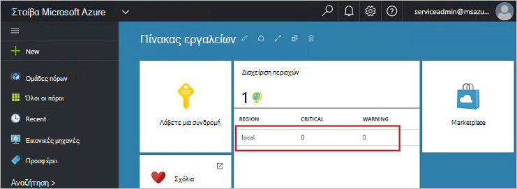
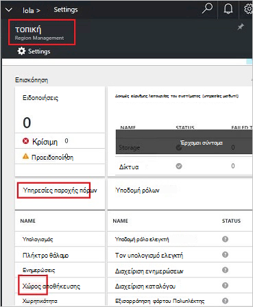
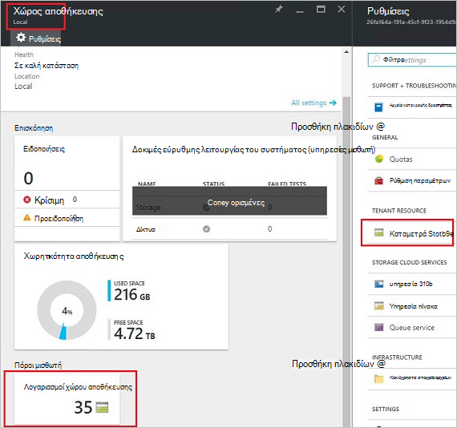
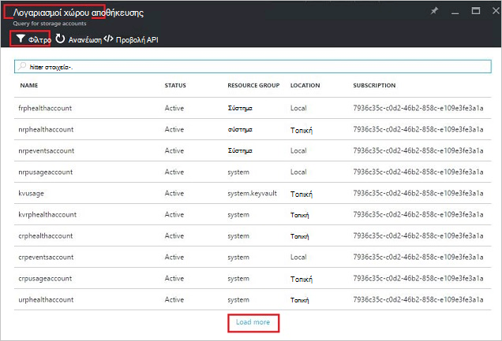
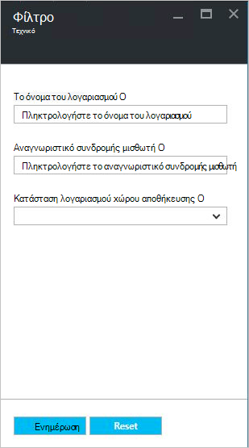
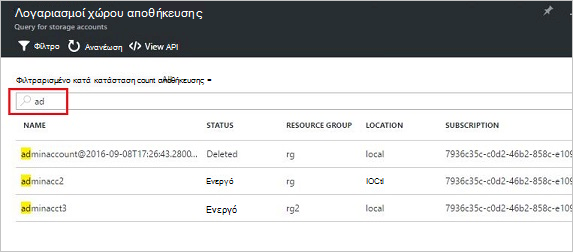
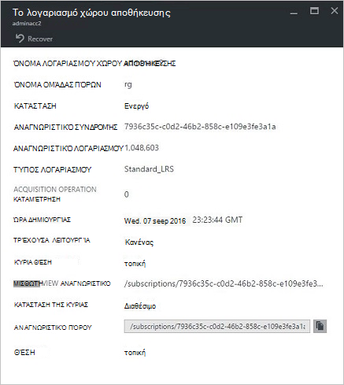
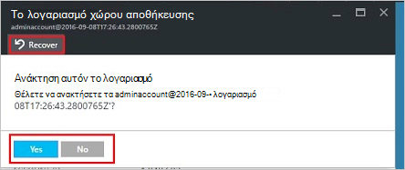
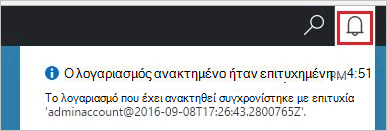
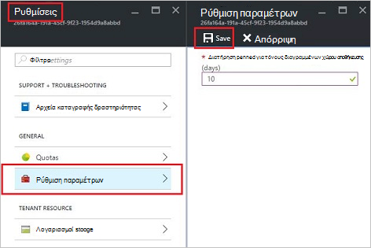

<properties
    pageTitle="Διαχείριση λογαριασμών αποθήκευσης στοίβας Azure | Microsoft Azure"
    description="Μάθετε πώς μπορείτε να βρείτε, να διαχειριστείτε, ανάκτηση και ανακτήσετε λογαριασμοί Azure στοίβας χώρου αποθήκευσης"
    services="azure-stack"
    documentationCenter=""
    authors="AniAnirudh"
    manager="darmour"
    editor=""/>

<tags
    ms.service="azure-stack"
    ms.workload="na"
    ms.tgt_pltfrm="na"
    ms.devlang="na"
    ms.topic="get-started-article"
    ms.date="09/26/2016"
    ms.author="anirudha"/>

# <a name="manage-storage-accounts-in-azure-stack"></a>Διαχείριση λογαριασμών χώρου αποθήκευσης σε στοίβα Azure

Μάθετε πώς μπορείτε να διαχειριστείτε τους λογαριασμούς χώρου αποθήκευσης σε στοίβα Azure για να βρείτε, να ανακτήσετε και ανακτήσετε χωρητικότητα αποθήκευσης που βασίζεται σε επιχειρηματικές ανάγκες.

## <a name="find-a-storage-account"></a>Εύρεση ενός λογαριασμού χώρου αποθήκευσης

Η λίστα λογαριασμών χώρου αποθήκευσης στην περιοχή μπορούν να προβληθούν σε στοίβα Azure από:

1.  Σε ένα πρόγραμμα περιήγησης στο internet, μεταβείτε [https://portal.azurestack.local](https://portal.azurestack.local/).

2.  Είσοδος στην πύλη του Azure στοίβας ως διαχειριστής (χρησιμοποιώντας τα διαπιστευτήρια που παρείχατε κατά την ανάπτυξη)

3.  Στον πίνακα εργαλείων του προεπιλεγμένου – βρείτε **Διαχείριση περιοχών** λίστα και κάντε κλικ στην περιοχή που θέλετε να εξερευνήσετε – για παράδειγμα **(τοπικό**).

    

4.  Επιλέξτε **χώρο αποθήκευσης** από τη λίστα **Υπηρεσιών παροχής πόρων** .

    

5.  Τώρα, στην την blade πόρων υπηρεσία παροχής διαχείρισης χώρου αποθήκευσης – κάντε κύλιση προς τα κάτω, στην καρτέλα "Λογαριασμοί χώρου αποθήκευσης" και κάντε κλικ σε αυτό.

    
    
    Η σελίδα που προκύπτει είναι η λίστα λογαριασμών χώρο αποθήκευσης στη συγκεκριμένη περιοχή.

    

Από προεπιλογή, εμφανίζονται τα πρώτα 10 λογαριασμούς. Μπορείτε να επιλέξετε να κάνετε λήψη περισσότερα, κάνοντας κλικ στη σύνδεση "Φόρτωση περισσότερα" στο κάτω μέρος της λίστας <br>
OR <br>
Εάν που σας ενδιαφέρει ένα λογαριασμό συγκεκριμένο χώρο αποθήκευσης – μπορείτε να **φιλτράρετε και να κάνετε λήψη στους σχετικούς λογαριασμούς** μόνο.<br>

Για να φιλτράρετε για τους λογαριασμούς:

1. Κάντε κλικ στο κουμπί φίλτρο στο επάνω μέρος του blade.

2. Στην blade το φίλτρο, σας επιτρέπει να καθορίσετε **το όνομα του λογαριασμού**,  **Αναγνωριστικό συνδρομής** ή **κατάστασης** για να επεξεργαστείτε τη λίστα λογαριασμών χώρου αποθήκευσης που θα εμφανίζεται. Χρησιμοποιήστε τους ανάλογα με την περίπτωση.

3. Κάντε κλικ στην επιλογή ενημέρωση. Στη λίστα θα πρέπει να ανανεώσετε αντίστοιχα.

    

4. Για να επαναφέρετε το φίλτρο-κάντε κλικ στο κουμπί φίλτρο, καταργήστε την επιλογή από τις επιλογές και ενημέρωση.

Το πλαίσιο κειμένου αναζήτησης, στο επάνω μέρος του χώρου αποθήκευσης blade λίστα λογαριασμών, σας επιτρέπει να επισημάνετε το επιλεγμένο κείμενο στη λίστα των λογαριασμών. Αυτό είναι πολύ χρήσιμο στην περίπτωση που όταν το πλήρες όνομα ή το αναγνωριστικό δεν είναι διαθέσιμη εύκολα.<br>
Μπορείτε να χρησιμοποιήσετε δωρεάν κείμενο εδώ για να σας βοηθήσουν να βρείτε το λογαριασμό που σας ενδιαφέρει.




## <a name="look-at-account-details"></a>Εξετάστε τις λεπτομέρειες λογαριασμού

Μόλις εντοπίσετε τους λογαριασμούς που σας ενδιαφέρει προβολή, μπορείτε να κάνετε κλικ στο συγκεκριμένο λογαριασμό για να προβάλετε ορισμένες λεπτομέρειες. Θα ανοίξει ένα νέο blade με τις λεπτομέρειες λογαριασμού, όπως τον τύπο του λογαριασμού, ώρας δημιουργίας, θέση κ.λπ.




## <a name="recover-a-deleted-account"></a>Ανάκτηση μιας διαγραμμένης λογαριασμού

Ενδέχεται να είναι σε θέση όπου θέλετε να ανακτήσετε λογαριασμούς που έχουν διαγραφεί.<br>
Στο AzureStack υπάρχει ένα πολύ απλό τρόπο για να το κάνετε.

1.  Μεταβείτε αναζήτηση στη λίστα λογαριασμών του χώρου αποθήκευσης. [Ανατρέξτε στο θέμα εύρεση ενός λογαριασμού χώρου αποθήκευσης](#find-a-storage-account)

2.  Εντοπίστε το συγκεκριμένο λογαριασμό στη λίστα. Ίσως χρειαστεί να εφαρμόσετε το φίλτρο.

3.  Ελέγξτε το "μέλος" του λογαριασμού. Θα πρέπει να υπάρχει η ένδειξη "Διαγραφή".

4.  Κάντε κλικ στο λογαριασμό που ανοίγει το blade λεπτομέρειες λογαριασμού.

5.  Επάνω από αυτό blade – εντοπίστε το κουμπί "ανάκτηση" και κάντε κλικ σε αυτό.

6.  Επιβεβαιώστε πατώντας "Ναι"

    

7.  Την ανάκτηση είναι τώρα στη διαδικασία... Περιμένετε ένδειξη ότι ήταν επιτυχημένη.
    Μπορείτε επίσης να επιλέξετε το εικονίδιο "καμπάνας" στο επάνω μέρος της πύλης για να δείτε την πρόοδο ενδείξεις.

    

  Μόλις το λογαριασμό που έχει ανακτηθεί συγχρονίζεται με επιτυχία, μία να επιστρέψετε στη χρήση του.

### <a name="some-gotchas"></a>Ορισμένες υποδείξεις

- Το διαγραμμένο λογαριασμό εμφανίζει την κατάσταση ως "εκτός διατήρησης".

  Αυτό σημαίνει ότι ο λογαριασμός διαγραμμένων έχει υπερβεί η περίοδος διατήρησης και ενδέχεται να μην μπορούν να ανακτηθούν πλέον.

- Διαγραμμένα το λογαριασμό σας δεν εμφανίζεται στη λίστα λογαριασμοί.

  Αυτό θα μπορούσε να σημαίνει ότι ο λογαριασμός διαγραμμένων έχει ήδη απορριμμάτων που συλλέγονται. Σε αυτήν την περίπτωση δεν μπορεί να ανακτηθεί πλέον. Ανατρέξτε στο θέμα "ανακτήσετε χωρητικότητα" κάτω από το στοιχείο.

## <a name="set-retention-period"></a>Ορισμός περίοδος διατήρησης

Ρύθμιση του χρόνου διατήρησης επιτρέπει ένας διαχειριστής για να καθορίσετε μια χρονική περίοδο σε ημέρες (μεταξύ 0 και 9999 ημέρες) κατά την οποία οποιονδήποτε λογαριασμό διαγραμμένων ενδεχομένως είναι δυνατή η ανάκτηση. Η προεπιλεγμένη περίοδος διατήρησης ορίζεται σε 15 ημέρες. Ρύθμιση της τιμής σε "0" σημαίνει ότι οποιαδήποτε λογαριασμούς που έχουν διαγραφεί αμέσως θα είστε εκτός διατήρησης και έχει επισημανθεί για τη συλλογή απορριμμάτων περιοδικό.

Για να αλλάξετε την περίοδο διατήρησης –

1.  Σε ένα πρόγραμμα περιήγησης στο internet, μεταβείτε [https://portal.azurestack.local](https://portal.azurestack.local/).

2.  Είσοδος στην πύλη του Azure στοίβας ως διαχειριστής (χρησιμοποιώντας τα διαπιστευτήρια που παρείχατε κατά την ανάπτυξη)

3.  Στον πίνακα εργαλείων του προεπιλεγμένου – βρείτε **Διαχείριση περιοχών** λίστα και κάντε κλικ στην περιοχή που θέλετε να εξερευνήσετε – για παράδειγμα **(τοπικό**).

4.  Επιλέξτε **χώρο αποθήκευσης** από τη λίστα **Υπηρεσιών παροχής πόρων** .

5.  Κάντε κλικ στο εικονίδιο ρυθμίσεις στο επάνω μέρος για να ανοίξετε το blade τη ρύθμιση.

6.  Κάντε κλικ στη ρύθμιση παραμέτρων - περίοδος διατήρησης.

7.  Μπορείτε να επεξεργαστείτε την τιμή και να το αποθηκεύσετε.

 Αυτή η τιμή θα αμέσως αποτελεσματική και αντανακλούν σε ολόκληρη την περιοχή σας.



## <a name="reclaim-capacity"></a>Ανακτήστε χωρητικότητα

Ένα από τα εφέ πλευρά χρειάζεται μια περίοδος διατήρησης είναι ότι λογαριασμούς που έχουν διαγραφεί θα συνεχίσουν να εκμετάλλευση δυναμικότητα μέχρι να εμφανιστεί εκτός της περιόδου διατήρησης. Ως διαχειριστής μπορεί να χρειαστεί ένας τρόπος για να ανακτήσετε αυτό διαγράψει λογαριασμούς χώρου Παρόλο που δεν έχει λήξει η περίοδος διατήρησης ακόμη. Προς το παρόν, μπορείτε να χρησιμοποιήσετε μια cmdline για να παρακάμψετε ρητά η περίοδος διατήρησης και να ανακτήσετε αμέσως την ικανότητα. Για να το κάνετε:

1.  Υποθέτοντας ότι έχετε Azure PowerShell εγκαθίσταται και ρυθμίζεται. Αν δεν ακολουθήστε τις οδηγίες εδώ: για να εγκαταστήσετε την πιο πρόσφατη έκδοση του PowerShell Azure και να συσχετίσετε με τη συνδρομή σας στο Azure, δείτε [πώς μπορείτε να εγκαταστήσετε και να ρυθμίσετε τις παραμέτρους του PowerShell Azure](http://azure.microsoft.com/documentation/articles/powershell-install-configure/).
    Για περισσότερες πληροφορίες σχετικά με τα cmdlet διαχείρισης πόρων Azure, ανατρέξτε στο θέμα [Χρήση του PowerShell Azure με τη διαχείριση πόρων Azure](http://go.microsoft.com/fwlink/?LinkId=394767)

2.  Εκτελέσετε αυτό το cmdlet:

    ```
    PS C:\\>; Clear-ACSStorageAccount -ResourceGroupName system
    -FarmName <your farmname>
    ```

> Για περισσότερες λεπτομέρειες, ανατρέξτε στην [τεκμηρίωση του powershell AzureStack](https://msdn.microsoft.com/library/mt637964.aspx)

> [AZURE.NOTE] Εκτελεί αυτό το cmdlet θα διαγράψει οριστικά το λογαριασμό και τα περιεχόμενά της. Δεν θα είναι πλέον ανακτήσιμα. Χρησιμοποιήστε με προσοχή.

