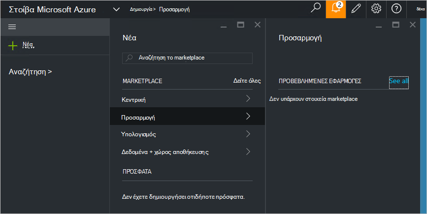

<properties
    pageTitle="Δημοσίευση ενός προσαρμοσμένου marketplace στοιχείου σε στοίβα Azure (διαχειριστή της υπηρεσίας) | Microsoft Azure"
    description="Ως διαχειριστής υπηρεσιών, μάθετε πώς μπορείτε να δημοσιεύσετε ένα στοιχείο προσαρμοσμένη marketplace σε στοίβα Azure."
    services="azure-stack"
    documentationCenter=""
    authors="rupisure"
    manager="byronr"
    editor=""/>

<tags
    ms.service="azure-stack"
    ms.workload="na"
    ms.tgt_pltfrm="na"
    ms.devlang="na"
    ms.topic="article"
    ms.date="09/26/2016"
    ms.author="rupisure"/>

# Αγορά του Azure στοίβας

Αγορά του είναι μια συλλογή στοιχείων προσαρμοσμένο για Azure στοίβα, όπως τις υπηρεσίες, εφαρμογών και πόρων. Αυτό είναι το σημείο όπου προέρχονται μισθωτές για τη δημιουργία νέων πόρων και ανάπτυξη νέες εφαρμογές. Διαχειριστές υπηρεσιών να προσθέσετε προσαρμοσμένα στοιχεία στο Marketplace και μισθωτές θα τις δείτε αμέσως.

Για να ανοίξετε το Marketplace, κάντε κλικ στην επιλογή **Δημιουργία**.

Αγορά του ενημερώνεται κάθε πέντε λεπτά.

## Στοιχεία Marketplace

Κάθε στοιχείο Marketplace περιλαμβάνει:

-   Ένα πρότυπο από διαχειριστή πόρων Azure για την προμήθεια του πόρου

-   Μετα-δεδομένα, όπως συμβολοσειρές, τα εικονίδια και άλλες μάρκετινγκ του ανταγωνισμού

-   Πληροφορίες για να εμφανίσετε το στοιχείο στην πύλη μορφοποίησης

Κάθε στοιχείο που δημοσιεύονται στο Store χρησιμοποιεί μια μορφή που ονομάζεται το πακέτο συλλογή Azure (azpkg). Ανάπτυξη ή χρόνου εκτέλεσης πόρους (όπως κώδικας, Ταχυδρομικός αρχεία με λογισμικό ή εικόνες εικονική μηχανή) πρέπει να προστεθεί σε στοίβα Azure ξεχωριστά, όχι ως μέρος του στοιχείου Marketplace. 

## Επόμενα βήματα

[Δημιουργία και δημοσίευση ενός στοιχείου marketplace](azure-stack-create-and-publish-marketplace-item.md)
