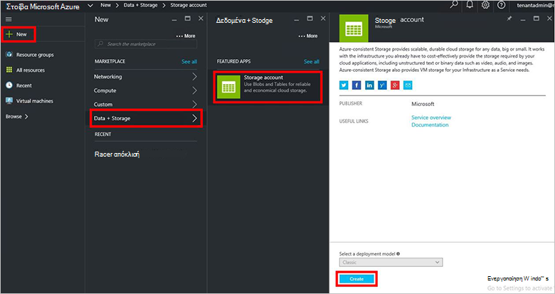
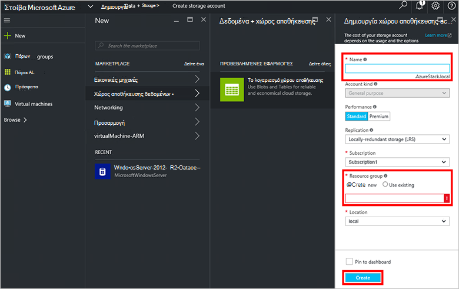
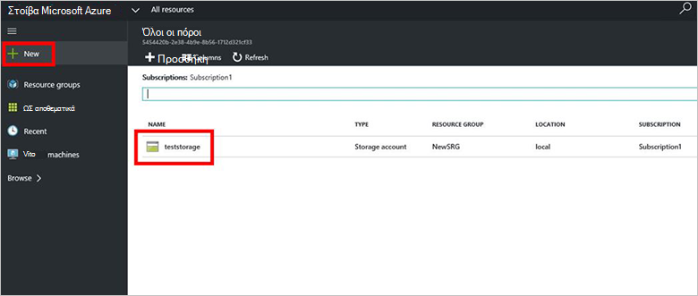

<properties
    pageTitle="Λογαριασμοί χώρου αποθήκευσης σε στοίβα Azure | Microsoft Azure"
    description="Μάθετε πώς μπορείτε να δημιουργήσετε ένα λογαριασμό χώρου αποθήκευσης Azure στοίβας."
    services="azure-stack"
    documentationCenter=""
    authors="ErikjeMS"
    manager="byronr"
    editor=""/>

<tags
    ms.service="azure-stack"
    ms.workload="na"
    ms.tgt_pltfrm="na"
    ms.devlang="na"
    ms.topic="get-started-article"
    ms.date="09/26/2016"
    ms.author="erikje"/>

# Λογαριασμοί χώρου αποθήκευσης σε στοίβα Azure

Χώρος αποθήκευσης λογαριασμοί περιλαμβάνουν υπηρεσίες Blob και πίνακα και το μοναδικό χώρο ονομάτων για τα αντικείμενα δεδομένων χώρου αποθήκευσης. Από προεπιλογή, τα δεδομένα στο λογαριασμό σας είναι διαθέσιμη μόνο σε εσάς, ο κάτοχος λογαριασμού χώρου αποθήκευσης.

1.  Στον υπολογιστή POC στοίβας Azure, συνδεθείτε στο `https://portal.azurestack.local` ως [διαχειριστής](azure-stack-connect-azure-stack.md#log-in-as-a-service-administrator), και, στη συνέχεια, κάντε κλικ στην επιλογή **Δημιουργία** > **δεδομένων + χώρος αποθήκευσης** > **λογαριασμού χώρου αποθήκευσης**.

    

2.  Στο blade τη **Δημιουργία λογαριασμού χώρου αποθήκευσης** , πληκτρολογήστε ένα όνομα για το λογαριασμό χώρου αποθήκευσης. Δημιουργήστε μια νέα **Ομάδα πόρων**, ή επιλέξτε ένα υπάρχον και, στη συνέχεια, κάντε κλικ στην επιλογή **Δημιουργία** για να δημιουργήσετε το λογαριασμό χώρου αποθήκευσης.

    

3. Για να δείτε τον νέο σας λογαριασμό χώρου αποθήκευσης, κάντε κλικ στην επιλογή **όλους τους πόρους**, στη συνέχεια, αναζήτηση για το λογαριασμό χώρου αποθήκευσης και κάντε κλικ στο όνομά της.

    
    
## Επόμενα βήματα

[Χρησιμοποιήστε πρότυπα για τη διαχείριση πόρων Azure](azure-stack-arm-templates.md)

[Μάθετε περισσότερα σχετικά με τους λογαριασμούς Azure χώρου αποθήκευσης](../storage/storage-create-storage-account.md)

[Λήψη του οδηγού επικύρωσης Azure συνεπή αποθήκευσης Azure στοίβας](http://aka.ms/azurestacktp1doc)
