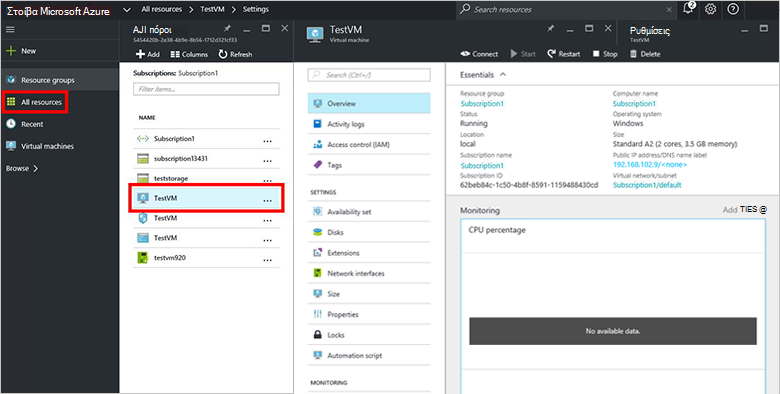

<properties
    pageTitle="Προμήθεια μια εικονική Μηχανή σε στοίβα Azure (μισθωτής) | Microsoft Azure"
    description="Ως ένα μισθωτή, μάθετε πώς μπορείτε να παρέχετε μια Εικονική σε στοίβα Azure."
    services="azure-stack"
    documentationCenter=""
    authors="ErikjeMS"
    manager="byronr"
    editor=""/>

<tags
    ms.service="azure-stack"
    ms.workload="na"
    ms.tgt_pltfrm="na"
    ms.devlang="na"
    ms.topic="get-started-article"
    ms.date="10/12/2016"
    ms.author="erikje"/>

# Παροχή μια εικονική μηχανή

Ως διαχειριστής, μπορείτε να δημιουργήσετε εικονικές μηχανές προς αξιολόγηση πόρους πριν να σας δίνει τη δυνατότητα τους στα προγράμματα.

## Παροχή μια εικονική μηχανή

1.  Στον υπολογιστή POC στοίβας Azure, συνδεθείτε στο `https://portal.azurestack.local` ως [διαχειριστής](azure-stack-connect-azure-stack.md#log-in-as-a-service-administrator), και, στη συνέχεια, κάντε κλικ στην επιλογή **Δημιουργία** > **εικονικές μηχανές** > **WindowsServer-2012-R2-κέντρου δεδομένων**.  

    

2.  Στο blade τα **βασικά στοιχεία** , πληκτρολογήστε ένα **όνομα**, **όνομα χρήστη**και **τον κωδικό πρόσβασης**. Για τον **τύπο του δίσκου Εικονική**, επιλέξτε **σκληρού ΔΊΣΚΟΥ**. Επιλέξτε μια **συνδρομή**. Δημιουργήστε μια **ομάδα πόρων**, ή επιλέξτε ένα υπάρχον και, στη συνέχεια, κάντε κλικ στο κουμπί **OK**.  

3.  Στο το blade **Επιλέξτε ένα μέγεθος** , κάντε κλικ στην επιλογή **Βασικό A1**και, στη συνέχεια, κάντε κλικ στην **επιλογή**.  

4.  Στο το blade **Ρυθμίσεις** , κάντε κλικ στην επιλογή **εικονικές δικτύου**. Στο blade την **Επιλογή εικονικού δικτύου** , κάντε κλικ στην επιλογή **Δημιουργία νέου**. Στο blade τη **Δημιουργία εικονικού δικτύου** , αποδεχτείτε τις προεπιλεγμένες τιμές και κάντε κλικ στο κουμπί **OK**. Στο το blade **Ρυθμίσεις** , κάντε κλικ στο κουμπί **OK**.

    

5.  Στο blade τη **Σύνοψη** , κάντε κλικ στο κουμπί **OK** για να δημιουργήσετε την εικονική μηχανή.  

6. Για να δείτε το νέο εικονική μηχανή, κάντε κλικ στην επιλογή **όλους τους πόρους**, στη συνέχεια, αναζητήστε την εικονική μηχανή και κάντε κλικ στο όνομά της.

    

## Επόμενα βήματα

[Λογαριασμοί χώρου αποθήκευσης](azure-stack-provision-storage-account.md)
