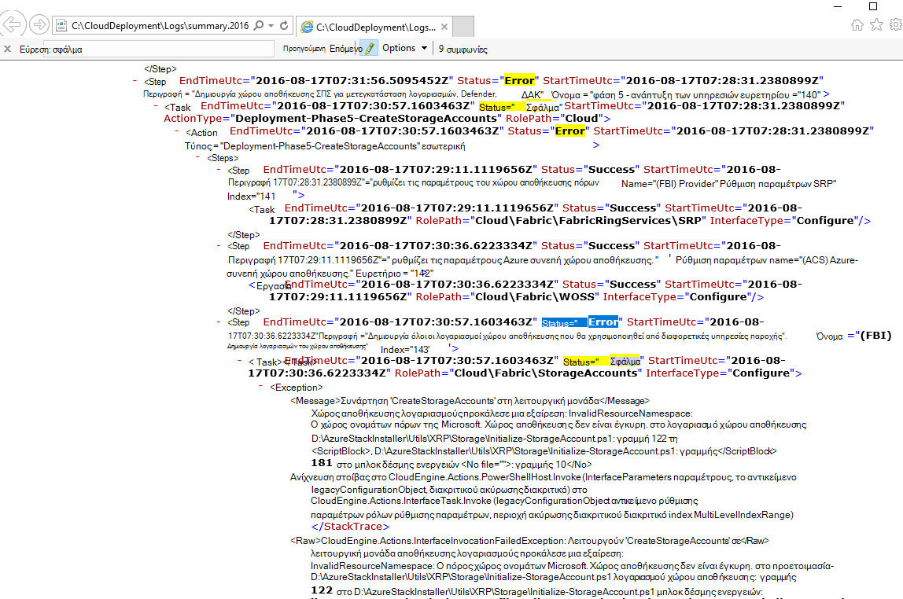
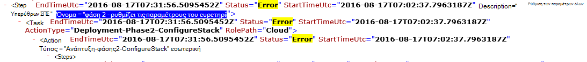

<properties
    pageTitle="Εκτελέστε ξανά μια ανάπτυξη από ένα βήμα αποτυχίας | Microsoft Azure"
    description="Εάν αντιμετωπίζετε ένα σφάλμα κατά την ανάπτυξη, μπορείτε να δοκιμάσετε τα παρακάτω βήματα για να εκτελέσετε ξανά την ανάπτυξη από όπου απέτυχε."
    services="azure-stack"
    documentationCenter=""
    authors="ErikjeMS"
    manager="byronr"
    editor=""/>

<tags
    ms.service="azure-stack"
    ms.workload="na"
    ms.tgt_pltfrm="na"
    ms.devlang="na"
    ms.topic="get-started-article"
    ms.date="09/26/2016"
    ms.author="erikje"/>
    
# Εκτελέστε ξανά μια ανάπτυξη από ένα βήμα αποτυχίας
  
Εάν αντιμετωπίζετε ένα σφάλμα κατά την ανάπτυξη, μπορείτε να δοκιμάσετε τα παρακάτω βήματα για να εκτελέσετε ξανά την ανάπτυξη από όπου απέτυχε.

## Βρείτε την αποτυχία

Απέτυχε η λήψη σημειώσεων από την αποτυχία, ειδικά το τμήμα που καλεί στο οποίο βήμα της κλήσης. Για παράδειγμα,

**2016-08-17 00:30:57 σφάλματος 1 > 1 > ενέργεια: κλήση της βήμα 60.140.143 απέτυχε. Διακοπή κλήση του σχεδίου δράσης.**

Αυτό είναι το βήμα ανάπτυξης πού θα ξεκινήσετε την επανεκτέλεση της ανάπτυξης.

## Βρείτε περισσότερες λεπτομέρειες σχετικά με την αποτυχία

Εάν θέλετε περισσότερες λεπτομέρειες σχετικά με το σφάλμα, βρείτε τη συσχετισμένη **Σύνοψη. ΕΕΕΕ-MM-DD.tt.N.log.xml** στο το **C:\CloudDeployment\Logs\* * φακέλου.
Αναζήτηση για τη συμβολοσειρά "Σφάλμα" και μετά τον προς τα κάτω έως το αποτέλεσμα του μέχρι να δείτε μια μεγάλη ποσότητα μη-XML μορφοποιημένο κείμενο το οποίο περιέχει το μήνυμα σφάλματος (αυτή η ενότητα συχνά συμπίπτει με την τελευταία παρουσία της συμβολοσειράς "Σφάλμα"). Για παράδειγμα:

Μπορείτε επίσης να χρησιμοποιήσετε αυτές τις πληροφορίες για να παρακολουθείτε εκτελέστε ξανά το βήμα, ακολουθήστε τους αριθμούς "Ευρετήριο" από αυτό το τελευταίο σφάλμα. Στην παραπάνω εικόνα, μπορείτε να δείτε (ξεκινώντας από το κάτω μέρος): 143, 140 και μετά, εάν κύλιση προς τα επάνω, δείτε 60:

Εισάγετε όλα μαζί (now από επάνω προς τα κάτω), λαμβάνετε 60.140.143, όπως ακριβώς στο αποτέλεσμα PS κονσόλας της αποτυχίας (όπως φαίνεται στην ενότητα "Εύρεση την αποτυχία" παραπάνω).

## Εκτελέστε ξανά την ανάπτυξη σε ένα συγκεκριμένο βήμα

Τώρα που έχετε στο βήμα που απέτυχε η ανάπτυξη στην, μπορείτε να επιχειρήσετε-Επανεκτέλεση της ανάπτυξης από αυτό το βήμα.

> [AZURE.IMPORTANT] Τις παρακάτω εντολές πρέπει να εκτελεστούν από το σωστό χρήστη, σε περιβάλλον με το σφάλμα που προέκυψε. Εάν η αποτυχία προέκυψε πριν από τον κεντρικό ΥΠΟΛΟΓΙΣΤΉ έχει συνδεθεί με τον τομέα, εκτελέστε τα παρακάτω βήματα με το λογαριασμό του τοπικού διαχειριστή. Εάν το σφάλμα παρουσιάστηκε μετά τον κεντρικό ΥΠΟΛΟΓΙΣΤΉ έχει συνδεθεί με τον τομέα, εκτελέστε τα παρακάτω βήματα ως διαχειριστής του τομέα σας (azurestack\azurestackadmin).

### Εκτέλεση της εντολής Ενεργοποίηση EceAction

1. Από μια κονσόλα PS αναβαθμισμένα δικαιώματα, εισαγάγετε τις ακόλουθες ενότητες:

        Import-Module C:\CloudDeployment\CloudDeployment.psd1 -Force
        Import-Module C:\CloudDeployment\ECEngine\EnterpriseCloudEngine.psd1 -Force 

2. Στη συνέχεια, εκτελέστε την ακόλουθη εντολή (παράδειγμα από σημείο άνωθεν χρησιμοποιείται εδώ):

        Invoke-EceAction -RolePath Cloud -ActionType Deployment -Start 60.140.143 -Verbose

3.  Αυτό θα ξεκινήσει η ανάπτυξη από το βήμα που έχουν προσδιοριστεί από την - παράμετρο έναρξης της εντολής Ενεργοποίηση EceAction

### Αποτελέσματα-Επανεκτέλεση /-έναρξης

Ανεξάρτητα από την επιλογή επιλέξετε, την ανάπτυξη θα αρχίσει ξανά από το καθορισμένο - αρχίστε παραμέτρου.

1.  Εάν το σφάλμα είναι ανακτήσιμα, την ανάπτυξη θα συνεχίσει μέχρι την ολοκλήρωσή.

2.  Εάν η ανάπτυξη αποτύχει ξανά στο...
    
    - στην ίδια θέση: το σφάλμα ενδέχεται να μην είναι ανακτήσιμα και περαιτέρω έρευνα απαιτείται.

    - μια νέα θέση μετά από όπου απέτυχε αυτήν τη φορά: μπορείτε να δοκιμάσετε αυτά τα ίδια βήματα για να μεταβείτε ξανά.

    - μια νέα θέση πριν από την οποία απέτυχε αυτήν τη φορά: κάτι άλλο κάποιο πρόβλημα με μια κλήση idempotent, που απαιτεί περαιτέρω έρευνα.

## Επόμενα βήματα

[Σύνδεση σε στοίβα Azure](azure-stack-connect-azure-stack.md)

