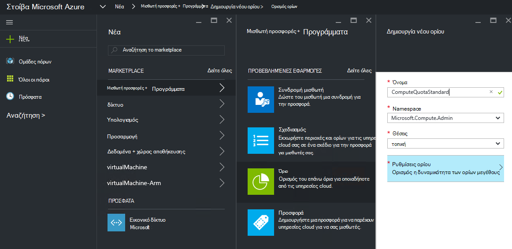
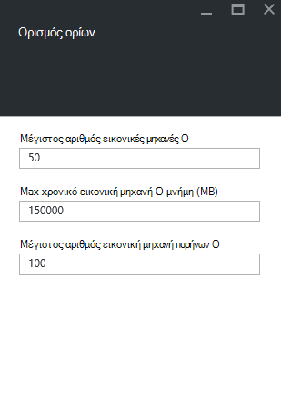

<properties
    pageTitle="Όρια σε στοίβα Azure | Microsoft Azure"
    description="Οι διαχειριστές ορισμός ορίων για να περιορίσετε το μέγιστο μέγεθος των πόρων που μισθωτές έχετε πρόσβαση."
    services="azure-stack"
    documentationCenter=""
    authors="mattmcg"
    manager="byronr"
    editor=""/>

<tags
    ms.service="azure-stack"
    ms.workload="na"
    ms.tgt_pltfrm="na"
    ms.devlang="na"
    ms.topic="get-started-article"
    ms.date="09/26/2016"
    ms.author="mattmcg"/>

# Ορισμός ορίων σε στοίβα Azure

Όρια Ορισμός τα όρια των πόρων που μια συνδρομή μισθωτή μπορούν να προμηθεύσουν ή εκμετάλλευση. Για παράδειγμα, ένα όριο ίσως επιτρέψουν μισθωτή για να δημιουργήσετε έως και πέντε ΣΠΣ. Για να προσθέσετε μια υπηρεσία σε ένα πρόγραμμα, ο διαχειριστής πρέπει να ρυθμίσετε τις παραμέτρους του ορίου για αυτήν την υπηρεσία.

Όρια είναι δυνατό να ρυθμιστούν ανά υπηρεσίας και ανά θέση, επιτρέπει στους διαχειριστές να παρέχουν λεπτομερούς έλεγχο την κατανάλωση πόρων. Οι διαχειριστές μπορούν να δημιουργούν έναν ή περισσότερους πόρους ορίου και συνδέετε με τα προγράμματα, που σημαίνει ότι μπορούν να παρέχουν διαφοροποιημένης προσφορές για τις υπηρεσίες. Όρια για μια δεδομένη υπηρεσία μπορεί να δημιουργηθεί από το blade Διαχείριση **Υπηρεσίας παροχής πόρων** για αυτήν την υπηρεσία.

Ένας μισθωτής που εγγράφεται σε μια προσφορά που περιέχει πολλά προγράμματα να χρησιμοποιήσετε όλους τους πόρους που είναι διαθέσιμες σε κάθε πρόγραμμα.

## Για να δημιουργήσετε ένα όριο IaaS

1.  Στο πρόγραμμα περιήγησης, μεταβείτε στη [https://portal.azurestack.local](https://portal.azurestack.local/).

    Πραγματοποιήστε είσοδο στην πύλη του Azure στοίβας ως διαχειριστής (χρησιμοποιώντας τα διαπιστευτήρια που παρείχατε κατά την ανάπτυξη).

2.  Επιλέξτε **Δημιουργία**και, στη συνέχεια, επιλέξτε **όριο**.

3.  Επιλέξτε την πρώτη υπηρεσία για την οποία θέλετε να δημιουργήσετε ένα όριο. Για μια ορίου IaaS, ακολουθήστε τα παρακάτω βήματα για τις υπηρεσίες του υπολογισμού, δικτύου και χώρου αποθήκευσης.
Σε αυτό το παράδειγμα, δημιουργούμε πρώτα ένα όριο για την υπηρεσία υπολογισμού. Στη λίστα **Namespace** , επιλέξτε το πεδίο ονόματος **Microsoft.Compute.Admin** .

    > 

4.  Επιλέξτε τη θέση στην οποία έχει οριστεί του ορίου (για παράδειγμα, "local").

5.  Το στοιχείο **Ρυθμίσεις ορίου** , εμφανίζεται η ένδειξη **Ορισμός δυναμικότητας του ορίου**. Κάντε κλικ σε αυτό το στοιχείο για να ρυθμίσετε τις παραμέτρους του ορίου.

6.  Στη τη **Ρύθμιση ορίων** blade, μπορείτε να δείτε όλους τους πόρους υπολογισμού για τον οποίο μπορείτε να ρυθμίσετε τα όρια. Κάθε τύπος έχει μια προεπιλεγμένη τιμή που είναι συσχετισμένη με αυτό. Μπορείτε να αλλάξετε αυτές τις τιμές ή μπορείτε να επιλέξετε το κουμπί **Ok** στο κάτω μέρος του blade για να αποδεχτείτε τις προεπιλογές.

    > 

7.  Αφού έχετε ρυθμίσει τις παραμέτρους των τιμών και κλικ στο κουμπί **Ok**, εμφανίζεται το στοιχείο **Ρυθμίσεις ορίου** ως **Ρύθμιση παραμέτρων**. Κάντε κλικ στο κουμπί **Ok** για να δημιουργήσετε τον πόρο **ορίου** .

    Θα πρέπει να δείτε μια ειδοποίηση που υποδεικνύει ότι ο πόρος ορίου δημιουργείται.

8.   Μετά τη ρύθμιση ορίου δημιουργήθηκε με επιτυχία, λαμβάνετε μια δεύτερη ειδοποίηση. Το όριο υπηρεσίας υπολογισμού είναι τώρα έτοιμο που θα συσχετιστεί με ένα πρόγραμμα. Επαναλάβετε αυτά τα βήματα με τις υπηρεσίες δικτύου και χώρου αποθήκευσης και είστε έτοιμοι να δημιουργήσετε ένα σχέδιο IaaS!

    >   

## Τον υπολογισμό τύπων ορίου

|**Τύπος**                    |**Προεπιλεγμένη τιμή**| **Περιγραφή**|
|--------------------------- | ------------------------------------|------------------------------------------------------------------|
|Μέγιστος αριθμός εικονικές μηχανές   |50|Ο μέγιστος αριθμός εικονικές μηχανές που μπορεί να δημιουργήσει μια συνδρομή σε αυτήν τη θέση. |
|Μέγιστος αριθμός πυρήνων εικονική μηχανή              |100|Ο μέγιστος αριθμός πυρήνων που μπορεί να δημιουργήσει μια συνδρομή σε αυτήν τη θέση (για παράδειγμα, μια Εικονική A3 έχει τεσσάρων πυρήνων).|
|Μέγιστο μέγεθος της μνήμης εικονική μηχανή (GB)         |150|Τη μέγιστη ποσότητα RAM που μπορεί να καθοριστεί σε megabyte (για παράδειγμα, μια Εικονική A1 καταναλώνει 1,75 GB RAM).|

> [AZURE.NOTE] Πρέπει να υπολογίσετε ορίων δεν θα εφαρμοστεί σε αυτήν την τεχνική προεπισκόπηση.

## Τύποι ορίου χώρου αποθήκευσης

|**Στοιχείο**                           |**Προεπιλεγμένη τιμή**   |**Περιγραφή**|
|---------------------------------- |------------------- |-----------------------------------------------------------|
|Μέγιστη χωρητικότητα (GB)              |500                 |Συνολική χωρητικότητα που μπορεί να χρησιμοποιηθεί από μια συνδρομή σε αυτήν τη θέση.|
|Συνολικός αριθμός των λογαριασμών χώρου αποθήκευσης   |20                  |Ο μέγιστος αριθμός των λογαριασμών χώρου αποθήκευσης που μπορεί να δημιουργήσει μια συνδρομή σε αυτήν τη θέση.|

## Τύποι ορίου δικτύου

|**Στοιχείο**                                                   |**Προεπιλεγμένη τιμή**   |**Περιγραφή**|
|----------------------------------------------------------| ------------------- |--------------------------------------------------------------------------------------------------------------------------------------------------------------------|
| Διευθύνσεις IP δημόσια Max                         |50                  |Ο μέγιστος αριθμός των δημόσιων διευθύνσεις IP που μπορεί να δημιουργήσει μια συνδρομή σε αυτήν τη θέση. |
| Max εικονικών δικτύων                   |50                  |Ο μέγιστος αριθμός εικονικού δίκτυα που μπορεί να δημιουργήσει μια συνδρομή σε αυτήν τη θέση. |
| Max εικονικού δικτύου πυλών           |1                   |Ο μέγιστος αριθμός των πυλών εικονικού δικτύου (VPN πύλες) που μπορεί να δημιουργήσει μια συνδρομή σε αυτήν τη θέση. |
| Μέγιστος αριθμός συνδέσεων δικτύου                |2                   |Ο μέγιστος αριθμός των συνδέσεων δικτύου (από σημείο σε σημείο ή τοποθεσίας σε τοποθεσία) που μπορεί να δημιουργήσει μια συνδρομή σε όλες τις πύλες εικονικού δικτύου σε αυτήν τη θέση. |
| Max φόρτωσης balancers                     |50                  |Ο μέγιστος αριθμός balancers φόρτωσης που μπορεί να δημιουργήσει μια συνδρομή σε αυτήν τη θέση. |
| NIC Max                               |100                 |Ο μέγιστος αριθμός των διασυνδέσεων δικτύου που μπορεί να δημιουργήσει μια συνδρομή σε αυτήν τη θέση. |
| Ομάδες ασφαλείας δικτύου Max            |50                  |Ο μέγιστος αριθμός των ομάδων ασφαλείας δικτύου που μπορεί να δημιουργήσει μια συνδρομή σε αυτήν τη θέση. |
