<properties
    pageTitle="Ανάπτυξη της υπηρεσίας παροχής πόρων του SQL Server σε στοίβα Azure | Microsoft Azure"
    description="Λεπτομερείς οδηγίες για την ανάπτυξη έναν προσαρμογέα παροχής SQL Server πόρων σε στοίβα Azure."
    services="azure-stack"
    documentationCenter=""
    authors="Dumagar"
    manager="byronr"
    editor=""/>

<tags
    ms.service="multiple"
    ms.workload="na"
    ms.tgt_pltfrm="na"
    ms.devlang="na"
    ms.topic="article"
    ms.date="09/26/2016"
    ms.author="dumagar"/>

# Ανάπτυξη προσαρμογέα υπηρεσία παροχής του SQL Server πόρων σε στοίβα Azure

> [AZURE.NOTE] Οι ακόλουθες πληροφορίες ισχύει μόνο για αναπτύξεις Azure στοίβα TP1.

Χρησιμοποιήστε αυτό το άρθρο για να ακολουθήσετε τα λεπτομερή βήματα για τη ρύθμιση του SQL Server πόρων παροχής προσαρμογέα στη στοίβα Azure απόδειξη της λειτουργίας (POC). Ανατρέξτε στο θέμα [χρήση βάσεων δεδομένων του SQL σε στοίβα Azure](azure-stack-sql-rp-deploy-short.md) για να κατανοήσετε δυνατότητες υπηρεσίας παροχής πόρων και την αρχιτεκτονική.

## Ρύθμιση βήματα πριν από την ανάπτυξη

Πριν να αναπτύξετε την υπηρεσία παροχής του πόρου, πρέπει να:

- Έχει μια προεπιλεγμένη εικόνα Windows Server με το .NET 3.5
- Απενεργοποιήστε την επιλογή Βελτιωμένη ασφάλεια του Internet Explorer (IE)
- Εγκαταστήστε την πιο πρόσφατη έκδοση του Azure PowerShell

### Δημιουργήστε μια εικόνα του Windows Server, συμπεριλαμβανομένων των .NET 3.5

Μπορείτε να παραλείψετε αυτό το βήμα εάν έχετε κάνει λήψη τα bit στοίβας Azure μετά 23/2/2016 επειδή η προεπιλεγμένη εικόνα Windows Server 2012 R2 base περιλαμβάνει .NET 3.5 framework σε αυτό, κάντε λήψη και νεότερες εκδόσεις.

Εάν έχετε κάνει λήψη πριν 23/2/2016, πρέπει να δημιουργήσετε έναν VHD κέντρου δεδομένων του Windows Server 2012 R2 με εικόνα .NET 3.5 και σύνολο είναι με την προεπιλεγμένη εικόνα στο αποθετήριο πλατφόρμα εικόνα.

### Απενεργοποιήστε την επιλογή IE βελτιωμένη ασφάλεια και την ενεργοποίηση cookies

Για να αναπτύξετε μια υπηρεσία παροχής πόρων, εκτελείτε το περιβάλλον ενσωματωμένη δέσμες ενεργειών στο PowerShell (ISE) ως διαχειριστής, ώστε να πρέπει να επιτρέψετε cookies και JavaScript στο προφίλ του Internet Explorer που χρησιμοποιείτε για να συνδεθείτε Azure Active Directory για το διαχειριστή και χρηστών πρόσθετα εισόδου.

**Για να απενεργοποιήσετε IE βελτιωμένη ασφάλεια:**

1. Είσοδος στον υπολογιστή στοίβας Azure απόδειξη λειτουργίας (PoC) ως AzureStack/διαχειριστής και, στη συνέχεια, ανοίξτε τη Διαχείριση διακομιστή.

2. Απενεργοποιήστε την επιλογή **IE παραμέτρων ασφαλείας** για διαχειριστές και χρήστες.

3. Πραγματοποιήστε είσοδο στο η εικονική μηχανή **ClientVM.AzureStack.local** ως διαχειριστής και, στη συνέχεια, ανοίξτε τη Διαχείριση διακομιστή.

4. Απενεργοποιήστε την επιλογή **IE παραμέτρων ασφαλείας** για διαχειριστές και χρήστες.

**Για να ενεργοποιήσετε τα cookies:**

1. Στην οθόνη έναρξης των Windows, κάντε κλικ στην επιλογή **όλες οι εφαρμογές**, κάντε κλικ στην επιλογή **Βοηθήματα των Windows**, κάντε δεξί κλικ **Του Internet Explorer**, τοποθετήστε το δείκτη σε **περισσότερες**, και, στη συνέχεια, κάντε κλικ στην επιλογή **Εκτέλεση ως διαχειριστής**.

2. Εάν σας ζητηθεί, επιλέξτε **Χρήση προτεινόμενα ασφαλείας**και, στη συνέχεια, κάντε κλικ στο κουμπί **OK**.

3. Στον Internet Explorer, κάντε κλικ στην επιλογή τα **Εργαλεία (γρανάζι) εικονίδιο** &gt; **Επιλογές Internet** &gt; καρτέλα **προστασία προσωπικών δεδομένων** .

4. Κάντε κλικ στην επιλογή **για προχωρημένους**, βεβαιωθείτε ότι είναι επιλεγμένα και τα δύο κουμπιά **Αποδοχή** , κάντε κλικ στο κουμπί **OK**και, στη συνέχεια, κάντε ξανά κλικ στο κουμπί **OK** .

5. Κλείστε τον Internet Explorer και επανεκκινήστε το PowerShell ISE ως διαχειριστής.

### Εγκαταστήσετε μια έκδοση συμβατά Azure στοίβας του Azure PowerShell

1. Καταργήστε την εγκατάσταση τυχόν υπάρχουσες Azure PowerShell από το πρόγραμμα-πελάτη Εικονική.

2. Πραγματοποιήστε είσοδο στο υπολογιστή POC στοίβας Azure ως AzureStack/διαχειριστής.

3. Χρήση απομακρυσμένης επιφάνειας εργασίας, πραγματοποιήστε είσοδο στο η εικονική μηχανή **ClientVM.AzureStack.local** ως διαχειριστής.

4. Ανοίξτε τον πίνακα ελέγχου, κάντε κλικ στην επιλογή **Κατάργηση εγκατάστασης ενός προγράμματος** &gt; κάντε κλικ στην επιλογή **Azure PowerShell** &gt; κάντε κλικ στην επιλογή **Κατάργηση εγκατάστασης**.

5. [Λήψη την πιο πρόσφατη Azure PowerShell που υποστηρίζει στοίβας Azure](http://aka.ms/azstackpsh) και να την εγκαταστήσετε.

    Μετά την εγκατάσταση του PowerShell, μπορείτε να εκτελέσετε αυτή η επαλήθευση δέσμη ενεργειών του PowerShell για να βεβαιωθείτε ότι μπορείτε να συνδεθείτε στην περίοδο λειτουργίας του Azure στοίβας (θα πρέπει να εμφανίζεται μια ιστοσελίδα login).

## Ανάπτυξη παροχής πόρων PowerShell εκκίνησης

1. Σύνδεση απομακρυσμένης επιφάνειας εργασίας POC στοίβας Azure με clientVm.AzureStack.Local και πραγματοποιήστε είσοδο ως azurestack\\azurestackuser.

2. [Λήψη τα δυαδικά αρχεία SQLRP](http://aka.ms/massqlrprfrsh) αρχείου. Ίσως χρειαστεί να καταργήσετε το μπλοκ ασφαλείας λήψης Internet κάνοντας δεξί κλικ στο αρχείο, επιλέγοντας **Ιδιότητες** και από την καρτέλα **Γενικά** , υποδιαίρεσης **Αναίρεση αποκλεισμού**, **OK**. Αυτό θα πρέπει να εμποδίσει 'Ενδέχεται να μην φόρτωση αρχείου ή συγκρότησης' εξαιρέσεις που σχετίζονται με DeploymentTelemetry.dll και τις επόμενες εξαιρέσεις ανίχνευση ανάπτυξης.

3. Εξαγάγετε τα αρχεία σε δ:\\SQLRP.

4. Εκτελέστε το δ:\\SQLRP\\Bootstrap.cmd αρχείο ως διαχειριστής (azurestack\\διαχειριστής).

    Έτσι ανοίγει το αρχείο Bootstrap.ps1 στο το PowerShell ISE.

5. Όταν το παράθυρο PowerShell ISE ολοκληρώσει τη φόρτωση, κάντε κλικ στο κουμπί αναπαραγωγή ή πατήστε το πλήκτρο F5.

    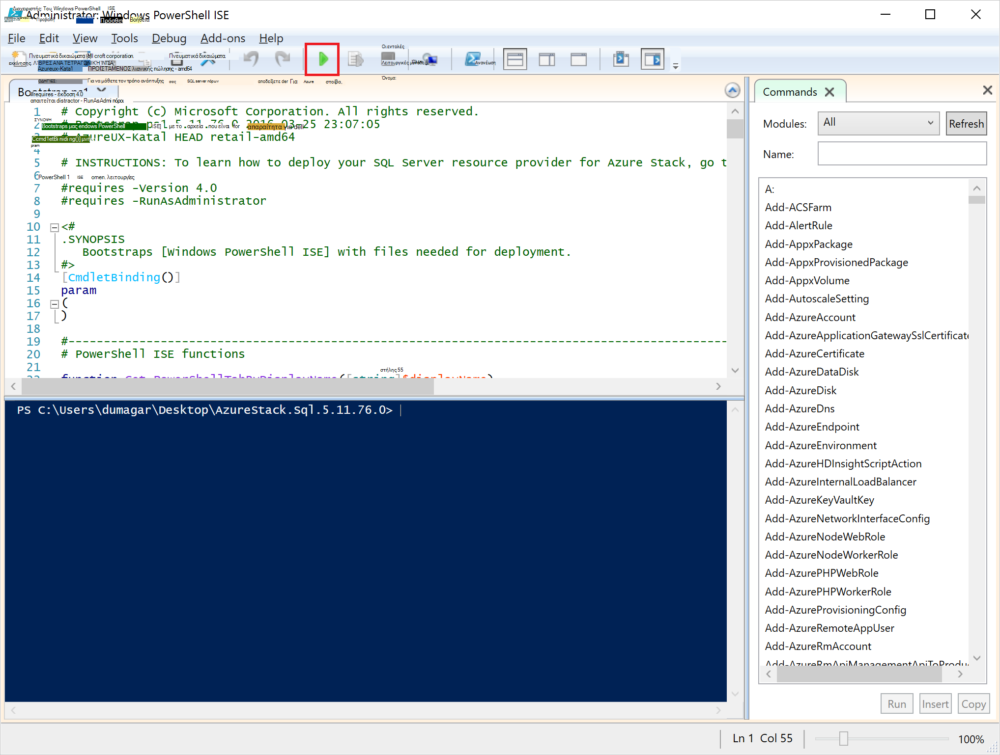

    Θα φορτώσετε δύο κύριες καρτέλες, κάθε που περιέχει όλες τις δέσμες ενεργειών και τα αρχεία που θέλετε να αναπτύξετε την υπηρεσία παροχής του πόρου.

## Προετοιμασία τις προϋποθέσεις

Κάντε κλικ στην καρτέλα **Προετοιμασία τις προϋποθέσεις** για να:

- Δημιουργία απαιτούμενων πιστοποιητικών
- Αποστολή αντικείμενα σε ένα λογαριασμό χώρου αποθήκευσης στη στοίβα Azure
- Δημοσίευση συλλογή στοιχείων

### Δημιουργία απαιτούμενων πιστοποιητικών
Αυτή η δέσμη ενεργειών **Δημιουργία SslCert.ps1** προσθέτει το \_. Το πιστοποιητικό AzureStack.local.pfx SSL για να το δ:\\SQLRP\\τις προϋποθέσεις\\BlobStorage\\φάκελο κοντέινερ. Το πιστοποιητικό διασφαλίζει επικοινωνία μεταξύ την υπηρεσία παροχής του πόρου και την τοπική παρουσία της διαχείρισης πόρων Azure.

1. Στην καρτέλα κύρια **Προετοιμασία τις προϋποθέσεις** , κάντε κλικ στην καρτέλα **Δημιουργία SslCert.ps1** και εκτελέστε το.

2. Στη γραμμή εντολών που εμφανίζεται, πληκτρολογήστε έναν κωδικό πρόσβασης PFX που προστατεύει το ιδιωτικό κλειδί και **Σημειώστε αυτόν τον κωδικό πρόσβασης**. Που θα το χρειαστείτε αργότερα.

### Αποστολή όλα τα αντικείμενα σε ένα λογαριασμό χώρου αποθήκευσης στη στοίβα Azure

1. Κάντε κλικ στην καρτέλα **Αποστολή-Microsoft.Sql-RP.ps1** και εκτελέστε το.

2. Στο Windows PowerShell διαπιστευτηρίων αίτηση πλαίσιο, πληκτρολογήστε τα διαπιστευτήρια διαχειριστή υπηρεσίας Azure στοίβας.

3. Όταν σας ζητηθεί για το Αναγνωριστικό Azure Active Directory μισθωτή, πληκτρολογήστε το Azure Active Directory μισθωτή πλήρως προσδιορισμένο όνομα τομέα: για παράδειγμα, microsoftazurestack.onmicrosoft.com.

    Ένα αναδυόμενο παράθυρο ζητά διαπιστευτήρια.

    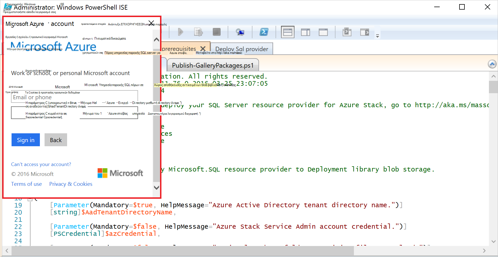

    > [AZURE.TIP] Αν δεν εμφανιστεί το αναδυόμενο παράθυρο, μπορείτε είτε δεν έχετε απενεργοποιήσει IE βελτιωμένη ασφάλεια για να ενεργοποιήσετε την JavaScript σε αυτόν τον υπολογιστή και χρήστη ή δεν έχετε αποδοχή cookies σε IE. Ανατρέξτε στο θέμα [Ρύθμιση βήματα πριν να αναπτύξετε](#set-up-steps-before-you-deploy).

4. Πληκτρολογήστε τα διαπιστευτήρια διαχειριστή υπηρεσίας στοίβας Azure και, στη συνέχεια, κάντε κλικ στην επιλογή **Sign In**.

### Δημοσίευση συλλογή στοιχείων για μελλοντική δημιουργία πόρων

Επιλέξτε την καρτέλα **Δημοσίευση GalleryPackages.ps1** και εκτελέστε το. Αυτή η δέσμη ενεργειών προσθέτει δύο στοιχεία marketplace με την πύλη του POC στοίβας Azure marketplace που μπορείτε να χρησιμοποιήσετε για την ανάπτυξη πόρους βάσεων δεδομένων ως στοιχεία marketplace.

## Ανάπτυξη του πόρου υπηρεσία παροχής SQL Server Εικονική

Τώρα που έχουν προετοιμαστεί το Azure PoC στοίβα με τα πιστοποιητικά είναι απαραίτητο και τα στοιχεία marketplace, μπορείτε να αναπτύξετε μια υπηρεσία παροχής πόρων του SQL Server. Κάντε κλικ στην καρτέλα **υπηρεσία παροχής ανάπτυξη SQL** για να:

   - Δώστε τις τιμές σε ένα αρχείο JSON που αναφέρει τη διαδικασία ανάπτυξης
   - Αναπτύξτε την υπηρεσία παροχής του πόρου
   - Ενημέρωση του τοπικού DNS
   - Καταχώρηση του SQL Server πόρων παροχής προσαρμογέα

### Δώστε τις τιμές στο αρχείο JSON

Κάντε κλικ στην επιλογή **Microsoft.Sqlprovider.Parameters.JSON**. Αυτό το αρχείο έχει παραμέτρους που χρειάζεται το πρότυπο διαχείρισης πόρων Azure για να αναπτύξετε σωστά σε στοίβα Azure.

1. Συμπληρώστε τις παραμέτρους **κενή** στο αρχείο JSON:

    - Βεβαιωθείτε ότι παρέχετε τις **adminusername** και **adminpassword** για την εικονική Μηχανή παροχής πόρων SQL:

        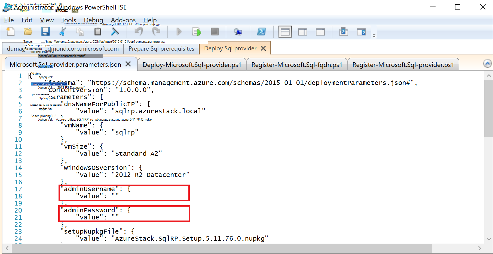

    - Βεβαιωθείτε ότι μπορείτε να δώσετε τον κωδικό πρόσβασης για την παράμετρο **SetupPfxPassword** που κάνει μια σημείωση στο βήμα [Προετοιμασία prequisites](#prepare-prerequisites) :

    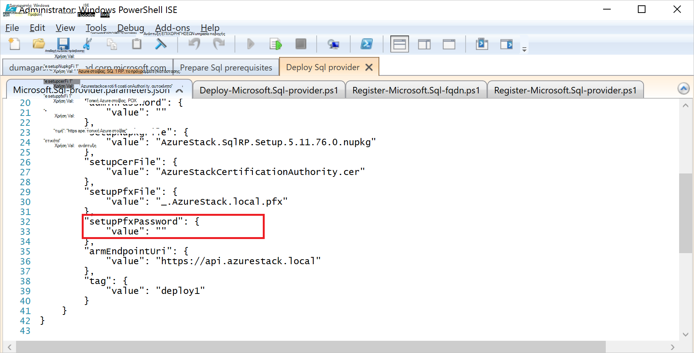

2. Κάντε κλικ στο κουμπί **Αποθήκευση** για να αποθηκεύσετε το αρχείο παραμέτρων.

### Αναπτύξτε την υπηρεσία παροχής του πόρου

1. Κάντε κλικ στην καρτέλα **Ανάπτυξη-Microsoft.sql-provider.PS1** και εκτελέστε τη δέσμη ενεργειών.
2. Πληκτρολογήστε το όνομα του μισθωτή του Azure Active Directory, όταν σας ζητηθεί.
3. Στο αναδυόμενο παράθυρο, να υποβάλετε τα διαπιστευτήρια διαχειριστή υπηρεσίας Azure στοίβας.

Πλήρης ανάπτυξη ενδέχεται να χρειαστούν μεταξύ 25 και 55 λεπτά σε ορισμένες ιδιαίτερα εκμεταλλευθεί POCs στοίβας Azure. Τα βήματα μεγαλύτερου θα την επέκταση επιθυμητοί κατάσταση ρύθμισης παραμέτρων (DSC) και της εκτέλεσης PowerShell, η οποία είναι το τελικό βήμα. Κάθε ενδέχεται να χρειαστούν 10-25 λεπτά.

### Ενημέρωση του τοπικού DNS

1. Κάντε κλικ στην καρτέλα **Register-Microsoft.SQL-fqdn.ps1** και εκτελέστε τη δέσμη ενεργειών.
2. Όταν σας ζητηθεί για Azure Active Directory μισθωτή ID, εισαγάγετε το Azure Active Directory μισθωτή πλήρως προσδιορισμένο όνομα τομέα: για παράδειγμα, **microsoftazurestack.onmicrosoft.com**.

### Καταχώρηση της υπηρεσίας παροχής πόρων SQL RP##

1. Κάντε κλικ στην καρτέλα **Register-Microsoft.SQL-provider.ps1** και εκτελέστε τη δέσμη ενεργειών.

2. Όταν σας ζητηθεί για τα διαπιστευτήρια, χρησιμοποιήστε τις παρακάτω τιμές για το όνομα χρήστη και τον κωδικό πρόσβασης:

   - **sqlRpUsername**
   - **sqlRpPassw0rd**

   > [AZURE.IMPORTANT] Αυτές είναι οι τιμές *λεκτικής σταθεράς* που πρέπει να πληκτρολογήσετε όταν σας ζητηθεί για τα διαπιστευτήρια. Δεν υπάρχουν σύμβολα κράτησης θέσης. * *Κάντε *δεν* τύπος ** το username\password που έχετε αποθηκεύσει στο αρχείο παραμέτρων πριν από την ανάπτυξη την εικονική Μηχανή.

## Επαληθεύστε την ανάπτυξη με την πύλη στοίβας Azure

1. Αποσυνδεθείτε από το ClientVM και συνδεθείτε ξανά ως **AzureStack\AzureStackUser**.

2. Στην επιφάνεια εργασίας, κάντε κλικ στην επιλογή **Azure στοίβας POC πύλη** και πραγματοποιήστε είσοδο στην πύλη του ως διαχειριστή υπηρεσίας.

3. Βεβαιωθείτε ότι η ανάπτυξη ολοκληρώθηκε με επιτυχία. Κάντε κλικ στην επιλογή **Αναζήτηση** &gt; **Ομάδες πόρων** &gt; επιλέξτε την ομάδα των πόρων που χρησιμοποιήσατε (η προεπιλογή είναι **SQLRP**), και, στη συνέχεια, βεβαιωθείτε ότι το τμήμα βασικά στοιχεία της το blade (επάνω μισό) διαβάζει **ανάπτυξης ολοκληρώθηκε με επιτυχία**.

      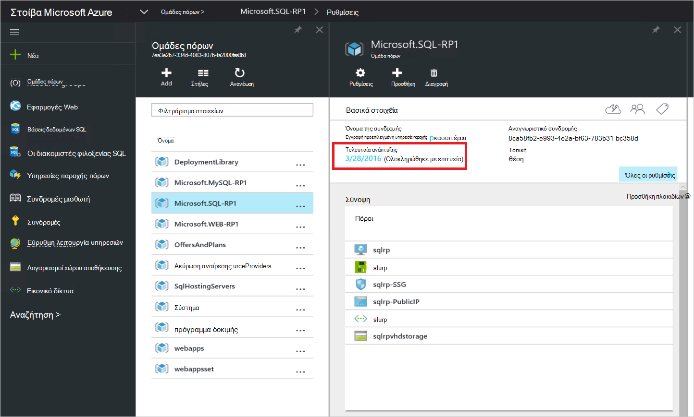

4. Βεβαιωθείτε ότι η καταχώρηση ολοκληρώθηκε με επιτυχία. Κάντε κλικ στην επιλογή **Αναζήτηση** &gt; **υπηρεσίες παροχής πόρων**και, στη συνέχεια, αναζητήστε το **Τοπικό SQL**:

      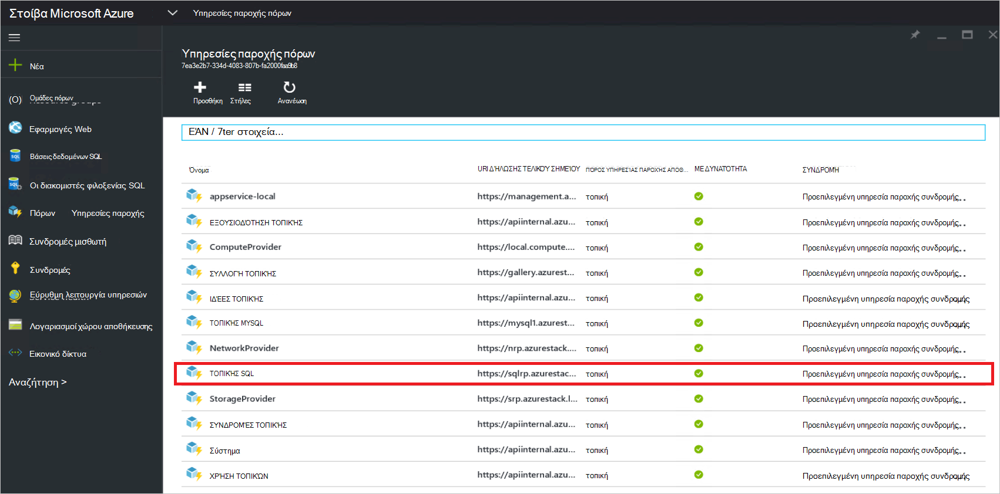

## Παροχή δυναμικότητα στην υπηρεσία παροχής πόρων SQL Συνδέοντας φιλοξενίας SQL server

1. Είσοδος στην πύλη του Azure στοίβας POC ως διαχειριστή υπηρεσίας

2. Κάντε κλικ στην επιλογή **υπηρεσίες παροχής πόρων** &gt; **SQL τοπική** &gt; **μεταβείτε στη Διαχείριση υπηρεσίας παροχής πόρων** &gt; **διακομιστές** &gt; **Προσθήκη**.

    Το **SQL φιλοξενίας διακομιστές** blade είναι όπου μπορείτε να συνδέσετε την υπηρεσία παροχής SQL Server πόρων σε πραγματικό παρουσίες του SQL Server που θα χρησιμοποιηθεί ως παρασκηνίου της υπηρεσίας παροχής πόρων.

    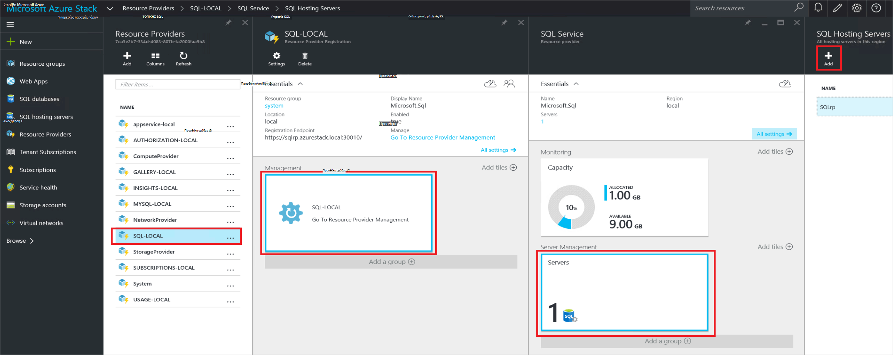

3. Συμπληρώστε τη φόρμα με τις λεπτομέρειες της σύνδεσης της παρουσίας του SQL Server. Από προεπιλογή, μια προκαθορισμένη SQL Server που ονομάζεται "SQLRP" με το όνομα χρήστη του διαχειριστή "σα" και τον κωδικό πρόσβασης που καλούνται στην παράμετρο "adminpassword" στις παραμέτρους JSON εκτελείται η Εικονική.

## Δημιουργία του πρώτου βάσης δεδομένων SQL για να δοκιμάσετε την ανάπτυξή σας

1. Εισέλθετε στην πύλη του Azure στοίβας POC ως διαχειριστή υπηρεσίας.

2. Κάντε κλικ στην επιλογή **Αναζήτηση** &gt; **βάσεις δεδομένων SQL** &gt; **Προσθήκη**
  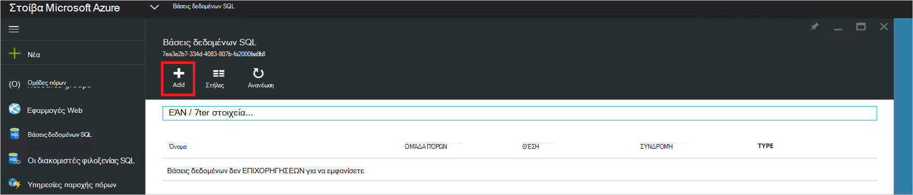

3. Συμπληρώστε τη φόρμα με λεπτομέρειες βάσης δεδομένων, όπως ένα **Όνομα διακομιστή**, **Διακομιστή διαχείρισης σύνδεσης**και **τον κωδικό πρόσβασης** για ένα νέο *εικονικός διακομιστής* στο το **Νέο διακομιστή** blade.

    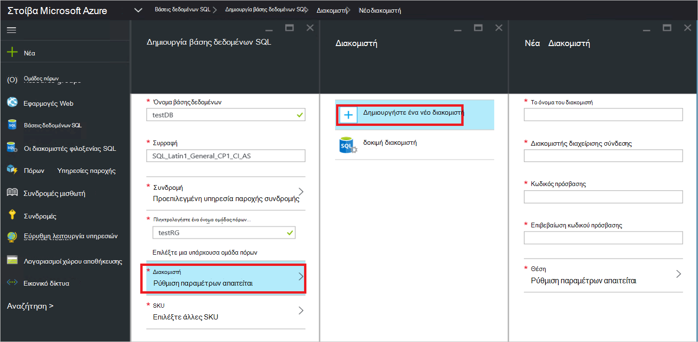

    Ο εικονικός διακομιστής είναι μια τεχνητή δομή. Δεν αντιστοιχεί με τον SQL Server, το ίδιο, αλλά αντί για αυτό δηλώσεις έως το όνομα χρήστη μέσα τη συμβολοσειρά σύνδεσης, η οποία δημιουργεί την υπηρεσία παροχής του πόρου στο τέλος αυτής της διαδικασίας. **Σημείωση τον κωδικό πρόσβασης που εισαγάγει ξεχωριστά για τον εικονικό διακομιστή**. Η πύλη θα εμφανίζονται ποτέ τον κωδικό πρόσβασης.

4. Θα σας ζητηθεί να επιλέξετε ένα επίπεδο τιμολόγησης για τη βάση δεδομένων.

    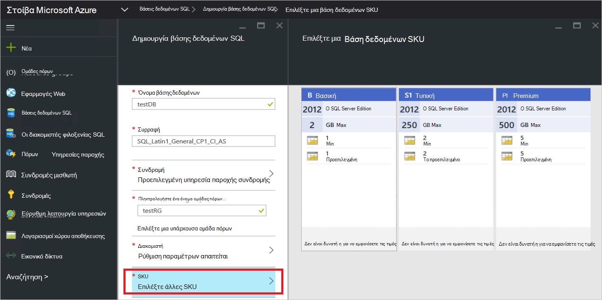

    Δεν εφαρμόζονται βαθμίδες σε αυτήν την έκδοση, αλλά τους κατανάλωση παρακολουθείται από τη διαχείριση πόρων Azure ως ένας τρόπος να επιδεικνύει τα διαφοροποίηση μπορείτε να δημιουργήσετε στο όριο επιβολής κ.λπ.

5. Υποβάλετε τη φόρμα και περιμένετε για την ανάπτυξη για να ολοκληρωθεί.

6. Στο το blade που προκύπτει, παρατηρήστε το πεδίο "Συμβολοσειρά σύνδεσης". Μπορείτε να χρησιμοποιήσετε η συμβολοσειρά σε οποιαδήποτε εφαρμογή που απαιτεί πρόσβαση SQL Server (για παράδειγμα, μια εφαρμογή web) σε στοίβα Azure σας.

    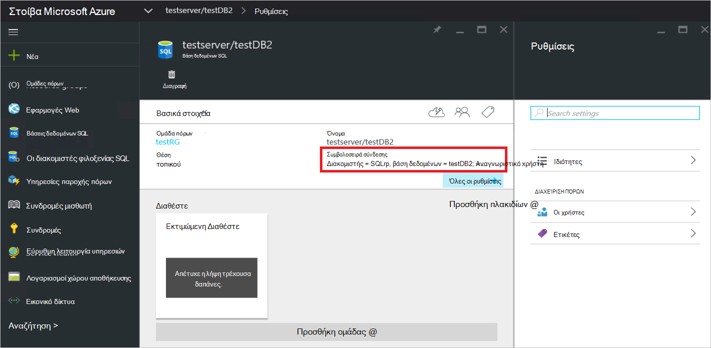

## Επόμενα βήματα

Δοκιμάστε άλλες [υπηρεσίες PaaS](azure-stack-tools-paas-services.md) όπως ο [διακομιστής MySQL υπηρεσίας παροχής πόρων](azure-stack-mysql-rp-deploy-short.md) και την [εφαρμογές Web της υπηρεσίας παροχής πόρων](azure-stack-webapps-deploy.md).
