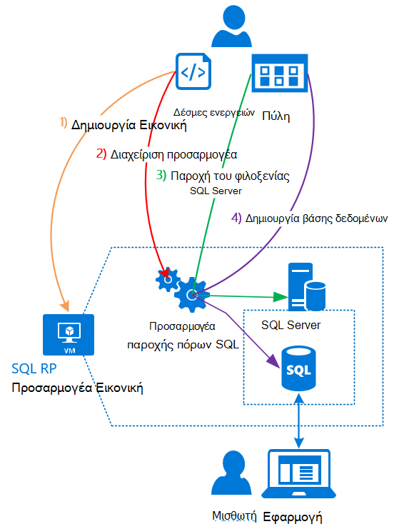

<properties
    pageTitle="Χρήση βάσεων δεδομένων του SQL σε στοίβα Azure | Microsoft Azure"
    description="Μάθετε πώς μπορείτε να αναπτύξετε βάσεις δεδομένων SQL ως υπηρεσία σε στοίβα Azure και τα γρήγορα βήματα για να αναπτύξετε τον προσαρμογέα παροχής πόρων SQL Server."
    services="azure-stack"
    documentationCenter=""
    authors="Dumagar"
    manager="byronr"
    editor=""/>

<tags
    ms.service="multiple"
    ms.workload="na"
    ms.tgt_pltfrm="na"
    ms.devlang="na"
    ms.topic="article"
    ms.date="09/26/2016"
    ms.author="dumagar"/>

# Χρήση βάσεων δεδομένων του SQL σε στοίβα Azure

> [AZURE.NOTE] Οι ακόλουθες πληροφορίες ισχύει μόνο για αναπτύξεις Azure στοίβα TP1.

Χρησιμοποιείτε τον προσαρμογέα παροχής πόρων SQL Server για να εκθέσετε βάσεις δεδομένων SQL ως υπηρεσία Azure στοίβας. Αφού εγκαταστήσετε την υπηρεσία παροχής του πόρου, εσείς και οι χρήστες μπορούν να δημιουργείτε βάσεις δεδομένων για εφαρμογές cloud-εγγενής, τοποθεσία Web που βασίζονται σε SQL και φόρτους εργασίας που βασίζονται σε SQL χωρίς να χρειάζεται να παρέχετε μια εικονική μηχανή (Εικονική) που φιλοξενεί SQL Server κάθε φορά.

Επειδή η υπηρεσία παροχής πόρων δεν έχει όλες τις δυνατότητες της βάσης δεδομένων SQL Azure κατά τη διάρκεια του απόδειξη λειτουργίας (PoC), αυτό το άρθρο αρχίζει με μια επισκόπηση της αρχιτεκτονικής παροχής πόρων. Στη συνέχεια, λαμβάνετε μια γρήγορη επισκόπηση των βημάτων για να ρυθμίσετε την υπηρεσία παροχής πόρων, με συνδέσεις προς τα πιο λεπτομερή βήματα στο θέμα [Ανάπτυξη προσαρμογέα υπηρεσία παροχής του πόρου βάση δεδομένων SQL σε POC στοίβας Azure](azure-stack-sql-rp-deploy-long.md).

## Αρχιτεκτονική προσαρμογέα παροχής πόρων SQL Server
Η υπηρεσία παροχής πόρων δεν προσφέρουν όλα τη βάση δεδομένων δυνατοτήτων διαχείρισης της βάσης δεδομένων SQL Azure. Για παράδειγμα, χώρους συγκέντρωσης ελαστικότητας βάσης δεδομένων και τη δυνατότητα να καλέσετε απόδοση της βάσης δεδομένων προς τα επάνω ή προς τα κάτω στη διάρκεια της λειτουργίας δεν είναι διαθέσιμες. Ωστόσο, η υπηρεσία παροχής πόρων υποστηρίζει το ίδιο δημιουργία, ανάγνωση, ενημέρωση και λειτουργίες διαγραφής (CRUD) που υπάρχει στη βάση δεδομένων SQL Azure.

Η υπηρεσία παροχής πόρων αποτελείται από τρία στοιχεία:

- **Το SQL πόρων παροχής προσαρμογέα Εικονική**, που περιλαμβάνει τη διαδικασία παροχής πόρων και τους διακομιστές που φιλοξενούν SQL Server.
- **Η υπηρεσία παροχής πόρων ίδια**, το οποίο επεξεργάζεται αιτήσεις προετοιμασίας και εκθέτει πόρους βάσεων δεδομένων.
- **Οι διακομιστές που φιλοξενούν SQL Server**, οι οποίοι παρέχουν χώρο για τις βάσεις δεδομένων.

Το παρακάτω διάγραμμα εννοιολογική εμφανίζει αυτά τα στοιχεία και τα βήματα που θα ακολουθήσετε κατά την ανάπτυξη την υπηρεσία παροχής του πόρου, ρυθμίστε ένα διακομιστή που φιλοξενεί SQL Server και, στη συνέχεια, να δημιουργήσετε μια βάση δεδομένων.

## Γρήγορα βήματα για να αναπτύξετε την υπηρεσία παροχής του πόρου
Εάν είστε ήδη εξοικειωμένοι με το Azure στοίβα, ακολουθήστε τα παρακάτω βήματα. Εάν θέλετε περισσότερες λεπτομέρειες, ακολουθήστε τις συνδέσεις σε κάθε ενότητα ή μεταβείτε κατευθείαν στην [Ανάπτυξη προσαρμογέα υπηρεσία παροχής του πόρου βάση δεδομένων SQL σε POC στοίβας Azure](azure-stack-sql-rp-deploy-long.md).

1.  Βεβαιωθείτε ότι μπορείτε να ολοκληρώσετε όλες [Ρύθμιση βήματα πριν να αναπτύξετε](azure-stack-sql-rp-deploy-long.md#set-up-steps-before-you-deploy) την υπηρεσία παροχής πόρων:

  - 3,5 .NET framework έχει ήδη ρυθμιστεί στο τη βασική εικόνα Windows Server. (Εάν έχετε κάνει λήψη τα bit στοίβας Azure μετά 23 Φεβρουαρίου 2016, μπορείτε να παραλείψετε αυτό το βήμα.)
  - [Έχει εγκατασταθεί μια έκδοση του Azure PowerShell που είναι συμβατά με το Azure στοίβας](http://aka.ms/azStackPsh).
  - Στις ρυθμίσεις ασφαλείας του Internet Explorer στην το ClientVM, [Internet Explorer βελτιωμένη ασφάλεια είναι απενεργοποιημένη και τα cookies είναι ενεργοποιημένες](azure-stack-sql-rp-deploy-long.md#Turn-off-IE-enhanced-security-and-enable-cookies).

2. [Κάντε λήψη του αρχείου δυαδικά δεδομένα SQL Server RP](http://aka.ms/massqlrprfrsh) και την εξαγωγή για να το ClientVM στο σας POC στοίβας Azure.

3. [Εκτέλεση bootstrap.cmd και δεσμών ενεργειών](azure-stack-sql-rp-deploy-long.md#Bootstrap-the-resource-provider-deployment-PowerShell-and-Prepare-for-deployment).

    Ένα σύνολο των δεσμών ενεργειών είναι ομαδοποιημένα κατά δύο κύριες καρτέλες ανοιχτό στο περιβάλλον ενσωματωμένη δέσμες ενεργειών του PowerShell (ISE). Εκτελέστε όλες τις δέσμες ενεργειών φορτωθεί στην ακολουθία από αριστερά προς τα δεξιά σε κάθε καρτέλα.

    1. Εκτελούν δέσμες ενεργειών στην καρτέλα **Προετοιμασία** από αριστερά προς τα δεξιά για να:

        - Δημιουργήστε ένα πιστοποιητικό μπαλαντέρ για την ασφαλή επικοινωνία μεταξύ της υπηρεσίας παροχής πόρων και διαχείριση πόρων Azure.
        - Αποστείλετε τα πιστοποιητικά και όλα τα άλλα αντικείμενα σε ένα λογαριασμό του χώρου αποθήκευσης για τη στοίβα Azure.
        - Δημοσίευση πακέτων συλλογή έτσι ώστε να μπορείτε να αναπτύξετε SQL και πόρους μέσω της συλλογής.

        > [AZURE.IMPORTANT] Εάν οποιαδήποτε από τις δέσμες ενεργειών παύει να ανταποκρίνεται χωρίς εμφανή λόγο μετά την υποβολή του μισθωτή Azure Active Directory, οι ρυθμίσεις ασφαλείας σας ενδέχεται να αποκλείει DLL που είναι απαραίτητη για την ανάπτυξη του για να εκτελέσετε. Για να επιλύσετε αυτό το ζήτημα, αναζητήστε το Microsoft.AzureStack.Deployment.Telemetry.Dll στο φάκελο παροχής πόρων, κάντε δεξί κλικ επάνω, κάντε κλικ στην επιλογή **Ιδιότητες**και, στη συνέχεια, επιλέξτε **Αναίρεση αποκλεισμού** στην καρτέλα **Γενικά** .

    1. Εκτελούν δέσμες ενεργειών στην καρτέλα **Ανάπτυξη** από αριστερά προς τα δεξιά για να:

        - [Ανάπτυξη μια Εικονική](azure-stack-sql-rp-deploy-long.md#Deploy-the-SQL-Server-Resource-Provider-VM) που φιλοξενεί την υπηρεσίας παροχής πόρων και του SQL Server. Αυτή η δέσμη ενεργειών αναφέρεται σε ένα αρχείο παραμέτρων JSON, το οποίο πρέπει να ενημερώσετε με κάποιες τιμές πριν από την εκτέλεση της δέσμης ενεργειών.
        - [Καταχώρηση μιας τοπικής εγγραφής DNS](azure-stack-sql-rp-deploy-long.md#Update-the-local-DNS) που αντιστοιχεί στην υπηρεσία παροχής πόρων Εικονική.
        - [Καταχώρηση παροχής πόρων](azure-stack-sql-rp-deploy-long.md#Register-the-SQL-RP-Resource-Provider) με την τοπική Azure από διαχειριστή πόρων.

        > [AZURE.IMPORTANT] Όλες οι δέσμες ενεργειών λαμβάνεται ως δεδομένο ότι η εικόνα βασικό λειτουργικό σύστημα που πληροί τις προϋποθέσεις (.NET 3.5 εγκατασταθεί, JavaScript και τα cookies του ClientVM και μια συμβατή έκδοση του Azure PowerShell εγκατεστημένο). Εάν λάβετε σφάλματα κατά την εκτέλεση των δεσμών ενεργειών, ελέγξτε ξανά ότι που πληρούν τις προϋποθέσεις.

6. [Σύνδεση την υπηρεσία παροχής πόρων σε ένα διακομιστή που φιλοξενεί SQL Server](#Provide-capacity-to-your-SQL-Resource-Provider-by-connecting-it-to-a-hosting-SQL-server) στην πύλη του Azure στοίβας. Κάντε κλικ στην επιλογή **Αναζήτηση** &gt; **υπηρεσίες παροχής πόρων** &gt; **SQLRP** &gt; **μεταβείτε στη Διαχείριση υπηρεσίας παροχής πόρων** &gt; **διακομιστές** &gt; **Προσθήκη**.

    Χρησιμοποιήστε "σα" για το όνομα χρήστη και τον κωδικό πρόσβασης που χρησιμοποιήσατε όταν αναπτυχθεί στην υπηρεσία παροχής πόρων Εικονική.

7. [Δοκιμή παροχής νέο πόρο SQL Server](/azure-stack-sql-rp-deploy-long.md#create-your-first-sql-database-to-test-your-deployment), να αναπτύξετε μια βάση δεδομένων SQL στην πύλη του Azure στοίβας. Κάντε κλικ στην επιλογή **Δημιουργία** &gt; **προσαρμοσμένη** &gt; **βάση δεδομένων SQL Server**.

Αυτό θα πρέπει να λάβετε την υπηρεσία παροχής πόρων του SQL Server προς τα επάνω και εκτελούνται στο περίπου 45 λεπτά (ανάλογα με το υλικό σας).
