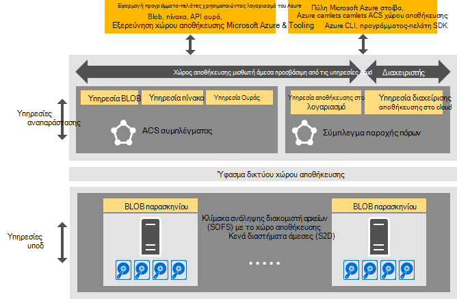

<properties
    pageTitle="Εισαγωγή με το χώρο αποθήκευσης Azure συνεπή | Microsoft Azure"
    description="Μάθετε περισσότερα σχετικά με συνεπή Azure χώρου αποθήκευσης"
    services="azure-stack"
    documentationCenter=""
    authors="AniAnirudh"
    manager="darmour"
    editor=""/>

<tags
    ms.service="azure-stack"
    ms.workload="na"
    ms.tgt_pltfrm="na"
    ms.devlang="na"
    ms.topic="get-started-article"
    ms.date="09/26/2016"
    ms.author="anirudha"/>

# Εισαγωγή στις Azure συνεπή χώρου αποθήκευσης
Azure συνεπή χώρου αποθήκευσης είναι το σύνολο των υπηρεσιών cloud αποθήκευσης στο Microsoft Azure στοίβας. Azure συνεπή αποθήκευσης παρέχει blob, πίνακα, ουρά και λειτουργικότητα διαχείρισης λογαριασμού με συνεπή Azure σημασιολογία. Επίσης, παρέχει λειτουργικότητα για να σας βοηθήσει διαχειριστής cloud Διαχείριση χώρου αποθήκευσης υπηρεσιών. Σε αυτό το άρθρο παρουσιάζει Azure συνεπή χώρου αποθήκευσης και περιγράφει τον τρόπο αποθήκευσης cloud services σε στοίβα Azure συμπληρώνουν όμορφα τις εμπλουτισμένες [δυνατότητες που ορίζονται από το λογισμικό χώρου αποθήκευσης στο Windows Server 2016](https://blogs.technet.microsoft.com/windowsserver/2016/04/14/ten-reasons-youll-love-windows-server-2016-5-software-defined-storage/).

Azure συνεπή αποθήκευσης προσφέρει τα εξής ευρείες κατηγορίες λειτουργίες:

- **Αντικείμενα BLOB**: σελίδα αντικείμενα BLOB και αποκλεισμός αντικείμενα BLOB Προσάρτηση αντικείμενα blob με   [συνεπή Azure blob](https://msdn.microsoft.com/library/azure/dd179355.aspx#Anchor_1) 
   συμπεριφορά

- **Πίνακες**: οντοτήτων, τα διαμερίσματα και άλλες ιδιότητες πίνακα με   [συνεπή Azure πίνακα](https://msdn.microsoft.com/library/azure/dd179355.aspx#Anchor_3) 
   συμπεριφορά

- **Ουρές**: αξιόπιστη και μόνιμη μηνύματα και ουρές με   [συνεπή Azure ουρά](https://msdn.microsoft.com/library/azure/dd179355.aspx#Anchor_2) 
   συμπεριφορά

- **Λογαριασμοί**: Διαχείριση πόρων λογαριασμού χώρου αποθήκευσης με   [συνεπή Azure λογαριασμό](https://azure.microsoft.com/documentation/articles/storage-create-storage-account/) 
   συμπεριφοράς για την παροχή της υπηρεσίας μέσω το [μοντέλο ανάπτυξης διαχείρισης πόρων Azure](https://azure.microsoft.com/documentation/articles/resource-manager-deployment-model/) λογαριασμούς γενικής χρήσης χώρου αποθήκευσης

- **Διαχείριση**: Διαχείριση των υπηρεσιών εσωτερικής αποθήκευσης μισθωτή τοποθεσία και συνεπή Azure χώρου αποθήκευσης (αναφέρονται σε άλλα άρθρα)

## Αρχιτεκτονική Azure συνεπή αποθήκευσης

Σχήμα 1. Azure συνεπή χώρου αποθήκευσης: προβολή λύσης

## Azure συνεπή αποθήκευσης εικονικά διαμορφωμένη συστοιχία υπηρεσιών και συμπλεγμάτων

Στην αρχιτεκτονική Azure συνεπή χώρου αποθήκευσης, όλα μισθωτή ή υπηρεσίες πρόσβαση από το διαχειριστή του χώρου αποθήκευσης είναι εικονικά διαμορφωμένη συστοιχία. Αυτό σημαίνει ότι, εκτελέστε στην υπηρεσία διαχειριζόμενων υπηρεσία παροχής, ιδιαίτερα διαθέσιμη ΣΠΣ με βάση [Το Hyper-V](https://technet.microsoft.com/library/dn765471.aspx) λειτουργικότητα στο [Windows Server 2016](http://www.microsoft.com/server-cloud/products/windows-server-2016/).
Παρόλο που το ΣΠΣ είναι ιδιαίτερα διαθέσιμα που βασίζεται στην τεχνολογία [Συμπλέγματος ανακατεύθυνσης Windows Server](https://technet.microsoft.com/library/dn765474.aspx) , το Azure συνεπή υπηρεσίες αποθήκευσης εικονικά διαμορφωμένη συστοιχία τον εαυτό τους είναι ομαδοποιημένη επισκέπτη, ιδιαίτερα διαθέσιμες υπηρεσίες που βασίζονται σε [ύφασμα υπηρεσίας Azure τεχνολογία](http://azure.microsoft.com/campaigns/service-fabric/).

Azure συνεπή αποθήκευσης χρησιμοποιεί δύο ύφασμα υπηρεσία συμπλεγμάτων σε μια ανάπτυξη του Azure στοίβας.
Η υπηρεσία παροχής πόρων αποθήκευσης έχει αναπτυχθεί σε ένα σύμπλεγμα ύφασμα υπηρεσίας ("RP σύμπλεγμα") που είναι επίσης από κοινού από άλλες υπηρεσίες παροχής βασικές πόρων. Το υπόλοιπο του χώρου αποθήκευσης εικονικά διαμορφωμένη συστοιχία υπηρεσίες διαδρομή δεδομένων--όπως το Blob πίνακα και ουρά υπηρεσίες--φιλοξενούνται σε μια δεύτερη σύμπλεγμα ύφασμα υπηρεσίας ("Azure συνεπή χώρου αποθήκευσης συμπλέγματος").

## Υπηρεσία BLOB και που ορίζονται από το λογισμικό χώρου αποθήκευσης

Το αντικείμενο Blob τερματίσετε υπηρεσίας ξανά, από την άλλη πλευρά, εκτελείται απευθείας σε τους κόμβους συμπλέγματος [Διακομιστή αρχείων κλιμάκωσης](https://technet.microsoft.com/library/hh831349.aspx) . Στην αρχιτεκτονική λύσης Azure στοίβα, διακομιστή αρχείων κλιμάκωσης στο οποίο βασίζεται το [Χώρο αποθήκευσης κενά διαστήματα απευθείας](https://technet.microsoft.com/library/mt126109.aspx)-σύμπλεγμα ανακατεύθυνσης με βάση, κοινόχρηστα τίποτα. Σχήμα 1 απεικονίζει την κύρια Azure συνεπή υπηρεσίες στοιχείων χώρου αποθήκευσης και το μοντέλο κατανέμεται ανάπτυξης. Όπως μπορείτε να δείτε στο διάγραμμα, dovetails Azure συνεπή χώρου αποθήκευσης με τις υπάρχουσες δυνατότητες αποθήκευσης που ορίζονται από το λογισμικό Windows Server 2016. Δεν υπάρχει ειδικό υλικό είναι απαραίτητη για το Azure συνεπή αποθήκευσης πέρα από αυτές τις απαιτήσεις πλατφόρμας Windows Server.

## Χώρος αποθήκευσης συμπλέγματος

Σύμπλεγμα χώρου αποθήκευσης είναι η συλλογή υποδομή του χώρου αποθήκευσης, τους πόρους και υπηρεσίες υποστήριξης που παρέχουν μαζί άμεσα προσβάσιμη από το μισθωτή και άμεσα προσβάσιμη από το διαχειριστή του Azure συνεπή υπηρεσίες χώρου αποθήκευσης σε μια ανάπτυξη του Azure στοίβας. Συγκεκριμένα, η συστοιχία αποθήκευσης περιλαμβάνει τα εξής:

- Υλικό αποθήκευσης (για παράδειγμα, κόμβους κλιμάκωσης διακομιστή αρχείων, δίσκων)

- Πόροι ύφασμα αποθήκευσης (για παράδειγμα, κοινόχρηστα στοιχεία Ερωτήσεων)

- Τις υπηρεσίες που σχετίζονται με το χώρο αποθήκευσης ύφασμα υπηρεσία (για παράδειγμα, Blob τελικού σημείου υπηρεσίας απενεργοποίηση του Azure συνεπή συμπλέγματος χώρο αποθήκευσης)

- Χώρος αποθήκευσης που σχετίζονται με τις υπηρεσίες που εκτελούνται σε διακομιστή αρχείων κλιμάκωσης κόμβους (για παράδειγμα, την υπηρεσία Blob)

## IaaS και PaaS σενάρια χρήσης χώρου αποθήκευσης

Των BLOB σελίδα Azure συνεπή χώρου αποθήκευσης, όπως στο Azure, παρέχουν την εικονικών δίσκων της υποδομής των όλα με χρήση μιας υπηρεσίας (IaaS) σενάρια:

- Δημιουργήστε μια Εικονική, χρησιμοποιώντας το προσαρμοσμένο δίσκο λειτουργικό σύστημα σε μια σελίδα blob

- Δημιουργήστε μια Εικονική, χρησιμοποιώντας την προσαρμοσμένη εικόνα λειτουργικού Συστήματος σε μια σελίδα blob

- Δημιουργήστε μια Εικονική, χρησιμοποιώντας μια εικόνα Azure Marketplace σε μια νέα σελίδα blob

- Δημιουργήστε μια Εικονική, χρησιμοποιώντας μια κενή δισκέτα σε μια νέα σελίδα blob

Ομοίως, για την πλατφόρμα ως ένα σενάρια υπηρεσιών (PaaS), Azure συνεπή αντικείμενα BLOB μπλοκ χώρου αποθήκευσης, Προσάρτηση αντικείμενα blob, ουρές, και πίνακες λειτουργούν όπως και εκείνες στο Azure.

## Ρόλοι χρήστη

Azure συνεπή χώρου αποθήκευσης είναι χρήσιμη για δύο ρόλοι χρήστη:

- Οι κάτοχοι εφαρμογής, συμπεριλαμβάνοντας τους προγραμματιστές και IT για μεγάλες επιχειρήσεις. Έχουν πλέον για να διατηρήσετε ή να αναπτύξετε δύο εκδόσεις μιας εφαρμογής και δεσμών ενεργειών που κάνετε το ίδιο έργο σε μια δημόσια στο cloud και ένα σύννεφο φιλοξενούνται ιδιωτική σε ένα κέντρο δεδομένων. Azure συνεπή χώρου αποθήκευσης παρέχει υπηρεσίες αποθήκευσης μέσω REST API, SDK, το cmdlet και στοίβας Azure πύλη.

- Υπηρεσίες παροχής, συμπεριλαμβανομένων IT, για μεγάλες επιχειρήσεις που αναπτύξετε και να διαχειριστείτε τις υπηρεσίες cloud χώρου αποθήκευσης που βασίζεται σε Microsoft Azure στοίβα, multitenant.

## Επόμενα βήματα

- [Azure συνεπή χώρου αποθήκευσης: διαφορές και τα θέματα] (azure-στοίβας-acs-διαφορές-tp2.md)
