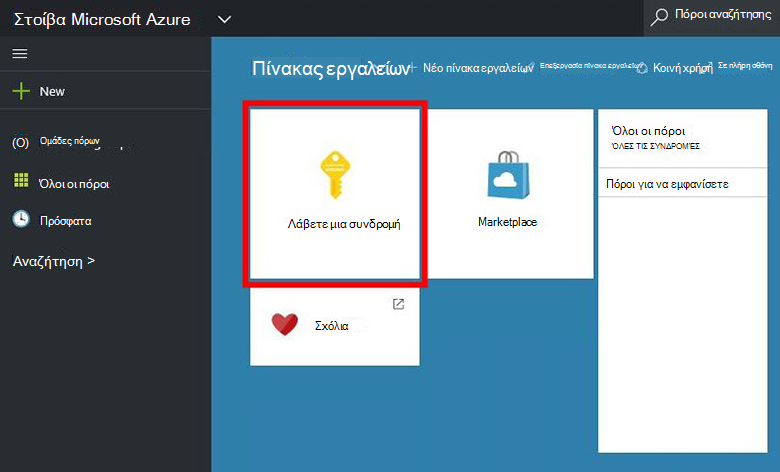
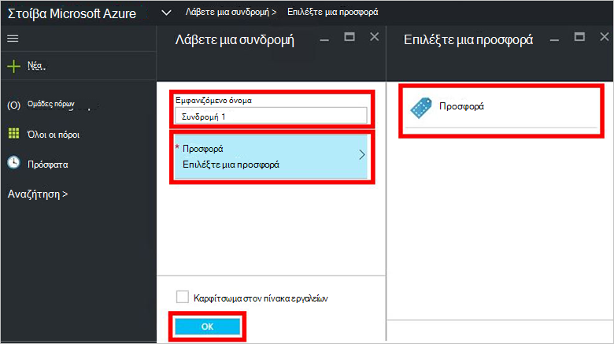
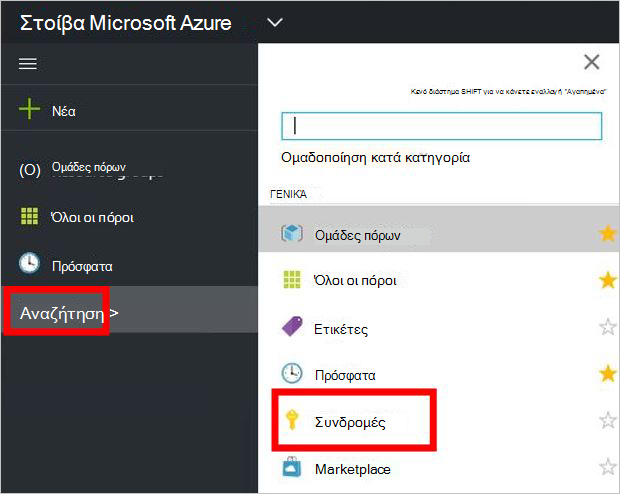

<properties
    pageTitle="Εγγραφή σε μια προσφορά και, στη συνέχεια, προμήθεια μια Εικονική σε στοίβα Azure (μισθωτής) | Microsoft Azure"
    description="Ως ένα μισθωτή, μάθετε πώς μπορείτε να εγγραφείτε σε μια προσφορά και, στη συνέχεια, προμήθεια μια Εικονική σε στοίβα Azure."
    services="azure-stack"
    documentationCenter=""
    authors="ErikjeMS"
    manager="byronr"
    editor=""/>

<tags
    ms.service="azure-stack"
    ms.workload="na"
    ms.tgt_pltfrm="na"
    ms.devlang="na"
    ms.topic="get-started-article"
    ms.date="09/26/2016"
    ms.author="erikje"/>

# Εγγραφή σε μια προσφορά

Τώρα που έχετε [δημιουργήσει μια προσφορά](azure-stack-create-offer.md), ελέγξτε ότι σας μισθωτές μπορεί να δημιουργήσει μια συνδρομή.

1.  Στον υπολογιστή POC στοίβας Azure, συνδεθείτε στο `https://portal.azurestack.local` ως [έναν μισθωτή](azure-stack-connect-azure-stack.md#log-in-as-a-tenant) και κάντε κλικ στην επιλογή **λήψη μιας συνδρομής**.

    

2.  Στο πεδίο **Εμφανιζόμενο όνομα** , πληκτρολογήστε ένα όνομα για τη συνδρομή σας, κάντε κλικ **προσφέρουν**, κάντε κλικ σε μία από τις προσφορές στο την **επιλογή προσφοράς** blade, και, στη συνέχεια, κάντε κλικ στην επιλογή **Δημιουργία**.

    

4.  Για να προβάλετε τη συνδρομή που δημιουργήσατε, κάντε κλικ στο κουμπί **Αναζήτηση**, κάντε κλικ στην επιλογή **συνδρομές**και κατόπιν κάντε κλικ στην επιλογή της νέας συνδρομής σας.  

    

Αφού εγγραφείτε σε μια προσφορά, ανανεώστε την πύλη για να δείτε ποιες υπηρεσίες είναι μέρος του στη νέα συνδρομή.

## Επόμενα βήματα

[Παροχή μια εικονική μηχανή](azure-stack-provision-vm.md)
