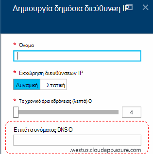
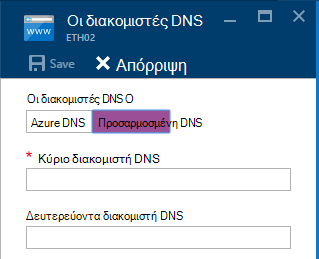
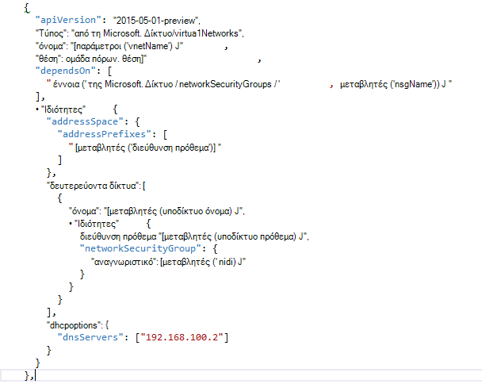

<properties
    pageTitle="Κατανόηση του DNS στο Azure στοίβα TP2 | Microsoft Azure"
    description="Κατανόηση των νέες δυνατότητες του DNS και δυνατοτήτων στο TP2 στοίβας Azure"
    services="azure-stack"
    documentationCenter=""
    authors="ScottNapolitan"
    manager="darmour"
    editor=""/>

<tags
    ms.service="azure-stack"
    ms.workload="na"
    ms.tgt_pltfrm="na"
    ms.devlang="na"
    ms.topic="get-started-article"
    ms.date="09/26/2016"
    ms.author="scottnap"/>

# Εισαγωγή τα IDN για στοίβας Azure
================================

τα IDN είναι μια νέα δυνατότητα στην τεχνολογία προεπισκόπηση 2 για τη στοίβα Azure που σας επιτρέπει να επιλύσετε εξωτερικών ονομάτων DNS (όπως http://www.bing.com).
Επίσης, μπορείτε να καταχωρήσετε ονόματα εσωτερικού εικονικού δικτύου. Με αυτόν τον τρόπο, μπορείτε να επιλύσετε ΣΠΣ στο ίδιο δίκτυο εικονικού κατά όνομα αντί για τη διεύθυνση IP, χωρίς να χρειάζεται να παράσχετε προσαρμοσμένο καταχωρήσεις του διακομιστή DNS.

Πρόκειται για κάτι που ήταν πάντα εκεί στο Azure, αλλά τώρα είναι διαθέσιμο σε Windows Server 2016 και το Azure στοίβα, πολύ.

Τι κάνει τα IDN;
------------------

Με τα IDN σε στοίβα Azure, μπορείτε να λάβετε τις ακόλουθες δυνατότητες, χωρίς να χρειάζεται να καθορίσετε προσαρμοσμένα καταχωρήσεις του διακομιστή DNS.

-   Υπηρεσίες επίλυσης ονομάτων DNS για το μισθωτή φόρτους εργασίας σε κοινή χρήση.

-   Έγκυρες υπηρεσία DNS για επίλυση ονομάτων και καταχώρηση DNS στο εσωτερικό του μισθωτή εικονικού δικτύου.

-   Υπηρεσία επαναλαμβανόμενες DNS για την επίλυση ονομάτων Internet από μισθωτή ΣΠΣ. Μισθωτές δεν χρειάζεστε πλέον για να καθορίσετε προσαρμοσμένες εγγραφές DNS για την επίλυση ονομάτων Internet (για παράδειγμα, www.bing.com).

Εξακολουθείτε να, μπορείτε να μεταφέρετε το δικό σας DNS και να χρησιμοποιήσετε προσαρμοσμένα διακομιστές DNS εάν θέλετε. Αλλά τώρα, εάν θέλετε απλώς να είναι σε θέση να επιλύσετε DNS στο Internet, ονόματα και έχουν τη δυνατότητα να συνδεθείτε με άλλες εικονικές μηχανές στο ίδιο δίκτυο εικονικού, δεν χρειάζεται να καθορίσετε οτιδήποτε και απλώς να λειτουργεί.

Τι κάνει τα IDN δεν
---------------------

Τι τα IDN δεν σας επιτρέπει να κάνετε είναι να δημιουργήσετε μια εγγραφή DNS για ένα όνομα που μπορεί να επιλυθεί από εκτός του εικονικού δικτύου.

Στο Azure, έχετε την επιλογή να καθορίσετε μια ετικέτα ονόματος DNS που μπορούν να συσχετιστούν με μια δημόσια διεύθυνση IP. Μπορείτε να επιλέξετε την ετικέτα (πρόθεμα), αλλά Azure επιλέγει το επίθημα, το οποίο βασίζεται σε περιοχή στην οποία μπορείτε να δημιουργήσετε στη δημόσια διεύθυνση IP.

Στην παραπάνω εικόνα, Azure θα δημιουργήσει μια "Ένα" εγγραφή στο DNS για την ετικέτα ονόματος DNS που καθορίζεται στην περιοχή τη ζώνη **westus.cloudapp.azure.com**. Το πρόθεμα και το επίθημα μαζί Συντάξτε ένα πλήρως προσδιορισμένο όνομα τομέα (FQDN) που μπορούν να επιλυθούν από οπουδήποτε στο Internet, δημόσια.

Στο TP2, το Azure στοίβας υποστηρίζει μόνο τα IDN για όνομα εσωτερικού καταχώρηση, ώστε να αυτό δεν μπορείτε να κάνετε τα εξής.

-   Δημιουργία εγγραφής DNS κάτω από μια υπάρχουσα φιλοξενούμενη ζώνης DNS (για παράδειγμα, azurestack.local).

-   Δημιουργήστε μια ζώνη DNS (όπως Contoso.com).

-   Δημιουργήστε μια εγγραφή στην περιοχή το δικό σας προσαρμοσμένο ζώνης DNS.

-   Υποστηρίζει την αγορά των ονομάτων τομέων.

Αλλαγές στο DNS από το Azure στοίβα TP1
-----------------------------------

Στην έκδοση Preview τεχνολογία 1 (TP1) Azure στοίβας, θα έπρεπε να παράσχετε προσαρμοσμένο διακομιστές DNS να έχετε τη δυνατότητα να επιλύσετε hosts με βάση το όνομα και όχι από τη διεύθυνση IP. Αυτό σημαίνει ότι, όταν δημιουργείτε ένα εικονικό δίκτυο ή μια Εικονική, θα έπρεπε να παρέχουν τουλάχιστον μία καταχώρηση διακομιστή DNS. Για το περιβάλλον TP1 POC, αυτό σημαίνει πληκτρολογώντας το IP του διακομιστή DNS ύφασμα POC, δηλαδή 192.168.200.2.

Εάν έχετε δημιουργήσει μια Εικονική μέσω της πύλης, θα έπρεπε να επιλέξτε **Custom DNS** στο εικονικό δίκτυο ή ethernet προσαρμογέα ρυθμίσεις.

Στο TP2, μπορείτε να επιλέξετε Azure DNS και δεν χρειάζεται να καθορίσετε προσαρμοσμένα καταχωρήσεις του διακομιστή DNS.

Εάν έχετε δημιουργήσει μια Εικονική μέσω ενός προτύπου με τη δική σας εικόνα, θα έπρεπε να προσθέσετε την ιδιότητα **DHCPOptions** και την επίλυση για να εργαστείτε ονομάτων διακομιστή DNS για να λάβετε το DNS. Η παρακάτω εικόνα δείχνει τι αυτό ήταν.

Στο TP2, δεν χρειάζεται πλέον να κάνετε αυτές τις αλλαγές σας Εικονική πρότυπα για να επιτρέψετε την ΣΠΣ για την επίλυση ονομάτων Internet. Μόλις πρέπει να λειτουργεί.