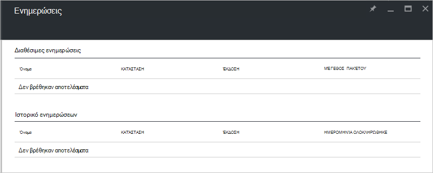

<properties
    pageTitle="Ενημερώσεις σε στοίβα Azure | Microsoft Azure"
    description="Μάθετε σχετικά με τις ενημερώσεις σε στοίβα Azure"
    services="azure-stack"
    documentationCenter=""
    authors="HeathL17"
    manager="byronr"
    editor=""/>

<tags
    ms.service="azure-stack"
    ms.workload="na"
    ms.tgt_pltfrm="na"
    ms.devlang="na"
    ms.topic="article"
    ms.date="09/26/2016"
    ms.author="Helaw"/>

# Διαχείριση ενημερώσεων σε στοίβα Azure
Τεχνική προεπισκόπηση 2 παρουσιάζει μια προεπισκόπηση της εμπειρίας για τη διαχείριση ενημερώσεων Azure στοίβας.  Σε αυτό το θέμα, θα μεταβείτε στον κόμβο ενημερώσεις.  

## Ενημερώσεις blade
1.  Για να αποκτήσετε πρόσβαση του blade ενημερώσεις, κάντε κλικ στην **Αναζήτηση** και, στη συνέχεια, κάντε κλικ στην επιλογή **ενημερώσεις**.

2.  Κάντε κλικ στη θέση του **τοπικού** .

3.  Θα δείτε μια λίστα των διαθέσιμων ενημερώσεων οθόνη και ιστορικό ενημερώσεων.  Στο Technical Preview 2, δεν υπάρχουν ενημερωμένες εκδόσεις θα είναι διαθέσιμες για εγκατάσταση.  

    

## Επόμενα βήματα
- [Κατανόηση των αρχιτεκτονική POC Azure στοίβας](azure-stack-architecture.md)      
- [Κατανόηση των προαπαιτούμενα ανάπτυξης](azure-stack-deploy.md)
- [Ανάπτυξη Azure στοίβας](azure-stack-run-powershell-script.md)
 
    
  

  

