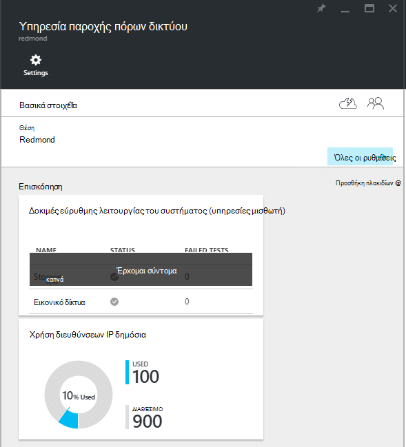

<properties
    pageTitle="Προβολή δημόσιων κατανάλωση διευθύνσεων IP σε TP2 | Microsoft Azure"
    description="Διαχειριστές μπορούν να δουν την κατανάλωση δημόσιες διευθύνσεις IP σε μια περιοχή"
    services="azure-stack"
    documentationCenter=""
    authors="ScottNapolitan"
    manager="darmour"
    editor=""/>

<tags
    ms.service="azure-stack"
    ms.workload="na"
    ms.tgt_pltfrm="na"
    ms.devlang="na"
    ms.topic="get-started-article"
    ms.date="09/26/2016"
    ms.author="scottnap"/>

# Προβολή δημόσιων κατανάλωση διευθύνσεων IP σε TP2 στοίβας Azure

Ως διαχειριστής υπηρεσιών, μπορείτε να προβάλετε τον αριθμό των δημόσιων διευθύνσεων IP που έχουν εκχωρηθεί στους μισθωτές, τον αριθμό των δημόσιες διευθύνσεις IP που εξακολουθούν να είναι διαθέσιμα για την εκχώρηση και το ποσοστό της δημόσιες διευθύνσεις IP που έχουν εκχωρηθεί σε αυτήν τη θέση.

Το πλακίδιο **Δημόσια χρήση διευθύνσεων IP** εμφανίζει τον συνολικό αριθμό των δημόσιων διευθύνσεων IP που καταναλώθηκαν κατά μήκος όλων των δημόσιων συνόλων διεύθυνση IP στην υφάσματος, εάν έχουν χρησιμοποιηθεί για το μισθωτή παρουσίες Εικονική IaaS, υπηρεσίες υποδομής δομής ή δημόσια πόρους διεύθυνση IP που δημιουργήθηκαν ρητά με μισθωτές.

Ο σκοπός της αυτό το πλακίδιο είναι να δώσετε διαχειριστές στοίβας Azure μια ιδέα για τον συνολικό αριθμό των δημόσιες διευθύνσεις IP που έχει χρησιμοποιηθεί σε αυτήν τη θέση. Αυτό σας βοηθά τους διαχειριστές καθορίζουν εάν εκτελούνται χαμηλής σε αυτόν τον πόρο.

Στα το blade **Ρυθμίσεις** , στο στοιχείο μενού **Δημόσιες διευθύνσεις IP** στην περιοχή **πόροι μισθωτή** παραθέτει μόνο αυτές τις δημόσιες διευθύνσεις IP που έχουν *δημιουργηθεί ρητά από μισθωτές*. Ως εκ τούτου, τον αριθμό των πλακιδίου δημόσιες διευθύνσεις IP του **Δημόσια χρήση διευθύνσεων IP** **χρησιμοποιείται** πάντα είναι διαφορετικό από (μεγαλύτερο από) ο αριθμός στο πλακίδιο **Δημόσια διευθύνσεις IP** στην περιοχή **μισθωτή πόρους**.

## Προβάλετε τις πληροφορίες χρήσης της δημόσια διεύθυνση IP

Για να δείτε τον συνολικό αριθμό των δημόσιες διευθύνσεις IP που καταναλώθηκαν στην περιοχή:

1.  Στην πύλη του Azure στοίβα, κάντε κλικ στην επιλογή **Αναζήτηση**και, στη συνέχεια, επιλέξτε **Υπηρεσίες παροχής πόρων**.

2.  Από τη λίστα των **Υπηρεσιών παροχής πόρου**, επιλέξτε **Διαχείριση υπηρεσίας παροχής πόρων δικτύου**.

3.  Εναλλακτικά, μπορείτε να κάνετε κλικ **Αναζήτηση | Θέσεις** και επιλέξτε τη θέση που θέλετε να προβάλετε από τη λίστα. Στη συνέχεια, στο πλακίδιο **Υπηρεσίες παροχής πόρων** , επιλέξτε **Διαχείριση υπηρεσίας παροχής πόρων δικτύου**.

4.  Η **Υπηρεσία παροχής πόρων δικτύου** blade προορισμού εμφανίζει το πλακίδιο **Δημόσια χρήση διευθύνσεων IP** στην ενότητα **Overview** .

Έχετε υπόψη ότι ο **χρησιμοποιείται** αριθμός αντιπροσωπεύει τον αριθμό των δημόσιων IP διευθύνσεις από όλα δημόσια IP διεύθυνση χώρους συγκέντρωσης που σας έχουν εκχωρηθεί σε αυτήν τη θέση. Ο **διαθέσιμος** αριθμός αντιπροσωπεύει τον αριθμό των δημόσιων IP διευθύνσεις από όλα δημόσια IP διεύθυνση χώρους συγκέντρωσης που δεν έχουν αντιστοιχιστεί και εξακολουθούν να είναι διαθέσιμες. Ο αριθμός αντιπροσωπεύει **% χρησιμοποιείται** τον αριθμό των διευθύνσεις που χρησιμοποιήθηκαν ή που έχουν ανατεθεί ως ποσοστό του συνολικού αριθμού των δημόσιων IP διευθύνσεις με τη δημόσια όλα IP διεύθυνση χώρους συγκέντρωσης σε αυτήν τη θέση.

## Προβάλετε τις δημόσιες διευθύνσεις IP που έχουν δημιουργηθεί με συνδρομές μισθωτή

Για να δείτε μια λίστα των δημόσιων διευθύνσεων IP που δημιουργήθηκαν ρητά μισθωτή συνδρομές σε μια συγκεκριμένη περιοχή, μεταβείτε στο το blade **Ρυθμίσεις** της **Διαχείρισης υπηρεσίας παροχής πόρων δικτύου**και, στη συνέχεια, επιλέξτε **Δημόσια διευθύνσεις IP**.

Ίσως παρατηρήσετε ότι ορισμένα δημόσια διευθύνσεις IP που έχουν εκχωρηθεί δυναμικά εμφανίζονται στη λίστα, αλλά δεν έχετε μια διεύθυνση που σχετίζονται με αυτά ακόμη. Αυτό συμβαίνει επειδή η διεύθυνση έχει δημιουργηθεί πόρος στην υπηρεσία παροχής πόρων δικτύου, αλλά όχι σε ελεγκτή του δικτύου ακόμη.

Ελεγκτή του δικτύου δεν αντιστοιχίζει μια διεύθυνση σε αυτόν τον πόρο μέχρι να είναι στην πραγματικότητα συνδεδεμένο σε ένα περιβάλλον εργασίας, ένα περιβάλλον εργασίας κάρτα δικτύου (NIC), μια μονάδα εξισορρόπησης φόρτου ή μιας πύλης εικονικού δικτύου. Όταν στη δημόσια διεύθυνση IP είναι συνδεδεμένο με ένα περιβάλλον εργασίας, ελεγκτή του δικτύου εκχωρεί μια διεύθυνση IP σε αυτό και να εμφανίζεται στο πεδίο **διεύθυνση** .

## Προβάλετε τη δημόσια πίνακα διευθύνσεων IP πληροφορίες σύνοψης

Υπάρχουν αρκετά διαφορετικές περιπτώσεις στις οποίες έχουν εκχωρηθεί δημόσιες διευθύνσεις IP που καθορίζουν εάν η διεύθυνση που εμφανίζεται σε μία λίστα ή σε άλλο.

| **Δημόσια IP address ανάθεσης πεζών-κεφαλαίων** | **Εμφανίζεται στη σύνοψη χρήσης** | **Εμφανίζεται στη λίστα διευθύνσεων IP δημόσια μισθωτή** |
| ------------------------------------- | ----------------------------| ---------------------------------------------- |
| Δυναμική δημόσια διεύθυνση IP δεν έχουν ακόμα ανατεθεί σε μια NIC ή τη φόρτωση εξισορρόπησης (προσωρινό) | Όχι | Ναι |
| Δυναμική δημόσια διεύθυνση IP που έχουν εκχωρηθεί σε μια εξισορρόπησης NIC ή τη φόρτωση. | Ναι | Ναι |
| Στατική δημόσια διεύθυνση IP που έχουν εκχωρηθεί σε ένα μισθωτή εξισορρόπησης NIC ή τη φόρτωση. | Ναι | Ναι |
| Στατική δημόσια διεύθυνση IP που έχουν εκχωρηθεί σε ένα τελικό σημείο ύφασμα υποδομή υπηρεσίας. | Ναι | Όχι |
| Δημόσια διεύθυνση IP που έχει δημιουργηθεί για παρουσίες Εικονική IaaS ρητά και χρησιμοποιείται για εξερχομένων NAT του εικονικού δικτύου. Αυτά που δημιουργούνται στο παρασκήνιο κάθε φορά που ένας μισθωτής δημιουργεί μια παρουσία Εικονική έτσι ώστε να ΣΠΣ μπορεί να στείλει πληροφορίες στο Internet. | Ναι | Όχι |
