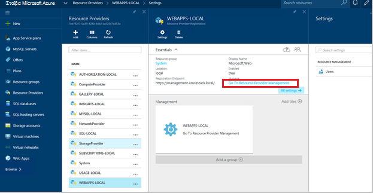
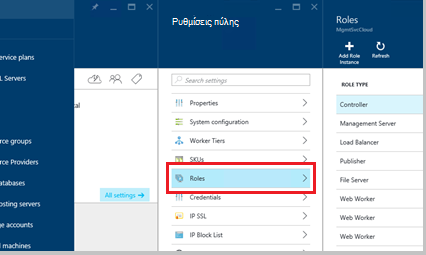
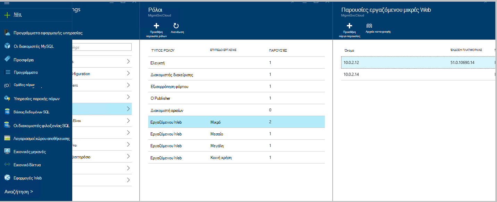
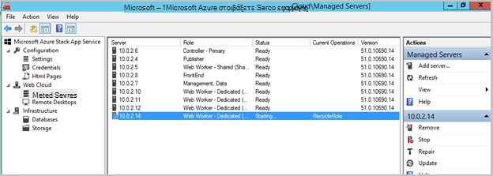
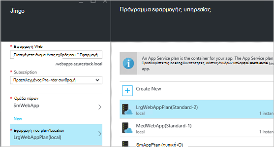
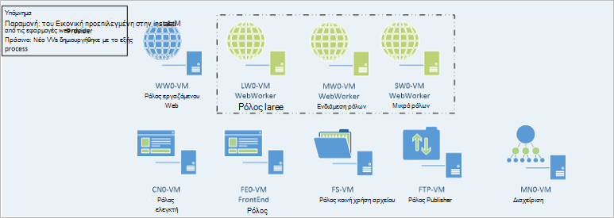

<properties
    pageTitle="Εφαρμογές Web προσθέτοντας περισσότερα Web ρόλους εργαζόμενου | Microsoft Azure"
    description="Λεπτομερείς οδηγίες για την κλιμάκωση Azure στοίβας Web App"
    services="azure-stack"
    documentationCenter=""
    authors="kathm"
    manager="slinehan"
    editor=""/>

<tags
    ms.service="azure-stack"
    ms.workload="app-service"
    ms.tgt_pltfrm="na"
    ms.devlang="na"
    ms.topic="article"
    ms.date="09/26/2016"
    ms.author="kathm"/>

#   <a name="web-apps-adding-more-web-worker-roles"></a>Εφαρμογές Web: Προσθήκη περισσότερων ρόλων εργαζόμενου web

> [AZURE.NOTE] Οι ακόλουθες πληροφορίες ισχύει μόνο για αναπτύξεις Azure στοίβα TP1.

Αυτό το έγγραφο παρέχει οδηγίες σχετικά με τον τρόπο για να κλιμακωθεί ρόλους εργαζόμενου web Web Apps. Περιέχει τα βήματα για τη δημιουργία ρόλων εργαζόμενου επιπλέον web για την υποστήριξη προσφορές εφαρμογές web οποιουδήποτε μεγέθους.

Azure στοίβα υποστηρίζει αναπτύξεων εφαρμογών web δωρεάν και κοινόχρηστο. Για να προσθέσετε άλλους τύπους, θα χρειαστεί να προσθέσετε περισσότερες ρόλους εργαζόμενου web.

Εάν δεν είστε βέβαιοι τι έχει αναπτυχθεί της προεπιλεγμένης εγκατάστασης εφαρμογών Web, μπορείτε να αναθεωρήσετε πρόσθετες πληροφορίες [εδώ](azure-stack-webapps-overview.md).

Ακολουθήστε τα παρακάτω βήματα απαιτούνται για την κλίμακα web εργαζόμενου ρόλους:

1.  [Δημιουργήστε μια νέα εικονική μηχανή](#step-1-create-a-new-vm-to-support-the-new-instance-size)

2.  [Ρύθμιση παραμέτρων η εικονική μηχανή](#step-2-configure-the-virtual-machine)

3.  [Ρύθμιση παραμέτρων του ρόλου εργαζόμενου web στην πύλη του Azure στοίβας](#step-3-configure-the-web-worker-role-in-the-azure-stack-portal)

4.  [Ρύθμιση παραμέτρων εφαρμογής υπηρεσίας προγράμματος](#step-4-configure-app-service-plans)

##<a name="step-1-create-a-new-vm-to-support-the-new-instance-size"></a>Βήμα 1: Δημιουργήστε μια νέα Εικονική για την υποστήριξη του νέου μεγέθους παρουσίας

Δημιουργήστε μια εικονική μηχανή, όπως περιγράφεται σε [αυτό το άρθρο](azure-stack-provision-vm.md), εξασφαλίζοντας ότι γίνονται τις εξής επιλογές:

 - Όνομα χρήστη και τον κωδικό πρόσβασης: παρέχει το ίδιο όνομα χρήστη και τον κωδικό πρόσβασης που παρείχατε κατά την εγκατάσταση εφαρμογών Web.

 - Συνδρομή: Χρησιμοποιήστε την προεπιλεγμένη υπηρεσία παροχής συνδρομή.

 - Ομάδα πόρων: Επιλέξτε **Τοπικής AppService**.

> [AZURE.NOTE]Αποθηκεύστε τις εικονικές μηχανές για ρόλους εργαζόμενου σε στην ίδια ομάδα πόρων με τα Web Apps εφαρμογή έχει αναπτυχθεί σε. (Συνιστάται για αυτήν την έκδοση.)

##<a name="step-2-configure-the-virtual-machine"></a>Βήμα 2: Ρύθμιση παραμέτρων η εικονική μηχανή

Μόλις ολοκληρωθεί η ανάπτυξη, τις ακόλουθες ρυθμίσεις παραμέτρων απαιτείται για την υποστήριξη του ρόλου εργαζόμενου web:

1.  Ανοίξτε τη Διαχείριση διακομιστή στον κεντρικό υπολογιστή και κάντε κλικ στην επιλογή **Εργαλεία** &gt; **HyperV Manager**.

2.  Σύνδεση με χρήση πρωτοκόλλου απομακρυσμένης επιφάνειας εργασίας (RDP) για τη νέα εικονική μηχανή που δημιουργήσατε στο βήμα 1. Το όνομα του διακομιστή στον οποίο βρίσκεται στο παράθυρο σύνοψης όταν επιλέγεται κάθε Εικονική.

3.  Ανοίξτε PowerShell, κάνοντας κλικ στο κουμπί **Έναρξη** και πληκτρολογώντας PowerShell. Κάντε δεξί κλικ **PowerShell.exe**και επιλέξτε **Εκτέλεση ως διαχειριστής** για να ανοίξετε PowerShell σε κατάσταση λειτουργίας διαχειριστή.

4.  Αντιγραφή και επικόλληση κάθε από τις παρακάτω εντολές (μία κάθε φορά) σε PowerShell παραθύρου και πατήστε το πλήκτρο enter:

    ```netsh advfirewall firewall set rule group="File and Printer Sharing" new enable=Yes```
    ```netsh advfirewall firewall set rule group="Windows Management Instrumentation (WMI)" new enable=yes```
    ```reg add HKLM\\SOFTWARE\\Microsoft\\Windows\\CurrentVersion\\Policies\\system /v LocalAccountTokenFilterPolicy /t REG\_DWORD /d 1 /f```

5.  Επανεκκινήστε την εικονική μηχανή.

> [AZURE.NOTE]Σημείωση: Αυτές είναι ελάχιστες απαιτήσεις για τις εφαρμογές Web. Αυτές είναι οι προεπιλεγμένες ρυθμίσεις της εικόνας Windows 2012 R2 περιλαμβάνεται με το Azure στοίβας. Έχει παραχωρηθεί τις οδηγίες για μελλοντική αναφορά, καθώς και για εκείνα χρησιμοποιώντας μια διαφορετική εικόνα.

##<a name="step-3-configure-the-web-worker-role-in-the-azure-stack-portal"></a>Βήμα 3: Ρύθμιση παραμέτρων του ρόλου εργαζόμενου web στην πύλη του Azure στοίβας

1.  Ανοίξτε την πύλη ως διαχειριστή της υπηρεσίας στην **ClientVM**.

2.  Μεταβείτε σε **υπηρεσίες παροχής πόρων** &gt; **WEBAPPS ΤΟΠΙΚΉΣ**.

    
 
3.  Κάντε κλικ στο κουμπί **Μετάβαση στη Διαχείριση υπηρεσίας παροχής πόρων**.

4.  Κάντε κλικ στην επιλογή **Ρόλοι**.

    
 
5.  Κάντε κλικ στην επιλογή **Προσθήκη παρουσία ρόλο**.

6.  Κάντε κλικ στο **επίπεδο** που θέλετε να αναπτύξετε τη νέα παρουσία για (μικρό, μεσαίο, μεγάλο ή κοινόχρηστο).

    
 
7.  Ρύθμιση παραμέτρων τα εξής:
 - Όνομα διακομιστή: Δώστε τη διεύθυνση IP του διακομιστή που δημιουργήσατε νωρίτερα (στην ενότητα 1).
 - Τύπος ρόλου: Εργαζόμενου Web.
 - Επίπεδο εργαζόμενου: Συμφωνίες σειρά μέγεθος που επιλέξατε.

8. Κάντε κλικ στην επιλογή **OK.**

9. Συνδεθείτε στο CN0 Εικονική και ανοίξτε το **Web Cloud διαχείρισης MMC**.

10. Μεταβείτε στο **Web Cloud** &gt; **διαχειριζόμενο διακομιστές**.

11. Κάντε κλικ στο όνομα του διακομιστή που μόλις αναπτυχθεί. Εξετάστε τη στήλη κατάσταση και περιμένετε για να μετακινηθείτε στο επόμενο βήμα μέχρι η κατάσταση είναι "Έτοιμη".

    

##<a name="step-4-configure-app-service-plans"></a>Βήμα 4: Ρύθμιση παραμέτρων προγράμματα εφαρμογής υπηρεσίας

> [AZURE.NOTE]Στην τρέχουσα έκδοση των εφαρμογών Web, προγράμματα εφαρμογής υπηρεσίας πρέπει να είναι αποθηκευμένα σε ομάδες ξεχωριστή πόρων. Δημιουργία μιας ομάδας πόρων για κάθε μεγέθους του web app και τοποθετήστε τα προγράμματα εφαρμογής σε ομάδες τις κατάλληλες πόρων.

1.  Είσοδος στην πύλη σε το ClientVM.

2.  Μεταβείτε στη **νέα** &gt; **Web και κινητές συσκευές**.

3.  Επιλέξτε την εφαρμογή web που θέλετε να αναπτύξετε.

4.  Δώστε τις πληροφορίες για την εφαρμογή web και, στη συνέχεια, επιλέξτε **πρόγραμμα AppService / θέση**.

-   Κάντε κλικ στην επιλογή **Δημιουργία νέας**.

-   Δημιουργήστε το νέο πρόγραμμα, επιλέγοντας το αντίστοιχο επίπεδο τιμολόγησης για το πρόγραμμα.

> [AZURE.NOTE]Μπορείτε να δημιουργήσετε πολλά προγράμματα κατά τη διάρκεια της αυτό blade. Πριν από την ανάπτυξη, ωστόσο, βεβαιωθείτε ότι έχετε επιλέξει το κατάλληλο πρόγραμμα.

Ακολουθεί ένα παράδειγμα του διαθέσιμα πολλά προγράμματα:    

##<a name="final-web-app-service-vm-configuration"></a>Τελική ρύθμιση παραμέτρων Εικονική υπηρεσίας Web App

Η εικόνα που ακολουθεί παρέχει μια προβολή του περιβάλλοντος αφού έχετε κλιμάκωση τους ρόλους εργαζόμενου web. Τα στοιχεία του πράσινου αντιπροσωπεύουν τις προσθήκες νέο ρόλο.
    
