<properties
     pageTitle="Πώς μπορείτε να δημιουργήσετε μια αίτηση υποστήριξης Azure | Microsoft Azure"
     description="Πώς μπορείτε να δημιουργήσετε μια αίτηση υποστήριξης Azure."
     services="Azure Supportability"
     documentationCenter=""
     authors="ganganarayanan"
     manager="scotthit"
     editor=""/>

<tags
     ms.service="azure-supportability"
     ms.workload="na"
     ms.tgt_pltfrm="na"
     ms.devlang="na"
     ms.topic="article"
     ms.date="10/25/2016"
     ms.author="gangan"/>

# Πώς μπορείτε να δημιουργήσετε μια αίτηση υποστήριξης Azure

## Σύνοψη
Azure πελάτες να δημιουργήσετε και να διαχειριστείτε αιτήσεις υποστήριξης στην πύλη του Azure, [https://portal.azure.com](https://portal.azure.com).
>[AZURE.NOTE] Πύλη του Azure για Γερμανία είναι [https://portal.microsoftazure.de](https://portal.microsoftazure.de) και για δημόσιους οργανισμούς Azure πύλη [https://portal.azure.us](https://portal.azure.us).

Με βάση τα σχόλια των πελατών, θα σας έχετε ενημερώσει την εμπειρία αίτηση υποστήριξης για εστίαση σε τρία κύρια στόχους:

- **Streamlined**: μείωση κλικ και λεπίδες για να βεβαιωθείτε ότι η διαδικασία για την υποβολή αίτησης υποστήριξης απλά βήματα.
- **Ολοκληρωμένα**: όταν αντιμετωπίζετε προβλήματα κάποιο πρόβλημα με έναν πόρο Azure, πρέπει να είναι εύκολο να τα ανοίξετε μια αίτηση υποστήριξης για το συγκεκριμένο πόρο χωρίς εναλλαγή περιβάλλοντος.
- **Αποτελεσματικότητα**: συλλογή των βασικών πληροφοριών σας μηχανικό υποστήριξης θα πρέπει να αποτελεσματικά επιλύουν το ζήτημά σας.

## Γρήγορα αποτελέσματα
Μπορείτε να δημιουργήσετε μια αίτηση υποστήριξης από το επάνω μενού περιήγησης ή απευθείας από ένα blade πόρων.

**Από την επάνω γραμμή περιήγησης**

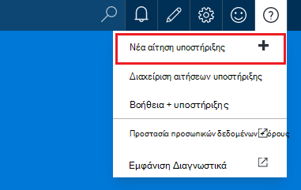

**Από μια blade πόρων**

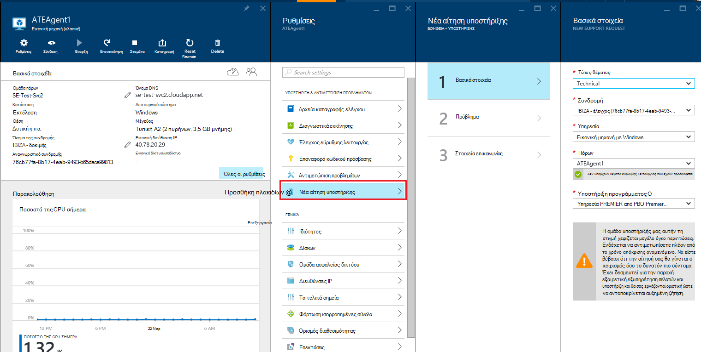

## Βασικά στοιχεία
Το πρώτο βήμα της διαδικασίας αίτηση υποστήριξης συλλέγει βασικές πληροφορίες σχετικά με το πρόβλημά σας και το πρόγραμμά σας υποστήριξης.

Ας ρίξουμε παράδειγμα: αντικριστές τεχνικών δυσκολιών με την εικονική μηχανή και υποψιάζεστε ότι υπάρχει κάποιο ζήτημα συνδεσιμότητας δικτύου.
Επιλογή της υπηρεσίας ("εικονικές υπολογιστή με Windows") και ο πόρος (το όνομα του υπολογιστή σας εικονική) στο πρώτο βήμα του οδηγού θα ξεκινήσει η διαδικασία για λήψη Βοήθειας για το συγκεκριμένο θέμα.

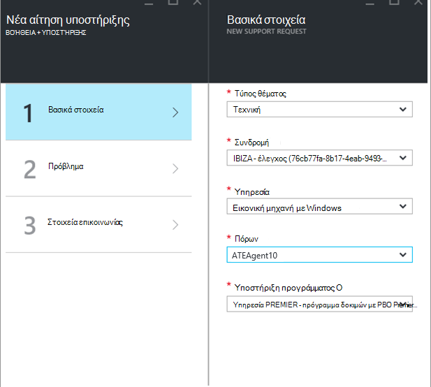

>[AZURE.NOTE] Azure παρέχει απεριόριστες υποστήριξη για διαχείριση συνδρομής (στοιχεία, όπως οι χρεώσεις, προσαρμογές ορίου και μεταφορές λογαριασμού). Για την τεχνική υποστήριξη, χρειάζεστε ένα σχέδιο υποστήριξης. [Μάθετε περισσότερα σχετικά με την υποστήριξη του προγράμματος](https://azure.microsoft.com/support/plans).

## Πρόβλημα
Το δεύτερο βήμα του οδηγού συγκεντρώνει πρόσθετες λεπτομέρειες σχετικά με το ζήτημα. Παροχή ακριβή λεπτομέρειες σε αυτό το βήμα επιτρέπει μας για να δρομολογήσετε υπόθεσή σας τη βέλτιστη μηχανικό υποστήριξης για το θέμα και για να ξεκινήσετε τη διάγνωση το ζήτημα όσο το δυνατόν πιο σύντομα.

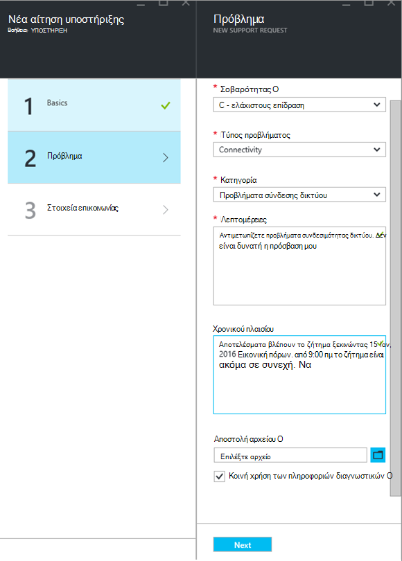

Συνεχίζοντας με το παράδειγμα συνδεσιμότητας εικονική μηχανή από επάνω, που μπορείτε να συμπληρώσετε αυτήν τη φόρμα για να υποδείξετε ένα ζήτημα συνδεσιμότητας δικτύου και να παρέχετε περισσότερες λεπτομέρειες σχετικά με το ζήτημα, συμπεριλαμβάνοντας την ώρα κατά προσέγγιση όταν αντιμετωπίζετε το πρόβλημα.

## Σχετική Βοήθεια
Για ορισμένες προβλήματα, παρέχουμε συνδέσεις σχετική Βοήθεια για να αντιμετωπίσετε το πρόβλημα. Εάν δεν Βοήθεια των προτεινόμενων εγγράφων, μπορείτε να συνεχίσετε τη διαδικασία για να δημιουργήσετε μια αίτηση υποστήριξης.
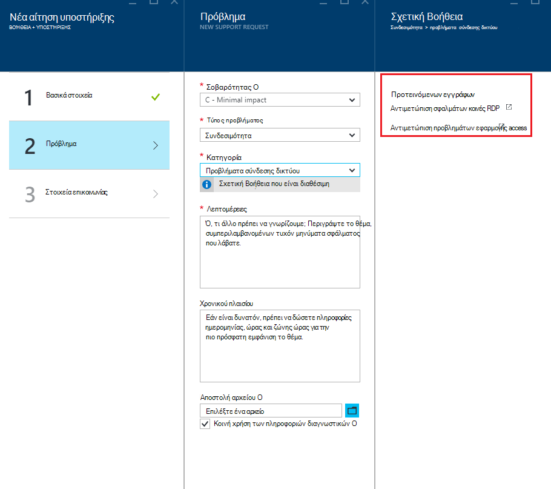

## Στοιχεία επικοινωνίας
Το τελευταίο βήμα του οδηγού επιβεβαιώνει τις πληροφορίες επαφής σας ώστε να γνωρίζουμε πώς να επικοινωνήσουμε μαζί σας.
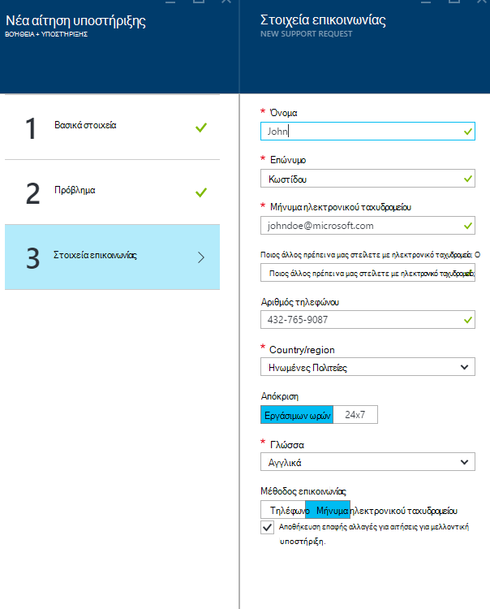

Ανάλογα με το της σοβαρότητας του το ζήτημά σας, μπορεί να σας ζητηθεί για να υποδείξετε εάν θέλετε να επικοινωνήσουμε μαζί σας κατά τη διάρκεια των εργάσιμων ωρών ή εάν προτιμάτε απόκριση 24 x 7, γεγονός που σημαίνει ότι μπορεί να επικοινωνήσουμε μαζί σας οποιαδήποτε στιγμή.
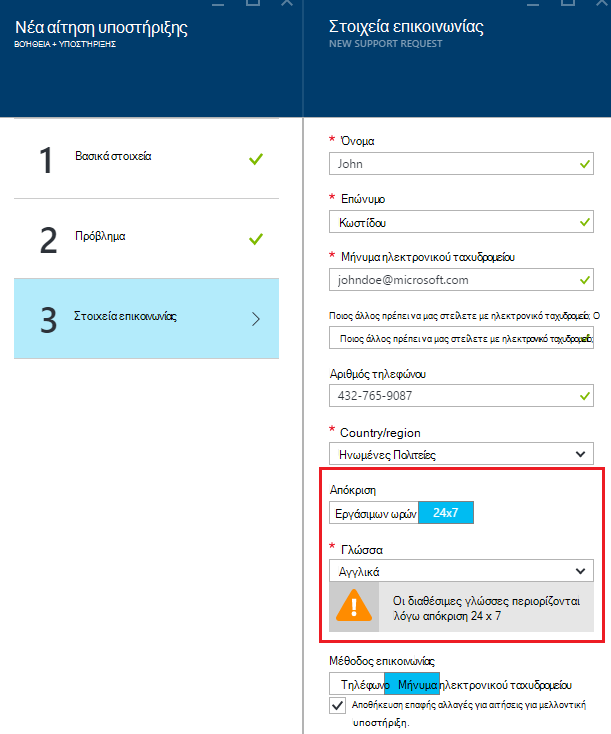

## Διαχείριση αιτήσεων υποστήριξης
Μετά τη δημιουργία της αίτησης υποστήριξης, μπορείτε να προβάλετε τις λεπτομέρειες της από τη σελίδα **Manage αιτήσεις υποστήριξης** .

**Από την επάνω γραμμή περιήγησης**

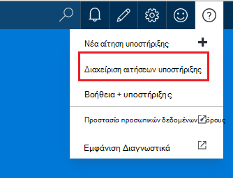

Στη σελίδα **Διαχείριση αιτήσεις υποστήριξης** , μπορείτε να προβάλετε όλες τις αιτήσεις υποστήριξης και την κατάστασή τους.
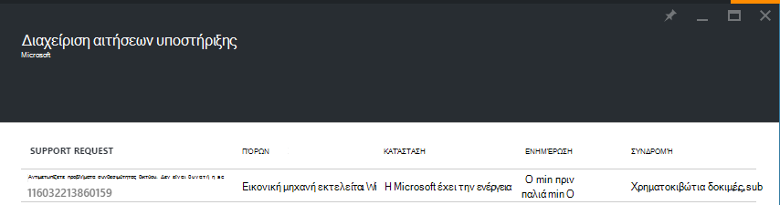

Επιλέξτε την αίτηση υποστήριξης για να προβάλετε λεπτομέρειες, συμπεριλαμβανομένης της σοβαρότητας και το χρονικό διάστημα θα χρειαστεί για έναν μηχανικό υποστήριξης για να απαντήσετε.
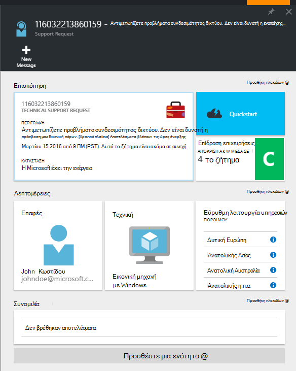

Εάν θέλετε να αλλάξετε το σοβαρότητας της πρόσκλησης σε, κάντε κλικ στο πλακίδιο **επίδραση επιχειρήσεις** . Στο προηγούμενο παράδειγμα, η πρόσκληση σε αυτήν τη στιγμή έχει οριστεί σε σοβαρότητας C.

Κάνοντας κλικ στο πλακίδιο εμφανίζει τη λίστα των severities μπορείτε να αντιστοιχίσετε σε μια αίτηση υποστήριξης Άνοιγμα.

>[AZURE.NOTE] Το επίπεδο μέγιστο σοβαρότητας εξαρτάται από το πρόγραμμά σας υποστήριξης. [Μάθετε περισσότερα σχετικά με την υποστήριξη του προγράμματος](https://azure.microsoft.com/support/plans).

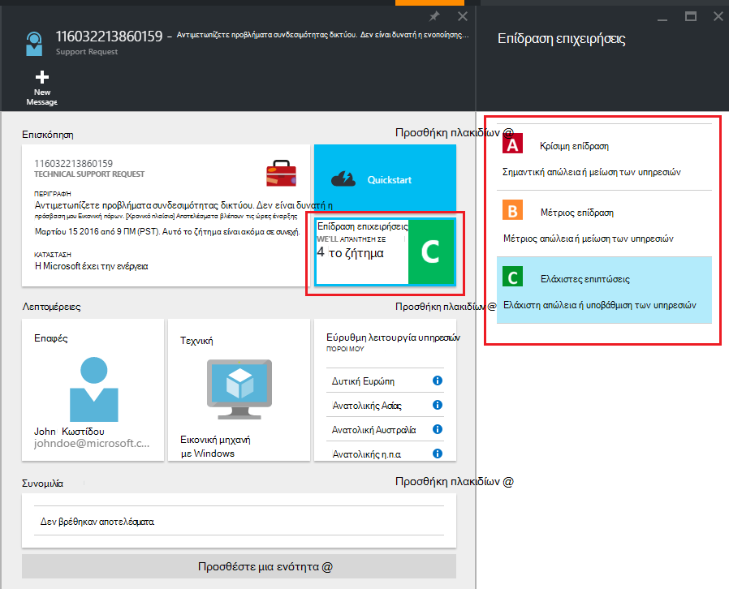

## Σχόλια
Θα σας είναι πάντα ανοιχτή σε σχόλια και προτάσεις! Στείλτε μας τις [προτάσεις](https://feedback.azure.com/forums/266794-support-feedback). Επιπλέον, μπορείτε να Εμπλακείτε μαζί μας μέσω [του Twitter](https://twitter.com/azuresupport) ή τα [Φόρουμ του MSDN](https://social.msdn.microsoft.com/Forums/azure).

## Μάθε περισσότερα
[Συνήθεις Ερωτήσεις για την υποστήριξη του Azure](https://azure.microsoft.com/support/faq)
