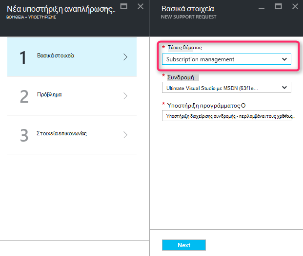
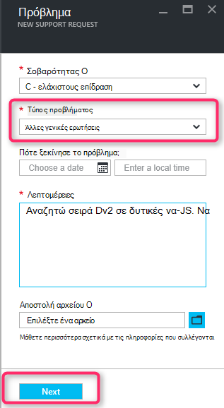
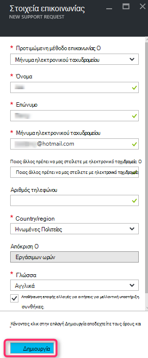

<properties
     pageTitle="Σειρά SKU διαθέσιμες | Microsoft Azure"
     description="Ορισμένες σειρές SKU δεν είναι διαθέσιμα για την επιλεγμένη συνδρομή για αυτή την περιοχή."
     services="Azure Supportability"
     documentationCenter=""
     authors="ganganarayanan"
     manager="scotthit"
     editor=""/>

<tags
     ms.service="azure-supportability"
     ms.workload="na"
     ms.tgt_pltfrm="na"
     ms.devlang="na"
     ms.topic="article"
     ms.date="08/12/2016"
     ms.author="gangan"/>

# Μη διαθέσιμες SKU σειράς

Σε ορισμένες περιοχές, ορισμένες SKU δεν είναι αυτόματα διαθέσιμο σε νέες συνδρομές.  Αυτό μπορεί να συμβεί όταν [πιο ισχυρή SKU εισάγονται σε μια περιοχή](https://azure.microsoft.com/updates/announcing-new-dv2-series-virtual-machine-size/) και η δημοτικότητα του το παλαιού τύπου απορρίπτει SKU.
Εμφανίζεται το μήνυμα "*σειρά ορισμένες SKU δεν είναι διαθέσιμες για την επιλεγμένη συνδρομή για αυτή την περιοχή*" όταν δημιουργείτε μια αίτηση υποστήριξης για να αυξήσετε το όριο πυρήνα υπολογισμού.

Ενδέχεται να θέλετε να εξετάσετε διαθεσιμότητα SKU στη σελίδα [Azure services ανά περιοχή](https://azure.microsoft.com/regions/#services) . 

Για να ζητήσετε πρόσβαση σε άλλες SKU που έχει περιοριστεί από τη συνδρομή σας, δημιουργήστε μια αίτηση υποστήριξης "Διαχείριση συνδρομής".

- Στη σελίδα Βασικά στοιχεία, επιλέξτε τύπο θέματος ως "Διαχείριση συνδρομής" και κάντε κλικ στο κουμπί "Επόμενο".

- Στη σελίδα το πρόβλημα, επιλέξτε τον τύπο πρόβλημα ως "Άλλες γενικές ερωτήσεις" και πληκτρολογήστε το ακριβές περιοχής και SKU που δεν εμφανίζεται.
Αυτό σας βοηθά να επιταχύνετε τη διαδικασία υποστήριξης.

- Στη σελίδα πληροφοριών επαφής, πληκτρολογήστε τις πληροφορίες επικοινωνίας και κάντε κλικ στην επιλογή "Δημιουργία".

## Σχόλια
Θα σας είναι πάντα ανοιχτή σε σχόλια και προτάσεις! Στείλτε μας τις [προτάσεις](https://feedback.azure.com/forums/266794-support-feedback). Επιπλέον, να επικοινωνείτε με μαζί μας μέσω [του Twitter](https://twitter.com/azuresupport) ή τα [Φόρουμ του MSDN](https://social.msdn.microsoft.com/Forums/azure).

## Μάθε περισσότερα
[Συνήθεις Ερωτήσεις για την υποστήριξη του Azure](https://azure.microsoft.com/support/faq)
