<properties
    pageTitle="Ανάκτηση δεδομένων από έναν άλλο διακομιστή DPM του αντιγράφου ασφαλείας θάλαμο | Microsoft Azure"
    description="Ανάκτηση δεδομένων που έχετε προστατεύονται σε ένα αντίγραφο ασφαλείας Azure θάλαμο από οποιονδήποτε διακομιστή DPM που έχουν καταχωρηθεί που θάλαμο."
    services="backup"
    documentationCenter=""
    authors="nkolli1"
    manager="shreeshd"
    editor=""/>

<tags
    ms.service="backup"
    ms.workload="storage-backup-recovery"
    ms.tgt_pltfrm="na"
    ms.devlang="na"
    ms.topic="article"
    ms.date="08/08/2016"
    ms.author="giridham;jimpark;trinadhk;markgal"/>

# Ανάκτηση δεδομένων από έναν άλλο διακομιστή DPM το θάλαμο δημιουργίας αντιγράφων ασφαλείας
Τώρα, μπορείτε να ανακτήσετε τα δεδομένα που έχετε προστασία σε ένα αντίγραφο ασφαλείας Azure θάλαμο από οποιονδήποτε διακομιστή DPM που έχουν καταχωρηθεί που θάλαμο. Η διαδικασία για αυτές τις ενέργειες είναι πλήρως ενσωματωμένο στην κονσόλα διαχείρισης DPM επομένως και είναι παρόμοια με τις άλλες ροές εργασίας αποκατάστασης.

Για να ανακτήσετε δεδομένα από έναν άλλο διακομιστή DPM του αντιγράφου ασφαλείας θάλαμο θα χρειαστεί [Συστήματος Κέντρο διαχείρισης προστασίας δεδομένων UR7](https://support.microsoft.com/en-us/kb/3065246) και την [πιο πρόσφατη Azure παράγοντα αντιγράφων ασφαλείας](http://aka.ms/azurebackup_agent).

## Επαναφορά δεδομένων από έναν άλλο DPM διακομιστή
Για να ανακτήσετε δεδομένα από μια άλλη DPM διακομιστή:

1. Από την καρτέλα **αποκατάστασης** από την Κονσόλα διαχείρισης DPM, κάντε κλικ στην επιλογή **' Προσθήκη εξωτερικών DPM'** (στο επάνω αριστερό μέρος της οθόνης).

    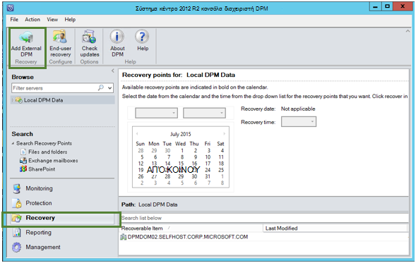

2. Λήψη νέα **θάλαμο διαπιστευτήρια** από το θάλαμο που σχετίζεται με το **διακομιστή DPM** όπου γίνεται ανάκτηση των δεδομένων, επιλέξτε DPM διακομιστή από τη λίστα των διακομιστών DPM που έχουν καταχωρηθεί το θάλαμο δημιουργίας αντιγράφων ασφαλείας και δώστε τη **φράση κρυπτογράφησης πρόσβασης** που σχετίζεται με το διακομιστή DPM γίνεται ανάκτηση των οποίων τα δεδομένα.

    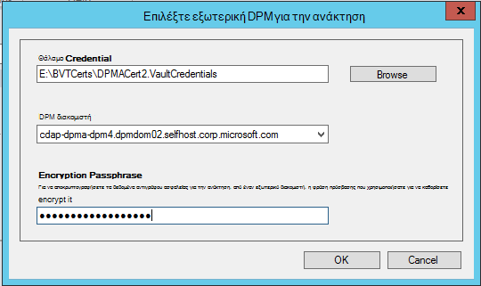

    >[AZURE.NOTE] Μόνο οι διακομιστές DPM που σχετίζεται με το ίδιο θάλαμο δήλωσης δυνατότητα ανάκτησης δεδομένων μεταξύ τους.

    Όταν ο διακομιστής εξωτερικών DPM προστίθεται με επιτυχία, μπορείτε να περιηγηθείτε στα δεδομένα του εξωτερικού DPM διακομιστή και τοπικού διακομιστή DPM από την καρτέλα **αποκατάστασης** .

3. Περιηγηθείτε στη λίστα διαθέσιμα διακομιστές παραγωγής που προστατεύονται από το εξωτερικό διακομιστή DPM και επιλέξτε το κατάλληλο αρχείο προέλευσης δεδομένων.

    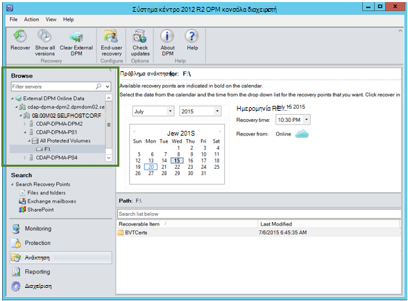

4. Επιλέξτε **το μήνα και το έτος** από την **Ανάκτηση σημεία** αναπτυσσόμενη λίστα, επιλέξτε την απαιτούμενη **ημερομηνία ανάκτησης** για κατά την οποία δημιουργήθηκε το σημείο αποκατάστασης και επιλέξτε την **ώρα αποκατάστασης**.

    Θα εμφανιστεί μια λίστα των αρχείων και φακέλων στο κάτω τμήμα του παραθύρου που μπορούν να περιήγηση και ανάκτησης σε οποιαδήποτε θέση.

    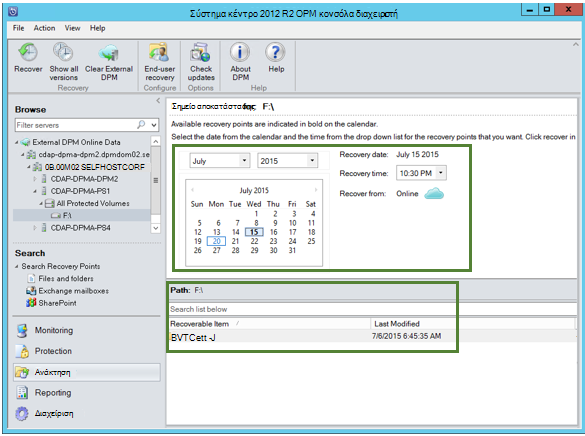

5. Κάντε δεξί κλικ στο κατάλληλο στοιχείο και κάντε κλικ στην επιλογή **Ανάκτηση**.

    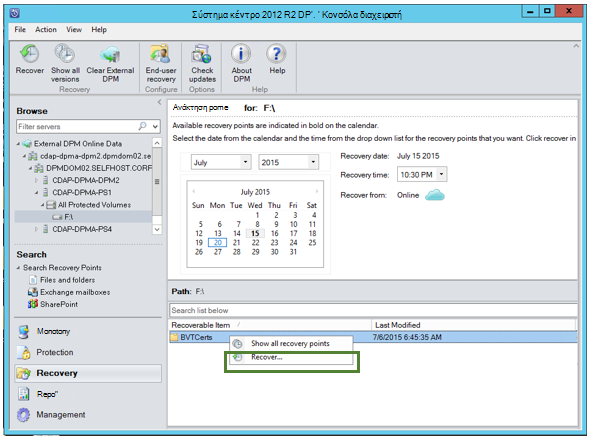

6. Εξετάστε την **Ανάκτηση επιλογής**. Επαληθεύστε τα δεδομένα και ώρα της το αντίγραφο ασφαλείας την ανάκτηση, καθώς και το αρχείο προέλευσης από την οποία δημιουργήθηκε το αντίγραφο ασφαλείας. Εάν η επιλογή δεν είναι σωστή, κάντε κλικ στο κουμπί **Άκυρο** για να επιστρέψετε σε αποκατάστασης tab για να επιλέξετε σημείο κατάλληλο αποκατάστασης. Εάν η επιλογή είναι σωστή, κάντε κλικ στο κουμπί **Επόμενο**.

    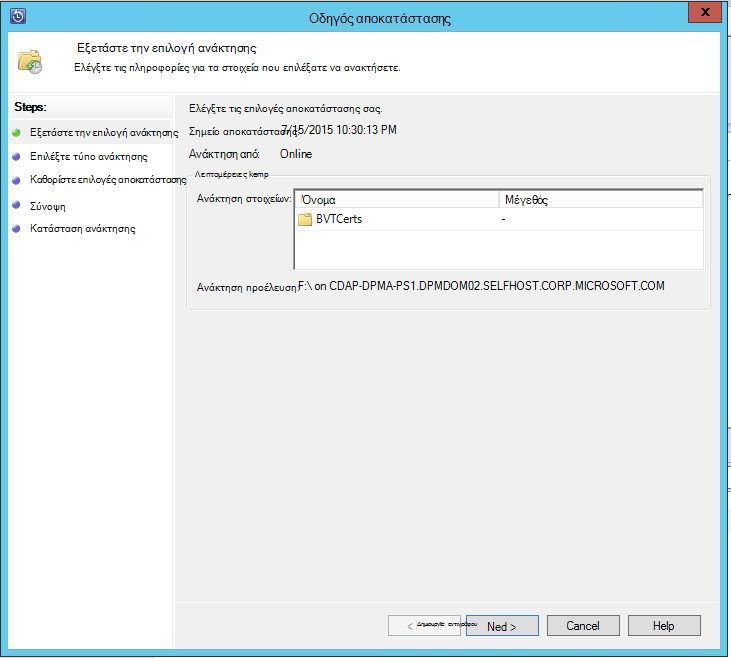

7. Επιλέξτε **Ανάκτηση σε μια εναλλακτική θέση**. **Μεταβείτε** στη σωστή θέση για την ανάκτηση.

    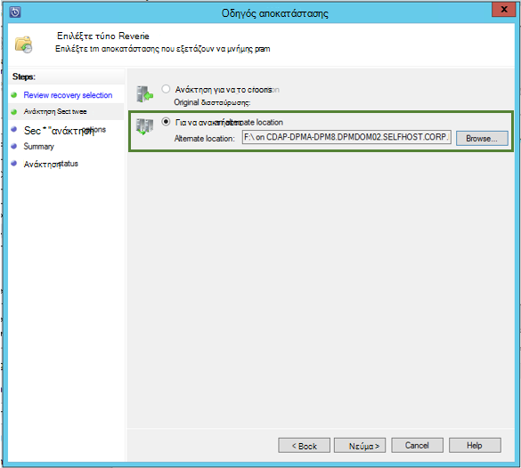

8. Ενεργοποιήστε την επιλογή που σχετίζονται με τη **Δημιουργία αντιγράφου**, **Παράλειψη**ή **Αντικατάσταση**.
    - **Δημιουργία αντιγράφου** θα δημιουργήσει ένα αντίγραφο του αρχείου, σε περίπτωση που υπάρχει μια διένεξη ονόματος.
    - **Παράλειψη** θα παραλείψει ανάκτηση του αρχείου, σε περίπτωση που υπάρχει μια διένεξη ονόματος.
    - **Αντικατάσταση** θα αντικαταστήσει την υπάρχουσα αντιγραφή στη θέση που καθορίζεται στην περίπτωση μιας διένεξης ονόματος.

    Επιλέξτε την κατάλληλη επιλογή για να **επαναφέρετε ασφαλείας**. Μπορείτε να εφαρμόσετε τις ρυθμίσεις ασφαλείας του υπολογιστή προορισμού όπου γίνεται ανάκτηση των δεδομένων ή τις ρυθμίσεις ασφαλείας που ήταν που ισχύουν για προϊόν τη στιγμή που δημιουργήθηκε το σημείο αποκατάστασης.

    Προσδιορίστε αν θα σταλεί μια **ειδοποίηση** όταν ολοκληρωθεί με επιτυχία την ανάκτηση.

    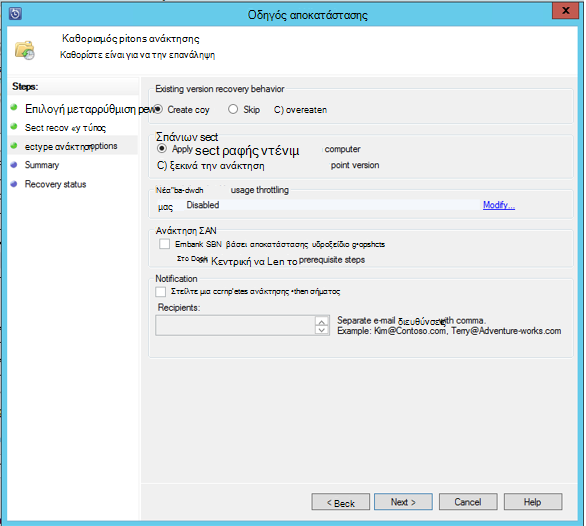

9. Στην οθόνη **Σύνοψη** παραθέτει τις επιλογές επιλέξει μέχρι στιγμής. Αφού κάνετε κλικ στο κουμπί **'Ανάκτηση'**, τα δεδομένα θα ανακτηθούν στη θέση κατάλληλη εσωτερικής εγκατάστασης.

    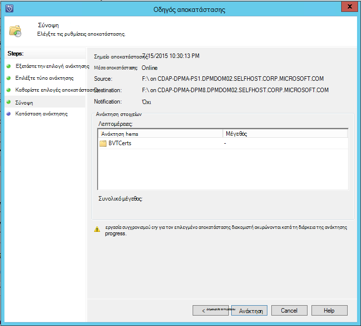

    >[AZURE.NOTE] Στην καρτέλα **Εποπτεία** του διακομιστή DPM να παρακολουθήσετε την εργασία αποκατάστασης.

    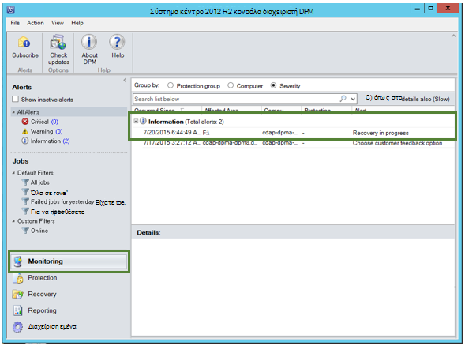

10. Μπορείτε να επιλέξετε **Απαλοιφή εξωτερικών DPM** στην καρτέλα **αποκατάστασης** του διακομιστή DPM για να καταργήσετε την προβολή του εξωτερικού διακομιστή DPM.

    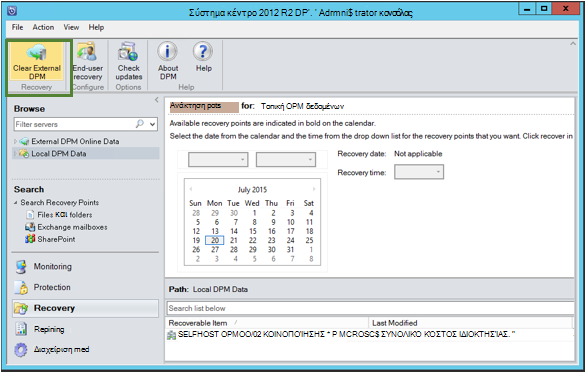

## Αντιμετώπιση προβλημάτων μηνύματα σφάλματος
|Όχι. |  Μήνυμα σφάλματος | Βήματα αντιμετώπισης προβλημάτων |
| :-------------: |:-------------| :-----|
|1.|        Αυτός ο διακομιστής δεν έχει καταχωρηθεί για το θάλαμο που καθορίζεται από τα διαπιστευτήρια θάλαμο.|  **Αιτία:** Αυτό το σφάλμα εμφανίζεται όταν το επιλεγμένο αρχείο διαπιστευτηρίων θάλαμο δεν ανήκουν στην το θάλαμο αντιγράφου ασφαλείας που σχετίζονται με DPM διακομιστή στον οποίο γίνεται προσπάθεια ανάκτησης.   **Ανάλυση:** Κάντε λήψη του αρχείου διαπιστευτηρίων θάλαμο από το αντίγραφο ασφαλείας θάλαμο στην οποία είναι καταχωρημένος ο διακομιστής DPM.|
|2.|        Είτε δεν είναι διαθέσιμη η δυνατότητα ανάκτησης δεδομένων ή τον επιλεγμένο διακομιστή δεν είναι διακομιστής DPM.|   **Αιτία:** Υπάρχουν άλλοι διακομιστές DPM με DPM 2012 R2 UR7 καταχωρηθεί για το αντίγραφο ασφαλείας θάλαμο, ή τους διακομιστές DPM με DPM 2012 R2 UR7 δεν έχετε αποστείλει ακόμη τα μετα-δεδομένα ή τον επιλεγμένο διακομιστή δεν είναι διακομιστής DPM (ή Windows Server ή Windows προγράμματος-πελάτη).   **Ανάλυση:** Εάν υπάρχουν άλλοι διακομιστές DPM που έχουν καταχωρηθεί για το αντίγραφο ασφαλείας θάλαμο, βεβαιωθείτε ότι SCDPM 2012 R2 UR7 και πιο πρόσφατη αντιγράφου ασφαλείας Azure παράγοντας είναι εγκατεστημένα.  Εάν υπάρχουν άλλοι διακομιστές DPM που έχουν καταχωρηθεί για το αντίγραφο ασφαλείας θάλαμο με DPM 2012 R2 UR7, περιμένετε για την ημέρα μετά την εγκατάσταση του UR7 για να ξεκινήσετε τη διαδικασία επαναφοράς. Η διάρκεια της νύχτας εργασία θα αποστείλετε τα μετα-δεδομένα για όλα τα αντίγραφα ασφαλείας των προστατευμένων προηγουμένως στο cloud. Τα δεδομένα θα είναι διαθέσιμη για την ανάκτηση.|
|3.|        Άλλος DPM διακομιστής έχει καταχωρηθεί για αυτό θάλαμο.|   **Αιτία:** Δεν υπάρχουν άλλες DPM διακομιστές με DPM 2012 R2 UR7 ή νεότερη έκδοση που έχουν καταχωρηθεί για το θάλαμο από την οποία γίνεται προσπάθεια ανάκτησης. **Ανάλυση:** Εάν υπάρχουν άλλοι διακομιστές DPM που έχουν καταχωρηθεί για το αντίγραφο ασφαλείας θάλαμο, βεβαιωθείτε ότι SCDPM 2012 R2 UR7 και πιο πρόσφατη αντιγράφου ασφαλείας Azure παράγοντας είναι εγκατεστημένα. Εάν υπάρχουν άλλοι διακομιστές DPM που έχουν καταχωρηθεί για το αντίγραφο ασφαλείας θάλαμο με DPM 2012 R2 UR7, περιμένετε για την ημέρα μετά την εγκατάσταση του UR7 για να ξεκινήσετε τη διαδικασία επαναφοράς. Η διάρκεια της νύχτας εργασία θα αποστείλετε τα μετα-δεδομένα για όλα τα αντίγραφα ασφαλείας των προστατευμένων προηγουμένως στο cloud. Τα δεδομένα θα είναι διαθέσιμη για την ανάκτηση.|
|4.|        Η φράση πρόσβασης κρυπτογράφησης που παρέχονται δεν συμφωνεί με τη φράση πρόσβασης που σχετίζεται με τον ακόλουθο διακομιστή:**<server name>**|  **Αιτία:** Η φράση πρόσβασης κρυπτογράφησης που χρησιμοποιούνται σε διαδικασία κρυπτογραφεί τα δεδομένα από τα δεδομένα του διακομιστή DPM που γίνεται ανάκτηση δεν ταιριάζουν με τη φράση πρόσβασης κρυπτογράφησης που παρέχονται. Ο παράγοντας δεν είναι δυνατό να αποκρυπτογραφήσετε τα δεδομένα. Ως εκ τούτου την ανάκτηση αποτυγχάνει. **Ανάλυση:** Δώστε την ακριβή ίδια κρυπτογράφησης φράση πρόσβασης που σχετίζεται με το διακομιστή DPM γίνεται ανάκτηση των οποίων τα δεδομένα.|

## Συνήθεις ερωτήσεις:
1. **Γιατί δεν μπορώ να προσθέσω έναν εξωτερικό διακομιστή DPM από άλλο DPM διακομιστή μετά την εγκατάσταση του UR7 και την πιο πρόσφατη παράγοντας Azure Backup;**

    A) για υπάρχοντες διακομιστές DPM με προελεύσεις δεδομένων που προστατεύονται στο cloud (χρησιμοποιώντας μια συλλογή ενημερωμένων νωρίτερα από ενημέρωση ενημερώσεων 7), θα πρέπει να περιμένετε τουλάχιστον μία ημέρα μετά την εγκατάσταση του UR7 και πιο πρόσφατη παράγοντα Azure δημιουργίας αντιγράφων ασφαλείας για να ξεκινήσετε την *Προσθήκη εξωτερικών DPM διακομιστή*. Αυτό είναι απαραίτητο για να αποστείλετε τα μετα-δεδομένα από τις ομάδες προστασίας DPM στο Azure. Αυτό συμβαίνει την πρώτη φορά σε κάθε εργασίας.

2. **Τι είναι η ελάχιστη έκδοση του παράγοντας Azure Backup απαιτείται;**

    A) η ελάχιστη έκδοση παράγοντας Azure δημιουργίας αντιγράφων ασφαλείας για να ενεργοποιήσετε αυτή η δυνατότητα είναι 2.0.8719.0.  Είναι δυνατή η επαλήθευση Azure έκδοση παράγοντα δημιουργίας αντιγράφων ασφαλείας, μεταβαίνοντας στον πίνακα ελέγχου **>** όλα Πίνακας ελέγχου στοιχείων **>** προγράμματα και δυνατότητες **>** παράγοντα υπηρεσίες Microsoft Azure αποκατάστασης. Εάν η έκδοση είναι μικρότερη από 2.0.8719.0, κάντε λήψη του [τελευταίου agent Azure δημιουργίας αντιγράφων ασφαλείας](https://go.microsoft.com/fwLink/?LinkID=288905) και εγκατάσταση.

    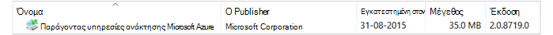

## Επόμενα βήματα:
• [Azure αντιγράφου ασφαλείας συνήθεις Ερωτήσεις](backup-azure-backup-faq.md)
