<properties
    pageTitle="Επαναφορά εικονικές μηχανές από αντίγραφο ασφαλείας με Azure πύλη | Microsoft Azure"
    description="Επαναφορά ενός Azure εικονική μηχανή από ένα σημείο αποκατάστασης με Azure πύλη"
    services="backup"
    documentationCenter=""
    authors="markgalioto"
    manager="cfreeman"
    editor=""
    keywords="Επαναφορά αντιγράφου ασφαλείας; πώς μπορείτε να επαναφέρετε; σημείο αποκατάστασης;"/>

<tags
    ms.service="backup"
    ms.workload="storage-backup-recovery"
    ms.tgt_pltfrm="na"
    ms.devlang="na"
    ms.topic="article"
    ms.date="08/10/2016"
    ms.author="trinadhk; jimpark;"/>

# Χρησιμοποιήστε Azure πύλη για να επαναφέρετε εικονικές μηχανές

> [AZURE.SELECTOR]
- [Επαναφορά ΣΠΣ στην πύλη κλασική](backup-azure-restore-vms.md)
- [Επαναφορά ΣΠΣ στην πύλη του Azure](backup-azure-arm-restore-vms.md)

Προστατεύστε τα δεδομένα σας παρακολουθώντας στιγμιότυπων των δεδομένων σας σε καθορισμένα χρονικά διαστήματα. Αυτά τα στιγμιότυπα είναι γνωστό ως σημεία αποκατάστασης και είναι αποθηκευμένα στο χώροι φύλαξης υπηρεσίες ανάκτησης. Εάν ή όταν είναι απαραίτητο να επιδιορθώσετε ή εκ νέου δημιουργία μια Εικονική, μπορείτε να επαναφέρετε την εικονική Μηχανή από οποιοδήποτε από τα σημεία αποθηκευμένο αποκατάστασης. Όταν εκτελείτε επαναφορά ενός σημείου αποκατάστασης, μπορείτε να επιστρέψετε ή να επαναφέρετε την εικονική Μηχανή στην κατάσταση κατά τη λήψη του σημείου αποκατάστασης. Σε αυτό το άρθρο εξηγεί τον τρόπο για να επαναφέρετε μια Εικονική.

> [AZURE.NOTE] Azure περιλαμβάνει δύο μοντέλων ανάπτυξης για τη δημιουργία και εργασία με πόρους: [Διαχείριση πόρων και κλασική](../resource-manager-deployment-model.md). Σε αυτό το άρθρο παρέχει τις πληροφορίες και διαδικασίες για την επαναφορά ΣΠΣ αναπτυχθεί με τη χρήση του μοντέλου από διαχειριστή πόρων.

## Επαναφορά ενός σημείου αποκατάστασης

1. Είσοδος στην [πύλη του Azure](http://portal.azure.com/)

2. Στο μενού Azure, κάντε κλικ στο κουμπί **Αναζήτηση** και στη λίστα των υπηρεσιών, πληκτρολογήστε **Υπηρεσίες ανάκτησης**. Στη λίστα υπηρεσιών προσαρμόζεται για να τι πληκτρολογείτε. Όταν δείτε **χώροι φύλαξης υπηρεσίες ανάκτησης**, επιλέξτε την.

    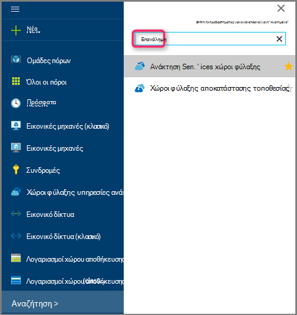

    Εμφανίζεται η λίστα των χώροι φύλαξης στην συνδρομής.

    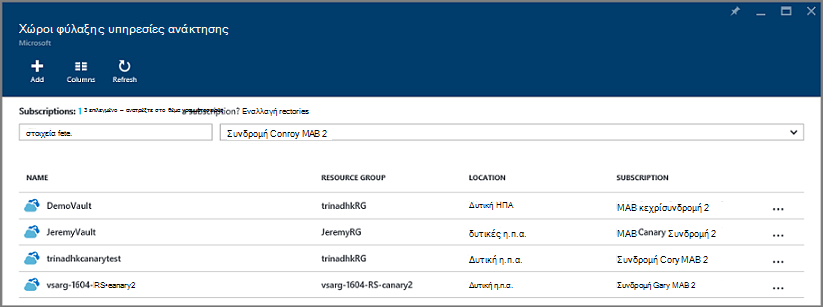

3. Από τη λίστα, επιλέξτε το θάλαμο που σχετίζεται με την εικονική Μηχανή που θέλετε να επαναφέρετε. Όταν κάνετε κλικ το θάλαμο, ανοίγει το πίνακα εργαλείων.

    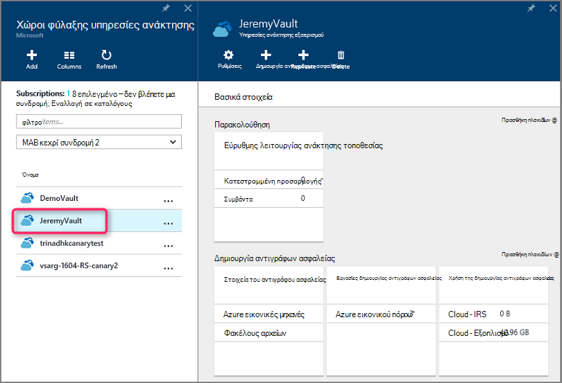

4. Τώρα που έχετε στον πίνακα εργαλείων θάλαμο. Σχετικά με τα **Στοιχεία δημιουργίας αντιγράφων ασφαλείας** πλακιδίου, κάντε κλικ για να εμφανίσετε το ΣΠΣ που σχετίζεται με το θάλαμο **εικονικές μηχανές Windows Azure** .

    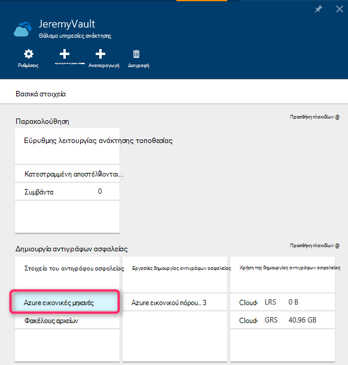

    Το **Αντίγραφο ασφαλείας στοιχεία** blade ανοίγει και εμφανίζει τη λίστα των Azure εικονικές μηχανές.

    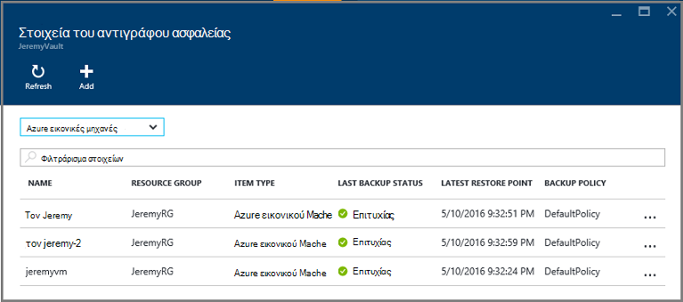

5. Από τη λίστα, επιλέξτε μια εικονική Μηχανή για να ανοίξετε τον πίνακα εργαλείων. Πίνακας εργαλείων Εικονική ανοίγει στην περιοχή παρακολούθηση, η οποία περιέχει το πλακίδιο σημεία επαναφοράς.

    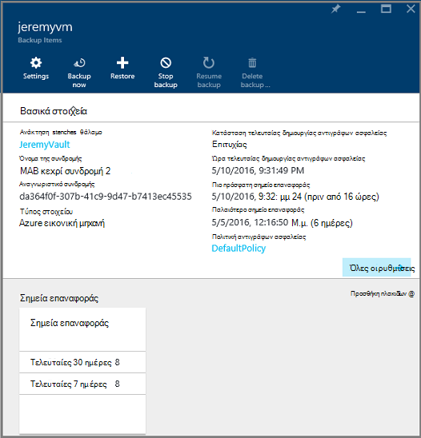

6. Στο μενού Εικονική πίνακα εργαλείων, κάντε κλικ στην επιλογή **Επαναφορά**

    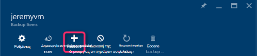

    Ανοίγει το blade επαναφορά.

    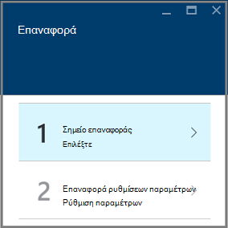

7. Στην blade **επαναφέρετε** , κάντε κλικ στην επιλογή **Επαναφορά σημείο** για να ανοίξετε το blade **Επιλέξτε επαναφορά σημείου** .

    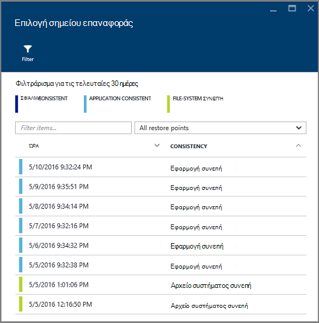

    Από προεπιλογή, το παράθυρο διαλόγου εμφανίζει όλα τα σημεία επαναφοράς από τις τελευταίες 30 ημέρες. Χρήση του **φίλτρου** για την τροποποίηση της περιοχής ώρας από τα σημεία επαναφοράς εμφανίζονται. Από προεπιλογή, εμφανίζονται τα σημεία επαναφοράς της συνέπειας όλων. Τροποποίηση **επαναφέρετε όλα τα σημεία** φίλτρο για να επιλέξετε ένα συγκεκριμένο συνέπειας των σημείων επαναφοράς. Για περισσότερες πληροφορίες σχετικά με κάθε τύπο της επαναφοράς σημείο, ανατρέξτε στο θέμα η επεξήγηση της [συνέπειας δεδομένων](./backup-azure-vms-introduction.md#data-consistency).  
    - Επιλέξτε **Επαναφορά σημείου συνέπειας** από αυτήν τη λίστα:
        - Σφάλμα σημεία συνεπή επαναφοράς
        - Σημεία επαναφοράς συνεπή εφαρμογή,
        - Αρχείο σημεία συνεπή επαναφοράς συστήματος
        - Όλα τα σημεία επαναφοράς.  

8. Επιλέξτε ένα σημείο επαναφοράς και κάντε κλικ στο κουμπί **OK**.

    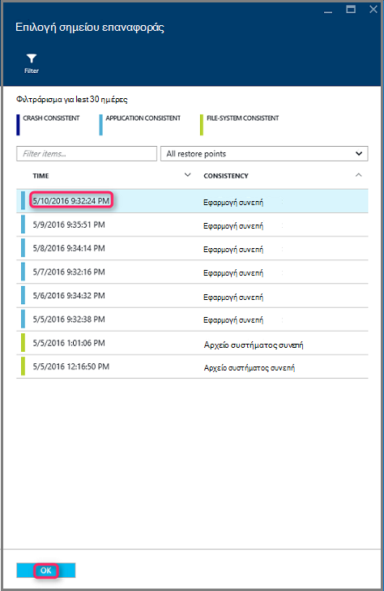

    Η **Επαναφορά** blade δείχνει το σημείο επαναφοράς έχει οριστεί.

    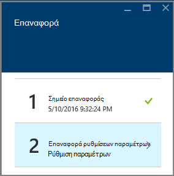

9. Στην blade **Επαναφορά** , **επαναφέρετε ρύθμισης παραμέτρων** ανοίγει αυτόματα αφού έχει οριστεί σημείο επαναφοράς.

    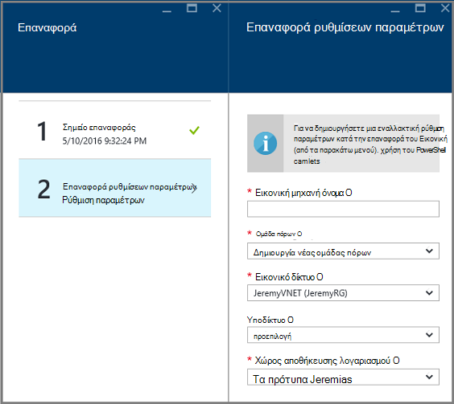

## Επιλογή ρύθμισης παραμέτρων επαναφορά μια εικονική Μηχανή

Τώρα που έχετε επιλέξει το σημείο επαναφοράς, επιλέξτε μια ρύθμιση παραμέτρων για την επαναφορά Εικονική. Οι επιλογές σας για τη ρύθμιση παραμέτρων του επαναφέρει Εικονική είναι να χρησιμοποιήσετε: πύλη Azure ή PowerShell.

> [AZURE.NOTE] Πύλη παρέχει μια επιλογή γρήγορης δημιουργίας για επαναφορά Εικονική. Εάν θέλετε να προσαρμόσετε τη ρύθμιση παραμέτρων Εικονική την to-be επαναφέρει εικονική Μηχανή, χρήση του PowerShell για να επαναφέρετε αντίγραφα ασφαλείας δίσκων και επισυνάψτε τις σε επιλογή της ρύθμισης παραμέτρων Εικονική. Ανατρέξτε στο θέμα [Επαναφορά μια εικονική Μηχανή με ρυθμίσεις παραμέτρων ειδική δικτύου](#restoring-vms-with-special-network-configurations).

1. Εάν δεν είστε ήδη εκεί, μεταβείτε στο το blade **Επαναφορά** . Βεβαιωθείτε ότι ένα **σημείο επαναφοράς** έχει επιλεγεί, και κάντε κλικ στην επιλογή **Επαναφορά ρύθμισης παραμέτρων** για να ανοίξετε το blade **αποκατάστασης ρύθμισης παραμέτρων** .

    

2. Σε blade **Επαναφορά ρύθμισης παραμέτρων** , πληκτρολογήστε ή επιλέξτε τιμές για κάθε ένα από τα παρακάτω πεδία:
    - **Εικονική μηχανή όνομα** - δώστε ένα όνομα για την εικονική Μηχανή. Το όνομα πρέπει να είναι μοναδικό στην ομάδα πόρων (για μια Εικονική αναπτυχθεί από διαχειριστή πόρων) ή μια υπηρεσία cloud (για μια Εικονική κλασική). Δεν μπορείτε να αντικαταστήσετε την εικονική μηχανή εάν υπάρχει ήδη στην συνδρομής.
    - **Ομάδα πόρων** - Χρησιμοποιήστε μια υπάρχουσα ομάδα πόρων ή δημιουργήστε ένα νέο. Εάν θέλετε να επαναφέρετε μια Εικονική κλασική, χρησιμοποιήστε αυτό το πεδίο για να καθορίσετε το όνομα του μια νέα υπηρεσία στο cloud. Εάν δημιουργείτε μια νέα υπηρεσία cloud/ομάδα πόρων, το όνομα πρέπει να είναι μοναδικό καθολικό. Συνήθως, το όνομα της υπηρεσίας cloud είναι συσχετισμένη με μια διεύθυνση URL της δημόσιας - για παράδειγμα: [cloudservice]. cloudapp.net. Εάν προσπαθείτε να χρησιμοποιήσετε ένα όνομα για την υπηρεσία cloud πόρων ομάδα/cloud που έχει ήδη χρησιμοποιηθεί, Azure εκχωρεί την υπηρεσία cloud/ομάδα πόρων το ίδιο όνομα με την εικονική Μηχανή. Azure εμφανίζει τις υπηρεσίες cloud/ομάδες πόρων και ΣΠΣ που δεν σχετίζεται με τις ομάδες συνάφεια. Για περισσότερες πληροφορίες, ανατρέξτε στο θέμα [πώς μπορείτε να κάνετε μετεγκατάσταση από ομάδες συσχέτισης σε τοπικές εικονικό δίκτυο (VNet)](../virtual-network/virtual-networks-migrate-to-regional-vnet.md).
    - **Εικονικού δικτύου** - επιλέξτε το εικονικό δίκτυο (VNET) κατά τη δημιουργία του Εικονική. Το πεδίο παρέχει όλα VNETs που σχετίζεται με τη συνδρομή. Ομάδα πόρων από την εικονική Μηχανή εμφανίζεται σε παρενθέσεις.
    - **Υποδικτύου** - εάν η VNET έχει δευτερεύοντα δίκτυα, το πρώτο υποδίκτυο είναι ενεργοποιημένη από προεπιλογή. Εάν υπάρχουν επιπλέον δευτερεύοντα δίκτυα, επιλέξτε το επιθυμητό υποδίκτυο.
    - **Χώρος αποθήκευσης λογαριασμού** - αυτό το μενού παραθέτει τους λογαριασμούς χώρου αποθήκευσης στην ίδια θέση με το θάλαμο υπηρεσίες ανάκτησης. Όταν επιλέγετε ένα λογαριασμό του χώρου αποθήκευσης, επιλέξτε ένα λογαριασμό που κάνει κοινή χρήση στην ίδια θέση με το θάλαμο υπηρεσίες ανάκτησης. Λογαριασμοί χώρου αποθήκευσης που είναι ζώνη πλεονάζοντα δεν υποστηρίζονται. Εάν υπάρχουν λογαριασμοί χώρου αποθήκευσης με την ίδια θέση με το θάλαμο υπηρεσίες ανάκτησης, πρέπει να δημιουργήσετε ένα πριν να ξεκινήσετε τη λειτουργία επαναφοράς. Τύπος αναπαραγωγής του λογαριασμού του χώρου αποθήκευσης είναι που αναφέρονται σε παρενθέσεις.

    > [AZURE.NOTE] Εάν θέλετε να επαναφέρετε μια Εικονική αναπτυχθεί από διαχειριστή πόρων, πρέπει να εντοπίσετε ένα εικονικό δίκτυο (VNET). Ένα εικονικό δίκτυο (VNET) είναι προαιρετική για μια Εικονική κλασική.

3. Στην blade **Επαναφορά ρύθμισης παραμέτρων** , κάντε κλικ στο κουμπί **OK** για να οριστικοποιήσετε τη ρύθμιση παραμέτρων επαναφορά.

4. Στην blade **επαναφέρετε** , κάντε κλικ στην επιλογή **Επαναφορά** για να ενεργοποιήσετε τη λειτουργία επαναφοράς.

    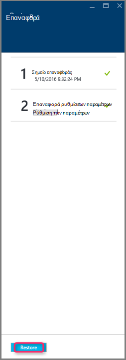

## Παρακολούθηση τη λειτουργία επαναφοράς

Αφού ενεργοποιήσετε τη λειτουργία επαναφοράς, την υπηρεσία δημιουργίας αντιγράφων ασφαλείας δημιουργεί μια εργασία για την παρακολούθηση της λειτουργίας επαναφοράς. Η υπηρεσία δημιουργίας αντιγράφων ασφαλείας δημιουργεί επίσης και εμφανίζει προσωρινά την ειδοποίηση στην περιοχή ειδοποιήσεων της πύλης. Εάν δεν βλέπετε την ειδοποίηση, μπορείτε πάντα να επιλέξετε το εικονίδιο ειδοποιήσεις για να προβάλετε τις ειδοποιήσεις.

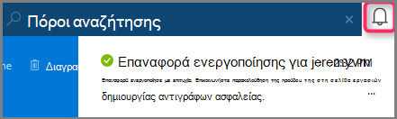

Για να προβάλετε τη λειτουργία ενώ επεξεργάζεται ή να προβάλετε κατά την ολοκλήρωση, ανοίξτε τη λίστα εργασιών δημιουργίας αντιγράφων ασφαλείας.

1. Στο μενού Azure, κάντε κλικ στο κουμπί **Αναζήτηση** και στη λίστα των υπηρεσιών, πληκτρολογήστε **Υπηρεσίες ανάκτησης**. Στη λίστα υπηρεσιών προσαρμόζεται για να τι πληκτρολογείτε. Όταν δείτε **χώροι φύλαξης υπηρεσίες ανάκτησης**, επιλέξτε την.

    

    Εμφανίζεται η λίστα των χώροι φύλαξης στην συνδρομής.

    

2. Από τη λίστα, επιλέξτε το θάλαμο που σχετίζεται με την εικονική Μηχανή θα ανακτηθεί. Όταν κάνετε κλικ το θάλαμο, ανοίγει το πίνακα εργαλείων.

3. Στον πίνακα εργαλείων θάλαμο στις **Εργασίες δημιουργίας αντιγράφων ασφαλείας** πλακιδίου, κάντε κλικ στην επιλογή **εικονικές μηχανές Windows Azure** για να εμφανίσετε τις εργασίες που σχετίζονται με το θάλαμο.

    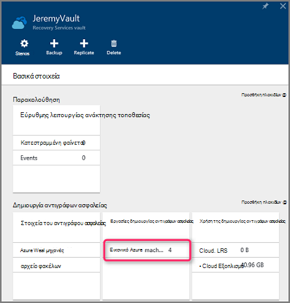

    Το **Αντίγραφο ασφαλείας εργασίες** blade ανοίγει και εμφανίζει τη λίστα εργασιών.

    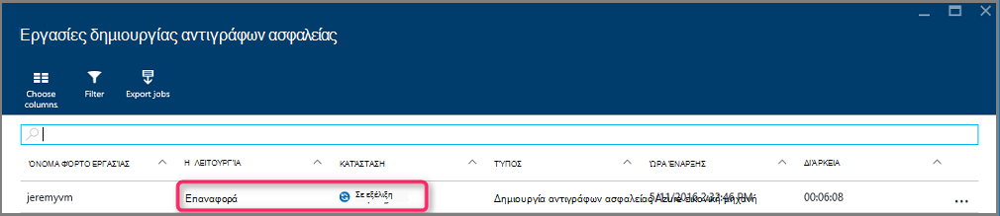

## Επαναφορά ΣΠΣ με ρυθμίσεις παραμέτρων ειδική δικτύου
Είναι δυνατή η δημιουργία αντιγράφων ασφαλείας και επαναφορά ΣΠΣ με τις ακόλουθες ρυθμίσεις παραμέτρων ειδική δικτύου. Ωστόσο, αυτές οι ρυθμίσεις παραμέτρων απαιτούν ορισμένες ιδιαίτερη εξέταση κατά τη μετάβαση κατά τη διαδικασία επαναφοράς.

- ΣΠΣ στην περιοχή εξισορρόπηση φόρτου (εσωτερικές και εξωτερικές)
- ΣΠΣ με πολλές διευθύνσεις IP δεσμευμένες
- ΣΠΣ με πολλά NIC

>[AZURE.IMPORTANT] Όταν δημιουργείτε τη ρύθμιση παραμέτρων ειδική δικτύου για ΣΠΣ, πρέπει να χρησιμοποιήσετε PowerShell για τη δημιουργία ΣΠΣ από δίσκων επαναφορά.

Για να αναδημιουργήσετε πλήρως τις εικονικές μηχανές μετά την επαναφορά σε δίσκο, ακολουθήστε τα παρακάτω βήματα:

1. Επαναφορά των δίσκων από ένα θάλαμο υπηρεσίες ανάκτησης χρήση του [PowerShell](../backup-azure-vms-automation.md#restore-an-azure-vm)

2. Δημιουργήστε τη ρύθμιση παραμέτρων Εικονική που απαιτείται για την εξισορρόπηση φόρτου / πολλών NIC/πολλαπλάσιο δεσμευμένη διεύθυνση IP χρησιμοποιώντας την επιλογή και χρήση των cmdlet του PowerShell για να δημιουργήσετε την εικονική Μηχανή της επιθυμητοί ρύθμισης παραμέτρων.
    - Δημιουργία Εικονική σε μια υπηρεσία cloud με το [εσωτερικό εξισορρόπηση φόρτου](https://azure.microsoft.com/documentation/articles/load-balancer-internal-getstarted/)
    - Δημιουργία Εικονική για να συνδεθείτε [Internet αντικριστές εξισορρόπηση φόρτου] (https://azure.microsoft.com/en-us/documentation/articles/load-balancer-internet-getstarted/)
    - Δημιουργία Εικονική με [πολλά NIC](https://azure.microsoft.com/documentation/articles/virtual-networks-multiple-nics/)
    - Δημιουργία Εικονική με [πολλές διευθύνσεις IP δεσμευμένες](https://azure.microsoft.com/documentation/articles/virtual-networks-reserved-public-ip/)

## Επόμενα βήματα
Τώρα που μπορείτε να επαναφέρετε το ΣΠΣ, ανατρέξτε στο άρθρο αντιμετώπισης προβλημάτων για πληροφορίες σχετικά με τα κοινά σφάλματα με ΣΠΣ. Επίσης, δείτε το άρθρο σχετικά με τη Διαχείριση εργασιών με το ΣΠΣ.

- [Αντιμετώπιση σφαλμάτων](backup-azure-vms-troubleshoot.md#restore)
- [Διαχείριση εικονικές μηχανές](backup-azure-manage-vms.md)
