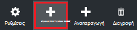
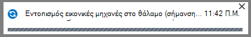
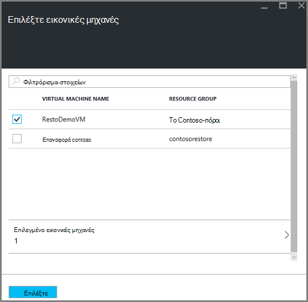
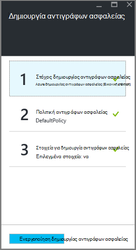
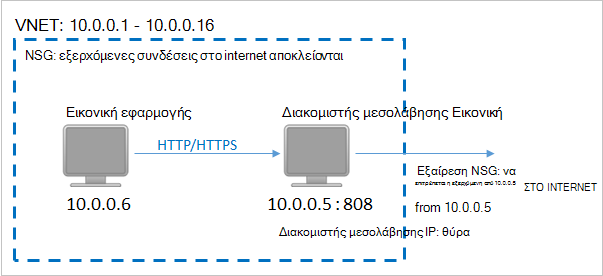
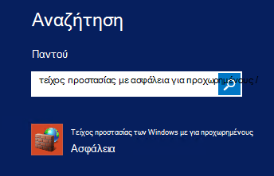
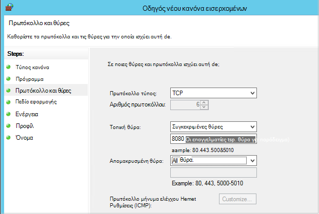

<properties
    pageTitle="Προετοιμασία του περιβάλλοντός σας για να δημιουργήσετε αντίγραφα ασφαλείας αναπτυχθεί από διαχειριστή πόρων εικονικές μηχανές | Microsoft Azure"
    description="Βεβαιωθείτε ότι το περιβάλλον σας είναι έτοιμη για τη δημιουργία αντιγράφων ασφαλείας εικονικές μηχανές στο Azure"
    services="backup"
    documentationCenter=""
    authors="markgalioto"
    manager="cfreeman"
    editor=""
    keywords="Δημιουργία αντιγράφων ασφαλείας; Δημιουργία αντιγράφων ασφαλείας;"/>

<tags
    ms.service="backup"
    ms.workload="storage-backup-recovery"
    ms.tgt_pltfrm="na"
    ms.devlang="na"
    ms.topic="article"
    ms.date="08/21/2016"
    ms.author="trinadhk; jimpark; markgal;"/>


# <a name="prepare-your-environment-to-back-up-resource-manager-deployed-virtual-machines"></a>Προετοιμάσετε το περιβάλλον σας για να δημιουργήσετε αντίγραφα ασφαλείας αναπτυχθεί από διαχειριστή πόρων εικονικές μηχανές

> [AZURE.SELECTOR]
- [Διαχείριση πόρων μοντέλο](backup-azure-arm-vms-prepare.md)
- [Κλασική μοντέλο](backup-azure-vms-prepare.md)

Σε αυτό το άρθρο παρέχει τα βήματα για την προετοιμασία του περιβάλλοντός σας για να δημιουργήσετε αντίγραφα ασφαλείας μια αναπτυχθεί από διαχειριστή πόρων εικονική μηχανή (Εικονική). Τα βήματα που εμφανίζονται στο τις διαδικασίες που χρησιμοποιούν την πύλη του Azure.  

Η υπηρεσία Azure δημιουργίας αντιγράφων ασφαλείας έχει δύο τύπους χώροι φύλαξης (δημιουργία αντιγράφων ασφαλείας χώροι φύλαξης και χώροι φύλαξης υπηρεσίες ανάκτησης) για την προστασία σας ΣΠΣ. Ένα αντίγραφο ασφαλείας θάλαμο προστατεύει ΣΠΣ αναπτυχθεί με τη χρήση του μοντέλου ανάπτυξης κλασική. Ένα θάλαμο υπηρεσίες ανάκτησης προστατεύει **ΣΠΣ αναπτυχθεί κλασική ή να αναπτυχθεί από διαχειριστή πόρων** . Πρέπει να χρησιμοποιήσετε ένα θάλαμο υπηρεσίες ανάκτησης για να προστατεύσετε μια Εικονική αναπτυχθεί από διαχειριστή πόρων.

>[AZURE.NOTE] Azure περιλαμβάνει δύο μοντέλων ανάπτυξης για τη δημιουργία και εργασία με πόρους: [Διαχείριση πόρων και κλασική](../resource-manager-deployment-model.md). Για λεπτομέρειες σχετικά με την εργασία με το μοντέλο ανάπτυξης κλασική ΣΠΣ, ανατρέξτε στο θέμα [Προετοιμασία το περιβάλλον σας για να δημιουργήσετε αντίγραφα ασφαλείας Azure εικονικές μηχανές](backup-azure-vms-prepare.md) .

Πριν να προστατεύσετε ή δημιουργία αντιγράφου ασφαλείας ενός διαχειριστή πόρων αναπτυχθεί εικονική μηχανή (Εικονική), βεβαιωθείτε ότι υπάρχει αυτές οι προϋποθέσεις:

- Δημιουργήστε ένα θάλαμο υπηρεσίες ανάκτησης (ή προσδιορίστε μια υπάρχουσα θάλαμο υπηρεσίες ανάκτησης) *στην ίδια θέση ως Εικονική σας*.
- Επιλέξτε ένα σενάριο, καθορίστε την πολιτική ασφαλείας και ορισμός στοιχείων για την προστασία.
- Ελέγξτε την εγκατάσταση του παράγοντα Εικονική στον εικονικό μηχάνημα.
- Η συνδεσιμότητα του δικτύου ελέγχου

Εάν γνωρίζετε αυτές τις συνθήκες που υπάρχουν ήδη στο περιβάλλον σας, στη συνέχεια, συνεχίστε με τη [Δημιουργία αντιγράφου ασφαλείας σας άρθρο ΣΠΣ](backup-azure-vms.md). Εάν θέλετε να ρυθμίσετε ή να ελέγξετε, οποιαδήποτε από αυτές τις προϋποθέσεις, αυτό το άρθρο σας καθοδηγεί κατά τα βήματα για να προετοιμάσετε αυτήν την προϋπόθεση.


## <a name="limitations-when-backing-up-and-restoring-a-vm"></a>Περιορισμοί κατά τη δημιουργία αντιγράφων ασφαλείας και επαναφορά μια εικονική Μηχανή

Πριν να προετοιμάσετε το περιβάλλον σας, έχετε κατανοήσει τους περιορισμούς.

- Δημιουργία αντιγράφων ασφαλείας εικονικές μηχανές με περισσότερους από 16 δίσκων δεδομένων δεν υποστηρίζεται.
- Δημιουργία αντιγράφων ασφαλείας εικονικές μηχανές με μια δεσμευμένη διεύθυνση IP και χωρίς ορισμένο τελικού σημείου δεν υποστηρίζεται.
- Δημιουργία αντιγράφων ασφαλείας του Linux εικονικές μηχανές με επέκταση Docker δεν υποστηρίζεται. 
- Δεδομένα αντιγράφου ασφαλείας δεν περιλαμβάνει δικτύου τοποθετηθεί μονάδες που έχουν επισυναφθεί σε Εικονική. 
- Αντικατάσταση ενός υπάρχοντος εικονική μηχανή κατά τη διάρκεια της επαναφοράς δεν υποστηρίζεται. Εάν επιχειρήσετε να επαναφέρετε την εικονική Μηχανή όταν υπάρχει η Εικονική, η λειτουργία επαναφοράς αποτυγχάνει.
- Περιοχή σταυρό δημιουργίας αντιγράφων ασφαλείας και επαναφοράς δεν υποστηρίζεται.
- Μπορείτε να δημιουργήσετε αντίγραφα ασφαλείας εικονικές μηχανές σε όλες τις δημόσιες περιοχές του Azure (δείτε τη [λίστα ελέγχου](https://azure.microsoft.com/regions/#services) των περιοχών υποστηριζόμενες). Εάν η περιοχή που αναζητάτε δεν υποστηρίζεται σήμερα, δεν θα εμφανίζεται στην αναπτυσσόμενη λίστα κατά τη δημιουργία θάλαμο.
- Μπορείτε να δημιουργήσετε αντίγραφα ασφαλείας εικονικές μηχανές μόνο για τις εκδόσεις Επιλέξτε λειτουργικό σύστημα:
  - **Linux**: Azure δημιουργίας αντιγράφων ασφαλείας υποστηρίζει [μια λίστα διανομής που έχουν γίνει δεκτοί από Azure](../virtual-machines/virtual-machines-linux-endorsed-distros.md) εκτός από τις βασικές λειτουργικό σύστημα Linux.  Επίσης άλλες κατανομές μεταφορά-σας-κάτοχος-Linux ενδέχεται να λειτουργούν με την προϋπόθεση ότι ο παράγοντας Εικονική είναι διαθέσιμο στον υπολογιστή εικονικές και η υποστήριξη για Python υπάρχει.
  - **Windows Server**: εκδόσεις παλαιότερων από Windows Server 2008 R2 δεν υποστηρίζονται.
- Επαναφορά ενός ελεγκτή τομέα Εικονική (ελεγκτή Τομέα) που είναι μέρος μιας ρύθμισης παραμέτρων πολλούς Συνεχούς υποστηρίζεται μόνο μέσω του PowerShell. Διαβάστε περισσότερα σχετικά με την [Επαναφορά ενός ελεγκτή τομέα πολλούς-ελεγκτή Τομέα](backup-azure-restore-vms.md#restoring-domain-controller-vms).
- Επαναφορά εικονικές μηχανές που έχουν τις ακόλουθες ρυθμίσεις παραμέτρων ειδική δικτύου υποστηρίζεται μόνο μέσω του PowerShell. ΣΠΣ που δημιουργήθηκε με τη ροή εργασίας επαναφοράς το περιβάλλον εργασίας χρήστη δεν θα έχουν αυτές τις ρυθμίσεις παραμέτρων δικτύου, μετά την ολοκλήρωση της λειτουργίας επαναφοράς. Για περισσότερες πληροφορίες, ανατρέξτε στο θέμα [Επαναφορά ΣΠΣ με ρυθμίσεις παραμέτρων ειδική δικτύου](backup-azure-restore-vms.md#restoring-vms-with-special-netwrok-configurations).
  - Εικονικές μηχανές στην περιοχή ρύθμιση παραμέτρων εξισορρόπησης φορτίου (εσωτερικές και εξωτερικές)
  - Εικονικές μηχανές με πολλαπλές διευθύνσεις IP δεσμευμένες
  - Εικονικές μηχανές με πολλών προσαρμογέων δικτύου

## <a name="create-a-recovery-services-vault-for-a-vm"></a>Δημιουργήστε ένα θάλαμο υπηρεσίες ανάκτησης για μια εικονική Μηχανή

Ένα θάλαμο υπηρεσίες ανάκτησης είναι μια οντότητα που αποθηκεύει την δημιουργίας αντιγράφων ασφαλείας και αποκατάστασης σημεία που έχουν δημιουργηθεί μέσα στο χρόνο. Το θάλαμο υπηρεσίες ανάκτησης περιέχει επίσης τις πολιτικές ασφαλείας που σχετίζονται με την προστατευμένη εικονικές μηχανές.

Για να δημιουργήσετε ένα θάλαμο υπηρεσίες ανάκτησης:

1. Είσοδος στην [πύλη του Azure](https://portal.azure.com/).

2. Στο μενού διανομέα, κάντε κλικ στο κουμπί **Αναζήτηση** και στη λίστα των πόρων, πληκτρολογήστε **Υπηρεσίες ανάκτησης**. Καθώς αρχίζετε να πληκτρολογείτε, θα φιλτράρετε τη λίστα με βάση τα δεδομένα εισόδου σας. Κάντε κλικ στην επιλογή **υπηρεσίες ανάκτησης θάλαμο**.

     <br/>

    Εμφανίζεται η λίστα των χώροι φύλαξης υπηρεσίες ανάκτησης.

3. Στο μενού **χώροι φύλαξης υπηρεσίες ανάκτησης** , κάντε κλικ στην επιλογή **Προσθήκη**.

    

    Ανοίγει το blade θάλαμο υπηρεσίες ανάκτησης, να σας ζητήσει να δώσετε ένα **όνομα**, **τη συνδρομή**, **ομάδα πόρων**και **θέση**.

    

4. **Όνομα**, πληκτρολογήστε ένα φιλικό όνομα για τον προσδιορισμό του θάλαμο. Το όνομα πρέπει να είναι μοναδικό για τη συνδρομή Azure. Πληκτρολογήστε ένα όνομα που περιέχει μεταξύ 2 και 50 χαρακτήρων. Πρέπει να ξεκινούν με γράμμα και μπορούν να περιέχουν μόνο γράμματα, αριθμούς και παύλες.

5. Κάντε κλικ στην **εγγραφή** για να δείτε τη διαθέσιμη λίστα συνδρομών. Εάν δεν είστε βέβαιοι ποια συνδρομή για να χρησιμοποιήσετε, χρησιμοποιήστε την προεπιλεγμένη (ή προτεινόμενες) συνδρομής. Θα υπάρξει πολλαπλές επιλογές μόνο εάν είναι συσχετισμένη με πολλές συνδρομές Azure τον εταιρικό λογαριασμό σας.

6. Κάντε κλικ στην επιλογή **ομάδα πόρων** για να δείτε τη διαθέσιμη λίστα ομάδων πόρων ή κάντε κλικ στην επιλογή **Δημιουργία** για να δημιουργήσετε μια νέα ομάδα πόρων. Για πλήρεις πληροφορίες σχετικά με τις ομάδες πόρων, ανατρέξτε στο θέμα [Επισκόπηση της διαχείρισης πόρων Azure](../azure-resource-manager/resource-group-overview.md)

7. Κάντε κλικ στην επιλογή **θέσης** για να επιλέξετε τη γεωγραφική περιοχή για το θάλαμο. Το θάλαμο **πρέπει να** είναι στην ίδια περιοχή ως τις εικονικές μηχανές που θέλετε να προστατεύσετε.

    >[AZURE.IMPORTANT] Εάν είστε βέβαιοι για τη θέση στην οποία υπάρχει Εικονική σας, κλείστε το από το παράθυρο διαλόγου δημιουργίας θάλαμο και μεταβείτε στη λίστα των εικονικές μηχανές στην πύλη του. Εάν έχετε εικονικές μηχανές σε πολλές περιοχές, θα πρέπει να δημιουργήσετε ένα θάλαμο υπηρεσίες ανάκτησης σε κάθε περιοχή. Δημιουργήστε το θάλαμο στην πρώτη θέση προτού προχωρήσετε στην επόμενη θέση. Χωρίς να χρειάζεται να καθορίσετε τους λογαριασμούς χώρου αποθήκευσης για να αποθηκεύσετε τα δεδομένα αντιγράφου ασφαλείας--το θάλαμο υπηρεσίες ανάκτησης και της δημιουργίας αντιγράφων ασφαλείας Azure υπηρεσίας χειρίζεται αυτό αυτόματα.

8. Κάντε κλικ στην επιλογή **Δημιουργία**. Ενδέχεται να χρειαστεί κάποιος χρόνος για το θάλαμο υπηρεσίες ανάκτησης που θα δημιουργηθεί. Παρακολουθείτε τις ειδοποιήσεις κατάστασης στην επάνω δεξιά περιοχή στην πύλη. Αφού δημιουργηθεί το θάλαμο, εμφανίζεται στη λίστα των χώροι φύλαξης υπηρεσίες ανάκτησης.

    

    Τώρα που έχετε δημιουργήσει το θάλαμο, μάθετε πώς μπορείτε να ορίσετε την αναπαραγωγή χώρου αποθήκευσης.

## <a name="set-storage-replication"></a>Ορισμός αναπαραγωγής χώρου αποθήκευσης

Η επιλογή αναπαραγωγή χώρου αποθήκευσης σας επιτρέπει να επιλέξετε μεταξύ των πλεοναζόντων παν χώρου αποθήκευσης και τοπικά πλεονάζοντα χώρο αποθήκευσης. Από προεπιλογή, το θάλαμο έχει παν πλεονάζοντα χώρο αποθήκευσης. Αφήστε την επιλογή που έχει οριστεί σε παν πλεονάζοντα χώρο αποθήκευσης, εάν πρόκειται για το πρωτεύον αντίγραφο ασφαλείας. Επιλέξτε τοπικά πλεονάζοντα χώρο αποθήκευσης, εάν θέλετε μια επιλογή κοστίζει που δεν είναι απολύτως ως διαρκή. Διαβάστε περισσότερα σχετικά με το [παν πλεονάζοντα](../storage/storage-redundancy.md#geo-redundant-storage) και [τοπικά πλεονάζοντα](../storage/storage-redundancy.md#locally-redundant-storage) επιλογές αποθήκευσης στην [Επισκόπηση αναπαραγωγής Azure αποθήκευσης](../storage/storage-redundancy.md).

Για να επεξεργαστείτε τη ρύθμιση αναπαραγωγής χώρου αποθήκευσης:

1. Επιλέξτε το θάλαμο για να ανοίξετε τον πίνακα εργαλείων θάλαμο και το blade ρυθμίσεις. Εάν δεν ανοίξει το blade **Ρυθμίσεις** , κάντε κλικ στην επιλογή **όλες οι ρυθμίσεις** στον πίνακα εργαλείων θάλαμο.

2. Στην το blade **Ρυθμίσεις** , κάντε κλικ στην **Υποδομή δημιουργίας αντιγράφων ασφαλείας** > **Ρύθμισης παραμέτρων δημιουργίας αντιγράφων ασφαλείας** για να ανοίξετε το blade **Ρύθμισης παραμέτρων δημιουργίας αντιγράφων ασφαλείας** . Στην blade τη **Ρύθμιση παραμέτρων δημιουργίας αντιγράφων ασφαλείας** , ενεργοποιήστε την επιλογή αναπαραγωγή χώρου αποθήκευσης για το θάλαμο.

    

    Αφού επιλέξετε την επιλογή αποθήκευσης για το θάλαμο, είστε έτοιμοι να συσχετίσετε την εικονική Μηχανή με το θάλαμο. Για να ξεκινήσετε τη συσχέτιση, πρέπει να ανακαλύψετε και καταχώρηση του Azure εικονικές μηχανές.


## <a name="select-a-backup-goal-set-policy-and-define-items-to-protect"></a>Επιλέξτε ένα στόχο δημιουργίας αντιγράφων ασφαλείας, Ορισμός πολιτικής και ορισμός στοιχείων για την προστασία

Πριν από την καταχώρηση μια Εικονική με ένα θάλαμο, εκτελέστε τη διαδικασία εντοπισμού για να βεβαιωθείτε ότι προσδιορίζονται οποιαδήποτε νέα εικονικές μηχανές που έχουν προστεθεί στη συνδρομή. Τα ερωτήματα διαδικασία Azure για τη λίστα των εικονικές μηχανές στην συνδρομής, μαζί με πρόσθετες πληροφορίες, όπως το όνομα της υπηρεσίας cloud και της περιοχής. Στην πύλη του Azure, σενάριο αναφέρεται σε τι πρόκειται να θέσετε το θάλαμο υπηρεσίες ανάκτησης. Πολιτική είναι το χρονοδιάγραμμα για τη συχνότητα και όταν λαμβάνονται σημεία αποκατάστασης. Πολιτική περιλαμβάνει επίσης την περιοχή διατήρησης για τα σημεία αποκατάστασης.

1. Εάν έχετε ήδη ένα ανοιχτό θάλαμο υπηρεσίες ανάκτησης, προχωρήστε στο βήμα 2. Εάν δεν έχετε ένα υπηρεσίες ανάκτησης φύλαξης ανοιχτό, αλλά είναι στην πύλη του Azure, στο μενού διανομέα, κάντε κλικ στο κουμπί **Αναζήτηση**.

  - Στη λίστα των πόρων, πληκτρολογήστε **Υπηρεσίες ανάκτησης**.
  - Καθώς αρχίζετε να πληκτρολογείτε, θα φιλτράρετε τη λίστα με βάση τα δεδομένα εισόδου σας. Όταν δείτε **χώροι φύλαξης υπηρεσίες ανάκτησης**, κάντε κλικ στην επιλογή.

     <br/>

    Εμφανίζεται η λίστα των χώροι φύλαξης υπηρεσίες ανάκτησης.
  - Από τη λίστα των χώροι φύλαξης υπηρεσίες ανάκτησης, επιλέξτε ένα θάλαμο.

    Ανοίγει τον πίνακα εργαλείων του επιλεγμένου θάλαμο.

    

2. Από το μενού θάλαμο πίνακα εργαλείων, κάντε κλικ στην επιλογή **Δημιουργία αντιγράφων ασφαλείας** για να ανοίξετε το blade δημιουργίας αντιγράφων ασφαλείας.

    

    Όταν ανοίξει το blade, την υπηρεσία δημιουργίας αντιγράφων ασφαλείας αναζητά οποιαδήποτε νέα ΣΠΣ στην συνδρομής.

    

3. Στην blade το αντίγραφο ασφαλείας, κάντε κλικ στην επιλογή **στόχος δημιουργίας αντιγράφων ασφαλείας** για να ανοίξετε το blade στόχος δημιουργίας αντιγράφων ασφαλείας.

    

4. Στην το blade στόχος αντιγράφου ασφαλείας, ορίστε **όπου εκτελείται το φόρτο εργασίας** σε Azure και **Τι μπορείτε να κάνετε θέλετε να δημιουργίας αντιγράφων ασφαλείας** για εικονικό υπολογιστή, στη συνέχεια, κάντε κλικ στο κουμπί **OK**.

    Κλείνει το blade στόχος δημιουργίας αντιγράφων ασφαλείας και ανοίγει το blade πολιτικής δημιουργίας αντιγράφων ασφαλείας.

    

5. Στην blade πολιτικής το αντίγραφο ασφαλείας, επιλέξτε την πολιτική ασφαλείας που θέλετε να ισχύουν για το θάλαμο και κάντε κλικ στο **κουμπί OK**.

    

    Τις λεπτομέρειες της προεπιλεγμένης πολιτικής παρατίθενται στις λεπτομέρειες. Εάν θέλετε να δημιουργήσετε μια νέα πολιτική, επιλέξτε **Δημιουργία νέου** από το αναπτυσσόμενο μενού. Το αναπτυσσόμενο μενού παρέχει επίσης μια επιλογή για να αλλάξετε την ώρα το στιγμιότυπο είναι λήψης, για να 7 Μ.Μ. Για οδηγίες σχετικά με τον ορισμό μια πολιτική ασφαλείας, ανατρέξτε στο θέμα [Ορισμός μια πολιτική ασφαλείας](backup-azure-vms-first-look-arm.md#defining-a-backup-policy). Αφού κάνετε κλικ στο κουμπί **OK**, η πολιτική ασφαλείας είναι συσχετισμένη με το θάλαμο.

    Στη συνέχεια, επιλέξτε το ΣΠΣ να συσχετίσετε με το θάλαμο.

6. Επιλέξτε τις εικονικές μηχανές να συσχετίσετε με την καθορισμένη πολιτική και κάντε κλικ στην **επιλογή**.

    

    Εάν δεν βλέπετε την επιθυμητή εικονική Μηχανή, ελέγξτε ότι υπάρχει στην ίδια θέση Azure ως το θάλαμο υπηρεσίες ανάκτησης.

7. Τώρα που έχετε καθορίσει όλες τις ρυθμίσεις για το θάλαμο, στο blade το αντίγραφο ασφαλείας, κάντε κλικ στην επιλογή **Ενεργοποίηση δημιουργίας αντιγράφων ασφαλείας** στο κάτω μέρος της σελίδας. Αυτό ανάπτυξη της πολιτικής για το θάλαμο και του ΣΠΣ.

    

Η επόμενη φάση προετοιμασία εγκαθιστά τον παράγοντα Εικονική ή πώς να εξασφαλίσετε ότι ο παράγοντας Εικονική έχει εγκατασταθεί.


## <a name="install-the-vm-agent-on-the-virtual-machine"></a>Εγκατάσταση τον παράγοντα Εικονική σε η εικονική μηχανή

Ο παράγοντας Εικονική Azure πρέπει να έχει εγκατασταθεί στον υπολογιστή εικονικές Azure για την επέκταση δημιουργίας αντιγράφων ασφαλείας για να εργαστείτε. Εάν σας Εικονική δημιουργήθηκε από τη συλλογή Azure, στη συνέχεια, τον παράγοντα Εικονική υπάρχει ήδη στον υπολογιστή εικονική. Αυτές οι πληροφορίες είναι υπό την προϋπόθεση για τις περιπτώσεις όπου και αν βρίσκεστε *δεν* χρησιμοποιώντας μια Εικονική δημιουργηθεί από τη συλλογή Azure - για παράδειγμα μετεγκατασταθεί μια Εικονική από ένα κέντρο δεδομένων εσωτερικής εγκατάστασης. Σε αυτήν την περίπτωση, τον παράγοντα Εικονική πρέπει να εγκατασταθούν για να προστατεύσετε την εικονική μηχανή.

Μάθετε σχετικά με την [Εικονική παράγοντας](https://go.microsoft.com/fwLink/?LinkID=390493&clcid=0x409) και [Πώς να εγκαταστήσετε τον παράγοντα Εικονική](../virtual-machines/virtual-machines-windows-classic-manage-extensions.md).

Εάν αντιμετωπίζετε προβλήματα με τη δημιουργία αντιγράφων ασφαλείας του Εικονική Azure, ελέγξτε ότι ο παράγοντας Εικονική Azure έχει εγκατασταθεί σωστά στον υπολογιστή εικονικές (ανατρέξτε στον παρακάτω πίνακα). Εάν έχετε δημιουργήσει μια προσαρμοσμένη Εικονική, [Βεβαιωθείτε ότι είναι επιλεγμένο το πλαίσιο ελέγχου να **εγκαταστήσετε τον παράγοντα Εικονική** ](../virtual-machines/virtual-machines-windows-classic-agents-and-extensions.md) πριν από την εικονική μηχανή παρέχεται.

Ο παρακάτω πίνακας παρέχει πρόσθετες πληροφορίες σχετικά με την Εικονική παράγοντας για Windows και Linux ΣΠΣ.

| **Η λειτουργία** | **Windows** | **Linux** |
| --- | --- | --- |
| Κατά την εγκατάσταση του παράγοντα Εικονική | <li>Λήψη και εγκατάσταση τον [παράγοντα MSI](http://go.microsoft.com/fwlink/?LinkID=394789&clcid=0x409). Θα χρειαστείτε δικαιώματα διαχειριστή για να ολοκληρώσετε την εγκατάσταση. <li>[Ενημερώστε την ιδιότητα Εικονική](http://blogs.msdn.com/b/mast/archive/2014/04/08/install-the-vm-agent-on-an-existing-azure-vm.aspx) για να υποδείξει ότι έχει εγκατασταθεί τον παράγοντα. | <li> Εγκαταστήστε την πιο πρόσφατη [παράγοντας Linux](https://github.com/Azure/WALinuxAgent) από GitHub. Θα χρειαστείτε δικαιώματα διαχειριστή για να ολοκληρώσετε την εγκατάσταση. <li> [Ενημερώστε την ιδιότητα Εικονική](http://blogs.msdn.com/b/mast/archive/2014/04/08/install-the-vm-agent-on-an-existing-azure-vm.aspx) για να υποδείξει ότι έχει εγκατασταθεί τον παράγοντα. |
| Ενημέρωση τον παράγοντα Εικονική | Ενημέρωση τον παράγοντα εικονική Μηχανή είναι τόσο απλή όσο η επανεγκατάσταση η [Εικονική παράγοντας δυαδικά δεδομένα](http://go.microsoft.com/fwlink/?LinkID=394789&clcid=0x409). <br>Βεβαιωθείτε ότι δεν υπάρχει λειτουργία δημιουργίας αντιγράφων ασφαλείας εκτελείται κατά τον παράγοντα Εικονική ενημερώνεται. | Ακολουθήστε τις οδηγίες σχετικά με την [Ενημέρωση τον παράγοντα Εικονική Linux ](../virtual-machines-linux-update-agent.md). <br>Βεβαιωθείτε ότι δεν υπάρχει λειτουργία δημιουργίας αντιγράφων ασφαλείας εκτελείται κατά τον παράγοντα Εικονική ενημερώνεται. |
| Επικύρωση της εγκατάστασης Εικονική παράγοντα | <li>Μεταβείτε στο φάκελο *C:\WindowsAzure\Packages* σε η Εικονική Azure. <li>Πρέπει να βρείτε το αρχείο WaAppAgent.exe παρουσίαση.<li> Κάντε δεξί κλικ στο αρχείο, μεταβείτε στις **Ιδιότητες**και, στη συνέχεια, επιλέξτε την καρτέλα **Λεπτομέρειες** . Το πεδίο έκδοση προϊόντος θα πρέπει να είναι 2.6.1198.718 ή νεότερη έκδοση. | Δ/Υ |


### <a name="backup-extension"></a>Επέκταση του αντιγράφου ασφαλείας

Μόλις εγκαταστήσετε τον παράγοντα Εικονική στον υπολογιστή εικονικές, την υπηρεσία Azure αντιγράφου ασφαλείας εγκαθιστά την επέκταση του αντιγράφου ασφαλείας στον παράγοντα Εικονική. Η υπηρεσία Azure αντιγράφου ασφαλείας αναβαθμίζει απρόσκοπτα και ενημερώσεις κώδικα την επέκταση του αντιγράφου ασφαλείας.

Την επέκταση του αντιγράφου ασφαλείας είναι εγκατεστημένο από την υπηρεσία δημιουργίας αντιγράφων ασφαλείας ή όχι η Εικονική εκτελείται. Μια Εικονική εκτελείται παρέχει η μεγαλύτερη πιθανότητα γρήγορα ένα σημείο συνεπή εφαρμογή αποκατάστασης. Ωστόσο, η υπηρεσία Azure δημιουργίας αντιγράφων ασφαλείας εξακολουθεί να δημιουργήσετε αντίγραφα ασφαλείας η Εικονική, ακόμα και αν είναι απενεργοποιημένη και δεν ήταν δυνατή η εγκατάσταση της επέκτασης. Αυτό είναι γνωστό ως Εικονική χωρίς σύνδεση. Σε αυτήν την περίπτωση, το σημείο αποκατάστασης θα είναι *συνεπείς σφάλμα*.


## <a name="network-connectivity"></a>Η συνδεσιμότητα του δικτύου

Για να διαχειριστείτε τα στιγμιότυπα Εικονική, την επέκταση του αντιγράφου ασφαλείας πρέπει συνδεσιμότητας με το Azure δημόσιων διευθύνσεων IP. Χωρίς το σωστό σύνδεση στο Internet, για αιτήσεις χρονικού ορίου HTTP η εικονική μηχανή και αποτύχει η λειτουργία δημιουργίας αντιγράφων ασφαλείας. Εάν την ανάπτυξη έχει περιορισμούς πρόσβασης στη θέση (μέσω δικτύου ομάδας ασφαλείας (NSG), για παράδειγμα), στη συνέχεια, επιλέξτε μία από αυτές τις επιλογές για την παροχή μια διαδρομή Απαλοιφή για την κίνηση δημιουργίας αντιγράφων ασφαλείας:

- [Περιοχές IP του κέντρου δεδομένων του Azure Whitelist](http://www.microsoft.com/en-us/download/details.aspx?id=41653) - ανατρέξτε στο άρθρο για οδηγίες σε πώς να whitelist τις διευθύνσεις IP.
- Για να αναπτύξετε ένα διακομιστή μεσολάβησης HTTP για τη δρομολόγηση της κίνησης.

Όταν αποφασίζετε για την επιλογή για να χρησιμοποιήσετε, το τα ανταλλάγματα είναι μεταξύ διαχειρισιμότητα, λεπτομερούς ελέγχου και του κόστους.

|Επιλογή|Τα πλεονεκτήματα|Μειονεκτήματα|
|------|----------|-------------|
|Περιοχές διευθύνσεων IP Whitelist| Χωρίς πρόσθετο κόστος.<br><br>Για το άνοιγμα πρόσβαση σε μια NSG, χρησιμοποιήστε το cmdlet <i>Set-AzureNetworkSecurityRule</i> . | Σύνθετη για τη Διαχείριση ως το επηρεαζόμενη περιοχές διευθύνσεων IP αλλάζουν μέσα στο χρόνο.<br><br>Παρέχει πρόσβαση το σύνολο του Azure και όχι μόνο χώρου αποθήκευσης.|
|Διακομιστής μεσολάβησης HTTP| Λεπτομερές έλεγχο στο διακομιστή μεσολάβησης διευθύνσεις URL του χώρου αποθήκευσης που επιτρέπονται.<br>Πρόσβαση μόνο σημείο Internet ΣΠΣ.<br>Δεν υπόκεινται σε αλλαγές διεύθυνση Azure IP.| Πρόσθετο κόστος για την εκτέλεση μια Εικονική με το λογισμικό διακομιστή μεσολάβησης.|

### <a name="whitelist-the-azure-datacenter-ip-ranges"></a>Περιοχές διευθύνσεων IP Whitelist το Azure κέντρο δεδομένων

Για να whitelist τις περιοχές διευθύνσεων IP Azure κέντρο δεδομένων, ανατρέξτε στο θέμα την [τοποθεσία Web του Azure](http://www.microsoft.com/en-us/download/details.aspx?id=41653) για λεπτομέρειες σε περιοχές διευθύνσεων IP και οδηγίες.

### <a name="using-an-http-proxy-for-vm-backups"></a>Χρήση ενός διακομιστή μεσολάβησης HTTP για Εικονική αντίγραφα ασφαλείας
Κατά τη δημιουργία αντιγράφων ασφαλείας μια Εικονική, την επέκταση αντιγράφου ασφαλείας σε η Εικονική στέλνει τις εντολές διαχείρισης στιγμιότυπο αποθήκευσης Azure χρησιμοποιώντας ένα API HTTPS. Δρομολόγηση την κυκλοφορία επέκταση δημιουργίας αντιγράφων ασφαλείας μέσω του διακομιστή μεσολάβησης HTTP, αφού είναι το μόνο στοιχείο που έχει ρυθμιστεί για πρόσβαση στο Internet δημόσια.

>[AZURE.NOTE] Δεν υπάρχει καμία σύσταση για το λογισμικό διακομιστή μεσολάβησης που πρέπει να χρησιμοποιούνται. Βεβαιωθείτε ότι επιλέγετε ένα διακομιστή μεσολάβησης που είναι συμβατή με τα παρακάτω βήματα ρύθμισης παραμέτρων.

Η παρακάτω εικόνα παράδειγμα δείχνει τα βήματα τρία ρύθμισης παραμέτρων είναι απαραίτητο να χρησιμοποιήσετε ένα διακομιστή μεσολάβησης HTTP:

- Εικονική εφαρμογή δρομολογεί όλη την κυκλοφορία HTTP δεσμευμένο για τη δημόσια Internet μέσω διακομιστή μεσολάβησης Εικονική.
- Διακομιστής μεσολάβησης Εικονική επιτρέπει εισερχόμενη κυκλοφορία από ΣΠΣ στο εικονικό δίκτυο.
- Η ομάδα ασφαλείας δικτύου (NSG) με το όνομα NSF κλειδωμένες ανάγκες ενός χρεογράφου κανόνα επιτρέποντας εξερχόμενη κυκλοφορία Internet από το διακομιστή μεσολάβησης Εικονική.



Για να χρησιμοποιήσετε ένα διακομιστή μεσολάβησης HTTP για επικοινωνία δημόσια στο Internet, ακολουθήστε τα παρακάτω βήματα:

#### <a name="step-1-configure-outgoing-network-connections"></a>Βήμα 1. Ρύθμιση παραμέτρων εξερχόμενες συνδέσεις δικτύου

###### <a name="for-windows-machines"></a>Για υπολογιστές των Windows
Αυτό θα ρυθμίσετε ρύθμισης παραμέτρων διακομιστή μεσολάβησης για το λογαριασμό τοπικό σύστημα.

1. Λήψη [PsExec](https://technet.microsoft.com/sysinternals/bb897553)
2. Εκτέλεση παρακάτω εντολή από αναβαθμισμένη εντολών,

     ```
     psexec -i -s "c:\Program Files\Internet Explorer\iexplore.exe"
     ```
     Θα ανοίξει το παράθυρο του internet explorer.
3. Μεταβείτε στα Εργαλεία -> Επιλογές Internet -> συνδέσεις -> Ρυθμίσεις LAN.
4. Επαληθεύστε τις ρυθμίσεις διακομιστή μεσολάβησης για το λογαριασμό συστήματος. Ρύθμιση διακομιστή μεσολάβησης IP και τη θύρα.
5. Κλείστε τον Internet Explorer.

Αυτό θα ρυθμιστεί για μια ρύθμιση παραμέτρων διακομιστή μεσολάβησης ολόκληρο τον υπολογιστή και θα χρησιμοποιηθεί για οποιαδήποτε εξερχόμενη κυκλοφορία HTTP/HTTPS.

Εάν έχετε ρύθμιση διακομιστή μεσολάβησης σε έναν τρέχοντα λογαριασμό χρήστη (όχι ένα τοπικό λογαριασμό συστήματος), χρησιμοποιήστε την ακόλουθη δέσμη ενεργειών για να εφαρμόσετε τις SYSTEMACCOUNT:

```
   $obj = Get-ItemProperty -Path Registry::”HKEY_CURRENT_USER\Software\Microsoft\Windows\CurrentVersion\Internet Settings\Connections"
   Set-ItemProperty -Path Registry::”HKEY_USERS\S-1-5-18\Software\Microsoft\Windows\CurrentVersion\Internet Settings\Connections" -Name DefaultConnectionSettings -Value $obj.DefaultConnectionSettings
   Set-ItemProperty -Path Registry::”HKEY_USERS\S-1-5-18\Software\Microsoft\Windows\CurrentVersion\Internet Settings\Connections" -Name SavedLegacySettings -Value $obj.SavedLegacySettings
   $obj = Get-ItemProperty -Path Registry::”HKEY_CURRENT_USER\Software\Microsoft\Windows\CurrentVersion\Internet Settings"
   Set-ItemProperty -Path Registry::”HKEY_USERS\S-1-5-18\Software\Microsoft\Windows\CurrentVersion\Internet Settings" -Name ProxyEnable -Value $obj.ProxyEnable
   Set-ItemProperty -Path Registry::”HKEY_USERS\S-1-5-18\Software\Microsoft\Windows\CurrentVersion\Internet Settings" -Name Proxyserver -Value $obj.Proxyserver
```

>[AZURE.NOTE] Εάν παρατηρήσετε "(407) διακομιστή μεσολάβησης απαιτείται έλεγχος ταυτότητας" στο αρχείο καταγραφής του διακομιστή μεσολάβησης, ελέγξτε τον έλεγχο ταυτότητας έχει ρυθμιστεί σωστά.

######<a name="for-linux-machines"></a>Για υπολογιστές Linux

Προσθέστε την ακόλουθη γραμμή για να το ```/etc/environment``` αρχείο:

```
http_proxy=http://<proxy IP>:<proxy port>
```

Προσθέστε τις ακόλουθες γραμμές για να το ```/etc/waagent.conf``` αρχείο:

```
HttpProxy.Host=<proxy IP>
HttpProxy.Port=<proxy port>
```

#### <a name="step-2-allow-incoming-connections-on-the-proxy-server"></a>Βήμα 2. Να επιτρέπονται οι εισερχόμενες συνδέσεις στο διακομιστή μεσολάβησης:

1. Στο διακομιστή μεσολάβησης, ανοίξτε το τείχος προστασίας των Windows. Ο ευκολότερος τρόπος για να αποκτήσετε πρόσβαση το τείχος προστασίας είναι για να πραγματοποιήσετε αναζήτηση για το τείχος προστασίας των Windows με ασφάλεια για προχωρημένους.

    

2. Στο παράθυρο διαλόγου τείχος προστασίας των Windows, κάντε δεξί κλικ σε **Κανόνες εισερχομένων** και κάντε κλικ στην επιλογή **Δημιουργία κανόνα...**.

    

3. **Οδηγός νέου κανόνα εισερχομένων**, επιλέξτε **Προσαρμογή** για τον **Τύπο κανόνα** και κάντε κλικ στο κουμπί **Επόμενο**.
4. Στη σελίδα για να επιλέξετε το **πρόγραμμα**, επιλέξτε **Όλα τα προγράμματα** και κάντε κλικ στο κουμπί **Επόμενο**.

5. Στη σελίδα **πρωτόκολλο και τις θύρες** , εισαγάγετε τις παρακάτω πληροφορίες και κάντε κλικ στην επιλογή **Επόμενο**:

    

    - για το *πρωτόκολλο type* , επιλέξτε *TCP*
    - για *τοπική θύρα* επιλέξτε *Συγκεκριμένες θύρες*, στο παρακάτω πεδίο, καθορίστε το ```<Proxy Port>``` που έχει ρυθμιστεί.
    - *Απομακρυσμένη θύρα* επιλέξτε *Θύρες όλων*

    Για τα υπόλοιπα βήματα του οδηγού, κάντε κλικ στην επιλογή μέχρι το τέλος και ονομάστε αυτόν τον κανόνα.

#### <a name="step-3-add-an-exception-rule-to-the-nsg"></a>Βήμα 3. Προσθήκη κανόνα εξαίρεσης σε το NSG:

Σε μια γραμμή εντολών του PowerShell Azure, εισαγάγετε την ακόλουθη εντολή:

Την παρακάτω εντολή προσθέτει μια εξαίρεση το NSG. Η εξαίρεση αυτή επιτρέπει την κυκλοφορία TCP από οποιαδήποτε θύρα στον 10.0.0.5 σε οποιαδήποτε διεύθυνση Internet στη θύρα 80 (HTTP) ή 443 (HTTPS). Εάν χρειάζεστε μια συγκεκριμένη θύρα σε δημόσια στο Internet, φροντίστε να προσθέσετε αυτήν τη θύρα για να το ```-DestinationPortRange``` καθώς και.

```
Get-AzureNetworkSecurityGroup -Name "NSG-lockdown" |
Set-AzureNetworkSecurityRule -Name "allow-proxy " -Action Allow -Protocol TCP -Type Outbound -Priority 200 -SourceAddressPrefix "10.0.0.5/32" -SourcePortRange "*" -DestinationAddressPrefix Internet -DestinationPortRange "80-443"
```


*Αυτά τα βήματα χρησιμοποιούν συγκεκριμένα ονόματα και τις τιμές για αυτό το παράδειγμα. Χρησιμοποιήστε τα ονόματα και οι τιμές για την ανάπτυξη κατά την είσοδο, ή αποκοπή και επικόλληση λεπτομέρειες μέσα στον κώδικα.*


Τώρα που γνωρίζετε ότι έχετε σύνδεση δικτύου, είστε έτοιμοι να δημιουργήσετε αντίγραφα ασφαλείας σας Εικονική. Ανατρέξτε στο θέμα [Δημιουργία αντιγράφων ασφαλείας ΣΠΣ αναπτυχθεί από διαχειριστή πόρων](backup-azure-arm-vms.md).

## <a name="questions"></a>Ερωτήσεις;
Εάν έχετε ερωτήσεις ή εάν υπάρχει οποιαδήποτε δυνατότητα που θέλετε να δείτε περιλαμβάνονται, [στείλτε μας τα σχόλιά](http://aka.ms/azurebackup_feedback).

## <a name="next-steps"></a>Επόμενα βήματα
Τώρα που προετοιμάσετε το περιβάλλον σας για τη δημιουργία αντιγράφων ασφαλείας σας Εικονική, το επόμενο βήμα σας λογική είναι να δημιουργήσετε ένα αντίγραφο ασφαλείας. Το άρθρο σχεδιασμού παρέχει περισσότερες πληροφορίες σχετικά με τη δημιουργία αντιγράφων ασφαλείας ΣΠΣ.

- [Δημιουργία αντιγράφου ασφαλείας εικονικές μηχανές](backup-azure-vms.md)
- [Σχεδιασμός δημιουργίας αντιγράφων ασφαλείας υποδομής σας Εικονική](backup-azure-vms-introduction.md)
- [Διαχείριση εικονική μηχανή δημιουργίας αντιγράφων ασφαλείας](backup-azure-manage-vms.md)
