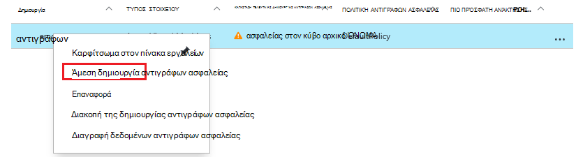
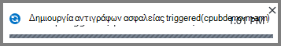
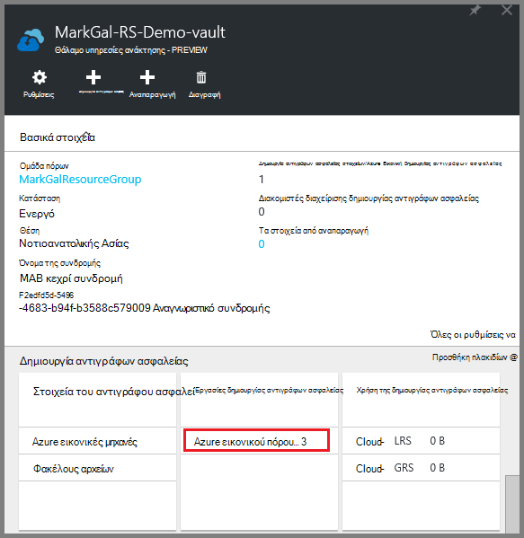
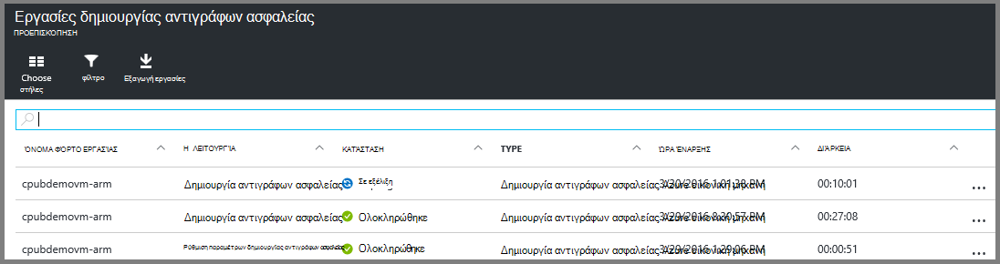

<properties
    pageTitle="Δημιουργία αντιγράφων ασφαλείας ΣΠΣ Azure σε ένα θάλαμο υπηρεσίες ανάκτησης | Microsoft Azure"
    description="Ανακαλύψτε, καταχώρηση και δημιουργία αντιγράφων ασφαλείας Azure εικονικές μηχανές σε ένα θάλαμο υπηρεσίες ανάκτησης με αυτές τις διαδικασίες για δημιουργία αντιγράφων ασφαλείας Azure εικονική μηχανή."
    services="backup"
    documentationCenter=""
    authors="markgalioto"
    manager="cfreeman"
    editor=""
    keywords="εικονική μηχανή αντίγραφο ασφαλείας. Δημιουργία αντιγράφου ασφαλείας εικονική μηχανή; Δημιουργία αντιγράφων ασφαλείας και καταστροφή αποκατάστασης; Δημιουργία αντιγράφων ασφαλείας εικονική ARM"/>

<tags
    ms.service="backup"
    ms.workload="storage-backup-recovery"
    ms.tgt_pltfrm="na"
    ms.devlang="na"
    ms.topic="article"
    ms.date="07/29/2016"
    ms.author="trinadhk; jimpark; markgal;"/>

# Δημιουργήστε αντίγραφα ασφαλείας ΣΠΣ Azure σε ένα θάλαμο υπηρεσίες ανάκτησης

> [AZURE.SELECTOR]
- [Δημιουργήστε αντίγραφα ασφαλείας ΣΠΣ σε θάλαμο υπηρεσίες ανάκτησης](backup-azure-arm-vms.md)
- [Δημιουργήστε αντίγραφα ασφαλείας ΣΠΣ σε θάλαμο δημιουργίας αντιγράφων ασφαλείας](backup-azure-vms.md)

Σε αυτό το άρθρο παρέχει τη διαδικασία για τη δημιουργία αντιγράφων ασφαλείας ΣΠΣ Azure (αναπτυχθεί από διαχειριστή πόρων και αναπτυχθεί κλασική) σε ένα θάλαμο υπηρεσίες ανάκτησης. Το μεγαλύτερο μέρος της εργασίας δημιουργίας αντιγράφων ασφαλείας των ΣΠΣ τίθεται σε την προετοιμασία. Πριν να δημιουργήσετε αντίγραφα ασφαλείας ή να προστατεύσετε μια Εικονική, πρέπει να ολοκληρώσετε τις [προϋποθέσεις](backup-azure-arm-vms-prepare.md) για να προετοιμάσετε το περιβάλλον σας για την προστασία σας ΣΠΣ. Αφού ολοκληρώσετε τις προϋποθέσεις, στη συνέχεια, μπορείτε να ξεκινήσετε τη δημιουργία αντιγράφων ασφαλείας λειτουργία στιγμιότυπα σας Εικονική.

>[AZURE.NOTE] Azure περιλαμβάνει δύο μοντέλων ανάπτυξης για τη δημιουργία και εργασία με πόρους: [Διαχείριση πόρων και κλασική](../resource-manager-deployment-model.md). Μπορείτε να προστατεύσετε ΣΠΣ αναπτυχθεί από διαχειριστή πόρων και κλασική ΣΠΣ με υπηρεσίες ανάκτησης χώροι φύλαξης. Ανατρέξτε στο θέμα [Δημιουργία αντιγράφων ασφαλείας Azure εικονικές μηχανές](backup-azure-vms.md) για λεπτομέρειες σχετικά με την εργασία με το μοντέλο ανάπτυξης κλασική ΣΠΣ.

Για περισσότερες πληροφορίες, ανατρέξτε στα άρθρα σε [σχεδιασμό υποδομή αντιγράφου ασφαλείας σας Εικονική στο Azure](backup-azure-vms-introduction.md) και [Azure εικονικές μηχανές](https://azure.microsoft.com/documentation/services/virtual-machines/).

## Ενεργοποίηση πίσω ένα έργο

Η δημιουργία αντιγράφων ασφαλείας πολιτικής που σχετίζονται με το θάλαμο υπηρεσίες ανάκτησης, καθορίζει τη συχνότητα και όταν εκτελείται η λειτουργία δημιουργίας αντιγράφων ασφαλείας. Από προεπιλογή, το πρώτο προγραμματισμένη δημιουργία αντιγράφων ασφαλείας είναι το αρχικό αντίγραφο ασφαλείας. Μέχρι να παρουσιάζεται το αρχικό αντίγραφο ασφαλείας, εμφανίζεται η τελευταία κατάσταση αντιγράφου ασφαλείας σε το blade **Εργασιών δημιουργίας αντιγράφων ασφαλείας** , ως **Προειδοποίηση (αρχικό αντίγραφα ασφαλείας σε εκκρεμότητα)**.

Εκτός εάν το αρχικό αντίγραφο ασφαλείας είναι παράδοσης για να ξεκινήσει η πολύ σύντομα, συνιστάται να εκτελέσετε **Δημιουργία αντιγράφου ασφαλείας τώρα**. Η παρακάτω διαδικασία ξεκινά από τον πίνακα εργαλείων θάλαμο. Αυτή η διαδικασία χρησιμοποιείται για την εκτέλεση του αρχικού εργασίας δημιουργίας αντιγράφων ασφαλείας, αφού έχετε ολοκληρώσει όλες τις προϋποθέσεις. Εάν έχει ήδη εκτελεστεί το αρχικό εργασίας δημιουργίας αντιγράφων ασφαλείας, αυτή η διαδικασία δεν είναι διαθέσιμη. Η συσχετισμένη πολιτική αντιγράφου ασφαλείας καθορίζει την επόμενη εργασία αντιγράφου ασφαλείας.  

Για να εκτελέσετε το αρχικό εργασίας δημιουργίας αντιγράφων ασφαλείας:

1. Στον πίνακα εργαλείων θάλαμο, στο πλακίδιο **αντίγραφο ασφαλείας** , κάντε κλικ στην επιλογή **εικονικές μηχανές Windows Azure**.  
    

    Ανοίγει το blade **Στοιχεία δημιουργίας αντιγράφων ασφαλείας** .

2. Στην το blade **Στοιχεία αντίγραφο ασφαλείας** , κάντε δεξί κλικ το θάλαμο που θέλετε να δημιουργήσετε αντίγραφα ασφαλείας και κάντε κλικ στην επιλογή **Άμεση δημιουργία αντιγράφων ασφαλείας**.

    

    Ενεργοποίηση της εργασίας δημιουργίας αντιγράφων ασφαλείας.  

    

3. Για να δείτε ότι το αρχικό δημιουργία αντιγράφων ασφαλείας ολοκληρώθηκε, στον πίνακα εργαλείων θάλαμο, στο παράθυρο **Εργασιών δημιουργίας αντιγράφων ασφαλείας** , κάντε κλικ στην επιλογή **Azure εικονικές μηχανές**.

    

    Ανοίγει το blade εργασιών δημιουργίας αντιγράφων ασφαλείας.

4. Στο το blade **εργασιών δημιουργίας αντιγράφων ασφαλείας** , μπορείτε να δείτε την κατάσταση όλων των έργων.

    

    >[AZURE.NOTE] Ως μέρος της λειτουργίας δημιουργίας αντιγράφων ασφαλείας, την υπηρεσία Azure αντιγράφου ασφαλείας θέματα μια εντολή για την επέκταση αντιγράφου ασφαλείας σε κάθε εικονική μηχανή εκκένωση όλες οι εγγραφές και να λάβετε ένα στιγμιότυπο συνεπή.

    Όταν ολοκληρώσετε την εργασία αντιγράφου ασφαλείας, η κατάσταση είναι *ολοκληρώθηκε*.

## Αντιμετώπιση σφαλμάτων
Εάν αντιμετωπίσετε προβλήματα κατά τη δημιουργία αντιγράφων ασφαλείας σας εικονική μηχανή, ανατρέξτε στο [άρθρο αντιμετώπισης προβλημάτων Εικονική](backup-azure-vms-troubleshoot.md) για βοήθεια.

## Επόμενα βήματα

Τώρα που έχετε προστατεύεται σας Εικονική, ανάληψη ελέγχου στα ακόλουθα άρθρα για εργασίες διαχείρισης επιπλέον, μπορείτε να κάνετε με το ΣΠΣ, καθώς και τον τρόπο επαναφοράς ΣΠΣ.

- [Διαχείριση και την παρακολούθηση σας εικονικές μηχανές](backup-azure-manage-vms.md)
- [Επαναφορά εικονικές μηχανές](backup-azure-arm-restore-vms.md)
