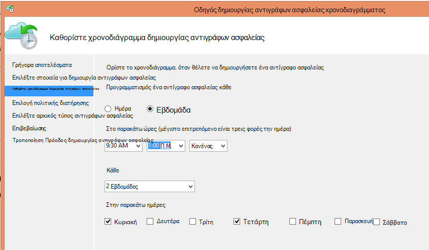

<properties
   pageTitle="Χρησιμοποιήστε Azure δημιουργίας αντιγράφων ασφαλείας για να αντικαταστήσετε την υποδομή ταινία σας | Microsoft Azure"
   description="Μάθετε τον τρόπο δημιουργίας αντιγράφων ασφαλείας Azure παρέχει σημασιολογία μοιάζει με ταινία που σας επιτρέπει να αντιγράφων ασφαλείας και επαναφοράς δεδομένων στο Azure"
   services="backup"
   documentationCenter=""
   authors="trinadhk"
   manager="vijayts"
   editor=""/>
<tags
   ms.service="backup"
   ms.devlang="na"
   ms.topic="article"
   ms.tgt_pltfrm="na"
   ms.workload="storage-backup-recovery"
   ms.date="09/27/2016"
   ms.author="jimpark;trinadhk;markgal"/>

# Χρησιμοποιήστε Azure δημιουργίας αντιγράφων ασφαλείας για να αντικαταστήσετε την υποδομή ταινία σας

Να Azure πελάτες δημιουργίας αντιγράφων ασφαλείας και διαχείριση προστασίας δεδομένων κέντρου συστήματος:

- Δημιουργήστε αντίγραφα ασφαλείας δεδομένων σε χρονοδιαγράμματα που εξυπηρετούν καλύτερα το ανάγκες της εταιρείας σας.
- Διατηρούνται τα δεδομένα αντιγράφου ασφαλείας για μεγαλύτερα χρονικά διαστήματα
- Κάντε Azure μέρος τους μακροπρόθεσμη διατήρηση χρειάζεται (αντί για ταινία).

Σε αυτό το άρθρο εξηγεί πώς οι πελάτες να ενεργοποιήσετε δημιουργίας αντιγράφων ασφαλείας και πολιτικές διατήρησης. Οι πελάτες που χρησιμοποιούν ταινίες διεύθυνση τους μεγάλων-μακροπρόθεσμη-διατήρησης πρέπει τώρα να έχετε μια εναλλακτική λύση ισχυρές και βιώσιμη με τη διαθεσιμότητα αυτής της δυνατότητας. Η δυνατότητα είναι ενεργοποιημένη στην πιο πρόσφατη έκδοση του αντιγράφου ασφαλείας Azure (που είναι διαθέσιμη [εδώ](http://aka.ms/azurebackup_agent)). Κέντρο του συστήματος DPM πελάτες πρέπει να ενημερώσετε, τουλάχιστον, DPM 2012 R2 UR5 πριν από τη χρήση DPM με την υπηρεσία Azure δημιουργίας αντιγράφων ασφαλείας.

## Τι είναι το χρονοδιάγραμμα δημιουργίας αντιγράφων ασφαλείας;
Το χρονοδιάγραμμα αντιγράφων ασφαλείας υποδεικνύει τη συχνότητα της λειτουργίας δημιουργίας αντιγράφων ασφαλείας. Για παράδειγμα, οι ρυθμίσεις στην παρακάτω οθόνη υποδεικνύουν ότι έχουν ληφθεί αντίγραφα ασφαλείας καθημερινά στις 6 μμ και τα μεσάνυχτα.

Οι πελάτες μπορούν να προγραμματίζουν επίσης ένα εβδομαδιαίο αντίγραφο ασφαλείας. Για παράδειγμα, οι ρυθμίσεις στην παρακάτω οθόνη υποδεικνύουν ότι αντίγραφα ασφαλείας λαμβάνονται κάθε εναλλακτική Κυριακή & Τετάρτη στο 9:30 πμ και 1:00 Μ.Μ.

## Τι είναι η πολιτική διατήρησης;
Η πολιτική διατήρησης Καθορίζει τη διάρκεια για την οποία πρέπει να αποθηκευτεί το αντίγραφο ασφαλείας. Και όχι μόνο καθορίζοντας μια "επίπεδο πολιτική" για όλα τα σημεία αντιγράφου ασφαλείας, οι πελάτες να καθορίσετε οι πολιτικές διατήρησης διαφορετική βάση όταν ορίζεται ως το αντίγραφο ασφαλείας. Για παράδειγμα, το σημείο δημιουργίας αντιγράφων ασφαλείας που λαμβάνονται καθημερινά, που λειτουργεί ως ένα σημείο λειτουργικές ανάκτησης, διατηρείται για 90 ημέρες. Το σημείο δημιουργίας αντιγράφων ασφαλείας που λαμβάνονται στο τέλος του τριμήνου για σκοπούς ελέγχου διατηρείται για μεγαλύτερο χρονικό διάστημα.

Το συνολικό πλήθος σημείων"διατήρησης" που καθορίζονται σε αυτή την πολιτική είναι 90 (Ημερήσια σημεία) + 40 (μία κάθε τριμήνου για 10 ετών) = 130.

## Παράδειγμα – τοποθέτηση και τα δύο μαζί

1. **Ημερήσιο πολιτικής διατήρησης**: δημιουργία αντιγράφων ασφαλείας πραγματοποιήθηκε καθημερινά αποθηκεύονται για επτά ημέρες.
2. **Εβδομαδιαίο πολιτικής διατήρησης**: δημιουργία αντιγράφων ασφαλείας πραγματοποιήθηκε κάθε μέρα στις τα μεσάνυχτα και 6 μμ Σάββατο διατηρούνται για τεσσάρων εβδομάδων
3. **Μηνιαίο πολιτικής διατήρησης**: δημιουργία αντιγράφων ασφαλείας που λαμβάνονται στο τα μεσάνυχτα και 6 μμ του τελευταίου Σαββάτου κάθε μήνα διατηρούνται για 12 μήνες
4. **Ετήσιο πολιτικής διατήρησης**: δημιουργία αντιγράφων ασφαλείας που λαμβάνονται τα μεσάνυχτα του τελευταίου Σαββάτου του κάθε Μαρτίου διατηρούνται για 10 ετών

Ο συνολικός αριθμός των "διατήρησης σημείων" (σημεία από την οποία ένας πελάτης να τον επαναφέρετε δεδομένων) στο παραπάνω διάγραμμα υπολογίζεται ως εξής:

- δύο σημεία ανά ημέρα για επτά ημέρες = 14 σημεία ανάκτησης
- δύο σημεία ανά εβδομάδα για τέσσερις εβδομάδες = 8 σημεία ανάκτησης
- δύο σημεία ανά μήνα για 12 μήνες = 24 σημεία ανάκτησης
- ένα σημείο ανά έτος ανά αποκατάστασης 10 ετών = 10 σημείων

Ο συνολικός αριθμός των σημείων αποκατάστασης είναι 56.

> [AZURE.NOTE] Azure δημιουργίας αντιγράφων ασφαλείας δεν διαθέτει έναν περιορισμό στον αριθμό των σημείων αποκατάστασης.

## Ρύθμιση παραμέτρων για προχωρημένους
Κάνοντας κλικ στην επιλογή **Τροποποίηση** στην προηγούμενη οθόνη, οι πελάτες έχουν περαιτέρω ευελιξία στον καθορισμό χρονοδιαγράμματα διατήρησης.

## Επόμενα βήματα
Για περισσότερες πληροφορίες σχετικά με τη δημιουργία αντιγράφων ασφαλείας Azure, ανατρέξτε στα θέματα:

- [Εισαγωγή στις Azure δημιουργίας αντιγράφων ασφαλείας](backup-introduction-to-azure-backup.md)
- [Δοκιμάστε Azure δημιουργίας αντιγράφων ασφαλείας](backup-try-azure-backup-in-10-mins.md)
