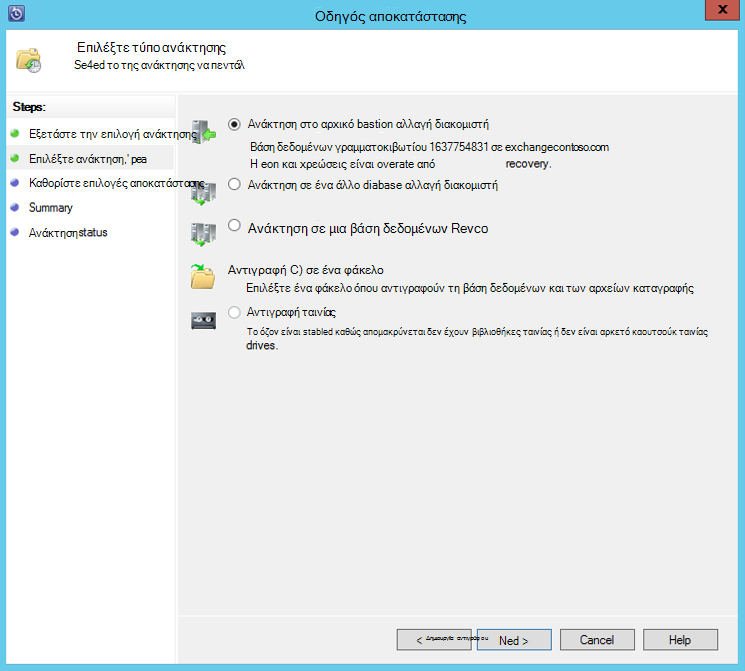

<properties
    pageTitle="Δημιουργία αντιγράφων ασφαλείας διακομιστή του Exchange για Azure αντίγραφο ασφαλείας με το σύστημα κέντρο 2012 R2 DPM | Microsoft Azure"
    description="Μάθετε πώς μπορείτε να δημιουργήσετε αντίγραφα ασφαλείας σε διακομιστή Exchange σε αντίγραφο ασφαλείας Azure χρησιμοποιώντας σύστημα κέντρο 2012 R2 DPM"
    services="backup"
    documentationCenter=""
    authors="MaanasSaran"
    manager="NKolli1"
    editor=""/>

<tags
    ms.service="backup"
    ms.workload="storage-backup-recovery"
    ms.tgt_pltfrm="na"
    ms.devlang="na"
    ms.topic="article"
    ms.date="08/15/2016"
    ms.author="anuragm;jimpark;delhan;trinadhk;markgal"/>

# Δημιουργία αντιγράφου ασφαλείας ενός διακομιστή Exchange για να Azure αντίγραφο ασφαλείας με το σύστημα κέντρο 2012 R2 DPM
Σε αυτό το άρθρο περιγράφει τον τρόπο ρύθμισης παραμέτρων ενός διακομιστή συστήματος κέντρο 2012 R2 δεδομένων προστασίας Manager (DPM) για δημιουργία αντιγράφου ασφαλείας Microsoft Exchange server Azure δημιουργίας αντιγράφων ασφαλείας.  

## Ενημερώσεις
Για να καταχωρήσετε με επιτυχία το διακομιστή DPM με αντίγραφα ασφαλείας Azure, πρέπει να εγκαταστήσετε την πιο πρόσφατη ενημέρωση ενημερώσεων για το σύστημα κέντρο 2012 R2 DPM και την πιο πρόσφατη έκδοση του Azure παράγοντα δημιουργίας αντιγράφων ασφαλείας. Λάβετε την πιο πρόσφατη ενημέρωση ενημερώσεων από τον [Κατάλογο της Microsoft](http://catalog.update.microsoft.com/v7/site/Search.aspx?q=System%20Center%202012%20R2%20Data%20protection%20manager).

>[AZURE.NOTE] Για τα παραδείγματα σε αυτό το άρθρο, 2.0.8719.0 τον παράγοντα αντιγράφων ασφαλείας Azure εγκαταστήσει και συνάθροιση ενημερώσεων 6 είναι εγκατεστημένο στο σύστημα κέντρου 2012 R2 DPM.

## Προαπαιτούμενα στοιχεία
Πριν να συνεχίσετε, βεβαιωθείτε ότι πληρούνται όλες τις [προϋποθέσεις](backup-azure-dpm-introduction.md#prerequisites) για τη χρήση αντίγραφο ασφαλείας του Microsoft Azure για την προστασία φόρτους εργασίας. Αυτές οι προϋποθέσεις περιλαμβάνουν τα εξής:

- Έχει δημιουργηθεί ένα αντίγραφο ασφαλείας θάλαμο στην τοποθεσία του Azure.
- Παράγοντας και θάλαμο διαπιστευτήρια έχει γίνει λήψη στο διακομιστή DPM.
- Ο παράγοντας έχει εγκατασταθεί στο διακομιστή DPM.
- Για να καταχωρήσετε το διακομιστή DPM χρησιμοποιήθηκαν τα διαπιστευτήρια θάλαμο.
- Εάν προστατεύετε Exchange 2016, αναβαθμίστε σε DPM 2012 R2 UR9 ή νεότερη έκδοση

## DPM παράγοντα προστασίας  
Για να εγκαταστήσετε τον παράγοντα προστασίας DPM στο διακομιστή του Exchange, ακολουθήστε τα παρακάτω βήματα:

1. Βεβαιωθείτε ότι τα τείχη προστασίας έχουν ρυθμιστεί σωστά. Ανατρέξτε στο θέμα [Ρύθμιση παραμέτρων εξαιρέσεων τείχους προστασίας για τον παράγοντα](https://technet.microsoft.com/library/Hh758204.aspx).

2. Εγκατάσταση τον παράγοντα στο διακομιστή του Exchange, κάνοντας κλικ στην επιλογή **διαχείρισης > παράγοντες > εγκατάσταση** στην κονσόλα διαχειριστή DPM. Για λεπτομερείς οδηγίες, ανατρέξτε στο θέμα [εγκατάσταση τον παράγοντα προστασίας DPM](https://technet.microsoft.com/library/hh758186.aspx?f=255&MSPPError=-2147217396) .

## Δημιουργία μιας ομάδας προστασίας για τον Exchange server

1. Στην κονσόλα διαχειριστή DPM, κάντε κλικ στην επιλογή **προστασία**και, στη συνέχεια, κάντε κλικ στην επιλογή **Δημιουργία** στην κορδέλα εργαλείων για να ανοίξετε τον οδηγό **Δημιουργία νέας ομάδας προστασίας** .

2. Στην οθόνη **υποδοχής** του οδηγού, κάντε κλικ στο κουμπί **Επόμενο**.

3. Στην οθόνη **επιλέξτε Τύπος προστασίας ομάδας** , επιλέξτε **τους διακομιστές** και κάντε κλικ στο κουμπί **Επόμενο**.

4. Επιλέξτε τη βάση δεδομένων του Exchange server που θέλετε να προστατεύσετε και κάντε κλικ στο κουμπί **Επόμενο**.

    >[AZURE.NOTE] Εάν προστασία Exchange 2013, ελέγξτε τις [προϋποθέσεις Exchange 2013](https://technet.microsoft.com/library/dn751029.aspx).

    Στο παρακάτω παράδειγμα, η βάση δεδομένων του Exchange 2010 είναι επιλεγμένο.

    

5. Επιλέξτε τη μέθοδο προστασίας δεδομένων.

    Δώστε ένα όνομα στην ομάδα προστασία και, στη συνέχεια, επιλέξτε και τα δύο από τις ακόλουθες επιλογές:

    - Θέλω μικρής διάρκειας προστασία με χρήση του δίσκου.
    - Θέλω online protection.

6. Κάντε κλικ στο κουμπί **Επόμενο**.

7. Ενεργοποιήστε την επιλογή **Eseutil εκτέλεση για να ελέγξετε την ακεραιότητα δεδομένων** , εάν θέλετε να ελέγξετε την ακεραιότητα από τις βάσεις δεδομένων του Exchange Server.

    Αφού επιλέξετε αυτήν την επιλογή, ελέγχου θα εκτελείται στο διακομιστή DPM για να αποφύγετε την κίνηση εισόδου/εξόδου που δημιουργείται από την εκτέλεση της εντολής **eseutil** στο διακομιστή του Exchange συνέπειας της δημιουργίας αντιγράφων ασφαλείας.

    >[AZURE.NOTE]Για να χρησιμοποιήσετε αυτήν την επιλογή, θα πρέπει να αντιγράψετε τα αρχεία Ese.dll και Eseutil.exe στον κατάλογο C:\Program Files\Microsoft συστήματος κέντρο 2012 R2\DPM\DPM\bin στο διακομιστή DPM. Διαφορετικά, ενεργοποιείται το ακόλουθο σφάλμα:  
    

8. Κάντε κλικ στο κουμπί **Επόμενο**.

9. Επιλέξτε τη βάση δεδομένων για **Αντίγραφα ασφαλείας**και, στη συνέχεια, κάντε κλικ στο κουμπί **Επόμενο**.

    >[AZURE.NOTE] Εάν δεν επιλέξετε "Πλήρες αντίγραφο ασφαλείας" για τουλάχιστον μία DAG αντίγραφο της βάσης δεδομένων, δεν θα περικοπεί αρχεία καταγραφής.

10. Ρυθμίστε τις παραμέτρους τους στόχους για **μικρής διάρκειας δημιουργίας αντιγράφων ασφαλείας**και, στη συνέχεια, κάντε κλικ στο κουμπί **Επόμενο**.

11. Ελέγξτε το διαθέσιμο χώρο στο δίσκο και, στη συνέχεια, κάντε κλικ στο κουμπί **Επόμενο**.

12. Επιλέξτε την ώρα κατά την οποία ο διακομιστής DPM θα δημιουργήσετε το αρχικό αναπαραγωγής και, στη συνέχεια, κάντε κλικ στο κουμπί **Επόμενο**.

13. Επιλέξτε τις επιλογές ελέγχου συνέπειας και, στη συνέχεια, κάντε κλικ στο κουμπί **Επόμενο**.

14. Επιλέξτε τη βάση δεδομένων που θέλετε να δημιουργήσετε αντίγραφα ασφαλείας σε Azure και, στη συνέχεια, κάντε κλικ στο κουμπί **Επόμενο**. Για παράδειγμα:

    

15. Ορισμός του χρονοδιαγράμματος για **Azure δημιουργίας αντιγράφων ασφαλείας**και, στη συνέχεια, κάντε κλικ στο κουμπί **Επόμενο**. Για παράδειγμα:

    

    >[AZURE.NOTE] Σημείωση σημεία Online αποκατάστασης βασίζονται στις express πλήρης σημεία αποκατάστασης. Γι ' αυτό, πρέπει να μπορείτε να προγραμματίσετε το σημείο online αποκατάστασης μετά την ώρα που έχει καθοριστεί για την πλήρη express αποκατάστασης σημείο.

16. Ρύθμιση παραμέτρων της πολιτικής διατήρησης για το **Azure δημιουργίας αντιγράφων ασφαλείας**και, στη συνέχεια, κάντε κλικ στο κουμπί **Επόμενο**.

17. Ενεργοποιήστε μια επιλογή online αναπαραγωγής και κάντε κλικ στο κουμπί **Επόμενο**.

    Εάν έχετε μια μεγάλη βάση δεδομένων, μπορεί να χρειαστούν μεγάλο χρονικό διάστημα για το αρχικό αντίγραφο ασφαλείας σε δημιουργηθούν μέσω του δικτύου. Για να αποφύγετε αυτό το ζήτημα, μπορείτε να δημιουργήσετε ένα αντίγραφο ασφαλείας χωρίς σύνδεση.  

    

18. Επιβεβαιώστε τις ρυθμίσεις και, στη συνέχεια, κάντε κλικ στην επιλογή **Δημιουργία ομάδας**.

19. Κάντε κλικ στο κουμπί **Κλείσιμο**.

## Ανάκτηση της βάσης δεδομένων του Exchange

1. Για να ανακτήσετε μια βάση δεδομένων του Exchange, κάντε κλικ στην επιλογή **Ανάκτηση** στην κονσόλα διαχειριστή DPM.

2. Εντοπίστε τη βάση δεδομένων του Exchange που θέλετε να ανακτήσετε.

3. Επιλέξτε ένα σημείο online αποκατάστασης από την αναπτυσσόμενη λίστα *χρόνου ανάκτησης* .

4. Κάντε κλικ στην επιλογή " **Ανάκτηση** " για να ξεκινήσετε τον **"Οδηγό αποκατάστασης"**.

Σημεία online ανάκτησης, υπάρχουν πέντε τύποι αποκατάστασης:

- **Ανάκτηση στην αρχική θέση του Exchange Server:** Τα δεδομένα θα ανακτηθούν στον αρχικό διακομιστή Exchange.
- **Ανάκτηση σε μια άλλη βάση δεδομένων σε ένα διακομιστή Exchange:** Τα δεδομένα θα ανακτηθούν σε μια άλλη βάση δεδομένων σε άλλον διακομιστή του Exchange.
- **Ανάκτηση σε μια βάση δεδομένων αποκατάστασης:** Τα δεδομένα θα ανακτηθούν σε μια βάση δεδομένων αποκατάστασης Exchange (RDB).
- **Αντιγραφή σε φάκελο δικτύου:** Τα δεδομένα θα ανακτηθούν σε έναν φάκελο δικτύου.
- **Αντιγραφή σε ταινία:** Εάν έχετε μια βιβλιοθήκη ταινιών ή μια αυτόνομη μονάδα ταινίας επισυναφθεί και ρυθμιστεί στο διακομιστή DPM, το σημείο αποκατάστασης θα αντιγραφούν σε μια δωρεάν ταινία.

    

## Επόμενα βήματα

- [Συνήθεις Ερωτήσεις ασφαλείας για Azure](backup-azure-backup-faq.md)
