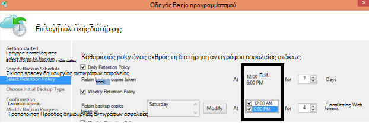

<properties
   pageTitle="Συνήθεις Ερωτήσεις ασφαλείας για Azure | Microsoft Azure"
   description="Απαντήσεις σε συνήθεις ερωτήσεις σχετικά με την υπηρεσία δημιουργίας αντιγράφων ασφαλείας, παράγοντα αντιγράφων ασφαλείας, δημιουργία αντιγράφων ασφαλείας και διατήρησης, ανάκτησης, ασφάλεια και άλλες συνήθεις ερωτήσεις σχετικά με τη δημιουργία αντιγράφων ασφαλείας και καταστροφή αποκατάστασης."
   services="backup"
   documentationCenter=""
   authors="markgalioto"
   manager="jwhit"
   editor=""
   keywords="Δημιουργία αντιγράφων ασφαλείας και καταστροφή αποκατάστασης; υπηρεσίας δημιουργίας αντιγράφων ασφαλείας"/>

<tags
   ms.service="backup"
   ms.workload="storage-backup-recovery"
     ms.tgt_pltfrm="na"
     ms.devlang="na"
     ms.topic="get-started-article"
     ms.date="10/21/2016"
     ms.author="trinadhk; giridham; arunak; markgal; jimpark;"/>

# <a name="azure-backup-service--faq"></a>Azure υπηρεσίας δημιουργίας αντιγράφων ασφαλείας-συνήθεις Ερωτήσεις


Σε αυτό το άρθρο είναι μια λίστα με τις συνήθεις ερωτήσεις (και τις αντίστοιχες απαντήσεις) σχετικά με την υπηρεσία Azure δημιουργίας αντιγράφων ασφαλείας. Μας Κοινότητας απαντήσεις γρήγορα, και θα σας εάν μια ερώτηση είναι ζητηθεί συχνά, προσθέστε σε αυτό το άρθρο. Οι απαντήσεις σε ερωτήσεις παρέχουν αναφορά συνήθως ή πληροφορίες υποστήριξης. Μπορείτε να υποβάλετε ερωτήσεις σχετικά με τη δημιουργία αντιγράφων ασφαλείας Azure στην ενότητα Disqus σε αυτό το άρθρο ή ένα σχετικό άρθρο. Μπορείτε επίσης να δημοσιεύσετε ερωτήσεις σχετικά με την υπηρεσία Azure δημιουργίας αντιγράφων ασφαλείας στο [φόρουμ συζήτησης](https://social.msdn.microsoft.com/forums/azure/home?forum=windowsazureonlinebackup).


## <a name="what-is-the-list-of-supported-operating-systems-from-which-i-can-back-up-to-azure-using-azure-backup-br"></a>Τι είναι η λίστα των υποστηριζόμενα λειτουργικά συστήματα, από την οποία να μπορούν να δημιουργήσετε αντίγραφα ασφαλείας σε Azure χρησιμοποιώντας Azure αντίγραφο ασφαλείας; <br/>
Azure δημιουργίας αντιγράφων ασφαλείας υποστηρίζει η παρακάτω λίστα λειτουργικών συστημάτων για φάκελο αρχείων δημιουργίας αντιγράφων ασφαλείας, εφαρμογή δημιουργίας αντιγράφων ασφαλείας με χρήση αντιγράφων ασφαλείας διακομιστή Azure και SCDPM.

| Λειτουργικό σύστημα        | Πλατφόρμα           | SKU  |
| :------------- |-------------| :-----|
| Windows 8 και πιο πρόσφατη SP      | 64 bit | Για μεγάλες επιχειρήσεις, Pro |
| Windows 7 και πιο πρόσφατη SP      | 64 bit | Ultimate, μεγάλες επιχειρήσεις, Professional, Premium για οικιακή χρήση, Home Basic, Starter |
| Windows 8.1 και πιο πρόσφατη SP | 64 bit      |    Για μεγάλες επιχειρήσεις, Pro |
| Windows 10      | 64 bit | Για μεγάλες επιχειρήσεις, Pro, Home |
|Windows Server 2012 R2 και πιο πρόσφατη SP| 64 bit| Πρότυπο, το κέντρο δεδομένων, Foundation|
|Windows Server 2012 και πιο πρόσφατη SP|    64 bit| Πρότυπο κέντρου δεδομένων, Foundation,|
|Windows αποθήκευσης Server 2012 R2 και πιο πρόσφατη SP  |64 bit|    Πρότυπο "," ομάδα εργασίας|
|Χώρος αποθήκευσης Windows Server 2012 και πιο πρόσφατη SP |64 bit |Πρότυπο "," ομάδα εργασίας
|Windows Server 2012 R2 και πιο πρόσφατη SP  |64 bit|    Βασικές|
|Windows Server 2008 R2 SP1 |64 bit|    Τυπική, μεγάλες επιχειρήσεις, κέντρο δεδομένων, Foundation|
|Windows Server 2008 SP2    |64 bit|    Τυπική, μεγάλες επιχειρήσεις, κέντρο δεδομένων, Foundation|

Για το αντίγραφο ασφαλείας Εικονική Azure,

- **Linux**: Azure δημιουργίας αντιγράφων ασφαλείας υποστηρίζει [μια λίστα διανομής που έχουν γίνει δεκτοί από Azure](../virtual-machines/virtual-machines-linux-endorsed-distros.md) εκτός από τις βασικές λειτουργικό σύστημα Linux.  Επίσης άλλες κατανομές μεταφορά-σας-κάτοχος-Linux ενδέχεται να λειτουργούν με την προϋπόθεση ότι ο παράγοντας Εικονική είναι διαθέσιμο στον υπολογιστή εικονικές και η υποστήριξη για Python υπάρχει.
- **Windows Server**: εκδόσεις παλαιότερων από Windows Server 2008 R2 δεν υποστηρίζονται.

## <a name="where-can-i-download-the-latest-azure-backup-agent-br"></a>Πού μπορώ να κάνω λήψη του τελευταίου agent Azure δημιουργίας αντιγράφων ασφαλείας; <br/>
Μπορείτε να κάνετε λήψη του τελευταίου agent δημιουργίας αντιγράφων ασφαλείας των Windows Server, DPM κέντρο συστήματος ή προγράμματος-πελάτη των Windows, από [εδώ](http://aka.ms/azurebackup_agent). Εάν θέλετε να δημιουργήσετε αντίγραφα ασφαλείας μια εικονική μηχανή, χρησιμοποιήστε τον παράγοντα Εικονική (το οποίο εγκαθιστά αυτόματα την κατάλληλη επέκταση). Ο παράγοντας Εικονική υπάρχει ήδη σε εικονικές μηχανές που δημιουργήθηκε από τη συλλογή Azure.

## <a name="which-version-of-scdpm-server-is-supported-br"></a>Ποια έκδοση του διακομιστή SCDPM υποστηρίζεται; <br/>
Συνιστάται να εγκαταστήσετε την [πιο πρόσφατη](http://aka.ms/azurebackup_agent) παράγοντας Azure Backup στην πιο πρόσφατη ενημέρωση συνάθροιση της SCDPM (UR11 φετινά Αυγούστου 2016)

## <a name="when-configuring-the-azure-backup-agent-i-am-prompted-to-enter-the-vault-credentials-do-vault-credentials-expire"></a>Όταν ρυθμίζετε τις παραμέτρους τον παράγοντα Azure αντίγραφο ασφαλείας, μου γίνεται προτροπή για να εισαγάγετε τα διαπιστευτήρια θάλαμο. Λήγουν θάλαμο διαπιστευτήρια;
Ναι, τα διαπιστευτήρια θάλαμο λήγουν μετά από 48 ώρες. Εάν το αρχείο λήξει, συνδεθείτε στην πύλη του Azure και κάντε λήψη των αρχείων διαπιστευτήρια θάλαμο από θάλαμο σας.

## <a name="is-there-any-limit-on-the-number-of-vaults-that-can-be-created-in-each-azure-subscription-br"></a>Υπάρχει οποιαδήποτε όριο στον αριθμό των χώροι φύλαξης που μπορούν να δημιουργηθούν σε κάθε Azure συνδρομή; <br/>
Ναι. Το Σεπτεμβρίου 2016, μπορείτε να δημιουργήσετε 25 χώροι φύλαξης αντιγράφων ασφαλείας ανά συνδρομή. Μπορείτε να δημιουργήσετε έως 25 χώροι φύλαξης υπηρεσίες ανάκτησης ανά κάθε υποστηριζόμενη περιοχή Azure αντιγράφων ασφαλείας ανά συνδρομή. Εάν χρειάζεστε περισσότερες χώροι φύλαξης, στη συνέχεια, δημιουργήστε μια νέα συνδρομή.

## <a name="are-there-any-limits-on-the-number-of-serversmachines-that-can-be-registered-against-each-vault-br"></a>Υπάρχουν τυχόν όρια στον αριθμό των διακομιστών/μηχανές που μπορεί να έχει εγγραφεί σε σχέση με κάθε θάλαμο; <br/>
Ναι, μπορείτε να καταχωρήσετε έως και 50 μηχανές ανά θάλαμο. Για Azure IaaS εικονικές μηχανές, το όριο είναι 200 ΣΠΣ ανά θάλαμο. Εάν πρέπει να καταχωρήσετε περισσότερες μηχανές, δημιουργήστε μια νέα θάλαμο.

## <a name="how-do-i-register-my-server-to-another-datacenterbr"></a>Πώς μπορώ να εγγραφών ο διακομιστής με μια άλλη κέντρο δεδομένων;<br/>
Δεδομένα αντιγράφου ασφαλείας αποστέλλεται με το κέντρο δεδομένων από το θάλαμο στον οποίο έχει καταχωρηθεί. Ο ευκολότερος τρόπος για να αλλάξετε το κέντρο δεδομένων είναι να καταργήσετε την εγκατάσταση του τον παράγοντα και επανεγκατάσταση τον παράγοντα και καταχώρηση σε μια νέα θάλαμο που ανήκει σε επιθυμητή κέντρου δεδομένων.

## <a name="what-happens-if-i-rename-a-windows-server-that-is-backing-up-data-to-azurebr"></a>Τι συμβαίνει εάν μετονομάσω Windows server που δημιουργείτε αντίγραφα ασφαλείας δεδομένων Azure;<br/>
Όταν μετονομάζετε ένα διακομιστή, τερματίζονται όλα τα αντίγραφα ασφαλείας έχει ρυθμιστεί προς το παρόν.
Πρέπει να καταχωρήσετε το νέο όνομα του διακομιστή με τη δημιουργία αντιγράφων ασφαλείας θάλαμο. Όταν δημιουργείτε μια νέα εγγραφή, την πρώτη λειτουργία δημιουργίας αντιγράφων ασφαλείας είναι ένα πλήρες αντίγραφο ασφαλείας και όχι ένα προσαύξησης. Εάν χρειάζεστε για να ανακτήσετε δεδομένα που ήταν προηγουμένως αντίγραφα ασφαλείας για να το θάλαμο με το παλιό όνομα διακομιστή, μπορείτε να ανακτήσετε δεδομένα χρησιμοποιώντας την επιλογή [**άλλο διακομιστή**](backup-azure-restore-windows-server.md#recover-to-an-alternate-machine) στον οδηγό **Ανάκτηση δεδομένων** .

## <a name="what-types-of-drives-can-i-backup-files-and-folders-from-br"></a>Ποιοι τύποι των μονάδων να να δημιουργήσετε αντίγραφο ασφαλείας αρχείων και φακέλων από; <br/>
Το παρακάτω σύνολο των μονάδων δίσκου/όγκους δεν μπορούν να μεταβούν δημιουργίας αντιγράφων ασφαλείας:

- Αφαιρούμενο μέσο αποθήκευσης: Η μονάδα δίσκου πρέπει να αναφέρουν όπως μια σταθερή να χρησιμοποιείται μια προέλευση στοιχείου δημιουργίας αντιγράφων ασφαλείας.
- Μόνο για ανάγνωση όγκους: την ένταση ήχου πρέπει να είναι εγγράψιμο για την ένταση σκιά αντίγραφο υπηρεσία (VSS) στη συνάρτηση.
- Εργασία χωρίς σύνδεση όγκους: Έντασης ήχου πρέπει να είναι online για VSS συνάρτηση.
- Κοινόχρηστο στοιχείο δικτύου: την ένταση ήχου πρέπει να είναι τοπικά στο διακομιστή για δημιουργία αντιγράφων ασφαλείας χρησιμοποιώντας online αντίγραφο ασφαλείας.
- Προστασία BitLocker όγκους: την ένταση ήχου πρέπει να την ξεκλειδώσετε πριν μπορεί να προκύψει το αντίγραφο ασφαλείας.
- Αρχείο συστήματος αναγνώρισης: NTFS είναι το μόνο σύστημα αρχείων που υποστηρίζονται για αυτήν την έκδοση της ηλεκτρονικής υπηρεσίας δημιουργίας αντιγράφων ασφαλείας.

## <a name="what-file-and-folder-types-can-i-back-up-from-my-serverbr"></a>Ποιοι τύποι αρχείων και φακέλων να να δημιουργήσετε αντίγραφα ασφαλείας από το διακομιστή;<br/>
Υποστηρίζονται οι παρακάτω τύποι:

- Κρυπτογράφηση
- Συμπίεση
- Κατακερματισμένο
- Συμπιεσμένο + κατακερματισμένο
- Συνδέσεις υλικού: Δεν υποστηρίζεται, παρακάμφθηκε
- Σημείο νέας ανάλυσης: Δεν υποστηρίζεται, παρακάμφθηκε
- Κρυπτογραφημένα + συμπιέσει: Δεν υποστηρίζεται, παρακάμφθηκε
- Κρυπτογραφημένο + κατακερματισμένο: Δεν υποστηρίζεται, παρακάμφθηκε
- Συμπιεσμένη ροή: Δεν υποστηρίζεται, παρακάμφθηκε
- Κατακερματισμένο ροή: Δεν υποστηρίζεται, παρακάμφθηκε

## <a name="whats-the-minimum-size-requirement-for-the-cache-folder-br"></a>Τι είναι η απαίτηση ελάχιστο μέγεθος για το φάκελο cache; <br/>
Το μέγεθος του φακέλου cache Καθορίζει την ποσότητα των δεδομένων που δημιουργείτε αντίγραφα ασφαλείας. Ο φάκελος προσωρινής μνήμης πρέπει να είναι 5% από το χώρο που απαιτείται για την αποθήκευση δεδομένων.

## <a name="if-my-organization-has-one-vault-how-can-i-isolate-one-servers-data-from-another-server-when-restoring-databr"></a>Εάν η εταιρεία μου έχει ένα θάλαμο, πώς να να απομονώσετε του διακομιστή δεδομένων από έναν άλλο διακομιστή κατά την επαναφορά δεδομένων;<br/>
Όλους τους διακομιστές που έχουν καταχωρηθεί για την ίδια θάλαμο να ανακτήσετε τα δεδομένα που δημιουργούνται αντίγραφα ασφαλείας από άλλους διακομιστές *που χρησιμοποιούν την ίδια φράση πρόσβασης*. Εάν έχετε διακομιστές του οποίου τα δεδομένα αντιγράφου ασφαλείας που θέλετε να απομονώσετε από άλλους διακομιστές της εταιρείας σας, χρησιμοποιήστε μια φράση που έχει οριστεί ως πρόσβασης για αυτούς τους διακομιστές. Για παράδειγμα, οι διακομιστές ανθρώπινων πόρων μπορούν να χρησιμοποιήσουν μια φράση πρόσβασης κρυπτογράφησης, accounting διακομιστές το άλλο, και διακομιστές αποθήκευσης τρίτο.

## <a name="can-i-migrate-my-backup-data-or-vault-between-subscriptions-br"></a>Μπορώ να "μετεγκατάσταση" μου δεδομένα αντιγράφου ασφαλείας ή θάλαμο μεταξύ των συνδρομών; <br/>
Όχι. Το θάλαμο δημιουργείται μια συνδρομή για το επίπεδο και δεν είναι δυνατό να εκχωρηθούν εκ νέου με μια άλλη συνδρομή αφού δημιουργηθεί.

## <a name="does-the-azure-backup-agent-work-on-a-server-that-uses-windows-server-2012-deduplication-br"></a>Λειτουργεί τον παράγοντα Azure αντίγραφα ασφαλείας σε ένα διακομιστή που χρησιμοποιεί Windows Server 2012 Απαλοιφή διπλοτύπων; <br/>
Ναι. Η υπηρεσία παράγοντα μετατρέπει τα deduplicated δεδομένα σε κανονική δεδομένων όταν προετοιμάζει τη λειτουργία δημιουργίας αντιγράφων ασφαλείας. Το βελτιστοποιεί, στη συνέχεια, τα δεδομένα για το αντίγραφο ασφαλείας, κρυπτογραφεί τα δεδομένα και, στη συνέχεια, στέλνει τα κρυπτογραφημένα δεδομένα στην online υπηρεσία δημιουργίας αντιγράφων ασφαλείας.

## <a name="if-i-cancel-a-backup-job-once-it-has-started-is-the-transferred-backup-data-deleted-br"></a>Αν ακυρώσετε μια εργασία αντιγράφου ασφαλείας αφού έχει ξεκινήσει, διαγράφεται τα δεδομένα αντιγράφου ασφαλείας που μεταφέρονται; <br/>
Όχι. Το αντίγραφο ασφαλείας θάλαμο αποθηκεύει τα δεδομένα αντίγραφα ασφαλείας που είχατε μεταφερθεί μέχρι το σημείο ακύρωσης της. Δημιουργία αντιγράφων ασφαλείας Azure χρησιμοποιεί ένα μηχανισμό σημείο ελέγχου για να προσθέσετε μερικές φορές σημεία ελέγχου για τα δεδομένα αντιγράφου ασφαλείας στη διάρκεια της δημιουργίας αντιγράφων ασφαλείας. Επειδή υπάρχουν σημεία ελέγχου στα δεδομένα αντιγράφου ασφαλείας, το επόμενο διαδικασία δημιουργίας αντιγράφων ασφαλείας να επικυρώσετε την ακεραιότητα των αρχείων. Το επόμενο αντίγραφο ασφαλείας ενεργοποίησε θα ήταν επαυξητική έναντι των δεδομένων που είχαν δημιουργηθεί αντίγραφο ασφαλείας προηγουμένως. Μια προσαύξησης παρέχει καλύτερη αξιοποίηση του εύρους ζώνης, έτσι ώστε δεν χρειάζεται να μεταφέρετε τα ίδια δεδομένα επανειλημμένα.

Σε περίπτωση Εικονική Azure αντίγραφο ασφαλείας, όταν είναι η ακύρωση της εργασίας, παραβλέπεται μεταφερθέντων δεδομένων και Φρέσκο αντίγραφο ασφαλείας μεταφέρει τμηματικά δεδομένα από προηγουμένως επιτυχής εργασίας δημιουργίας αντιγράφων ασφαλείας.

## <a name="why-am-i-seeing-the-warning-azure-backups-have-not-been-configured-for-this-server-even-though-i-had-scheduled-regular-backups-previously-br"></a>Γιατί βλέπω την προειδοποίηση "Δημιουργία αντιγράφων ασφαλείας Azure δεν έχουν ρυθμιστεί για αυτόν το διακομιστή" παρόλο που είχε προγραμματιστεί προηγουμένως τακτικής δημιουργίας αντιγράφων ασφαλείας; <br/>
Αυτή η προειδοποίηση πραγματοποιείται όταν οι ρυθμίσεις χρονοδιάγραμμα δημιουργίας αντιγράφων ασφαλείας είναι αποθηκευμένα στον τοπικό διακομιστή δεν είναι ίδια με τις ρυθμίσεις αποθηκευμένες σε το αντίγραφο ασφαλείας θάλαμο. Όταν ο διακομιστής ή τις ρυθμίσεις έχουν αποκατασταθεί σε μια γνωστή καλή κατάσταση, τα χρονοδιαγράμματα αντιγράφων ασφαλείας μπορεί να χαθούν συγχρονισμού. Εάν λάβετε αυτό προειδοποίηση, [ρυθμίσει ξανά τις παραμέτρους της πολιτικής δημιουργίας αντιγράφων ασφαλείας](backup-azure-manage-windows-server.md) και, στη συνέχεια, **Εκτελέστε Άμεση δημιουργία αντιγράφων ασφαλείας** για να συγχρονίσετε ξανά τον τοπικό διακομιστή με Azure.

## <a name="what-firewall-rules-should-be-configured-for-azure-backup-br"></a>Τι τείχος προστασίας των κανόνων πρέπει να ρυθμιστεί για δημιουργία αντιγράφων ασφαλείας Azure; <br/>
Για την προστασία των δεδομένων σε-εσωτερικής εγκατάστασης-σε-Azure και φόρτο εργασίας για να Azure απρόσκοπτη, συνιστάται να ότι έχετε επιτρέψει του τείχους προστασίας για να επικοινωνήσετε με τις διευθύνσεις URL των εξής:

- www.msftncsi.com
- \*. Microsoft.com
- \*. WindowsAzure.com
- \*. microsoftonline.com
- \*. των windows.net

##<a name="can-i-install-the-azure-backup-agent-on-an-azure-vm-already-backed-by-the-azure-backup-service-using-the-vm-extension-br"></a>Μπορώ να εγκαταστήσω τον παράγοντα Azure αντίγραφο ασφαλείας σε μια Εικονική Azure ήδη αντίγραφα από την υπηρεσία δημιουργίας αντιγράφων ασφαλείας Azure χρησιμοποιώντας την επέκταση Εικονική; <br/>
Οπωσδήποτε. Azure δημιουργίας αντιγράφων ασφαλείας παρέχει Εικονική επιπέδου δημιουργίας αντιγράφων ασφαλείας για ΣΠΣ Azure χρησιμοποιώντας την επέκταση Εικονική. Μπορείτε να εγκαταστήσετε τον παράγοντα Azure αντίγραφα ασφαλείας σε ένα λειτουργικό σύστημα Windows επισκέπτη για την προστασία αρχείων και φακέλων σε συγκεκριμένη επισκέπτη λειτουργικό σύστημα.

## <a name="can-i-install-the-azure-backup-agent-on-an-azure-vm-to-back-up-files-and-folders-present-on-temporary-storage-provided-by-the-azure-vm-br"></a>Μπορώ να εγκαταστήσω τον παράγοντα Azure αντίγραφο ασφαλείας σε μια Εικονική Azure δημιουργίας αντιγράφων ασφαλείας αρχείων και φακέλων παρουσίαση σε προσωρινή αποθήκευση που παρέχεται από το Azure Εικονική; <br/>
Μπορείτε να εγκαταστήσετε τον παράγοντα Azure αντίγραφα ασφαλείας σε το λειτουργικό σύστημα Windows επισκέπτη και να δημιουργήσετε αντίγραφα ασφαλείας αρχείων και φακέλων σε προσωρινή αποθήκευση. Ωστόσο, σημειώστε ότι αντίγραφα ασφαλείας αποτύχει αφού προσωρινή αποθήκευση δεδομένων είναι σβήσιμο. Επίσης, εάν τα δεδομένα προσωρινής αποθήκευσης έχει διαγραφεί, μπορείτε να επαναφέρετε μόνο σε μόνιμης αποθήκευσης.

## <a name="i-have-installed-azure-backup-agent-to-protect-my-files-and-folders-can-i-now-install-scdpm-to-work-with-azure-backup-agent-to-protect-on-premises-applicationvm-workloads-to-azure-br"></a>Να έχετε εγκαταστήσει παράγοντας Azure δημιουργίας αντιγράφων ασφαλείας για την προστασία μου αρχείων και φακέλων. Μπορώ να τώρα εγκαταστήσω SCDPM για να εργαστείτε με το αντίγραφο ασφαλείας Azure παράγοντα προστασίας στην εσωτερική εγκατάσταση εφαρμογής/Εικονική φόρτους εργασίας να Azure; <br/>
Για να χρησιμοποιήσετε Azure δημιουργίας αντιγράφων ασφαλείας με SCDPM, συνιστάται να εγκαταστήσετε SCDPM πρώτα και μόνο, στη συνέχεια, να εγκαταστήσετε το αντίγραφο ασφαλείας Azure παράγοντα. Αυτό εξασφαλίζει ότι απρόσκοπτη ενοποίηση από τον παράγοντα Azure δημιουργίας αντιγράφων ασφαλείας με SCDPM και επιτρέπει την προστασία αρχεία, φακέλους, φόρτους εργασίας εφαρμογών και ΣΠΣ να Azure, απευθείας από την Κονσόλα διαχείρισης της SCDPM. Κατά την εγκατάσταση SCDPM μετά την εγκατάσταση του Azure αντίγραφο ασφαλείας παράγοντας για σκοπούς που αναφέρονται παραπάνω δεν συνιστάται ή υποστηρίζονται.

## <a name="what-is-the-length-of-file-path-that-can-be-specified-as-part-of-azure-backup-policy-using-azure-backup-agent-br"></a>Τι είναι το μήκος της διαδρομής αρχείου που μπορεί να καθοριστεί ως μέρος της πολιτικής Azure δημιουργίας αντιγράφων ασφαλείας με τη χρήση παράγοντας Azure Backup; <br/>  
Azure παράγοντας Backup βασίζεται σε NTFS. Το που [προδιαγραφή μήκους filepath περιορίζεται από API των Windows](https://msdn.microsoft.com/library/aa365247.aspx#fully_qualified_vs._relative_paths). Σε περίπτωση δημιουργία αντιγράφων ασφαλείας αρχείων με το μήκος της διαδρομής αρχείου μεγαλύτερο από αυτά που καθορίζεται από το API των Windows, οι πελάτες να επιλέξετε δημιουργία αντιγράφων ασφαλείας στο γονικό φάκελο ή τη μονάδα δίσκου από αρχεία αντιγράφων ασφαλείας.  

## <a name="what-characters-are-allowed-in-file-path-of-azure-backup-policy-using-azure-backup-agent-br"></a>Ποιοι χαρακτήρες επιτρέπονται στη διαδρομή αρχείου της πολιτικής αντίγραφο ασφαλείας Azure χρησιμοποιώντας παράγοντας Azure Backup; <br>  
 Azure παράγοντας Backup βασίζεται σε NTFS. Δίνει τη δυνατότητα [NTFS υποστηρίζονται χαρακτήρες](https://msdn.microsoft.com/library/aa365247.aspx#naming_conventions) ως μέρος του αρχείου προδιαγραφή.  

## <a name="can-i-use-azure-backup-server-to-create-a-bare-metal-recovery-bmr-backup-for-a-physical-server-br"></a>Μπορώ να χρησιμοποιήσω Azure δημιουργίας αντιγράφων ασφαλείας διακομιστή για να δημιουργήσετε ένα αντίγραφο ασφαλείας απολύτως αποκατάστασης μέταλλο (BMR) για ένα φυσικής διακομιστή; <br/>
Ναι.

## <a name="can-i-configure-the-backup-service-to-send-mail-if-a-backup-job-fails-br"></a>Μπορώ να ρυθμίσετε την υπηρεσία δημιουργίας αντιγράφων ασφαλείας για την αποστολή αλληλογραφίας, εάν αποτύχει μια εργασία αντιγράφου ασφαλείας; <br/>
Ναι, η υπηρεσία δημιουργίας αντιγράφων ασφαλείας έχει διάφορες ειδοποιήσεις βάσει συμβάντων που μπορούν να χρησιμοποιηθούν με μια δέσμη ενεργειών PowerShell. Για μια πλήρη περιγραφή, ανατρέξτε στο θέμα [Οι ειδοποιήσεις](backup-azure-manage-vms.md#alert-notifications)

## <a name="is-there-a-limit-on-the-size-of-each-data-source-being-backed-up-br"></a>Υπάρχει όριο σχετικά με το μέγεθος του αρχείου προέλευσης δεδομένων κάθε τη δημιουργία αντιγράφων ασφαλείας; <br/>
Κατά επίπεδο θάλαμο υπάρχει όριο στον την ποσότητα των δεδομένων που μπορείτε να δημιουργήσετε αντίγραφο ασφαλείας, αντιγράφου ασφαλείας Azure επιβληθούν έναν περιορισμό (για όλες τις πρακτικές χρήσεις, αυτά τα όρια είναι πολύ υψηλή) στο μέγιστο μέγεθος του αρχείου προέλευσης δεδομένων. Από τον Αύγουστο 2015, το μέγιστο μέγεθος προέλευση δεδομένων για τα υποστηριζόμενα λειτουργικά συστήματα είναι:

|S.No | Λειτουργικό σύστημα |  Μέγιστο μέγεθος του αρχείου προέλευσης δεδομένων |
| :-------------: |:-------------| :-----|
|1| Windows Server 2012 ή παραπάνω| 54400 GB|
|2| Windows 8 ή νεότερη έκδοση| 54400 GB|
|3| Windows Server 2008, Windows Server 2008 R2 | 1700 GB|
|4| Windows 7 | 1700 GB|

Ο παρακάτω πίνακας εξηγεί πώς καθορίζεται κάθε μέγεθος αρχείου προέλευσης δεδομένων.

|   Προέλευση δεδομένων  |   Λεπτομέρειες |
| :-------------: |:-------------|
|Ένταση ήχου |Το ποσό των δεδομένων που αντίγραφα ασφαλείας από μία ένταση από έναν υπολογιστή-πελάτη ή διακομιστή|
|Το Hyper-V εικονική μηχανή | Το άθροισμα των δεδομένων από όλα τα VHD της μηχανής εικονικές τη δημιουργία αντιγράφων ασφαλείας|
|Βάση δεδομένων Microsoft SQL Server | Μέγεθος του μία μέγεθος βάσης δεδομένων SQL τη δημιουργία αντιγράφων ασφαλείας |
|Microsoft SharePoint |Άθροισμα των βάσεων δεδομένων περιεχομένου και ρύθμισης παραμέτρων μέσα σε μια συστοιχία του SharePoint τη δημιουργία αντιγράφων ασφαλείας|
|Microsoft Exchange |Το άθροισμα των όλες τις βάσεις δεδομένων του Exchange σε ένα διακομιστή Exchange τη δημιουργία αντιγράφων ασφαλείας|
|Κατάσταση BMR/συστήματος |Κάθε μεμονωμένα αντίγραφο της κατάστασης BMR ή σύστημα του ηλεκτρονικού υπολογιστή τη δημιουργία αντιγράφων ασφαλείας|

## <a name="are-there-limits-on-the-number-of-times-a-backup-job-can-be-scheduled-per-daybr"></a>Υπάρχουν όρια του αριθμού των φορών που μπορούν να προγραμματιστούν μιας εργασίας δημιουργίας αντιγράφων ασφαλείας ανά ημέρα;<br/>
Ναι, μπορείτε να εκτελέσετε εργασίες δημιουργίας αντιγράφων ασφαλείας στα Windows Server ή Windows προγράμματος-πελάτη έως και τρεις φορές / ημέρα. Μπορείτε να εκτελέσετε εργασίες δημιουργίας αντιγράφων ασφαλείας στο σύστημα κέντρου DPM έως και δύο φορές την ημέρα. Μπορείτε να εκτελέσετε μια εργασία αντιγράφου ασφαλείας για IaaS ΣΠΣ μία φορά την ημέρα.

## <a name="is-there-a-difference-between-the-scheduling-policy-for-dpm-and-windows-server-ie-on-windows-server-without-dpm-br"></a>Υπάρχει διαφορά μεταξύ της πολιτικής προγραμματισμού για DPM και Windows Server (δηλαδή για το Windows Server χωρίς DPM); <br/>
Ναι. Χρήση DPM, μπορείτε να καθορίσετε χρονοδιαγράμματα ημερήσια, εβδομαδιαία, μηνιαία και ετήσια. Windows Server (χωρίς DPM) σάς επιτρέπει να καθορίσετε μόνο ημερήσια και εβδομαδιαία χρονοδιαγράμματα.

## <a name="is-there-a-difference-between-the-retention-policy-for-dpm-and-windows-serverclient-ie-on-windows-server-without-dpmbr"></a>Υπάρχει διαφορά μεταξύ της πολιτικής διατήρησης για DPM και Windows Server/προγράμματος-πελάτη (δηλαδή για το Windows Server χωρίς DPM);<br/>
Δεν υπάρχει, και οι δύο DPM και Windows Server/πελάτη καθημερινά, έχετε πολιτικές διατήρησης εβδομαδιαία, μηνιαία και ετήσια.

## <a name="can-i-configure-my-retention-policies-selectively--ie-configure-weekly-and-daily-but-not-yearly-and-monthlybr"></a>Να ρυθμίσετε μου διατήρησης πολιτικές επιλεκτικής – δηλαδή ρύθμιση παραμέτρων εβδομαδιαίες και ημερήσια, αλλά δεν ετήσια και μηνιαία;<br/>
Ναι, τη δομή διατήρησης Azure δημιουργίας αντιγράφων ασφαλείας σάς επιτρέπει να έχετε πλήρη ευελιξία στον ορισμός της πολιτικής διατήρησης σύμφωνα με τις απαιτήσεις σας.

## <a name="can-i-schedule-a-backup-at-6pm-and-specify-retention-policies-at-a-different-timebr"></a>Μπορώ να "Προγραμματισμός ένα αντίγραφο ασφαλείας" στο 6 μμ και να καθορίσετε "πολιτικές διατήρησης" σε διαφορετική ώρα;<br/>
Όχι. Οι πολιτικές διατήρησης μπορούν να εφαρμοστούν μόνο σε σημεία δημιουργίας αντιγράφων ασφαλείας. Στην παρακάτω εικόνα, την πολιτική διατήρησης έχει οριστεί για δημιουργία αντιγράφων ασφαλείας που λαμβάνονται σε 12 ΠΜ και μμ 6. <br/>


<br/>

## <a name="is-an-incremental-copy-transferred-for-the-retention-policies-scheduled-br"></a>Μεταφέρεται ένα αντίγραφο προσαύξησης για τις πολιτικές διατήρησης που έχει προγραμματιστεί; <br/>
Όχι, το αντίγραφο που αυξάνονται αποστέλλεται με βάση την ώρα που αναφέρονται στη σελίδα Χρονοδιάγραμμα δημιουργίας αντιγράφων ασφαλείας. Τα σημεία που μπορούν να διατηρηθούν καθορίζονται με βάση την πολιτική διατήρησης.

## <a name="if-a-backup-is-retained-for-a-long-duration-does-it-take-more-time-to-recover-an-older-data-point-br"></a>Εάν έχει διατηρηθεί ένα αντίγραφο ασφαλείας για μεγάλο χρονικό διάστημα, διαρκεί περισσότερο χρόνο για να ανακτήσετε μια παλαιότερη σημείο δεδομένων; <br/>
 Όχι-το χρόνο για να ανακτήσετε από το παλαιότερο ή το νεότερο σημείο είναι η ίδια. Κάθε σημείο αποκατάστασης συμπεριφέρεται όπως ένα πλήρες σημείο.

## <a name="if-each-recovery-point-is-like-a-full-point-does-it-impact-the-total-billable-backup-storagebr"></a>Εάν κάθε σημείο αποκατάστασης είναι όπως ένα πλήρες σημείο, αυτό επηρεάζει το συνολικό χώρο αποθήκευσης χρεώσιμων δημιουργίας αντιγράφων ασφαλείας;<br/>
Τυπικές μακροπρόθεσμες προϊόντα σημείο διατήρησης αποθηκεύουν δεδομένα αντιγράφου ασφαλείας ως πλήρες σημεία. Την πλήρη σημεία είναι αποθήκευσης *αποτελεσματική* αλλά είναι πιο εύκολη και πιο γρήγορη για να επαναφέρετε. Τμηματική αντιγράφων είναι αποθήκευσης *αποτελεσματική* αλλά απαιτούν να επαναφέρετε μια αλυσίδα των δεδομένων, η οποία επηρεάζει χρόνου αποκατάστασης. Αρχιτεκτονική αποθήκευσης Azure δημιουργίας αντιγράφων ασφαλείας παρέχει τα καλύτερα από δύο κατηγορία, βέλτιστη την αποθήκευση των δεδομένων για γρήγορη επαναφέρει και προκαλώντας κόστους χαμηλής χώρου αποθήκευσης. Αυτή η προσέγγιση χώρος αποθήκευσης δεδομένων εξασφαλίζει ότι το εύρος ζώνης εισόδου και εξόδου χρησιμοποιείται αποτελεσματικά. Ο χώρος αποθήκευσης δεδομένων και το χρόνο που χρειάζεται για να ανακτήσετε τα δεδομένα, διατηρείται στο ελάχιστο. Μάθετε περισσότερα σχετικά με το πώς να αποθηκεύσω [Επαυξητική δημιουργία αντιγράφων ασφαλείας](https://azure.microsoft.com/blog/microsoft-azure-backup-save-on-long-term-storage/) είναι αποτελεσματικές.

## <a name="is-there-a-limit-on-the-number-of-recovery-points-that-can-be-createdbr"></a>Υπάρχει όριο στον αριθμό των σημείων αποκατάστασης που μπορούν να δημιουργηθούν;<br/>
Όχι. Θα σας έχουν καταργηθεί όρια σημείων αποκατάστασης. Μπορείτε να δημιουργήσετε όσες σημεία αποκατάστασης όπως που επιθυμείτε.

## <a name="why-is-the-amount-of-data-transferred-in-backup-not-equal-to-the-amount-of-data-i-backed-upbr"></a>Γιατί μεταφέρεται την ποσότητα των δεδομένων στη δημιουργία αντιγράφων ασφαλείας δεν είναι ίση με την ποσότητα των δεδομένων που αντίγραφα ασφαλείας;<br/>
 Όλα τα δεδομένα που δημιουργείται αντίγραφο ασφαλείας από το Azure παράγοντα δημιουργίας αντιγράφων ασφαλείας ή SCDPM ή Azure δημιουργίας αντιγράφων ασφαλείας διακομιστή, συμπιέζεται και κρυπτογραφούνται πριν από τη μεταφορά. Όταν έχει εφαρμοστεί η συμπίεση και την κρυπτογράφηση, τα δεδομένα του αντιγράφου ασφαλείας θάλαμο είναι 30-40% μικρότερο μέγεθος.

## <a name="is-there-a-way-to-adjust-the-amount-of-bandwidth-used-by-the-backup-servicebr"></a>Υπάρχει ένας τρόπος για να προσαρμόσετε το μέγεθος του εύρους ζώνης που χρησιμοποιείται από την υπηρεσία δημιουργίας αντιγράφων ασφαλείας;<br/>
 Ναι, χρησιμοποιήστε την επιλογή **Αλλαγή ιδιοτήτων** στον παράγοντα δημιουργίας αντιγράφων ασφαλείας για να προσαρμόσετε το εύρος ζώνης. Ρύθμιση του εύρους ζώνης και οι ώρες όταν χρησιμοποιείτε αυτό το εύρος ζώνης. Για περισσότερες πληροφορίες, ανατρέξτε στο θέμα [Περιορισμού δικτύου](../backup-configure-vault.md#enable-network-throttling).

## <a name="my-internet-bandwidth-is-limited-for-the-amount-of-data-i-need-to-back-up-is-there-a-way-i-can-move-data-to-a-certain-location-with-a-large-network-pipe-and-push-that-data-into-azure-br"></a>Περιορίζεται το εύρος ζώνης internet για την ποσότητα δεδομένων που πρέπει να δημιουργήσετε αντίγραφα ασφαλείας. Υπάρχει ένας τρόπος να μετακινήσω δεδομένων σε μια συγκεκριμένη θέση με ένα μεγάλο δίκτυο διοχέτευση και push αυτά τα δεδομένα σε Azure; <br/>
Μπορείτε να δημιουργήσετε αντίγραφα ασφαλείας των δεδομένων σε Azure μέσω την τυπική online διαδικασία δημιουργίας αντιγράφων ασφαλείας ή μπορείτε να χρησιμοποιήσετε την υπηρεσία Azure εισαγωγή/εξαγωγή για να μεταφέρετε δεδομένα στο χώρο αποθήκευσης στο Azure blob. Υπάρχουν χωρίς επιπλέον τρόποι για να ξεκινήσετε ημερομηνίας δημιουργίας αντιγράφων ασφαλείας Azure χώρου αποθήκευσης. Για πληροφορίες σχετικά με τον τρόπο χρήσης της υπηρεσίας Azure εισαγωγή/εξαγωγή με Azure αντίγραφα ασφαλείας, ανατρέξτε στο άρθρο [ροή εργασίας χωρίς σύνδεση δημιουργίας αντιγράφων ασφαλείας](backup-azure-backup-import-export.md) .

## <a name="how-many-recoveries-can-i-perform-on-the-data-that-is-backed-up-to-azurebr"></a>Πόσες ανακτήσεις που μπορεί να εκτελέσει σε τα δεδομένα τα οποία δημιουργείται αντίγραφο ασφαλείας για να Azure;<br/>
Υπάρχει όριο στον αριθμό των ανακτήσεις από Azure αντίγραφο ασφαλείας.

## <a name="do-i-have-to-pay-for-the-egress-traffic-from-azure-data-center-during-recoveriesbr"></a>Πρέπει να πληρώσετε για την κίνηση εξόδου από κέντρο Azure δεδομένων κατά τη διάρκεια ανακτήσεις;<br/>
 Όχι. Σας ανακτήσεις είναι δωρεάν και που δεν θα χρεωθείτε για την κίνηση εξόδου.

## <a name="is-the-data-sent-to-azure-encrypted-br"></a>Τα δεδομένα αποστέλλονται στη Azure κρυπτογραφημένα; <br/>
Ναι. Τα δεδομένα είναι κρυπτογραφημένα στον υπολογιστή εσωτερικής εγκατάστασης προγράμματος-πελάτη/διακομιστή/SCDPM χρησιμοποιώντας AES256 και τα δεδομένα αποστέλλονται μέσω ασφαλούς σύνδεσης HTTPS.

## <a name="is-the-backup-data-on-azure-encrypted-as-wellbr"></a>Είναι τα δεδομένα αντιγράφου ασφαλείας σε Azure κρυπτογραφημένα καθώς και;<br/>
 Ναι. Τα δεδομένα αποστέλλονται στο Azure παραμένουν κρυπτογραφημένα (στο υπόλοιπο). Microsoft αποκρυπτογράφηση δεν τα δεδομένα αντιγράφου ασφαλείας σε οποιοδήποτε σημείο. Για δημιουργία αντιγράφων ασφαλείας Εικονική Azure, αντιγράφου ασφαλείας Azure βασίζεται σε κρυπτογράφησης από την εικονική μηχανή δηλαδή εάν σας Εικονική είναι κρυπτογραφημένη χρησιμοποιώντας κρυπτογράφηση δίσκου Azure ή κάποια άλλη τεχνολογία κρυπτογράφησης, χρησιμοποιεί Azure αντιγράφου ασφαλείας που κρυπτογράφηση για την προστασία των δεδομένων σας.

## <a name="what-is-the-minimum-length-of-encryption-key-used-to-encrypt-backup-data-br"></a>Τι είναι το ελάχιστο μήκος του κλειδιού κρυπτογράφησης που χρησιμοποιείται για την κρυπτογράφηση των δεδομένων αντιγράφων ασφαλείας; <br/>
 Το κλειδί κρυπτογράφησης πρέπει να είναι τουλάχιστον 16 χαρακτήρες.

## <a name="what-happens-if-i-misplace-the-encryption-key-can-i-recover-the-data-or-can-microsoft-recover-the-data-br"></a>Τι συμβαίνει εάν να χάσετε τον αριθμό-κλειδί κρυπτογράφησης; Μπορώ να ανακτήσω τα δεδομένα (ή) της Microsoft να ανακτήσετε τα δεδομένα; <br/>
Το κλειδί που χρησιμοποιείται για την κρυπτογράφηση των δεδομένων αντιγράφων ασφαλείας υπάρχει μόνο εσωτερικής εγκατάστασης του πελάτη. Η Microsoft δεν διατηρεί αντίγραφο στο Azure και δεν έχει οποιαδήποτε πρόσβαση στο κλειδί. Εάν ο πελάτης misplaces τον αριθμό-κλειδί, Microsoft δεν είναι δυνατό να ανακτήσετε τα δεδομένα αντιγράφου ασφαλείας.

## <a name="how-do-i-change-the-cache-location-specified-for-the-azure-backup-agentbr"></a>Πώς μπορώ να αλλάξω τη θέση του cache που έχουν καθοριστεί για τον παράγοντα αντιγράφων ασφαλείας Azure;<br/>
 Μεταβείτε διαδοχικά στις παρακάτω για να αλλάξετε τη θέση του cache τη λίστα με κουκκίδες.
- Διακοπή του μηχανισμού δημιουργίας αντιγράφων ασφαλείας εκτελώντας την ακόλουθη εντολή σε μια γραμμή εντολών με αναβαθμισμένα δικαιώματα:

  ```PS C:\> Net stop obengine```

- Μην μετακινήσετε τα αρχεία. Αντί για αυτό, αντιγράψτε το φάκελο χώρο cache σε διαφορετική μονάδα δίσκου με αρκετό χώρο. Το αρχικό χώρο cache μπορούν να καταργηθούν μετά την επιβεβαίωση τα αντίγραφα ασφαλείας εργάζονται με το νέο χώρο cache.

- Ενημερώστε τις ακόλουθες καταχωρήσεις μητρώου με τη διαδρομή προς το νέο φάκελο χώρο cache.<br/>

|Διαδρομή μητρώου | Το κλειδί μητρώου | Τιμή |
| ------ | ------- | ------|
| `HKEY_LOCAL_MACHINE\SOFTWARE\Microsoft\Windows Azure Backup\Config` | ScratchLocation | *Νέα θέση του φακέλου cache* |
| `HKEY_LOCAL_MACHINE\SOFTWARE\Microsoft\Windows Azure Backup\Config\CloudBackupProvider` | ScratchLocation | *Νέα θέση του φακέλου cache* |

- Επανεκκινήστε το μηχανισμό δημιουργίας αντιγράφων ασφαλείας εκτελώντας την ακόλουθη εντολή σε μια γραμμή εντολών με αναβαθμισμένα δικαιώματα:

  ```PS C:\> Net start obengine```

  Μετά τη δημιουργία αντιγράφων ασφαλείας ολοκληρώθηκε με επιτυχία στη νέα θέση cache, μπορείτε να καταργήσετε το αρχικό φάκελο cache.

## <a name="where-can-i-put-the-cache-folder-for-the-azure-backup-agent-to-work-as-expectedbr"></a>Πού να μπορεί να τοποθετήσει το φάκελο cache για τον παράγοντα αντιγράφων ασφαλείας Azure ώστε να λειτουργεί με τον αναμενόμενο τρόπο;<br/>
Δεν συνιστάται η τις ακόλουθες θέσεις για το φάκελο προσωρινής μνήμης:

- Δίκτυο κοινή χρήση ή αφαιρούμενο μέσο αποθήκευσης: Ο φάκελος προσωρινής μνήμης πρέπει να είναι τοπικά στο διακομιστή που χρειάζεται η δημιουργία αντιγράφων ασφαλείας χρησιμοποιώντας online αντίγραφο ασφαλείας. Θέσεις δικτύου ή αφαιρούμενο μέσο, όπως οι μονάδες USB δεν υποστηρίζονται.
- Εργασία χωρίς σύνδεση όγκους: Ο φάκελος προσωρινής μνήμης πρέπει να είναι online για το αναμενόμενο αντίγραφο ασφαλείας χρησιμοποιώντας τον παράγοντα αντιγράφων ασφαλείας Azure.

## <a name="are-there-any-attributes-of-the-cache-folder-that-are-not-supportedbr"></a>Υπάρχουν τα χαρακτηριστικά του cache-φακέλου που δεν υποστηρίζονται;<br/>
 Τα παρακάτω χαρακτηριστικά ή τους συνδυασμούς δεν υποστηρίζονται για το φάκελο cache:

- Κρυπτογράφηση
- Καταργήστε την διπλή
- Συμπίεση
- Κατακερματισμένο
- Σημείο νέας ανάλυσης

Συνιστάται να ότι τα μετα-δεδομένα ούτε ο φάκελος προσωρινής μνήμης VHD έχει τα χαρακτηριστικά παραπάνω για αναμενόμενη λειτουργία του παράγοντα Azure δημιουργίας αντιγράφων ασφαλείας.
