<properties
   pageTitle="Azure αντίγραφο ασφαλείας - χωρίς σύνδεση δημιουργίας αντιγράφων ασφαλείας ή αρχικό καλλιέργεια με την υπηρεσία Azure εισαγωγή/εξαγωγή | Microsoft Azure"
   description="Μάθετε τον τρόπο δημιουργίας αντιγράφων ασφαλείας Azure σας δίνει τη δυνατότητα για την αποστολή δεδομένων από το δίκτυο με την υπηρεσία Azure εισαγωγή/εξαγωγή. Σε αυτό το άρθρο εξηγεί την εργασία χωρίς σύνδεση καλλιέργεια του το αρχικό δεδομένα αντιγράφου ασφαλείας, χρησιμοποιώντας την υπηρεσία Azure εισαγωγή εξαγωγή."
   services="backup"
   documentationCenter=""
   authors="saurabhsensharma"
   manager="shivamg"
   editor=""/>
<tags
   ms.service="backup"
   ms.devlang="na"
   ms.topic="article"
   ms.tgt_pltfrm="na"
   ms.workload="storage-backup-recovery"
   ms.date="08/16/2016"
   ms.author="jimpark;saurabhsensharma;nkolli;trinadhk"/>

# Ροή εργασίας χωρίς σύνδεση δημιουργίας αντιγράφων ασφαλείας στο Azure αντιγράφου ασφαλείας
Azure αντίγραφο ασφαλείας περιλαμβάνει πολλές ενσωματωμένες αποτελεσματικότητας που αποθήκευση δικτύου και αποθήκευσης κόστους κατά το αρχικό πλήρη αντίγραφα ασφαλείας των δεδομένων σε Azure. Αρχικό πλήρη αντίγραφα ασφαλείας συνήθως μεταφορά μεγάλες ποσότητες δεδομένων και απαιτεί μεγαλύτερο εύρος ζώνης δικτύου σε σύγκριση με επόμενα αντίγραφα ασφαλείας που μεταφέρετε μόνο το δέλτα/incrementals. Δημιουργία αντιγράφων ασφαλείας Azure συμπιέζει το αρχικό αντίγραφα ασφαλείας. Κατά τη διαδικασία χωρίς σύνδεση καλλιέργεια, Azure αντιγράφου ασφαλείας να χρησιμοποιήσετε δίσκων για να αποστείλετε τα συμπιεσμένα αρχικό δεδομένα αντιγράφου ασφαλείας για εργασία χωρίς σύνδεση στο Azure.  

Η διαδικασία χωρίς σύνδεση καλλιέργεια αντίγραφο ασφαλείας Azure ενσωματώνεται πλήρως με την [υπηρεσία εισαγωγής/εξαγωγής Azure](../storage/storage-import-export-service.md) που σας επιτρέπει να μεταφέρετε δεδομένα Azure χρησιμοποιώντας δίσκων. Εάν έχετε terabytes (TBs) των αρχικών δεδομένων αντιγράφου ασφαλείας που πρέπει να είναι δυνατό να μεταφερθούν μέσω υψηλής αδράνειας και χαμηλού εύρους ζώνης δικτύου, μπορείτε να χρησιμοποιήσετε τη ροή εργασίας χωρίς σύνδεση καλλιέργεια για την αποστολή το αρχικό αντίγραφο ασφαλείας στη μία ή περισσότερες μονάδες σκληρού δίσκου σε ένα κέντρο δεδομένων του Azure. Σε αυτό το άρθρο παρέχει μια επισκόπηση των βημάτων που ολοκληρώσετε αυτήν τη ροή εργασίας.

## Επισκόπηση

Με τη δυνατότητα για εργασία χωρίς σύνδεση καλλιέργεια του Azure δημιουργίας αντιγράφων ασφαλείας και εισαγωγή/εξαγωγή Azure, είναι απλή για την αποστολή των δεδομένων χωρίς σύνδεση στο Azure χρησιμοποιώντας δίσκων. Αντί να μεταφέρετε το αρχικό πλήρες αντίγραφο μέσω του δικτύου, τα δεδομένα αντιγράφου ασφαλείας εγγράφεται μια *ενδιάμεσου θέση*. Μετά την ολοκλήρωση το αντίγραφο στη θέση του ενδιάμεσου σταδίου με χρήση του εργαλείου Azure εισαγωγή/εξαγωγή, αυτά τα δεδομένα είναι γραμμένο σε μία ή περισσότερες μονάδες SATA, ανάλογα με την ποσότητα των δεδομένων. Αυτές οι μονάδες αποστέλλονται τελικά με το πλησιέστερο κέντρο δεδομένων Azure.

Το [2016 Αυγούστου ενημέρωση του αντιγράφου ασφαλείας Azure (και νεότερες εκδόσεις)](http://go.microsoft.com/fwlink/?LinkID=229525) περιλαμβάνει το *εργαλείο προετοιμασίας δίσκου Azure*, με το όνομα AzureOfflineBackupDiskPrep, που:

   - Σας βοηθά να προετοιμάσετε μονάδες δίσκων σας για εισαγωγή Azure χρησιμοποιώντας το εργαλείο Azure εισαγωγή/εξαγωγή.
   - Δημιουργεί αυτόματα μια εργασία Azure εισαγωγής για την υπηρεσία Azure εισαγωγή/εξαγωγή στην [πύλη του Azure κλασική](https://manage.windowsazure.com) αντί της δημιουργίας το ίδιο με μη αυτόματο τρόπο, με παλαιότερες εκδόσεις του Azure δημιουργίας αντιγράφων ασφαλείας.

Αφού ολοκληρωθεί η αποστολή των δεδομένων αντιγράφων ασφαλείας για να Azure, Azure δημιουργίας αντιγράφων ασφαλείας αντιγράφει τα δεδομένα αντιγράφου ασφαλείας για το αντίγραφο ασφαλείας θάλαμο και προγραμματίζονται αυξάνονται αντιγράφων ασφαλείας.

  > [AZURE.NOTE] Για να χρησιμοποιήσετε το εργαλείο προετοιμασίας δίσκου Azure, βεβαιωθείτε ότι έχετε εγκαταστήσει την ενημερωμένη έκδοση Αύγουστος 2016 Azure δημιουργίας αντιγράφων ασφαλείας (ή νεότερη έκδοση), και εκτελέσετε όλα τα βήματα της ροής εργασίας με αυτά. Εάν χρησιμοποιείτε μια παλαιότερη έκδοση του Azure αντίγραφο ασφαλείας, μπορείτε να προετοιμάσετε τη μονάδα δίσκου SATA με χρήση του εργαλείου Azure εισαγωγή/εξαγωγή ως λεπτομερείς σε νεότερη έκδοση ενότητες αυτού του άρθρου.

## Προαπαιτούμενα στοιχεία

- [Εξοικειωθείτε με τη ροή εργασίας Azure εισαγωγή/εξαγωγή](../storage/storage-import-export-service.md).
- Πριν από την προετοιμασία της ροής εργασίας, βεβαιωθείτε ότι τα εξής:
    - Έχει δημιουργηθεί ένα αντίγραφο ασφαλείας Azure θάλαμο.
    - Έχει γίνει λήψη θάλαμο διαπιστευτήρια.
    - Τον παράγοντα Azure δημιουργίας αντιγράφων ασφαλείας έχει εγκατασταθεί στον υπολογιστή-πελάτη Windows Server/Windows ή διαχείριση προστασίας του συστήματος κέντρο δεδομένων διακομιστή και του υπολογιστή έχει καταχωρηθεί με το αντίγραφο ασφαλείας Azure θάλαμο.
- [Κάντε λήψη των ρυθμίσεων του αρχείου Azure δημοσίευση](https://manage.windowsazure.com/publishsettings) στον υπολογιστή από τον οποίο σκοπεύετε να δημιουργήσετε αντίγραφα ασφαλείας των δεδομένων σας.
- Προετοιμασία ενός ενδιάμεσου σταδίου θέση, η οποία μπορεί να είναι ένα κοινόχρηστο στοιχείο δικτύου ή επιπλέον μονάδα δίσκου στον υπολογιστή. Η θέση ενδιάμεσου σταδίου είναι μεταβατικές χώρου αποθήκευσης και χρησιμοποιείται προσωρινά κατά τη διάρκεια αυτής της ροής εργασίας. Βεβαιωθείτε ότι η θέση ενδιάμεσου σταδίου διαθέτει αρκετό χώρο στο δίσκο για τη διατήρηση αρχικής αντιγράφου. Για παράδειγμα, εάν προσπαθείτε να δημιουργήσετε αντίγραφα ασφαλείας διακομιστή αρχείων 500 GB, βεβαιωθείτε ότι η περιοχή ενδιάμεσου σταδίου είναι τουλάχιστον 500 GB. (Χρησιμοποιείται ένα μικρότερο ποσό λόγω συμπίεσης.)
- Βεβαιωθείτε ότι χρησιμοποιείτε μια υποστηριζόμενη μονάδα δίσκου. Μονάδες σκληρού δίσκου SATA II/III μόνο 3,5 ιντσών υποστηρίζονται για χρήση με την υπηρεσία εισαγωγή/εξαγωγή. Μεγαλύτερα από 8 TB μονάδες σκληρού δίσκου δεν υποστηρίζονται. Μπορείτε να επισυνάψετε ένα δίσκο SATA II/III εξωτερικά στους περισσότερους υπολογιστές, χρησιμοποιώντας έναν προσαρμογέα SATA II/III USB. Ελέγξτε την τεκμηρίωση Azure εισαγωγή/εξαγωγή για το πιο πρόσφατο σύνολο των μονάδων που υποστηρίζει την υπηρεσία.
- Ενεργοποίηση BitLocker στον υπολογιστή στον οποίο είναι συνδεδεμένη η μονάδα εγγραφής μονάδα δίσκου SATA.
- [Κάντε λήψη του εργαλείου Azure εισαγωγή/εξαγωγή](http://go.microsoft.com/fwlink/?LinkID=301900&clcid=0x409) στον υπολογιστή στον οποίο το SATA καθοδηγούν writer είναι συνδεδεμένο. Αυτό το βήμα δεν απαιτείται, εάν έχετε κάνει λήψη και εγκατάσταση της ενημερωμένης έκδοσης 2016 Αυγούστου Azure δημιουργίας αντιγράφων ασφαλείας (ή νεότερη έκδοση).

## Ροή εργασίας
Οι πληροφορίες σε αυτήν την ενότητα σάς βοηθά να ολοκληρώνεται η ροή εργασίας χωρίς σύνδεση δημιουργίας αντιγράφων ασφαλείας, έτσι ώστε τα δεδομένα σας μπορεί να παραδοθεί σε ένα κέντρο δεδομένων του Azure και αποστολή στο χώρο αποθήκευσης Azure. Εάν έχετε ερωτήσεις σχετικά με την υπηρεσία εισαγωγής ή οποιαδήποτε πτυχή της διαδικασίας, ανατρέξτε στην τεκμηρίωση [Επισκόπηση της υπηρεσίας εισαγωγής](../storage/storage-import-export-service.md) που αναφέρονται παραπάνω.

### Προετοιμασία για εργασία χωρίς σύνδεση δημιουργίας αντιγράφων ασφαλείας

1. Όταν προγραμματίζετε ένα αντίγραφο ασφαλείας, μπορείτε να δείτε την παρακάτω οθόνη (στο Windows Server, το πρόγραμμα-πελάτη Windows ή διαχείριση προστασίας του συστήματος κέντρο δεδομένων).

    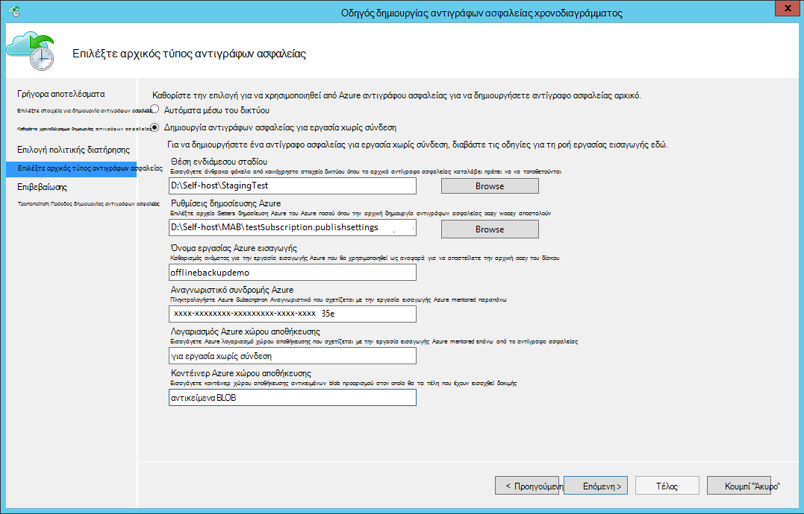

    Ακολουθεί η αντίστοιχη οθόνη στο σύστημα κέντρου προστασία διαχείρισης δεδομένων:  
    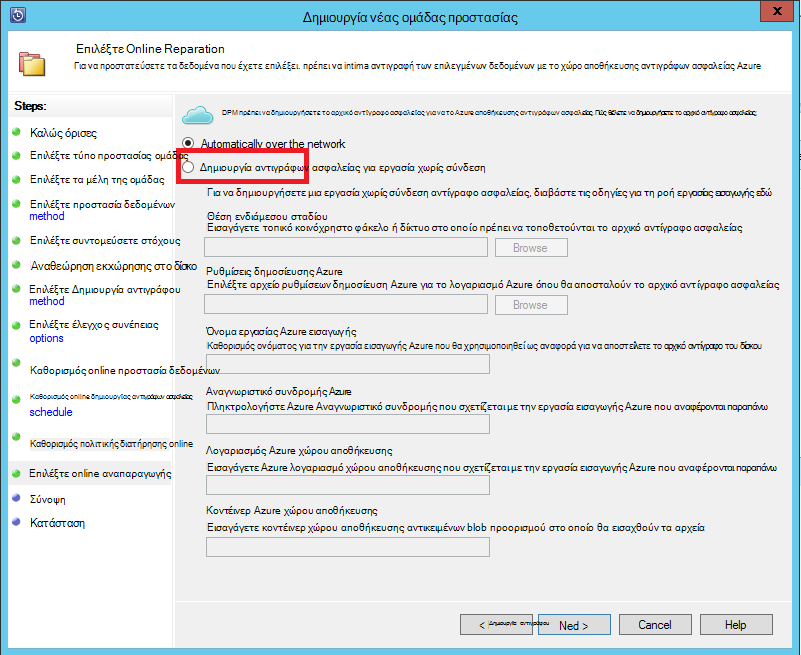

    Η περιγραφή του τα δεδομένα εισόδου είναι ως εξής:

    - **Θέση ενδιάμεσου σταδίου**: Η θέση προσωρινής αποθήκευσης στην οποία έχει συνταχθεί το αρχικό αντίγραφο ασφαλείας. Αυτό μπορεί να είναι σε ένα κοινόχρηστο στοιχείο δικτύου ή ένα τοπικό υπολογιστή. Εάν ο υπολογιστής αντίγραφο και ο υπολογιστής προέλευσης είναι διαφορετικά, συνιστάται να καθορίσετε την πλήρη διαδρομή δικτύου της θέσης ενδιάμεσου σταδίου.
    - **Όνομα εργασίας εισαγωγής Azure**: το μοναδικό όνομα από εισαγωγής Azure υπηρεσία και δημιουργία αντιγράφων ασφαλείας Azure παρακολούθηση τη μεταφορά των δεδομένων που αποστέλλονται σε δίσκων σε Azure.
    - **Ρυθμίσεις δημοσίευσης Azure**: αρχείο XML που περιέχει πληροφορίες σχετικά με το προφίλ σας συνδρομή. Περιέχει επίσης ασφαλούς τα διαπιστευτήρια που σχετίζονται με τη συνδρομή σας. Μπορείτε να [κάνετε λήψη του αρχείου](https://manage.windowsazure.com/publishsettings). Δώστε την τοπική διαδρομή προς το αρχείο ρυθμίσεων δημοσίευση.
    - **Αναγνωριστικό συνδρομής Azure**: Αναγνωριστικό συνδρομής του Azure για τη συνδρομή στην οποία σκοπεύετε να ξεκινήσετε την εργασία Azure εισαγωγής. Εάν έχετε πολλές συνδρομές Azure, χρησιμοποιήστε το Αναγνωριστικό της τη συνδρομή στην οποία θέλετε να συσχετίσετε με την εργασία εισαγωγής.
    - **Λογαριασμός Azure χώρου αποθήκευσης**: Ο χώρος αποθήκευσης κλασική τύπος λογαριασμού στην παρεχόμενη Azure συνδρομής που θα συσχετιστεί με την εργασία Azure εισαγωγής.
    - **Κοντέινερ χώρου αποθήκευσης Azure**: το όνομα του το blob του χώρου αποθήκευσης προορισμού στο λογαριασμό Azure αποθήκευσης όπου εισαχθούν δεδομένα του έργου σε αυτό.

    > [AZURE.NOTE] Εάν έχετε καταχωρήσει διακομιστή σας σε ένα θάλαμο υπηρεσίες ανάκτησης Azure από την [πύλη του Azure](https://portal.azure.com) για τα αντίγραφα ασφαλείας και δεν βρίσκονται σε μια συνδρομή παροχής λύσεων Cloud (CSP), μπορείτε να εξακολουθεί να να δημιουργήσετε ένα λογαριασμό χώρου αποθήκευσης κλασική τύπο από την πύλη του Azure και να το χρησιμοποιήσετε για τη ροή εργασίας χωρίς σύνδεση δημιουργίας αντιγράφων ασφαλείας.

    Αποθηκεύστε όλες αυτές τις πληροφορίες, επειδή πρέπει να εισαγάγετε ξανά στο ακολουθώντας τα βήματα. Μόνο το *ενδιάμεσου θέση* απαιτείται αν χρησιμοποιήσατε το εργαλείο Azure δίσκου προετοιμασίας για να προετοιμάσετε το δίσκων.    

2. Ολοκλήρωση της ροής εργασίας και, στη συνέχεια, επιλέξτε **Άμεση δημιουργία αντιγράφων ασφαλείας** στην κονσόλα διαχείρισης Azure αντιγράφου ασφαλείας για να ξεκινήσετε το αντίγραφο χωρίς σύνδεση δημιουργίας αντιγράφων ασφαλείας. Το αρχικό αντίγραφο ασφαλείας εγγράφεται στην περιοχή ενδιάμεσου σταδίου ως μέρος αυτού του βήματος.

    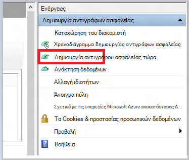

    Για να ολοκληρώσετε το αντίστοιχο ροής εργασίας στο σύστημα κέντρου προστασία διαχείρισης δεδομένων, κάντε δεξί κλικ στην **Ομάδα "Προστασία"**και, στη συνέχεια, ενεργοποιήστε την επιλογή **Δημιουργία αποκατάστασης σημείο** . Στη συνέχεια, επιλέξτε την επιλογή **Online Protection** .

    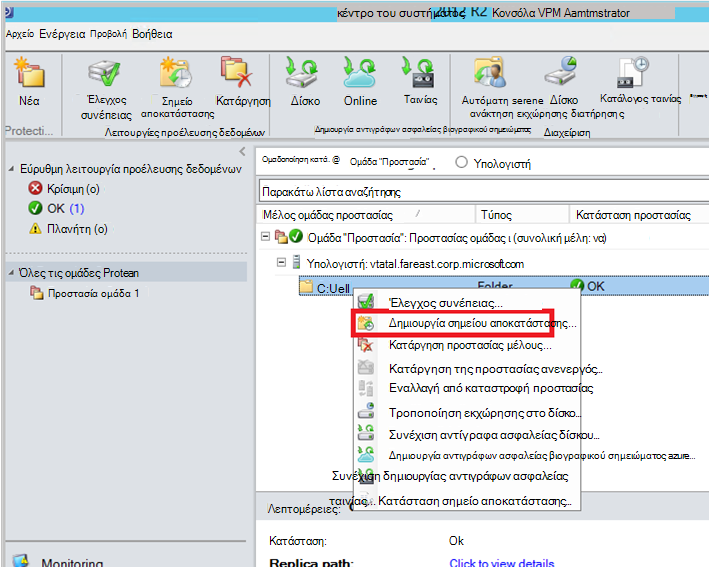

    Αφού ολοκληρωθεί η λειτουργία, η θέση ενδιάμεσου σταδίου είναι έτοιμος να χρησιμοποιηθεί για την προετοιμασία δίσκου.

    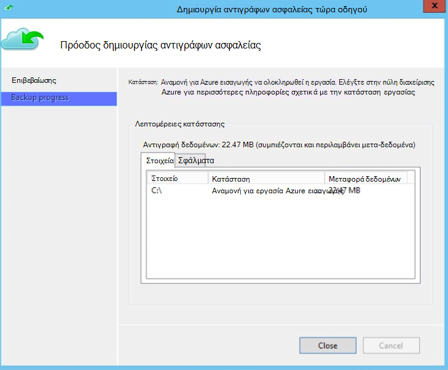

### Προετοιμασία μια μονάδα δίσκου SATA και να δημιουργήσετε μια εργασία εισαγωγής Azure χρησιμοποιώντας το εργαλείο προετοιμασίας δίσκου Azure
Το εργαλείο προετοιμασίας δίσκου Azure είναι διαθέσιμο στον κατάλογο εγκατάστασης από τον παράγοντα υπηρεσίες ανάκτησης (ενημέρωση Αυγούστου 2016 και νεότερες εκδόσεις) στην ακόλουθη διαδρομή.

   *\Microsoft* *Azure* *Ανάκτηση* *Υπηρεσίες* * Agent\Utils\*

1. Μεταβείτε στον κατάλογο και αντιγράψτε τον κατάλογο **AzureOfflineBackupDiskPrep** σε έναν υπολογιστή αντίγραφο στην οποία είναι ενεργοποιημένες τις μονάδες δίσκου για να προετοιμαστείτε. Βεβαιωθείτε ότι τα εξής σχετικά με την αντιγραφή υπολογιστή:

      - Ο υπολογιστής αντίγραφο έχει πρόσβαση στη θέση ενδιάμεσου σταδίου για τη ροή εργασίας χωρίς σύνδεση καλλιέργεια, χρησιμοποιώντας την ίδια διαδρομή δικτύου που σας δόθηκε στη ροή εργασίας **Προετοιμασία δημιουργίας αντιγράφων ασφαλείας για εργασία χωρίς σύνδεση** .

      - Έχει ενεργοποιηθεί το BitLocker στον υπολογιστή.

      - Ο υπολογιστής να αποκτήσετε πρόσβαση στην πύλη Azure.

      Εάν είναι απαραίτητο, ο υπολογιστής αντίγραφο μπορεί να είναι ίδια με τον υπολογιστή προέλευσης.

2. Ανοίξτε μια αναβαθμισμένη γραμμή εντολών στον υπολογιστή αντίγραφο με τον κατάλογο εργαλείο προετοιμασίας δίσκου Azure ως τρέχοντα κατάλογο και εκτελέστε την ακόλουθη εντολή:

      *.\AzureOfflineBackupDiskPrep.exe* s: <*Διαδρομή θέσης ενδιάμεσου σταδίου*> [p: <*διαδρομή προς PublishSettingsFile*>]

| Παράμετρος | Περιγραφή
|-------------|-------------|
|s: <*Διαδρομή θέσης ενδιάμεσου σταδίου*> | Υποχρεωτική εισαγωγής που χρησιμοποιείται για την παροχή της διαδρομής στη θέση του ενδιάμεσου σταδίου που έχετε εισαγάγει στη ροή εργασίας **Προετοιμασία δημιουργίας αντιγράφων ασφαλείας για εργασία χωρίς σύνδεση** . |
|p: <*διαδρομή προς PublishSettingsFile*> | Προαιρετικό εισαγωγής που χρησιμοποιείται για την παροχή τη διαδρομή προς το αρχείο **Ρυθμίσεων δημοσίευση Azure** που έχετε εισαγάγει στη ροή εργασίας **Προετοιμασία δημιουργίας αντιγράφων ασφαλείας για εργασία χωρίς σύνδεση** . |

> [AZURE.NOTE] Το &lt;διαδρομή προς PublishSettingFile&gt; τιμή είναι υποχρεωτική όταν ο υπολογιστής αντίγραφο και ο υπολογιστής προέλευσης είναι διαφορετικές.

Όταν εκτελείτε την εντολή, το εργαλείο ζητά της επιλογής της εργασίας εισαγωγής Azure που αντιστοιχεί τις μονάδες που πρέπει να είναι έτοιμοι. Εάν μόνο μια μεμονωμένη εισαγωγή εργασία σχετίζεται με την παρεχόμενη ενδιάμεσου σταδίου θέση, μπορείτε να δείτε μια οθόνη όπως αυτό που ακολουθεί.

   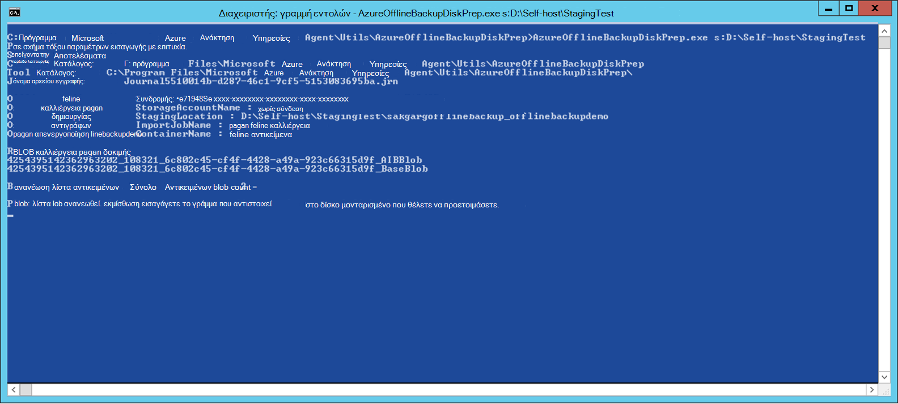  
3. Πληκτρολογήστε το γράμμα χωρίς τα τελικά άνω και κάτω τελεία για το μονταρισμένο δίσκου που θέλετε να προετοιμαστείτε για μεταφορά σε Azure. Δώστε επιβεβαίωσης για τη μορφοποίηση της μονάδας δίσκου όταν σας ζητηθεί.

Το εργαλείο αρχίζει, στη συνέχεια, για να προετοιμάσετε το δίσκο με τα δεδομένα αντιγράφου ασφαλείας. Ίσως χρειαστεί να επισυνάψετε επιπλέον δίσκων όταν σας ζητηθεί από το εργαλείο, σε περίπτωση που ο δίσκος που παρέχονται δεν διαθέτει αρκετό χώρο για τα δεδομένα αντιγράφου ασφαλείας.  

Στο τέλος της επιτυχής εκτέλεση του εργαλείου, μία ή περισσότερες δίσκων που παρείχατε έχουν προετοιμαστεί για αποστολή Azure. Επιπλέον, δημιουργείται μια εργασία εισαγωγής με το όνομα που παρείχατε κατά τη διάρκεια της ροής εργασίας **Προετοιμασία δημιουργίας αντιγράφων ασφαλείας χωρίς σύνδεση** στην πύλη του Azure κλασική. Τέλος, το εργαλείο εμφανίζει τη διεύθυνση αποστολής με το Azure κέντρο δεδομένων όπου δίσκων πρέπει να αποσταλούν και τη σύνδεση για να εντοπίσετε την εργασία εισαγωγής στην πύλη του Azure κλασική.

    
4. Αποστολή των δίσκων στη διεύθυνση που παρέχεται από το εργαλείο και διατήρηση του αριθμού παρακολούθησης για μελλοντική αναφορά. 
5. Όταν μεταβείτε στη σύνδεση που εμφανίζεται το εργαλείο, μπορείτε να δείτε το λογαριασμό Azure χώρου αποθήκευσης που έχετε καθορίσει στη ροή εργασίας **Προετοιμασία δημιουργίας αντιγράφων ασφαλείας για εργασία χωρίς σύνδεση** . Εδώ μπορείτε να δείτε την εργασία που έχουν δημιουργηθεί πρόσφατα εισαγωγής στην καρτέλα **Εισαγωγή/ΕΞΑΓΩΓΉ** του λογαριασμού χώρου αποθήκευσης.

   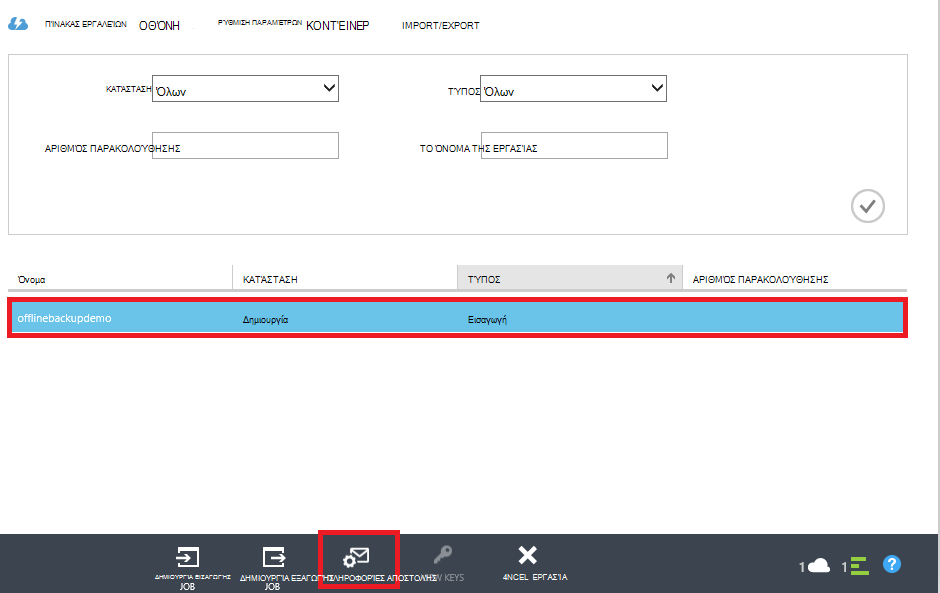 
6. Κάντε κλικ στην επιλογή **ΑΠΟΣΤΟΛΉ ΠΛΗΡΟΦΟΡΙΏΝ** στο κάτω μέρος της σελίδας για να ενημερώσετε τις πληροφορίες επικοινωνίας, όπως φαίνεται στην παρακάτω οθόνη. Η Microsoft χρησιμοποιεί αυτό πληροφορίες για την αποστολή δίσκων σας να μετά την ολοκλήρωση της εργασίας εισαγωγής.

   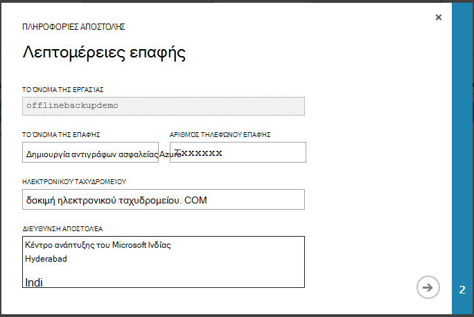 
7. Πληκτρολογήστε τις λεπτομέρειες αποστολής στην επόμενη οθόνη. Δώστε τις λεπτομέρειες **Συλλαβισμού παράδοσης** και **Αριθμός παρακολούθησης** που αντιστοιχούν στα των δίσκων που αποστείλατε με το Azure κέντρο δεδομένων.

   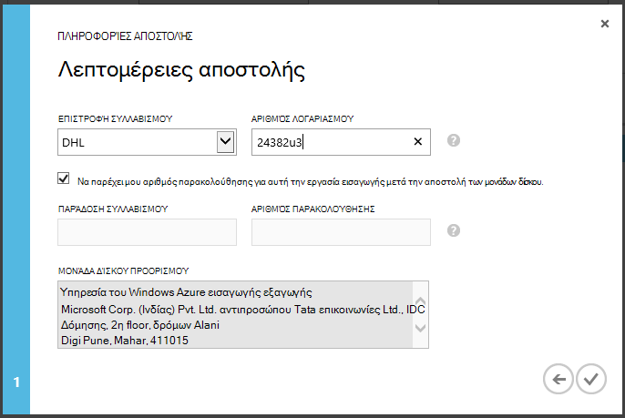 

### Ολοκλήρωση της ροής εργασίας
Αφού ολοκληρωθεί η εργασία εισαγωγής, αρχικό δεδομένα αντιγράφου ασφαλείας είναι διαθέσιμη στο λογαριασμό σας στο χώρο αποθήκευσης. Το παράγοντας υπηρεσίες ανάκτησης, στη συνέχεια, αντίγραφα των περιεχομένων των δεδομένων από αυτόν το λογαριασμό στο θάλαμο δημιουργίας αντιγράφων ασφαλείας ή υπηρεσίες ανάκτησης φύλαξης, όποιο από τα δύο εφαρμόζεται. Με την επόμενη προγραμματισμένη ώρα δημιουργίας αντιγράφων ασφαλείας, τον παράγοντα αντιγράφων ασφαλείας Azure εκτελεί την προσαύξησης πάνω από το αρχικό αντίγραφο ασφαλείας.

> [AZURE.NOTE] Οι παρακάτω ενότητες ισχύουν για τους χρήστες από προηγούμενες εκδόσεις του Azure δημιουργίας αντιγράφων ασφαλείας που δεν έχουν πρόσβαση στο εργαλείο προετοιμασίας δίσκου Azure.

### Προετοιμασία μια μονάδα δίσκου SATA

1. Κάντε λήψη του [Microsoft Azure εισαγωγής/εξαγωγής εργαλείου](http://go.microsoft.com/fwlink/?linkid=301900&clcid=0x409) στον υπολογιστή αντιγραφή. Βεβαιωθείτε ότι είναι προσβάσιμα από τον υπολογιστή στο οποίο σκοπεύετε να εκτελέσετε στο επόμενο σύνολο των εντολών της θέσης ενδιάμεσου σταδίου. Εάν είναι απαραίτητο, ο υπολογιστής αντίγραφο μπορεί να είναι ίδια με τον υπολογιστή προέλευσης.

2. Αποσυμπιέστε το αρχείο WAImportExport.zip. Εκτελέστε το εργαλείο WAImportExport που μορφοποιεί στη μονάδα δίσκου SATA και συντάσσει τα δεδομένα αντιγράφου ασφαλείας στη μονάδα δίσκου SATA κρυπτογραφεί. Πριν να εκτελέσετε την ακόλουθη εντολή, βεβαιωθείτε ότι έχει ενεργοποιηθεί το BitLocker στον υπολογιστή.  

    *.\WAImportExport.exe PrepImport /j: <* JournalFile*> .jrn /id: <*αναγνωριστικό περιόδου λειτουργίας*> /sk: <*StorageAccountKey*> /BlobType:**PageBlob* * /t: <*TargetDriveLetter*>/Μορφοποίηση / κρυπτογράφηση /srcdir: <*ενδιάμεσου θέση*> /dstdir: <*DestinationBlobVirtualDirectory*>/*

    > [AZURE.NOTE] Εάν έχετε εγκαταστήσει την ενημερωμένη έκδοση Αύγουστος 2016 Azure δημιουργίας αντιγράφων ασφαλείας (ή νεότερη έκδοση), βεβαιωθείτε ότι στη θέση ενδιάμεσου σταδίου που εισαγάγατε είναι ίδια με τη μία στην οθόνη **Άμεση δημιουργία αντιγράφων ασφαλείας** και περιέχει αρχεία AIB και Blob βάσης.

| Παράμετρος | Περιγραφή
|-------------|-------------|
| /j: <*JournalFile*>| Η διαδρομή προς το αρχείο εγγραφών. Κάθε μονάδα δίσκου πρέπει να έχει ακριβώς ένα μπλοκ σημειώσεων. Το αρχείο χρονικού δεν πρέπει να είναι στη μονάδα δίσκου προορισμού. Την επέκταση αρχείου εγγραφών είναι .jrn και δημιουργείται ως μέρος του την εκτέλεση αυτής της εντολής.|
|/ID: <*αναγνωριστικό περιόδου λειτουργίας*> | Το Αναγνωριστικό περιόδου λειτουργίας προσδιορίζει μια περίοδο λειτουργίας αντίγραφο. Χρησιμοποιείται για να βεβαιωθείτε ότι ακριβή ανάκτησης μιας περιόδου λειτουργίας διακόπηκε αντίγραφο. Αρχεία που έχουν αντιγραφεί σε μια περίοδο λειτουργίας αντίγραφο είναι αποθηκευμένα σε έναν κατάλογο με το όνομα μετά το Αναγνωριστικό περιόδου λειτουργίας στη μονάδα δίσκου προορισμού.|
| /SK: <*StorageAccountKey*> | Το κλειδί λογαριασμού για το λογαριασμό χώρου αποθήκευσης στο οποίο γίνεται εισαγωγή των δεδομένων. Το κλειδί πρέπει να είναι ίδια όπως το πληκτρολογήσατε κατά τη διάρκεια δημιουργίας αντιγράφων ασφαλείας πολιτικής/προστασίας ομάδας.|
| / BlobType | Ο τύπος του blob. Αυτή η ροή εργασίας με επιτυχία μόνο εάν έχει καθοριστεί **PageBlob** . Αυτό δεν είναι η προεπιλεγμένη επιλογή και θα πρέπει να αναφέρεται σε αυτήν την εντολή. |
|/ t: <*TargetDriveLetter*> | Το γράμμα χωρίς την άνω και κάτω τελεία στο τέλος του σκληρού δίσκου προορισμού για την τρέχουσα περίοδο λειτουργίας αντίγραφο.|
|/ Format | Η επιλογή για να διαμορφώσετε τη μονάδα δίσκου. Ορίσετε αυτήν την παράμετρο, όταν η μονάδα δίσκου πρέπει να είναι διαμορφωμένη. Διαφορετικά, παραλείψτε την. Πριν από το εργαλείο μορφές στη μονάδα δίσκου, σας ζητά επιβεβαίωση από την κονσόλα. Για να αποκρύψετε την επιβεβαίωση, καθορίστε την παράμετρο /silentmode.|
|/ κρυπτογράφηση | Η επιλογή για να κρυπτογραφήσετε τη μονάδα δίσκου. Ορίσετε αυτήν την παράμετρο, όταν η μονάδα δίσκου δεν έχει ακόμη κρυπτογραφημένα με το BitLocker και πρέπει να είναι κρυπτογραφημένα με το εργαλείο. Εάν η μονάδα δίσκου έχει ήδη έχουν κρυπτογραφημένη με το BitLocker, μπορείτε να παραλείψετε αυτό παράμετρο, καθορίστε την παράμετρο /bk και παρέχει το υπάρχον κλειδί BitLocker. Εάν καθορίσετε την παράμετρο/Format, πρέπει επίσης να καθορίσετε το / κρυπτογράφηση παραμέτρου. |
|/srcdir: <*SourceDirectory*> | Ο κατάλογος προέλευσης που περιέχει τα αρχεία που θα αντιγραφούν στη μονάδα δίσκου προορισμού. Βεβαιωθείτε ότι το όνομα του καθορισμένου καταλόγου διαθέτει μια πλήρη και όχι σχετική διαδρομή.|
|/dstdir: <*DestinationBlobVirtualDirectory*> | Η διαδρομή προς τον προορισμό εικονικό κατάλογο στο λογαριασμό σας στο Azure χώρου αποθήκευσης. Φροντίστε να χρησιμοποιήσετε έγκυρη κοντέινερ ονόματα που καθορίζετε το εικονικό κατάλογοι προορισμού ή αντικείμενα blob. Λάβετε υπόψη ότι τα ονόματα κοντέινερ πρέπει να είναι πεζά.  Αυτό το κοντέινερ όνομα πρέπει να είναι εκείνη που έχετε καταχωρήσει κατά τη διάρκεια δημιουργίας αντιγράφων ασφαλείας πολιτικής/προστασίας ομάδας.|

  > [AZURE.NOTE] Ένα μπλοκ σημειώσεων δημιουργείται στο φάκελο WAImportExport που καταγράφει τις πληροφορίες ολόκληρης της ροής εργασίας. Όταν δημιουργείτε μια εργασία εισαγωγής στην πύλη του Azure πρέπει αυτό το αρχείο.

  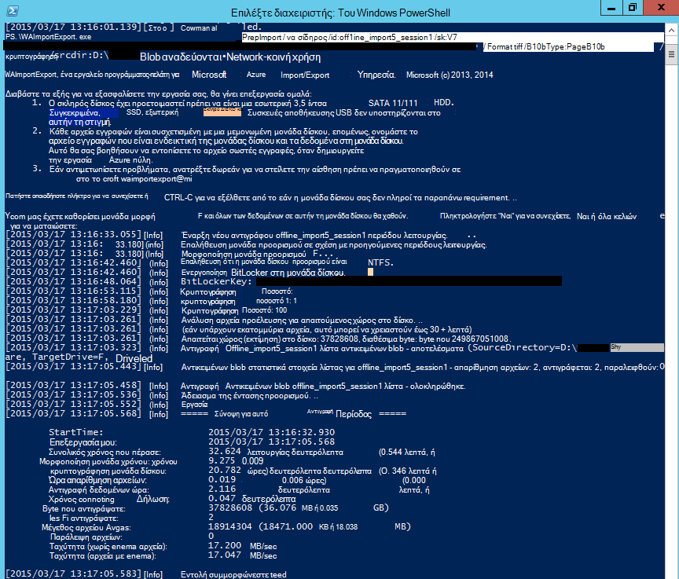

### Δημιουργήστε μια εργασία εισαγωγής στην πύλη του Azure
1. Μεταβείτε στο λογαριασμό σας χώρου αποθήκευσης στην [πύλη του Azure κλασική](https://manage.windowsazure.com/), κάντε κλικ στην επιλογή **Εισαγωγή/εξαγωγή**και, στη συνέχεια, **Δημιουργία εργασίας εισαγωγής** στο παράθυρο εργασιών.

    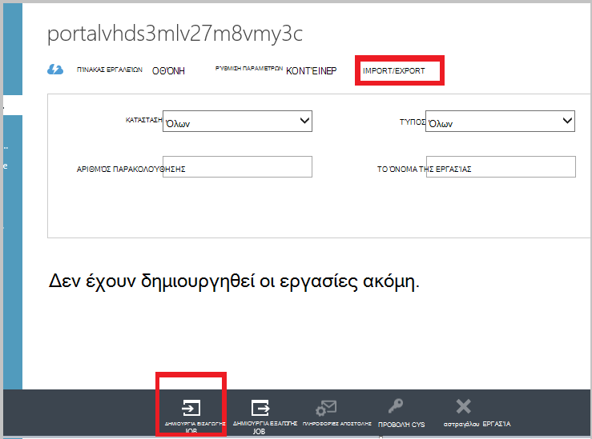

2. Στο βήμα 1 του οδηγού, υποδεικνύουν ότι έχουν προετοιμαστεί μονάδα δίσκου σας και ότι έχετε το αρχείο εγγραφών μονάδα δίσκου διαθέσιμη.
3. Στο βήμα 2 του οδηγού, παρέχετε πληροφορίες επικοινωνίας για το άτομο που είναι υπεύθυνος για αυτής της εργασίας εισαγωγής.
4. Στο βήμα 3, στείλτε τα αρχεία εγγραφών μονάδα δίσκου που έχετε λάβει στην προηγούμενη ενότητα.
5. Στο βήμα 4, πληκτρολογήστε ένα περιγραφικό όνομα για την εργασία εισαγωγής που έχετε καταχωρήσει κατά τη διάρκεια δημιουργίας αντιγράφων ασφαλείας πολιτικής/προστασίας ομάδας. Το όνομα που εισάγετε μπορεί να περιέχει μόνο πεζά γράμματα, αριθμούς, παύλες και χαρακτήρες υπογράμμισης, πρέπει να ξεκινούν με γράμμα και δεν μπορούν να περιέχουν κενά διαστήματα. Το όνομα που επιλέγετε χρησιμοποιείται για την παρακολούθηση των εργασιών σας, ενώ βρίσκονται σε εξέλιξη και μετά την ολοκλήρωσή τους.
6. Στη συνέχεια, επιλέξτε την περιοχή κέντρου δεδομένων σας από τη λίστα. Στην περιοχή κέντρο δεδομένων υποδεικνύει το κέντρο δεδομένων και τη διεύθυνση στην οποία πρέπει να αποστείλετε το πακέτο.

    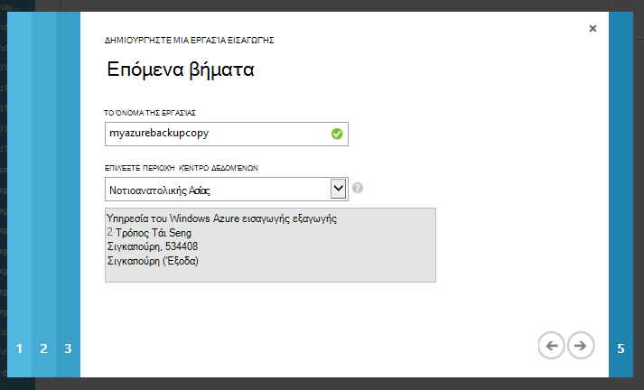

7. Στο βήμα 5, επιλέξτε τον αποστολέα συλλαβισμού από τη λίστα και εισαγάγετε τον αριθμό του λογαριασμού αερομεταφορέα. Η Microsoft χρησιμοποιεί αυτόν το λογαριασμό για την αποστολή μονάδες δίσκων σας να αφού ολοκληρωθεί η εργασία σας εισαγωγής.

8. Αποστολή του δίσκου και πληκτρολογήστε τον αριθμό παρακολούθησης για να παρακολουθείτε την κατάσταση της αποστολής. Αφού ο δίσκος φτάσει στο κέντρο δεδομένων, αντιγράφεται με το λογαριασμό χώρου αποθήκευσης και η κατάσταση είναι ενημερωθεί.

    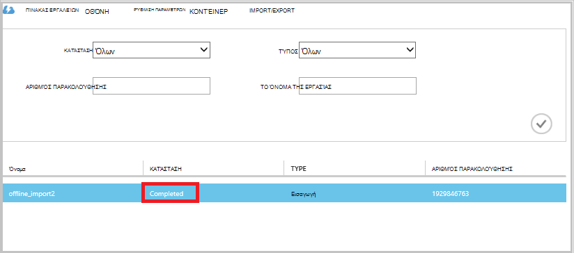

### Ολοκλήρωση της ροής εργασίας
Μετά την αρχική δεδομένα αντιγράφου ασφαλείας είναι διαθέσιμη στο λογαριασμό σας στο χώρο αποθήκευσης, τον παράγοντα υπηρεσίες ανάκτησης του Microsoft Azure αντιγράφει το περιεχόμενο των δεδομένων από αυτόν το λογαριασμό για να το θάλαμο δημιουργίας αντιγράφων ασφαλείας ή υπηρεσίες ανάκτησης φύλαξης, κατά περίπτωση. Στην επόμενη χρονοδιάγραμμα δημιουργίας αντιγράφων ασφαλείας, τον παράγοντα αντιγράφων ασφαλείας Azure εκτελεί την προσαύξησης πάνω από το αρχικό αντίγραφο ασφαλείας.

## Επόμενα βήματα
- Για τυχόν ερωτήσεις σχετικά με τη ροή εργασίας Azure εισαγωγή/εξαγωγή, ανατρέξτε στο θέμα [χρήση της υπηρεσίας Microsoft Azure εισαγωγή/εξαγωγή για να μεταφέρετε δεδομένα στο χώρο αποθήκευσης αντικειμένων Blob](../storage/storage-import-export-service.md).
- Ανατρέξτε στην ενότητα χωρίς σύνδεση δημιουργίας αντιγράφων ασφαλείας του αντιγράφου ασφαλείας Azure [Συνήθεις Ερωτήσεις](backup-azure-backup-faq.md) για τις ερωτήσεις σχετικά με τη ροή εργασίας.
