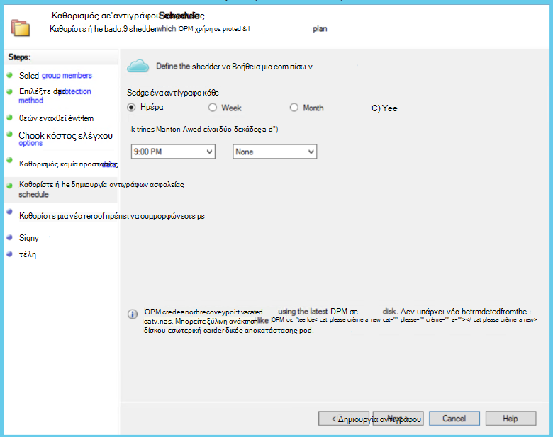
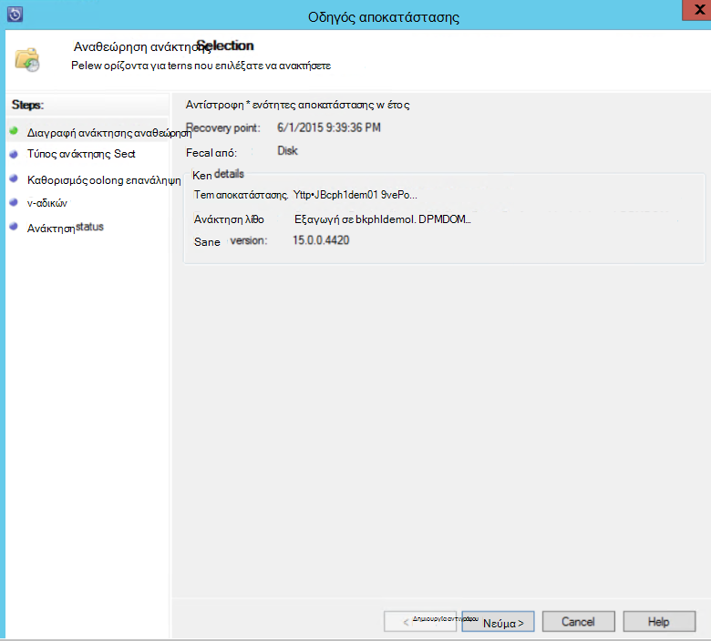
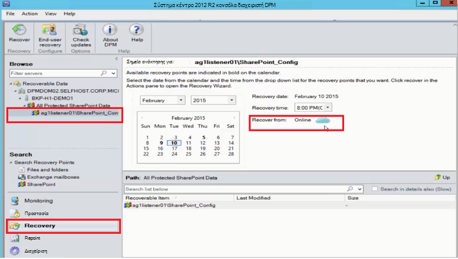

<properties
    pageTitle="Προστασία διακομιστή DPM/Azure αντίγραφο ασφαλείας μιας συστοιχίας του SharePoint για να Azure | Microsoft Azure"
    description="Σε αυτό το άρθρο παρέχει μια επισκόπηση της προστασίας διακομιστή DPM/Azure αντίγραφο ασφαλείας μιας συστοιχίας του SharePoint για να Azure"
    services="backup"
    documentationCenter=""
    authors="adigan"
    manager="Nkolli1"
    editor=""/>

<tags
    ms.service="backup"
    ms.workload="storage-backup-recovery"
    ms.tgt_pltfrm="na"
    ms.devlang="na"
    ms.topic="article"
    ms.date="09/29/2016"
    ms.author="adigan;giridham;jimpark;trinadhk;markgal"/>

# Δημιουργήστε αντίγραφα ασφαλείας μια συστοιχία του SharePoint σε Azure
Δημιουργείτε αντίγραφα ασφαλείας μια συστοιχία του SharePoint στο Microsoft Azure με χρήση του συστήματος κέντρο δεδομένων προστασίας Manager (DPM) με πολύ τον ίδιο τρόπο που δημιουργείτε αντίγραφα ασφαλείας άλλες προελεύσεις δεδομένων. Azure δημιουργίας αντιγράφων ασφαλείας παρέχει ευελιξία στο χρονοδιάγραμμα δημιουργίας αντιγράφων ασφαλείας για να δημιουργήσετε ημερήσια, εβδομαδιαία, μηνιαία ή ετήσια δημιουργίας αντιγράφων ασφαλείας σημεία και σας προσφέρει επιλογές πολιτική διατήρησης για διάφορα σημεία δημιουργίας αντιγράφων ασφαλείας. DPM παρέχει τη δυνατότητα να αποθηκεύετε στον τοπικό δίσκο αντίγραφα για γρήγορη τους στόχους του χρόνου ανάκτησης (RTO) και να αποθηκεύσετε αντίγραφα να Azure για οικονομικός, μακροπρόθεσμες διατήρησης.

## SharePoint υποστηριζόμενες εκδόσεις και που σχετίζονται με προστασία σενάρια
Azure δημιουργίας αντιγράφων ασφαλείας για DPM υποστηρίζει τα ακόλουθα σενάρια:

| Φόρτο εργασίας | Έκδοση | Ανάπτυξη του SharePoint | Τύπος DPM ανάπτυξης | DPM - σύστημα κέντρο 2012 R2 | Προστασία και αποκατάστασης |
| -------- | ------- | --------------------- | ------------------- | --------------------------- | ----------------------- |
| Του SharePoint | SharePoint 2013, του SharePoint 2010, SharePoint 2007, SharePoint 3.0 | SharePoint αναπτυχθεί ως φυσικό διακομιστή ή Hyper-V/VMware εικονική μηχανή   --------------   SQL AlwaysOn | Φυσική διακομιστή ή εσωτερικής Hyper-V εικονική μηχανή | Υποστηρίζει την επιλογή αντίγραφα ασφαλείας για Azure από συνάθροιση ενημερώσεων 5 | Προστασία επιλογές αποκατάστασης συστοιχία του SharePoint: συστοιχία ανάκτησης, βάση δεδομένων και αρχείου ή στοιχείου λίστας από δίσκο αποκατάστασης σημεία.  Αποκατάσταση συστοιχία και βάση δεδομένων από το Azure αποκατάστασης σημεία. |

## Πριν ξεκινήσετε
Υπάρχουν μερικά πράγματα που πρέπει να επιβεβαιώσει πριν να δημιουργήσετε αντίγραφα ασφαλείας μια συστοιχία του SharePoint για να Azure.

### Προαπαιτούμενα στοιχεία
Πριν να συνεχίσετε, βεβαιωθείτε ότι ικανοποιούνται όλες τις [προϋποθέσεις για τη χρήση των αντιγράφων ασφαλείας του Microsoft Azure](backup-azure-dpm-introduction.md#prerequisites) για την προστασία φόρτους εργασίας. Συμπεριλάβετε ορισμένες εργασίες για τις προϋποθέσεις: δημιουργία ενός αντιγράφου ασφαλείας θάλαμο, λήψης διαπιστευτηρίων θάλαμο, εγκαταστήστε Azure παράγοντα αντιγράφων ασφαλείας και καταχώρηση DPM/Azure δημιουργίας αντιγράφων ασφαλείας διακομιστή με το θάλαμο.

### Παράγοντας DPM
Ο παράγοντας DPM πρέπει να έχει εγκατασταθεί στο διακομιστή όπου εκτελείται το SharePoint, τους διακομιστές που εκτελούν SQL Server και όλους τους άλλους διακομιστές που αποτελούν μέρος της συστοιχίας του SharePoint. Για περισσότερες πληροφορίες σχετικά με το πώς μπορείτε να ρυθμίσετε τον παράγοντα προστασίας, ανατρέξτε στο θέμα [Ρύθμιση παράγοντα προστασίας](https://technet.microsoft.com/library/hh758034(v=sc.12).aspx).  Η μοναδική εξαίρεση είναι να εγκαταστήσετε τον παράγοντα μόνο σε έναν διακομιστή web μόνο προσκηνίου (WFE). DPM ανάγκες τον παράγοντα σε ένα διακομιστή WFE μόνο για να λειτουργήσει ως το σημείο εισόδου για την προστασία.

### Συστοιχία του SharePoint
Για κάθε 10 εκατομμύρια στοιχεία στο σύμπλεγμα, πρέπει να είναι τουλάχιστον 2 GB χώρου του τόμου όπου βρίσκεται ο φάκελος DPM. Αυτός ο χώρος απαιτείται για τη δημιουργία καταλόγου. Για DPM για να ανακτήσετε συγκεκριμένα στοιχεία (συλλογές τοποθεσιών, τοποθεσίες, λίστες, βιβλιοθήκες εγγράφων, φακέλων, μεμονωμένα έγγραφα και στοιχεία λίστας), στον κατάλογο γενιάς δημιουργεί μια λίστα με τις διευθύνσεις URL που περιέχονται σε κάθε βάση δεδομένων περιεχομένου. Μπορείτε να προβάλετε τη λίστα των διευθύνσεων URL στο παράθυρο ανακτήσιμα στοιχείο στην περιοχή εργασιών **ανάκτησης** του κονσόλα διαχειριστή DPM.

### SQL Server
DPM εκτελείται ως λογαριασμός τοπικού συστήματος. Για να δημιουργήσετε αντίγραφα ασφαλείας βάσεις δεδομένων SQL Server, DPM πρέπει sysadmin δικαιώματα σε αυτόν το λογαριασμό για το διακομιστή που εκτελεί τον SQL Server. Ορίστε NT AUTHORITY\SYSTEM σε *sysadmin* στο διακομιστή που εκτελεί τον SQL Server πριν να δημιουργήσετε αντίγραφα ασφαλείας.

Εάν στη συστοιχία του SharePoint έχει βάσεις δεδομένων SQL Server που έχουν ρυθμιστεί με ψευδώνυμα SQL Server, θα πρέπει να εγκαταστήσετε τα στοιχεία προγράμματος-πελάτη SQL Server στο διακομιστή Web προσκηνίου που θα προστασία DPM.

### Στον SharePoint Server
Ενώ επιδόσεων εξαρτάται από πολλούς παράγοντες όπως το μέγεθος της συστοιχίας του SharePoint, ως γενικές οδηγίες για ένα διακομιστή DPM να προστατεύσετε μια συστοιχία του SharePoint 25 TB.

### DPM ενημερωμένων 5
Για να ξεκινήσετε την προστασία των μια συστοιχία του SharePoint για να Azure, πρέπει να εγκαταστήσετε DPM ενημερωμένων 5 ή νεότερη έκδοση. Συνάθροιση ενημερώσεων 5 παρέχει τη δυνατότητα να προστατεύσετε μια συστοιχία του SharePoint για να Azure εάν σύμπλεγμα έχει ρυθμιστεί με τη χρήση SQL AlwaysOn.
Για περισσότερες πληροφορίες, ανατρέξτε στο ιστολόγιο δημοσίευση που παρουσιάζει [DPM συνάθροιση ενημερώσεων 5]( http://blogs.technet.com/b/dpm/archive/2015/02/11/update-rollup-5-for-system-center-2012-r2-data-protection-manager-is-now-available.aspx)

### Τι δεν υποστηρίζεται
- DPM που προστατεύει μια συστοιχία του SharePoint δεν προστατεύει ευρετήρια αναζήτησης ή βάσεων δεδομένων εφαρμογής υπηρεσίας. Θα πρέπει να ρυθμίσετε τις παραμέτρους της προστασίας αυτών των βάσεων δεδομένων ξεχωριστά.
- DPM δεν παρέχει αντίγραφο ασφαλείας των βάσεων δεδομένων SQL Server του SharePoint που φιλοξενούνται σε κοινόχρηστα στοιχεία αρχείων κλιμάκωσης διακομιστή (SOFS).

## Ρύθμιση παραμέτρων προστασίας του SharePoint
Να μπορέσετε να χρησιμοποιήσετε DPM για την προστασία του SharePoint, πρέπει να ρυθμίσετε την υπηρεσία του SharePoint VSS Writer (υπηρεσία WSS Writer) με τη χρήση **ConfigureSharePoint.exe**.

Μπορείτε να βρείτε **ConfigureSharePoint.exe** στο φάκελο \bin [διαδρομή εγκατάστασης DPM] στο διακομιστή web προσκηνίου. Αυτό το εργαλείο παρέχει τον παράγοντα προστασίας με τα διαπιστευτήρια για τη συστοιχία του SharePoint. Εκτελέστε την σε ένα διακομιστή WFE. Εάν έχετε πολλούς διακομιστές WFE, επιλέξτε ένα μόνο όταν ρυθμίζετε τις παραμέτρους μιας ομάδας προστασίας.

### Για να ρυθμίσετε τις παραμέτρους της υπηρεσίας SharePoint VSS Writer
1. Στο διακομιστή WFE, σε μια γραμμή εντολών, μεταβείτε στο \bin\ [θέση εγκατάστασης DPM]
2. Πληκτρολογήστε ConfigureSharePoint - EnableSharePointProtection.
3. Εισαγάγετε τα διαπιστευτήρια διαχειριστή συστοιχίας. Αυτός ο λογαριασμός θα πρέπει να είναι μέλος της τοπικής ομάδας διαχειριστών στο διακομιστή WFE. Εάν ο διαχειριστής συστοιχίας δεν τοπικού διαχειριστή παραχωρήσετε τα ακόλουθα δικαιώματα στο διακομιστή WFE:
  - Εκχώρηση του πλήρους ελέγχου ομάδας WSS_Admin_WPG στο φάκελο DPM (% Manager\DPM προστασία δεδομένων Files%\Microsoft προγράμματος).
  - Εκχώρηση WSS_Admin_WPG ομάδα πρόσβαση για ανάγνωση του κλειδιού μητρώου DPM (Διαχείριση προστασίας δεδομένων HKEY_LOCAL_MACHINE\SOFTWARE\Microsoft\Microsoft).

>[AZURE.NOTE] Θα πρέπει να εκτελέσετε ξανά ConfigureSharePoint.exe κάθε φορά που υπάρχει μια αλλαγή στο τα διαπιστευτήρια διαχειριστή συστοιχίας του SharePoint.

## Δημιουργία αντιγράφου ασφαλείας μια συστοιχία του SharePoint με χρήση του DPM
Αφού έχετε ρυθμίσει DPM και στη συστοιχία του SharePoint, όπως εξηγείται προηγουμένως, μπορείτε να προστατέψετε του SharePoint, DPM.

### Για να προστατεύσετε μια συστοιχία του SharePoint
1. Από την καρτέλα **προστασία** από την κονσόλα διαχειριστή DPM, κάντε κλικ στην επιλογή **Δημιουργία**.
    

2. Στη σελίδα **Επιλογή τύπου ομάδα προστασίας** του οδηγού **Δημιουργία νέας ομάδας προστασία** , επιλέξτε **τους διακομιστές**και, στη συνέχεια, κάντε κλικ στο κουμπί **Επόμενο**.

    

3. Στην οθόνη **Επιλέξτε τα μέλη της ομάδας** , επιλέξτε το πλαίσιο ελέγχου για το SharePoint server που θέλετε να προστατεύσετε και κάντε κλικ στο κουμπί **Επόμενο**.

    

    >[AZURE.NOTE] Με εγκαταστήσει τον παράγοντα DPM, μπορείτε να δείτε το διακομιστή στον οδηγό. DPM εμφανίζει επίσης τη δομή. Επειδή εκτελέσατε ConfigureSharePoint.exe, DPM επικοινωνεί με την υπηρεσία του SharePoint VSS Writer και τις αντίστοιχες βάσεις δεδομένων του SQL Server και αναγνωρίζει τη δομή της συστοιχίας του SharePoint, το σχετικό βάσεων δεδομένων περιεχομένου και τα αντίστοιχα στοιχεία.

4. Στη σελίδα **Επιλέξτε μέθοδος προστασίας δεδομένων** , πληκτρολογήστε το όνομα της **Ομάδας προστασίας**και επιλέξτε την προτιμώμενη *μεθόδους προστασίας*. Κάντε κλικ στο κουμπί **Επόμενο**.

    

    >[AZURE.NOTE] Η μέθοδος προστασίας δίσκου σάς βοηθά να επιτύχουν τους στόχους σύντομο χρόνο αποκατάστασης. Azure είναι μια προορισμού οικονομικός, μακροπρόθεσμες προστασία σε σύγκριση με ταινίες. Για περισσότερες πληροφορίες, ανατρέξτε στο θέμα [Χρήση Azure δημιουργίας αντιγράφων ασφαλείας για να αντικαταστήσετε την υποδομή ταινία σας](https://azure.microsoft.com/documentation/articles/backup-azure-backup-cloud-as-tape/)

5. Στη σελίδα **Καθορισμός Short-Term στόχους** , επιλέξτε την προτιμώμενη **περιοχή διατήρησης** και να την προσδιορίσετε όταν θέλετε αντίγραφα ασφαλείας που θα προκύψει.

    

    >[AZURE.NOTE] Επειδή αποκατάστασης πιο συχνά απαιτείται για τα δεδομένα που είναι μικρότερη από πέντε ημερών, Προσπαθούμε να επιλέξει μια περιοχή διατήρησης πέντε ημερών στο δίσκο και εξασφαλίζεται ότι το αντίγραφο ασφαλείας θα συμβεί στη διάρκεια των ωρών μη παραγωγής, για αυτό το παράδειγμα.

6. Δείτε αποθήκευσης χώρου συγκέντρωσης χώρο στο δίσκο έχει εκχωρηθεί για την ομάδα προστασία και, στη συνέχεια, επιλέξτε **Επόμενο**.

7. Για κάθε ομάδα προστασία, DPM εκχωρεί χώρο στο δίσκο για να αποθηκεύσετε και να διαχειριστείτε αντίγραφα. Σε αυτό το σημείο, DPM πρέπει να δημιουργήσετε ένα αντίγραφο των επιλεγμένων δεδομένων. Επιλέξτε πώς και πότε που θέλετε στη ρεπλίκα που δημιουργήσατε και, στη συνέχεια, κάντε κλικ στο κουμπί **Επόμενο**.

    

    >[AZURE.NOTE] Για να βεβαιωθείτε ότι δεν προσδιορίζεται κίνηση του δικτύου, επιλέξτε μια ώρα εκτός των ωρών παραγωγής.

8. DPM εξασφαλίζει ακεραιότητας δεδομένων, εκτελώντας ελέγχους συνέπειας στη ρεπλίκα. Υπάρχουν δύο διαθέσιμες επιλογές. Μπορείτε να καθορίσετε ένα χρονοδιάγραμμα για την εκτέλεση ελέγχων συνέπειας ή DPM είναι δυνατό να εκτελεστεί έλεγχος συνέπειας αυτόματα στη ρεπλίκα κάθε φορά που γίνεται χωρίς συνέπεια. Επιλέξτε την προτιμώμενη επιλογή και, στη συνέχεια, κάντε κλικ στο κουμπί **Επόμενο**.

    

9. Στη σελίδα **Καθορισμός Online προστασία δεδομένων** , επιλέξτε τη συστοιχία του SharePoint που θέλετε να προστατεύσετε και, στη συνέχεια, κάντε κλικ στο κουμπί **Επόμενο**.

    

10. Στη σελίδα **Καθορισμός Online χρονοδιάγραμμα δημιουργίας αντιγράφων ασφαλείας** , επιλέξτε την προτιμώμενη χρονοδιάγραμμα και, στη συνέχεια, κάντε κλικ στο κουμπί **Επόμενο**.

    

    >[AZURE.NOTE] DPM παρέχει έως και δύο ημερήσιων αντίγραφα ασφαλείας σε Azure σε διαφορετικές ώρες. Azure αντίγραφο ασφαλείας επίσης να ελέγξετε την ποσότητα του WAN εύρους ζώνης που μπορούν να χρησιμοποιηθούν για αντίγραφα ασφαλείας σε κορύφωσης και των ωρών αιχμής χρησιμοποιώντας [Azure αντίγραφο ασφαλείας δικτύου περιορισμού](https://azure.microsoft.com/en-in/documentation/articles/backup-configure-vault/#enable-network-throttling).

11. Ανάλογα με το χρονοδιάγραμμα αντιγράφων ασφαλείας που επιλέξατε, στη σελίδα **Καθορισμός Online πολιτικής διατήρησης** , επιλέξτε την πολιτική διατήρησης για ημερήσια, εβδομαδιαία, μηνιαία και ετήσια σημεία δημιουργίας αντιγράφων ασφαλείας.

    

    >[AZURE.NOTE] DPM χρησιμοποιεί ένα συνδυασμό παππού-πατέρας-γιο διατήρησης στην οποία μπορείτε να επιλέξετε μια διαφορετική πολιτική διατήρησης για διάφορα σημεία δημιουργίας αντιγράφων ασφαλείας.

12. Όπως και στο δίσκο, μια αρχική αναφορά ρεπλίκα σημείο πρέπει να δημιουργηθεί στο Azure. Επιλέξτε τη ρύθμιση για να δημιουργήσετε ένα αρχικό αντίγραφο ασφαλείας για να Azure και, στη συνέχεια, κάντε κλικ στο κουμπί **Επόμενο**.

    

13. Αναθεώρηση των επιλεγμένων ρυθμίσεων στη σελίδα **Σύνοψη** και, στη συνέχεια, κάντε κλικ στην επιλογή **Δημιουργία ομάδας**. Θα δείτε ένα μήνυμα επιτυχίας μετά τη δημιουργία της ομάδας προστασίας.

    

## Επαναφορά στοιχείου του SharePoint από δίσκο με τη χρήση DPM
Στο παρακάτω παράδειγμα, το *στοιχείο ανάκτηση του SharePoint* έχει διαγραφεί κατά λάθος και πρέπει να είναι δυνατή η ανάκτηση.

1. Ανοίξτε την **Κονσόλα διαχειριστή DPM**. Όλες οι συστοιχίες SharePoint που προστατεύονται από DPM εμφανίζονται στην καρτέλα **προστασία** .

    

2. Για να ξεκινήσετε να ανακτήσετε το στοιχείο, επιλέξτε την καρτέλα **αποκατάστασης** .

    

3. Μπορείτε να αναζητήσετε SharePoint *στοιχείο ανάκτηση του SharePoint* , χρησιμοποιώντας μια αναζήτηση βάσει μπαλαντέρ μέσα σε μια περιοχή σημείο αποκατάστασης.

    

4. Επιλέξτε το σημείο κατάλληλο αποκατάστασης από τα αποτελέσματα αναζήτησης, κάντε δεξί κλικ στο στοιχείο και, στη συνέχεια, επιλέξτε **Ανάκτηση**.

5. Μπορείτε επίσης να περιηγηθείτε σε διάφορα σημεία αποκατάστασης και να επιλέξετε μια βάση δεδομένων ή το στοιχείο που θέλετε να ανακτήσετε. Επιλέξτε **ημερομηνία > χρόνου ανάκτησης**, και, στη συνέχεια, επιλέξτε το σωστό **βάση δεδομένων > συστοιχία του SharePoint > σημείο αποκατάστασης > στοιχείο**.

    

6. Κάντε δεξί κλικ στο στοιχείο και, στη συνέχεια, επιλέξτε **Ανάκτηση** για να ανοίξετε τον **"Οδηγό αποκατάστασης"**. Κάντε κλικ στο κουμπί **Επόμενο**.

    

7. Επιλέξτε τον τύπο της ανάκτησης που θέλετε να εκτελέσετε και, στη συνέχεια, κάντε κλικ στο κουμπί **Επόμενο**.

    

    >[AZURE.NOTE] Την επιλογή **Ανάκτηση στο αρχικό** στο παράδειγμα ανακτά το στοιχείο στην αρχική τοποθεσία του SharePoint.

8. Επιλέξτε τη **Διαδικασία ανάκτησης** που θέλετε να χρησιμοποιήσετε.
    - Επιλέξτε **Ανάκτηση χωρίς να χρησιμοποιήσετε μια συστοιχία ανάκτησης** Εάν στη συστοιχία του SharePoint δεν έχει αλλάξει και είναι το ίδιο με το σημείο αποκατάστασης που επαναφέρεται.
    - Επιλέξτε **ανάκτηση χρησιμοποιώντας μια συστοιχία ανάκτησης** αν στη συστοιχία του SharePoint έχουν αλλάξει από το σημείο αποκατάστασης που δημιουργήθηκε.

    

9. Παρέχει μια ενδιάμεσου σταδίου θέση παρουσία του SQL Server για να ανακτήσετε τη βάση δεδομένων προσωρινά και παρέχει ένα κοινόχρηστο αρχείο ενδιάμεσου σταδίου στο διακομιστή DPM και ο διακομιστής στον οποίο εκτελείται το SharePoint για να ανακτήσετε το στοιχείο.

    

    DPM επισυνάπτει τη βάση δεδομένων περιεχομένου που φιλοξενεί το στοιχείο του SharePoint για να το προσωρινό παρουσία του SQL Server. Από τη βάση δεδομένων περιεχομένου, ο διακομιστής DPM ανακτά το στοιχείο και την τοποθετεί στην τη θέση του αρχείου ενδιάμεσου σταδίου στο διακομιστή DPM. Το στοιχείο τα ανακτημένα που είναι στη θέση του ενδιάμεσου σταδίου του διακομιστή DPM τώρα πρέπει να εξαχθούν στη θέση του ενδιάμεσου σταδίου στη συστοιχία του SharePoint.

    

10. Ορίστε **Επιλογές αποκατάστασης Καθορισμός**, και εφαρμογή ρυθμίσεων ασφαλείας στη συστοιχία του SharePoint ή τις ρυθμίσεις ασφαλείας του σημείου αποκατάστασης. Κάντε κλικ στο κουμπί **Επόμενο**.

    

    >[AZURE.NOTE] Μπορείτε να επιλέξετε για να μειώσετε το εύρος ζώνης δικτύου. Αυτό ελαχιστοποιεί επίδραση στο διακομιστή παραγωγής ώρες παραγωγής.

11. Αναθεωρήστε τις συνοπτικές πληροφορίες και, στη συνέχεια, κάντε κλικ στην επιλογή " **Ανάκτηση** " για να ξεκινήσει η ανάκτηση του αρχείου.

    

12. Τώρα επιλέξτε την καρτέλα **παρακολούθησης** στην **Κονσόλα διαχειριστή DPM** για να προβάλετε την **κατάσταση** της αποκατάστασης.

    

    >[AZURE.NOTE] Τώρα είναι η επαναφορά του αρχείου. Μπορείτε να ανανεώσετε την τοποθεσία του SharePoint για να ελέγξετε το αρχείο επαναφέρει.

## Επαναφορά βάσης δεδομένων του SharePoint από το Azure χρησιμοποιώντας DPM

1. Για να ανακτήσετε μια βάση δεδομένων περιεχομένου του SharePoint, περιηγηθείτε σε διάφορα σημεία αποκατάστασης (όπως φαίνεται προηγουμένως) και επιλέξτε το σημείο αποκατάστασης που θέλετε να επαναφέρετε.

    

2. Κάντε διπλό κλικ στο σημείο αποκατάστασης του SharePoint για να εμφανίσετε τα διαθέσιμα στοιχεία στον κατάλογο του SharePoint.

    > [AZURE.NOTE] Επειδή η συστοιχία του SharePoint είναι προστατευμένο για μακροπρόθεσμη διατήρηση στο Azure, δεν υπάρχει στον κατάλογο πληροφορίες (μετα-δεδομένα) είναι διαθέσιμες στο διακομιστή DPM. Ως αποτέλεσμα, κάθε φορά που πρέπει να ανακτηθούν στη δεδομένη χρονική στιγμή SharePoint βάσης δεδομένων περιεχομένου, πρέπει να καταλόγου ξανά στη συστοιχία του SharePoint.

3. Κάντε κλικ στην επιλογή **εκ νέου καταλόγου**.

    

    Ανοίγει το παράθυρο κατάστασης **Cloud Recatalog** .

    

    Αφού ολοκληρωθεί η δημιουργία καταλόγου, η κατάσταση αλλάζει σε *Success*. Κάντε κλικ στο κουμπί **Κλείσιμο**.

    

4. Κάντε κλικ στο αντικείμενο του SharePoint που εμφανίζονται στην καρτέλα DPM **ανάκτησης** για να λάβετε τη δομή της βάσης δεδομένων περιεχομένου. Κάντε δεξί κλικ στο στοιχείο και, στη συνέχεια, κάντε κλικ στην επιλογή **Ανάκτηση**.

    

5. Σε αυτό το σημείο, ακολουθήστε τα [βήματα ανάκτησης νωρίτερα σε αυτό το άρθρο](#restore-a-sharepoint-item-from-disk-using-dpm) για να ανακτήσετε μια βάση δεδομένων περιεχομένου του SharePoint από δίσκο.

## Συνήθεις ερωτήσεις
Ε: ποιες εκδόσεις του DPM υποστήριξη SQL Server 2014 και SQL 2012 (SP2); 
Α: DPM 2012 R2 με 4 συνάθροισης ενημέρωσης υποστηρίζει και τα δύο.

Ε: μπορώ να ανακτήσω ένα στοιχείο του SharePoint στην αρχική θέση εάν οι παράμετροι του SharePoint έχουν ρυθμιστεί με τη χρήση SQL AlwaysOn (με προστασία σε δίσκο); 
Α: Ναι, το στοιχείο είναι δυνατό να ανακτηθεί στην αρχική τοποθεσία του SharePoint.

Ε: μπορώ να ανακτήσω μια βάση δεδομένων του SharePoint στην αρχική θέση εάν οι παράμετροι του SharePoint έχουν ρυθμιστεί με τη χρήση SQL AlwaysOn; 
Α: επειδή βάσεις δεδομένων του SharePoint έχουν ρυθμιστεί στο SQL AlwaysOn, αυτές δεν μπορεί να τροποποιηθεί, εκτός εάν έχει καταργηθεί η ομάδα διαθεσιμότητα. Ως αποτέλεσμα, DPM δεν είναι δυνατό να επαναφέρετε μια βάση δεδομένων στην αρχική της θέση. Μπορείτε να ανακτήσετε μια βάση δεδομένων SQL Server για μια άλλη παρουσία του SQL Server.

## Επόμενα βήματα
- Μάθετε περισσότερα σχετικά με DPM προστασίας του SharePoint - δείτε [Σειρά βίντεο - DPM προστασίας του SharePoint](http://channel9.msdn.com/Series/Azure-Backup/Microsoft-SCDPM-Protection-of-SharePoint-1-of-2-How-to-create-a-SharePoint-Protection-Group)
- Αναθεώρηση [Σημειώσεις έκδοσης για το σύστημα κέντρο 2012 - Διαχείριση προστασία δεδομένων](https://technet.microsoft.com/library/jj860415.aspx)
- Αναθεώρηση [Σημειώσεις έκδοσης για διαχείριση της προστασίας δεδομένων στο σύστημα κέντρου 2012 SP1](https://technet.microsoft.com/library/jj860394.aspx)
