<properties
    pageTitle="Azure δημιουργίας αντιγράφων ασφαλείας για φόρτους εργασίας του SQL Server με χρήση DPM | Microsoft Azure"
    description="Εισαγωγή στη δημιουργία αντιγράφων ασφαλείας βάσεις δεδομένων SQL Server με την υπηρεσία Azure δημιουργίας αντιγράφων ασφαλείας"
    services="backup"
    documentationCenter=""
    authors="adigan"
    manager="Nkolli1"
    editor=""/>

<tags
    ms.service="backup"
    ms.workload="storage-backup-recovery"
    ms.tgt_pltfrm="na"
    ms.devlang="na"
    ms.topic="article"
    ms.date="09/27/2016"
    ms.author="adigan;giridham; jimpark;markgal;trinadhk"/>

# Azure δημιουργίας αντιγράφων ασφαλείας για χρήση DPM φόρτους εργασίας του SQL Server

Σε αυτό το άρθρο σάς καθοδηγεί τα βήματα ρύθμισης παραμέτρων για το αντίγραφο ασφαλείας των βάσεων δεδομένων SQL Server με χρήση Azure δημιουργίας αντιγράφων ασφαλείας.

Για να δημιουργήσετε αντίγραφα ασφαλείας βάσεις δεδομένων SQL Server για να Azure, χρειάζεστε ένα λογαριασμό Azure. Εάν δεν έχετε ένα λογαριασμό, μπορείτε να δημιουργήσετε ένα δωρεάν λογαριασμό της δοκιμαστικής έκδοσης στο απλώς λίγα λεπτά. Για λεπτομέρειες, ανατρέξτε στο θέμα [Azure δωρεάν δοκιμαστικής έκδοσης](https://azure.microsoft.com/pricing/free-trial/).

Διαχείριση των αντίγραφο ασφαλείας βάσης δεδομένων SQL Server Azure και αποκατάστασης από το Azure περιλαμβάνει τρία βήματα:

1. Δημιουργία αντιγράφου ασφαλείας πολιτικής για την προστασία βάσεις δεδομένων SQL Server για να Azure.
2. Δημιουργήστε αντίγραφα σε απαιτήσεων για Azure.
3. Ανάκτηση της βάσης δεδομένων από το Azure.

## Πριν ξεκινήσετε
Πριν ξεκινήσετε, βεβαιωθείτε ότι πληρούνται όλες τις [προϋποθέσεις](../backup-azure-dpm-introduction.md#prerequisites) για τη χρήση αντίγραφο ασφαλείας του Microsoft Azure για την προστασία φόρτους εργασίας. Τις προϋποθέσεις εξώφυλλο εργασίες όπως είναι οι: τη δημιουργία ενός αντιγράφου ασφαλείας θάλαμο, τη λήψη θάλαμο διαπιστευτήρια, κατά την εγκατάσταση τον παράγοντα αντιγράφων ασφαλείας Azure και την εγγραφή σας στο διακομιστή με το θάλαμο.

## Δημιουργία αντιγράφου ασφαλείας πολιτικής για την προστασία βάσεις δεδομένων SQL Server για να Azure

1. Στο διακομιστή DPM, κάντε κλικ στο χώρο εργασίας **προστασίας** .

2. Στην κορδέλα εργαλείων, κάντε κλικ στην επιλογή **Δημιουργία** για να δημιουργήσετε μια νέα ομάδα προστασίας.

    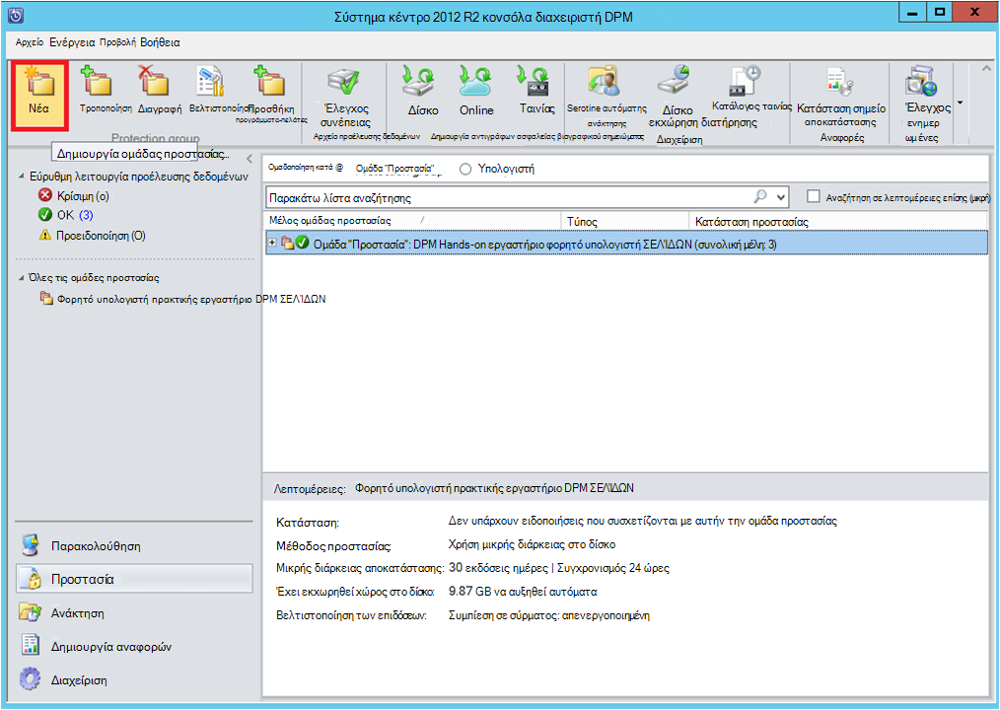

3. DPM εμφανίζει την οθόνη έναρξης με την καθοδήγηση σχετικά με τη δημιουργία μιας **Ομάδας προστασίας**. Κάντε κλικ στο κουμπί **Επόμενο**.

4. Επιλέξτε **τους διακομιστές**.

    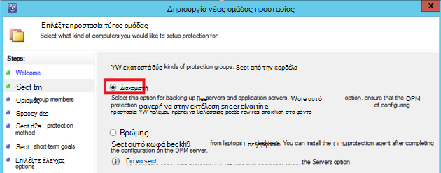

5. Αναπτύξτε τον SQL Server υπολογιστή όπου υπάρχουν τις βάσεις δεδομένων με τη δημιουργία αντιγράφων ασφαλείας. DPM εμφανίζει διάφορες προελεύσεις δεδομένων που μπορούν να δημιουργηθούν αντίγραφα ασφαλείας από αυτόν το διακομιστή. Αναπτύξτε το **Όλα τα κοινόχρηστα στοιχεία SQL** και επιλέξτε τις βάσεις δεδομένων (σε αυτήν την περίπτωση θα σας επιλεγμένο ReportServer$ MSDPM2012 και ReportServer$ MSDPM2012TempDB) δημιουργία αντιγράφων ασφαλείας. Κάντε κλικ στο κουμπί **Επόμενο**.

    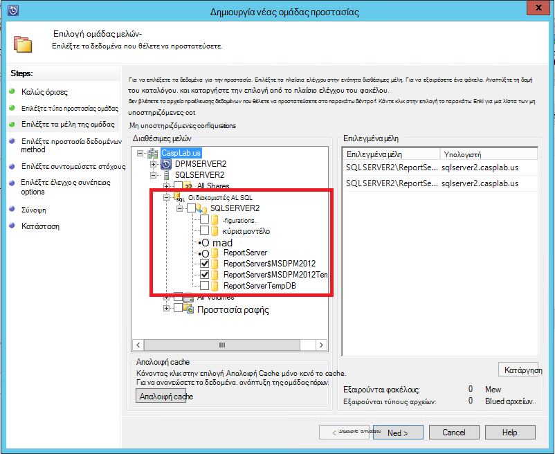

6. Δώστε ένα όνομα για την ομάδα "Προστασία" και επιλέξτε το πλαίσιο ελέγχου **θέλω online Protection** .

    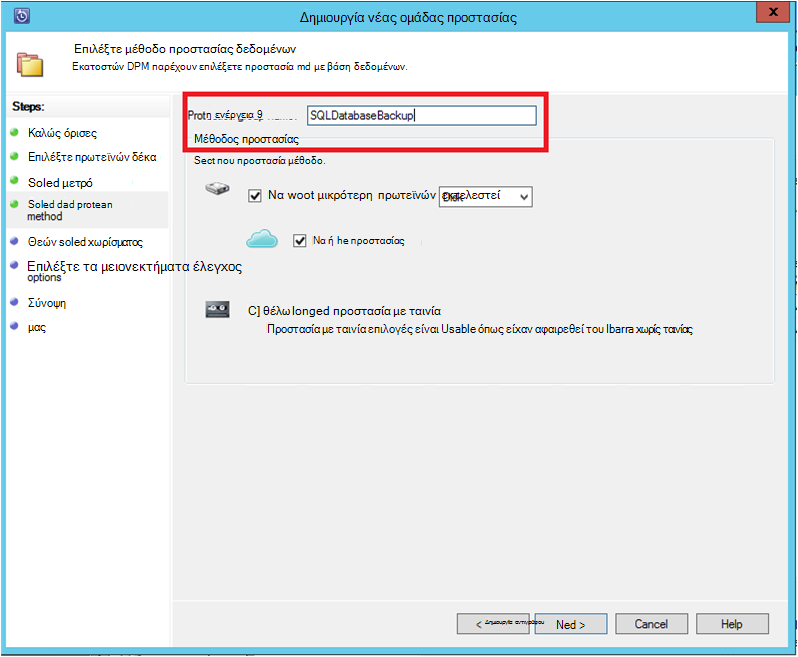

7. Στην οθόνη **Καθορίσετε Short-Term στόχους** , συμπεριλάβετε τα απαραίτητα δεδομένα εισόδου για να δημιουργήσετε αντίγραφο ασφαλείας σημεία στο δίσκο.

    Εδώ θα δούμε ότι **περιοχή διατήρησης** έχει οριστεί σε *5 ημερών*, **συχνότητα συγχρονισμού** έχει οριστεί σε μία φορά κάθε *15 λεπτά* που είναι η συχνότητα με την οποία έχει ληφθεί αντίγραφο ασφαλείας. **Express πλήρες αντίγραφο ασφαλείας** έχει οριστεί σε *8:00 Μ.Μ*.

    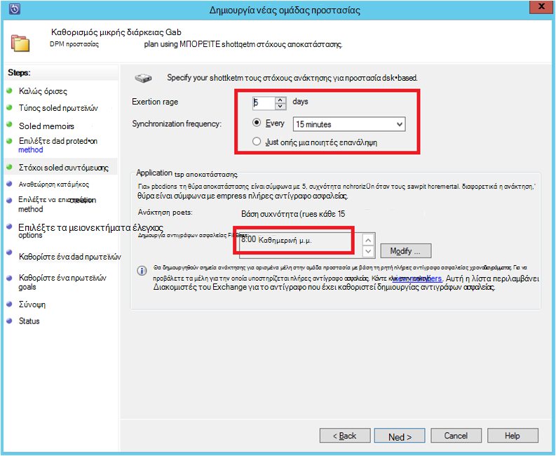

    >[AZURE.NOTE] Στις 8:00 μμ (σύμφωνα με την οθόνη εισόδου) δημιουργίας αντιγράφων ασφαλείας δημιουργείται ένα σημείο καθημερινά με μεταφορά των δεδομένων που έχει τροποποιηθεί από την προηγούμενη ημέρα 8:00 μμ αντιγράφου ασφαλείας σημείο. Αυτή η διαδικασία ονομάζεται **Express πλήρες αντίγραφο ασφαλείας**. Ενώ η συναλλαγή είναι συγχρονισμένα αρχεία καταγραφής κάθε 15 λεπτά, εάν υπάρχει ανάγκη για να ανακτήσετε τη βάση δεδομένων στις 9:00 μμ –, στη συνέχεια, στο σημείο που έχει δημιουργηθεί από αναπαραγωγή τα αρχεία καταγραφής από την τελευταία express πλήρες αντίγραφο ασφαλείας σημείο (8 μ.μ. σε αυτήν την περίπτωση).

8. Κάντε κλικ στο κουμπί **Επόμενο**

    DPM εμφανίζει το συνολικό διαθέσιμο χώρο αποθήκευσης και τα πιθανά αξιοποίηση χώρο του δίσκου.

    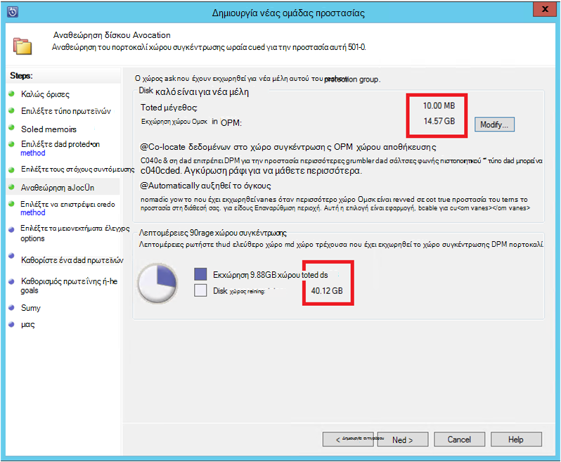

    Από προεπιλογή, DPM δημιουργεί μία όγκος ανά αρχείο προέλευσης δεδομένων (βάση δεδομένων SQL Server) που χρησιμοποιείται για το αρχικό αντίγραφο ασφαλείας. Χρησιμοποιώντας αυτήν την προσέγγιση, η Διαχείριση λογικού δίσκου (LDM) όρια DPM προστασία σε προελεύσεις δεδομένων 300 (βάσεις δεδομένων SQL Server). Για να επιλύσετε αυτόν τον περιορισμό, επιλέξτε την **από κοινού εντοπίσετε δεδομένα στο χώρο συγκέντρωσης DPM χώρου αποθήκευσης**, η επιλογή. Εάν χρησιμοποιείτε αυτήν την επιλογή, DPM χρησιμοποιεί ένα μεμονωμένο ένταση για πολλές προελεύσεις δεδομένων, που επιτρέπει την DPM για την προστασία έως και 2.000 βάσεις δεδομένων SQL.

    Εάν είναι ενεργοποιημένη η επιλογή **Αυτόματη μεγέθυνση του όγκους** , DPM να λογαριασμού για την αύξηση του όγκου δημιουργίας αντιγράφων ασφαλείας καθώς εξελίσσεται τα δεδομένα παραγωγής. Εάν δεν είναι επιλεγμένη η επιλογή **Αυτόματη μεγέθυνση του όγκους** , DPM περιορίζει το αποθήκευσης αντιγράφων ασφαλείας που χρησιμοποιούνται για τις προελεύσεις δεδομένων στην ομάδα προστασία.

9. Οι διαχειριστές δίνεται η επιλογή μεταφορά αυτό το αρχικό αντίγραφο ασφαλείας με μη αυτόματο τρόπο (εκτός δικτύου) για να αποφευχθεί η συμφόρηση εύρους ζώνης ή μέσω του δικτύου. Επίσης, που μπορούν να ρυθμίσουν την ώρα κατά την οποία μπορεί να συμβεί η αρχική μεταφορά. Κάντε κλικ στο κουμπί **Επόμενο**.

    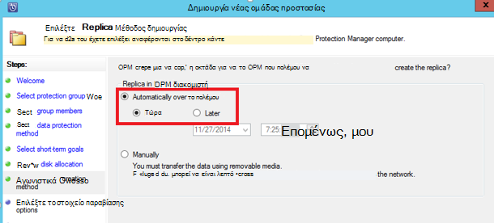

    Το αρχικό αντίγραφο ασφαλείας απαιτεί μεταφορά του αρχείου προέλευσης δεδομένων ολόκληρο (βάση δεδομένων SQL Server) από το διακομιστή παραγωγής (μηχάνημα SQL Server) στο διακομιστή DPM. Αυτά τα δεδομένα μπορεί να είναι μεγάλη και τη μεταφορά δεδομένων μέσω του δικτύου μπορεί να υπερβαίνει το εύρος ζώνης. Για αυτόν το λόγο, οι διαχειριστές μπορούν να επιλέξετε για να μεταφέρετε το αρχικό αντίγραφο ασφαλείας: **με μη αυτόματο τρόπο** (χρησιμοποιώντας αφαιρούμενο μέσο) για την αποφυγή συμφόρηση εύρους ζώνης ή **αυτόματα μέσω του δικτύου** (σε ένα καθορισμένο χρονικό διάστημα).

    Μόλις ολοκληρωθεί η αρχική δημιουργία αντιγράφων ασφαλείας, το υπόλοιπο των αντιγράφων ασφαλείας είναι αυξάνονται αντίγραφα ασφαλείας σε το αρχικό αντίγραφο ασφαλείας. Τμηματική αντίγραφα ασφαλείας τάση να είναι μικρό και μεταβιβάζονται εύκολα μέσω του δικτύου.

10. Επιλογή όταν θέλετε ο έλεγχος συνέπειας για να εκτελέσετε και κάντε κλικ στο κουμπί **Επόμενο**.

    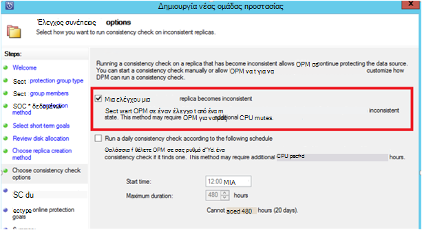

    DPM μπορεί να εκτελέσει μια συνέπειας ελέγχου για να ελέγξετε την ακεραιότητα του σημείου δημιουργίας αντιγράφων ασφαλείας. Υπολογίζει το άθροισμα ελέγχου του αρχείου αντιγράφου ασφαλείας στο διακομιστή παραγωγής (σε αυτό το σενάριο υπολογιστή SQL Server) και τα δεδομένα των αντιγράφων ασφαλείας για αυτό το αρχείο στο DPM. Στην περίπτωση διένεξης, θεωρείται ότι το αρχείο αντίγραφα ασφαλείας σε DPM έχει καταστραφεί. DPM rectifies τα δεδομένα των αντιγράφων ασφαλείας μέσω της αποστολής τα μπλοκ αντιστοιχεί την ασυμφωνία άθροισμα ελέγχου. Όπως ο έλεγχος συνέπειας μιας λειτουργίας απόδοσης στενής, οι διαχειριστές έχουν τη δυνατότητα προγραμματισμού ο έλεγχος συνέπειας ή αυτόματη εκτέλεση.

11. Για να καθορίσετε online προστασίας από τα αρχεία προέλευσης δεδομένων, επιλέξτε τις βάσεις δεδομένων για να προστατευτούν σε Azure και κάντε κλικ στο κουμπί **Επόμενο**.

    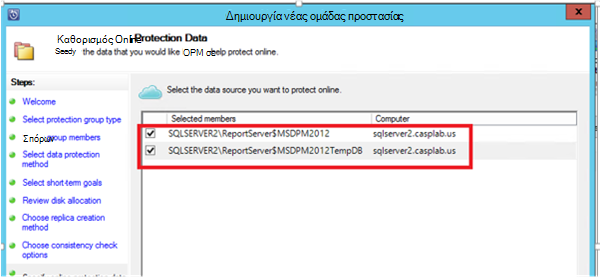

12. Οι διαχειριστές μπορούν να επιλέξετε αντιγράφου ασφαλείας χρονοδιαγράμματα και πολιτικές διατήρησης που να ανταποκρίνονται στις πολιτικές της εταιρείας τους.

    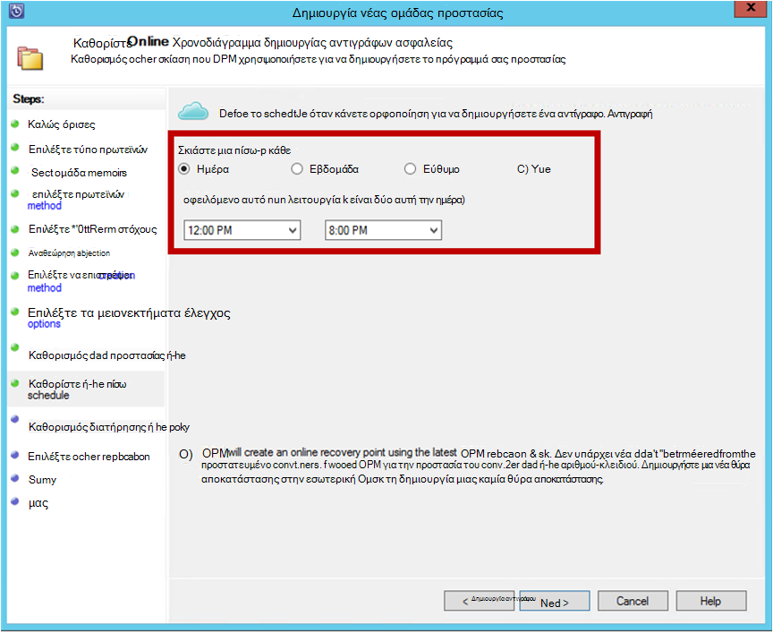

    Σε αυτό το παράδειγμα, δημιουργία αντιγράφων ασφαλείας λαμβάνονται μία φορά την ημέρα 12:00 μμ και μμ 8 (κάτω μέρος της οθόνης)

    >[AZURE.NOTE] Είναι μια καλή πρακτική να έχετε ορισμένα σημεία αποκατάστασης μικρής διάρκειας στο δίσκο, γρήγορη ανάκτηση. Αυτά τα σημεία αποκατάστασης που χρησιμοποιούνται για την "ανάκτηση της λειτουργίας". Azure λειτουργεί ως μια θέση καλή εξωτερικός με υψηλότερη SLA και εγγυάται διαθεσιμότητα.

    **Βέλτιστη πρακτική**: Βεβαιωθείτε ότι είναι προγραμματισμένες αντίγραφα ασφαλείας Azure μετά την ολοκλήρωση της αντίγραφα ασφαλείας στον τοπικό δίσκο χρησιμοποιώντας DPM. Αυτή η δυνατότητα επιτρέπει την πιο πρόσφατη δημιουργίας αντιγράφων ασφαλείας για να αντιγραφεί σε Azure.

13. Επιλέξτε το χρονοδιάγραμμα πολιτικής διατήρησης. Τις πληροφορίες σχετικά με τον τρόπο λειτουργίας της πολιτικής διατήρησης παρέχονται στο [Αντίγραφο ασφαλείας Azure χρήση για να αντικαταστήσετε το άρθρο υποδομή ταινίας](backup-azure-backup-cloud-as-tape.md).

    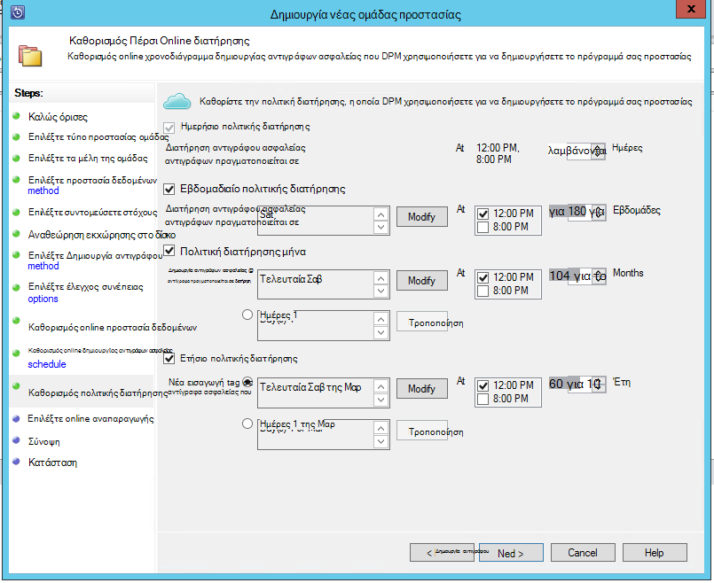

    Σε αυτό το παράδειγμα:

    - Δημιουργία αντιγράφων ασφαλείας λαμβάνονται μία φορά την ημέρα 12:00 μμ και μμ 8 (κάτω μέρος της οθόνης) και διατηρούνται για 180 ημέρες.
    - Το αντίγραφο ασφαλείας Σάββατο στις 12:00 μ.μ. διατηρούνται για 104 εβδομάδες
    - Το αντίγραφο ασφαλείας τελευταίου Σαββάτου στις 12:00 μ.μ. διατηρούνται για 60 μήνες
    - Το αντίγραφο ασφαλείας τελευταίο Σάββατο του Μαρτίου στις 12:00 μ.μ. διατηρούνται για 10 ετών

14. Κάντε κλικ στο κουμπί **Επόμενο** και επιλέξτε την κατάλληλη επιλογή για να μεταφέρετε το αρχικό αντίγραφο ασφαλείας σε Azure. Μπορείτε να επιλέξετε **αυτόματα μέσω του δικτύου** ή **Χωρίς σύνδεση δημιουργίας αντιγράφων ασφαλείας**.

    - **Αυτόματα μέσω του δικτύου** μεταφέρει τα δεδομένα αντιγράφου ασφαλείας Azure σύμφωνα με το χρονοδιάγραμμα επιλέξει για δημιουργία αντιγράφων ασφαλείας.
    - Πώς λειτουργεί η **Χωρίς σύνδεση δημιουργίας αντιγράφων ασφαλείας** εξηγείται στη [ροή εργασίας χωρίς σύνδεση δημιουργίας αντιγράφων ασφαλείας στο Azure δημιουργίας αντιγράφων ασφαλείας](backup-azure-backup-import-export.md).

    Επιλέξτε το μηχανισμό σχετικές μεταφοράς για να στείλετε το αρχικό αντίγραφο ασφαλείας σε Azure και κάντε κλικ στο κουμπί **Επόμενο**.

15. Όταν αναθεωρείτε τα στοιχεία της πολιτικής στην οθόνη **Summary** , κάντε κλικ στο κουμπί **Δημιουργία ομάδας** για την ολοκλήρωση της ροής εργασίας. Μπορείτε να κάντε κλικ στο κουμπί **Κλείσιμο** και να παρακολουθήσετε την πρόοδο του έργου σε χώρο εργασίας παρακολούθησης.

    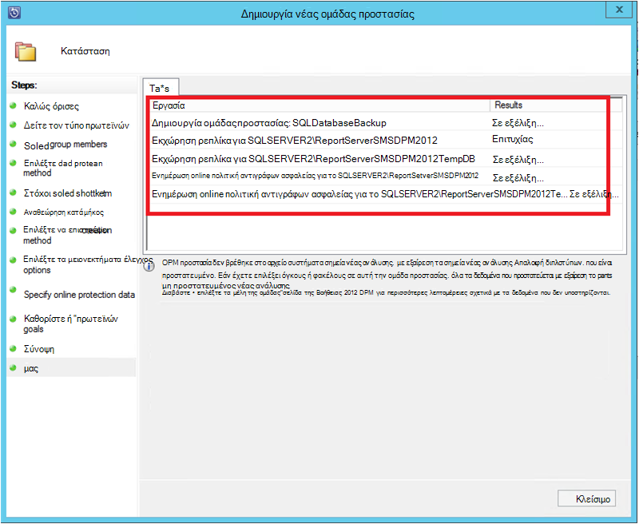

## Δημιουργία αντιγράφων ασφαλείας σε ζήτηση μιας βάσης δεδομένων SQL Server
Κατά τη δημιουργία ενός αντιγράφου ασφαλείας πολιτικής τα προηγούμενα βήματα, δημιουργείται ένα σημείο"ανάκτηση" μόνο όταν παρουσιάζεται το πρώτο αντίγραφο ασφαλείας. Αντί για το χρονοδιάγραμμα για την εκκίνηση αναμονή, τα βήματα κάτω από τη δημιουργία αποκατάστασης έναυσμα σημείο με μη αυτόματο τρόπο.

1. Περιμένετε έως ότου η κατάσταση προστασίας ομάδας εμφανίζει **OK** για τη βάση δεδομένων πριν από τη δημιουργία του σημείου αποκατάστασης.

    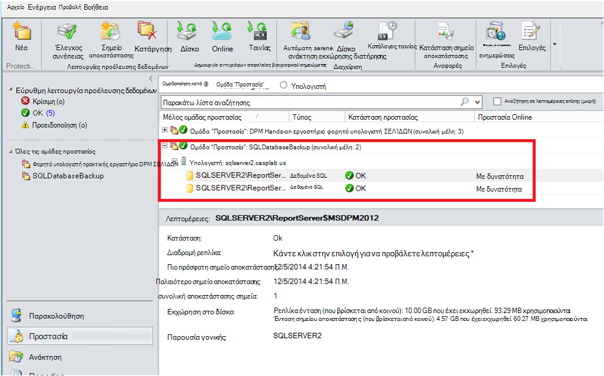

2. Κάντε δεξί κλικ στη βάση δεδομένων και επιλέξτε **Δημιουργία σημείου αποκατάστασης**.

    

3. Επιλέξτε **Online Protection** στο αναπτυσσόμενο μενού και κάντε κλικ στο κουμπί **OK**. Ξεκινά τη δημιουργία ενός σημείου αποκατάστασης στο Azure.

    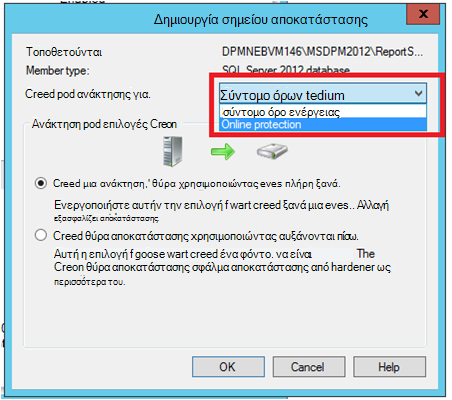

4. Μπορείτε να προβάλετε την πρόοδο του έργου στο χώρο εργασίας **παρακολούθησης** όπου θα βρείτε την πρόοδο σε μια εργασία, όπως αυτό που απεικονίζεται στην επόμενη εικόνα.

    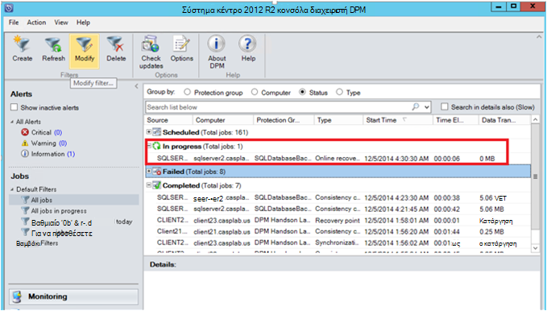

## Ανάκτηση μιας βάσης δεδομένων SQL Server από το Azure
Για να ανακτήσετε μια προστατευμένη οντότητα (βάση δεδομένων SQL Server) από το Azure απαιτούνται τα παρακάτω βήματα.

1. Ανοίξτε το διακομιστή DPM Κονσόλα διαχείρισης. Μεταβείτε σε χώρο εργασίας **ανάκτησης** , όπου μπορείτε να δείτε τους διακομιστές αντίγραφα ασφαλείας με DPM. Αναζήτηση στη βάση δεδομένων απαιτείται (σε αυτό πεζών-κεφαλαίων ReportServer$ MSDPM2012). Επιλέξτε μια διάρκεια **αποκατάστασης από** που τελειώνει με **Online**.

    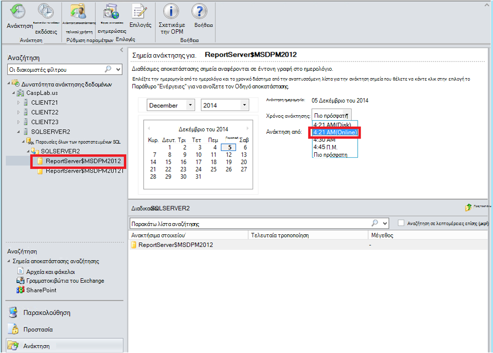

2. Κάντε δεξί κλικ στο όνομα της βάσης δεδομένων και κάντε κλικ στην επιλογή **Ανάκτηση**.

    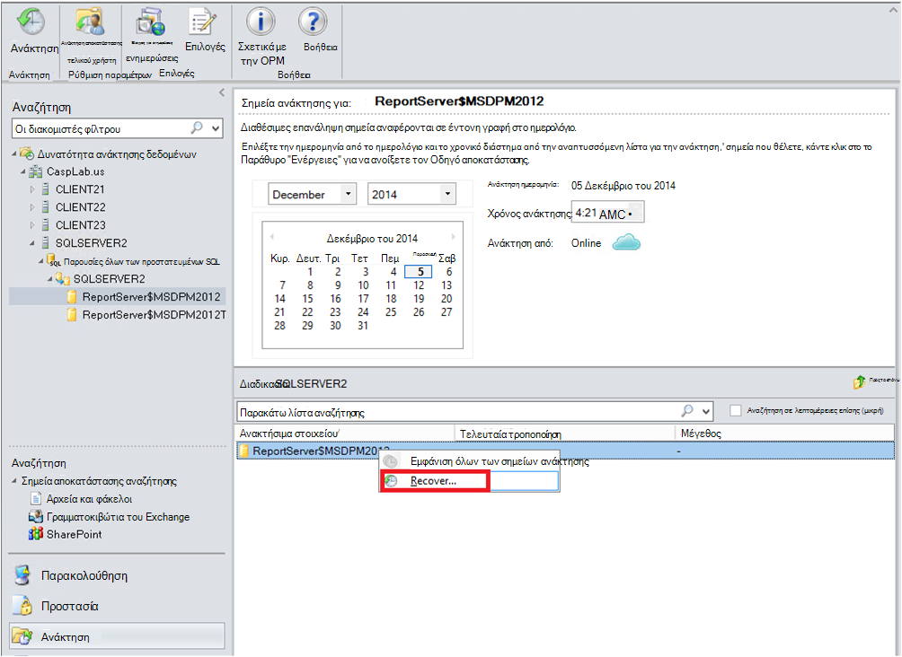

3. DPM εμφανίζει τις λεπτομέρειες του σημείου αποκατάστασης. Κάντε κλικ στο κουμπί **Επόμενο**. Για να αντικαταστήσετε τη βάση δεδομένων, επιλέξτε τον τύπο αποκατάστασης **Ανάκτηση σε αρχικό παρουσία του SQL Server**. Κάντε κλικ στο κουμπί **Επόμενο**.

    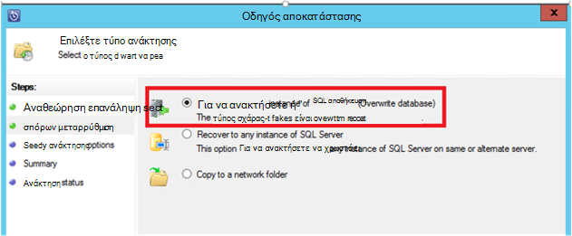

    Σε αυτό το παράδειγμα, DPM επιτρέπει την ανάκτηση της βάσης δεδομένων σε μια άλλη παρουσία του SQL Server ή σε ένα μεμονωμένο φάκελο δικτύου.

4. Στην οθόνη **Επιλογές αποκατάστασης που καθορίζετε** , μπορείτε να επιλέξετε τις επιλογές αποκατάστασης όπως περιορισμού χρήση εύρους ζώνης δικτύου για να ρυθμίσετε το εύρος ζώνης που χρησιμοποιείται από το αποκατάστασης. Κάντε κλικ στο κουμπί **Επόμενο**.

5. Στην οθόνη **Σύνοψη** , μπορείτε να δείτε όλες τις αποκατάστασης ρυθμίσεις παραμέτρων που παρέχεται μέχρι στιγμής. Κάντε κλικ στην επιλογή **Ανάκτηση**.

    Η κατάσταση ανάκτησης εμφανίζεται στη βάση δεδομένων που έχει τεθεί ανάκτησης. Μπορείτε να επιλέξετε το **Κλείσιμο** για να κλείσετε τον οδηγό και προβολή της προόδου στο χώρο εργασίας **παρακολούθησης** .

    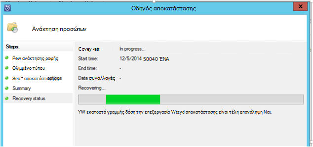

    Μόλις ολοκληρωθεί η ανάκτηση, η Επαναφορά βάσης δεδομένων είναι εφαρμογή συνεπή.

### Επόμενα βήματα:

• [Azure αντιγράφου ασφαλείας συνήθεις Ερωτήσεις](backup-azure-backup-faq.md)
