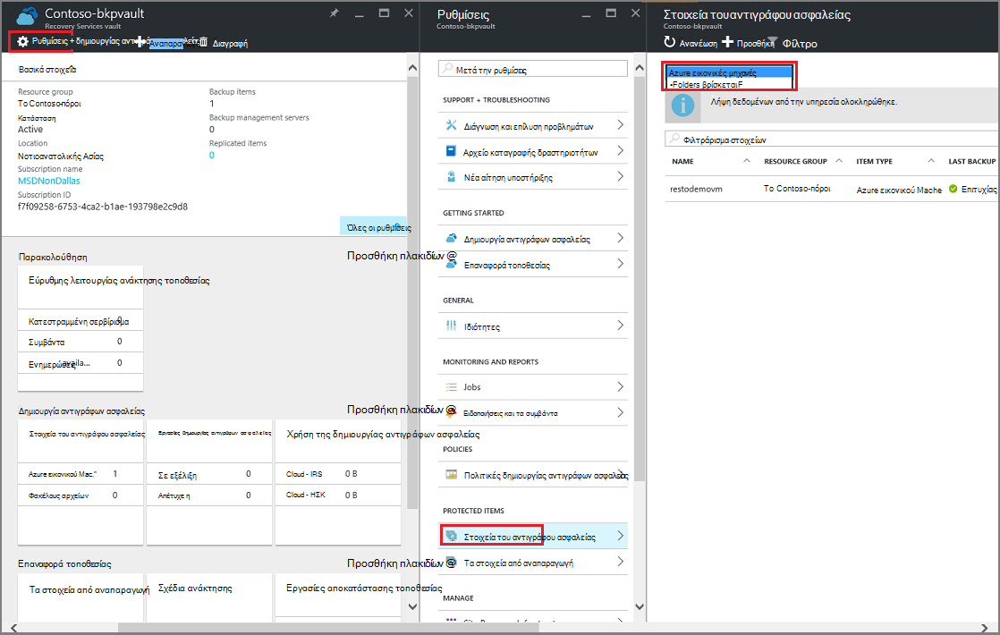
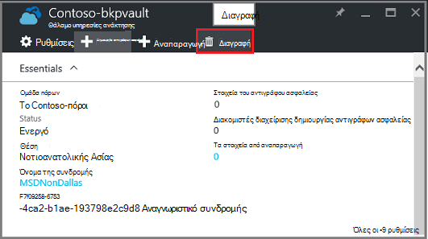

<properties
   pageTitle="Διαγράψτε ένα αντίγραφο ασφαλείας Azure θάλαμο | Microsoft Azure"
   description="Μάθετε πώς μπορείτε να διαγράψετε ένα αντίγραφο ασφαλείας Azure θάλαμο. Αντιμετώπιση προβλημάτων για ποιο λόγο δεν μπορείτε να διαγράψετε ένα αντίγραφο ασφαλείας θάλαμο. "
   services="service-name"
   documentationCenter="dev-center-name"
   authors="markgalioto"
   manager="cfreeman"
   editor=""/>

<tags
   ms.service="backup"
   ms.devlang="na"
   ms.topic="article"
   ms.tgt_pltfrm="na"
   ms.workload="storage-backup-recovery"
   ms.date="08/29/2016"
   ms.author="markgal;trinadhk"/>

# Διαγραφή ενός θάλαμο Azure δημιουργίας αντιγράφων ασφαλείας

Η υπηρεσία Azure δημιουργίας αντιγράφων ασφαλείας έχει δύο τύπους χώροι φύλαξης - θάλαμο το αντίγραφο ασφαλείας και το θάλαμο υπηρεσίες ανάκτησης. Το αντίγραφο ασφαλείας θάλαμο προήλθε πρώτη. Στη συνέχεια, το θάλαμο υπηρεσίες ανάκτησης ήταν ήδη κατά μήκος για την υποστήριξη το ανεπτυγμένο αναπτύξεις διαχείριση πόρων. Λόγω ανεπτυγμένο τις δυνατότητες και τις εξαρτήσεις πληροφορίες που πρέπει να είναι αποθηκευμένα στο το θάλαμο, η διαγραφή μιας θάλαμο υπηρεσίες ανάκτησης μπορεί να φαίνεται δυσκολότερη από αυτό πρέπει να είναι.

|**Τύπος ανάπτυξης**|**Πύλη**|**Όνομα θάλαμο**|
|--------------|----------|---------|
|Κλασικό|Κλασικό|Θάλαμο δημιουργίας αντιγράφων ασφαλείας|
|Διαχείριση πόρων|Azure|Θάλαμο υπηρεσίες ανάκτησης|

> [AZURE.NOTE] Χώροι φύλαξης αντιγράφων ασφαλείας δεν μπορεί να προστατεύσει αναπτυχθεί από διαχειριστή πόρων λύσεις. Ωστόσο, μπορείτε να χρησιμοποιήσετε ένα θάλαμο υπηρεσίες ανάκτησης για να προστατεύσετε classically ανεπτυγμένος διακομιστές και ΣΠΣ.  

Σε αυτό το άρθρο, μπορούμε να χρησιμοποιήσουμε τον όρο, θάλαμο, για να ανατρέξετε στη φόρμα γενικής χρήσης της δημιουργίας αντιγράφων ασφαλείας θάλαμο ή υπηρεσίες ανάκτησης θάλαμο. Χρησιμοποιούμε το επίσημο όνομα, θάλαμο δημιουργίας αντιγράφων ασφαλείας ή θάλαμο υπηρεσίες ανάκτησης, όταν είναι απαραίτητο για να διακρίνουν το χώροι φύλαξης.

## Διαγραφή ενός θάλαμο υπηρεσίες ανάκτησης

Διαγραφή ένα θάλαμο υπηρεσίες ανάκτησης είναι μια διαδικασία ενός βήματος - *που παρέχεται το θάλαμο δεν περιέχει όλους τους πόρους*. Για να διαγράψετε ένα θάλαμο υπηρεσίες ανάκτησης, πρέπει να καταργήσετε ή να διαγράψετε όλους τους πόρους του θάλαμο. Εάν επιχειρήσετε να διαγράψετε ένα θάλαμο που περιέχει τους πόρους, θα λάβετε ένα σφάλμα, όπως η παρακάτω εικόνα.

  

Μέχρι να καταργήσατε τους πόρους από το θάλαμο, κάνοντας κλικ στην επιλογή **Επανάληψη** παράγει το ίδιο σφάλμα. Εάν είστε κολλήσει σε αυτό το μήνυμα σφάλματος, κάντε κλικ στην επιλογή **Ακύρωση** και ακολουθήστε τα παρακάτω βήματα για να διαγράψετε τους πόρους στο το θάλαμο υπηρεσίες ανάκτησης.

### Κατάργηση των στοιχείων από ένα θάλαμο προστασία μια εικονική Μηχανή

Εάν έχετε ήδη εγκαταστήσει το θάλαμο υπηρεσίες ανάκτησης ανοίξετε, μεταβείτε στο το δεύτερο βήμα.

1.  Ανοίξτε την πύλη του Azure και από τον πίνακα εργαλείων, ανοίξτε το θάλαμο που θέλετε να διαγράψετε.

    Εάν δεν έχετε το θάλαμο υπηρεσίες ανάκτησης καρφιτσωμένα στον πίνακα εργαλείων, στο μενού διανομέα, κάντε κλικ στην επιλογή **Περισσότερες υπηρεσίες** και στη λίστα των πόρων, πληκτρολογήστε **Υπηρεσίες ανάκτησης**. Καθώς αρχίζετε να πληκτρολογείτε, η λίστα φίλτρων που βασίζονται σε δεδομένα εισόδου σας. Κάντε κλικ στην επιλογή **υπηρεσίες ανάκτησης χώροι φύλαξης**.

      

    Εμφανίζεται η λίστα των χώροι φύλαξης υπηρεσίες ανάκτησης. Από τη λίστα, επιλέξτε το θάλαμο που θέλετε να διαγράψετε.

    

2. Στην προβολή θάλαμο, εξετάστε το παράθυρο **Essentials** . Για να διαγράψετε ένα θάλαμο, δεν μπορεί να τα προστατευμένα στοιχεία. Εάν δείτε έναν αριθμό, εκτός από το μηδέν, στην περιοχή **Στοιχεία δημιουργίας αντιγράφων ασφαλείας** ή **διακομιστές διαχείρισης αντίγραφο ασφαλείας**, πρέπει να καταργήσετε αυτά τα στοιχεία για να διαγράψετε το θάλαμο.

    

    ΣΠΣ και αρχεία, φακέλους θεωρούνται στοιχεία δημιουργίας αντιγράφων ασφαλείας και παρατίθενται στην περιοχή **Στοιχεία δημιουργίας αντιγράφων ασφαλείας** του παραθύρου Essentials. Διακομιστής DPM παρατίθεται στην περιοχή **Διακομιστής διαχείρισης δημιουργίας αντιγράφων ασφαλείας** του παραθύρου Essentials. **Αναπαραγωγή στοιχεία** αφορούν την υπηρεσία Azure Επαναφορά τοποθεσίας.

3. Για να ξεκινήσετε την κατάργηση τα προστατευμένα στοιχεία από το θάλαμο, βρείτε τα στοιχεία σε το θάλαμο. Στον πίνακα εργαλείων θάλαμο κάντε κλικ στην επιλογή **Ρυθμίσεις**και, στη συνέχεια, κάντε κλικ στην επιλογή **στοιχεία δημιουργίας αντιγράφων ασφαλείας** για να ανοίξετε αυτόν blade.

    

    Το **Αντίγραφο ασφαλείας στοιχεία** blade έχει ξεχωριστές λίστες, με βάση τον τύπο του στοιχείου: εικονικές μηχανές Windows Azure ή φακέλους αρχείων (δείτε την εικόνα). Η προεπιλεγμένη λίστα Τύπος στοιχείου που εμφανίζεται είναι εικονικές μηχανές Windows Azure. Για να προβάλετε τη λίστα των στοιχείων τους φακέλους αρχείων του θάλαμο, επιλέξτε **Τους φακέλους αρχείων** από το αναπτυσσόμενο μενού.

4. Για να διαγράψετε ένα στοιχείο από το θάλαμο προστασία μια Εικονική, πρέπει να Διακοπή εργασίας δημιουργίας αντιγράφων ασφαλείας του στοιχείου και να διαγράψετε τα δεδομένα σημείο αποκατάστασης. Για κάθε στοιχείο της το θάλαμο, ακολουθήστε τα παρακάτω βήματα:

    μια. Στην blade τα **Στοιχεία του αντιγράφου ασφαλείας** , κάντε δεξί κλικ στο στοιχείο και από το μενού περιβάλλοντος, επιλέξτε **Διακοπή της δημιουργίας αντιγράφων ασφαλείας**.

    

    Ανοίγει το blade διακοπή δημιουργίας αντιγράφων ασφαλείας.

    β. Στην τη **Διακοπή της δημιουργίας αντιγράφων ασφαλείας** blade, από το μενού **Επιλέξτε μια επιλογή** , επιλέξτε **Διαγραφή δεδομένων αντιγράφων ασφαλείας** > πληκτρολογήστε το όνομα του στοιχείου > και κάντε κλικ στην επιλογή **Διακοπή δημιουργίας αντιγράφων ασφαλείας**.

      Πληκτρολογήστε το όνομα του στοιχείου για να επαληθεύσετε που θέλετε να διαγράψετε. Το κουμπί **Διακοπή δημιουργίας αντιγράφων ασφαλείας** δεν θα ενεργοποιήσει μέχρι να επιβεβαιώσετε στο στοιχείο για να διακόψετε. Εάν δεν βλέπετε το παράθυρο διαλόγου για να πληκτρολογήσετε το όνομα του στοιχείου δημιουργίας αντιγράφων ασφαλείας, που έχετε επιλέξει την επιλογή **Διατήρηση αντιγράφου ασφαλείας των δεδομένων** .

    

      Προαιρετικά, μπορείτε να δώσετε ένα λόγο για ποιο λόγο που διαγράφετε τα δεδομένα και η προσθήκη σχολίων. Αφού κάνετε κλικ στο κουμπί **Διακοπή αντίγραφο ασφαλείας**, να επιτρέπεται η διαγραφή να ολοκληρωθεί η εργασία πριν να επιχειρήσετε να διαγράψετε το θάλαμο. Για να επαληθεύσετε ότι η εργασία έχει ολοκληρωθεί, ελέγξτε τα μηνύματα Azure .  
   Μόλις ολοκληρωθεί η εργασία, θα λάβετε ένα μήνυμα που αναφέρει διακόπηκε η διαδικασία δημιουργίας αντιγράφων ασφαλείας και τα δεδομένα αντιγράφου ασφαλείας έχει διαγραφεί για αυτό το στοιχείο.

    c. Μετά τη διαγραφή ενός στοιχείου στη λίστα, στο μενού **Στοιχείων αντίγραφο ασφαλείας** , κάντε κλικ στο κουμπί **Ανανέωση** για να δείτε τα υπόλοιπα στοιχεία στο το θάλαμο.

      

      Όταν υπάρχουν στοιχεία στη λίστα, κάντε κύλιση στο παράθυρο **βασικά στοιχεία για** τη δημιουργία αντιγράφων ασφαλείας blade θάλαμο. Δεν θα πρέπει να υπάρχουν οποιαδήποτε **στοιχεία αντίγραφο ασφαλείας**, **διακομιστές διαχείρισης δημιουργίας αντιγράφων ασφαλείας**ή **από αναπαραγωγή στοιχεία** που εμφανίζονται. Εάν στοιχεία εξακολουθεί να εμφανίζεται στο το θάλαμο, επιστρέψτε στο βήμα 3 παραπάνω και επιλέξτε ένα διαφορετικό στοιχείο λίστα Τύπος.  

5. Όταν υπάρχουν περισσότερα στοιχεία από τη γραμμή εργαλείων θάλαμο, κάντε κλικ στην επιλογή **Διαγραφή**.

    

6. Όταν σας ζητηθεί να επιβεβαιώσετε ότι θέλετε να διαγράψετε το θάλαμο, κάντε κλικ στο κουμπί **Ναι**.

    Το θάλαμο διαγράφεται και επιστρέφει την πύλη του μενού **Δημιουργία** υπηρεσίας.

## Τι γίνεται αν διακοπεί η διαδικασία δημιουργίας αντιγράφων ασφαλείας αλλά διατηρούνται τα δεδομένα;

Εάν διακοπεί η διαδικασία δημιουργίας αντιγράφων ασφαλείας, αλλά κατά λάθος *διατηρούνται* τα δεδομένα, πρέπει να διαγράψετε τα δεδομένα αντιγράφου ασφαλείας για να διαγράψετε το θάλαμο. Για να διαγράψετε τα δεδομένα αντιγράφου ασφαλείας:

1. Στην blade τα **Στοιχεία του αντιγράφου ασφαλείας** , κάντε δεξί κλικ στο στοιχείο και από το μενού περιβάλλοντος, κάντε κλικ στην επιλογή **Διαγραφή δεδομένων αντιγράφων ασφαλείας**.

    

    Ανοίγει το blade **Διαγραφή δεδομένων αντιγράφων ασφαλείας** .

2. Στην blade τη **Διαγραφή δεδομένων αντιγράφου ασφαλείας** , πληκτρολογήστε το όνομα του στοιχείου και κάντε κλικ στην επιλογή **Διαγραφή**.

    

    Αφού έχετε διαγράψει τα δεδομένα, μεταβείτε στο βήμα 4c, παραπάνω, και συνεχίστε με τη διαδικασία.

## Διαγραφή ενός θάλαμο που χρησιμοποιείται για την προστασία διακομιστή DPM

Για να διαγράψετε ένα θάλαμο που χρησιμοποιείται για την προστασία διακομιστή DPM, που πρέπει να καταργήστε οποιαδήποτε σημεία αποκατάστασης που έχουν δημιουργηθεί και, στη συνέχεια, καταργήστε το διακομιστή από το θάλαμο.

Για να διαγράψετε τα δεδομένα που σχετίζονται με μια ομάδα προστασία:

1. Στην κονσόλα διαχειριστή DPM, κάντε κλικ στην επιλογή **προστασία**, επιλέξτε μια ομάδα προστασία, επιλέξτε το μέλος της ομάδας προστασίας και στην κορδέλα του εργαλείου, κάντε κλικ στην επιλογή **Κατάργηση**. Πρέπει να επιλέξετε το μέλος για το κουμπί " **Κατάργηση** " για να εμφανίζονται στην κορδέλα του εργαλείου. Στο παράδειγμα, το μέλος είναι **dummyvm9**. Εάν υπάρχουν πολλά μέλη στην ομάδα προστασία, κρατήστε πατημένο το πλήκτρο Ctrl για να επιλέξετε πολλά μέλη.

    

    Ανοίγει το παράθυρο διαλόγου **Κατάργηση προστασίας** .

2. Στο παράθυρο διαλόγου **Κατάργηση προστασίας** , επιλέξτε **Διαγραφή προστασία δεδομένων**και κάντε κλικ στην επιλογή **Διακοπή προστασίας**.

    

    Δεν θέλετε να διατηρούνται προστατευμένα δεδομένα, επειδή χρειάζεστε για να καταργήσετε το θάλαμο για να το διαγράψετε. Ανάλογα με τον αριθμό αποκατάστασης σημεία και όγκο δεδομένων που βρίσκεται στην ομάδα προστασία, ενδέχεται να χρειαστούν σε οποιοδήποτε σημείο από μερικά δευτερόλεπτα για λίγα λεπτά για να διαγράψετε τα δεδομένα. Το παράθυρο διαλόγου **Κατάργηση προστασίας** εμφανίζει την κατάσταση όταν ολοκληρωθεί η εργασία.

    

3. Συνεχίστε αυτήν τη διαδικασία για όλα τα μέλη σε όλες τις ομάδες προστασίας.

    Πρέπει να καταργήσετε όλα τα προστατευμένα δεδομένα και τις ομάδες στις οποίες προστασίας.

4. Μετά τη διαγραφή όλων των μελών από την ομάδα προστασία, μεταβείτε στην πύλη του Azure. Ανοίξτε τον πίνακα εργαλείων θάλαμο και βεβαιωθείτε ότι δεν υπάρχουν **Στοιχεία αντίγραφο ασφαλείας**, **διακομιστές διαχείρισης αντίγραφο ασφαλείας**, ή **στοιχεία από αναπαραγωγή**. Στη γραμμή εργαλείων θάλαμο, κάντε κλικ στην επιλογή **Διαγραφή**.

    

    Εάν υπάρχουν διακομιστές διαχείρισης δημιουργίας αντιγράφων ασφαλείας που έχουν καταχωρηθεί το θάλαμο, δεν θα μπορείτε να διαγράψετε το θάλαμο ακόμα και εάν δεν υπάρχουν δεδομένα στην το θάλαμο. Εάν σκέψης διαγραμμένο τους διακομιστές διαχείρισης δημιουργίας αντιγράφων ασφαλείας που σχετίζονται με το θάλαμο, αλλά εξακολουθούν να υπάρχουν διακομιστές που εμφανίζει στο παράθυρο **Essentials** , ανατρέξτε στο θέμα [Εύρεση τους διακομιστές διαχείρισης δημιουργίας αντιγράφων ασφαλείας που έχουν καταχωρηθεί το θάλαμο](backup-azure-delete-vault.md#find-the-backup-management-servers-registered-to-the-vault).

5. Όταν σας ζητηθεί να επιβεβαιώσετε ότι θέλετε να διαγράψετε το θάλαμο, κάντε κλικ στο κουμπί **Ναι**.

    Το θάλαμο διαγράφεται και επιστρέφει την πύλη του μενού **Δημιουργία** υπηρεσίας.

## Διαγραφή ενός θάλαμο που χρησιμοποιείται για την προστασία ένα διακομιστή παραγωγής

Για να διαγράψετε ένα θάλαμο που χρησιμοποιείται για την προστασία ένα διακομιστή παραγωγής, πρέπει να διαγράψετε ή να unregister διακομιστή από το θάλαμο.

Για να διαγράψετε το διακομιστή παραγωγής που σχετίζεται με το θάλαμο:

1. Στην πύλη του Azure, ανοίξτε τον πίνακα εργαλείων θάλαμο και κάντε κλικ στην επιλογή **Ρυθμίσεις** > **Υποδομή δημιουργίας αντιγράφων ασφαλείας** > **Διακομιστές παραγωγής**.

    

    Το blade **Διακομιστές παραγωγής** ανοίγει και παραθέτει όλους τους διακομιστές παραγωγής το θάλαμο.

    

2. Στην το blade **Διακομιστές παραγωγής** , κάντε δεξί κλικ στο διακομιστή και κάντε κλικ στην επιλογή **Διαγραφή**.

    

    Ανοίγει η **Διαγραφή** blade.

    

3. Στην blade **Διαγραφή** , επιβεβαιώστε ότι το όνομα του διακομιστή για να διαγράψετε και κάντε κλικ στην επιλογή **Διαγραφή**. Πρέπει να εισαγάγετε το όνομα του διακομιστή για να ενεργοποιήσετε το κουμπί **Διαγραφή** σωστά.

    Μόλις το θάλαμο έχει διαγραφεί, θα λάβετε ένα μήνυμα που αναφέρει το θάλαμο έχει διαγραφεί. Μετά τη διαγραφή όλων των διακομιστών του θάλαμο, μεταβείτε με κύλιση ξανά το παράθυρο Essentials στον πίνακα εργαλείων θάλαμο.

4. Στον πίνακα εργαλείων θάλαμο, βεβαιωθείτε ότι δεν υπάρχουν **Στοιχεία αντίγραφο ασφαλείας**, **διακομιστές διαχείρισης αντίγραφο ασφαλείας**, ή **στοιχεία από αναπαραγωγή**. Στη γραμμή εργαλείων θάλαμο, κάντε κλικ στην επιλογή **Διαγραφή**.

5. Όταν σας ζητηθεί να επιβεβαιώσετε ότι θέλετε να διαγράψετε το θάλαμο, κάντε κλικ στο κουμπί **Ναι**.

    Το θάλαμο διαγράφεται και επιστρέφει την πύλη του μενού **Δημιουργία** υπηρεσίας.

## Διαγραφή ενός θάλαμο δημιουργίας αντιγράφων ασφαλείας

Οι παρακάτω οδηγίες θα για τη διαγραφή ενός θάλαμο αντίγραφο ασφαλείας στην πύλη του κλασική. Ένα αντίγραφο ασφαλείας θάλαμο και υπηρεσίες ανάκτησης θάλαμο είναι ίδιες: μπορείτε να διαγράψετε το θάλαμο, διαγραφή των στοιχείων και τα δεδομένα διατηρούνται.

1. Ανοίξτε την πύλη κλασική.

2. Από τη λίστα των αντιγράφων ασφαλείας χώροι φύλαξης, επιλέξτε το θάλαμο που θέλετε να διαγράψετε.

    

    Ανοίγει ο πίνακας εργαλείων θάλαμο. Δείτε τον αριθμό των διακομιστών Windows ή/και του Azure εικονικές μηχανές που σχετίζεται με το θάλαμο. Επίσης, δείτε το συνολικό χώρο αποθήκευσης που καταναλώθηκε στο Azure. Θα χρειαστεί να διακόψετε οποιαδήποτε εργασιών δημιουργίας αντιγράφων ασφαλείας και να διαγράψετε υπάρχοντα δεδομένα πριν από τη διαγραφή του θάλαμο.

3. Κάντε κλικ στην καρτέλα **Προστασία στοιχεία** και, στη συνέχεια, κάντε κλικ στην επιλογή **Διακοπή προστασίας**

    

    Εμφανίζεται το παράθυρο διαλόγου **Κατάργηση προστασίας από 'το θάλαμο'** .

4. Στο παράθυρο διαλόγου **Κατάργηση προστασίας από 'το θάλαμο'** , **Διαγραφή σχετικών δεδομένων αντιγράφων ασφαλείας** και κάντε κλικ στο .  
   Προαιρετικά, μπορείτε να επιλέξετε ένα λόγο για διακοπή προστασίας και παρέχει ένα σχόλιο.

    

    Μετά τη διαγραφή των στοιχείων του θάλαμο, το θάλαμο θα είναι κενή.

    

5. Στη λίστα των καρτελών, κάντε κλικ στην επιλογή **Στοιχεία που έχουν καταχωρηθεί**. Για κάθε στοιχείο που έχουν καταχωρηθεί στο το θάλαμο, επιλέξτε το στοιχείο και κάντε κλικ στην επιλογή **Unregister**.

    

6. Στη λίστα των καρτελών, κάντε κλικ στην επιλογή **Πίνακας εργαλείων** για να ανοίξετε αυτήν την καρτέλα. Επαληθεύστε δεν υπάρχουν καταχωρημένες διακομιστών ή Azure εικονικές μηχανές προστατευμένη στο cloud. Επίσης, βεβαιωθείτε υπάρχει χωρίς δεδομένα στο χώρο αποθήκευσης. Κάντε κλικ στην επιλογή **Διαγραφή** για να διαγράψετε το θάλαμο.

    

    Ανοίγει η οθόνη επιβεβαίωσης θάλαμο διαγραφή δημιουργίας αντιγράφων ασφαλείας. Ενεργοποιήστε μια επιλογή για ποιο λόγο που διαγράφετε το θάλαμο και κάντε κλικ στην επιλογή .  

    

    Το θάλαμο διαγράφεται και επιστροφή σε κλασική πύλης πίνακα εργαλείων.

### Βρείτε τους διακομιστές διαχείρισης δημιουργίας αντιγράφων ασφαλείας που έχουν καταχωρηθεί το θάλαμο

Εάν έχετε πολλούς διακομιστές που έχουν καταχωρηθεί ένα θάλαμο, μπορεί να είναι δύσκολο να θυμάστε τους. Για να δείτε τους διακομιστές που έχουν καταχωρηθεί το θάλαμο και διαγράψτε τους:

1. Ανοίξτε τον πίνακα εργαλείων θάλαμο.

2. Στο παράθυρο **βασικά στοιχεία** , κάντε κλικ στην επιλογή **Ρυθμίσεις** για να ανοίξετε αυτόν blade.

    

3. Στην **blade ρυθμίσεις**, κάντε κλικ στην επιλογή **Υποδομή δημιουργίας αντιγράφων ασφαλείας**.

4. Στην blade την **Υποδομή αντίγραφο ασφαλείας** , κάντε κλικ στην επιλογή **Διακομιστές διαχείρισης δημιουργίας αντιγράφων ασφαλείας**. Ανοίγει το blade διακομιστές διαχείρισης δημιουργίας αντιγράφων ασφαλείας.

    

5. Για να διαγράψετε ένα διακομιστή από τη λίστα, κάντε δεξί κλικ στο όνομα του διακομιστή και, στη συνέχεια, κάντε κλικ στην επιλογή **Διαγραφή**.
    Ανοίγει η **Διαγραφή** blade.

6. Στη blade **Διαγραφή** , δώστε το όνομα του διακομιστή. Εάν πρόκειται για μεγάλο όνομα, μπορείτε να αντιγράψετε και να επικολλήσετε από τη λίστα των διακομιστών διαχείρισης δημιουργίας αντιγράφων ασφαλείας. Στη συνέχεια, κάντε κλικ στην επιλογή **Διαγραφή**.  
