<properties
    pageTitle="Εισαγωγή στο αντίγραφο ασφαλείας Azure DPM | Microsoft Azure"
    description="Εισαγωγή στη δημιουργία αντιγράφων ασφαλείας DPM διακομιστές με την υπηρεσία Azure δημιουργίας αντιγράφων ασφαλείας"
    services="backup"
    documentationCenter=""
    authors="Nkolli1"
    manager="shreeshd"
    editor=""
    keywords="Διαχείριση δεδομένων προστασίας συστήματος κέντρο, Διαχείριση προστασίας δεδομένων, dpm δημιουργίας αντιγράφων ασφαλείας"/>

<tags
    ms.service="backup"
    ms.workload="storage-backup-recovery"
    ms.tgt_pltfrm="na"
    ms.devlang="na"
    ms.topic="article"
    ms.date="08/08/2016"
    ms.author="trinadhk;giridham;jimpark;markgal;adigan"/>

# Προετοιμασία του για να δημιουργήσετε αντίγραφα ασφαλείας φόρτους εργασίας σε Azure με DPM

> [AZURE.SELECTOR]
- [Διακομιστής Azure αντιγράφων ασφαλείας](backup-azure-microsoft-azure-backup.md)
- [SCDPM](backup-azure-dpm-introduction.md)
- [Διακομιστής Azure αντιγράφων ασφαλείας (κλασικό)](backup-azure-microsoft-azure-backup-classic.md)
- [SCDPM (κλασικό)](backup-azure-dpm-introduction-classic.md)

Σε αυτό το άρθρο παρέχει μια εισαγωγή στη χρήση αντίγραφο ασφαλείας του Microsoft Azure για την προστασία σας διακομιστές συστήματος κέντρο δεδομένων προστασίας Manager (DPM) και φόρτους εργασίας. Κατά την ανάγνωση του, θα γνωρίζετε:

- Πώς λειτουργεί η δημιουργία αντιγράφων ασφαλείας διακομιστή Azure DPM
- Τις προϋποθέσεις για την επίτευξη ομαλή εμπειρία δημιουργίας αντιγράφων ασφαλείας
- Το τυπικό Παρουσιάστηκαν σφάλματα και πώς μπορείτε να ασχοληθείτε με τους
- Σενάρια που υποστηρίζονται

> [AZURE.NOTE] Azure περιλαμβάνει δύο μοντέλων ανάπτυξης για τη δημιουργία και εργασία με πόρους: [Διαχείριση πόρων και κλασική](../resource-manager-deployment-model.md). Σε αυτό το άρθρο παρέχει τις πληροφορίες και διαδικασίες για την επαναφορά ΣΠΣ αναπτυχθεί με τη χρήση του μοντέλου από διαχειριστή πόρων.

Κέντρο συστήματος DPM δημιουργεί αντίγραφα ασφαλείας δεδομένων αρχείων και εφαρμογή. Αντίγραφα ασφαλείας για να DPM δεδομένων μπορεί να είναι είναι αποθηκευμένα στην ταινία, σε δίσκο, ή αντίγραφα ασφαλείας σε Azure με αντίγραφα ασφαλείας του Microsoft Azure. DPM αλληλεπιδρά με αντίγραφα ασφαλείας Azure ως εξής:

- **DPM αναπτυχθεί ως μια φυσική διακομιστή ή εσωτερικής εικονική μηχανή** — εάν DPM έχει αναπτυχθεί ως φυσικής διακομιστή ή μπορείτε να δημιουργήσετε αντίγραφα ασφαλείας των δεδομένων σε ένα θάλαμο υπηρεσίες ανάκτησης εκτός από δίσκο και ταινίας μια εσωτερική Hyper-V εικονική μηχανή δημιουργίας αντιγράφων ασφαλείας.
- **DPM αναπτυχθεί ως μια εικονική μηχανή Azure** — από το σύστημα κέντρο 2012 R2 με 3 ενημέρωση, μπορούν να αναπτυχθούν DPM ως μια εικονική μηχανή Azure. Εάν έχει αναπτυχθεί DPM ως ένα Azure εικονικό μηχάνημα που μπορείτε να δημιουργήσετε αντίγραφα ασφαλείας των δεδομένων Azure δίσκων συνδέονται με το DPM Azure εικονική μηχανή ή να μείωση φόρτου το χώρο αποθήκευσης δεδομένων κατά τη δημιουργία αντιγράφων έως και μια θάλαμο υπηρεσίες ανάκτησης.

## Γιατί δημιουργία αντιγράφων ασφαλείας από DPM να Azure;

Τα οφέλη επιχειρήσεις της χρήσης Azure δημιουργίας αντιγράφων ασφαλείας για τη δημιουργία αντιγράφων ασφαλείας των διακομιστών DPM περιλαμβάνουν τα εξής:

- Για την ανάπτυξη DPM εσωτερικής εγκατάστασης, μπορείτε να χρησιμοποιήσετε Azure ως εναλλακτική λύση για να μακροπρόθεσμες ανάπτυξης σε ταινία.
- Για αναπτύξεις DPM στο Azure, δημιουργία αντιγράφων ασφαλείας Azure σάς επιτρέπει να μείωση φόρτου χώρο αποθήκευσης από το Azure δίσκο, επιτρέποντάς σας να κλιμακωθεί προς τα επάνω, με την αποθήκευση παλαιότερων δεδομένων σε νέα δεδομένα στο δίσκο και υπηρεσίες ανάκτησης θάλαμο.

## Προαπαιτούμενα στοιχεία
Προετοιμασία Azure δημιουργίας αντιγράφων ασφαλείας για να δημιουργήσετε αντίγραφα ασφαλείας των δεδομένων DPM ως εξής:

1. **Δημιουργία μιας θάλαμο υπηρεσίες ανάκτησης** -Δημιουργήστε ένα θάλαμο στην πύλη Azure.
2. **Λήψη θάλαμο διαπιστευτήρια** — λήψη τα διαπιστευτήρια που χρησιμοποιείτε για να καταχωρήσετε το διακομιστή DPM για υπηρεσίες ανάκτησης θάλαμο.
3. **Εγκαταστήστε τον παράγοντα αντιγράφων ασφαλείας Azure** — από Azure αντίγραφο ασφαλείας, εγκαταστήστε τον παράγοντα σε κάθε διακομιστή DPM.
4. **Εγγραφείτε στο διακομιστή** — καταχώρηση το διακομιστή DPM σε υπηρεσίες ανάκτησης θάλαμο.

### 1. Δημιουργήστε ένα θάλαμο υπηρεσίες ανάκτησης
Για να δημιουργήσετε ένα θάλαμο υπηρεσίες ανάκτησης:

1. Είσοδος στην [πύλη του Azure](https://portal.azure.com/).

2. Στο μενού διανομέα, κάντε κλικ στο κουμπί **Αναζήτηση** και στη λίστα των πόρων, πληκτρολογήστε **Υπηρεσίες ανάκτησης**. Καθώς αρχίζετε να πληκτρολογείτε, θα φιλτράρετε τη λίστα με βάση τα δεδομένα εισόδου σας. Κάντε κλικ στην επιλογή **υπηρεσίες ανάκτησης θάλαμο**.

    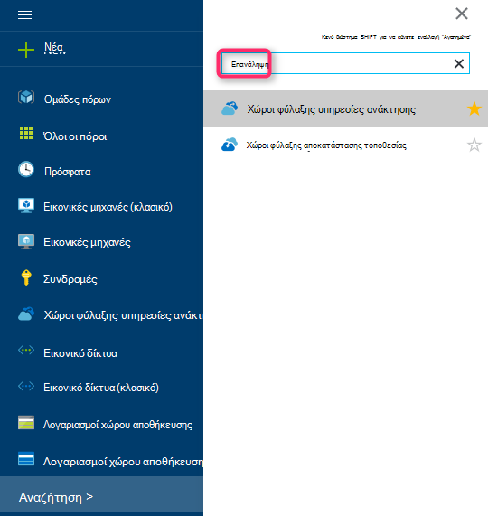

    Εμφανίζεται η λίστα των χώροι φύλαξης υπηρεσίες ανάκτησης.

3. Στο μενού **χώροι φύλαξης υπηρεσίες ανάκτησης** , κάντε κλικ στην επιλογή **Προσθήκη**.

    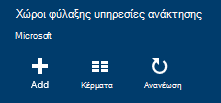

    Ανοίγει το blade θάλαμο υπηρεσίες ανάκτησης, να σας ζητήσει να δώσετε ένα **όνομα**, **τη συνδρομή**, **ομάδα πόρων**και **θέση**.

    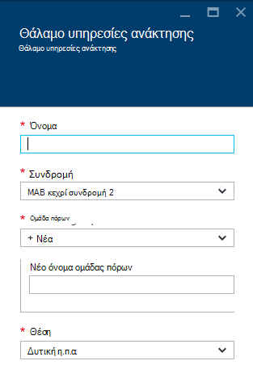

4. **Όνομα**, πληκτρολογήστε ένα φιλικό όνομα για τον προσδιορισμό του θάλαμο. Το όνομα πρέπει να είναι μοναδικό για τη συνδρομή Azure. Πληκτρολογήστε ένα όνομα που περιέχει μεταξύ 2 και 50 χαρακτήρων. Πρέπει να ξεκινούν με γράμμα και μπορούν να περιέχουν μόνο γράμματα, αριθμούς και παύλες.

5. Κάντε κλικ στην **εγγραφή** για να δείτε τη διαθέσιμη λίστα συνδρομών. Εάν δεν είστε βέβαιοι ποια συνδρομή για να χρησιμοποιήσετε, χρησιμοποιήστε την προεπιλεγμένη (ή προτεινόμενες) συνδρομής. Θα υπάρξει πολλαπλές επιλογές μόνο εάν είναι συσχετισμένη με πολλές συνδρομές Azure τον εταιρικό λογαριασμό σας.

6. Κάντε κλικ στην επιλογή **ομάδα πόρων** για να δείτε τη διαθέσιμη λίστα ομάδων πόρων ή κάντε κλικ στην επιλογή **Δημιουργία** για να δημιουργήσετε μια νέα ομάδα πόρων. Για πλήρεις πληροφορίες σχετικά με τις ομάδες πόρων, ανατρέξτε στο θέμα [Επισκόπηση της διαχείρισης πόρων Azure](../azure-resource-manager/resource-group-overview.md)

7. Κάντε κλικ στην επιλογή **θέσης** για να επιλέξετε τη γεωγραφική περιοχή για το θάλαμο.

8. Κάντε κλικ στην επιλογή **Δημιουργία**. Ενδέχεται να χρειαστεί κάποιος χρόνος για το θάλαμο υπηρεσίες ανάκτησης που θα δημιουργηθεί. Παρακολουθείτε τις ειδοποιήσεις κατάστασης στην επάνω δεξιά περιοχή στην πύλη.
Αφού δημιουργηθεί το θάλαμο, ανοίγει στην πύλη.

### Ορισμός αναπαραγωγής χώρου αποθήκευσης

Η επιλογή αναπαραγωγή χώρου αποθήκευσης σας επιτρέπει να επιλέξετε μεταξύ των πλεοναζόντων παν χώρου αποθήκευσης και τοπικά πλεονάζοντα χώρο αποθήκευσης. Από προεπιλογή, το θάλαμο έχει παν πλεονάζοντα χώρο αποθήκευσης. Αφήστε την επιλογή που έχει οριστεί σε παν πλεονάζοντα χώρο αποθήκευσης, εάν πρόκειται για το πρωτεύον αντίγραφο ασφαλείας. Επιλέξτε τοπικά πλεονάζοντα χώρο αποθήκευσης, εάν θέλετε μια επιλογή κοστίζει που δεν είναι απολύτως ως διαρκή. Διαβάστε περισσότερα σχετικά με το [παν πλεονάζοντα](../storage/storage-redundancy.md#geo-redundant-storage) και [τοπικά πλεονάζοντα](../storage/storage-redundancy.md#locally-redundant-storage) επιλογές αποθήκευσης στην [Επισκόπηση αναπαραγωγής Azure αποθήκευσης](../storage/storage-redundancy.md).

Για να επεξεργαστείτε τη ρύθμιση αναπαραγωγής χώρου αποθήκευσης:

1. Επιλέξτε το θάλαμο για να ανοίξετε τον πίνακα εργαλείων θάλαμο και το blade ρυθμίσεις. Εάν δεν ανοίξει το blade **Ρυθμίσεις** , κάντε κλικ στην επιλογή **όλες οι ρυθμίσεις** στον πίνακα εργαλείων θάλαμο.

2. Στην το blade **Ρυθμίσεις** , κάντε κλικ στην **Υποδομή δημιουργίας αντιγράφων ασφαλείας** > **Ρύθμισης παραμέτρων δημιουργίας αντιγράφων ασφαλείας** για να ανοίξετε το blade **Ρύθμισης παραμέτρων δημιουργίας αντιγράφων ασφαλείας** . Στην blade τη **Ρύθμιση παραμέτρων δημιουργίας αντιγράφων ασφαλείας** , ενεργοποιήστε την επιλογή αναπαραγωγή χώρου αποθήκευσης για το θάλαμο.

    

    Αφού επιλέξετε την επιλογή αποθήκευσης για το θάλαμο, είστε έτοιμοι να συσχετίσετε την εικονική Μηχανή με το θάλαμο. Για να ξεκινήσετε τη συσχέτιση, πρέπει να ανακαλύψετε και καταχώρηση του Azure εικονικές μηχανές.

### 2. λήψης διαπιστευτηρίων θάλαμο

Το αρχείο διαπιστευτήρια θάλαμο είναι ένα πιστοποιητικό που δημιουργούνται από την πύλη για κάθε θάλαμο δημιουργίας αντιγράφων ασφαλείας. Η πύλη αποστέλλει, στη συνέχεια, το δημόσιο κλειδί για να την υπηρεσία ελέγχου πρόσβασης (ACS). Το ιδιωτικό κλειδί του πιστοποιητικού γίνεται διαθέσιμη στο χρήστη ως μέρος της ροής εργασίας που δίνεται ως εισαγωγή στη ροή εργασίας εγγραφής υπολογιστή. Αυτό πραγματοποιεί έλεγχο ταυτότητας υπολογιστή για να στείλετε δεδομένα αντιγράφου ασφαλείας σε ένα προσδιορισμένο θάλαμο στην υπηρεσία Azure δημιουργίας αντιγράφων ασφαλείας.

Τα διαπιστευτήρια θάλαμο χρησιμοποιείται μόνο κατά τη διάρκεια της ροής εργασίας εγγραφής. Είναι ευθύνη του χρήστη για να βεβαιωθείτε ότι το αρχείο διαπιστευτήρια θάλαμο δεν έχει παραβιαστεί. Εάν χωρά στα χέρια οποιοσδήποτε χρήστης επικίνδυνο, το αρχείο διαπιστευτήρια θάλαμο μπορεί να χρησιμοποιηθεί για την καταχώρηση άλλους υπολογιστές σε σχέση με το ίδιο θάλαμο. Ωστόσο, όπως τα δεδομένα αντιγράφου ασφαλείας είναι κρυπτογραφημένη χρησιμοποιώντας μια φράση πρόσβασης που ανήκει στον πελάτη, δεν είναι δυνατό να παραβιαστεί υπάρχοντα δεδομένα αντιγράφου ασφαλείας. Να συμβάλει στην αντιμετώπιση σε αυτό το πρόβλημα, τα διαπιστευτήρια θάλαμο έχουν οριστεί ώστε να μην λήγει σε 48hrs. Μπορείτε να κάνετε λήψη τα διαπιστευτήρια θάλαμο από μια υπηρεσίες ανάκτησης οποιονδήποτε αριθμό φορών –, αλλά εφαρμόζεται μόνο το πιο πρόσφατο αρχείο διαπιστευτηρίων θάλαμο κατά τη διάρκεια της ροής εργασίας εγγραφής.

Γίνεται λήψη του αρχείου διαπιστευτηρίων θάλαμο μέσω ασφαλούς καναλιού από την πύλη του Azure. Η υπηρεσία αντίγραφο ασφαλείας Azure δεν γνωρίζει το ιδιωτικό κλειδί του πιστοποιητικού και το ιδιωτικό κλειδί δεν είναι μόνιμα στην πύλη του ή με την υπηρεσία. Χρησιμοποιήστε τα παρακάτω βήματα για να κάνετε λήψη του αρχείου διαπιστευτηρίων θάλαμο σε έναν τοπικό υπολογιστή.

1. Είσοδος στην [πύλη του Azure](https://portal.azure.com/).

2. Άνοιγμα θάλαμο υπηρεσίες ανάκτησης στο οποίο στο οποίο θέλετε να καταχωρήσετε DPM υπολογιστή.

3. Ρυθμίσεις blade ανοίγει από προεπιλογή. Εάν είναι κλειστή, κάντε κλικ στην επιλογή **Ρυθμίσεις** στον πίνακα εργαλείων θάλαμο για να ανοίξετε το blade ρυθμίσεις. Στο blade ρυθμίσεις, κάντε κλικ στην εντολή **Ιδιότητες**.

    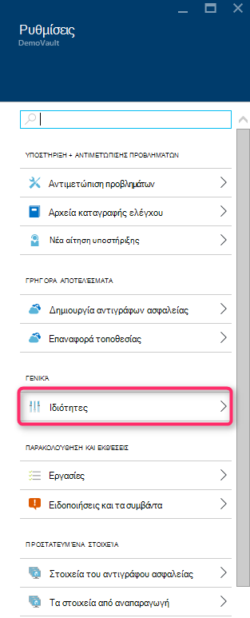

4. Στη σελίδα Ιδιότητες, κάντε κλικ στην επιλογή **λήψη** στην περιοχή **Τα διαπιστευτήριά δημιουργίας αντιγράφων ασφαλείας**. Η πύλη δημιουργεί το αρχείο διαπιστευτηρίων θάλαμο, το οποίο γίνεται διαθέσιμο για λήψη.

    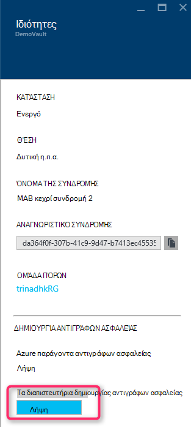

Η πύλη θα δημιουργήσει μια πιστοποίηση θάλαμο χρησιμοποιώντας ένα συνδυασμό από το όνομα θάλαμο και την τρέχουσα ημερομηνία. Κάντε κλικ στο κουμπί **Αποθήκευση** για να κάνετε λήψη τα διαπιστευτήρια θάλαμο φάκελο λήψεις του λογαριασμού τοπικού ή επιλέξτε Αποθήκευση ως από το μενού αποθήκευση για να καθορίσετε μια θέση για τα διαπιστευτήρια θάλαμο. Θα χρειαστεί προς τα επάνω σε λεπτά για το αρχείο σε δημιουργηθούν.

### Σημείωση
- Βεβαιωθείτε ότι το αρχείο διαπιστευτήρια θάλαμο είναι αποθηκευμένο σε μια θέση όπου είναι δυνατή η πρόσβαση από τον υπολογιστή σας. Εάν είναι αποθηκευμένο σε μια κοινή χρήση αρχείου/Ερωτήσεων, ελέγξτε τα δικαιώματα πρόσβασης.
- Το αρχείο διαπιστευτήρια θάλαμο χρησιμοποιείται μόνο κατά τη διάρκεια της ροής εργασίας εγγραφής.
- Το αρχείο διαπιστευτήρια θάλαμο λήξη μετά 48hrs και μπορούν να ληφθούν από την πύλη.

### 3. εγκατάσταση παράγοντα αντιγράφων ασφαλείας

Αφού δημιουργήσετε το θάλαμο Azure αντίγραφο ασφαλείας, πρέπει να εγκατασταθούν παράγοντας σε κάθε μία από τις μηχανές Windows (Windows Server, Windows προγράμματος-πελάτη, διακομιστή συστήματος κέντρο δεδομένων προστασίας Manager ή υπολογιστή Azure δημιουργίας αντιγράφων ασφαλείας διακομιστή) που σας δίνει τη δυνατότητα δημιουργίας αντιγράφων ασφαλείας των δεδομένων και των εφαρμογών για να Azure.

1. Άνοιγμα θάλαμο υπηρεσίες ανάκτησης στο οποίο στο οποίο θέλετε να καταχωρήσετε DPM υπολογιστή.

2. Ρυθμίσεις blade ανοίγει από προεπιλογή. Εάν είναι κλειστή, κάντε κλικ στην επιλογή **Ρυθμίσεις** για να ανοίξετε το blade ρυθμίσεις. Στο blade ρυθμίσεις, κάντε κλικ στην εντολή **Ιδιότητες**.

    

3. Στη σελίδα "Ρυθμίσεις", κάντε κλικ στην επιλογή **λήψη** στην περιοχή **Azure παράγοντα δημιουργίας αντιγράφων ασφαλείας**.

    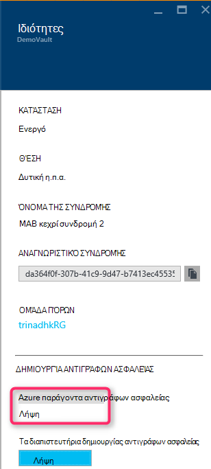

   Όταν γίνεται λήψη των τον παράγοντα, κάντε διπλό κλικ MARSAgentInstaller.exe για να ξεκινήσετε την εγκατάσταση του παράγοντα Azure δημιουργίας αντιγράφων ασφαλείας. Επιλέξτε το φάκελο εγκατάστασης και αρχική φακέλου που απαιτείται για τον παράγοντα. Η θέση του cache που καθορίζεται πρέπει να έχει ελεύθερο χώρο που είναι 5% τουλάχιστον τα δεδομένα αντιγράφου ασφαλείας.

4.  Εάν χρησιμοποιείτε διακομιστή μεσολάβησης για να συνδεθείτε στο Internet, στην οθόνη **ρύθμισης παραμέτρων διακομιστή μεσολάβησης** , πληκτρολογήστε τις λεπτομέρειες του διακομιστή μεσολάβησης. Εάν χρησιμοποιείτε ένα με έλεγχο ταυτότητας διακομιστή μεσολάβησης, πληκτρολογήστε τις λεπτομέρειες για το όνομα και τον κωδικό πρόσβασης χρήστη σε αυτήν την οθόνη.

5.  Ο παράγοντας αντίγραφο ασφαλείας Azure εγκαθιστά διαίρεσης 4,5 .NET Framework και του Windows PowerShell (Εάν δεν υπάρχει ήδη) για να ολοκληρώσετε την εγκατάσταση.

6.  Μόλις εγκαταστήσετε τον παράγοντα, **Κλείσιμο** του παραθύρου.

    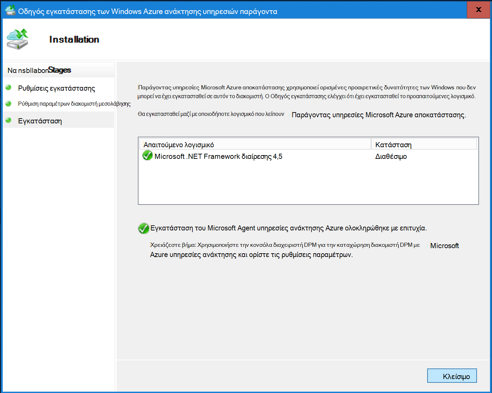

7. Για να **καταχωρήσετε το διακομιστή DPM** για να το θάλαμο, στην καρτέλα " **Διαχείριση** ", κάντε κλικ στη **σύνδεση**. Στη συνέχεια, επιλέξτε **καταχώρηση**. Θα ανοίξει ο Οδηγός εγκατάστασης καταχώρηση.

8. Εάν χρησιμοποιείτε διακομιστή μεσολάβησης για να συνδεθείτε στο Internet, στην οθόνη **ρύθμισης παραμέτρων διακομιστή μεσολάβησης** , πληκτρολογήστε τις λεπτομέρειες του διακομιστή μεσολάβησης. Εάν χρησιμοποιείτε ένα με έλεγχο ταυτότητας διακομιστή μεσολάβησης, πληκτρολογήστε τις λεπτομέρειες για το όνομα και τον κωδικό πρόσβασης χρήστη σε αυτήν την οθόνη.

    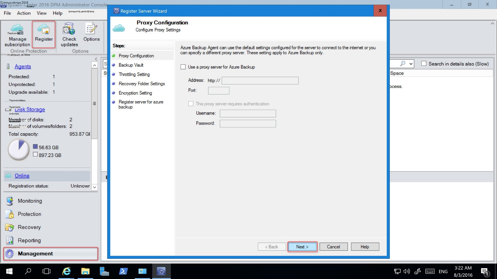

9. Στην οθόνη διαπιστευτήρια θάλαμο, αναζητήστε και επιλέξτε το αρχείο διαπιστευτήρια θάλαμο που έχει ληφθεί προηγουμένως.

    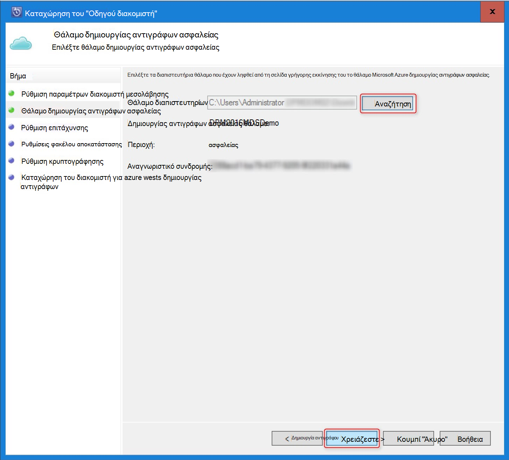

    Το αρχείο διαπιστευτήρια θάλαμο είναι έγκυρη μόνο για 48 ώρες (μετά τη λήψη του από την πύλη). Εάν αντιμετωπίσετε οποιοδήποτε σφάλμα σε αυτήν την οθόνη (για παράδειγμα, "θάλαμο διαπιστευτήρια που παρέχονται από το αρχείο έχει λήξει"), συνδεθείτε στην πύλη του Azure και λήψη αρχείων ξανά τα διαπιστευτήρια θάλαμο.

    Βεβαιωθείτε ότι το αρχείο διαπιστευτήρια θάλαμο είναι διαθέσιμη σε μια θέση όπου είναι δυνατή η πρόσβαση από την εφαρμογή ρύθμισης. Εάν αντιμετωπίσετε πρόσβαση σχετικά σφάλματα, αντιγράψτε το αρχείο διαπιστευτήρια θάλαμο σε μια προσωρινή θέση σε αυτόν τον υπολογιστή και προσπαθήστε ξανά τη λειτουργία.

    Εάν παρουσιαστεί σφάλμα διαπιστευτηρίων δεν είναι έγκυρη θάλαμο (για παράδειγμα, "δεν είναι έγκυρη θάλαμο διαπιστευτήρια που παρέχονται") το αρχείο είναι κατεστραμμένο ή δεν έχουν την πιο πρόσφατη διαπιστευτήρια που σχετίζεται με την υπηρεσία αποκατάστασης. Επανάληψη της λειτουργίας μετά τη λήψη ενός νέου αρχείου διαπιστευτηρίων θάλαμο από την πύλη. Αυτό το σφάλμα είναι συνήθως ορατή, εάν ο χρήστης κάνει κλικ στην επιλογή **λήψη θάλαμο διαπιστευτήρια** στην πύλη του Azure, πατώντας. Σε αυτήν την περίπτωση, μόνο το δεύτερο αρχείο διαπιστευτηρίων θάλαμο είναι έγκυρη.

10. Για να ελέγξετε τη χρήση του εύρους ζώνης δικτύου κατά τη διάρκεια της εργασίας και ώρες εκτός εργασίας, στην οθόνη **Ρύθμιση περιορισμού** , μπορείτε να ορίσετε τα όρια χρήσης του εύρους ζώνης και ορισμός της εργασίας και μη-εργάσιμων ωρών.

    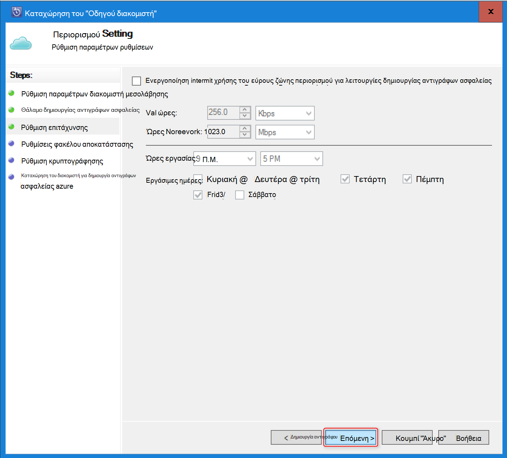

11. Στην οθόνη **Ρύθμιση φακέλου ανάκτησης** , αναζητήστε το φάκελο όπου τα αρχεία που έχουν ληφθεί από το Azure θα να τοποθετούνται προσωρινά.

    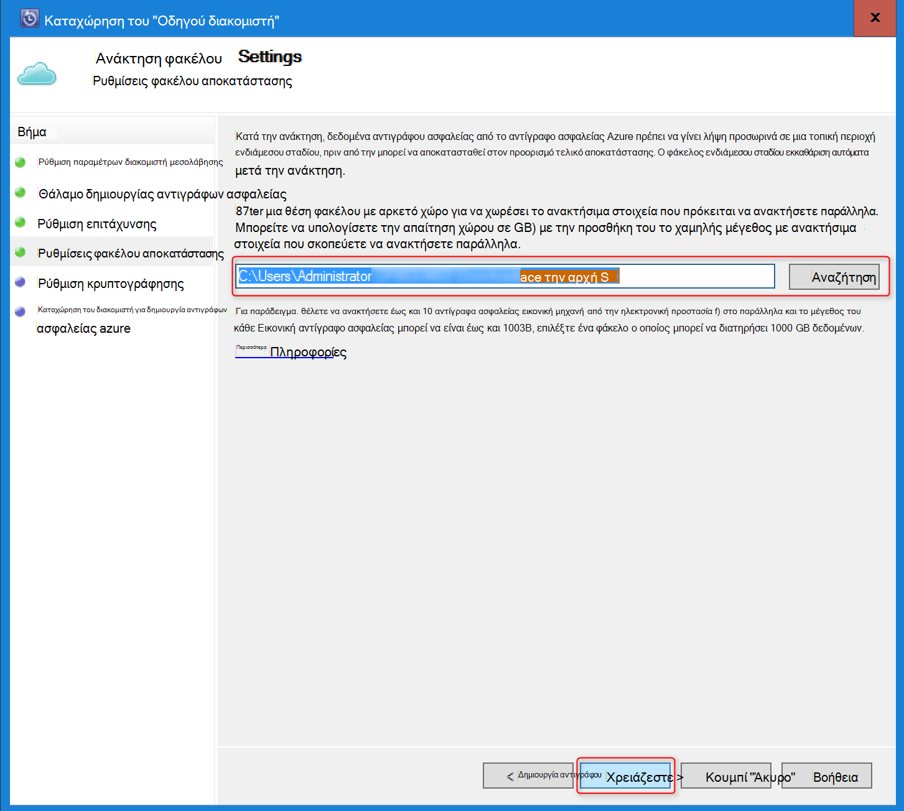

12. Στην οθόνη **ρύθμιση κρυπτογράφησης** , μπορείτε να δημιουργήσετε μια φράση πρόσβασης ή να παρέχουν μια φράση πρόσβασης (τουλάχιστον 16 χαρακτήρες). Να θυμάστε ότι για να αποθηκεύσετε τη φράση πρόσβασης σε ασφαλή θέση.

    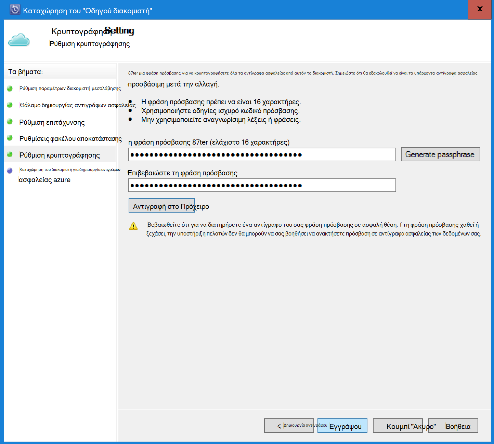

    > [AZURE.WARNING] Εάν η φράση πρόσβασης χαθεί ή ξεχάσει; Microsoft δεν μπορεί να βοηθήσει στην αποκατάσταση τα δεδομένα αντιγράφου ασφαλείας. Ο τελικός χρήστης ανήκει η φράση πρόσβασης κρυπτογράφησης και η Microsoft δεν διαθέτει ορατότητα στην τη φράση πρόσβασης που χρησιμοποιούνται από τον τελικό χρήστη. Αποθηκεύστε το αρχείο σε ασφαλή θέση, όπως απαιτείται κατά τη διάρκεια μιας λειτουργίας ανάκτησης.

13. Αφού κάνετε κλικ στο κουμπί **καταχώρηση** , υπολογιστή έχει καταχωρηθεί με επιτυχία το θάλαμο και είστε έτοιμοι να ξεκινήσετε τη δημιουργία αντιγράφων ασφαλείας Microsoft Azure.

14. Όταν χρησιμοποιείτε Διαχείριση προστασίας δεδομένων, μπορείτε να τροποποιήσετε τις ρυθμίσεις που καθορίζονται στη διάρκεια της ροής εργασίας καταχώρηση, κάνοντας κλικ στην επιλογή **Ρύθμιση παραμέτρων** , επιλέγοντας **Online** κάτω από την καρτέλα **Διαχείριση** .

## Απαιτήσεις (και τους περιορισμούς)

- DPM μπορεί να εκτελείται ως ένας φυσικός διακομιστής ή μια εικονική μηχανή Hyper-V την εγκατάσταση στο σύστημα κέντρου 2012 SP1 ή σύστημα κέντρο 2012 R2. Μπορεί επίσης να εκτελείται ως εκτελείται σε σύστημα κέντρο 2012 R2 με τουλάχιστον ένα Azure εικονική μηχανή DPM 2012 R2 συνάθροιση ενημερώσεων 3 ή μια εικονική μηχανή Windows στο VMWare εκτελείται σε σύστημα κέντρο 2012 R2 με τουλάχιστον συνάθροιση ενημερώσεων 5.
- Εάν χρησιμοποιείτε DPM με το σύστημα κέντρο 2012 SP1 θα πρέπει να εγκαταστήσετε Λήψη ενημερωμένης έκδοσης του 2 για το σύστημα Κέντρο διαχείρισης προστασίας δεδομένων SP1. Αυτό είναι απαραίτητο να μπορέσετε να εγκαταστήσετε τον παράγοντα Azure δημιουργίας αντιγράφων ασφαλείας.
- Θα πρέπει να έχετε το διακομιστή DPM του Windows PowerShell και .net Framework διαίρεσης 4,5 εγκατεστημένο.
- DPM να δημιουργήσετε αντίγραφα ασφαλείας περισσότερους φόρτους εργασίας δημιουργίας αντιγράφων ασφαλείας Azure. Για μια πλήρη λίστα των τι έχει υποστηρίζονται ανατρέξτε στο θέμα το αντίγραφο ασφαλείας Azure υποστήριξης παρακάτω στοιχεία.
- Δεδομένα που είναι αποθηκευμένα στο αντίγραφο ασφαλείας Azure μπορεί να ανακτηθεί με την επιλογή "Αντιγραφή σε ταινία".
- Θα χρειαστείτε Azure λογαριασμού με ενεργοποιημένη τη δυνατότητα το Azure δημιουργίας αντιγράφων ασφαλείας. Εάν δεν έχετε ένα λογαριασμό, μπορείτε να δημιουργήσετε ένα δωρεάν λογαριασμό της δοκιμαστικής έκδοσης σε λίγα λεπτά. Διαβάστε σχετικά με [τις τιμές Azure δημιουργίας αντιγράφων ασφαλείας](https://azure.microsoft.com/pricing/details/backup/).
- Χρήση των αντιγράφων ασφαλείας Azure απαιτεί τον παράγοντα αντιγράφων ασφαλείας Azure να εγκατασταθούν στους διακομιστές που θέλετε να δημιουργήσετε αντίγραφα ασφαλείας. Κάθε διακομιστή πρέπει να έχετε τουλάχιστον το 5% του μεγέθους των δεδομένων που δημιουργείται αντίγραφο ασφαλείας, διαθέσιμη ως τοπικό χώρο αποθήκευσης. Για παράδειγμα, η δημιουργία αντιγράφων ασφαλείας 100 GB δεδομένων απαιτεί τουλάχιστον 5 GB ελεύθερο χώρο στην αρχική θέση.
- Δεδομένα θα αποθηκευτούν στο χώρο αποθήκευσης της Azure θάλαμο. Υπάρχει όριο για την ποσότητα των δεδομένων που μπορείτε να δημιουργήσετε αντίγραφα ασφαλείας με ένα αντίγραφο ασφαλείας του Azure φύλαξης, αλλά το μέγεθος της προέλευσης δεδομένων (για παράδειγμα, ένα εικονικό μηχάνημα ή βάσης δεδομένων) δεν πρέπει να υπερβαίνει τα 54400 GB.

Αυτοί οι τύποι αρχείων που υποστηρίζονται για επιστροφή έως Azure:

- Κρυπτογραφημένο (πλήρης δημιουργία αντιγράφων ασφαλείας μόνο)
- Συμπίεση (επαυξητική δημιουργίας αντιγράφων ασφαλείας υποστηρίζονται)
- Κατακερματισμένο (επαυξητική δημιουργίας αντιγράφων ασφαλείας υποστηρίζονται)
- Συμπιέζεται και κατακερματισμένο (αντιμετωπίζεται ως Sparse)

Και αυτές δεν υποστηρίζονται:

- Διακομιστές σε συστήματα διάκριση πεζών-κεφαλαίων αρχείων δεν υποστηρίζονται.
- Συνδέσεις υλικού (παραλείφθηκε)
- Σημεία (παραλείφθηκε) νέας ανάλυσης
- Κρυπτογράφηση και συμπίεση (παραλείφθηκε)
- Κρυπτογραφημένο και κατακερματισμένο (παράλειψη)
- Συμπιεσμένη ροή
- Κατακερματισμένο ροής

>[AZURE.NOTE] Από στο σύστημα κέντρου 2012 DPM με SP1 και μετά μπορείτε να δημιουργήσετε αντίγραφο ασφαλείας του όγκου εργασίας που προστατεύονται από DPM να Azure χρησιμοποιώντας Microsoft Azure δημιουργίας αντιγράφων ασφαλείας.
