<properties
    pageTitle="Διαχείριση και την παρακολούθηση της δημιουργίας αντιγράφων ασφαλείας Azure εικονική μηχανή | Microsoft Azure"
    description="Μάθετε πώς μπορείτε να διαχειριστείτε και να παρακολουθείτε ένα αντίγραφα ασφαλείας Azure εικονική μηχανή"
    services="backup"
    documentationCenter=""
    authors="trinadhk"
    manager="shreeshd"
    editor=""/>

<tags
    ms.service="backup"
    ms.workload="storage-backup-recovery"
    ms.tgt_pltfrm="na"
    ms.devlang="na"
    ms.topic="article"
    ms.date="08/31/2016"
    ms.author="trinadhk; jimpark; markgal;"/>

# <a name="manage-and-monitor-azure-virtual-machine-backups"></a>Διαχείριση και την παρακολούθηση Azure εικονική μηχανή δημιουργίας αντιγράφων ασφαλείας

> [AZURE.SELECTOR]
- [Διαχείριση Εικονική Azure δημιουργίας αντιγράφων ασφαλείας](backup-azure-manage-vms.md)
- [Διαχείριση κλασική Εικονική δημιουργίας αντιγράφων ασφαλείας](backup-azure-manage-vms-classic.md)

Σε αυτό το άρθρο παρέχει πληροφορίες σχετικά με τις κοινές διαχείρισης και παρακολούθησης εργασίες για κλασική μοντέλο εικονικές μηχανές προστατευμένη στο Azure.  

>[AZURE.NOTE] Azure περιλαμβάνει δύο μοντέλων ανάπτυξης για τη δημιουργία και εργασία με πόρους: [Διαχείριση πόρων και κλασική](../resource-manager-deployment-model.md). Για λεπτομέρειες σχετικά με την εργασία με το μοντέλο ανάπτυξης κλασική ΣΠΣ, ανατρέξτε στο θέμα [Προετοιμασία το περιβάλλον σας για να δημιουργήσετε αντίγραφα ασφαλείας Azure εικονικές μηχανές](backup-azure-vms-prepare.md) .

## <a name="manage-protected-virtual-machines"></a>Διαχείριση προστατευμένο εικονικές μηχανές

Για να διαχειριστείτε προστατευμένο εικονικές μηχανές:

1. Για να προβάλετε και να διαχειριστείτε ρυθμίσεις δημιουργίας αντιγράφων ασφαλείας για μια εικονική μηχανή, κάντε κλικ στην καρτέλα **Προστασία στοιχείων** .

2. Κάντε κλικ στο όνομα ενός προστατευμένου στοιχείου για να δείτε την καρτέλα **Λεπτομέρειες δημιουργίας αντιγράφων ασφαλείας** , που εμφανίζει πληροφορίες σχετικά με το τελευταίο αντίγραφο ασφαλείας.

    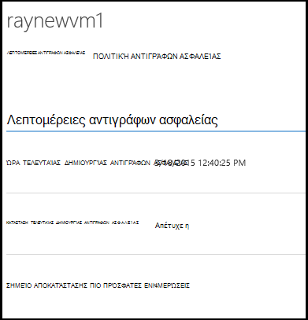

3. Για να προβάλετε και να διαχειριστείτε την πολιτική ασφαλείας ρυθμίσεων για μια εικονική μηχανή, κάντε κλικ στην καρτέλα **πολιτικές** .

    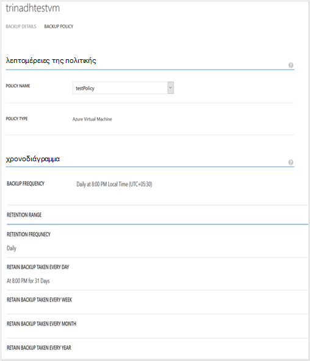

    Στην καρτέλα **Δημιουργία αντιγράφων ασφαλείας πολιτικές** δείχνει την υπάρχουσα πολιτική. Μπορείτε να τροποποιήσετε όπως απαιτείται. Εάν χρειάζεστε για να δημιουργήσετε μια νέα πολιτική κάντε κλικ στην επιλογή **Δημιουργία** στη σελίδα **πολιτικές** . Σημειώστε ότι εάν θέλετε να καταργήσετε μια πολιτική δεν πρέπει να διαθέτει εικονικές μηχανές που σχετίζεται με το.

    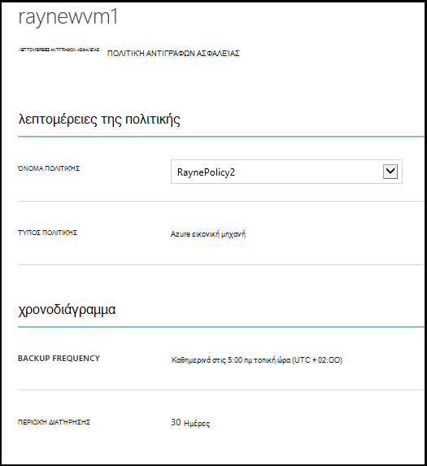

4. Μπορείτε να λάβετε περισσότερες πληροφορίες σχετικά με τις ενέργειες ή κατάστασης για μια εικονική μηχανή στη σελίδα " **εργασίες** ". Επιλέξτε μια εργασία στη λίστα για να δείτε περισσότερες λεπτομέρειες, ή να φιλτράρετε τις εργασίες για μια συγκεκριμένη εικονική μηχανή.

    

## <a name="on-demand-backup-of-a-virtual-machine"></a>Δημιουργία αντιγράφων ασφαλείας σε ζήτηση από μια εικονική μηχανή
Μπορείτε να κρατήσετε ένα στη ζήτηση δημιουργίας αντιγράφων ασφαλείας από μια εικονική μηχανή όταν έχει ρυθμιστεί για την προστασία. Εάν το αρχικό αντίγραφο ασφαλείας είναι σε εκκρεμότητα για την εικονική μηχανή, θα δημιουργήσει αντίγραφα ασφαλείας σε ζήτηση ένα πλήρες αντίγραφο του η εικονική μηχανή στο Azure θάλαμο δημιουργίας αντιγράφων ασφαλείας. Εάν έχει ολοκληρωθεί το πρώτο αντίγραφο ασφαλείας, θα αντιγράφου ασφαλείας σε ζήτηση μόνο για αποστολή αλλαγών από το προηγούμενο αντίγραφο ασφαλείας σε Azure αντίγραφο ασφαλείας φύλαξης δηλαδή το είναι πάντα αυξάνονται.

>[AZURE.NOTE] Περιοχή διατήρησης ένα αντίγραφο ασφαλείας σε ζήτηση έχει οριστεί σε τιμή διατήρησης που έχουν καθοριστεί για ημερήσια διατήρησης στο αντίγραφο ασφαλείας πολιτικής που αντιστοιχεί στο η Εικονική.  

Για να λάβετε μια σε ζήτηση δημιουργίας αντιγράφων ασφαλείας από μια εικονική μηχανή:

1. Μεταβείτε στη σελίδα **Προστασία στοιχείων** και επιλέξτε **Azure εικονική μηχανή** ως **τύπο** (Εάν δεν είναι ήδη επιλεγμένο) και κάντε κλικ στο κουμπί **επιλογή** .

    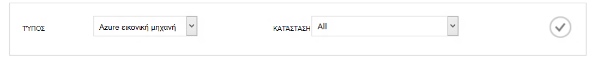

2. Επιλέξτε την εικονική μηχανή στην οποία θέλετε για να τραβήξετε μια σε ζήτηση δημιουργίας αντιγράφων ασφαλείας και κάντε κλικ στο κουμπί **Δημιουργίας αντιγράφων ασφαλείας τώρα** στο κάτω μέρος της σελίδας.

    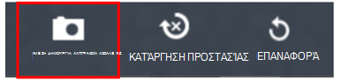

    Αυτό θα δημιουργήσει μια εργασία αντιγράφου ασφαλείας του επιλεγμένου υπολογιστή εικονική. Περιοχή διατήρησης σημείο αποκατάστασης που δημιουργήθηκε μέσω αυτής της εργασίας θα είναι ίδιο με αυτό που καθορίζεται στην πολιτική που σχετίζεται με την εικονική μηχανή.

    

    >[AZURE.NOTE] Για να προβάλετε την πολιτική που σχετίζεται με μια εικονική μηχανή, Διερεύνηση σε εικονική μηχανή στη σελίδα **Προστασία στοιχείων** και μεταβείτε στην καρτέλα Πολιτική ασφαλείας.

3. Όταν δημιουργηθεί η εργασία, μπορείτε να κάνετε κλικ στο κουμπί **Προβολή εργασία** στη γραμμή αναδυόμενη για να δείτε την αντίστοιχη εργασία στη σελίδα "εργασίες".

    

4. Μετά την επιτυχή ολοκλήρωση της εργασίας, ένα σημείο αποκατάστασης θα δημιουργηθεί που μπορείτε να χρησιμοποιήσετε για να επαναφέρετε την εικονική μηχανή. Αυτό επίσης θα αυξήσετε την τιμή της στήλης σημείο αποκατάστασης κατά 1 στη σελίδα **Προστασία στοιχείων** .

## <a name="stop-protecting-virtual-machines"></a>Διακοπή προστασία σε εικονικές μηχανές
Μπορείτε να επιλέξετε για να διακόψετε τη μελλοντική αντίγραφα ασφαλείας των μια εικονική μηχανή με τις ακόλουθες επιλογές:

- Διατήρηση αντιγράφου ασφαλείας δεδομένα που σχετίζονται με εικονική μηχανή στο θάλαμο Azure αντιγράφου ασφαλείας
- Διαγραφή δεδομένων αντιγράφων ασφαλείας που σχετίζονται με εικονική μηχανή

Εάν έχετε επιλέξει να διατηρούνται τα δεδομένα αντιγράφου ασφαλείας που σχετίζονται με εικονική μηχανή, μπορείτε να χρησιμοποιήσετε τα δεδομένα αντιγράφου ασφαλείας για να επαναφέρετε την εικονική μηχανή. Για τις τιμές λεπτομερειών για τέτοιου είδους εικονικές μηχανές, κάντε κλικ [εδώ](https://azure.microsoft.com/pricing/details/backup/).

Για να διακόψετε την προστασία για μια εικονική μηχανή:

1. Μεταβείτε στη σελίδα **Προστασία στοιχείων** και επιλέξτε **Azure εικονική μηχανή** ως τύπο φίλτρου (Εάν δεν είναι ήδη επιλεγμένο) και κάντε κλικ στο κουμπί **επιλογή** .

    

2. Επιλέξτε την εικονική μηχανή και κάντε κλικ στην επιλογή **Διακοπή προστασίας** στο κάτω μέρος της σελίδας.

    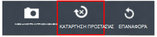

3. Από προεπιλογή, αντιγράφου ασφαλείας Azure δεν διαγράφει τα δεδομένα αντιγράφου ασφαλείας που σχετίζονται με την εικονική μηχανή.

    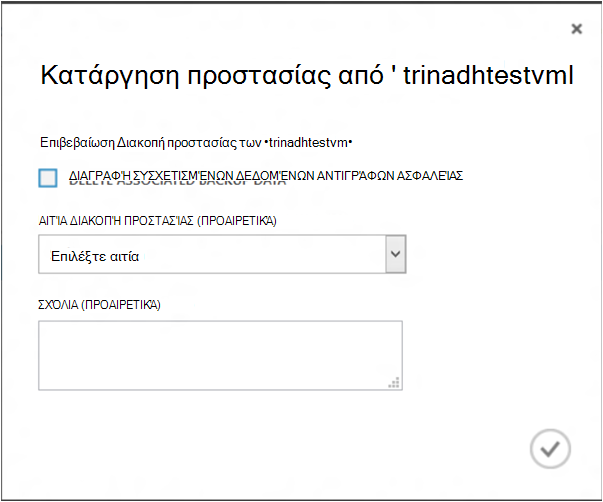

    Εάν θέλετε να διαγράψετε δεδομένα αντιγράφου ασφαλείας, επιλέξτε το πλαίσιο ελέγχου.

    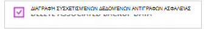

    Επιλέξτε ένα λόγο για διακοπή της δημιουργίας αντιγράφων ασφαλείας. Ενώ αυτό είναι προαιρετικό, παρέχοντας ένα λόγο θα σας βοηθήσει Azure δημιουργίας αντιγράφων ασφαλείας για να τα σχόλια και να δίνετε προτεραιότητα σε τα σενάρια πελατών.

4. Κάντε κλικ στο κουμπί " **Υποβολή** " για να υποβάλετε την εργασία **Διακοπή προστασίας** . Κάντε κλικ στην **Προβολή έργου** για να δείτε την αντίστοιχη της εργασίας στη σελίδα " **εργασίες** ".

    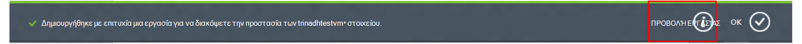

    Εάν δεν έχετε επιλέξει επιλογή **Διαγραφή συσχετισμένη δεδομένα αντιγράφου ασφαλείας** στη διάρκεια **Διακοπή προστασίας** οδηγό, στη συνέχεια, δημοσίευση ολοκλήρωση του έργου, προστασίας αλλάζει σε **Διακοπή προστασίας**. Τα δεδομένα παραμένουν με αντίγραφα ασφαλείας Azure ώσπου να διαγραφεί ρητά. Μπορείτε πάντα να διαγράψετε τα δεδομένα, επιλέγοντας την εικονική μηχανή στη σελίδα **Προστασία στοιχείων** και κάνοντας κλικ στην επιλογή **Διαγραφή**.

    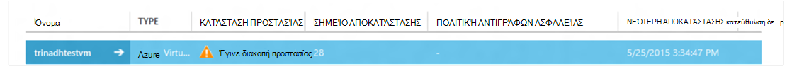

    Εάν έχετε επιλέξει την επιλογή **Διαγραφή συσχετισμένη δεδομένα αντιγράφου ασφαλείας** , η εικονική μηχανή δεν θα τμήματος της σελίδας **Προστασία στοιχείων** .

## <a name="re-protect-virtual-machine"></a>Εκ νέου προστασία εικονική μηχανή
Εάν δεν έχετε επιλέξει την επιλογή **Διαγραφή συσχέτιση δεδομένα αντιγράφου ασφαλείας** σε **Διακοπή προστασίας**, μπορείτε να προστατεύσετε εκ νέου η εικονική μηχανή, ακολουθώντας τα βήματα που είναι παρόμοια με τη δημιουργία αντιγράφων ασφαλείας καταχωρημένες εικονικές μηχανές. Μόλις προστατεύεται, αυτό εικονική μηχανή θα έχει δεδομένα αντιγράφου ασφαλείας διατηρούνται πριν από την προστασία διακοπή και αποκατάστασης σημεία δημιουργηθεί μετά την προστασία εκ νέου.

Μετά την εκ νέου προστασία, η εικονική μηχανή προστασίας κατάστασης θα αλλάξει **προστατευμένης** εάν υπάρχουν σημεία ανάκτησης πριν από την **Κατάργηση προστασίας**.

  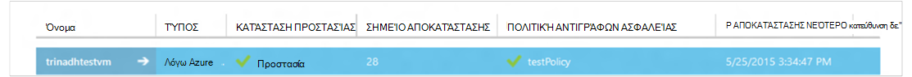

>[AZURE.NOTE] Κατά την προστασία εκ νέου η εικονική μηχανή, μπορείτε να επιλέξετε μια διαφορετική πολιτική από την πολιτική με τον οποίο εικονική μηχανή ήταν προστατευμένο αρχικά.

## <a name="unregister-virtual-machines"></a>Κατάργηση της καταχώρησης εικονικές μηχανές

Εάν θέλετε να καταργήσετε την εικονική μηχανή από το αντίγραφο ασφαλείας θάλαμο:

1. Κάντε κλικ στο κουμπί **UNREGISTER** στο κάτω μέρος της σελίδας.

    

    Θα εμφανιστεί μια αναδυόμενη ειδοποίηση στο κάτω μέρος της οθόνης αίτηση επιβεβαίωσης. Κάντε κλικ στο κουμπί **Ναι** για να συνεχίσετε.

    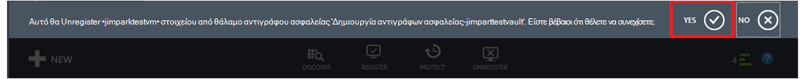

## <a name="delete-backup-data"></a>Διαγραφή δεδομένων αντιγράφων ασφαλείας
Μπορείτε να διαγράψετε τα δεδομένα αντιγράφου ασφαλείας που σχετίζονται με μια εικονική μηχανή, είτε:

- Κατά τη διάρκεια εργασίας Διακοπή προστασίας
- Μετά από μια διακοπή προστασίας εργασία έχει ολοκληρωθεί σε μια εικονική μηχανή

Για να διαγράψετε δεδομένα αντιγράφου ασφαλείας σε εικονικό μηχάνημα, που βρίσκεται σε κατάσταση *Προστασίας σταμάτησε* καταχωρείτε επιτυχή ολοκλήρωση μιας εργασίας **Διακοπή δημιουργίας αντιγράφων ασφαλείας** :

1. Μεταβείτε στη σελίδα **Προστασία στοιχείων** και επιλέξτε **Azure εικονική μηχανή** ως *τύπο* και κάντε κλικ στο κουμπί **επιλογή** .

    

2. Επιλέξτε την εικονική μηχανή. Η εικονική μηχανή θα είναι σε κατάσταση **Διακοπή προστασίας** .

    

3. Κάντε κλικ στο κουμπί **ΔΙΑΓΡΑΦΉ** στο κάτω μέρος της σελίδας.

    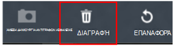

4. Στον οδηγό **διαγράψετε δεδομένα αντιγράφου ασφαλείας** , επιλέξτε ένα λόγο για τη διαγραφή αντιγράφου ασφαλείας δεδομένων (συνιστάται ιδιαίτερα) και κάντε κλικ στην επιλογή **Υποβολή**.

    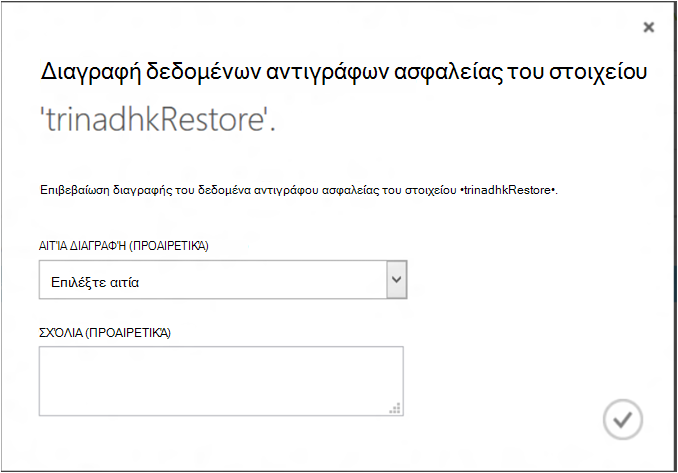

5. Αυτό θα δημιουργήσει μια εργασία για να διαγράψετε δεδομένα αντιγράφου ασφαλείας του επιλεγμένου εικονική μηχανή. Κάντε κλικ στην **προβολή έργου** για να δείτε την αντίστοιχη εργασία στη σελίδα "εργασίες".

    

    Μόλις ολοκληρωθεί η εργασία, την εγγραφή που αντιστοιχεί στην εικονική μηχανή της θα καταργηθεί από τη σελίδα **προστατευμένης στοιχείων** .

## <a name="dashboard"></a>Πίνακας εργαλείων
Στη σελίδα **πίνακα εργαλείων** , μπορείτε να δείτε πληροφορίες σχετικά με το Azure εικονικές μηχανές, τους χώρου αποθήκευσης και οι εργασίες που σχετίζονται με αυτές τις τελευταίες 24 ώρες. Μπορείτε να προβάλετε κατάστασης δημιουργίας αντιγράφων ασφαλείας και σχετικές σφάλματα δημιουργίας αντιγράφων ασφαλείας.

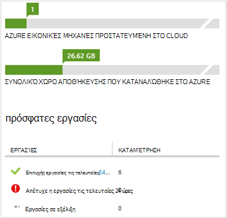

>[AZURE.NOTE] Τιμές στον πίνακα εργαλείων ανανεώνονται κάθε 24 ώρες.

## <a name="auditing-operations"></a>Έλεγχος λειτουργιών
Δημιουργία αντιγράφων ασφαλείας Azure παρέχει αναθεώρηση των "λειτουργία αρχείων καταγραφής" λειτουργιών αντιγράφων ασφαλείας ενεργοποίησε από τον πελάτη να σας διευκολύνουν να βλέπετε ακριβώς τι λειτουργίες διαχείρισης έχουν πραγματοποιηθεί σε το αντίγραφο ασφαλείας θάλαμο. Λειτουργίες αρχείων καταγραφής εξαιρετική απολογισμού για την ενεργοποίηση και ελέγχου υποστήριξη για τις λειτουργίες δημιουργίας αντιγράφων ασφαλείας.

Στα αρχεία καταγραφής λειτουργία καταγράφονται τις ακόλουθες λειτουργίες:

- Εγγράψου
- Κατάργηση της καταχώρησης
- Ρύθμιση παραμέτρων προστασίας
- Δημιουργία αντιγράφων ασφαλείας (και τα δύο προγραμματισμένη καθώς και σε ζήτηση δημιουργίας αντιγράφων ασφαλείας μέσω BackupNow)
- Επαναφορά
- Κατάργηση προστασίας
- Διαγραφή δεδομένων αντιγράφων ασφαλείας
- Προσθήκη πολιτικής
- Διαγραφή πολιτικής
- Ενημέρωση πολιτικής
- Ακύρωση εργασίας

Για να προβάλετε αρχεία καταγραφής λειτουργίας που αντιστοιχεί σε ένα αντίγραφο ασφαλείας θάλαμο:

1. Περιήγηση με τις **υπηρεσίες διαχείρισης** στην πύλη του Azure και, στη συνέχεια, κάντε κλικ στην καρτέλα **Αρχεία καταγραφής λειτουργίας** .

    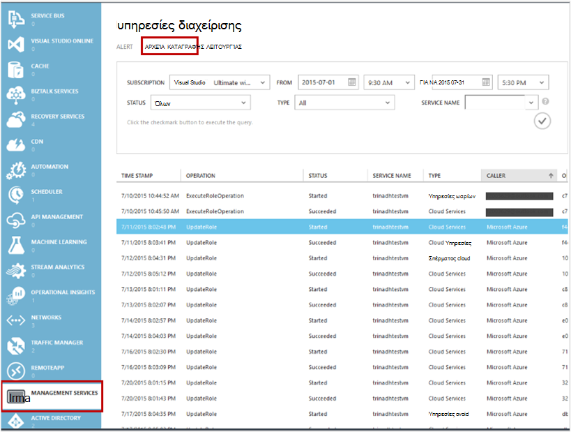

2. Στα φίλτρα, επιλέξτε **αντιγράφου ασφαλείας** ως *τύπο* και καθορίστε το όνομα του αντιγράφου ασφαλείας θάλαμο στο *όνομα της υπηρεσίας* και κάντε κλικ στην **Υποβολή**.

    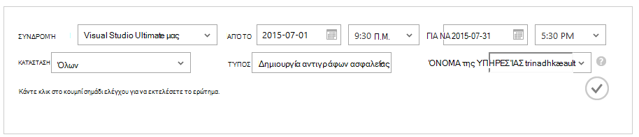

3. Στα αρχεία καταγραφής λειτουργίες, επιλέξτε οποιαδήποτε άλλη εργασία και κάντε κλικ στην επιλογή **Λεπτομέρειες** για να δείτε τις λεπτομέρειες που αντιστοιχεί σε μια λειτουργία.

    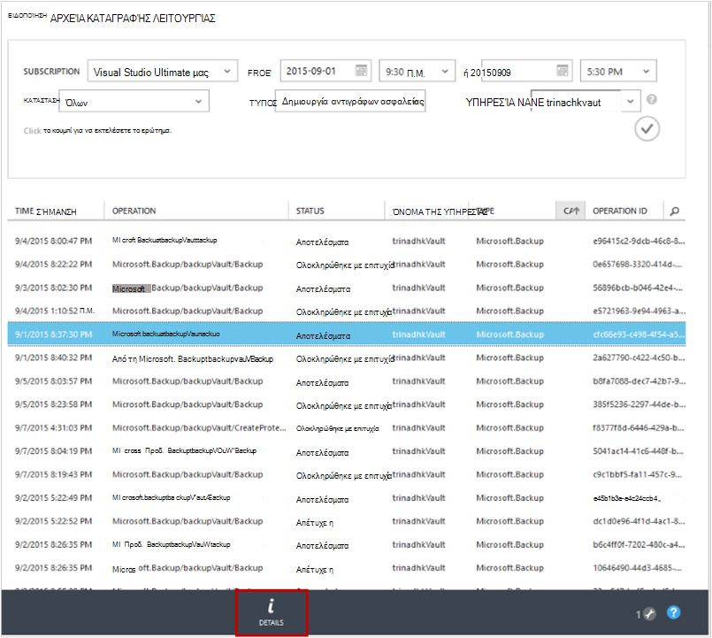

    Ο **Οδηγός λεπτομέρειες** περιέχει πληροφορίες σχετικά με τη λειτουργία ενεργοποίησε, εργασία αναγνωριστικό πόρου στον οποίο αυτή η λειτουργία ενεργοποιείται και ώρα έναρξης της τη λειτουργία.

    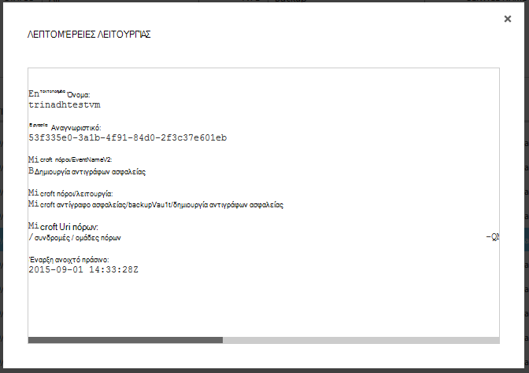

## <a name="alert-notifications"></a>Οι ειδοποιήσεις
Μπορείτε να λάβετε προσαρμοσμένες οι ειδοποιήσεις για τις εργασίες στην πύλη. Αυτό είναι δυνατό, καθορίζοντας ειδοποίησης κανόνες με βάση το PowerShell συμβάντα λειτουργικές αρχεία καταγραφής. Συνιστάται να χρησιμοποιείτε *PowerShell έκδοση 1.3.0 ή παραπάνω*.

Για να ορίσετε μια προσαρμοσμένη ειδοποίηση ειδοποιεί για αποτυχιών του αντιγράφου ασφαλείας, ένα δείγμα εντολής θα μοιάζει κάπως:

```
PS C:\> $actionEmail = New-AzureRmAlertRuleEmail -CustomEmail contoso@microsoft.com
PS C:\> Add-AzureRmLogAlertRule -Name backupFailedAlert -Location "East US" -ResourceGroup RecoveryServices-DP2RCXUGWS3MLJF4LKPI3A3OMJ2DI4SRJK6HIJH22HFIHZVVELRQ-East-US -OperationName Microsoft.Backup/backupVault/Backup -Status Failed -TargetResourceId /subscriptions/86eeac34-eth9a-4de3-84db-7a27d121967e/resourceGroups/RecoveryServices-DP2RCXUGWS3MLJF4LKPI3A3OMJ2DI4SRJK6HIJH22HFIHZVVELRQ-East-US/providers/microsoft.backupbvtd2/BackupVault/trinadhVault -Actions $actionEmail
```

**ResourceId**: μπορείτε να βρείτε αυτή από το αναδυόμενο παράθυρο αρχεία καταγραφής λειτουργίες όπως περιγράφεται στην παραπάνω ενότητα. ResourceUri στο αναδυόμενο παράθυρο λεπτομερειών μιας λειτουργίας είναι το ResourceId πρέπει να παρέχονται για αυτό το cmdlet.

**OperationName**: αυτό θα είναι της μορφής "Microsoft.Backup/backupvault/<EventName>" όπου EventName είναι ένα Register, Unregister, ConfigureProtection, δημιουργία αντιγράφων ασφαλείας, επαναφορά, StopProtection, DeleteBackupData, CreateProtectionPolicy, DeleteProtectionPolicy, UpdateProtectionPolicy

**Κατάσταση**: υποστηριζόμενες τιμές είναι-αποτελέσματα, ολοκληρώθηκε με επιτυχία και απέτυχε.

**Ομάδα πόρων**: ομάδα πόρων του πόρου στον οποίο ενεργοποιείται η λειτουργία. Μπορείτε να το αποκτήσετε από ResourceId τιμή. Τιμή μεταξύ των πεδίων */resourceGroups/* και */providers/* ResourceId τιμή είναι η τιμή για την ομάδα πόρων.

**Όνομα**: όνομα του κανόνα ειδοποίησης.

**CustomEmail**: Καθορίστε τη διεύθυνση προσαρμοσμένο μήνυμα ηλεκτρονικού ταχυδρομείου στην οποία θέλετε να στείλετε ειδοποιήσεις

**SendToServiceOwners**: Η επιλογή αυτή στέλνει ειδοποίησης ειδοποίηση σε όλους τους διαχειριστές και διαχειριστές από κοινού από τη συνδρομή. Μπορεί να χρησιμοποιηθεί σε cmdlet **New-AzureRmAlertRuleEmail**

### <a name="limitations-on-alerts"></a>Περιορισμοί σχετικά με τις ειδοποιήσεις
Ειδοποιήσεις που βασίζονται σε συμβάν υπόκεινται σε τους εξής περιορισμούς:

1. Ειδοποιήσεις ενεργοποιούνται σε όλες οι εικονικές μηχανές στο το αντίγραφο ασφαλείας θάλαμο. Δεν μπορείτε να προσαρμόσετε για να λαμβάνετε ειδοποιήσεις για συγκεκριμένο σύνολο εικονικές μηχανές σε ένα αντίγραφο ασφαλείας θάλαμο.
2. Αυτή η δυνατότητα είναι σε προεπισκόπηση. [Μάθε περισσότερα](../monitoring-and-diagnostics/insights-powershell-samples.md#create-alert-rules)
3. Θα λάβετε ειδοποιήσεις από "alerts-noreply@mail.windowsazure.com". Προς το παρόν δεν μπορείτε να τροποποιήσετε τον αποστολέα ηλεκτρονικού ταχυδρομείου.

## <a name="next-steps"></a>Επόμενα βήματα

- [Επαναφορά ΣΠΣ Azure](backup-azure-restore-vms.md)
