<properties
    pageTitle="Διαχείριση αντιγράφων ασφαλείας αναπτυχθεί από διαχειριστή πόρων εικονική μηχανή | Microsoft Azure"
    description="Μάθετε πώς μπορείτε να διαχειριστείτε και να παρακολουθείτε αναπτυχθεί από διαχειριστή πόρων εικονική μηχανή δημιουργίας αντιγράφων ασφαλείας"
    services="backup"
    documentationCenter=""
    authors="trinadhk"
    manager="shreeshd"
    editor=""/>

<tags
    ms.service="backup"
    ms.workload="storage-backup-recovery"
    ms.tgt_pltfrm="na"
    ms.devlang="na"
    ms.topic="article"
    ms.date="08/11/2016"
    ms.author="jimpark; markgal; trinadhk"/>

# Διαχείριση Azure εικονική μηχανή δημιουργίας αντιγράφων ασφαλείας

> [AZURE.SELECTOR]
- [Διαχείριση Εικονική Azure δημιουργίας αντιγράφων ασφαλείας](backup-azure-manage-vms.md)
- [Διαχείριση κλασική Εικονική δημιουργίας αντιγράφων ασφαλείας](backup-azure-manage-vms-classic.md)

Σε αυτό το άρθρο παρέχει οδηγίες σχετικά με τη Διαχείριση Εικονική δημιουργίας αντιγράφων ασφαλείας και εξηγεί τις πληροφορίες δημιουργίας αντιγράφων ασφαλείας ειδοποιήσεις διαθέσιμα στον πίνακα εργαλείων πύλης. Οι οδηγίες σε αυτό το άρθρο ισχύει για χρήση ΣΠΣ με υπηρεσίες ανάκτησης χώροι φύλαξης. Σε αυτό το άρθρο δεν καλύπτει τη δημιουργία εικονικές μηχανές, ούτε εξηγούν πώς να προστατεύσετε εικονικές μηχανές. Για ένα κύριο βήμα για την προστασία αναπτυχθεί από διαχειριστή πόρων Azure ΣΠΣ στο Azure με ένα θάλαμο υπηρεσίες ανάκτησης, ανατρέξτε στο θέμα [πρώτα μια ματιά: δημιουργία αντιγράφων ασφαλείας ΣΠΣ σε ένα θάλαμο υπηρεσίες ανάκτησης](backup-azure-vms-first-look-arm.md).

## Διαχείριση χώροι φύλαξης και προστατευμένο εικονικές μηχανές

Στην πύλη του Azure, στον πίνακα εργαλείων θάλαμο υπηρεσίες ανάκτησης παρέχει πρόσβαση σε πληροφορίες σχετικά με την προσθήκη θάλαμο:

- το πιο πρόσφατο αντιγράφου ασφαλείας στιγμιότυπο, που είναι επίσης την πιο πρόσφατη σημείο επαναφοράς < br\>
- η πολιτική ασφαλείας < br\>
- συνολικό μέγεθος όλων των αντιγράφων ασφαλείας στιγμιότυπων < br\>
- αριθμός εικονικές μηχανές που προστατεύονται με το θάλαμο < br\>

Πολλές εργασίες διαχείρισης με ένα αντίγραφο ασφαλείας εικονική μηχανή ξεκινούν με το άνοιγμα του θάλαμο στον πίνακα εργαλείων. Ωστόσο, επειδή χώροι φύλαξης μπορούν να χρησιμοποιηθούν για την προστασία πολλαπλών στοιχείων (ή πολλών ΣΠΣ), για να προβάλετε λεπτομέρειες σχετικά με μια συγκεκριμένη Εικονική, ανοίξτε τον πίνακα εργαλείων στοιχείου θάλαμο. Η παρακάτω διαδικασία δείχνει πώς μπορείτε να ανοίξετε το *θάλαμο πίνακα εργαλείων* και, στη συνέχεια, συνεχίστε στον πίνακα *εργαλείων στοιχείου θάλαμο*. Υπάρχουν "συμβουλές" σε δύο διαδικασίες που δείχνουν πώς μπορείτε να προσθέσετε το θάλαμο και φύλαξης στοιχείου του Azure στον πίνακα εργαλείων χρησιμοποιώντας το Καρφίτσωμα στην εντολή πίνακα εργαλείων. Καρφίτσωμα στον πίνακα εργαλείων είναι ένας τρόπος για τη δημιουργία συντόμευσης στην θάλαμο ή στοιχείο. Μπορείτε επίσης να εκτελείτε συνήθεις εντολές από τη συντόμευση.

>[AZURE.TIP] Εάν έχετε πολλούς πίνακες εργαλείων και ανοίξτε λεπίδες, χρησιμοποιήστε το ρυθμιστικό σκούρο μπλε στο κάτω μέρος του παραθύρου στη διαφάνεια και πίσω του Azure πίνακα εργαλείων.

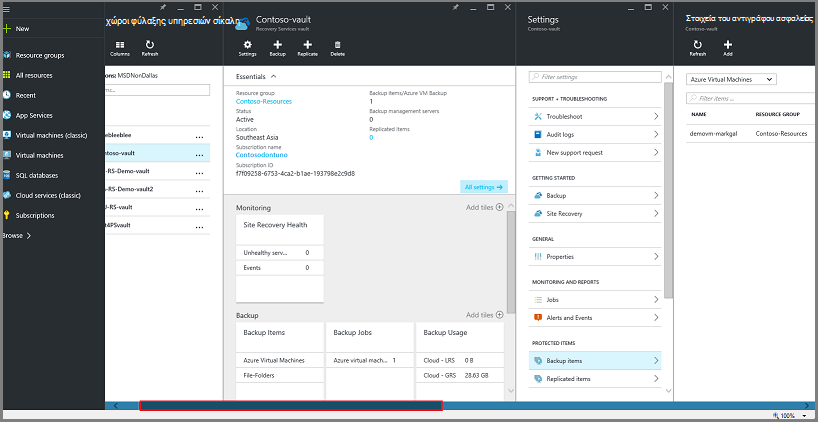

### Ανοίξτε ένα θάλαμο υπηρεσίες ανάκτησης στον πίνακα εργαλείων:

1. Είσοδος στην [πύλη του Azure](https://portal.azure.com/).

2. Στο μενού διανομέα, κάντε κλικ στο κουμπί **Αναζήτηση** και στη λίστα των πόρων, πληκτρολογήστε **Υπηρεσίες ανάκτησης**. Καθώς αρχίζετε να πληκτρολογείτε, η λίστα φίλτρων που βασίζονται σε δεδομένα εισόδου σας. Κάντε κλικ στην επιλογή **υπηρεσίες ανάκτησης θάλαμο**.

      

    Στη λίστα των υπηρεσιών αποκατάστασης χώροι φύλαξης που εμφανίζονται.

    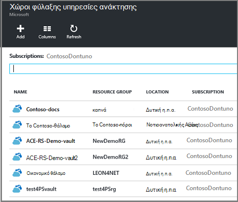  

    >[AZURE.TIP] Εάν καρφιτσώσετε ένα θάλαμο στον πίνακα εργαλείων Azure, θάλαμο που είναι άμεσα προσβάσιμη όταν ανοίγετε το Azure πύλη. Για να καρφιτσώσετε μια θάλαμο στον πίνακα εργαλείων, στη λίστα θάλαμο, κάντε δεξί κλικ το θάλαμο και επιλέξτε **το Pin στον πίνακα εργαλείων**.

3. Από τη λίστα των χώροι φύλαξης, επιλέξτε το θάλαμο για να ανοίξετε το πίνακα εργαλείων. Όταν επιλέγετε το θάλαμο, ανοίξτε τον πίνακα εργαλείων θάλαμο και το blade **Ρυθμίσεις** . Στην παρακάτω εικόνα, επισημαίνεται στον πίνακα εργαλείων **Contoso-θάλαμο** .

    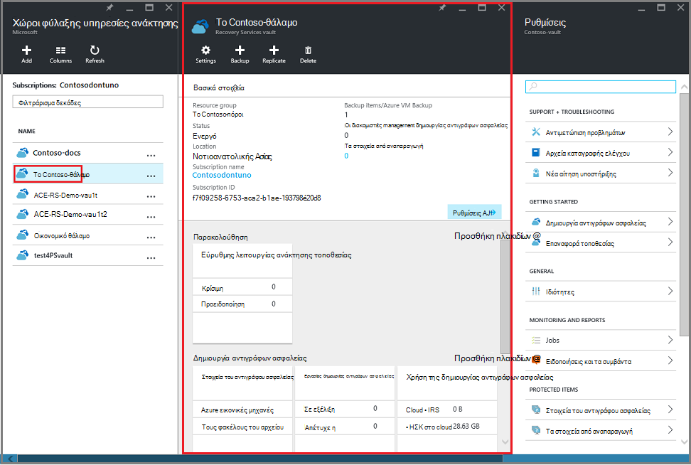

### Ανοίξτε το στοιχείο θάλαμο πίνακα εργαλείων

Στην προηγούμενη διαδικασία που ανοίξατε τον πίνακα εργαλείων θάλαμο. Για να ανοίξετε τον πίνακα εργαλείων στοιχείου θάλαμο:

1. Στον πίνακα εργαλείων θάλαμο, στο πλακίδιο **Στοιχεία αντίγραφο ασφαλείας** , κάντε κλικ στην επιλογή **εικονικές μηχανές Windows Azure**.

    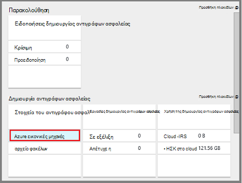

    Τα **Στοιχεία του αντιγράφου ασφαλείας** blade παραθέτει τα τελευταία εργασίας δημιουργίας αντιγράφων ασφαλείας για κάθε στοιχείο. Σε αυτό το παράδειγμα, υπάρχει ένα εικονικό υπολογιστή, demovm-markgal, προστατεύονται από αυτό θάλαμο.  

    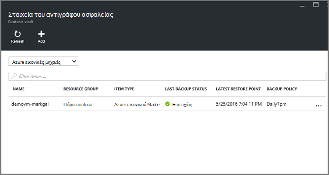

    >[AZURE.TIP] Για διευκόλυνση της access, μπορείτε να καρφιτσώσετε ένα στοιχείο θάλαμο στον πίνακα εργαλείων Azure. Για να καρφιτσώσετε ένα στοιχείο θάλαμο, στη λίστα στοιχείων θάλαμο, κάντε δεξί κλικ στο στοιχείο και επιλέξτε **το Pin στον πίνακα εργαλείων**.

2. Στο το blade **Στοιχεία αντίγραφο ασφαλείας** , κάντε κλικ στο στοιχείο για να ανοίξετε τον πίνακα εργαλείων στοιχείου θάλαμο.

    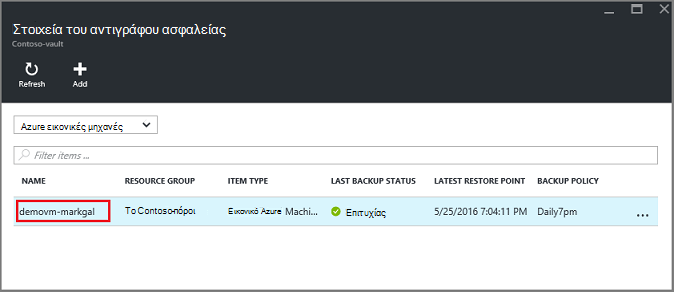

    Άνοιγμα του πίνακα εργαλείων στοιχείου θάλαμο και τις **Ρυθμίσεις** blade.

    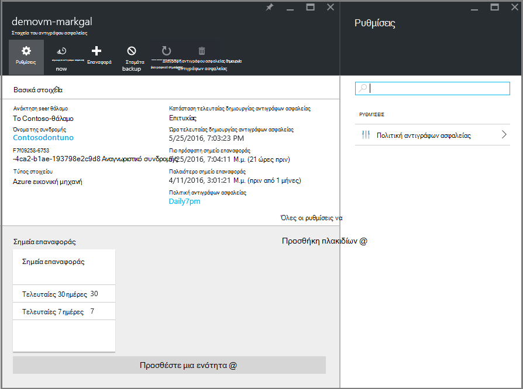

    Από τον πίνακα εργαλείων στοιχείου θάλαμο, που μπορείτε να εκτελέσετε πολλές εργασίες διαχείρισης κλειδιών, όπως:

    - Αλλαγή πολιτικές ή να δημιουργήσετε μια νέα πολιτική ασφαλείας < br\>
    - προβάλετε τα σημεία επαναφοράς και δείτε τους κατάσταση συνέπειας < br\>
    - αντίγραφο ασφαλείας σε ζήτηση της μια εικονική μηχανή < br\>
    - Διακοπή προστασία σε εικονικές μηχανές < br\>
    - Συνέχιση προστασία των μια εικονική μηχανή < br\>
    - Διαγραφή δεδομένων αντιγράφων ασφαλείας (ή σημείου αποκατάστασης) < br\>
    - [Επαναφορά αντιγράφου ασφαλείας (ή σημείου αποκατάστασης)](./backup-azure-arm-restore-vms.md#restore-a-recovery-point) < br\>

Για τις ακόλουθες διαδικασίες, το αρχικό σημείο είναι ο πίνακας εργαλείων στοιχείου θάλαμο.

## Διαχείριση πολιτικών ασφαλείας

1. Στον πίνακα [εργαλείων θάλαμο στοιχείου](backup-azure-manage-vms.md#open-a-vault-item-dashboard), κάντε κλικ στην επιλογή **Όλες οι ρυθμίσεις** για να ανοίξετε το blade **Ρυθμίσεις** .

    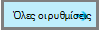

2. Στην το blade **Ρυθμίσεις** , επιλέξτε **πολιτική δημιουργίας αντιγράφων ασφαλείας** για να ανοίξετε αυτόν blade.

    Στην το blade, εμφανίζονται περιοχή συχνότητα και διατήρηση αντιγράφου ασφαλείας λεπτομέρειες.

    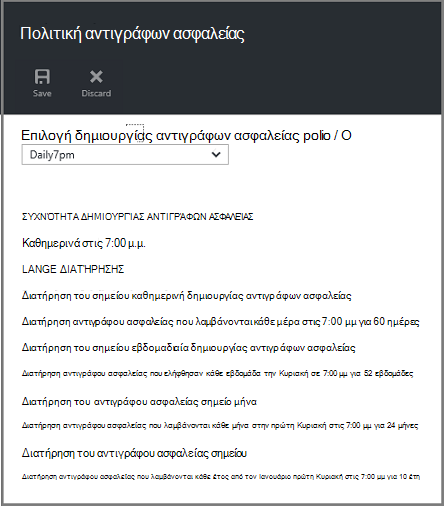

3. Από το μενού **επιλογή αντιγράφου ασφαλείας πολιτικής** :
    - Για να αλλάξετε τις πολιτικές, επιλέξτε μια διαφορετική πολιτική και κάντε κλικ στην επιλογή **Αποθήκευση**. Η νέα πολιτική εφαρμόζεται αμέσως σε το θάλαμο. < br\>
    - Για να δημιουργήσετε μια πολιτική, επιλέξτε **Δημιουργία νέου**.

    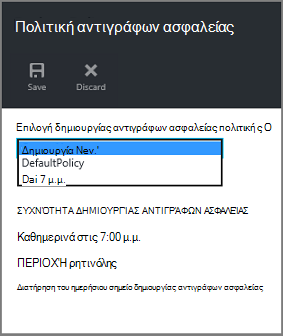

    Για οδηγίες σχετικά με τη δημιουργία ενός αντιγράφου ασφαλείας πολιτικής, ανατρέξτε στο θέμα [Ορισμός μια πολιτική ασφαλείας](backup-azure-manage-vms.md#defining-a-backup-policy).

[AZURE.INCLUDE [backup-create-backup-policy-for-vm](../../includes/backup-create-backup-policy-for-vm.md)]

## Δημιουργία αντιγράφων ασφαλείας σε ζήτηση από μια εικονική μηχανή
Μπορείτε να κρατήσετε ένα στη ζήτηση δημιουργίας αντιγράφων ασφαλείας από μια εικονική μηχανή όταν έχει ρυθμιστεί για την προστασία. Εάν το αρχικό αντίγραφο ασφαλείας είναι σε εκκρεμότητα, αντίγραφα ασφαλείας σε ζήτηση δημιουργεί ένα πλήρες αντίγραφο του η εικονική μηχανή στο το θάλαμο υπηρεσίες ανάκτησης. Εάν το αρχικό αντίγραφο ασφαλείας ολοκληρώθηκε, ένα αντίγραφο ασφαλείας σε ζήτηση θα στέλνει μόνο τις αλλαγές από το προηγούμενο στιγμιότυπο, για να το θάλαμο υπηρεσίες ανάκτησης. Αυτό σημαίνει ότι οι επόμενες αντίγραφα ασφαλείας είναι πάντα αυξάνονται.

>[AZURE.NOTE] Η περιοχή διατήρησης για ένα αντίγραφο ασφαλείας σε ζήτηση είναι η τιμή διατήρησης που έχουν καθοριστεί για το σημείο ημερήσια αντιγράφου ασφαλείας στην πολιτική. Εάν είναι επιλεγμένο κανένα σημείο ημερήσια αντιγράφου ασφαλείας, στη συνέχεια, χρησιμοποιείται σημείου εβδομαδιαία δημιουργίας αντιγράφων ασφαλείας.

Για να ενεργοποιήσετε ένα αντίγραφο ασφαλείας σε ζήτηση των μια εικονική μηχανή:

- Στον πίνακα [εργαλείων θάλαμο στοιχείου](backup-azure-manage-vms.md#open-a-vault-item-dashboard), κάντε κλικ στην επιλογή **Άμεση δημιουργία αντιγράφων ασφαλείας**.

    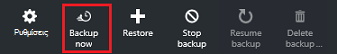

    Πύλη του διασφαλίζει ότι θέλετε να ξεκινήσετε μια εργασία αντιγράφου ασφαλείας σε ζήτηση. Κάντε κλικ στο κουμπί **Ναι** για να ξεκινήσει η εργασία δημιουργίας αντιγράφων ασφαλείας.

    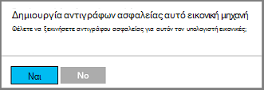

    Η εργασία δημιουργίας αντιγράφων ασφαλείας δημιουργεί ένα σημείο αποκατάστασης. Η περιοχή διατήρησης του σημείου αποκατάστασης είναι ίδια με διατήρηση περιοχής που καθορίζεται από την πολιτική που σχετίζεται με την εικονική μηχανή. Για να παρακολουθήσετε την πρόοδο του έργου, στον πίνακα εργαλείων θάλαμο, κάντε κλικ στο πλακίδιο **Εργασιών δημιουργίας αντιγράφων ασφαλείας** .  

## Διακοπή προστασία σε εικονικές μηχανές
Εάν επιλέξετε να διακόψετε την προστασία μια εικονική μηχανή, σας ζητείται εάν θέλετε να διατηρήσετε τα σημεία αποκατάστασης. Υπάρχουν δύο τρόποι για να διακόψετε την προστασία σε εικονικές μηχανές:
- Διακοπή όλες οι μελλοντικές εργασίες δημιουργίας αντιγράφων ασφαλείας και να διαγράψετε όλα τα σημεία ανάκτησης, ή
- Διακοπή όλες οι μελλοντικές εργασίες δημιουργίας αντιγράφων ασφαλείας, αλλά να αφήσετε τα σημεία ανάκτησης  

Υπάρχει ένα κόστος που σχετίζεται με απομακρυνθείτε από τα σημεία αποκατάστασης στο χώρο αποθήκευσης. Ωστόσο, το όφελος των απομακρυνθείτε από τα σημεία ανάκτησης είναι να μπορείτε να επαναφέρετε την εικονική μηχανή αργότερα, εάν θέλετε. Για πληροφορίες σχετικά με το κόστος απομακρυνθείτε από τα σημεία ανάκτησης, ανατρέξτε στο θέμα της [τις τιμές λεπτομερειών](https://azure.microsoft.com/pricing/details/backup/). Εάν επιλέξετε να διαγράψετε όλα τα σημεία ανάκτησης, δεν μπορείτε να επαναφέρετε την εικονική μηχανή.

Για να διακόψετε την προστασία για μια εικονική μηχανή:

1. Στον πίνακα [εργαλείων θάλαμο στοιχείου](backup-azure-manage-vms.md#open-a-vault-item-dashboard), κάντε κλικ στην επιλογή **Διακοπή δημιουργίας αντιγράφων ασφαλείας**.

    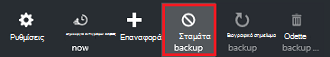

    Ανοίγει το blade διακοπή δημιουργίας αντιγράφων ασφαλείας.

    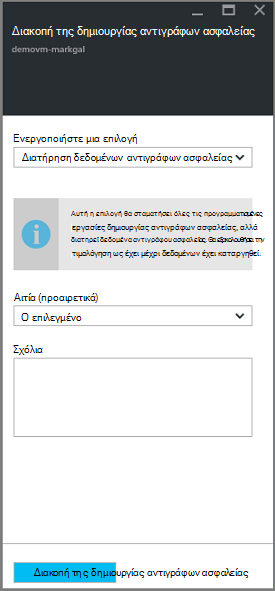

2. Στη τη **Διακοπή της δημιουργίας αντιγράφων ασφαλείας** blade, επιλέξτε εάν θέλετε να διατηρήσετε ή να διαγράψετε τα δεδομένα αντιγράφου ασφαλείας. Πλαίσιο "πληροφορίες" παρέχει λεπτομέρειες σχετικά με την επιλογή σας.

    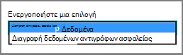

3. Εάν επιλέξατε να διατηρούνται τα δεδομένα αντιγράφου ασφαλείας, προχωρήστε στο βήμα 4. Εάν επιλέξατε να διαγράψετε δεδομένα αντιγράφου ασφαλείας, να επιβεβαιώσετε ότι θέλετε να διακόψετε την εργασιών δημιουργίας αντιγράφων ασφαλείας και να διαγράψετε τα σημεία αποκατάστασης - πληκτρολογήστε το όνομα του στοιχείου.

    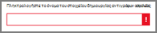

    Εάν δεν είστε βέβαιοι για το όνομα του στοιχείου, το δείκτη του ποντικιού επάνω από το θαυμαστικό για να προβάλετε το όνομα. Επίσης, το όνομα του στοιχείου είναι στην περιοχή στο επάνω μέρος του blade **Διακοπή δημιουργίας αντιγράφων ασφαλείας** .

4. Προαιρετικά παρέχουν μια **λόγο** ή ένα **Σχόλιο**.

5. Για να διακόψετε την εργασία αντιγράφου ασφαλείας για το τρέχον στοιχείο, κάντε κλικ στην επιλογή  

    Ένα μήνυμα ειδοποίησης σας επιτρέπει να γνωρίζετε έχει διακοπεί η εργασιών δημιουργίας αντιγράφων ασφαλείας.

    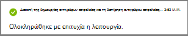

## Συνέχιση προστασίας από μια εικονική μηχανή
Εάν η επιλογή **Διατήρηση δεδομένων αντιγράφων ασφαλείας** έχει επιλέξει όταν διακόπηκε προστασίας για την εικονική μηχανή, στη συνέχεια, είναι πιθανό για να συνεχίσετε την προστασία. Εάν η επιλογή **Διαγραφή δεδομένων αντιγράφων ασφαλείας** έχει επιλέξει, δεν είναι δυνατό να βιογραφικό προστασίας για την εικονική μηχανή.

Για να συνεχίσετε προστασίας για την εικονική μηχανή

1. Στον πίνακα [εργαλείων θάλαμο στοιχείου](backup-azure-manage-vms.md#open-a-vault-item-dashboard), κάντε κλικ στην επιλογή **Συνέχιση δημιουργίας αντιγράφων ασφαλείας**.

    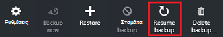

    Ανοίγει το blade πολιτικής δημιουργίας αντιγράφων ασφαλείας.

    >[AZURE.NOTE] Κατά την προστασία εκ νέου η εικονική μηχανή, μπορείτε να επιλέξετε μια διαφορετική πολιτική από την πολιτική με τον οποίο εικονική μηχανή ήταν προστατευμένο αρχικά.

2. Ακολουθήστε τα βήματα στο [πολιτικές αλλαγής ή δημιουργία μια νέα πολιτική ασφαλείας](backup-azure-manage-vms.md#change-policies-or-create-a-new-backup-policy), για να αντιστοιχίσετε την πολιτική για την εικονική μηχανή.

    Όταν η πολιτική ασφαλείας εφαρμόζεται η εικονική μηχανή, μπορείτε να δείτε το ακόλουθο μήνυμα.

    

## Διαγραφή δεδομένων αντιγράφων ασφαλείας
Μπορείτε να διαγράψετε τα δεδομένα αντιγράφου ασφαλείας που σχετίζονται με μια εικονική μηχανή κατά τη διάρκεια της εργασίας **Διακοπή δημιουργίας αντιγράφων ασφαλείας** ή οποιαδήποτε στιγμή μετά τη δημιουργία αντιγράφων ασφαλείας εργασία έχει ολοκληρωθεί. Ακόμα και μπορεί να είναι προτιμότερο να περιμένετε ημέρες ή εβδομάδες πριν από τη διαγραφή των σημείων αποκατάστασης. Σε αντίθεση με την επαναφορά αποκατάστασης σημεία, κατά τη διαγραφή δεδομένων αντιγράφων ασφαλείας, δεν μπορείτε να επιλέξετε συγκεκριμένα αποκατάστασης σημεία για να διαγράψετε. Εάν επιλέξετε να διαγράψετε τα δεδομένα αντιγράφου ασφαλείας σας, μπορείτε να διαγράψετε όλα τα σημεία αποκατάστασης που σχετίζεται με το στοιχείο.

Η παρακάτω διαδικασία προϋποθέτει εργασία αντιγράφου ασφαλείας για την εικονική μηχανή έχει διακοπεί ή έχει απενεργοποιηθεί. Όταν η εργασία δημιουργίας αντιγράφων ασφαλείας είναι απενεργοποιημένη, οι επιλογές **Συνέχιση δημιουργίας αντιγράφων ασφαλείας** και **Διαγραφή δημιουργίας αντιγράφων ασφαλείας** είναι διαθέσιμες στον πίνακα εργαλείων στοιχείου θάλαμο.

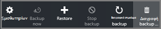

Για να διαγράψετε δεδομένα αντιγράφου ασφαλείας σε μια εικονική μηχανή με το *αντίγραφο ασφαλείας απενεργοποιημένη*:

1. Στον πίνακα [εργαλείων θάλαμο στοιχείου](backup-azure-manage-vms.md#open-a-vault-item-dashboard), κάντε κλικ στην επιλογή **Διαγραφή δημιουργίας αντιγράφων ασφαλείας**.

    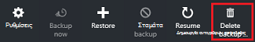

    Ανοίγει το blade **Διαγραφή δεδομένων αντιγράφων ασφαλείας** .

    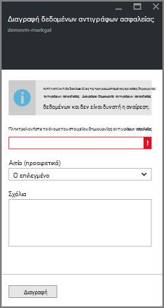

2. Πληκτρολογήστε το όνομα του στοιχείου για να επιβεβαιώσετε ότι θέλετε να διαγράψετε τα σημεία αποκατάστασης.

    

    Εάν δεν είστε βέβαιοι για το όνομα του στοιχείου, το δείκτη του ποντικιού επάνω από το θαυμαστικό για να προβάλετε το όνομα. Επίσης, το όνομα του στοιχείου είναι στην περιοχή στο επάνω μέρος του blade **Διαγραφή δεδομένων αντιγράφων ασφαλείας** .

3. Προαιρετικά παρέχουν μια **λόγο** ή ένα **Σχόλιο**.

4. Για να διαγράψετε τα δεδομένα αντιγράφου ασφαλείας για το τρέχον στοιχείο, κάντε κλικ στην επιλογή  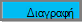

    Ένα μήνυμα ειδοποίησης σας επιτρέπει να γνωρίζετε τα δεδομένα αντιγράφου ασφαλείας που έχει διαγραφεί.

## Επόμενα βήματα

Για πληροφορίες σχετικά με την εκ νέου δημιουργία μια εικονική μηχανή από ένα σημείο αποκατάστασης, ανατρέξτε στο θέμα [Επαναφορά ΣΠΣ Azure](backup-azure-restore-vms.md). Εάν χρειάζεστε πληροφορίες σχετικά με την προστασία σας εικονικές μηχανές, ανατρέξτε στο θέμα [πρώτα μια ματιά: δημιουργία αντιγράφων ασφαλείας ΣΠΣ σε ένα θάλαμο υπηρεσίες ανάκτησης](backup-azure-vms-first-look-arm.md). Για πληροφορίες σχετικά με την παρακολούθηση συμβάντων, ανατρέξτε στο θέμα [οθόνη ειδοποιήσεων για Azure εικονική μηχανή δημιουργίας αντιγράφων ασφαλείας](backup-azure-monitor-vms.md).
