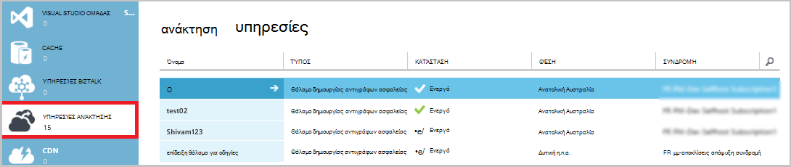

<properties
    pageTitle="Διαχείριση χώροι φύλαξης Azure δημιουργίας αντιγράφων ασφαλείας και των διακομιστών Azure χρησιμοποιώντας το μοντέλο κλασική ανάπτυξης | Microsoft Azure"
    description="Χρησιμοποιήστε αυτό το πρόγραμμα εκμάθησης για να μάθετε πώς μπορείτε να διαχειριστείτε χώροι φύλαξης Azure δημιουργίας αντιγράφων ασφαλείας και των διακομιστών."
    services="backup"
    documentationCenter=""
    authors="markgalioto"
    manager="jwhit"
    editor="tysonn"/>

<tags
    ms.service="backup"
    ms.workload="storage-backup-recovery"
    ms.tgt_pltfrm="na"
    ms.devlang="na"
    ms.topic="article"
    ms.date="09/27/2016"
    ms.author="jimpark;markgal"/>

# Διαχείριση χώροι φύλαξης Azure δημιουργίας αντιγράφων ασφαλείας και τους διακομιστές, χρησιμοποιώντας το μοντέλο κλασική ανάπτυξης

> [AZURE.SELECTOR]
- [Διαχείριση πόρων](backup-azure-manage-windows-server.md)
- [Κλασικό](backup-azure-manage-windows-server-classic.md)

Σε αυτό το άρθρο θα βρείτε μια επισκόπηση των εργασιών διαχείρισης δημιουργίας αντιγράφων ασφαλείας που είναι διαθέσιμα μέσω του Azure κλασική πύλη και τον παράγοντα αντιγράφων ασφαλείας Microsoft Azure.

[AZURE.INCLUDE [learn-about-deployment-models](../../includes/learn-about-deployment-models-classic-include.md)]Διαχείριση πόρων μοντέλο ανάπτυξης.

## Εργασίες διαχείρισης πύλης
1. Είσοδος στην [πύλη διαχείρισης](https://manage.windowsazure.com).

2. Κάντε κλικ στην επιλογή **Υπηρεσίες ανάκτησης**και, στη συνέχεια, κάντε κλικ στο όνομα του αντιγράφου ασφαλείας θάλαμο για να προβάλετε τη σελίδα γρήγορης εκκίνησης.

    

Κάνοντας κλικ στις επιλογές στο επάνω μέρος της σελίδας γρήγορης εκκίνησης, μπορείτε να δείτε τις εργασίες διαχείρισης διαθέσιμη.

### Πίνακας εργαλείων
Επιλέξτε **Πίνακας εργαλείων** για να δείτε την επισκόπηση χρήσης για το διακομιστή. Η **Επισκόπηση χρήση** περιλαμβάνει τα εξής:

- Ο αριθμός των διακομιστών Windows έχουν καταχωρηθεί στο cloud
- Ο αριθμός των Azure εικονικές μηχανές προστατευμένη στο cloud
- Το συνολικό χώρο αποθήκευσης που καταναλώθηκε στο Azure
- Την κατάσταση των πρόσφατων εργασιών

Στο κάτω μέρος του πίνακα εργαλείων, μπορείτε να εκτελέσετε τις ακόλουθες εργασίες:

- **Διαχείριση πιστοποιητικών** - εάν ένα πιστοποιητικό που χρησιμοποιήθηκε για να καταχωρήσετε το διακομιστή και, στη συνέχεια, χρησιμοποιήστε αυτήν την επιλογή για να ενημερώσετε το πιστοποιητικό. Εάν χρησιμοποιείτε τα διαπιστευτήρια θάλαμο, μην χρησιμοποιήσετε **Διαχείριση πιστοποιητικού**.
- **Διαγραφή** - διαγράφει το τρέχον θάλαμο δημιουργίας αντιγράφων ασφαλείας. Εάν δεν είναι πλέον χρησιμοποιείται ένα θάλαμο αντιγράφου ασφαλείας, μπορείτε να διαγράψετε για να αποδεσμεύσετε χώρο αποθήκευσης. **Διαγραφή** είναι ενεργοποιημένη μόνο αφού όλους τους διακομιστές καταχωρημένες έχουν διαγραφεί από το θάλαμο.

## Καταχωρημένες στοιχείων
Επιλέξτε τα **Στοιχεία που έχουν καταχωρηθεί** για να δείτε τα ονόματα των διακομιστών που έχουν καταχωρηθεί για αυτό θάλαμο.

Το φίλτρο **τύπου** προεπιλογών για Azure εικονική μηχανή. Για να δείτε τα ονόματα των διακομιστών που έχουν καταχωρηθεί για αυτό θάλαμο, επιλέξτε **Windows server** από το αναπτυσσόμενο μενού.

Από εδώ, μπορείτε να εκτελέσετε τις ακόλουθες εργασίες:

- **Επανάληψη καταχώρησης αποδοχή** - όταν ενεργοποιήσετε αυτήν την επιλογή για ένα διακομιστή μπορείτε να χρησιμοποιήσετε τον **Οδηγό εγγραφής** στον παράγοντα αντιγράφων ασφαλείας Microsoft Azure εσωτερικής εγκατάστασης για την καταχώρηση του διακομιστή με το αντίγραφο ασφαλείας θάλαμο δεύτερη φορά. Ίσως χρειαστεί να επαναλάβετε την καταχώρηση λόγω σφάλμα στο πιστοποιητικό ή αν ένας διακομιστής έπρεπε να αναδημιουργείται.
- **Διαγραφή** - διαγράφει ένα διακομιστή από το αντίγραφο ασφαλείας θάλαμο. Όλα τα αποθηκευμένα δεδομένα που σχετίζονται με το διακομιστή διαγράφεται αμέσως.

    

## Προστατευμένα στοιχεία
Επιλέξτε **Προστασία στοιχείων** για να προβάλετε τα στοιχεία που έχουν δημιουργηθεί αντίγραφα ασφαλείας από τους διακομιστές.

## Ρύθμιση παραμέτρων

Στην καρτέλα **Ρύθμιση παραμέτρων** , μπορείτε να επιλέξετε την επιλογή πλεονασμού κατάλληλη αποθήκευση. Την καλύτερη δυνατή ώρα για να επιλέξετε την επιλογή πλεονασμού χώρου αποθήκευσης είναι σωστά μετά τη δημιουργία ενός θάλαμο και πριν από κάθε μηχανές καταχωρούνται σε αυτό.

>[AZURE.WARNING] Όταν ένα στοιχείο έχει καταχωρηθεί για το θάλαμο, η επιλογή πλεονασμού χώρου αποθήκευσης είναι κλειδωμένο και δεν μπορεί να τροποποιηθεί.

Ανατρέξτε σε αυτό το άρθρο για περισσότερες πληροφορίες σχετικά με το [χώρο αποθήκευσης πλεονασμού](../storage/storage-redundancy.md).

## Δημιουργία αντιγράφων ασφαλείας του Microsoft Azure παράγοντας εργασίες

### Κονσόλα

Ανοίξτε το **αντίγραφο ασφαλείας του Microsoft Azure παράγοντας** (μπορείτε να το βρείτε κάνοντας αναζήτηση τον υπολογιστή σας για *Δημιουργία αντιγράφων ασφαλείας του Microsoft Azure*).

Από τις **Ενέργειες** διαθέσιμες στη δεξιά πλευρά της κονσόλας παράγοντα αντιγράφων ασφαλείας, μπορείτε να εκτελέσετε τις ακόλουθες εργασίες διαχείρισης:

- Καταχώρηση του διακομιστή
- Χρονοδιάγραμμα δημιουργίας αντιγράφων ασφαλείας
- Δημιουργία αντιγράφου ασφαλείας τώρα
- Αλλαγή ιδιοτήτων

>[AZURE.NOTE] Για να **Ανακτήσετε δεδομένα**, ανατρέξτε στο θέμα [Επαναφορά των αρχείων σε ένα διακομιστή των Windows ή υπολογιστή-πελάτη των Windows](backup-azure-restore-windows-server.md).

### Τροποποιήστε ένα υπάρχον αντίγραφο ασφαλείας

1. Στο αντίγραφο ασφαλείας του Microsoft Azure παράγοντας, κάντε κλικ στην επιλογή **Χρονοδιάγραμμα δημιουργίας αντιγράφων ασφαλείας**.

    

2. Στον **Οδηγό δημιουργίας αντιγράφων ασφαλείας χρονοδιάγραμμα** αφήστε ενεργοποιημένη την επιλογή **αλλαγές στα στοιχεία του αντιγράφου ασφαλείας ή ώρες** και κάντε κλικ στο κουμπί **Επόμενο**.

    

3. Εάν θέλετε να προσθέσετε ή να αλλάξετε στοιχεία, στην οθόνη, **Επιλέξτε στοιχεία για δημιουργία αντιγράφων ασφαλείας** , κάντε κλικ στην επιλογή **Προσθήκη στοιχείων**.

    Μπορείτε επίσης να ορίσετε **Ρυθμίσεις αποκλεισμού** από αυτήν τη σελίδα του οδηγού. Εάν θέλετε να εξαιρέσετε τα αρχεία ή τους τύπους αρχείων, διαβάστε τη διαδικασία για την προσθήκη [ρυθμίσεων αποκλεισμού](#exclusion-settings).

4. Επιλέξτε τα αρχεία και τους φακέλους που θέλετε να δημιουργήσετε αντίγραφα ασφαλείας και κάντε κλικ στην επιλογή **εντάξει**.

    

5. Καθορίστε το **Χρονοδιάγραμμα δημιουργίας αντιγράφων ασφαλείας** και κάντε κλικ στο κουμπί **Επόμενο**.

    Μπορείτε να προγραμματίσετε ημερήσια (στο έως 3 ώρες ανά ημέρα) ή εβδομαδιαία δημιουργίας αντιγράφων ασφαλείας.

    

    >[AZURE.NOTE] Καθορίζει το χρονοδιάγραμμα αντιγράφων ασφαλείας εξηγείται λεπτομερώς σε αυτό το [άρθρο](backup-azure-backup-cloud-as-tape.md).

6. Επιλέξτε την **Πολιτική διατήρησης** για το αντίγραφο ασφαλείας και κάντε κλικ στο κουμπί **Επόμενο**.

    

7. Στην οθόνη **επιβεβαίωσης** , διαβάστε τις πληροφορίες και κάντε κλικ στο κουμπί **Τέλος**.

8. Όταν ο οδηγός ολοκληρώσει τη δημιουργία του **χρονοδιαγράμματος δημιουργίας αντιγράφων ασφαλείας**, κάντε κλικ στο κουμπί **Κλείσιμο**.

    Μετά την τροποποίηση προστασία, μπορείτε να επιβεβαιώσετε ότι αντίγραφα ασφαλείας προκαλούν σωστά, μεταβαίνοντας στην καρτέλα **εργασίες** και επιβεβαίωση ότι οι αλλαγές αντικατοπτρίζονται στην το εργασιών δημιουργίας αντιγράφων ασφαλείας.

### Ενεργοποίηση της επιτάχυνσης δικτύου  
Ο παράγοντας Azure δημιουργίας αντιγράφων ασφαλείας παρέχει μια καρτέλα Throttling, η οποία σας επιτρέπει να ελέγχετε τον τρόπο χρήσης του εύρους ζώνης δικτύου κατά τη μεταφορά δεδομένων. Αυτό το στοιχείο ελέγχου μπορεί να είναι χρήσιμο εάν θέλετε να δημιουργήσετε αντίγραφα ασφαλείας δεδομένων κατά τη διάρκεια ώρες εργασίας, αλλά δεν θέλετε η διαδικασία δημιουργίας αντιγράφων ασφαλείας για να παρεμβάλλεται με άλλες κυκλοφορία internet. Περιορισμού δεδομένων μεταφοράς ισχύει για δημιουργία αντιγράφων ασφαλείας και επαναφορά δραστηριότητες.  

Για να ενεργοποιήσετε περιορισμού:

1. Στον **παράγοντα δημιουργίας αντιγράφων ασφαλείας**, κάντε κλικ στην επιλογή **Αλλαγή ιδιοτήτων**.

2. Επιλέξτε το πλαίσιο ελέγχου **Ενεργοποίηση της χρήσης του εύρους ζώνης internet περιορισμού για λειτουργίες δημιουργίας αντιγράφων ασφαλείας** .

    

3. Αφού ενεργοποιήσετε περιορισμού, καθορίστε το εύρος ζώνης επιτρεπόμενων για μεταφορά των αντιγράφων ασφαλείας δεδομένων κατά τη διάρκεια των **ωρών εργασίας** και **μη εργάσιμες ώρες**.

    Οι τιμές εύρους ζώνης ξεκινά σε 512 kilobyte ανά δευτερόλεπτο (Kbps) και να μεταβείτε προς τα επάνω στο 1023 megabyte ανά δευτερόλεπτο (Mbps). Μπορείτε επίσης να ορίσετε την έναρξη και να λήξης για τις **εργάσιμες ώρες**και ποιες ημέρες της εβδομάδας θεωρούνται εργασίας ημέρες. Ο χρόνος εκτός τις ώρες εργασίας που έχει οριστεί ως θεωρείται μη εργάσιμες ώρες.

4. Κάντε κλικ στο **κουμπί OK**.

## Ρυθμίσεις αποκλεισμού

1. Ανοίξτε το **αντίγραφο ασφαλείας του Microsoft Azure παράγοντας** (μπορείτε να το βρείτε κάνοντας αναζήτηση τον υπολογιστή σας για *Δημιουργία αντιγράφων ασφαλείας του Microsoft Azure*).

    

2. Στο αντίγραφο ασφαλείας του Microsoft Azure παράγοντας, κάντε κλικ στην επιλογή **Χρονοδιάγραμμα δημιουργίας αντιγράφων ασφαλείας**.

    

3. Στον Οδηγό δημιουργίας αντιγράφων ασφαλείας χρονοδιάγραμμα αφήστε ενεργοποιημένη την επιλογή **αλλαγές στα στοιχεία του αντιγράφου ασφαλείας ή ώρες** και κάντε κλικ στο κουμπί **Επόμενο**.

    

4. Κάντε κλικ στην επιλογή **Ρυθμίσεις εξαιρέσεις**.

    

5. Κάντε κλικ στην επιλογή **Προσθήκη εξαίρεσης**.

    

6. Επιλέξτε τη θέση και, στη συνέχεια, κάντε κλικ στο κουμπί **OK**.

    

7. Προσθέστε την επέκταση αρχείου στο πεδίο **Τύπος αρχείου** .

    

    Προσθήκη μια επέκταση .mp3

    

    Για να προσθέσετε μια άλλη επέκταση, κάντε κλικ στην επιλογή **Προσθήκη εξαίρεσης** και εισαγάγετε μια άλλη επέκταση τύπου αρχείου (προσθέτοντας μια επέκταση .jpeg).

    

8. Όταν έχετε προσθέσει όλες τις επεκτάσεις, κάντε κλικ στο **κουμπί OK**.

9. Συνεχίστε μέσω του Οδηγού δημιουργίας αντιγράφων ασφαλείας χρονοδιάγραμμα κάνοντας κλικ στο κουμπί **Επόμενο** μέχρι τη **σελίδα επιβεβαίωσης**και, στη συνέχεια, κάντε κλικ στο κουμπί **Τέλος**.

    

## Επόμενα βήματα
- [Επαναφορά Windows Server ή του προγράμματος-πελάτη των Windows από το Azure](backup-azure-restore-windows-server.md)
- Για να μάθετε περισσότερα σχετικά με τη δημιουργία αντιγράφων ασφαλείας Azure, ανατρέξτε στο θέμα [Επισκόπηση δημιουργίας αντιγράφων ασφαλείας Azure](backup-introduction-to-azure-backup.md)
- Επισκεφθείτε το [φόρουμ Azure δημιουργίας αντιγράφων ασφαλείας](http://go.microsoft.com/fwlink/p/?LinkId=290933)
