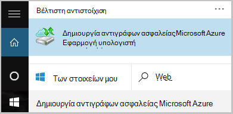

<properties
    pageTitle="Διαχείριση χώροι φύλαξης υπηρεσιών Azure αποκατάστασης και διακομιστές | Microsoft Azure"
    description="Χρησιμοποιήστε αυτό το πρόγραμμα εκμάθησης για να μάθετε πώς να διαχειρίζεστε Azure αποκατάστασης χώροι φύλαξης υπηρεσιών και των διακομιστών."
    services="backup"
    documentationCenter=""
    authors="markgalioto"
    manager="cfreeman"
    editor="tysonn"/>

<tags
    ms.service="backup"
    ms.workload="storage-backup-recovery"
    ms.tgt_pltfrm="na"
    ms.devlang="na"
    ms.topic="article"
    ms.date="10/19/2016"
    ms.author="jimpark; markgal"/>


# <a name="monitor-and-manage-azure-recovery-services-vaults-and-servers-for-windows-machines"></a>Παρακολούθηση και διαχείριση χώροι φύλαξης υπηρεσιών Azure αποκατάστασης και διακομιστές για μηχανές Windows

> [AZURE.SELECTOR]
- [Διαχείριση πόρων](backup-azure-manage-windows-server.md)
- [Κλασικό](backup-azure-manage-windows-server-classic.md)

Σε αυτό το άρθρο θα βρείτε μια επισκόπηση των εργασιών διαχείρισης δημιουργίας αντιγράφων ασφαλείας που είναι διαθέσιμα μέσω του Azure πύλη και τον παράγοντα αντιγράφων ασφαλείας Microsoft Azure.

[AZURE.INCLUDE [learn-about-deployment-models](../../includes/learn-about-deployment-models-rm-include.md)]μοντέλο κλασική ανάπτυξης.

## <a name="management-portal-tasks"></a>Εργασίες διαχείρισης πύλης

### <a name="access-your-recovery-services-vaults"></a>Πρόσβαση σε σας χώροι φύλαξης υπηρεσίες ανάκτησης

1. Πραγματοποιήστε είσοδο [Πύλη Azure](https://portal.azure.com/) χρησιμοποιώντας τη συνδρομή σας στο Azure.

2. Στο μενού διανομέα, κάντε κλικ στο κουμπί **Αναζήτηση** και στη λίστα των πόρων, πληκτρολογήστε **Υπηρεσίες ανάκτησης**. Καθώς αρχίζετε να πληκτρολογείτε, θα φιλτράρετε τη λίστα με βάση τα δεδομένα εισόδου σας. Κάντε κλικ στην επιλογή **υπηρεσίες ανάκτησης χώροι φύλαξης**.

     <br/>

2. Επιλέξτε το όνομα του το θάλαμο που θέλετε να προβάλετε από τη λίστα για να ανοίξετε το blade υπηρεσίες ανάκτησης θάλαμο πίνακα εργαλείων.

     <br/>

## <a name="monitor-jobs-and-alerts"></a>Οθόνη έργα και τις ειδοποιήσεις
Μπορείτε να παρακολουθείτε εργασίες και τις ειδοποιήσεις από τον πίνακα εργαλείων θάλαμο υπηρεσίες ανάκτησης, όπου βλέπετε:

- Λεπτομέρειες αντιγράφων ασφαλείας ειδοποιήσεων
- Τα αρχεία και φακέλους, καθώς και Azure εικονικές μηχανές προστατευμένη στο cloud
- Συνολικό χώρο αποθήκευσης που καταναλώθηκε στο Azure
- Κατάσταση εργασίας δημιουργίας αντιγράφων ασφαλείας


Κάνοντας κλικ στην επιλογή τις πληροφορίες σε κάθε ένα από αυτά τα πλακίδια θα ανοίξει η συσχετισμένη blade όπου μπορείτε να διαχειριστείτε σχετικές εργασίες.

Από το επάνω μέρος του πίνακα εργαλείων:

- Ρυθμίσεις παρέχει πρόσβαση διαθέσιμες εργασίες δημιουργίας αντιγράφων ασφαλείας.
- Δημιουργία αντιγράφου ασφαλείας - σάς βοηθά να δημιουργήσετε αντίγραφα ασφαλείας των νέων αρχείων και φακέλων (ή ΣΠΣ Azure) για να το θάλαμο υπηρεσίες ανάκτησης.
- Διαγραφή - εάν μια θάλαμο υπηρεσίες ανάκτησης χρησιμοποιείται πλέον, μπορείτε να διαγράψετε για να αποδεσμεύσετε χώρο αποθήκευσης. Διαγραφή είναι ενεργοποιημένη μόνο αφού όλους τους διακομιστές προστατευμένο έχουν διαγραφεί από το θάλαμο.


## <a name="alerts-for-backups-using-azure-backup-agent"></a>Ειδοποιήσεις για αντίγραφα ασφαλείας χρησιμοποιώντας Azure παράγοντα αντιγράφων ασφαλείας:
| Επίπεδο προειδοποίησης  | Αποστολή προειδοποιήσεων |
| ------------- | ------------- |
| Κρίσιμη | Αποτυχία δημιουργίας αντιγράφων ασφαλείας, αποτυχία ανάκτησης  |
| Προειδοποίηση  | Δημιουργία αντιγράφου ασφαλείας ολοκληρώθηκε με προειδοποιήσεις (όταν λιγότερα από 100 αρχεία δεν δημιουργούνται αντίγραφα λόγω ζητημάτων καταστροφή και περισσότερα από ένα εκατομμύριο θα με επιτυχία αντίγραφα ασφαλείας)  |
| Ενημερωτικό  | Κανένας  |
## <a name="manage-backup-alerts"></a>Διαχείριση ειδοποιήσεων δημιουργίας αντιγράφων ασφαλείας
Κάντε κλικ στο πλακίδιο **Ειδοποιήσεις δημιουργίας αντιγράφων ασφαλείας** για να ανοίξετε το blade **Ειδοποιήσεις δημιουργίας αντιγράφων ασφαλείας** και να διαχειριστείτε τις ειδοποιήσεις.


Το πλακίδιο ειδοποιήσεις αντίγραφο ασφαλείας εμφανίζει τον αριθμό των:

- κρίσιμη ειδοποιήσεις ανεπίλυτα τελευταίες 24 ώρες
- Προειδοποίηση ειδοποιήσεις ανεπίλυτα τελευταίες 24 ώρες

Κάνοντας κλικ σε κάθε μία από αυτές τις συνδέσεις μεταφέρει το **Αντίγραφο ασφαλείας ειδοποιήσεις** blade με μια φιλτραρισμένη προβολή από αυτές τις ειδοποιήσεις (κρίσιμη ή προειδοποίηση).

Από το blade ειδοποιήσεις αντίγραφο ασφαλείας, μπορείτε:

- Επιλέξτε τις κατάλληλες πληροφορίες για να συμπεριλάβετε με τις ειδοποιήσεις σας.

    

- Φιλτράρετε τις ειδοποιήσεις για τις περιπτώσεις σοβαρότητας, κατάσταση και έναρξη/λήξη.

    

- Ρύθμιση παραμέτρων ειδοποιήσεων για σοβαρότητας, συχνότητα και τους παραλήπτες, καθώς και με ενεργοποίηση ή απενεργοποίηση των ειδοποιήσεων.

    

Εάν **Ανά ειδοποίησης** είναι επιλεγμένο ως τη συχνότητα **ειδοποίηση** εμφανίζεται χωρίς ομαδοποίηση ή μείωση σε μηνύματα ηλεκτρονικού ταχυδρομείου. Κάθε ειδοποίηση αποτελεσμάτων στην ειδοποίηση 1. Αυτή είναι η προεπιλεγμένη ρύθμιση και το μήνυμα ηλεκτρονικού ταχυδρομείου ανάλυση επίσης αποστέλλεται αμέσως.

Εάν έχει επιλεγεί **Ωριαία σύνοψη** ως **ειδοποίηση** συχνότητα ένα μήνυμα ηλεκτρονικού ταχυδρομείου αποστέλλεται στο χρήστη που θα υποδεικνύει ότι δεν υπάρχουν ανεπίλυτη νέες ειδοποιήσεις που δημιουργούνται από την τελευταία ώρα. Μια διεύθυνση ηλεκτρονικού ταχυδρομείου ανάλυση αποστέλλεται στο τέλος της ώρας.

Μπορούν να αποσταλούν ειδοποιήσεις για τα παρακάτω επίπεδα ασφαλείας:

- κρίσιμη
- Προειδοποίηση
- πληροφορίες

Απενεργοποιήστε την ειδοποίηση στο κουμπί **Απενεργοποίηση** από το blade λεπτομέρειες έργου. Όταν κάνετε κλικ στην επιλογή Απενεργοποίηση, μπορείτε να παρέχετε ανάλυση σημειώσεις.

Μπορείτε να επιλέξετε τις στήλες που θέλετε να εμφανίζεται ως μέρος της ειδοποίησης με το κουμπί **Επιλογή στηλών** .

>[AZURE.NOTE] Από το blade **Ρυθμίσεις** , Διαχείριση ειδοποιήσεων αντιγράφου ασφαλείας, επιλέγοντας **παρακολούθησης και αναφορές > ειδοποιήσεις και τα συμβάντα > ειδοποιήσεις δημιουργίας αντιγράφων ασφαλείας** και, στη συνέχεια, κάνοντας κλικ στην επιλογή **Ρύθμιση παραμέτρων ειδοποιήσεων**ή **φίλτρο** .

## <a name="manage-backup-items"></a>Διαχείριση των στοιχείων δημιουργίας αντιγράφων ασφαλείας
Διαχείριση αντίγραφα ασφαλείας εσωτερικής εγκατάστασης είναι πλέον διαθέσιμη στην πύλη διαχείρισης. Στην ενότητα Δημιουργία αντιγράφων ασφαλείας του πίνακα εργαλείων, το πλακίδιο **Στοιχεία του αντιγράφου ασφαλείας** εμφανίζει τον αριθμό των αντιγράφων ασφαλείας στοιχείων προστατευμένη για να το θάλαμο.

Κάντε κλικ στην επιλογή **Φάκελοι αρχείων** στο πλακίδιο στοιχεία δημιουργίας αντιγράφων ασφαλείας.


Τα στοιχεία του αντιγράφου ασφαλείας blade ανοίγει με το φίλτρο που έχει οριστεί σε φάκελο αρχείων όπου μπορείτε να δείτε κάθε συγκεκριμένο αντίγραφο ασφαλείας στοιχείου που παρατίθενται.


Εάν επιλέξετε ένα συγκεκριμένο στοιχείο δημιουργίας αντιγράφων ασφαλείας από τη λίστα, μπορείτε να δείτε τα βασικά στοιχεία για αυτό το στοιχείο.

>[AZURE.NOTE] Από το blade **Ρυθμίσεις** , διαχειρίζεστε αρχεία και φάκελοι, επιλέγοντας **προστασία στοιχείων > Δημιουργία αντιγράφων ασφαλείας στοιχείων** και, στη συνέχεια, επιλέγοντας **Φακέλους αρχείων** από το αναπτυσσόμενο μενού.


## <a name="manage-backup-jobs"></a>Διαχείριση εργασιών δημιουργίας αντιγράφων ασφαλείας
Δημιουργία αντιγράφων ασφαλείας των εργασιών για δύο εσωτερικής εγκατάστασης (όταν ο διακομιστής εσωτερικής εγκατάστασης είναι αντίγραφα ασφαλείας σε Azure) και Azure αντίγραφα ασφαλείας είναι ορατές στον πίνακα εργαλείων.

Στην ενότητα Δημιουργία αντιγράφων ασφαλείας του πίνακα εργαλείων, το πλακίδιο εργασίας δημιουργίας αντιγράφων ασφαλείας εμφανίζει τον αριθμό των εργασιών:

- σε εξέλιξη
- Απέτυχε η τις τελευταίες 24 ώρες.

Για να διαχειριστείτε τις εργασίες αντιγράφων ασφαλείας, κάντε κλικ στο πλακίδιο **Εργασιών δημιουργίας αντιγράφων ασφαλείας** , το οποίο ανοίγει τα blade εργασιών δημιουργίας αντιγράφων ασφαλείας.


Μπορείτε να τροποποιήσετε τις πληροφορίες που είναι διαθέσιμες στο το blade εργασιών δημιουργίας αντιγράφων ασφαλείας με το κουμπί **Επιλογή στηλών** στο επάνω μέρος της σελίδας.

Χρησιμοποιήστε το κουμπί **φίλτρο** για να επιλέξετε μεταξύ των αρχείων και φακέλων και Azure εικονική μηχανή δημιουργίας αντιγράφων ασφαλείας.

Εάν δεν βλέπετε το αντίγραφα ασφαλείας των αρχείων και φακέλων, κάντε κλικ στο κουμπί **φίλτρο** στο επάνω μέρος της σελίδας και επιλέξτε **αρχείων και φακέλων** από το μενού τύπος στοιχείου.

>[AZURE.NOTE] Από το blade **Ρυθμίσεις** , Διαχείριση εργασιών δημιουργίας αντιγράφων ασφαλείας, επιλέγοντας **παρακολούθησης και αναφορές > εργασίες > εργασιών δημιουργίας αντιγράφων ασφαλείας** και, στη συνέχεια, επιλέγοντας **Φακέλους αρχείων** από το αναπτυσσόμενο μενού.

## <a name="monitor-backup-usage"></a>Παρακολούθηση χρήσης δημιουργίας αντιγράφων ασφαλείας
Στην ενότητα Δημιουργία αντιγράφων ασφαλείας του πίνακα εργαλείων, το πλακίδιο χρήση αντίγραφο ασφαλείας εμφανίζει το χώρο αποθήκευσης που καταναλώθηκε στο Azure. Χρήση του χώρου αποθήκευσης παρέχεται για:
- Χρήση του χώρου αποθήκευσης LRS που σχετίζεται με το θάλαμο στο cloud
- Χρήση του χώρου αποθήκευσης Εξοπλισμό που σχετίζεται με το θάλαμο στο cloud

## <a name="production-servers"></a>Διακομιστές παραγωγής
Για να διαχειριστείτε τους διακομιστές παραγωγής, κάντε κλικ στην επιλογή **Ρυθμίσεις**. Στην περιοχή Διαχείριση, κάντε κλικ στην επιλογή **υποδομή δημιουργίας αντιγράφων ασφαλείας > διακομιστές παραγωγής**.

Οι λίστες blade διακομιστές παραγωγής όλων των διακομιστών διαθέσιμη παραγωγής σας. Κάντε κλικ σε ένα διακομιστή από τη λίστα για να ανοίξετε τις λεπτομέρειες του διακομιστή.


## <a name="microsoft-azure-backup-agent-tasks"></a>Δημιουργία αντιγράφων ασφαλείας του Microsoft Azure παράγοντας εργασίες

## <a name="open-the-backup-agent"></a>Ανοίξτε τον παράγοντα αντιγράφων ασφαλείας

Ανοίξτε τον **παράγοντα δημιουργίας αντιγράφων ασφαλείας του Microsoft Azure** (θεωρείτε κάνοντας αναζήτηση τον υπολογιστή σας για *Δημιουργία αντιγράφων ασφαλείας του Microsoft Azure*).



Από τις **Ενέργειες** διαθέσιμες στη δεξιά πλευρά της κονσόλας παράγοντα αντιγράφων ασφαλείας μπορείτε να εκτελέσετε τις ακόλουθες εργασίες διαχείρισης:

- Καταχώρηση του διακομιστή
- Χρονοδιάγραμμα δημιουργίας αντιγράφων ασφαλείας
- Δημιουργία αντιγράφου ασφαλείας τώρα
- Αλλαγή ιδιοτήτων


>[AZURE.NOTE] Για να **Ανακτήσετε δεδομένα**, ανατρέξτε στο θέμα [Επαναφορά των αρχείων σε ένα διακομιστή των Windows ή υπολογιστή-πελάτη των Windows](backup-azure-restore-windows-server.md).

## <a name="modify-an-existing-backup"></a>Τροποποιήστε ένα υπάρχον αντίγραφο ασφαλείας

1. Στο αντίγραφο ασφαλείας του Microsoft Azure παράγοντας, κάντε κλικ στην επιλογή **Χρονοδιάγραμμα δημιουργίας αντιγράφων ασφαλείας**.

    

2. Στον **Οδηγό δημιουργίας αντιγράφων ασφαλείας χρονοδιάγραμμα** αφήστε ενεργοποιημένη την επιλογή **αλλαγές στα στοιχεία του αντιγράφου ασφαλείας ή ώρες** και κάντε κλικ στο κουμπί **Επόμενο**.

    

3. Εάν θέλετε να προσθέσετε ή να αλλάξετε στοιχεία, στην οθόνη, **Επιλέξτε στοιχεία για δημιουργία αντιγράφων ασφαλείας** , κάντε κλικ στην επιλογή **Προσθήκη στοιχείων**.

    Μπορείτε επίσης να ορίσετε **Ρυθμίσεις αποκλεισμού** από αυτήν τη σελίδα του οδηγού. Εάν θέλετε να εξαιρέσετε τα αρχεία ή τους τύπους αρχείων, διαβάστε τη διαδικασία για την προσθήκη [ρυθμίσεων αποκλεισμού](#exclusion-settings).

4. Επιλέξτε τα αρχεία και τους φακέλους που θέλετε να δημιουργήσετε αντίγραφα ασφαλείας και κάντε κλικ στην επιλογή **εντάξει**.

    

5. Καθορίστε το **Χρονοδιάγραμμα δημιουργίας αντιγράφων ασφαλείας** και κάντε κλικ στο κουμπί **Επόμενο**.

    Μπορείτε να προγραμματίσετε ημερήσια (στο έως 3 ώρες ανά ημέρα) ή εβδομαδιαία δημιουργίας αντιγράφων ασφαλείας.

    

    >[AZURE.NOTE] Καθορίζει το χρονοδιάγραμμα αντιγράφων ασφαλείας εξηγείται λεπτομερώς σε αυτό το [άρθρο](backup-azure-backup-cloud-as-tape.md).

6. Επιλέξτε την **Πολιτική διατήρησης** για το αντίγραφο ασφαλείας και κάντε κλικ στο κουμπί **Επόμενο**.

    

7. Στην οθόνη **επιβεβαίωσης** , διαβάστε τις πληροφορίες και κάντε κλικ στο κουμπί **Τέλος**.

8. Όταν ο οδηγός ολοκληρώσει τη δημιουργία του **χρονοδιαγράμματος δημιουργίας αντιγράφων ασφαλείας**, κάντε κλικ στο κουμπί **Κλείσιμο**.

    Μετά την τροποποίηση προστασία, μπορείτε να επιβεβαιώσετε ότι αντίγραφα ασφαλείας προκαλούν σωστά, μεταβαίνοντας στην καρτέλα **εργασίες** και επιβεβαίωση ότι οι αλλαγές αντικατοπτρίζονται στην το εργασιών δημιουργίας αντιγράφων ασφαλείας.

## <a name="enable-network-throttling"></a>Ενεργοποίηση της επιτάχυνσης δικτύου  
Ο παράγοντας Azure δημιουργίας αντιγράφων ασφαλείας παρέχει μια καρτέλα Throttling, η οποία σας επιτρέπει να ελέγχετε τον τρόπο χρήσης του εύρους ζώνης δικτύου κατά τη μεταφορά δεδομένων. Αυτό το στοιχείο ελέγχου μπορεί να είναι χρήσιμο εάν θέλετε να δημιουργήσετε αντίγραφα ασφαλείας δεδομένων κατά τη διάρκεια ώρες εργασίας, αλλά δεν θέλετε η διαδικασία δημιουργίας αντιγράφων ασφαλείας για να παρεμβάλλεται με άλλες κυκλοφορία internet. Περιορισμού δεδομένων μεταφοράς ισχύει για δημιουργία αντιγράφων ασφαλείας και επαναφορά δραστηριότητες.  

Για να ενεργοποιήσετε περιορισμού:

1. Στον **παράγοντα δημιουργίας αντιγράφων ασφαλείας**, κάντε κλικ στην επιλογή **Αλλαγή ιδιοτήτων**.

2. Στην του **περιορισμού καρτέλα, επιλέξτε **Ενεργοποίηση περιορισμού για το αντίγραφο ασφαλείας λειτουργίες ** χρήσης του εύρους ζώνης internet.

    

    Αφού ενεργοποιήσετε περιορισμού, καθορίστε το επιτρεπόμενο εύρος ζώνης για μεταφορά των αντιγράφων ασφαλείας δεδομένων κατά τη διάρκεια των **ωρών εργασίας** και **μη εργάσιμες ώρες**.

    Οι τιμές εύρους ζώνης ξεκινά σε 512 kilobyte ανά δευτερόλεπτο (Kbps) και να μεταβείτε προς τα επάνω στο 1023 megabyte ανά δευτερόλεπτο (Mbps). Μπορείτε επίσης να ορίσετε την έναρξη και να λήξης για τις **εργάσιμες ώρες**και ποιες ημέρες της εβδομάδας θεωρούνται εργασίας ημέρες. Ο χρόνος εκτός τις ώρες εργασίας που έχει οριστεί ως θεωρείται μη εργάσιμες ώρες.

3. Κάντε κλικ στο **κουμπί OK**.

## <a name="manage-exclusion-settings"></a>Διαχείριση ρυθμίσεων αποκλεισμού

1. Ανοίξτε το **αντίγραφο ασφαλείας του Microsoft Azure παράγοντας** (μπορείτε να το βρείτε κάνοντας αναζήτηση τον υπολογιστή σας για *Δημιουργία αντιγράφων ασφαλείας του Microsoft Azure*).

    

2. Στο αντίγραφο ασφαλείας του Microsoft Azure παράγοντας, κάντε κλικ στην επιλογή **Χρονοδιάγραμμα δημιουργίας αντιγράφων ασφαλείας**.

    

3. Στον Οδηγό δημιουργίας αντιγράφων ασφαλείας χρονοδιάγραμμα αφήστε ενεργοποιημένη την επιλογή **αλλαγές στα στοιχεία του αντιγράφου ασφαλείας ή ώρες** και κάντε κλικ στο κουμπί **Επόμενο**.

    

4. Κάντε κλικ στην επιλογή **Ρυθμίσεις εξαιρέσεις**.

    

5. Κάντε κλικ στην επιλογή **Προσθήκη εξαίρεσης**.

    

6. Επιλέξτε τη θέση και, στη συνέχεια, κάντε κλικ στο κουμπί **OK**.

    

7. Προσθέστε την επέκταση αρχείου στο πεδίο **Τύπος αρχείου** .

    

    Προσθήκη μια επέκταση .mp3

    

    Για να προσθέσετε μια άλλη επέκταση, κάντε κλικ στην επιλογή **Προσθήκη εξαίρεσης** και εισαγάγετε μια άλλη επέκταση τύπου αρχείου (προσθέτοντας μια επέκταση .jpeg).

    

8. Όταν έχετε προσθέσει όλες τις επεκτάσεις, κάντε κλικ στο **κουμπί OK**.

9. Συνεχίστε μέσω του Οδηγού δημιουργίας αντιγράφων ασφαλείας χρονοδιάγραμμα κάνοντας κλικ στο κουμπί **Επόμενο** μέχρι τη **σελίδα επιβεβαίωσης**και, στη συνέχεια, κάντε κλικ στο κουμπί **Τέλος**.

    

## <a name="frequently-asked-questions"></a>Συνήθεις ερωτήσεις
**ΤΡ1. Την κατάσταση εργασίας δημιουργίας αντιγράφων ασφαλείας εμφανίζεται ως ολοκληρωμένη του Azure παράγοντα δημιουργίας αντιγράφων ασφαλείας, γιατί δεν να λάβετε αποτυπώνονται αμέσως στην πύλη;**

A1. Δεν υπάρχουν στο μέγιστο καθυστέρηση από 15 λεπτά μεταξύ της κατάστασης εργασίας δημιουργίας αντιγράφων ασφαλείας ενημερώνεται στη τον παράγοντα Azure αντιγράφων ασφαλείας και την πύλη του Azure.

**Q.2 όταν αποτύχει η μιας εργασίας δημιουργίας αντιγράφων ασφαλείας, πόσος χρόνος απαιτείται για να βελτιώσετε μια ειδοποίηση;**

A.2 ειδοποίησης ενεργοποιείται μέσα σε 20 λεπτά από το Azure αποτυχία δημιουργίας αντιγράφων ασφαλείας.

**ΤΡ3. Υπάρχει περίπτωση όπου δεν θα σταλεί ένα μήνυμα ηλεκτρονικού ταχυδρομείου εάν έχουν ρυθμιστεί οι παράμετροι ειδοποιήσεις;**

A3. Κάτω από το στοιχείο είναι περιπτώσεις κατά την ειδοποίηση δεν θα αποσταλεί για να μειώσετε το θόρυβο ειδοποίησης:

   - Εάν έχουν ρυθμιστεί ωριαία ειδοποιήσεις και ειδοποίησης είναι υψωμένο και η ανάλυση μέσα την ώρα
   - Ακύρωση εργασίας.
   - Δεύτερο εργασίας δημιουργίας αντιγράφων ασφαλείας απέτυχε επειδή το αρχικό εργασίας δημιουργίας αντιγράφων ασφαλείας βρίσκεται σε εξέλιξη.

## <a name="troubleshooting-monitoring-issues"></a>Αντιμετώπιση προβλημάτων παρακολούθησης

**Ζήτημα:** Εργασίες ή/και τις ειδοποιήσεις από τον παράγοντα αντιγράφων ασφαλείας Azure δεν εμφανίζονται στην πύλη.

**Βήματα αντιμετώπισης προβλημάτων:** Η διαδικασία, ```OBRecoveryServicesManagementAgent```, στέλνει την εργασία και ειδοποίηση δεδομένων στην υπηρεσία Azure δημιουργίας αντιγράφων ασφαλείας. Μερικές φορές μπορεί να γίνει κολλήσει αυτήν τη διαδικασία ή τον τερματισμό.

1. Για να επαληθεύσετε τη διαδικασία δεν εκτελείται, ανοίξτε τη **Διαχείριση εργασιών** και ελέγξτε εάν το ```OBRecoveryServicesManagementAgent``` διεργασία εκτελείται.

2. Εάν υποθέσουμε ότι η διαδικασία δεν λειτουργεί, ανοίξτε **Τον πίνακα ελέγχου** και μεταβείτε στη λίστα των υπηρεσιών. Έναρξη ή να κάνετε επανεκκίνηση του **Microsoft Azure υπηρεσίες διαχείρισης του παράγοντα αποκατάστασης**.

    Για περισσότερες πληροφορίες, αναζητήστε τα αρχεία καταγραφής στο:<br/>
`<AzureBackup_agent_install_folder>\Microsoft Azure Recovery Services Agent\Temp\GatewayProvider*`. Για παράδειγμα:<br/> `C:\Program Files\Microsoft Azure Recovery Services Agent\Temp\GatewayProvider0.errlog`.

## <a name="next-steps"></a>Επόμενα βήματα
- [Επαναφορά Windows Server ή του προγράμματος-πελάτη των Windows από το Azure](backup-azure-restore-windows-server.md)
- Για να μάθετε περισσότερα σχετικά με τη δημιουργία αντιγράφων ασφαλείας Azure, ανατρέξτε στο θέμα [Επισκόπηση δημιουργίας αντιγράφων ασφαλείας Azure](backup-introduction-to-azure-backup.md)
- Επισκεφθείτε το [φόρουμ Azure δημιουργίας αντιγράφων ασφαλείας](http://go.microsoft.com/fwlink/p/?LinkId=290933)
