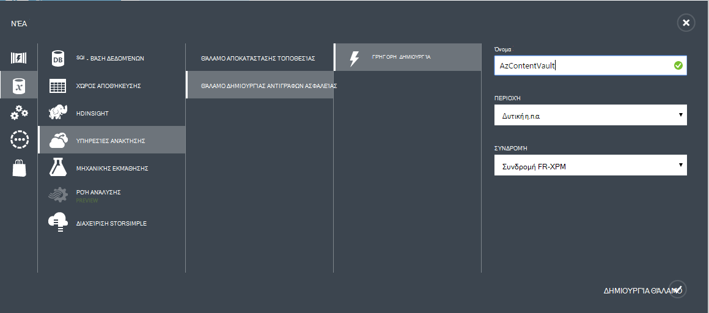
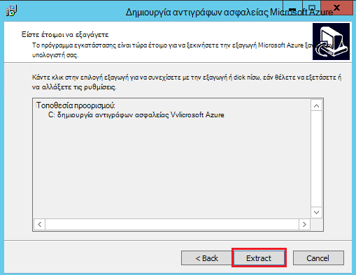
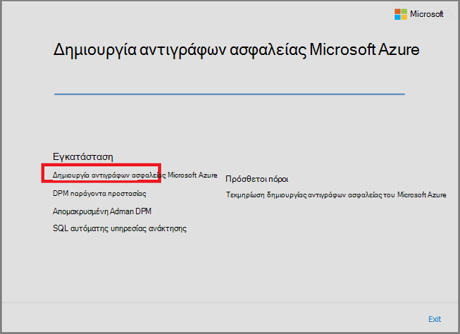
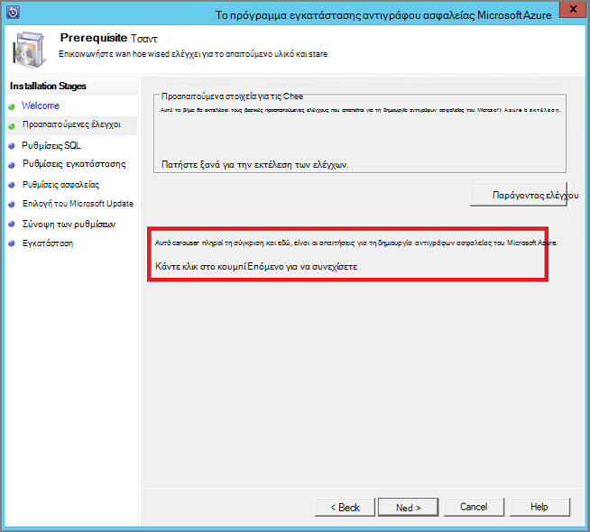
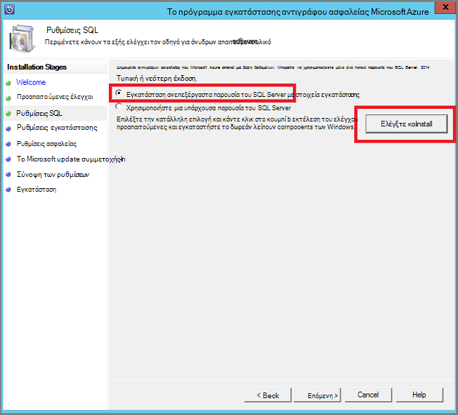
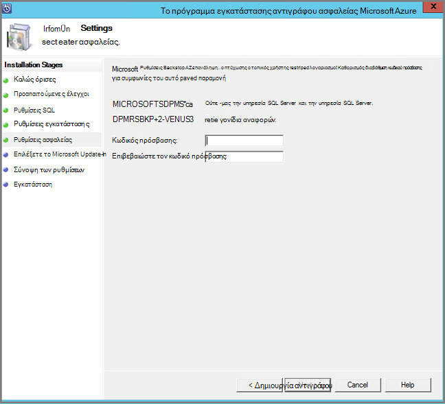
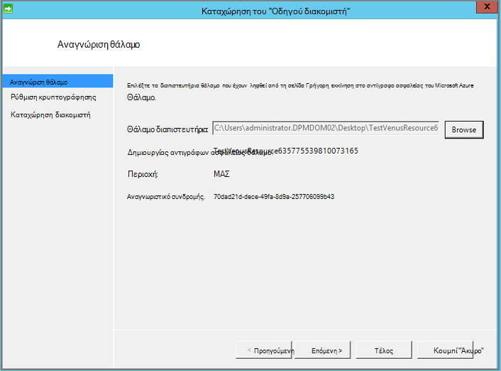
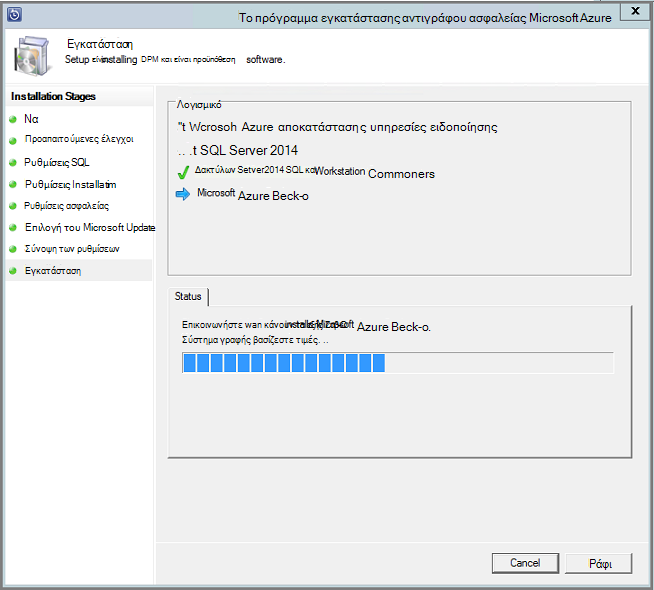

<properties
  pageTitle="Προετοιμασία του περιβάλλοντός σας για να δημιουργήσετε αντίγραφα ασφαλείας φόρτους εργασίας με χρήση διακομιστή αντίγραφο ασφαλείας Azure | Microsoft Azure"
  description="Βεβαιωθείτε ότι το περιβάλλον σωστά είναι έτοιμη για να δημιουργήσετε αντίγραφα ασφαλείας φόρτους εργασίας με χρήση διακομιστή αντίγραφο ασφαλείας Azure"
  services="backup"
  documentationCenter=""
  authors="pvrk"
  manager="shivamg"
  editor=""
  keywords="Azure δημιουργίας αντιγράφων ασφαλείας διακομιστή. θάλαμο δημιουργίας αντιγράφων ασφαλείας"/>

<tags
  ms.service="backup"
  ms.workload="storage-backup-recovery"
  ms.tgt_pltfrm="na"
  ms.devlang="na"
  ms.topic="article"
  ms.date="08/22/2016"
  ms.author="jimpark;trinadhk;pullabhk; markgal"/>

# <a name="preparing-to-back-up-workloads-using-azure-backup-server"></a>Προετοιμασία του για να δημιουργήσετε αντίγραφα ασφαλείας φόρτους εργασίας με χρήση διακομιστή αντίγραφο ασφαλείας Azure

> [AZURE.SELECTOR]
- [Διακομιστής Azure αντιγράφων ασφαλείας](backup-azure-microsoft-azure-backup.md)
- [SCDPM](backup-azure-dpm-introduction.md)
- [Διακομιστής Azure αντιγράφων ασφαλείας (κλασικό)](backup-azure-microsoft-azure-backup-classic.md)
- [SCDPM (κλασικό)](backup-azure-dpm-introduction-classic.md)


Σε αυτό το άρθρο αφορά την προετοιμασία του περιβάλλοντός σας για να δημιουργήσετε αντίγραφα ασφαλείας φόρτους εργασίας με χρήση διακομιστή Azure δημιουργίας αντιγράφων ασφαλείας. Με το διακομιστή Azure αντίγραφο ασφαλείας, μπορείτε να προστατεύσετε φόρτους εργασίας εφαρμογή όπως το Hyper-V ΣΠΣ, Microsoft SQL Server, του SharePoint Server, Microsoft Exchange και προγράμματα-πελάτες των Windows από μια μεμονωμένη κονσόλα.

>[AZURE.WARNING] Διακομιστής Azure αντιγράφων ασφαλείας μεταβιβάζονται τη λειτουργικότητα της διαχείρισης προστασίας δεδομένων (DPM) για το φόρτο εργασίας δημιουργίας αντιγράφων ασφαλείας. Θα βρείτε δείκτες DPM τεκμηρίωση για ορισμένες από αυτές τις δυνατότητες. Ωστόσο Azure δημιουργίας αντιγράφων ασφαλείας διακομιστή δεν παρέχουν προστασία στο ταινίας ούτε ενοποίηση με το κέντρο του συστήματος.

## <a name="1-windows-server-machine"></a>1. υπολογιστή διακομιστή Windows


Το πρώτο βήμα για την επίτευξη γρήγορα Azure δημιουργίας αντιγράφων ασφαλείας διακομιστή προς τα επάνω και εκτελεί είναι να έχετε έναν υπολογιστή Windows Server.

| Θέση | Ελάχιστες απαιτήσεις | Πρόσθετες οδηγίες |
| -------- | -------------------- | ----------------------- |
| Azure | Azure IaaS εικονική μηχανή<br><br>A2 Τυπική: 2 πυρήνων, 3,5 GB RAM | Μπορείτε να ξεκινήσετε με μια εικόνα απλό συλλογή του Windows Server 2012 R2 κέντρου δεδομένων. [Προστασία IaaS φόρτους εργασίας χρησιμοποιώντας Azure δημιουργίας αντιγράφων ασφαλείας διακομιστή (DPM)](https://technet.microsoft.com/library/jj852163.aspx) έχει πολλά nuances. Βεβαιωθείτε ότι έχετε διαβάστε το άρθρο πλήρως πριν από την ανάπτυξη του υπολογιστή. |
| Εσωτερικής εγκατάστασης | Εικονική Hyper-V<br> Εικονική VMWare<br> ή μια υπηρεσία παροχής φιλοξενίας φυσικής<br><br>2 πυρήνων και 4GB RAM | Μπορείτε να deduplicate το χώρο αποθήκευσης DPM μέσω Απαλοιφή διπλοτύπων διακομιστή των Windows. Μάθετε περισσότερα σχετικά με τον τρόπο [DPM και Απαλοιφή διπλοτύπων](https://technet.microsoft.com/library/dn891438.aspx) συνεργάζονται όταν αναπτυχθεί στο ΣΠΣ Hyper-V. |

> [AZURE.NOTE] Συνιστάται να ότι ο διακομιστής Azure δημιουργίας αντιγράφων ασφαλείας θα εγκατασταθεί σε υπολογιστή με Windows Server 2012 R2 κέντρου δεδομένων. Πολλές από τις προϋποθέσεις καλύπτονται αυτόματα με την πιο πρόσφατη έκδοση του λειτουργικού συστήματος των Windows.

Εάν σκοπεύετε να συνδέσετε αυτόν το διακομιστή σε έναν τομέα σε κάποιο σημείο, συνιστάται να ότι τη δραστηριότητα τη συμμετοχή σε τομέα να γίνει πριν από την εγκατάσταση Azure δημιουργίας αντιγράφων ασφαλείας διακομιστή. Μετακίνηση ενός υπάρχοντος υπολογιστή Azure δημιουργίας αντιγράφων ασφαλείας διακομιστή σε έναν νέο τομέα μετά την ανάπτυξη *δεν*υποστηρίζεται.

## <a name="2-backup-vault"></a>2. αντιγράφου ασφαλείας θάλαμο


Εάν στέλνετε δεδομένα αντιγράφου ασφαλείας για να Azure ή Διατηρήστε την επιλογή τοπικά, το λογισμικό πρέπει να είστε συνδεδεμένοι Azure. Για να είναι πιο συγκεκριμένες, υπολογιστή του Azure δημιουργίας αντιγράφων ασφαλείας διακομιστή πρέπει να έχει εγγραφεί σε ένα αντίγραφο ασφαλείας θάλαμο.

Για να δημιουργήσετε ένα αντίγραφο ασφαλείας θάλαμο:

1. Είσοδος στην [πύλη διαχείρισης](http://manage.windowsazure.com/).

2. Κάντε κλικ στην επιλογή **νέα** > **υπηρεσίες δεδομένων** > **υπηρεσίες ανάκτησης** > **αντιγράφου ασφαλείας θάλαμο** > **γρήγορης δημιουργίας**. Εάν έχετε πολλές συνδρομές που σχετίζεται με τον εταιρικό λογαριασμό σας, επιλέξτε τη σωστή συνδρομή για να συσχετίσετε με το αντίγραφο ασφαλείας θάλαμο.

3. Στο πλαίσιο **όνομα**, πληκτρολογήστε ένα φιλικό όνομα για τον προσδιορισμό του θάλαμο. Αυτό πρέπει να είναι μοναδικός για κάθε εγγραφή.

4. Στην **περιοχή**, επιλέξτε τη γεωγραφική περιοχή για το θάλαμο. Συνήθως, η περιοχή το θάλαμο είναι συλλογή βάσει περιορισμών λανθάνων χρόνος δικτύου ή ακεραιότητα δεδομένων.

    

5. Κάντε κλικ στην επιλογή **Δημιουργία θάλαμο**. Ενδέχεται να χρειαστεί κάποιος χρόνος για το αντίγραφο ασφαλείας θάλαμο θα δημιουργηθεί. Παρακολουθείτε τις ειδοποιήσεις κατάστασης στο κάτω μέρος της πύλης.

    

6. Ένα μήνυμα επιβεβαιώνει ότι το θάλαμο δημιουργήθηκε με επιτυχία και θα εμφανίζεται στη σελίδα υπηρεσίες ανάκτησης ως ενεργό.
    

  > [AZURE.IMPORTANT] Βεβαιωθείτε ότι έχει επιλεγεί η επιλογή πλεονασμού κατάλληλη αποθήκευση δεξιά αφού δημιουργηθεί το θάλαμο. Διαβάστε περισσότερα σχετικά με το [παν πλεονάζοντα](../storage/storage-redundancy.md#geo-redundant-storage) και [τοπικά πλεονάζοντα](../storage/storage-redundancy.md#locally-redundant-storage) επιλογών σε αυτή η [Επισκόπηση](../storage/storage-redundancy.md).


## <a name="3-software-package"></a>3. πακέτο λογισμικού


### <a name="downloading-the-software-package"></a>Λήψη του πακέτου λογισμικού

Παρόμοια με φύλαξης διαπιστευτήρια, μπορείτε να κάνετε λήψη αντιγράφου ασφαλείας της Microsoft Azure για εφαρμογή φόρτους εργασίας από την **Αρχική σελίδα γρήγορη** της του αντιγράφου ασφαλείας θάλαμο.

1. Κάντε κλικ **για φόρτους εργασίας εφαρμογών (δίσκο σε δίσκο στο Cloud)**. Αυτό θα σας μεταφέρει στη σελίδα Κέντρο λήψης αρχείων από το σημείο όπου μπορείτε να κάνετε λήψη του πακέτου λογισμικού.

    

2. Κάντε κλικ στην επιλογή **λήψη**.

    

3. Επιλέξτε όλα τα αρχεία και κάντε κλικ στο κουμπί **Επόμενο**. Λήψη όλα τα αρχεία που προέρχονται από τη σελίδα λήψης Microsoft Azure Backup και τοποθετήστε όλα τα αρχεία στον ίδιο φάκελο.


    Δεδομένου ότι το μέγεθος λήψης όλα τα αρχεία μαζί > 3G, σε μια 10Mbps σύνδεση λήψης ενδέχεται να χρειαστούν έως και 60 λεπτά για τη λήψη για να ολοκληρωθεί.


### <a name="extracting-the-software-package"></a>Εξαγωγή του πακέτου λογισμικού

Μετά τη λήψη όλων των αρχείων, κάντε κλικ στην επιλογή **MicrosoftAzureBackupInstaller.exe**. Αυτό θα ξεκινήσει ο **Οδηγός εγκατάστασης του Microsoft Azure δημιουργίας αντιγράφων ασφαλείας** για να εξαγάγετε τα αρχεία εγκατάστασης σε μια θέση που καθορίζεται από εσάς. Συνεχίστε μέσω του οδηγού και κάντε κλικ στο κουμπί " **Εξαγωγή** " για να ξεκινήσετε τη διαδικασία εξαγωγής.

> [AZURE.WARNING] Τουλάχιστον 4GB ελεύθερο χώρο που είναι απαραίτητη για να εξαγάγετε τα αρχεία της εγκατάστασης.




Μετά την εξαγωγή επεξεργασία ολοκληρωθεί, επιλέξτε το πλαίσιο εκκίνηση του εξαγμένο πρόσφατα *setup.exe* για να ξεκινήσετε την εγκατάσταση του Microsoft Azure δημιουργίας αντιγράφων ασφαλείας διακομιστή και κάντε κλικ στο κουμπί **Τέλος** .

### <a name="installing-the-software-package"></a>Κατά την εγκατάσταση του πακέτου λογισμικού

1. Κάντε κλικ στην επιλογή **Δημιουργία αντιγράφων ασφαλείας του Microsoft Azure** για να ξεκινήσετε τον Οδηγό εγκατάστασης.

    

2. Στην οθόνη υποδοχής, κάντε κλικ στο κουμπί **Επόμενο** . Ενέργεια αυτή σας μεταφέρει στην ενότητα *Προαπαιτούμενες ελέγχει* . Σε αυτή την οθόνη, κάντε κλικ στο κουμπί **Έλεγχος** για να προσδιορίσετε εάν πληρούνται οι προϋποθέσεις υλικού και λογισμικού για Azure δημιουργίας αντιγράφων ασφαλείας διακομιστή. Εάν όλες οι προϋποθέσεις έχουν πληρούνται με επιτυχία, θα δείτε ένα μήνυμα που υποδεικνύει ότι ο υπολογιστής πληροί τις απαιτήσεις. Κάντε κλικ στο κουμπί **Επόμενο** .

    

3. Διακομιστής δημιουργίας αντιγράφων ασφαλείας του Microsoft Azure απαιτεί SQL Server Standard και του πακέτου εγκατάστασης Azure δημιουργίας αντιγράφων ασφαλείας διακομιστή που παρέχεται μαζί με το κατάλληλο δυαδικά δεδομένα του SQL Server είναι απαραίτητο. Κατά την εκκίνηση με μια νέα εγκατάσταση Azure δημιουργίας αντιγράφων ασφαλείας διακομιστή, πρέπει να ορίστε την επιλογή **Εγκατάσταση νέας παρουσία του SQL Server με αυτό το πρόγραμμα εγκατάστασης** και κάντε κλικ στο κουμπί **Έλεγχος και εγκατάσταση** . Μόλις εγκαταστήσετε τις προϋποθέσεις είναι με επιτυχία, κάντε κλικ στο κουμπί **Επόμενο**.

    

    Εάν προκύψει σφάλμα με σύσταση για να επανεκκινήσετε τον υπολογιστή σας, το κάνετε και κάντε κλικ **Ξανά**.

    > [AZURE.NOTE] Azure δημιουργίας αντιγράφων ασφαλείας διακομιστή δεν θα λειτουργεί με μια απομακρυσμένη περίοδο λειτουργίας του SQL Server. Η παρουσία που χρησιμοποιείται από Azure δημιουργίας αντιγράφων ασφαλείας διακομιστή πρέπει να είναι τοπικό.

4. Παρέχει μια θέση για την εγκατάσταση των αρχείων διακομιστή αντίγραφο ασφαλείας του Microsoft Azure και κάντε κλικ στο κουμπί **Επόμενο**.

    

    Στην αρχική θέση αποτελεί προϋπόθεση για πίσω έως Azure. Βεβαιωθείτε ότι η αρχική θέση είναι 5% τουλάχιστον τα δεδομένα που έχει προγραμματιστεί να δημιουργηθεί αντίγραφο ασφαλείας στο cloud. Για την προστασία του δίσκου, ξεχωριστές δίσκων πρέπει να ρυθμιστούν μετά την ολοκλήρωση της εγκατάστασης. Για περισσότερες πληροφορίες σχετικά με τα σύνολα χώρου αποθήκευσης, ανατρέξτε στο θέμα [Ρύθμιση παραμέτρων αποθήκευσης σύνολα και χώρο αποθήκευσης στο δίσκο](https://technet.microsoft.com/library/hh758075.aspx).

5. Δώστε έναν ισχυρό κωδικό πρόσβασης για τους λογαριασμούς χρηστών περιορισμένα τοπικά και κάντε κλικ στο κουμπί **Επόμενο**.

    

6. Επιλέξτε εάν θέλετε να χρησιμοποιήσετε *Το Microsoft Update* για να ελέγξετε για ενημερώσεις και κάντε κλικ στο κουμπί **Επόμενο**.

    >[AZURE.NOTE] Συνιστάται να αντιμετωπίζετε Windows Update ανακατεύθυνση στο Microsoft Update, το οποίο προσφέρει ασφάλεια και σημαντικές ενημερώσεις για τα Windows και άλλα προϊόντα, όπως το Microsoft Azure δημιουργίας αντιγράφων ασφαλείας διακομιστή.

    

7. Ελέγξτε τη *Σύνοψη των ρυθμίσεων* και κάντε κλικ στην επιλογή **εγκατάσταση**.

    

8. Η εγκατάσταση θα συμβεί σε φάσεις. Κατά την πρώτη φάση τον αντιπρόσωπο της Microsoft Azure αποκατάστασης υπηρεσίες έχει εγκατασταθεί στο διακομιστή. Ο οδηγός ελέγχει επίσης για σύνδεση στο Internet. Αν υπάρχει σύνδεση στο Internet μπορείτε να συνεχίσετε με την εγκατάσταση, εάν όχι, πρέπει να παρέχετε λεπτομέρειες διακομιστή μεσολάβησης για σύνδεση στο Internet.

    Το επόμενο βήμα είναι να ρυθμίσετε τις παραμέτρους του παράγοντα υπηρεσίες αποκατάστασης του Microsoft Azure. Ως μέρος της ρύθμισης παραμέτρων, θα πρέπει να παρέχουν είστε τα διαπιστευτήρια θάλαμο για να καταχωρήσετε τον υπολογιστή για το αντίγραφο ασφαλείας θάλαμο. Μπορείτε, επίσης, θα παρέχετε μια φράση πρόσβασης για να Κρυπτογράφηση/αποκρυπτογράφηση τα δεδομένα που αποστέλλονται μεταξύ Azure και την εσωτερική εγκατάσταση. Αυτόματα, μπορείτε να δημιουργήσετε μια φράση πρόσβασης ή να παρέχουν τη δική σας ελάχιστη φράση πρόσβασης 16 χαρακτήρες. Συνεχίστε με τον Οδηγό μέχρι τον παράγοντα έχει ρυθμιστεί.

    

9. Μόλις ολοκληρωθεί με επιτυχία εγγραφής του Microsoft Azure Backup διακομιστή, ο Οδηγός εγκατάστασης συνολική συνεχίζει με την εγκατάσταση και ρύθμιση των παραμέτρων του SQL Server και τα στοιχεία Azure δημιουργίας αντιγράφων ασφαλείας διακομιστή. Μόλις ολοκληρωθεί η εγκατάσταση του SQL Server στοιχείου, έχουν εγκατασταθεί τα στοιχεία Azure δημιουργίας αντιγράφων ασφαλείας διακομιστή.

    


Όταν ολοκληρωθεί το βήμα εγκατάστασης, εικονίδια της επιφάνειας εργασίας του προϊόντος θα έχουν δημιουργηθεί καθώς και. Απλώς κάντε διπλό κλικ στο εικονίδιο για την εκκίνηση του προϊόντος.

### <a name="add-backup-storage"></a>Προσθήκη αποθήκευσης αντιγράφων ασφαλείας

Το πρώτο αντίγραφο ασφαλείας διατηρείται στο χώρο αποθήκευσης που έχουν επισυναφθεί σε υπολογιστή του Azure δημιουργίας αντιγράφων ασφαλείας διακομιστή. Για περισσότερες πληροφορίες σχετικά με την προσθήκη δίσκων, ανατρέξτε στο θέμα [Ρύθμιση παραμέτρων αποθήκευσης σύνολα και χώρο αποθήκευσης στο δίσκο](https://technet.microsoft.com/library/hh758075.aspx).

> [AZURE.NOTE] Πρέπει να προσθέσετε αποθήκευσης αντιγράφων ασφαλείας, ακόμα και εάν σκοπεύετε να στείλουν δεδομένα σε Azure. Στην τρέχουσα αρχιτεκτονική του Azure δημιουργίας αντιγράφων ασφαλείας διακομιστή, το αντίγραφο ασφαλείας Azure θάλαμο διατηρεί το *δεύτερο* αντίγραφο των δεδομένων κατά την τοπική αποθήκευση διατηρεί το αντίγραφο ασφαλείας πρώτη (και υποχρεωτικό).  

## <a name="4-network-connectivity"></a>4. η συνδεσιμότητα του δικτύου


Azure δημιουργίας αντιγράφων ασφαλείας διακομιστή απαιτούν σύνδεση με την υπηρεσία Azure δημιουργίας αντιγράφων ασφαλείας για το προϊόν για να εργαστείτε με επιτυχία. Για να επιβεβαιώνετε αν η μηχανή έχει τη σύνδεση με Azure, χρησιμοποιήστε το ```Get-DPMCloudConnection``` commandlet στην κονσόλα Azure δημιουργίας αντιγράφων ασφαλείας διακομιστή PowerShell. Εάν το αποτέλεσμα της τα commandlet είναι TRUE, στη συνέχεια, υπάρχει συνδεσιμότητας, αλλιώς υπάρχει χωρίς σύνδεση.

Την ίδια στιγμή, η συνδρομή Azure πρέπει να είναι σε καλή κατάσταση. Για να βρείτε την κατάσταση της συνδρομής σας και για να διαχειριστείτε, συνδεθείτε [πύλη συνδρομής]( https://account.windowsazure.com/Subscriptions).

Όταν μάθετε την κατάσταση του Azure τη συνδεσιμότητα και το Azure συνδρομής, μπορείτε να χρησιμοποιήσετε τον παρακάτω πίνακα για να βρείτε την επίδραση για τη δημιουργία αντιγράφων ασφαλείας/Επαναφορά λειτουργικότητα που παρέχεται.

| Κατάσταση σύνδεσης | Azure συνδρομή | Δημιουργία αντιγράφων ασφαλείας στο Azure| Δημιουργία αντιγράφων ασφαλείας στο δίσκο | Επαναφορά από Azure | Επαναφορά από δίσκο |
| -------- | ------- | --------------------- | ------------------- | --------------------------- | ----------------------- |
| Συνδεδεμένοι | Ενεργό | Επιτρέπονται | Επιτρέπονται | Επιτρέπονται | Επιτρέπονται |
| Συνδεδεμένοι | Έχει λήξει | Έγινε διακοπή | Έγινε διακοπή | Επιτρέπονται | Επιτρέπονται |
| Συνδεδεμένοι | Κατάργηση | Έγινε διακοπή | Έγινε διακοπή | Σημεία διακοπεί και Azure ανάκτηση διαγραμμένων | Έγινε διακοπή |
| Χαθούν συνδεσιμότητας > 15 ημέρες | Ενεργό | Έγινε διακοπή | Έγινε διακοπή | Επιτρέπονται | Επιτρέπονται |
| Χαθούν συνδεσιμότητας > 15 ημέρες | Έχει λήξει | Έγινε διακοπή | Έγινε διακοπή | Επιτρέπονται | Επιτρέπονται |
| Χαθούν συνδεσιμότητας > 15 ημέρες | Κατάργηση | Έγινε διακοπή | Έγινε διακοπή |  Σημεία διακοπεί και Azure ανάκτηση διαγραμμένων | Έγινε διακοπή |

### <a name="recovering-from-loss-of-connectivity"></a>Ανάκτηση από απώλεια σύνδεσης
Εάν έχετε ένα τείχος προστασίας ή διακομιστή μεσολάβησης που εμποδίζει την πρόσβαση σε Azure, πρέπει να whitelist οι ακόλουθες διευθύνσεις τομέα στο τείχος προστασίας/διακομιστής μεσολάβησης προφίλ:

- www.msftncsi.com
- \*. Microsoft.com
- \*. WindowsAzure.com
- \*. microsoftonline.com
- \*. των windows.net

Όταν έχει γίνει επαναφορά συνδεσιμότητας με Azure στον υπολογιστή του Azure δημιουργίας αντιγράφων ασφαλείας διακομιστή, οι λειτουργίες που μπορούν να εκτελεστούν καθορίζονται από την κατάσταση Azure συνδρομής. Στον παραπάνω πίνακα περιλαμβάνει λεπτομέρειες σχετικά με τις λειτουργίες επιτρέπεται όταν ο υπολογιστής είναι "συνδεδεμένος".

### <a name="handling-subscription-states"></a>Χειρισμός από τη συνδρομή.

Είναι δυνατό να λάβουν μια συνδρομή του Azure από μια κατάσταση *έληξε* ή *Κατάργηση* για να την *ενεργή* κατάσταση. Ωστόσο αυτό περιλαμβάνει ορισμένες συνέπειες για τη συμπεριφορά του προϊόντος ενώ δεν είναι *ενεργή*η κατάσταση:

- *Κατάργηση* συνδρομής χάσει τη λειτουργικότητα για την περίοδο που αυτό καταργείται. Σχετικά με την ενεργοποίηση *ενεργό*, τη λειτουργικότητα προϊόντος δημιουργίας αντιγράφων ασφαλείας/επαναφοράς είναι αναβιώσει. Τα δεδομένα αντιγράφου ασφαλείας στον τοπικό δίσκο επίσης μπορεί να ανακτηθεί αν αυτό ήταν κρατήσει με αρκετά μεγάλο χρόνο διατήρησης. Ωστόσο, τα δεδομένα αντιγράφου ασφαλείας στο Azure χάνεται ανεπανόρθωτη όταν η συνδρομή τίθεται σε κατάσταση *Κατάργηση* .
- Μια συνδρομή *έληξε* χάνει μόνο λειτουργίες για μέχρι το έχει γίνει *ενεργό* ξανά. Τα αντίγραφα ασφαλείας που έχει προγραμματιστεί για την περίοδο ότι η συνδρομή έχει *έληξε* δεν θα εκτελεστεί.


## <a name="troubleshooting"></a>Αντιμετώπιση προβλημάτων

Εάν διακομιστή αντιγράφων ασφαλείας Microsoft Azure αποτυγχάνει με σφάλματα κατά τη φάση εγκατάστασης (ή δημιουργία αντιγράφων ασφαλείας ή επαναφορά), ανατρέξτε σε αυτό το [έγγραφο τους κωδικούς σφάλματος](https://support.microsoft.com/kb/3041338) για περισσότερες πληροφορίες.
Μπορείτε επίσης να ανατρέξετε [Azure δημιουργίας αντιγράφων ασφαλείας που σχετίζονται με συνήθεις ερωτήσεις](backup-azure-backup-faq.md)


## <a name="next-steps"></a>Επόμενα βήματα

Μπορείτε να λάβετε λεπτομερείς πληροφορίες σχετικά με την [Προετοιμασία το περιβάλλον σας για DPM](https://technet.microsoft.com/library/hh758176.aspx) στην τοποθεσία Microsoft TechNet. Περιλαμβάνει επίσης πληροφορίες σχετικά με τις υποστηριζόμενες ρυθμίσεις παραμέτρων στην οποία Azure δημιουργίας αντιγράφων ασφαλείας διακομιστή μπορεί να αναπτυχθεί και χρησιμοποιείται.

Μπορείτε να χρησιμοποιήσετε αυτά τα άρθρα για να αποκτήσετε μια βαθύτερη Κατανόηση της προστασίας φόρτο εργασίας με χρήση διακομιστή αντίγραφο ασφαλείας του Microsoft Azure.

- [Δημιουργία αντιγράφων ασφαλείας SQL Server](backup-azure-backup-sql.md)
- [Δημιουργία αντιγράφων ασφαλείας του SharePoint server](backup-azure-backup-sharepoint.md)
- [Δημιουργία αντιγράφων ασφαλείας εναλλακτικό διακομιστή](backup-azure-alternate-dpm-server.md)
